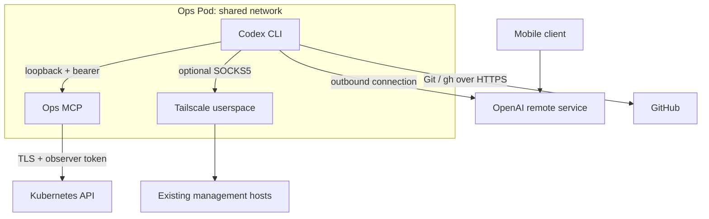

# Codex Ops Pod Architecture

Status: implemented in source; live cluster acceptance and mobile pairing pending
Audience: architecture reader, platform maintainer, security reviewer
Owner: platform operations
Evidence: `charts/ops-pod/`; `ops/pod/`; `tools/ops-mcp/src/`; `scripts/deploy-ops-pod.sh`
Applies to: the persistent Codex Ops Pod, not the separately exposed ChatGPT MCP deployment
Last verified: source and CI checks on 2026-09-06; not a live recovery proof

## Navigation

- [Decision](#decision), [scope](#scope-and-existing-infrastructure), [topology](#runtime-topology)
- [Resources and ownership](#resource-and-ownership-model)
- [Startup and authentication](#startup-authentication-and-process-lifecycle)
- [Authority boundaries](#identity-and-authority-boundaries), [network](#network-dependencies)
- [MCP and pagination](#mcp-requests-and-bounded-results)
- [Build contract](#build-and-release-contract), [failure domains](#failure-domains-and-accepted-trade-offs)
- [Validation](#validation-evidence-and-remaining-live-proof), [source map](#source-map)

## Decision

Run one persistent Kubernetes StatefulSet with a Codex container and a local MCP
sidecar. Install it directly with Helm from the existing administration machine.
Keep host/K3s recovery on the existing management/KVM path. The operator explicitly
accepts that a failure of the host or the cluster dependencies can make this Pod
unreachable. No additional VM is required.

The primary outcome is a persistent, ready-to-pair Codex workspace for mobile
operation. Cluster observations are available through a preconfigured local MCP;
GitHub work uses Git and GitHub CLI. Recovery authority is deliberately separate
from the permanent observer identity.

The [operations runbook](../ops/ops-pod.md) defines installation, acceptance,
diagnosis, maintenance, credential rotation and recovery procedures.

## Scope and existing infrastructure

The Ops Pod is independent of Nova/Buster/Prism execution and of Argo reconciliation.
Its chart is not installed through the pipeline it is meant to diagnose. A stopped
Argo controller does not by itself stop a running Ops Pod. Kubernetes still owns
scheduling, restart, networking, projected credentials and storage.

The existing [ChatGPT Ops bootstrap](../ops/chatgpt-ops-bootstrap.md) is a separate
access path: ChatGPT reaches an exposed MCP through its configured tunnel. This
Pod instead gives the Codex process a loopback MCP connection. The implementations
share MCP source and its image; they have separate deployments and identities.
Installing this chart does not migrate or remove the existing MCP deployment,
Tailscale Operator, Argo installation, or unrelated application namespaces.

This chart installs no pipeline worker, task queue, generic privileged command
executor, backup service, monitoring stack, or cluster repair controller.

## Runtime topology

The remote-service relationship is the intended integration, not evidence of a
successful mobile pairing. There is no inbound NodePort, LoadBalancer, Ingress or
SSH service for this Pod. Its headless Service gives the StatefulSet a service
identity; MCP binds only to `127.0.0.1:8080`. A Service or port-forward addressed to
the Pod IP is not the intended MCP diagnostic path; use in-container verification.

## Resource and ownership model

| Resource | Owner / purpose | Lifecycle |
| --- | --- | --- |
| StatefulSet and headless Service | Helm release `codex-ops` in `kubeclaw-ops` by default | One replica, rolling updates, three controller revisions |
| ServiceAccount, observer roles and bindings | Helm; observer identity | RoleBindings only in configured namespaces; separate cluster-reader binding |
| NetworkPolicy, optional CiliumNetworkPolicy | Helm; Pod traffic boundary | Applied to all containers in the Pod |
| Home and workspace PVCs | StatefulSet claim templates | Retained after ordinary StatefulSet/release deletion |
| Optional Tailscale PVC | Helm resource with keep annotation | Retained on removal; separate from immutable StatefulSet claim templates |
| Bearer, GitHub, Tailscale and pull Secrets | Operator bootstrap / operator | Outside Helm's resource lifecycle; explicit rotation and deletion |
| API credential projection | Kubelet | Short-lived token, requested expiry 3600 seconds; API CA ConfigMap projection |
| Codex auth and user configuration | Codex / operator | Persistent home; sensitive account state |

Do not introduce a second resource owner without migrating ownership explicitly.
Argo may be adopted later, but automatic reconciliation can revert an imperative
recovery change and must be considered during that migration.

### Capacity

| Container | CPU request / limit | Memory request / limit |
| --- | --- | --- |
| Codex | 100m / 2 | 256Mi / 3Gi |
| MCP | 25m / 500m | 64Mi / 512Mi |
| Optional Tailscale | 25m / 500m | 64Mi / 256Mi |

Without Tailscale, requests total 125m and 320Mi; limits total 2.5 CPU and 3584Mi.
With it, requests total 150m and 384Mi; limits total 3 CPU and 3840Mi. Requests are
scheduler reservations, not observed working sets. Limits are per-container,
not a shared pool: unused Codex memory does not raise the MCP limit.

Home requests 2Gi, workspace 20Gi, optional Tailscale state 1Gi. Codex `/tmp` is a
size-limited 1Gi emptyDir; Tailscale `/tmp` is 64Mi. These emptyDirs are ephemeral,
not configured as memory-backed volumes. The chart does not configure ephemeral-
storage resource requests/limits. Actual node disk pressure and storage guarantees
must be assessed at deployment. The default StorageClass is inherited; local-path
storage does not provide recovery from loss of the storage node.

## Startup, authentication and process lifecycle

1. Kubernetes mounts persistent volumes and the MCP bearer. Codex receives no API
   service-account mount. Only MCP receives the projected observer credential.
2. Tini starts the Python supervisor as UID 1000. The supervisor creates the Codex
   configuration only if none exists and configures the GitHub credential helper.
3. It reads the bearer into the environment inherited by the remote-control child.
   It checks `codex login status`, with a 15-second timeout and five-second waits
   while unauthenticated.
4. The operator runs device login through `kubectl exec`. The running supervisor
   notices the persistent login and starts the real foreground remote-control CLI.
5. Pairing is a separate CLI action. A process being alive does not prove that a
   mobile client is connected or that the remote service is reachable.
6. A remote-control exit is recorded and retried after ten seconds. SIGTERM stops
   the child; the supervisor allows ten seconds before killing an unresponsive
   child. The Pod termination grace period is 30 seconds.

The status file is `/tmp/codex-ops-status.json`. Its `pairingVerified` field is
always false: the supervisor does not observe or certify pairing. Codex readiness
checks `remote-process-running`. There is no Codex liveness probe that restarts the
container simply because login or a remote service is unavailable. MCP has local
HTTP health checks executed inside its own container.

Default configuration is copied only on first startup. Updating the image does
not overwrite existing user settings on the home PVC. The supervisor overrides
the local MCP URL and bearer environment-variable setting when launching the
remote process, so that this connection remains attached to the deployed sidecar.

## Identity and authority boundaries

| Identity | Available authority | Explicit boundary |
| --- | --- | --- |
| Bootstrap operator | Install Helm resources, read discovery data and prepare Secrets | Existing administrative context; not mounted permanently into the Pod |
| Codex runtime | Own home/workspace; local MCP bearer; separately supplied GitHub identity | No automatic Kubernetes token, host mount or container-runtime socket |
| MCP observer | `get` and `list` for allowed resource types | No write verbs, Secret/ConfigMap reads, pod exec, port-forward or token minting |
| Optional Tailscale identity | Tailnet connectivity allowed by operator grants | No Kubernetes token, NET_ADMIN or host network |
| Incident operator | Explicit short-lived Kubernetes/SSH authority supplied for a repair | Not an automatic escalation endpoint and not a permanent MCP capability |

Namespaced observer rules cover pods/logs, services, events, PVCs, deployments,
StatefulSets, DaemonSets, ReplicaSets, jobs, cronjobs, ingresses, NetworkPolicies,
CiliumNetworkPolicies and Argo Applications. The reusable ClusterRole does not
make these resources readable everywhere: it is attached through RoleBindings in
selected namespaces. The separate ClusterRoleBinding permits only node and
cluster-wide Cilium policy reads. Not every RBAC-permitted resource has a dedicated
MCP tool. There is no general arbitrary-API or shell-execution MCP tool.

Both primary containers run as UID/GID 1000 with fsGroup 1000, RuntimeDefault
seccomp, read-only root filesystems, no privilege escalation and all capabilities
dropped. They share the Pod network and node kernel; two containers in one Pod are
not independent security domains. Mount separation reduces direct credential
exposure, but does not turn Codex-generated commands into trusted code.

Codex uses `danger-full-access` within the restricted container and `on-request`
approvals. There is no nested Codex OS sandbox. Account credentials, GitHub access,
files in its mounts and network access granted to the Pod are usable by processes
Codex launches. Approvals express operator intent; Kubernetes RBAC and container
configuration enforce the infrastructure boundary. Do not describe the bearer or
an approval prompt as protection against a compromised Codex process.

Logs and workload descriptions may themselves contain sensitive application data.
Read-only access does not mean that output is suitable for public sharing. The
observer has no Secret API permission, but cannot prevent applications from
writing credentials into logs or plain environment-variable specifications.

## Network dependencies

The standard policy denies ingress and allows DNS to kube-system Pods labelled
`k8s-app=kube-dns`, discovered Kubernetes API addresses on 443 and the discovered
HTTPS endpoint port, and public IPv4 HTTPS. Public egress excludes the configured
private, loopback, link-local and carrier-grade NAT ranges. It is not a hostname
allowlist. Custom DNS deployment labels, IPv6-only access and private HTTPS GitHub
or proxy endpoints require explicit policy adaptation.

Cilium CRD detection adds the reserved `kube-apiserver` entity allowance. Detecting
a CRD does not prove that the Cilium agent is healthy. API endpoint discovery is
performed by the deployment helper, not continuously; changed addresses need a
new deployment render. MCP still uses the configured/default API URL and verified
CA; allowed IPs alone do not fix DNS, routing or certificate failures.

Optional Tailscale runs in userspace with SOCKS5 at localhost:1055 and persistent
file state. Kubernetes Secret state storage is disabled. `TS_AUTH_ONCE=true`
reuses the stored login. Public UDP 3478/41641 and HTTPS are permitted by the chart;
actual peer paths depend on networking and tailnet grants. This sidecar does not
install routes into the Codex container, enable Tailscale SSH, provide inbound
mobile access or bypass broken cluster networking. Commands must explicitly use
the proxy to reach tailnet destinations.

## MCP requests and bounded results

MCP accepts authenticated loopback HTTP and calls Kubernetes through HTTPS with
CA and hostname verification. API credentials are read again for each request so
kubelet token rotation does not require an MCP restart. Requests have a ten-second
transport timeout and an 8-MiB response ceiling. Redirects are not followed with the
credential. API error bodies are not echoed as diagnostic output.

List pagination retries only an oversized response, halving its requested item
count while preserving the selector and continuation token. Failed attempts do
not consume the successful-page budget. The successful reduced page size is kept
for the remainder of that list call. A single oversized item still fails; raising
the memory limit does not silently disable the response ceiling.

`namespace_overview` follows list pages and collects mapped summaries. Platform
and Argo list tools return an explicit continuation token and partial indicator
when additional pages remain. Event reads scan pages while keeping only the
newest requested events; pod logs have a separate 64-KiB output bound and describe
history limitations. These controls do not impose a global response, concurrency
or heap budget. Very large collections and simultaneous calls can still exhaust
the MCP's 512-MiB memory limit. Pagination fixes oversized pages, not every possible
memory-pressure scenario.

## Build and release contract

[Build Ops Images](../../.github/workflows/build-ops-mcp.yaml) uses one matrix for
the MCP and Codex images. PR checks install dependencies, run actual Helm/Codex and
MCP tests, build images, and smoke-test the real restricted Codex container without
account credentials. PR images are not published.

Main pushes matching the workflow paths and manual dispatch publish after the
validation steps. The publication build attaches provenance and SBOM data; the
local Docker-loaded validation image omits attestations because that exporter
cannot load the resulting manifest list. The workflow prints immutable registry
digests. Both primary chart images must be supplied by digest. Optional Tailscale
is currently pinned by version tag; base images and apt dependencies are not fully
content-pinned, so this is not a claim of bit-for-bit reproducible builds.

The workflow does not deploy the chart or certify cluster recovery. It does not
verify mobile-account compatibility. A package version change requires an image
build, while a chart resource-limit change requires a chart deployment only.

## Failure domains and accepted trade-offs

| Failure | What can remain available | Recovery authority |
| --- | --- | --- |
| KubeClaw pipeline or agent fails | Codex and MCP, if their dependencies are healthy | Observe, propose Git fix; operator applies/resumes through supported mechanisms |
| Argo controller fails | Existing Pod and direct Kubernetes observations | Existing operator context for imperative remediation |
| MCP API token/RBAC/API access fails | Codex workspace, GitHub and local MCP process may remain available | Diagnose projection, API reachability and exact bindings |
| OpenAI login/remote service fails | Container exec, workspace, possibly local MCP | Existing Kubernetes administration session |
| Cilium/DNS/network fails | Depends on the affected paths; no availability promise | Existing management access outside the failed path |
| API/control plane fails | Running containers may continue; exec and reconciliation cannot be assumed | Existing host/K3s management path |
| Node, runtime or local storage fails | No promised Ops Pod availability | Management/KVM plus storage restore |
| GitHub/registry unavailable | Existing running image and local checkout may remain usable | Local diagnosis; new pulls/pushes/releases can fail |

One replica avoids concurrent writers to one Codex identity and workspace. A
second Pod on the same host would not remove host, CNI, DNS or storage dependence.
A second independently authenticated workspace would be a different design, not
an automatic failover mechanism for this one.

## Validation evidence and remaining live proof

Source tests exercise actual Helm rendering, the pinned Codex executable, local
MCP HTTP handling and HTTPS transport with real sockets/certificates. Transport
fixtures test protocol and pagination behavior; they are not a real Kubernetes
cluster or proof of deployed RBAC. The image smoke test proves unprivileged startup
and configuration loading before login, not remote pairing.

The operator must still prove image pulling, storage binding, network reachability,
positive observer reads, negative Secret authorization, mobile task execution,
PVC persistence after recreation and a usable management fallback. Record image
digests, chart/source revision, date, namespace and actual outcomes. No live
acceptance result is inferred from a green build.

## Source map

| Concern | Authoritative implementation |
| --- | --- |
| Defaults, workloads, storage | [Chart](../../charts/ops-pod/values.yaml), [workload](../../charts/ops-pod/templates/workload.yaml), [Tailscale storage](../../charts/ops-pod/templates/tailscale-storage.yaml) |
| Authorization and traffic | [RBAC](../../charts/ops-pod/templates/rbac.yaml), [network policy](../../charts/ops-pod/templates/network.yaml) |
| Bootstrap and administration | [Deployment helper](../../scripts/deploy-ops-pod.sh), [discovery and Secrets](../../ops/pod/bootstrap.py) |
| Remote process and configuration | [Supervisor](../../ops/pod/supervisor.py), [config](../../ops/pod/config.toml), [image](../../ops/pod/Dockerfile) |
| MCP and API transport | [Server](../../tools/ops-mcp/src/server.mjs), [transport/pagination](../../tools/ops-mcp/src/kubernetes.mjs) |
| Acceptance | [Live verifier](../../ops/pod/verify.py), [Helm/CLI tests](../../ops/pod/test/deployment.test.mjs), [container test](../../ops/pod/test-image.sh) |

## Related documentation

- [Ops Pod operations](../ops/ops-pod.md)
- [Existing ChatGPT MCP deployment](../ops/chatgpt-ops-bootstrap.md)
- [Worker trust operations](../operations/worker-trust-runbook.md)
- [Architecture index](README.md)
