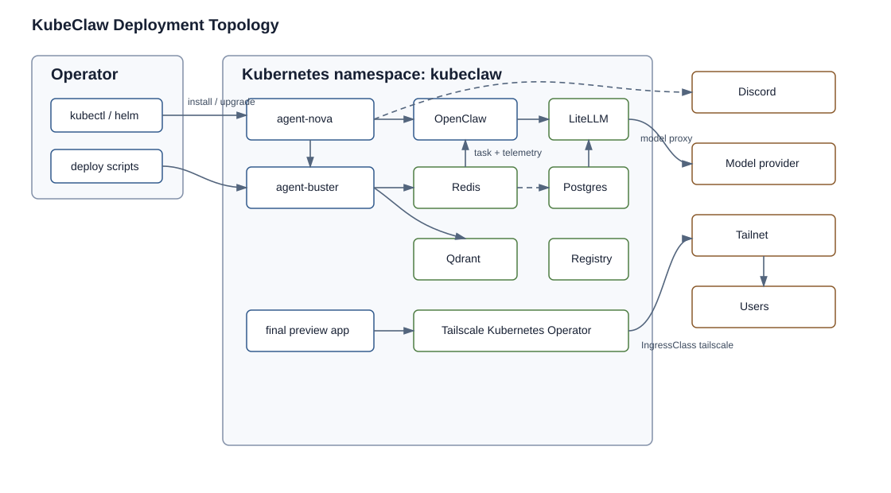

# System Overview

Status: current
Audience: maintainer, operator

## Purpose

Describe the current KubeClaw platform as deployed and executed from this repository.

## Current Behavior

KubeClaw is a two-agent OpenClaw swarm deployed on Kubernetes. The shared Helm chart renders one release per agent. Production values define `agent-nova` and `agent-buster`.



The topology shows the normal operator path into Kubernetes, the Nova/Buster split, shared infrastructure, and external systems that remain upstream-owned.

Nova is the orchestrator. It runs the general image, starts the OpenClaw gateway, owns pipeline scheduling, and dispatches Forge and Echo work through ACP/subagent paths. Nova also has a Prism preview sidecar in the production values that serves `/home/node/.openclaw/workspace/prism/designs` on port `3456`.

Buster is the destructive tester. It runs the sandbox image as one pod with separate `kubeclaw` gateway and `buster-pipeline` worker containers. The pipeline polls Redis for task messages, builds and runs the test environment, runs deterministic suites, writes scoped artifacts, and emits completion messages back to Nova. Gateway-side agent tests run through the colocated OpenClaw gateway container, which keeps the same sandbox execution surface as the pipeline container.

Buster Kubernetes tests are brokered. The Buster runtime creates `BusterNamespaceLease` requests; a separate namespace controller pod owns cluster-level namespace/RBAC/secret-copy work, then binds Buster only inside the leased test namespace. Final preview leases can keep the verified deployment running and expose it through Tailscale ingress.

Redis is the current inter-agent transport and telemetry stream backend. Qdrant is configured as OpenClaw memory storage. LiteLLM is the OpenAI-compatible model proxy. PostgreSQL is configured for LiteLLM state. Registry mirror and registry-local support cached pulls and writable live-verification images.

The Tailscale Kubernetes Operator is installed as required shared infrastructure for final-preview ingress. It consumes `Secret/operator-oauth` in the `tailscale` namespace and owns tailnet proxy resources for final-preview ingress URLs.

## Runtime Boundaries

KubeClaw has three important runtime boundaries:

1. Kubernetes workload boundary: Nova and Buster run as separate Deployments with different images, env, probes, mounts, and security context.
2. OpenClaw gateway boundary: agent sessions are created and monitored through gateway APIs rather than direct in-process calls.
3. Redis task boundary: Buster validation work crosses from Nova to Buster as typed Redis tasks and returns as typed completions or dead letters.

These boundaries are intentional. Nova can own orchestration without carrying the destructive test surface. Buster can own test execution without being allowed to advance scheduler state by itself. Redis can transport task evidence without becoming the lifecycle authority.

The strongest source of scheduler truth is Nova's lifecycle read model and run artifacts. Redis messages, Discord messages, pod logs, and Buster output files are evidence surfaces that Nova validates or projects before changing lifecycle state.

## Control Plane Versus Execution Plane

Control plane:

- `skills/nova/pipeline/cli.ts` parses operator intent.
- `skills/nova/pipeline/core/config.ts` loads platform and project config.
- `skills/nova/pipeline/runners/pipeline-runner.ts` owns the run lock, observer startup, stale-state reconciliation, and state machine entrypoint.
- `skills/nova/pipeline/runners/pipeline-runner-scheduling.ts` projects `execution_order` into the next module, gate, or validator step.
- `skills/nova/pipeline/services/status-store*.ts` persists and projects lifecycle read models.

Execution plane:

- Forge and reviewer work run through configured OpenClaw session dispatch.
- Buster module/gate work runs through Redis task dispatch and the `buster-pipeline` container.
- deterministic Buster suites run inside the sandbox image and write scoped output artifacts.
- k8s final-preview work uses a `BusterNamespaceLease` so namespace/RBAC/secret-copy operations are brokered by the namespace controller rather than by Buster directly.

The split lets operators ask two different questions during debugging:

- "What does Nova believe should happen next?" Check status, lifecycle state, gate projections, and `execution_order`.
- "What evidence did the worker produce?" Check Buster output files, dead-letter streams, suite artifacts, and pod logs.

## How It Fits

Deployment details live in `../deployment/README.md`. Pipeline behavior lives in `../pipeline/README.md`. Exact values and environment variables live in `../reference/README.md`.

## Security And Networking Baseline

Current deployment includes a portable Kubernetes NetworkPolicy baseline. `scripts/deploy.sh infra` applies `my-values/infra/network-policies.yaml` after shared infrastructure and the Buster namespace fence, and teardown removes the same manifest with `kubectl delete -n "$NAMESPACE" -f "$INFRA_DIR/network-policies.yaml" --ignore-not-found`.

The baseline is deliberately standard `networking.k8s.io/v1` NetworkPolicy, so it verifies namespace isolation without relying on Cilium-specific features. It contains 13 policy objects: namespace default-deny ingress/egress, DNS egress, agent egress to Redis/Qdrant/LiteLLM/registries plus TCP `22`, `80`, and `443`, Redis ingress from agents and Clawdeck, Clawdeck Redis egress, Qdrant/LiteLLM/PostgreSQL/registry ingress, LiteLLM and registry-mirror egress, and temporary public ingress for current agent/LiteLLM ports. `tests/verification/deployment/check-deployment-truth.mjs` asserts those selectors and ports.

What remains open is narrower than "missing NetworkPolicies": egress is still port-based rather than FQDN-based, Kubernetes-native observability resources such as ServiceMonitor/PodMonitor are not present, and LiteLLM plus Prism preview still have temporary NodePort exposure. See `../deployment/networking.md`, `../architecture/security-model.md`, and `../open-issues.md` before changing exposure.

Operator verification:

```bash
node tests/verification/deployment/check-deployment-truth.mjs --source-root "$PWD"
rg -n "kind: NetworkPolicy" my-values/infra/network-policies.yaml
```
