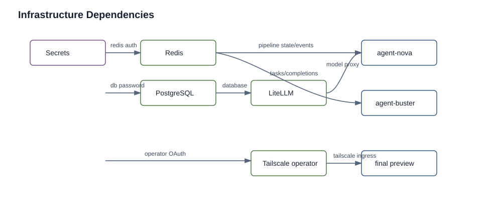

# Infrastructure

Status: current
Audience: operator

## Purpose

Document shared infrastructure deployed by `scripts/deploy.sh infra`.

## Current Behavior

`scripts/deploy.sh infra` installs these required components:



The dependency graph separates shared infrastructure from agent workloads and shows why Redis, model access, registry access, and Tailscale are verified before pipeline final-preview operation.

- Redis with Bitnami Helm values from `my-values/infra/redis-values.yaml`
- registry mirror from `my-values/infra/registry-mirror.yaml`
- writable registry-local from `my-values/infra/registry-local.yaml`
- Buster namespace fence from `my-values/infra/buster-namespace-fence.yaml`
- Tailscale Kubernetes Operator with the official `tailscale/tailscale-operator` Helm chart and `my-values/infra/tailscale-operator-values.yaml`

It also installs these optional components by default unless disabled:

- PostgreSQL with Bitnami Helm values from `my-values/infra/postgresql-values.yaml`
- Qdrant with Qdrant Helm values from `my-values/infra/qdrant-values.yaml`
- LiteLLM by creating `litellm-config` from `my-values/infra/litellm-config.yaml` and applying `my-values/infra/litellm-deployment.yaml`

Infrastructure is not part of the agent Helm chart. Redis, PostgreSQL, Qdrant, and the Tailscale Kubernetes Operator are installed from external Helm charts. LiteLLM, registry mirror, registry-local, and the namespace fence are raw Kubernetes manifests applied by `kubectl`.

Infra deployment fails closed when an enabled or required component does not become ready. Helm-managed Redis/PostgreSQL/Qdrant use Helm `--wait`; raw LiteLLM, registry mirror, and registry-local manifests use explicit rollout waits. Operators can set `ALLOW_PARTIAL_INFRA=1` only for deliberate troubleshooting runs that should continue after a rollout failure.

Operators can disable optional component deployment with:

- `KUBECLAW_DEPLOY_POSTGRESQL=false`
- `KUBECLAW_DEPLOY_QDRANT=false`
- `KUBECLAW_DEPLOY_LITELLM=false`
- `ALLOW_PARTIAL_INFRA=1` for explicit partial-infra troubleshooting

The secret helper uses the same optional switches, so disabled optional components do not prompt for their component-specific Secrets. Redis, registry mirror, registry-local, the Buster namespace fence, agents, GHCR pull credentials, Git deploy keys, and Tailscale OAuth are required for the normal deployment path.

## Upstream Versus KubeClaw Responsibility

KubeClaw owns the local install commands, values files, Secrets, rollout waits, Services, probes, and recovery steps documented here.

Upstream projects own their component behavior, chart semantics, APIs, and production hardening guidance:

- Redis/Bitnami chart behavior: <https://github.com/bitnami/charts/blob/main/bitnami/redis/README.md>
- PostgreSQL/Bitnami chart behavior: <https://github.com/bitnami/charts/blob/main/bitnami/postgresql/README.md>
- Qdrant Kubernetes/Helm behavior: <https://qdrant.tech/documentation/installation/>
- LiteLLM proxy/provider behavior: <https://docs.litellm.ai/>
- Tailscale Kubernetes Operator behavior: <https://tailscale.com/docs/kubernetes-operator>
- Tailscale ingress behavior: <https://tailscale.com/docs/kubernetes-operator/ingress>

Use upstream docs for production sizing, backup/restore, high availability, provider-specific model setup, OAuth scope details, and chart version behavior. Use KubeClaw docs for the local values, Secret names, install order, verification commands, and recovery procedures in this repository.

## Runtime Roles

Redis is the inter-agent transport for Buster tasks, completions, telemetry, and audit flows. The values use standalone Redis with auth enabled and password from `redis-secrets`.

PostgreSQL is configured for LiteLLM with database/user `litellm` and credentials from `postgresql-secrets`.

Qdrant is the OpenClaw memory vector store. The agent chart points agents at `http://qdrant.kubeclaw.svc.cluster.local:6333`.

LiteLLM exposes an OpenAI-compatible endpoint on service port `4000` and NodePort `30050`. Its ConfigMap currently routes Gemini and Claude model names through Vertex AI parameters and reads `LITELLM_MASTER_KEY` from `litellm-secrets`.

`registry-mirror` is a ClusterIP Docker Hub pull-through cache with a persistent 5Gi cache PVC. `registry-local` is a writable, ephemeral `registry:2` ClusterIP service for in-cluster registry access.

The Buster namespace fence is a cluster-scoped ValidatingAdmissionPolicy plus binding. It denies direct namespace create/delete requests by `system:serviceaccount:kubeclaw:agent-buster` and constrains `system:serviceaccount:kubeclaw:agent-buster-namespace-controller` to labeled KubeClaw-managed namespaces beginning with `test-`.

The Tailscale Kubernetes Operator is installed in namespace `tailscale` by default and creates the `tailscale` IngressClass. Buster final-preview leases create `Ingress` resources with `ingressClassName: tailscale`; the operator creates proxy workloads and publishes the tailnet HTTPS URL in ingress status.

The Tailscale chart consumes `Secret/operator-oauth` in namespace `tailscale` with keys `client_id` and `client_secret`. KubeClaw keeps OAuth values out of repository values files. Non-secret operator settings live in `my-values/infra/tailscale-operator-values.yaml`.

`./scripts/deploy.sh setup` runs the secret helper automatically when a TTY is available, and `./scripts/deploy.sh secrets` can be rerun any time. The helper prompts for missing Tailscale OAuth values and creates the Secret before `infra` installs the operator.

Operator install modes:

- `TAILSCALE_OPERATOR_ENABLED=true` (default): require `tailscale/operator-oauth` and fail closed when missing
- `TAILSCALE_OPERATOR_ENABLED=false`: skip installation

Create the Secret directly:

```bash
kubectl create namespace tailscale --dry-run=client -o yaml | kubectl apply -f -
kubectl create secret generic operator-oauth \
  -n tailscale \
  --from-literal=client_id="..." \
  --from-literal=client_secret="..."
./scripts/deploy.sh tailscale
```

`./my-values/setup-secrets.sh` can also create that Secret from temporary `TAILSCALE_OAUTH_CLIENT_ID` and `TAILSCALE_OAUTH_CLIENT_SECRET` env vars. `./scripts/deploy.sh infra` runs the same operator helper, so `./scripts/deploy.sh all` installs the operator after the guided secret setup has created or reused the Secret.

## Deploy

Install all enabled infrastructure:

```bash
./scripts/deploy.sh infra
```

Install individual shared components when troubleshooting:

```bash
./scripts/deploy.sh redis
./scripts/deploy.sh qdrant
./scripts/deploy.sh litellm
./scripts/deploy.sh tailscale
```

## Verification

```bash
kubectl -n kubeclaw get pods
kubectl -n kubeclaw get svc redis-master qdrant litellm registry-local registry-mirror
kubectl -n tailscale get pods
kubectl get ingressclass tailscale
```

Successful infrastructure has ready Redis, registry-local, registry-mirror, and the Buster namespace controller. PostgreSQL, Qdrant, LiteLLM, and Tailscale are present when their deployment toggles are enabled.

## Common Failures

- `redis-secrets` missing: rerun `./scripts/deploy.sh secrets`, then `./scripts/deploy.sh redis`.
- LiteLLM rollout fails: verify `litellm-secrets`, `google-sa-key`, and PostgreSQL readiness.
- Tailscale operator pending: verify `tailscale/operator-oauth` and upstream tailnet OAuth/tag policy.
- Registry pods not ready: inspect rollout events and PVC/image pull errors.
- `ALLOW_PARTIAL_INFRA=1` used: document which components were skipped before deploying agents.

## Dependency Compatibility

Source-proven current versions and assumptions:

- Kubernetes: `ValidatingAdmissionPolicy` in `admissionregistration.k8s.io/v1`; the infra comment states GA since Kubernetes 1.30.
- Helm: required by `scripts/deploy.sh`, deployment truth, and full verification; no minimum version is declared in source.
- kubeconform: required by deployment truth and full verification; no minimum version is declared in source.
- Tailscale Kubernetes Operator: installed from `https://pkgs.tailscale.com/helmcharts`; requires a tailnet OAuth client. Use upstream Tailscale docs for current OAuth scope and tailnet policy details.
- Redis: Bitnami chart, standalone architecture, password from `redis-secrets`.
- Qdrant: Qdrant Helm chart, single replica, 15Gi persistence.
- PostgreSQL: Bitnami chart, standalone, existing secret `postgresql-secrets`, database/user `litellm`.
- LiteLLM: raw image `ghcr.io/berriai/litellm:main-latest`, NodePort `30050`, model config for Vertex AI Gemini and Claude routes.
- Registry images: `registry:2` for mirror and local registry.
- Agent images: GHCR KubeClaw images currently use `latest` tags in production values.
- OpenClaw base image: the general and Buster gateway Dockerfiles share OpenClaw `2026.7.1` pinned by manifest digest; the nightly CI check compares that digest with the current `latest` release and requires intentional source updates on drift.
- NetworkPolicy: `my-values/infra/network-policies.yaml` applies default-deny ingress/egress with explicit allowances for DNS, agent service access, Clawdeck Redis access, LiteLLM provider/PostgreSQL access, and registry-mirror upstream pulls.

Known unverified compatibility details:

- exact supported Kubernetes/K3s version range
- exact Helm/kubeconform minimum versions
- exact tested Tailscale operator chart version
- exact tested Redis/Qdrant/PostgreSQL/LiteLLM chart versions
- production model/provider compatibility beyond the configured LiteLLM model names and Vertex AI parameters
