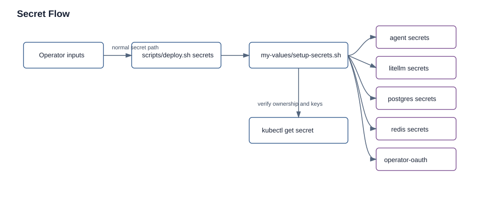

# Secrets

Status: current
Audience: operator

## Purpose

List current secret inputs, setup paths, and known handling risks.

## Current Behavior

Production values reference `openclaw-shared-secrets` for:



The secret flow starts with operator inputs and `scripts/deploy.sh secrets`, then fans out into component-owned Kubernetes Secrets that deployment and verification commands inspect.

- `gatewayToken-nova`
- `gatewayToken-buster`
- `anthropicApiKey`
- `stitchApiKey`
- `discordToken-nova`
- `discordToken-buster`
- `discordWebhook`

`litellmApiKey` is required only when optional LiteLLM infrastructure is deployed.

Git deploy keys are referenced separately as `git-deploy-key-nova` and `git-deploy-key-buster`.

Redis uses `redis-secrets` with key `redis-password`.

LiteLLM is optional. When deployed, it requires `litellm-secrets` and `google-sa-key`.

PostgreSQL is optional. When deployed, it uses `postgresql-secrets` with keys `postgres-password` and `litellm-password`.

Tailscale Kubernetes Operator installation uses `operator-oauth` in the `tailscale` namespace:

- `client_id`
- `client_secret`

The official Tailscale Helm chart mounts that Secret when `oauth.clientId` and `oauth.clientSecret` are empty. `my-values/infra/tailscale-operator-values.yaml` keeps those OAuth values empty so credentials stay in Kubernetes Secrets, not values files.

`scripts/deploy.sh setup` runs the secret setup helper automatically when a TTY is available. Operators can rerun it directly with:

```bash
./scripts/deploy.sh secrets
```

`TTY` means an interactive terminal. When a TTY is available, the script can safely prompt for pasted values. `SRC_NS` is the source namespace used when copying already-created Secrets into the deployment namespace; it defaults to `default`.

When `NAMESPACE` is unset and a TTY is available, `scripts/deploy.sh setup` and `scripts/deploy.sh secrets` ask for the workspace namespace every time. If `my-values/.workspace-namespace` exists, the remembered namespace is shown as the default; pressing Enter accepts it, and typing a new namespace switches the deployment target and remembers the new value. Operators can still set `NAMESPACE` directly for automation.

`my-values/setup-secrets.sh` resolves each Secret in this order:

1. reuse an existing target Secret when all required keys are present
2. create from the configured SOPS file when present
3. copy from `SRC_NS`
4. prompt the operator interactively when a TTY is available

For existing deployments, the helper checks required keys inside each Secret. If a Secret exists but is missing keys and interactive mode is available, it prompts only for the missing values and patches those keys into the existing Secret. This supports incremental additions such as enabling LiteLLM or Tailscale later.

Secret prompts are component-aware. Only Qdrant, LiteLLM, and PostgreSQL are optional; Qdrant has no Kubernetes Secret. Disabled optional components do not ask for their component-specific Secrets:

- `KUBECLAW_DEPLOY_LITELLM=false` skips `litellm-secrets` and `google-sa-key`
- `KUBECLAW_DEPLOY_POSTGRESQL=false` skips `postgresql-secrets`; if LiteLLM stays enabled, the helper asks for a direct LiteLLM `DATABASE_URL`

Required prompts are always part of the guided setup because the platform needs them to run: `openclaw-shared-secrets`, `redis-secrets`, `ghcr-secret`, both Git deploy key Secrets, and `tailscale/operator-oauth`.

The prompt path creates:

- `openclaw-shared-secrets`
- `redis-secrets`
- `postgresql-secrets` when `KUBECLAW_DEPLOY_POSTGRESQL=true`
- `litellm-secrets` when `KUBECLAW_DEPLOY_LITELLM=true`
- `google-sa-key` when `KUBECLAW_DEPLOY_LITELLM=true`
- `ghcr-secret`
- `git-deploy-key-nova`
- `git-deploy-key-buster`
- `tailscale/operator-oauth`

Prompt mode is controlled by `KUBECLAW_SECRET_SETUP_MODE=auto|interactive|noninteractive`. `auto` prompts only when a terminal is available. Existing Secrets are reused unless `KUBECLAW_SECRETS_OVERWRITE=true`.

`my-values/setup-secrets.sh` can also create `tailscale/operator-oauth` from temporary `TAILSCALE_OAUTH_CLIENT_ID` and `TAILSCALE_OAUTH_CLIENT_SECRET` env vars, or copy `operator-oauth` from `SRC_NS`.

Generated internal values are used for Redis, optional PostgreSQL, optional LiteLLM, and OpenClaw gateway tokens when the operator leaves those prompt fields blank. Pasted external credentials are required for model/provider tokens, Discord tokens, webhook URL, GHCR pull access, optional Google service account JSON, Git deploy keys, and Tailscale OAuth.

The helper keeps LiteLLM values aligned by reusing `openclaw-shared-secrets.litellmApiKey` for `litellm-secrets.LITELLM_MASTER_KEY` and `postgresql-secrets.litellm-password` for `litellm-secrets.DATABASE_URL` when those values are created or readable.

The chart can render a Secret when direct token/API key values are supplied instead of `existingSecret`, but production values use existing secrets.

Agent init keeps the retained config PVC secret-free. `/config/openclaw.json` remains the editable source with LiteLLM and Discord token placeholders; each pod start renders the current secret values into `emptyDir` runtime files overlaid at `/home/node/.openclaw/openclaw.json` and `/home/node/.openclaw/swarm.config.json`. `DISCORD_WEBHOOK` is also mapped only into the runtime `swarm.config.json`, not the retained source file.

## Procedure

Interactive setup:

```bash
./scripts/deploy.sh secrets
```

Noninteractive Tailscale OAuth setup:

```bash
export TAILSCALE_OAUTH_CLIENT_ID="<oauth-client-id>"
export TAILSCALE_OAUTH_CLIENT_SECRET="<oauth-client-secret>"
./scripts/deploy.sh secrets
```

Use component toggles before running the helper when optional infrastructure is intentionally disabled:

```bash
export KUBECLAW_DEPLOY_LITELLM=false
export KUBECLAW_DEPLOY_POSTGRESQL=false
./scripts/deploy.sh secrets
```

## Verify Required Secrets

For the normal full deployment path:

```bash
kubectl -n "$NAMESPACE" get secret \
  openclaw-shared-secrets \
  redis-secrets \
  ghcr-secret \
  git-deploy-key-nova \
  git-deploy-key-buster
```

For LiteLLM with bundled PostgreSQL:

```bash
kubectl -n "$NAMESPACE" get secret \
  postgresql-secrets \
  litellm-secrets \
  google-sa-key
```

For final-preview Tailscale:

```bash
kubectl -n tailscale get secret operator-oauth
```

Use the generated reference for exact keys:

```bash
sed -n '1,180p' docs/reference/secrets.md
```

## Recovery

Rerun guided secret setup when a Secret is missing or has missing keys:

```bash
KUBECLAW_SECRET_SETUP_MODE=interactive ./scripts/deploy.sh secrets
```

Rerun setup from a noninteractive environment only after providing source Secrets, SOPS input, or bootstrap environment variables:

```bash
KUBECLAW_SECRET_SETUP_MODE=noninteractive ./scripts/deploy.sh secrets
```

Create the Tailscale OAuth Secret directly when final-preview setup must be automated:

```bash
kubectl create namespace tailscale --dry-run=client -o yaml | kubectl apply -f -
kubectl create secret generic operator-oauth -n tailscale \
  --from-literal=client_id="<tailnet-oauth-client-id>" \
  --from-literal=client_secret="<tailnet-oauth-client-secret>"
```

After recovery, redeploy affected components:

```bash
./scripts/deploy.sh infra
./scripts/deploy.sh agents
./scripts/deploy.sh smoke
```

## Related reference

- `../reference/secrets.md`
- `../reference/environment-variables.md`
- `../examples/secrets/placeholder-secrets.md`
