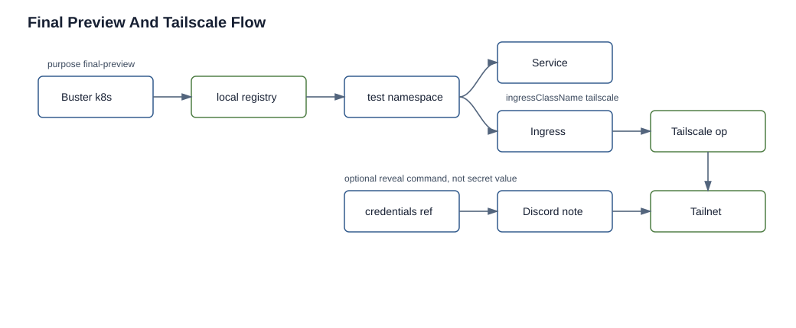

# Final Preview Tailscale

Status: current
Audience: platform operator

## Purpose

Set up tailnet exposure for final Buster k8s previews.

## Architecture

Final previews are created by the Buster k8s suite through `BusterNamespaceLease`.



The final-preview path keeps image build, namespace deployment, Tailscale ingress, tailnet URL publication, and credential retrieval evidence separate.

The flow is:

1. Buster builds and pushes the app image to registry-local.
2. Buster creates a `BusterNamespaceLease` with `purpose: final-preview`.
3. The namespace controller creates the preview namespace, namespace-local RBAC, copied runtime secrets, and application manifests.
4. The controller creates an `Ingress` with `ingressClassName: tailscale`.
5. The Tailscale Kubernetes Operator creates tailnet proxy resources and publishes the HTTPS URL in ingress status.
6. Nova reads the final k8s verdict metadata and sends the URL plus credential retrieval command to Discord.

The Tailscale operator is not part of the KubeClaw agent Helm chart. It is installed by `scripts/deploy.sh` as shared infrastructure.

## Tailnet Prerequisites

In Tailscale:

- create or verify `tag:k8s-operator`
- create or verify `tag:k8s`
- make `tag:k8s-operator` an owner of `tag:k8s`
- create an OAuth client for the operator with the required write scopes for Kubernetes operator operation

Use the official Tailscale operator install docs as the authority for current tailnet policy and OAuth scope details:

- `https://tailscale.com/docs/kubernetes-operator/install-operator`
- `https://tailscale.com/docs/kubernetes-operator/ingress`

## Kubernetes Secret

The Tailscale Helm chart expects `Secret/operator-oauth` in the operator namespace when `oauth.clientId` and `oauth.clientSecret` are empty. KubeClaw uses that Secret-first path.

The normal operator path is the KubeClaw secret setup helper:

```bash
./scripts/deploy.sh secrets
```

When a TTY is available, the helper asks for the Tailscale OAuth client ID and secret and creates `tailscale/operator-oauth`.

Create it manually instead when running non-interactively:

```bash
kubectl create namespace tailscale --dry-run=client -o yaml | kubectl apply -f -
kubectl create secret generic operator-oauth \
  -n tailscale \
  --from-literal=client_id="<oauth-client-id>" \
  --from-literal=client_secret="<oauth-client-secret>"
```

Or let the helper create it from temporary environment variables:

```bash
export TAILSCALE_OAUTH_CLIENT_ID="<oauth-client-id>"
export TAILSCALE_OAUTH_CLIENT_SECRET="<oauth-client-secret>"
./scripts/deploy.sh secrets
```

The helper creates `tailscale/operator-oauth` with keys `client_id` and `client_secret`. If those env vars are not set, it attempts to copy `operator-oauth` from `SRC_NS`; when interactive mode is available, it prompts instead of leaving the operator to discover the missing Secret during infra install.

## Deploy

Install only Tailscale:

```bash
./scripts/deploy.sh tailscale
```

Install with all infrastructure:

```bash
./scripts/deploy.sh infra
```

`infra` runs the Tailscale helper automatically. Default mode is `TAILSCALE_OPERATOR_ENABLED=true`: if `tailscale/operator-oauth` is missing, the operator install fails closed so final-preview ingress is not silently unavailable.

Force the install to fail closed when the Secret is missing:

```bash
TAILSCALE_OPERATOR_ENABLED=true ./scripts/deploy.sh tailscale
```

Disable it explicitly only for non-preview development setups:

```bash
TAILSCALE_OPERATOR_ENABLED=false ./scripts/deploy.sh infra
```

Values live in:

```text
my-values/infra/tailscale-operator-values.yaml
```

The file configures the IngressClass, operator tag, proxy tag, CRD install behavior, and resource requests/limits. It does not contain OAuth credentials.

## Verify

```bash
kubectl get pods -n tailscale
kubectl get secret operator-oauth -n tailscale
kubectl get ingressclass tailscale
```

For a completed final preview:

```bash
kubectl get busternamespacelease -n kubeclaw
kubectl get ingress -A -l kubeclaw/managed-by=buster-namespace-controller
```

The preview URL should appear in the lease status and in the k8s verdict metadata.

## progress.json Shape

Final Buster gates use the k8s suite config in project `.swarm/progress.json`:

```json
"test_suites": ["k8s"],
"test_config": {
  "k8s": {
    "dockerfile": "Projects/<name>/src/Dockerfile",
    "image_name": "<app>",
    "service_name": "<k8s-service-name>",
    "manifests": ["Projects/<name>/src/k8s/<app>-all.yaml"],
    "port": 3000,
    "health_path": "/health",
    "purpose": "final-preview",
    "cleanup_policy": "keep",
    "test_credentials": [
      {
        "secret_name": "<preview-login-secret>",
        "keys": ["username", "password"],
        "purpose": "login to the app under test"
      }
    ],
    "preview": {
      "provider": "tailscale-ingress",
      "path": "/",
      "credentials_ref": "secret/<preview-login-secret>",
      "reveal_credentials": true,
      "credentials_keys": ["username", "password"]
    }
  }
}
```

Normal module/pretest runs should keep the default `purpose: pretest` and `cleanup_policy: delete`. Use `test_credentials` only for app-under-test login values Buster needs in prompt context; do not include infrastructure, registry, deploy-key, provider, or production Secrets.

## Troubleshooting

`Skipping Tailscale operator install`

Run `./scripts/deploy.sh secrets`, create `tailscale/operator-oauth`, or set temporary `TAILSCALE_OAUTH_CLIENT_ID` and `TAILSCALE_OAUTH_CLIENT_SECRET` before rerunning the Tailscale install.

`ingressclass tailscale not found`

Run `./scripts/deploy.sh tailscale` and check the operator pod logs in namespace `tailscale`.

Preview URL stays pending

Check the app Service name/port in `progress.json`, then inspect:

```bash
kubectl describe ingress -A -l kubeclaw/managed-by=buster-namespace-controller
kubectl logs -n tailscale deployment/tailscale-operator
```

Discord has URL but no credential command

Confirm `preview.reveal_credentials: true`, `preview.credentials_ref` or `preview.credentials_secret_name`, and that the app manifests create the referenced Secret with the listed `credentials_keys` in the leased namespace. Preview credentials stay in Kubernetes Secrets; Nova should post a copy-paste `kubectl` command instead of plaintext login values.
