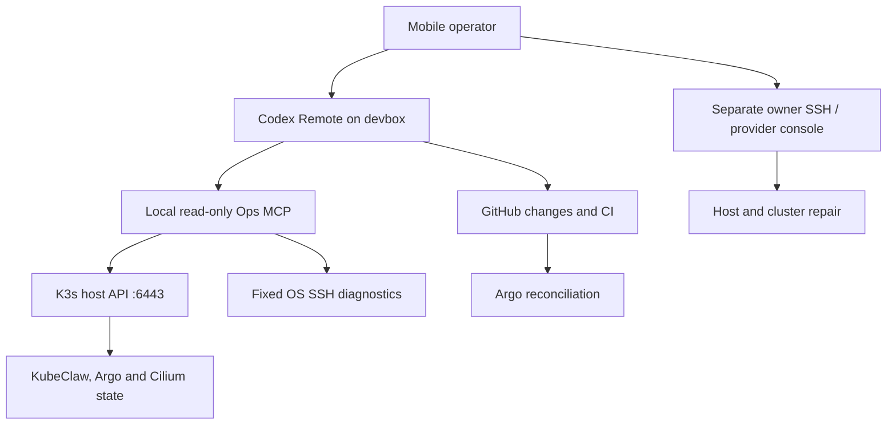

# External operations and recovery devbox

Status: implementation candidate; no production deployment or recovery drill performed.
Source baseline: `fcd70d9257925836dfd13e75626b38369cb265d1` (`main`, inspected 2026-09-06).
Cilium design reference: PR #2 head `1313cc3a89d74ce11d93666fad1a4b9a0f48e308`.
Pipeline reliability remains the separate PR #3; this change does not depend on it.

## Decision

Use one small, independent Linux VM, on a different physical host from the K3s
node. Start with **2 vCPU, 4 GiB RAM, 40 GiB SSD**. This is a sizing estimate,
not a benchmark. Use 4 vCPU/8 GiB if full local builds or browser tests become
routine. The devbox is for diagnosis and small fixes; CI remains the build/test
executor. No local LLM, Kubernetes, database, Redis, Docker socket or second
pipeline is required. Model calls occur when the operator requests work.

Use the existing provider if it can guarantee a separate failure domain. A VM
on the AX41 being repaired does not meet the objective. A second provider is
optional; it protects against a provider outage at the cost of another account.
No VM has been ordered and no provider price is assumed here.

Run the existing Node Ops MCP and Codex Remote as separate systemd services and
Unix accounts. Keep the runtime root-owned, outside Codex's writable checkout.
Use native OS Tailscale on both machines, plus ordinary OpenSSH. The Tailscale
Kubernetes Operator is not part of the recovery path.



There is no dependency from the devbox to cluster DNS, ingress, Redis, SPIRE,
Argo, the KubeClaw registry or agent dispatch. Internet, the VM OS, the OpenAI
service and the chosen network path remain dependencies. This is an independent
operations path, not high availability for a failed physical K3s node.

## What the repository actually establishes

The complete repository tree was inventoried (2,408 tree entries); the deployment,
Helm values, manifests, Ops MCP and relevant recovery/identity documentation were
examined for this design. This is an infrastructure dependency analysis, not a
new line-by-line audit of every pipeline source file. No live host inventory,
Ansible inventory, provider credentials or cluster kubeconfig was supplied.

| Evidence | Finding | Consequence |
| --- | --- | --- |
| `scripts/deploy.sh`, `my-values/infra/k3s-registries.yaml` | K3s-oriented deployment; imperative setup and separate infra/agent commands | Keep the host's existing management path; do not run `all` as recovery |
| `my-values/infra/ops-mcp.yaml`, `ops-mcp-tunnel.yaml` | MCP and tunnel currently run as cluster Deployments | Both can disappear in the failure they should diagnose |
| `tools/ops-mcp/src/server.mjs` | API reads use an in-pod token path and cluster DNS by default | Add native external token/CA/API settings to the same server |
| `my-values/infra/argocd-*.yaml`, `scripts/deploy-argocd.sh` | Argo chart 10.8.0; private UI through the operator | Read Application CRs directly if Argo UI/controllers fail |
| Cilium PR #2 | Cilium 1.20.1, VXLAN, 10.42.0.0/16, kube-proxy retained, Hubble Relay ClusterIP | Do not depend on Relay, CNI or a Service IP for recovery |
| `my-values/nova-values.yaml`, `buster-values.yaml`, `prism-values.yaml` | Nova/Buster/Prism depend on gateway/runtime, storage, services and worker identity | Diagnose the full dependency chain before restarting agents |
| `my-values/infra/spire-values.yaml`, `docs/operations/worker-trust-runbook.md` | SPIRE/Envoy identity and source attestation protect worker traffic | Never repair by disabling mTLS or source verification |
| chart persistence and infra values | Agent PVCs, Prism artifacts/Postgres, Redis, Qdrant and registry storage | A Git checkout or K3s datastore snapshot alone cannot restore application data |
| production values | Several application images still use `latest` | Record deployed digests; a tag alone is not a reproducible rollback |

The inspected `main` tree does not contain Cilium files, while the PR #2 metadata
reports it merged. Treat the two exact source revisions separately. Before
deployment reconcile the chosen Git revision with the actual cluster and confirm
whether Flannel or Cilium is active. Do not infer installed state from a PR badge.
The repo does not prove the current datastore mode, PV backend, backups, firewall
rules, host IPs, Tailscale policy, deployed revisions or Argo Applications.

## Access and authority

| Identity | Permanent authority | Explicitly absent |
| --- | --- | --- |
| `kubeclaw-codex` on devbox | Writable repo workspace; local MCP bearer; separately scoped GitHub access | sudo, root SSH, Kubernetes credentials, Docker group/socket, provider API key |
| `kubeclaw-mcp` on devbox | Observer token; two forced-command SSH keys | Kubernetes writes, Secret/ConfigMap reads, exec, port-forward, node proxy, root shell |
| `kubeclaw-observer` on K3s host | Exact no-argument diagnostic and token-mint helpers via sudo | General commands through its SSH keys, forwarding, PTY, arbitrary sudo arguments |
| Owner break-glass identity | Existing independent host administration and provider rescue console | Credentials in the normal Codex/MCP account or the repo |

The external RBAC has namespaced read RoleBindings for KubeClaw and the platform
namespaces, and a separate cluster binding for only Nodes and global Cilium
policies. **Paperless is excluded by default.** Customize the actual Tailscale and
SPIRE namespaces in `render-rbac.py --namespaces ...`; no namespace is created
except the identity-only `kubeclaw-ops` namespace. Bind only namespaces that exist.
RBAC is authoritative even if an agent edits its prompts or local config.

Keep normal changes Git-first: branch, real tests, PR, owner merge, Argo sync.
Give the GitHub credential only the intended repositories: Contents and Pull
requests write, Actions read as needed. Do not give account administration,
Secrets management or workflow-write rights by default. Protect the production
branch without a bypass for the devbox identity. No CI job runs on this machine,
and no webhook launches privileged recovery code.

Break glass is a **separate owner-controlled session**. The agent can diagnose,
prepare a concrete repair command/diff and explain its blast radius; the owner
executes the privileged step through their separate SSH/rescue access. There is
no fake TTL implemented by deleting a key file after giving an agent root: that
would not revoke copied credentials or an established root process. Adding
agent-executable privileged operations later requires specific server-enforced
capabilities. A generic privileged MCP shell is deliberately not part of v1.

## Credential lifecycle

The K3s host helper creates a TokenRequest for the exact service account
`system:serviceaccount:kubeclaw-ops:external-ops`, requesting 24 hours. The devbox
renews hourly via OS SSH and atomically replaces its mode-0600 token file. Failed
renewal keeps the last token; the server re-reads it per request. The helper cannot
mint an administrator token or accept another namespace, subject or duration.
Actual lifetime is checked: less than two hours fails visibly. If the API enforces
a shorter maximum, adapt the renewal schedule and safety threshold together.

Expiry during an API outage does not remove host diagnostics. Once K3s returns,
the next SSH renewal obtains a fresh token without using the expired credential.
This avoids the bootstrap cycle of requiring a working cluster workload to
refresh external access. Losing the SSH key or API CA is still an operator event.

Deleting the external service account and removing the two observer SSH keys
revokes access; deleting only a RoleBinding in one namespace does not revoke other
bindings. Rotate observer keys independently from owner recovery credentials.
Replace the MCP bearer and restart MCP/Codex when rotating local client access.
Do not back up active Codex sessions/tokens into a broadly accessible repo.

## Network contract

1. Devbox and K3s host run their own `tailscaled` services. No subnet router or
   in-cluster proxy is required between them.
2. MCP binds **127.0.0.1:8080** with a mandatory random bearer token. Codex calls
   that URL on the same VM. No public MCP or app-server listener is opened.
3. The devbox reaches the host's OS Tailscale IP on SSH/22 and K3s API/6443.
   The API certificate must contain that IP or a verified host DNS SAN. Copy only
   the public CA certificate to the devbox; never disable certificate verification.
4. Keep 6443 closed on the public interface. Verify existing host/provider
   firewalls before changing them. No kubelet/10250, etcd/2379 or registry access
   is needed for the observer.
5. `tailscale-policy.example.json` is a policy **fragment**, not a replacement for
   your tailnet ACL. Merge and validate against all existing grants. Permissions
   are additive: an existing allow-all can defeat the intended restriction. Its
   negative tests must pass. Preserve your separate owner-to-host recovery grant.
6. Keep an owner-managed provider console/rescue route for a dead host firewall,
   failed Tailscale or network outage. Do not put provider credentials on the box.
   Cilium host-firewall policies, if enabled later, must explicitly preserve this
   path and be tested before rollout. Current workload policies do not establish
   that guarantee.

## Bootstrap and activation

Use a supported Debian/Ubuntu system with systemd and native Tailscale. Install
Git, Python 3, OpenSSH client, Node >=22, kubectl matching the server's supported
skew, Helm and a pinned Codex CLI. Optional `gh`/Cilium CLI are operator tools.
Record actual versions and checksums in the installation record. The installer
does not invent current release pins or pipe network installers into root.

### 1. Prepare independent host access

Confirm the host SSH fingerprint through your existing trusted host session or
provider console. `ssh-keyscan` alone is not identity verification. Record the
literal Tailscale IP and API SAN; preserve existing K3s config when adding a SAN.
Any K3s restart for certificate/listener configuration is a separate maintenance
step with Paperless and pipeline checks, not part of the devbox installer.

On the K3s host, create the dedicated `kubeclaw-observer` account with locked
password and a shell capable of running forced commands. Install the two files
from `ops/devbox/host/` in `/usr/local/libexec/`, root:root 0755. Install `sudoers`
as `/etc/sudoers.d/kubeclaw-observer`, root:root 0440, then validate with
`visudo -cf /etc/sudoers.d/kubeclaw-observer`. Check the actual `k3s` binary path
matches `/usr/local/bin/k3s` before enabling the token helper.

Generate two dedicated Ed25519 keys on the devbox. Install their public keys on
the host with these distinct authorized-key options (append the real public key):

```text
restrict,command="/usr/bin/sudo -n /usr/local/libexec/kubeclaw-host-diagnostics" ssh-ed25519 ... diagnostics
restrict,command="/usr/bin/sudo -n /usr/local/libexec/kubeclaw-mint-ops-token" ssh-ed25519 ... token
```

Keep the observer's authorized_keys and its parent directories root-owned and
non-writable by the observer. Do not allow SSH environment injection, user RC
commands or alternate unrestricted keys for this account. Use OpenSSH over
Tailscale, not a Tailscale SSH rule granting this account a general shell.

### 2. Install observer RBAC

Render with actual existing namespaces. Inspect the JSON and apply once using
your owner kubeconfig. For example:

```bash
python3 ops/devbox/render-rbac.py --namespaces kubeclaw,argocd,kube-system,tailscale,spire-server,spire-system > /tmp/external-ops-rbac.json
kubectl --context YOUR_CONFIRMED_ADMIN_CONTEXT apply -f /tmp/external-ops-rbac.json
```

Add `cilium` only after that namespace exists. Commit the reviewed rendered
resources to one explicitly owned GitOps directory if Argo will manage them.
Retain the source/rendered copy on the devbox for recovery. Never point Argo at
all of `my-values/infra`, which mixes values and manifests with different owners.

### 3. Install devbox services

On the devbox, from the reviewed checkout:

```bash
npm ci --ignore-scripts --prefix tools/ops-mcp
npm test --prefix tools/ops-mcp
sudo bash ops/devbox/install.sh
```

Complete `/etc/kubeclaw-ops/ops.env` and `ssh_config`; no placeholders may remain.
Install the verified `known_hosts`, public `kube-ca.crt` and two private keys in
that directory. Keys: root:kubeclaw-mcp 0640; CA/known_hosts: root:root 0644.
The MCP account must not be able to change SSH configuration or trusted keys.
The installer generates a random client bearer root:kubeclaw-mcp-client 0640.
It does not start services or modify the K3s host, firewall or tailnet.

```bash
sudo systemctl start kubeclaw-ops-token.service
sudo systemctl enable --now kubeclaw-ops-token.timer kubeclaw-ops-mcp.service
```

Do not couple MCP startup to successful token refresh or Kubernetes readiness:
host diagnostics must stay available when the API is broken. `/healthz` means
only that the local HTTP service is alive, not that the cluster is healthy.

### 4. Connect Codex and mobile

The official CLI reference documents foreground `codex remote-control`, daemon
start/stop and `codex remote-control pair`. The command is **experimental**.
The general mobile page still describes Mac/Windows pairing. Therefore the Linux
CLI path is a candidate requiring an actual pairing/reboot test for this account,
not a claim of verified native mobile support.

As `kubeclaw-codex`, authenticate the pinned CLI and merge
`codex-config.toml.example` into `/var/lib/kubeclaw-codex/.codex/config.toml`.
Clone the repository into its `workspace` with your scoped GitHub identity.
Verify `codex remote-control --help`, then enable `kubeclaw-codex.service`.
Use `codex remote-control pair` as the same account to obtain a short-lived code;
never commit the code or paste it into logs. Pair from your supported client and
prove new tasks, approvals, MCP calls and reconnect after reboot. Do not also
start a second managed daemon while systemd runs the foreground command.

If native mobile pairing is unavailable, this acceptance item remains **blocked**.
SSH + Codex CLI is a functional manual fallback but does not satisfy native
mobile pairing. Do not buy a Linux VM on an unconditional promise of that feature.

### 5. Optional direct ChatGPT Work connection

Codex on the devbox already uses the local MCP. An OpenAI Secure MCP Tunnel is
needed only for ChatGPT cloud to reach it directly. If selected, move the tunnel
client out of Kubernetes too, as its own unprivileged, digest-pinned service.
The existing manifest's tunnel ID/runtime key are configuration inputs, not
something generated by this installer. Verify the installed tunnel version's
upstream bearer-header support before connecting it to the authenticated MCP.
Do not remove MCP authentication to make a tunnel work. This optional tunnel
service is not implemented or validated in this candidate.

Keep the current in-cluster MCP/tunnel until the external client path passes
acceptance. Then remove obsolete instances through their actual owner, including
their old ingress, bindings and policies; do not run two writers or silently
change the existing plugin binding. Keeping the existing diagnostics endpoint
during migration does not make it the recovery dependency.

## Recovery playbook

For every incident: capture the UTC time, host health, desired Git SHA, observed
image digests/revisions and failed boundary. Prepare the smallest repair, identify
its owner, execute once, verify behavior, and reconcile any emergency changes
back to Git. Never interpret a process restart or green Pod as pipeline recovery.

| Failure | Available path | Recovery |
| --- | --- | --- |
| Nova/Buster/Prism defect | Direct API + logs + GitHub; host MCP stays up | Fix root cause in branch, run affected real tests, deploy reviewed artifact; inspect existing run/lease state before resuming |
| Argo UI/operator proxy down | Read Application CRs through host API | Inspect controller health and source errors; fix route/controller without changing application policy |
| Argo controller down | API + owner host session | Restore the reviewed Argo release; use one emergency writer and reconcile afterwards |
| Cilium policy error | API via OS route; independent SSH | Compare actual CNP/CCNP against Git, correct exact allow/selector; never global allow-all |
| Hubble/Relay down | API and host diagnostics | Report flow evidence unavailable; do not infer no drops from empty/missing data |
| CNI broken | OS Tailscale/SSH, if host routes/firewall remain intact | Owner follows reviewed CNI maintenance/rollback runbook; no blind uninstall or reboot loop |
| K3s/API down | Host diagnostic helper + owner SSH | Check service, storage/inodes, config and journals; repair cause before controlled service restart |
| Read token expired | Host SSH token helper | Refresh after API returns; do not distribute root kubeconfig |
| Tailscale/host firewall down | Independent provider console/rescue | Repair host networking; an operator proxy cannot rescue its own failed host |
| Devbox lost | Owner host access; clean VM/bootstrap | Recreate services, re-pair Codex, restore trusted files and rotate lost credentials |
| Host/storage lost | Provider recovery + off-host data backups | Restore datastore AND application data, then prove worker identity and full pipeline behavior |

For pipeline recovery preserve execution IDs, source attestations, Buster leases,
Prism jobs and persistent state. Do not manually publish Redis completions, replay
effects blindly, reset status to green or disable SPIRE verification. Follow the
existing worker-trust runbook and the separate reliability PR's state semantics.

Hubble flows remain an optional observation path. PR #2's Relay is a private
ClusterIP with plaintext frontend inside the cluster. Do not expose it publicly
or broadly grant pod port-forward just for this devbox. Reuse its in-cluster flow
tool when available; choose authenticated Relay TLS plus a narrowly scoped
network route before adding external flow access. The external candidate already
reads actual Cilium workloads and policies without Relay. It does not claim flow
visibility while Cilium is down.

## Backups and maintenance

Keep the bootstrap code and known-good manifests in Git, plus an off-host encrypted
recovery bundle accessible to the owner without Kubernetes or GitHub availability.
Include Git bundles, exact chart packages, image digests/archives as needed,
installed versions, reviewed K3s config, trusted host fingerprints and public CA.
Keep recovery secrets in a separately protected owner vault. A lost devbox must
not be the only location holding either the restore instructions or decryption key.

Determine K3s's actual datastore before selecting its backup mechanism. Embedded
etcd needs snapshots and the matching server token; SQLite and external databases
have different consistency/restore procedures. Also back up application PVC/data:
Nova workspace/state, Prism PostgreSQL/artifacts, Redis persistence as configured,
Qdrant, SPIRE server state and irreplaceable registry images. Paperless retains its
separate backup owner. Do not treat a live recursive copy of database files as a
consistent backup. Proposed target: daily application-consistent backups, an extra
checkpoint before CNI work, and a restore drill; actual RPO/RTO remain unproven.

Use the host's existing encrypted off-host backup mechanism if present; none was
established from this repository. No invented backup deployment is included here.
Bound journal retention (for example 250 MiB/14 days), monitor free disk/inodes and
token-renewal failures, and review certificate/key expiry monthly. Pin updates and
promote the MCP runtime from a reviewed checkout; keep a known-good release copy
before upgrade. Codex cannot update its own root-owned service runtime. Re-run the
focused acceptance after updates and test restore before calling the system ready.

## Acceptance and rollout gates

Local tests exercise real HTTPS sockets/certificates, token-file rotation, timeout,
oversize/redirect rejection, real MCP protocol requests, actual OS diagnostics and
RBAC rendering. They do not impersonate a successful Kubernetes cluster. Neither
the systemd installation, SSH forced-command chain, real RBAC, Linux/mobile pairing
nor live host recovery was tested in this editing environment.

Local result: **10 tests passed**, including the pre-existing Ops MCP checks.
Shell/Python syntax checks passed. `systemd-analyze verify` could not fully verify
execution here because the target `/usr/bin/node` and installed service launcher
are absent; repeat it on the devbox after installation. No production claim is
based on those missing runtime prerequisites.

Run `ops/devbox/acceptance.py` as `kubeclaw-mcp` with the values from `ops.env`
exported. It uses only the observer credentials, reports each positive/negative
check, and fails on unexpected write or Secret permissions. It expects the default
KubeClaw/Argo/Paperless namespaces; adapt names explicitly for a custom deployment.
The script performs no failure injection and is not a disaster-recovery proof.

Before operational acceptance, record these real results:

1. API TLS SAN/CA success; wrong CA and an untrusted SSH host key fail closed.
2. MCP tool round trips for actual KubeClaw, Argo and Cilium state; forbidden Secret,
   exec, write, token-mint and Paperless access rejected by real RBAC.
3. Both observer SSH keys cannot obtain a shell, forwarding or arbitrary sudo.
4. Normal Codex account cannot read private SSH/API credentials, write service
   binaries or obtain sudo; it can create a repo branch and invoke the local MCP.
5. Native mobile pairing, new task, approval, MCP diagnosis, disconnect/reconnect
   and devbox reboot work with the pinned CLI/account.
6. In a disposable VM/cluster first: stop Argo, then K3s, break a test Cilium path,
   expire the observer token and prove external diagnostics/recovery behavior.
   Never induce these faults on production merely to turn a test green.
7. Restore data to an isolated environment and run the real pipeline/worker-trust
   proofs. Record RPO/RTO, digests, test receipts and actual limitations.

Preserve the agreed production sequence: review fixes → Argo → working MCP →
Cilium. Bootstrap the external host path before Cilium maintenance. Paperless
availability and KubeClaw's complete communication/test journey are mandatory
post-maintenance checks; the website is not the primary recovery criterion.

## Official references checked

- [Codex CLI remote-control](https://learn.chatgpt.com/docs/cli/reference#codex-remote-control): experimental foreground/daemon/pairing commands.
- [Codex Remote](https://learn.chatgpt.com/docs/remote): mobile setup/account and rollout requirements.
- [Kubernetes ServiceAccount management](https://kubernetes.io/docs/reference/access-authn-authz/service-accounts-admin/): TokenRequest and service-account credential behavior.
- [Tailscale policy syntax](https://tailscale.com/docs/reference/syntax/policy-file): network policy and test syntax.

These establish product primitives, not a passed live deployment of this design.
