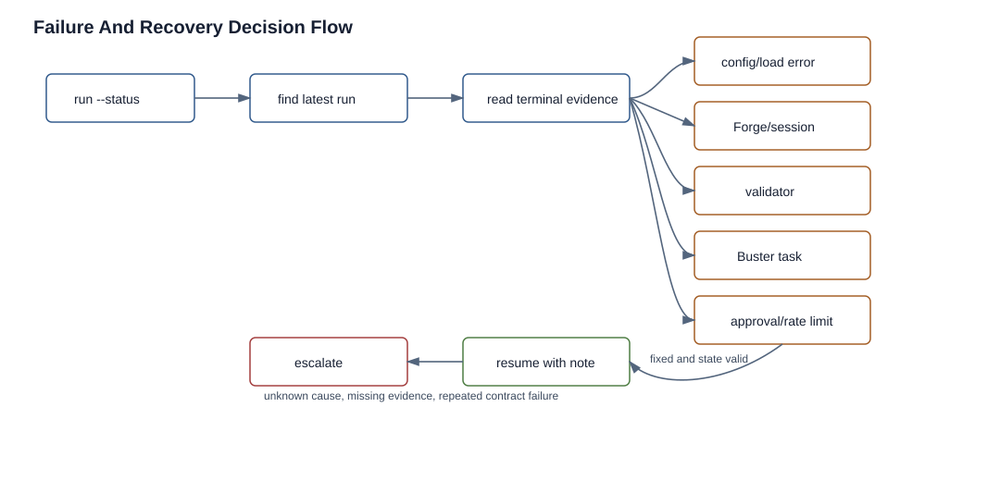

# Failure And Recovery

Status: current
Audience: operator, maintainer

## Overview

Pipeline failures are classified by typed terminal status, module/gate status, validator control result, and Buster completion/dead-letter evidence. The recovery path depends on which authority produced the failure.



The decision flow starts with Nova status and latest run artifacts, then routes to the component that owns the failing evidence before choosing resume or escalation.

Do not recover from Discord message text alone. Start with status JSON and run artifacts, then use Discord as notification context.

## Terminal Statuses

- `succeeded`: all required work completed.
- `failed`: required work failed and the configured control path did not continue.
- `action_required`: operator input or an external fix is needed.
- `blocked`: retry limits or blocking policy stopped progress.
- `timed_out`: a session, approval, module, or gate exceeded timeout.
- `rate_limited`: provider/model rate-limit handling paused or exhausted allowed pauses.

Terminal artifacts include `terminal_status`, `terminal_decision`, and `reason_code`. Numeric CLI process codes are not lifecycle state.

## Retry And Resume

Module retries are controlled by platform defaults and project/module overrides:

- `max_fails` in `swarm.config.json`
- module `max_fails` in `progress.json`
- `auto_retry_threshold` in `swarm.config.json`
- rate-limit policy under `rate_limit`

When a module or gate can be retried automatically, Nova records retry scheduling and waits briefly before re-entering the relevant phase. After thresholds are exhausted, the run moves to `action_required`, `blocked`, or another terminal status depending on the failure class.

Resume with a clear operator note:

```bash
node /app/skills/pipeline.ts \
  --project my-project \
  --nova-channel 1513577188899946506 \
  --resume \
  --prompt "Fixed missing app-runtime-secrets secret and verified Buster can read it."
```

Use `--resume` when durable state is still valid. Use a fresh run only when the project state should be re-evaluated from the beginning or after maintainers intentionally reset module/gate status artifacts.

## Retry Mechanics

Module retry is owned by `runModule(...)` and `handleFail(...)`:

```text
attempt fails
  -> classify phase/reason
  -> append lifecycle failure evidence
  -> increment fail_count
  -> persist fail summary
  -> decide retry, block, rate-limit cooldown, or terminal halt
  -> retry loop sleeps briefly and re-reads state
```

The retry loop re-reads state on every attempt because failure handling mutates durable lifecycle/status evidence. This avoids stale in-memory `fail_count` decisions.

Gate retry/fix behavior is separate. Review and Buster gates can run Forge fix cycles through remediable gate controllers; approval gates wait for a signal or timeout policy instead of using module fail counts.

## Rate-Limit Cooldowns

Rate limits are not treated as ordinary code failures. The rate-limit service can append durable cooldown events with resume times. Before a scheduler step runs, the state machine calls cooldown resume handling for that step. If the cooldown is still open, the scheduler waits; when it is due, it appends cooldown completion and continues.

Why: provider limits often resolve without code changes. Burning module retries during a provider outage would hide the real failure class.

## Stale Session Recovery

At run start, Nova reconciles stale module/gate state before scheduling new work:

```text
status says active
  -> inspect active session identity
  -> confirm session authority
  -> observe gateway/session monitor surfaces
  -> if definitively stopped: reset to retryable state
  -> if active orphan: terminate and confirm stop before reset
  -> if identity cannot be confirmed: block recovery and alert operator
```

Nova refuses age-only reset when no typed active session evidence exists. That is intentional: an old timestamp is not proof that a child session is gone or safe to kill.

The strong identity fields are defined in `skills/nova/pipeline/services/session-authority.ts`: `run_id`, `attempt`, `dispatch_id`, and `session_key`. `gateway_label` is optional identity evidence. Persisted `status.active_agent`, active-session JSON files, and process-local tracked agents are diagnostic evidence only; they cannot rehydrate authority after restart. If lifecycle read models do not contain strong active-session identity, `pipeline-runner-recovery.ts` appends `recovery.stale_blocked`, emits a durable operator alert, and leaves the module or gate unchanged.

Recovery actions are source-coded, not inferred from age alone:

| Evidence | Runtime owner | Recovery action | Operator action |
| --- | --- | --- | --- |
| lifecycle active session has strong identity and monitor confirms terminal | `session-authority.ts`; `pipeline-runner-recovery.ts`; ACP monitor | `observed_terminal`; reset module/gate to retryable state | inspect `canonical-events.jsonl`, then resume if the failure cause is understood |
| lifecycle active session has strong identity and monitor shows active orphan | `terminateSession()` plus `reaperAfterKill()` | `killed_orphan` only after stop confirmation | collect session key, dispatch id, gateway label, and last logs before resuming |
| lifecycle active session missing strong identity | `buildActiveSessionAuthorityPolicy()` | `identity_unconfirmed`; `recovery.stale_blocked` | do not force reset; inspect read models and active-session files, then escalate |
| no typed active session evidence, only stale status age | `pipeline-runner-recovery.ts` | blocks age-only recovery | treat as weak evidence and avoid killing unknown sessions |

## Completion Conflicts

Buster completions and local lifecycle/status can disagree. Nova handles that through completion adjudication:

- Redis terminal completion matches active dispatch: candidate evidence can be applied.
- Redis terminal completion conflicts with local terminal status: treat as drift/conflict, not authority.
- Redis completion is missing strong identity: ignore as weak evidence.
- Redis completion is rate-limited or timeout-owned by Buster: preserve the typed outcome.

When terminal artifacts disagree with status JSON, inspect lifecycle read models and completion drift diagnostics before rerunning.

## Authority Matrix

| Surface | Authority level | Owned by | Trust rule |
| --- | --- | --- | --- |
| lifecycle `canonical-events.jsonl` and `read-models.json` | scheduler authority | `skills/nova/pipeline/services/status-store-lifecycle/**` | legal/idempotent events drive current state |
| `.swarm/logs/pipeline/latest.json` | latest pointer/read surface | `skills/nova/pipeline/services/artifact-bundle.ts` and `status-store.ts` | use to find the run, then verify lifecycle/read-model details |
| Redis Buster completion | candidate evidence | `completion-adjudicator.ts`; `task-completion.ts` | accepted only when identity matches active dispatch |
| Redis dead-letter | failure evidence | `skills/buster/pipeline/services/task-completion.ts` | proves task failed before terminal completion; does not directly mutate Nova state |
| Discord message | presentation | notification/telemetry sinks | never scheduler authority |
| pod logs and Buster output files | diagnostic evidence | Buster runtime and suites | use for root cause and reproduction |

## Failure Classes

### Config Load Failure

Symptoms:

- CLI exits before a run directory is created
- status says project config is missing or invalid
- `--status` cannot load project state

Checks:

```bash
test -f Projects/my-project/src/.swarm/progress.json
node /app/skills/pipeline.ts --project my-project --dry-run
```

Recovery: fix `progress.json`, project path, or `--repo` selection before starting the run again.

### Forge Or Agent Failure

Symptoms:

- module is `IN_PROGRESS`
- active agent/session metadata remains attached
- no Buster output exists yet

Checks:

```bash
node /app/skills/pipeline.ts --project my-project --status
jq '.modules["02-api"]' Projects/my-project/src/.swarm/logs/pipeline/latest.json
```

Recovery: inspect run logs and OpenClaw session status. Resume when the agent output exists or after correcting provider/runtime configuration.

### Validator Failure

Symptoms:

- module returns to Forge or becomes blocked before Buster dispatch
- lint/pre-check artifacts exist under module lint logs
- failure text mentions `delivery_lint`, `pre_check`, or `full_lint`

Checks:

```bash
find Projects/my-project/src/.swarm/logs -path '*lint*' -type f | sort
```

Recovery: fix source output for validation failures. Fix tool configuration for execution failures such as missing `lint-report.ts`, missing config, or unparseable reports.

### Buster Task Failure

Symptoms:

- module is `TESTING` or a Buster gate is active
- task output exists with `FAIL` or `ERROR`
- Redis dead-letter stream has entries

Checks:

```bash
kubectl -n kubeclaw logs deploy/agent-buster -c buster-pipeline --tail=200
kubectl -n kubeclaw exec deploy/agent-buster -c kubeclaw -- openclaw gateway status
find Projects/my-project/src/.swarm -name 'buster-output.json' -o -name '*BUSTER*RESULT*.json'
redis-cli -h redis-master.kubeclaw.svc.cluster.local XRANGE swarm:buster:tasks:dead-letter - +
```

Recovery: fix app/test config for suite failures; fix task dispatch or path config for dead-lettered payloads.

### Approval Timeout

Symptoms:

- gate status is blocked or timed out
- approval artifacts exist under `.swarm/logs/gates/<gate_id>/`

Checks:

```bash
find Projects/my-project/src/.swarm/logs/gates/operator-approval -maxdepth 1 -type f -print
cat Projects/my-project/src/.swarm/logs/gates/operator-approval/approval-request.md
```

Recovery: record the decision through the supported approval signal path, or resume with an explicit operator note if the signal was handled externally.

### Rate Limit

Symptoms:

- module status is `RATE_LIMITED`
- telemetry includes `rate_limit.detected`
- Discord says the pipeline is paused until a resume time

Checks:

```bash
rg '"rate_limit|rate_limited|resume_at|retry_after_seconds"' Projects/my-project/src/.swarm/logs/pipeline
```

Recovery: wait until the recorded resume time, change model/provider capacity, or resume after confirming the provider is healthy.

## Escalation Paths

Escalate to a maintainer when:

- a valid-looking Buster task is dead-lettered repeatedly
- a validator reports tool execution failure after the tool path/config is verified
- a run cannot acquire or release the lock after pod restart
- terminal artifacts disagree with status JSON
- observability is degraded and no fallback artifacts are being written

## Sources

- `skills/nova/pipeline/services/contracts/terminal-decision.ts`
- `skills/nova/pipeline/runners/pipeline-runner-terminal.ts`
- `skills/nova/pipeline/runners/pipeline-runner-recovery.ts`
- `skills/nova/pipeline/runners/module-runner.ts`
- `skills/nova/pipeline/services/failures/retry-policy.ts`
- `skills/nova/pipeline/services/rate-limit.ts`
- `skills/nova/pipeline/services/completion-adjudicator.ts`
- `skills/nova/pipeline/services/module-validators.ts`
- `skills/buster/pipeline/services/task-queue.ts`
- `skills/buster/pipeline/services/task-completion.ts`
