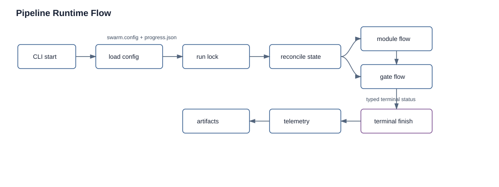

# Runtime Flow

Status: current
Audience: operator, developer

## Overview

A pipeline run is a durable state-machine pass over the project `execution_order`. Modules can run Forge and Buster phases. Gates can pause, review, test, or require operator approval. Nova records every important state change to project artifacts and telemetry so the run can be inspected or resumed without reading source code.

For a more detailed narrative, including why the runtime is shaped this way and how to trace a full run, see [end-to-end flow](end-to-end-flow.md).

For the code-level inventory of each moving part, see [technical implementation map](technical-implementation-map.md).



The runtime flow shows the operator-visible path from CLI start through config loading, lock acquisition, state reconciliation, module/gate execution, telemetry, artifacts, and terminal completion.

## Starting A Run

Normal start:

```bash
node /app/skills/pipeline.ts --project my-project --nova-channel 1513577188899946506
```

Resume with an operator note:

```bash
node /app/skills/pipeline.ts --project my-project --nova-channel 1513577188899946506 --resume --prompt "Provider secret has been fixed; continue from the failed Buster gate."
```

Status and dry-run commands do not require `--nova-channel`:

```bash
node /app/skills/pipeline.ts --project my-project --status
node /app/skills/pipeline.ts --project my-project --dry-run
```

## Normal Run Sequence

1. CLI flags are parsed. `--project` or `CURRENT_PROJECT` selects the project; `--repo`, `REPO_ROOT`, or Git discovery selects the repository.
2. Platform config is loaded from `/home/node/.openclaw/swarm.config.json`, with `SWARM_CONFIG` as a secondary candidate.
3. Project config is loaded from `<repo>/Projects/<project>/src/.swarm/progress.json`.
4. The startup plugin registry is built from built-ins plus any enabled configured modules.
5. Log directories are initialized and `.swarm/logs/pipeline/latest.json` points to the active run.
6. Nova acquires the run lock. A second live runner should fail instead of corrupting state.
7. Stale module and gate sessions are reconciled against durable state.
8. The pipeline start lifecycle and telemetry events are emitted.
9. The state machine evaluates the next item in `execution_order`.
10. Module phases run: Forge, validators, Buster, retry/fix cycles, then terminal module state.
11. Gate stages run: review, approval, or Buster gate depending on `gates.<id>.type`.
12. Terminal completion writes summary and cost artifacts, then runs enabled post-pipeline generators.

## State Machine Detail

The runtime loop is implemented as an explicit typed state machine:

```text
findNextStep(config, progress, deps)
  -> planPipelineStep(next)
  -> maybe resume durable cooldown for that step
  -> run validator, gate, or module
  -> normalize PipelineStepResult
  -> continue, halt, or complete
```

The scheduler does not treat every `execution_order` string equally. It projects current lifecycle/read-model state first:

- `type=module`: run `runModule(...)` for an unfinished module ID.
- `type=gate`: run `runGate(...)` for an unfinished `gate:<id>` entry.
- `type=validator`: run a scheduled registry validator such as architecture or delivery lint.
- `type=blocked`: halt because required prior state cannot legally advance.
- `type=done`: complete the pipeline and run terminal generation.

This matters because validators and generators may be scheduled around module/gate work without appearing as literal project steps. `execution_order` is the operator-visible spine, not the whole runtime call graph.

## What Happens Around Each Step

Before each step:

- the run lock heartbeat is asserted
- external abort signals are checked
- any durable rate-limit cooldown for the step can resume or delay execution
- the next step receives run-scoped context and dependency-injected helpers

During the step:

- module execution goes through the module retry loop and attempt state machine
- gate execution resolves its type owner from the registry and normalizes a gate control result
- validator execution resolves a stage owner and normalizes a validator control result

After the step:

- old compatibility result shapes are normalized to `PipelineStepResult`
- `nextAction=continue` advances the loop
- halt/block/error/timeout/rate-limit outcomes call terminal handling
- terminal handling writes typed summary evidence instead of relying on process exit codes

## Module Status Transitions

Common module statuses are:

- `PENDING`: no active work yet, or reset to the beginning of a phase.
- `IN_PROGRESS`: Forge is active.
- `READY_FOR_TESTING`: Forge has completed and the module is ready for Buster.
- `TESTING`: Buster task is active.
- `PASS`: module completed successfully.
- `FAIL`: module failed a terminal check.
- `BLOCKED`: retries or required conditions are exhausted.
- `RATE_LIMITED`: rate-limit cooldown handling is active.

Status history is appended to the module status object. Operators should inspect history before forcing a rerun because it explains the transition path.

## Gate Lifecycle

`execution_order` uses `gate:<id>` entries. The corresponding `gates.<id>` object decides the runner:

- `review`: dispatches reviewer sessions, writes review artifacts, and stops on failure.
- `approval`: writes approval request/decision artifacts and waits for a signal or timeout behavior.
- `buster`: dispatches a typed Buster gate task and can trigger fix-and-retest cycles.

Gate output paths are resolved inside `.swarm`; absolute paths and parent traversal are rejected by path helpers.

## Terminal States

Terminal pipeline outcomes are typed:

- `succeeded`: all required modules, gates, validators, and generators completed.
- `failed`: required work failed and cannot be retried automatically.
- `action_required`: an operator decision or external fix is needed.
- `blocked`: retry limits or blocking policy stopped progress.
- `timed_out`: a task or session exceeded its timeout.
- `rate_limited`: model/provider rate limiting paused or exhausted the allowed pause policy.

Nova writes `terminal_status`, `terminal_decision`, and `reason_code` into terminal evidence. The CLI returns `0` for success and `1` for non-success terminal statuses; do not use the numeric code as replay state.

## Expected Output

Status output is JSON-shaped and includes modules and gates. A healthy in-progress run should show one active module or gate and recent history:

```json
{
  "project": "my-project",
  "modules": {
    "02-api": {
      "status": "TESTING",
      "current_phase": "buster",
      "fail_count": 1
    }
  },
  "gates": {}
}
```

Terminal summaries are written under:

```text
Projects/<project>/src/.swarm/logs/pipeline/runs/<run_id>/summary.json
```

## Common Interruptions

- Missing `--nova-channel` on a real run: start fails because Nova cannot escalate `action_required` or timeout states.
- Missing project config: config loading fails before the run lock is acquired.
- Stale state after pod restart: rerun with `--resume`; the runner reconciles state before continuing.
- Buster task dead-letter: inspect Redis audit logs and Buster task logs before rerunning.
- Rate limiting: wait until the recorded resume time or adjust provider/model capacity, then resume.

## Sources

- `skills/nova/pipeline/cli.ts`
- `skills/nova/pipeline/core/config.ts`
- `skills/nova/pipeline/runners/pipeline-runner.ts`
- `skills/nova/pipeline/runners/pipeline-runner-state-machine.ts`
- `skills/nova/pipeline/runners/pipeline-runner-scheduling.ts`
- `skills/nova/pipeline/runners/pipeline-runner-terminal.ts`
- `skills/nova/pipeline/lifecycle-state.ts`
