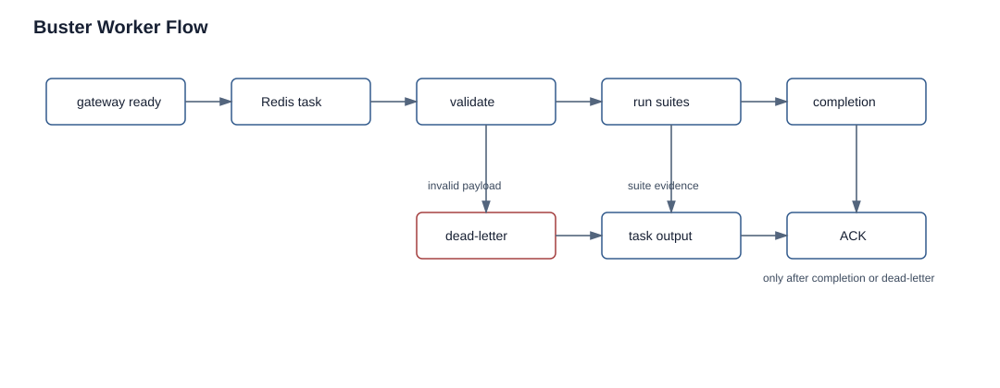

# Workers And Buster

Status: current
Audience: operator, developer

## Overview

Buster is the deterministic test worker for module and gate tasks. Nova dispatches work through Redis; Buster validates the task contract, prepares the sandbox, runs requested suites, optionally spawns an agent session after deterministic evidence, writes artifacts, and publishes completion or dead-letter evidence.



The Buster flow shows the terminal guarantee: a Redis task is acknowledged only after completion evidence or dead-letter evidence exists.

The active runtime is `skills/buster/buster-pipeline.ts`.

## Startup Flow

On startup Buster:

1. waits for gateway readiness for up to 120 seconds
2. recovers an orphaned active session when lifecycle authority allows it
3. recovers and deletes tracked namespace leases from interrupted tasks
4. starts periodic gateway health monitoring
5. verifies the local rootless BuildKit worker through the container readiness probe
6. ensures the Redis consumer group
7. polls Redis tasks continuously

Gateway readiness or health failures stop the process so Kubernetes can restart the pod.

## Redis Task Boundary

Default stream behavior:

- task stream: `BUSTER_TASK_STREAM` or `swarm:<AGENT_NAME>:tasks`
- default task stream with `AGENT_NAME=buster`: `swarm:buster:tasks`
- consumer group: `<AGENT_NAME>-group`
- consumer: `<AGENT_NAME>-buster-pipeline-<hostname>`
- default dead-letter stream: `<task-stream>:dead-letter`
- default max stream length: `250`
- default pending reclaim idle: `60000` ms

Accepted task types are `module_test` and `gate_test`.

The task boundary exists because Nova should not run destructive validation directly. Nova sends typed intent and waits for typed evidence; Buster controls the sandbox and test execution details.

## Job Handling Flow

The current job path is:

```text
Nova builds task payload
  -> Nova validates canonical Redis task envelope
  -> Nova XADDs task to Buster stream
  -> Buster XAUTOCLAIMs one idle pending task if present
  -> otherwise Buster XREADGROUPs one new task
  -> Buster validates Redis envelope and payload
  -> Buster processes task
  -> Buster writes completion or dead-letter evidence
  -> Buster XACKs only after terminal evidence exists
  -> Buster XTRIMs the task stream
```

Pending reclaim matters after worker restarts. A task that was delivered to an old consumer but not ACKed can be reclaimed after `buster.runtime.task_pending_reclaim_idle_ms` from `swarm.config.json`. Reclaimed tasks are logged with `reclaimed=pending` so operators know they are recovery work, not new dispatches.

The transport adapter lives in `skills/common/pipeline/services/task-transport-contract.ts`. It intentionally exposes queue methods (`publishTask`, `readNext`, `ack`, `trim`) instead of letting every caller use raw Redis commands.

## Task Validation

Buster validates required identity before execution. Required payload fields include:

- `task_type`
- `module_id`
- `project`
- `run_id`
- `attempt`
- `dispatch_id`
- `commit_hash`
- `output_file`
- `stage_id`
- `timeout_seconds`
- `session.runtime`
- `session.model`
- `session.agentId` or `session.agent_id`
- `session.cwd`
- `session.label`
- `suites`

Additional requirements:

- `module_test` requires `worker_type: "module_buster"`.
- `gate_test` requires `gate_id`.
- path fields must stay inside the repository and must not contain parent traversal
- `suites` must be a non-empty array
- requested capabilities must be known Buster capabilities

Malformed payloads are dead-lettered before Redis ACK.

Validation is deliberately strict:

- `attempt` and `timeout_seconds` must be positive integers.
- `session.runtime` must be `acp` or `subagent`.
- `session.cwd` must resolve inside the current repository root.
- `output_file`, `module_path`, `buster_md_path`, `work_dir`, and `instructions_file` must be repository-relative when present.
- requested capabilities must be known to Buster.

This keeps untrusted Redis payloads from becoming arbitrary filesystem access or ambiguous work.

## Completion And ACK Guarantee

Buster's terminal guarantee is:

```text
valid task
  -> process task
  -> emit completion
  -> ACK Redis message
```

If normal completion cannot be emitted:

```text
task/process failure
  -> synthesize FAIL completion when completion_stream is available
  -> otherwise write dead-letter
  -> ACK only after one of those terminal records exists
```

If neither completion nor dead-letter can be written, Buster reports `terminal_guarantee_failed`. That is a worker/runtime problem, not an ordinary test failure.

Completion records include schema version, stream role, project, target kind/id, module/gate identity, status/outcome, reason, run/attempt/dispatch identity, and timestamp. Nova uses these identity fields to avoid treating stale completions as current work.

## Deterministic Suites Before Child Agents

Buster does not immediately spawn an agent. A valid task first runs requested suites through `runSuites(...)`:

```text
pre-cleanup
  -> git sync to requested commit
  -> deterministic suites
  -> decision: NO_SPAWN or SPAWN
```

If any critical suite fails, the task returns `FAIL` with `NO_SUBAGENT` and no child session is created. If critical suites pass, Buster appends any decoded app test credentials to the task prompt, spawns the requested session, monitors it, kills/cleans it, and publishes the agent outcome.

Why: deterministic suite evidence is cheaper and more reliable than asking an agent to discover obvious build/health/API failures. The child agent is used only after the worker has established a runnable baseline.

## Completion Identity

Nova expects Buster completions to carry strong identity:

- `run_id`
- `attempt`
- `dispatch_id`
- `session_key` when available

Nova's completion adjudicator compares Redis completion identity with the active dispatch. A terminal Redis result can be treated as authority only when it matches active dispatch policy. Otherwise it is drift/conflict evidence.

This is why retries archive old completions and why dispatch IDs are part of task payloads. Without identity, a stale PASS from attempt 1 could accidentally unblock attempt 2.

## Suite Lifecycle

For a valid task, Buster:

1. creates a telemetry context and `buster-pipeline.jsonl` logger
2. runs pre-task sandbox cleanup
3. syncs the repository to the requested commit
4. executes suites through `runSuites`
5. decides whether critical suite failures prevent an agent session
6. spawns and monitors the requested ACP/subagent session when allowed
7. writes the scoped task output JSON
8. publishes Redis completion
9. runs terminal cleanup and closes telemetry

Suite statuses are `PASS`, `FAIL`, `ERROR`, and `SKIP` at the suite layer. Nova consumes the normalized task completion, not raw console output.

## Built-In Suites

- `build`: builds and serves static/server apps, validates canonical image references, Dockerfile behavior, and optional secret-derived environment injection.
- `health`: performs HTTP health checks and optional smoke paths.
- `unit`: runs configured unit commands and parses common Jest, Vitest, Mocha, TAP, and pytest output.
- `api`: reads a JSON API spec and runs HTTP/WebSocket checks against the running app.
- `e2e`: runs configured browser/end-to-end tests.
- `a11y`: runs Playwright plus axe-core against configured local paths.
- `visual-reg`: compares screenshots against reviewed baselines and can send noncritical Discord media.
- `bundle`: checks build output size/file limits.
- `perf`: runs performance-oriented checks where configured.
- `security`: checks HTTP/security header expectations.
- `manifest`: validates deployment manifest references and expected environment/registry requirements.
- `k8s`: builds, pushes, deploys into a broker-created namespace, waits for readiness, and can keep final-preview deployments.

Without thresholds, many suites run in evidence-only mode and return PASS while recording findings. With thresholds, suites can fail.

## Operator Checks

Check Buster worker logs:

```bash
kubectl -n kubeclaw logs deploy/agent-buster -c buster-pipeline --tail=200
```

Check the colocated OpenClaw gateway container:

```bash
kubectl -n kubeclaw logs deploy/agent-buster -c kubeclaw --tail=200
kubectl -n kubeclaw exec deploy/agent-buster -c kubeclaw -- openclaw gateway status
```

Check Redis task backlog from inside a pod with Redis access:

```bash
redis-cli -h redis-master.kubeclaw.svc.cluster.local XLEN swarm:buster:tasks
redis-cli -h redis-master.kubeclaw.svc.cluster.local XPENDING swarm:buster:tasks buster-group
```

Find task output artifacts:

```bash
find Projects/my-project/src/.swarm -name 'buster-output.json' -o -name '*BUSTER*RESULT*.json'
```

## Recovery

- Invalid task payload: inspect the dead-letter record and fix Nova dispatch config or project `progress.json`.
- Gateway unhealthy: check OpenClaw gateway status, then let Kubernetes restart Buster.
- Suite dependency missing: confirm the Buster image includes the required tool, or remove that suite from `test_suites`.
- Stuck pending task: check `XPENDING`, Buster pod health, and whether a previous consumer owns the pending message.
- Missing completion artifact: inspect `buster-pipeline.jsonl`; Buster should not ACK without completion or dead-letter evidence.

## Sources

- `skills/buster/buster-pipeline.ts`
- `skills/buster/pipeline/services/task-queue.ts`
- `skills/common/pipeline/services/task-transport-contract.ts`
- `skills/buster/pipeline/services/task-validation.ts`
- `skills/buster/pipeline/services/task-lifecycle.ts`
- `skills/buster/pipeline/runners/suite-runner.ts`
- `skills/buster/pipeline/services/task-completion.ts`
- `skills/buster/pipeline/services/redis-message-contract.ts`
- `skills/nova/pipeline/tools/redis.ts`
- `skills/nova/pipeline/services/completion-adjudicator.ts`
- `skills/buster/pipeline/suites/*.ts`
