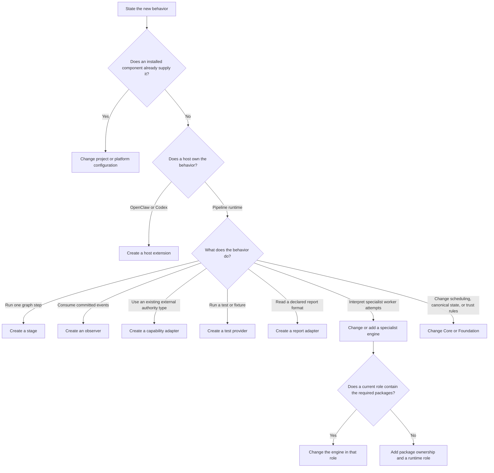

# Extend KubeClaw

Status: implemented with the verification limits stated in each guide
Audience: plugin author, engine author, maintainer
Owner: plugin-foundation
Evidence: skills/common/plugin-runtime/contracts/plugin-system/v2/plugin-system-v2.schema.json; skills/common/plugin-runtime/foundation/config/platform.ts; skills/common/plugin-runtime/foundation/registry; packaging/runtime/roles; packaging/runtime/package-ownership.json
Evidence revision: `bcf032f241b432bf920baa9ee5f727947921447d`
Applies to: pipeline-plugin-v2, current OpenClaw and Codex manifests, Worker Core contracts
Last verified: source and focused local checks on 2026-09-16

The design explanations below describe the current contract tradeoffs. A linked
ADR supplies historical decision evidence where available. Other benefits, costs,
and alternatives are inferences from the current boundaries, not a claim about
the original authors' motives.

## Purpose

Use this guide before you create a package or change Core.
It identifies the smallest supported change that solves your problem.

Use [Extend Prism safely](platform/prism.md) when the change belongs to a Prism
contract, service, document operation, renderer, retrieval path, Studio,
storage boundary, or pipeline handoff.

A smaller change has fewer trust, recovery, packaging, and maintenance consequences.
However, configuration cannot create behavior that no installed component supplies.

This guide assumes that you understand Git, TypeScript, JSON Schema, and automated tests.
It explains KubeClaw-specific boundaries when they affect your choice.

## First Identify The Behavior Owner

Ask one question first: which component must own the new behavior?

- A project declaration selects existing behavior.
- A pipeline registration adds bounded behavior to an existing runtime.
- A host extension adds behavior to OpenClaw or Codex.
- A specialist engine interprets one class of worker attempt.
- A runtime role assembles an exact deployable package set.
- Core owns scheduling, canonical state, and the extension security model.

Do not start with a directory name.
Start with the responsibility that must change.

## Decision Flow

Text version: First check whether configuration can select installed behavior.
If not, identify the host and the behavior type.
Pipeline behavior uses one of five registration types when a public contract fits.
Specialist attempt semantics belong in an engine.
Scheduling, canonical state, new authority types, and registry rules require a Core or Foundation change.

## Quick Choice Table

| Need | Smallest fitting change | Do not use it when |
| --- | --- | --- |
| Select or configure an installed pipeline or host component | Configuration | The required implementation or capability ID does not exist |
| Add one typed graph operation | Stage | The work only observes events or performs a reusable external effect |
| Send telemetry or notifications from committed events | Observer | Delivery must change pipeline state |
| Access a controlled external resource | Capability adapter | The capability vocabulary has no matching authority type |
| Execute a test or manage a test fixture | Test provider | The change decides pipeline scheduling or quality policy |
| Normalize one declared report format | Report adapter | The code executes the test or decides whether the gate passes |
| Add OpenClaw hooks or tools | OpenClaw extension | Nova must schedule the behavior as a graph stage |
| Add Codex-facing skills | Codex plugin | The running pipeline must load the code |
| Interpret a new specialist attempt contract | Worker engine plus role packaging | One pipeline stage can complete the work through public capabilities |
| Assemble a new deployable runtime identity | Runtime role plus package ownership | An existing role already owns the behavior |
| Change lifecycle, scheduling, trust, registry, or capability vocabulary | Core or Foundation change | A public extension contract already contains the required authority |

The term “integration” does not name a registration type.
Classify an integration by its behavior.
Use an adapter for an external effect, an observer for event delivery, or a host extension for host hooks.

## Choose Configuration First

Use configuration when all required code and public contract types already exist.
Configuration can select behavior and set values.
It cannot create a new implementation.

Project configuration can:

- choose implementation, lint, review, and test behavior that the project compiler supports;
- supply stage configuration and a complete, digest-bound provider plan;
- select installed stage types in an explicit `pipeline-definition.v2` graph;
- set graph concurrency and stage execution limits in that explicit graph;
- use only registrations and capability grants that the platform already supplies.

The higher-level project file and an explicit pipeline graph are not the same input.
The project compiler owns its graph shape and several execution limits.
Do not assume that every field in `pipeline-definition.v2` is a project-file option.

A resolved test plan already contains the selected provider and report-adapter identities.
The test-plan resolver binds those identities from the installed registry.
Resolver policy can select an exact report adapter for a format.
Project input does not independently load a report adapter.

Platform configuration can:

- point to operator-staged installation roots;
- identify trusted built-in roots and approved external package digests;
- map each capability ID to an installed capability-adapter registration;
- grant bounded capability constraints to registrations;
- configure adapters and observers;
- activate adapters explicitly and observers through their configured registration IDs;
- set storage, shutdown, isolation, and administrative identities.

Capability-provider selection is not test-provider selection.
The `providers` field in `pipeline-platform.v2` maps capability IDs to adapters.
Buster test providers come from the installed registry and a resolved test plan.

Project input cannot add an installation root or grant Foundation plugin authority.
This rule prevents a repository from installing executable code through its own pipeline declaration.

A project can carry a complete Buster provider plan with its own `grants` field.
Those grants belong to bounded test-provider execution in that resolved plan.
They do not modify `pipeline-platform.v2.grants`, install a package, or authorize a pipeline registration.

**Why this boundary exists:** Project authors control requested work.
Operators control installed code and resource authority.
Combining both powers would let a repository approve its own executable dependencies.

**Cost:** An operator must stage and approve new code before a project can select it.

**Reconsider when:** A future installation service can preserve independent trust approval, immutable package identity, and rollback evidence.

> **Source evidence — configuration selects but does not create authority**
>
> **Platform fields:** [`PlatformConfig` separates installation, trust, providers, grants, adapters, and observers](https://github.com/datrab/kubeclaw/blob/bcf032f241b432bf920baa9ee5f727947921447d/skills/common/plugin-runtime/foundation/config/platform.ts#L6-L27).
>
> **Capability mapping:** [Foundation resolves `platform.providers` as capability-to-adapter mappings and rejects missing or invalid providers](https://github.com/datrab/kubeclaw/blob/bcf032f241b432bf920baa9ee5f727947921447d/skills/common/plugin-runtime/foundation/registry/capabilities.ts#L75-L119).
>
> **Runtime sequence:** [`prepareRuntime()` discovers packages before it resolves grants and activates registrations](https://github.com/datrab/kubeclaw/blob/bcf032f241b432bf920baa9ee5f727947921447d/skills/nova/core/execution/engine-runtime.ts#L29-L50).
>
> **Project compiler:** [The compiler fixes its stage execution policy and validates the supplied resolved provider plan and its digest](https://github.com/datrab/kubeclaw/blob/bcf032f241b432bf920baa9ee5f727947921447d/skills/nova/project/compiler.ts#L60-L113).
>
> **Explicit graph:** [The pipeline schema exposes graph concurrency and stage execution fields](https://github.com/datrab/kubeclaw/blob/bcf032f241b432bf920baa9ee5f727947921447d/skills/common/plugin-runtime/contracts/plugin-system/v2/plugin-system-v2.schema.json#L481-L529).
>
> **Negative test:** [The platform check rejects project-controlled installation roots](https://github.com/datrab/kubeclaw/blob/bcf032f241b432bf920baa9ee5f727947921447d/tests/verification/contracts/check-plugin-system-v2-platform-config.mjs#L44-L63).
>
> **Decision:** [ADR-007 explains the separate operator grant](../decisions/core-and-plugins.md#adr-007-grant-bounded-capabilities-instead-of-ambient-authority).
>
> **Local result:** The focused platform-configuration check passed on 2026-09-16.

## Choose A Pipeline Registration

Use a pipeline plugin when the pipeline runtime must load new code through `pipeline-plugin-v2`.
One package can declare several registrations.
Each registration has its own identity and contract fields.
Configuration and capability fields differ by registration type.

The repository currently contains 48 pipeline packages and 67 registrations.
The [plugin catalogue](plugin-catalogue/README.md) lists the installed packages.

The five registration types are not interchangeable.
Choose the type that matches the responsibility.

| Surface | Selection owner | Execution owner | Authority model |
| --- | --- | --- | --- |
| Stage | Pipeline graph plus Nova runtime preparation | Nova through Foundation activation | Requests declared capabilities; Core interprets the result |
| Observer | Platform observer configuration | Nova observer runtime through Foundation activation | Requests capabilities; cannot change lifecycle state |
| Capability adapter | Platform provider mapping and active-adapter list | Nova adapter runtime through Foundation activation | Provides declared capability IDs and can request declared dependencies |
| Test provider | Resolved test plan bound to an installed provider contract | Buster provider sandbox | Receives the provider context and the plan's bounded grants |
| Report adapter | Resolver policy or one unambiguous installed format implementation | Buster report-adapter sandbox | Receives bounded report bytes and runtime limits; the manifest has no capability request |

### Stage

A stage performs one graph operation and returns a typed stage result.
Core interprets that result and changes canonical lifecycle state.

Choose a stage when:

- the graph must order the new operation;
- the operation needs declared input and result schemas;
- retry, timeout, remediation, or wait behavior applies to the graph step;
- the result can use the existing stage-result outcomes.

Do not use a stage to bypass a capability adapter.
A stage requests authority through its invocation context.
It does not import privileged runtime services directly.

### Observer

An observer consumes committed events through explicit subscriptions.
It owns delivery policy and a checkpoint schema.

Choose an observer for telemetry, notification, or another event projection.
Do not use an observer to advance the scheduler or rewrite canonical history.

An observer can fail delivery according to its declared policy.
That policy does not give the observer lifecycle authority.

### Capability Adapter

An adapter supplies one or more existing capability IDs.
It performs a controlled external operation and returns a receipt.

Choose an adapter for Git, HTTP, artifact, secret, transport, or state access.
The capability vocabulary must already contain the required authority type.

Adding a new capability ID changes the security model.
That work belongs in Foundation and requires a Core-level review.

Current activation rejects an external long-lived capability adapter.
Such an adapter needs a persistent isolated adapter runtime that the current activation path does not provide.

### Test Provider

A test provider executes one declared test or fixture contract for Buster.
It declares ports, evidence types, retry safety, matrix fields, and report formats.

Choose a provider when the work produces test facts or owns fixture preparation and cleanup.
Do not place Buster test semantics in Nova or neutral Worker Core.

A suite composes existing provider declarations.
Create or change suite configuration when existing providers already supply every required operation.

### Report Adapter

A report adapter normalizes one declared report format.
It identifies the format, contract version, media types, module, and export.

Choose a report adapter when a provider already produces the report.
Do not let a report adapter execute tests or decide gate policy.

> **Source evidence — five different registration contracts**
>
> **Contract:** [The manifest schema defines stage, observer, adapter, test-provider, and report-adapter arrays](https://github.com/datrab/kubeclaw/blob/bcf032f241b432bf920baa9ee5f727947921447d/skills/common/plugin-runtime/contracts/plugin-system/v2/plugin-system-v2.schema.json#L194-L449).
>
> **Registry:** [`buildRegistry()` creates separate indexes and rejects conflicting ownership](https://github.com/datrab/kubeclaw/blob/bcf032f241b432bf920baa9ee5f727947921447d/skills/common/plugin-runtime/foundation/registry/build.ts#L265-L317).
>
> **SDK:** [The public SDK exports invocation, observer, adapter, provider, and report types](https://github.com/datrab/kubeclaw/blob/bcf032f241b432bf920baa9ee5f727947921447d/skills/common/plugin-runtime/sdk/src/index.ts#L1-L28).
>
> **Decision:** [ADR-006 explains why one generic hook does not fit all five responsibilities](../decisions/core-and-plugins.md#adr-006-use-five-explicit-registration-surfaces).
>
> **Local result:** Contract and registry checks passed on 2026-09-16.

## Understand Discovery, Binding, And Activation

Package presence does not mean that executable code ran.
KubeClaw uses two execution paths after common discovery.

| Step | Applicable surfaces | What happens | What it proves |
| --- | --- | --- | --- |
| Discovery and registry build | All five pipeline surfaces | Foundation reads `plugin.json`, schemas, package bytes, trust evidence, and provenance; it then indexes every registration | The package is present, trusted for discovery, and structurally acceptable |
| Nova enablement | Stage, observer, capability adapter | The graph and platform configuration select registrations; Nova resolves capability grants | Policy permits those selected registrations and resources |
| Foundation activation | Stage, observer, capability adapter | Foundation checks package integrity and loads only selected executable exports | Nova can invoke those three selected surface types |
| Test-plan binding | Test provider, report adapter | The resolver binds provider contracts and report formats to exact installed package identities | The resolved plan names the implementation that Buster must use |
| Buster execution | Test provider, report adapter | Buster verifies package identity, snapshots code, and invokes a bounded child process | Buster can execute the plan-bound provider or normalize its report |

This separation stops package code from running during discovery.
It also gives a run a stable package and registration identity.

Trusted first-party stages, observers, and adapters can run after import auditing.
External stages and observers use Foundation's isolated invocation path.
External capability adapters stop at the unsupported persistent-host boundary described above.

Test providers and report adapters do not use `activateRegistry()`.
Buster loads them through separate sandboxed runtimes after test-plan binding.

> **Source evidence — inert discovery before selected activation**
>
> **Discovery:** [`discoverPackages()` reads manifests, computes package digests, and records trust provenance](https://github.com/datrab/kubeclaw/blob/bcf032f241b432bf920baa9ee5f727947921447d/skills/common/plugin-runtime/foundation/registry/discovery.ts#L77-L137).
>
> **Activation:** [`activateRegistry()` checks package integrity and loads only enabled stages, observers, and adapters](https://github.com/datrab/kubeclaw/blob/bcf032f241b432bf920baa9ee5f727947921447d/skills/common/plugin-runtime/foundation/registry/activation.ts#L103-L137).
>
> **External limit:** [The loader rejects external adapters without a persistent isolated adapter runtime](https://github.com/datrab/kubeclaw/blob/bcf032f241b432bf920baa9ee5f727947921447d/skills/common/plugin-runtime/foundation/registry/activation.ts#L47-L86).
>
> **Test-plan binding:** [The resolver binds installed provider contracts and exact report-adapter identities into each plan node](https://github.com/datrab/kubeclaw/blob/bcf032f241b432bf920baa9ee5f727947921447d/skills/nova/core/test-gates/resolver.ts#L512-L585).
>
> **Provider execution:** [Buster verifies the provider package digest and creates an attempt-specific snapshot](https://github.com/datrab/kubeclaw/blob/bcf032f241b432bf920baa9ee5f727947921447d/skills/buster/engine/test-gates/provider-loader.ts#L36-L79).
>
> **Report execution:** [Buster verifies report bytes and package identity before it runs the selected adapter](https://github.com/datrab/kubeclaw/blob/bcf032f241b432bf920baa9ee5f727947921447d/skills/buster/engine/test-gates/report-adapter-runtime.ts#L266-L320).
>
> **Decision:** [ADR-005 explains inert discovery and frozen registration identity](../decisions/core-and-plugins.md#adr-005-discover-inert-manifests-and-freeze-exact-registrations).

## Choose A Host Extension

OpenClaw and Codex use their own host manifests.
They do not use `pipeline-plugin-v2` registration arrays.

Choose an OpenClaw extension when OpenClaw must load hooks or tools.
The current repository contains an agent observer and the Prism tool extension.

Use OpenClaw host configuration instead when an installed extension already exposes
the required hook or tool and its configuration schema contains the required field.

Choose a Codex plugin when Codex must expose a skill or another Codex-facing resource.
The current `kubeclaw-ops` package points Codex to its troubleshooting skill.

Host installation does not add a Nova stage.
Pipeline installation does not activate a host extension.
When both hosts need related behavior, document and test both activation paths.

Repository presence also does not prove host installation.
Use host-specific inspection to prove activation and a real invocation to prove reachability.

> **Source evidence — host manifests remain separate**
>
> **OpenClaw observer:** [The manifest declares startup activation and its configuration schema](https://github.com/datrab/kubeclaw/blob/bcf032f241b432bf920baa9ee5f727947921447d/skills/common/plugins/openclaw-agent-observer/openclaw.plugin.json#L1-L35).
>
> **Prism tools:** [The Prism manifest declares two OpenClaw tool contracts](https://github.com/datrab/kubeclaw/blob/bcf032f241b432bf920baa9ee5f727947921447d/skills/prism/openclaw-plugin/openclaw.plugin.json#L1-L17).
>
> **Codex:** [The Ops manifest points to its skill directory and declares read capability](https://github.com/datrab/kubeclaw/blob/bcf032f241b432bf920baa9ee5f727947921447d/plugins/kubeclaw-ops/.codex-plugin/plugin.json#L1-L25).
>
> **Limit:** These manifest links prove repository declarations. They do not prove installation in an OpenClaw or Codex host.

## Choose A Worker Engine Or Runtime Role

Worker Core runs one bounded attempt.
A specialist engine gives domain meaning to that attempt.
Buster interprets test work, while Prism interprets design work.

Choose an engine change when a new specialist operation needs Worker Core limits, progress, logs, cancellation, evidence, and cleanup.
Do not create an engine when one stage and public capabilities can complete the work.

The current repository has no drop-in worker-engine manifest or generic engine loader.
An engine requires source, contract integration, package ownership, and inclusion in a runtime role.

A runtime role is the deployable identity and exact package set.
Current role manifests declare Nova, Buster, and Prism.
A new role requires packaging, entrypoint, ownership, dependency, image, deployment, and operational work.

**Why this boundary exists:** Worker Core owns neutral execution mechanics.
The engine owns specialist meaning.
The role limits which code and authority reach one deployed process.

**Cost:** A new engine or role has a larger release and operations surface than a plugin.

**Reconsider when:** The repository adds a stable engine manifest and a loader with equivalent trust, compatibility, and recovery controls.

> **Source evidence — engines and roles are package boundaries**
>
> **Worker contract:** [`WorkerProfileV1` binds a worker type to one exact engine identity](https://github.com/datrab/kubeclaw/blob/bcf032f241b432bf920baa9ee5f727947921447d/contracts/pipeline-worker-core/v1/src/types.ts#L28-L65).
>
> **Operation boundary:** [`WorkerAttemptOperation` defines prepare, execute, terminate, measurement, cleanup, and evidence hooks](https://github.com/datrab/kubeclaw/blob/bcf032f241b432bf920baa9ee5f727947921447d/skills/worker/core/worker/attempt-executor.ts#L62-L89).
>
> **Package ownership:** [The package map assigns Worker Core and specialist engines to explicit roles](https://github.com/datrab/kubeclaw/blob/bcf032f241b432bf920baa9ee5f727947921447d/packaging/runtime/package-ownership.json#L8-L26).
>
> **Role example:** [The Nova role lists every package, plugin, and host extension in its bundle](https://github.com/datrab/kubeclaw/blob/bcf032f241b432bf920baa9ee5f727947921447d/packaging/runtime/roles/nova.json#L1-L61).
>
> **Local result:** The runtime-role manifest check passed for all three roles on 2026-09-16.

## Choose A Core Or Foundation Change

Change Core or Foundation only when no public extension contract can own the behavior safely.

A Core or Foundation change applies when you must:

- add or change canonical lifecycle states or transitions;
- change graph scheduling, retry, remediation, wait, or cancellation authority;
- add a capability ID or change its resource constraints;
- change discovery, trust, grant, isolation, or activation rules;
- change frozen snapshot or compatibility semantics;
- add a public extension surface;
- change the neutral Worker Core protocol or ownership model.

Plugins cannot receive `lifecycle.write`, `scheduler.advance`, `canonical_events.modify`, or `registry.mutate`.
These names describe forbidden authority, not grantable capabilities.

**Why this boundary exists:** Extension code must not redefine the controls that contain it.

**Cost:** A Core change affects every compatible extension and requires wider regression evidence.

**Reconsider when:** A repeated need has stable semantics and can become a bounded public contract without leaking Core authority.

> **Source evidence — Core keeps control authority**
>
> **Capability boundary:** [Foundation lists Core-only capability names and rejects unknown public capabilities](https://github.com/datrab/kubeclaw/blob/bcf032f241b432bf920baa9ee5f727947921447d/skills/common/plugin-runtime/foundation/registry/capability-vocabulary.ts#L109-L127).
>
> **Lifecycle decision:** [ADR-001 explains why Core alone changes canonical lifecycle state](../decisions/core-and-plugins.md#adr-001-core-owns-canonical-lifecycle-authority).
>
> **Role decision:** [ADR-012 explains exact role-specific runtime bundles](../decisions/core-and-plugins.md#adr-012-assemble-exact-role-specific-runtime-bundles).

## Unsupported Shortcuts

The current implementation does not support these shortcuts:

| Shortcut | Why it stops | Supported direction |
| --- | --- | --- |
| Put executable code in project configuration | Project input has no installation authority | Stage the package through operator-controlled installation and trust policy |
| Use an unknown capability string | Foundation uses a closed capability vocabulary | Add a reviewed Foundation contract or use an existing capability |
| Let a plugin update lifecycle state directly | Core owns lifecycle transitions | Return a typed result that Core interprets |
| Import filesystem, process, network, or secrets authority directly | Package boundaries require capability adapters | Request the matching declared capability |
| Run an external long-lived adapter through current activation | The persistent isolated adapter host does not exist | Use a trusted built-in adapter or implement the missing host separately |
| Treat a suite as an executable scheduler | Buster owns execution order and evidence rules | Keep the suite declarative and add a provider when behavior is missing |
| Load a Worker engine from `plugin.json` | No engine registration or generic engine loader exists | Add engine code, contract integration, package ownership, and role inclusion |
| Add an undeclared runtime role through project input | Build-time manifests own role composition | Add and verify the role through packaging and deployment work |
| Assume a host manifest activates a pipeline plugin | The hosts use different loaders and contracts | Install and verify each host path separately |
| Hot-reload package bytes into an active run | A run binds immutable package identity | Start later runs with the new package and retain old bytes for recovery |

## Apply The Decision To Common Requests

| Request | Choice | Reason |
| --- | --- | --- |
| Increase an installed stage timeout | Configuration | The stage and timeout field already exist |
| Add another existing Buster suite to a gate | Configuration | The suite composes installed providers |
| Run a new kind of source check in the graph | Stage | The graph must order a new typed operation |
| Send committed failure events to a new sink | Observer | The sink consumes events and does not control state |
| Call a new service through existing HTTP authority | Configuration or adapter | Reuse the adapter when its resource model fits; otherwise add an adapter |
| Grant access to a new network origin | Platform configuration | The existing `network.http` capability already models origins |
| Introduce a new external authority type | Foundation plus adapter | An adapter cannot invent a capability ID |
| Execute a new browser test contract | Test provider | Buster must run and record test evidence |
| Parse a new XML report dialect | Report adapter | Parsing does not execute the test or decide policy |
| Add an OpenClaw design tool | OpenClaw extension | OpenClaw owns tool registration |
| Change the Redis endpoint of the installed OpenClaw observer | OpenClaw host configuration | The installed extension already exposes Redis settings |
| Add Codex troubleshooting instructions | Codex plugin or skill | Codex owns skill discovery |
| Add a new specialist worker family | Engine plus role packaging | Worker Core supplies mechanics; use a new role only when no current role can own the package set |
| Add a new terminal pipeline state | Core | Canonical lifecycle semantics change |

If two rows appear to fit, choose the row with the narrower authority.
Then verify that the public contract contains every required input, output, failure, and cleanup behavior.

## Verify Your Choice Before You Implement

Write these facts before you create files:

1. State the problem in one sentence.
2. Name the component that must own the result.
3. List the required inputs, outputs, state, and external effects.
4. Identify the current public contract that contains those needs.
5. List required capability IDs and resource constraints.
6. State retry, duplicate-input, cancellation, resume, and cleanup behavior.
7. Identify the host that discovers and activates the code.
8. Identify the runtime role that includes the package.
9. State how a test will prove activation and one intentional failure.
10. Record any need that the public contract cannot express.

If item 10 changes authority or lifecycle semantics, stop the plugin design.
Review a Core, Foundation, engine, or role change instead.

## Current Verification Boundary

The focused source inspection used the revision in this page metadata.

| Check | Result on 2026-09-16 | Meaning |
| --- | --- | --- |
| Platform configuration contract | Passed | Project input cannot add installation authority |
| Plugin contract validation | Passed | The current manifest contract recognizes the declared v2 shapes |
| Registry behavior | Passed | Discovery and registry conflict checks passed locally |
| Runtime-role manifests | Passed | Three current roles have valid package and capability closure |
| Full package-boundary check | Failed | The check rejects a current Buster quality-stage root contract import |

The package-boundary failure occurs after the required OpenClaw contract generation step.
The check rejects `@kubeclaw/pipeline-test-gate-contract` in `buster-quality-gate/src/stage.ts`.
This result prevents a claim that the complete import-boundary suite passes.
It does not change the narrower contract, registry, configuration, or role results above.

The assessment did not use a target cluster, OpenClaw host, Codex host, or external package installation.

## Continue With The Correct Guide

- [Create And Activate A First Pipeline Plugin](first-plugin.md) covers package testing, role inclusion, activation, success, intentional failure, and reversal.
- [Understand The Five Pipeline Extension Contracts](contracts.md) compares stages, observers, capability adapters, test providers, and report adapters.
- [Build A Plugin That Uses External State Or Effects](effectful-plugin.md) explains idempotency, uncertain outcomes, retry, cancellation, resume, and cleanup.
- [Extend Buster](buster.md) covers providers, fixtures, suite templates, evidence, isolation, and report adapters.
- [Extend Nova](nova.md) covers stages, adapters, observers, role inclusion, and the lint authoring boundary.
- [Extend Hosts, Worker Engines, And Runtime Roles](host-and-engine.md) covers OpenClaw, Codex, specialist engines, and deployable role identities.
- [Test And Manage An Extension](testing.md) covers proof, diagnosis, update, replacement, disablement, removal, and remaining state.
- [Plugin Catalogue](plugin-catalogue/README.md) joins audited guidance with generated facts and local results for all 51 packages.
- [System Components And Authority](../understand/components-and-authority.md) explains how extensions fit the complete platform.
- [Core And Plugin Decisions](../decisions/core-and-plugins.md) preserves the design reasons and their evidence limits.

The linked pipeline, effect, Buster, Nova, host, lifecycle, and catalogue guides add detailed procedures.
Independent reader acceptance remains a separate publication gate.
This page remains the authority for selecting the correct extension class.
