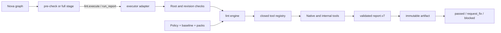

# Extend Lint

Status: implemented
Audience: lint rule author, policy maintainer, Nova maintainer
Owner: lint
Evidence: skills/nova/plugins/lint/plugin.json; skills/nova/plugins/lint/src; skills/nova/plugins/lint/tests; charts/kubeclaw/files/config
Evidence revision: `32b02816cc19cc8865a45b221b8b6ca28e99e8fb`
Applies to: `kubeclaw.lint` and the shipped lint policy
Last verified: source and focused package checks on 2026-09-20

## Objective

Add or change lint behavior without bypassing policy, filesystem authority,
report validation, or Nova lifecycle ownership.

Read the [Lint Policy Reference](../reference/lint-policy.md) for every current
tool and repository-owned rule, plus exact configuration, scope, severity,
baseline, admission, policy-pack, and failure behavior.

Use the [generated policy facts](../reference/lint-policy-generated.md) for the
exact current values. Use the [rule and finding reference](../reference/lint-rules.md)
for triggers, safe forms, remediation, and operational error codes.

## Architecture



The stages own pipeline meaning. They select a tier, invoke `lint.execute`, store
the report, and return a canonical stage result. They do not run commands or
inspect files. The executor adapter owns filesystem and process authority. The
engine owns policy interpretation, discovery, selection, normalization,
fingerprints, and report construction.

This split prevents a quality rule from granting itself process or filesystem
access. Operators grant the adapter. Pipeline code receives a validated report.

This security explanation is an inference from the current ownership boundaries,
not a declared compatibility guarantee. The split costs an adapter call, schema
validation, and artifact storage for every stage run. Reconsider it only if those
costs are measured to dominate lint execution and a replacement still keeps
process authority out of stages and acceptance authority out of tools.

> **Implementation evidence:** [The manifest registers two stages and one
> adapter](https://github.com/datrab/kubeclaw/blob/32b02816cc19cc8865a45b221b8b6ca28e99e8fb/skills/nova/plugins/lint/plugin.json#L1-L48).
> [The stage maps reports to lifecycle meaning](https://github.com/datrab/kubeclaw/blob/32b02816cc19cc8865a45b221b8b6ca28e99e8fb/skills/nova/plugins/lint/src/stage.ts#L24-L100).
> [The adapter owns admission, candidate isolation, cancellation, and shutdown](https://github.com/datrab/kubeclaw/blob/32b02816cc19cc8865a45b221b8b6ca28e99e8fb/skills/nova/plugins/lint/src/adapter.ts#L28-L63).

## Pre-Check And Full

Pre-check selects applicable pre-check tools. Full selects both pre-check and
full tools. A tool also needs a detected language or its own detection condition.
Experimental tools need `includeExperimental=true`.

The tiers are cumulative because final acceptance must not omit earlier fast
checks. Selected tools run sequentially in registry order. This makes logs,
cancellation, cache use, and failure attribution deterministic.

Those reasons are the current design inference. Cumulative tiers repeat fast
work in a later full run, and sequential execution increases wall time. Reconsider
the tier model if measured duplicate work or latency exceeds its diagnostic value;
preserve deterministic inventory, cancellation, and acceptance evidence in any
replacement.

Both stages use the same schemas. Their only fixed difference is the tier. Test
both paths after a shared policy, discovery, normalization, or reporting change.

> **Tier evidence:** [Selection applies cumulative tier, experimental, and
> detection filters](https://github.com/datrab/kubeclaw/blob/32b02816cc19cc8865a45b221b8b6ca28e99e8fb/skills/nova/plugins/lint/src/engine/report.ts#L166-L190).

## Choose The Smallest Change

| Need | Correct change | Reason |
| --- | --- | --- |
| Change timeout, paths, scope, severity, arguments, or tier | Policy | The adapter already exists. |
| Add a supported Kubernetes check | Policy-pack rule | Data is sufficient; no executable code is needed. |
| Add a Kubernetes rule type | Pack validator and evaluator | The closed type vocabulary needs new meaning. |
| Add an analyser | Tool adapter and policy entry | Execution and canonical policy stay exact. |
| Add a language or target family | Policy validation, discovery, and tools | Evidence and authority vocabularies are closed. |
| Change pipeline outcome semantics | Stage or report contract | Only this boundary owns lifecycle meaning. |

Do not create another stage only to run one command. A stage is a lifecycle
boundary. Add the analyser to the engine unless the work has distinct pipeline
meaning and a separate typed result.

## Start From A Known State

Make a lint change in a clean checkout. The supported local check environment is
Node.js 24 with dependencies installed from the root lockfile. The focused suite
does not require native analysers. The live fixture also requires `shellcheck`,
`shfmt`, and GNU `flock` from `util-linux`.

Provision these programs through the approved package mechanism for your host.
For example, an authorized Debian or Ubuntu administrator can install the three
native programs with `apt-get install shellcheck shfmt util-linux`. The command
needs package-network access and host-administration authority. It is not a step
to run on a workstation that you do not administer.

Verify the clean checkout and exact minimum instead of relying on version output
that nobody checks:

```bash
test -z "$(git status --porcelain)"
npm ci --ignore-scripts
test "$(node -p "process.versions.node.split('.')[0]")" = 24
command -v shellcheck
command -v shfmt
command -v flock
flock --version | grep -F 'util-linux'
```

Stop if the first command fails. `flock --version` must identify util-linux;
BusyBox `flock` is not sufficient. These commands support the package fixture,
not every configured analyser. The complete runtime authority is
`docker/Dockerfile.nova`, generated from `versions.json`, the hashed Python and Go
locks under `docker/`, and `docker/nova-tools/package-lock.json`. Build or run that
image for target-runtime acceptance; do not substitute a collection of unpinned
host binaries. Different analyser versions can emit different codes or output
shapes.

Build the complete target tool image and mount the clean checkout at a separate
path. The mount keeps the report and source changes in the checkout:

```bash
docker build --file docker/Dockerfile.nova --tag kubeclaw-nova-lint:local .
docker run --rm --entrypoint sh \
  --volume "$PWD:/workspace" --workdir /workspace \
  kubeclaw-nova-lint:local -lc \
  'npm run lint:report -- --working-directory . --policy charts/kubeclaw/files/config/lint-policy.json --policy-project workspace --tier full --helm-chart charts/kubeclaw --include-debt --include-experimental --output artifacts/lint-report.json'
```

The build must complete before the run starts. Exit 0 means that all selected
tools completed and no blocking finding remains. Exit 1 means policy loading, a
required tool, report construction, or report-output persistence failed. Exit 3
means the runner wrote a valid report with one or more blocking findings. Exit 2
means that required CLI input is absent or invalid. It prints the usage text to
standard error and writes no report. Correct the command before retrying. If an
exit-1 run wrote the file, inspect `summary.tools_failed`. If the file is absent,
read the runner's JSON error: engine validation can have failed, or validation
can have succeeded before directory creation or atomic output writing failed.

> **Runner evidence:** [The maintained runner validates, writes atomically, and
> assigns exit status](https://github.com/datrab/kubeclaw/blob/32b02816cc19cc8865a45b221b8b6ca28e99e8fb/scripts/run-lint-report.mjs#L92-L145).

The explicit `--helm-chart` replaces the canonical Kubernetes input list for
this source-checkout run. The policy also names
`Projects/buster-infra-smoke/src/deployment.yaml`, which the deployed workspace
creates but a clean source checkout does not contain. Do not remove the override
and then interpret `does not exist` as a lint finding. A deployment acceptance
run uses the real generated manifest and chart list without an override.

Before an edit:

1. Run `git status --short` and stop for any unrelated change in a target file.
2. Run `npm run docs:lint-policy:check`.
3. Run `npm run build --prefix skills/nova/plugins/lint`.
4. Run the focused non-live suite shown in the proof ladder.
5. Run the live fixture only when its three native prerequisites pass the checks above.

The second action proves that generated policy facts match the current
configuration. The next two actions establish a focused baseline. Record a
missing native prerequisite separately from a product failure.

## Change Existing Tool Settings

Edit a tool's policy entry when its adapter already supports the intended
behavior. The [generated reference](../reference/lint-policy-generated.md)
shows every current field.

1. State the observed problem and the affected tool.
2. Identify whether the change affects selection, execution, or acceptance.
3. Change only the owning policy field or native configuration.
4. Regenerate facts with `npm run docs:lint-policy:generate`.
5. Run the clean and failing cases for the affected scope.
6. Run pre-check when the tool belongs to pre-check.
7. Run full lint for every tool change.
8. Compare tool selection, findings, policy digest, and config digests.
9. Run the proof ladder before review.

Use these ownership rules:

| Desired change | Owning field | Required evidence |
| --- | --- | --- |
| Allow more execution time | `timeout_ms` | Measured normal duration and a retained timeout case. |
| Change when the tool runs | `tier` or `scope` | Selection tests for changed-file, module, project, and full inputs. |
| Change accepted severity | `blocking_severity` | Report and stage-result tests at both sides of the threshold. |
| Change files inspected | `targets`, `include`, or `exclude` | Positive, excluded, path-escape, and symlink cases. |
| Change native rule behavior | `config_path` content | Clean, finding, exception, config-digest, and parser cases. |
| Make a binary optional | `required=false` | Missing binary becomes `not_applicable`; an installed binary still runs. |

`required=false` does not disable an installed tool. It changes only the result
when its binary is absent. Do not use it as a rollout switch.

## Make A Tool Experimental Or Blocking

Add a tool ID to `experimental_tools` for a measured, nonblocking rollout. An
experimental tool runs only when `includeExperimental=true`. Its findings cannot
block and cannot enter the baseline.

1. Add the exact existing tool ID to `experimental_tools`.
2. Remove all baseline entries for that tool before validation.
3. Run full lint without `includeExperimental`.
4. Confirm that the tool is absent from execution results.
5. Run full lint with `includeExperimental=true`.
6. Confirm that finding objects appear in `findings`, that the numeric
   `experimental_findings` count covers them, and that errors, warnings,
   blocking findings, and baselined findings are zero.
7. Record the promotion condition and measurement period.

To promote the tool, remove its ID from `experimental_tools`. Add rule-admission
evidence for each new repository-owned blocking rule. Correct findings or use
approved, expiring debt before the blocking rollout.

Experimental mode is the supported temporary disablement from normal runs. The
policy has no general `enabled` field. Before moving a blocking tool to
experimental, capture the current full report, name an owner and restoration
date, remove that tool's baseline groups, and record the lost blocking coverage.
During the interval, invoke full lint with `includeExperimental=true` to retain
measurement. Restore the tool by removing its ID from `experimental_tools`,
resolving or approving the measured findings, restoring any still-valid admission
evidence, and running both tiers. If the stop condition is permanent, complete
the tool-removal procedure instead; do not leave an indefinite experimental entry.

There is no engine-level switch for one rule inside a blocking tool. Temporarily
disable such a rule only in its owning native configuration, with an owner,
tracking item, expiry, retained finding fixture, and an explicit statement of the
lost coverage. Re-enable it by removing that native override and running its clean
and finding cases plus both applicable tiers. If its principle is retired, use the
rule-removal lifecycle below.

## Add A Rule To An Existing Tool

Use this path when ESLint, Semgrep, Ruff, ShellCheck, Hadolint, yamllint, TFLint,
or another installed tool already owns the rule language.

1. Confirm that targets and include patterns reach the intended files.
2. Add the rule to the native configuration.
3. Decide whether it is blocking or experimental. A rule in blocking `eslint`
   inherits that tool's blocking threshold.
4. Add `rule_admission` evidence for a new repository-owned blocking rule.
5. Fix current findings or add narrow, approved, expiring fingerprints.
6. Test one finding, one clean case, config failure, parser failure, and stable
   fingerprint behavior.
7. Run each applicable tier and inspect policy and config digests in the report.

Do not use a permanent baseline entry. Put a real boundary exemption in the
canonical native configuration, where readers can see it.

> **Rule evidence:** [ESLint keeps rules and exact boundary exemptions together](https://github.com/datrab/kubeclaw/blob/32b02816cc19cc8865a45b221b8b6ca28e99e8fb/charts/kubeclaw/files/config/eslint.config.mjs#L255-L338),
> and [admission validation requires a principle and remediation](https://github.com/datrab/kubeclaw/blob/32b02816cc19cc8865a45b221b8b6ca28e99e8fb/skills/nova/plugins/lint/src/engine/lint-governance.ts#L45-L65).

## Change Or Remove A Rule

A rule change can invalidate fingerprints and can change acceptance without a
tool or policy-version change. Treat trigger, message, severity, file group,
exception, and remediation changes as rule behavior changes.

1. Record the old and new behavior with one matching and one nonmatching case.
2. Inspect active baseline entries for the tool and code.
3. Change the owning native config or engine evaluator.
4. Preserve the code when the rule still represents the same condition.
5. Select a new code when the condition has a new meaning.
6. Update admission evidence for a new blocking meaning.
7. Run both cases and compare fingerprints.
8. Remove obsolete baseline entries with a complete debt-visible report.
9. Update the rule reference and generated facts.

Remove a rule only after its replacement or retired principle is explicit.
Remove its native configuration, admission entry, tests, documentation, and
remaining baseline entries together. Then regenerate policy facts, run an
unscoped debt-visible full report, prune only fingerprints proved stale, and run
full lint again against the new baseline digest. Retain historical immutable
reports and the change record. A hidden disable comment is not removal.

## Add A Local ESLint Rule

Use a local rule when a repository architecture constraint cannot be expressed
clearly by a standard rule.

1. State the engineering principle in one sentence.
2. Add blocking rules to the local `discipline` plugin. Add audit-only evidence
   rules to `type-evidence-eslint-plugin.mjs`.
3. Use a stable lowercase ID and one actionable message.
4. Match the smallest correct syntax set. Handle tests, fixtures, generated
   sources, and legitimate boundaries explicitly.
5. Add positive, negative, and false-positive fixtures.
6. Enable it in the correct file group. Add admission evidence if it blocks.
7. Run the ESLint discipline, type-evidence, and repository configuration tests.

The type-evidence rules are experimental. Moving one into the blocking gate is
an admission decision, not only a severity edit.

> **Examples:** [The discipline plugin implements blocking local rules](https://github.com/datrab/kubeclaw/blob/32b02816cc19cc8865a45b221b8b6ca28e99e8fb/charts/kubeclaw/files/config/eslint.config.mjs#L65-L253),
> while [the type-evidence plugin implements audit rules separately](https://github.com/datrab/kubeclaw/blob/32b02816cc19cc8865a45b221b8b6ca28e99e8fb/charts/kubeclaw/files/config/type-evidence-eslint-plugin.mjs#L226-L307).

## Add A Tool

A tool adapter converts one analyser into the common report model. It does not
decide the stage outcome.

1. Add one object with stable `id`, display `name`, executable `binary`, optional
   `detect(ctx)`, and async `run(ctx)`.
2. Register it in its implementation family or import that family from
   `tool-registry.ts`.
3. Use `safeExec()` for native processes. Pass signal, working directory,
   configured timeout, input, and only allowlisted environment overrides.
4. Distinguish documented nonzero finding exits from timeout or failed start.
5. Parse output strictly. Use `failParse()` when output cannot prove a complete
   result. Never convert malformed output into zero findings.
6. Return error and warning counts, findings, and bounded evidence. Findings need
   file or `null`, coordinates where known, severity, stable code, and useful message.
7. Add `fingerprint_seed` when code, file, and message are not stable identity.
8. Add exactly one policy entry with category, scope, tier, timeout, threshold,
   languages, config, targets, and filters.
9. Add the native config and runtime binary where required.
10. Add admission evidence or experimental selection.
11. Test detection, findings, malformed output, missing binary, documented
    nonzero exit, timeout, abort, cleanup, fingerprint, baseline, and report.
12. Test policy-without-adapter and adapter-without-policy failures.

The two-sided registry check prevents dormant code and policy that claims a
check which no implementation runs.

> **Tool evidence:** [The registry requires an exact adapter-policy match](https://github.com/datrab/kubeclaw/blob/32b02816cc19cc8865a45b221b8b6ca28e99e8fb/skills/nova/plugins/lint/src/engine/tool-registry-core.ts#L105-L129).
> [Native execution applies timeout and environment controls](https://github.com/datrab/kubeclaw/blob/32b02816cc19cc8865a45b221b8b6ca28e99e8fb/skills/nova/plugins/lint/src/engine/execution.ts#L8-L95).
> [The report engine normalizes tool success and failure](https://github.com/datrab/kubeclaw/blob/32b02816cc19cc8865a45b221b8b6ca28e99e8fb/skills/nova/plugins/lint/src/engine/report.ts#L104-L163).

## Remove A Tool

The registry is closed in both directions. Removing only the adapter produces
`LINT_POLICY_ADAPTER_MISSING`. Removing only policy produces
`LINT_POLICY_TOOL_MISSING`.

1. Confirm that no supported reader task depends on the tool's unique result.
2. Identify replacement coverage or record the intentional coverage loss.
3. Remove its baseline groups and rule-admission records.
4. Remove the adapter registration and implementation.
5. Remove the policy entry in the same change.
6. Remove its native configuration when no other tool owns it.
7. Remove its runtime binary only after checking other consumers.
8. Update the rule, policy, and generated references.
9. Test both closed-registry mismatch failures with temporary fixtures.
10. Run full lint and verify that the report inventory no longer expects it.
11. Remove stale target-image packages or locks only when no other consumer uses
    them, rebuild the Nova image, and confirm the old tool and config are absent.

Retain historical reports as evidence. Do not rewrite old report artifacts to
remove the retired tool. Remove current baseline, admission, generated-reference,
and configuration data; keep Git history, issued reports, approvals, and migration
records as the audit trail.

## Add A Target Or Language

Targets are filesystem authority, not only command arguments.

For a target in an existing language:

1. Add a repository-relative target and narrow include patterns.
2. Check global and tool exclusions.
3. Prove that path components and symlinks stay in repository and project roots.
4. Test changed-file, module, project, and full behavior as applicable.

For a new language:

1. Add it to the closed `LANGUAGES` set.
2. Define required language-evidence patterns and discovery tests.
3. Decide whether it needs a canonical authority section like Go modules or
   Terraform roots.
4. Add the adapter and exact policy entry.
5. Make detection depend on discovered evidence.
6. Test invalid evidence, missing markers, depth, exclusions, symlinks, and a
   multi-language project.

An empty tool-language list means language-neutral. It is not a shortcut around
new language discovery.

### Change, Disable, Or Remove A Target

For a path change, add and validate the new path before removing the old one.
Update every owning authority together: tool `targets`, include/exclude patterns,
language evidence, Go modules or Terraform roots, Kubernetes inputs, and
architecture roots where applicable. Run both paths through full scope, compare
findings and fingerprints, then remove obsolete current baseline entries only
with the reviewed prune procedure. Roll back by restoring the old authority and
config together, not only the path string.

There is no target `enabled` flag. To stop checking one target temporarily,
remove it from every applicable tool and canonical authority, record the lost
coverage, owner, tracking item, and restoration date, and retain a fixture that
would fail when the target is restored. An applicable tool must still have at
least one target. If none remains, make the whole tool non-applicable through an
intentional language/project change, move the whole tool to the time-bounded
experimental lifecycle, or remove the tool; an empty target list is rejected.

For permanent removal, first prove that no tool, language authority, architecture
layer, pack input, or reader task still names the path. Remove its policy entries,
tests, fixtures, documentation, native config fragments, and obsolete current
baseline records. Run discovery, path escape, symlink, affected-scope, and full
report checks. Keep historical reports and Git history; delete generated or
runtime copies only after deployment no longer selects them.

> **Target evidence:** [Policy closes the language vocabulary](https://github.com/datrab/kubeclaw/blob/32b02816cc19cc8865a45b221b8b6ca28e99e8fb/skills/nova/plugins/lint/src/engine/policy.ts#L12-L16),
> [discovery uses declared evidence](https://github.com/datrab/kubeclaw/blob/32b02816cc19cc8865a45b221b8b6ca28e99e8fb/skills/nova/plugins/lint/src/engine/discovery.ts#L138-L159),
> and [target checks cover native traversal](https://github.com/datrab/kubeclaw/blob/32b02816cc19cc8865a45b221b8b6ca28e99e8fb/skills/nova/plugins/lint/src/engine/policy-paths.ts#L43-L55).

## Add A Policy Pack

Use a new pack when another deployment group needs a different approved set of
the six supported Kubernetes rule types.

Current delivery blocker: the chart packages the canonical pack under
`charts/kubeclaw/files/config/`, but `configmap-swarm-config.yaml` includes only
`lint-policy.json`, and the deployment init and runtime-config copy paths also
omit the referenced pack. The loader resolves a pack path beside the absolute
policy path. Therefore stop deployment acceptance if the selected policy names a
pack and that exact file is absent beside the deployed policy; a source-tree or
generator check is not delivery proof.

Before claiming a pack is shipped, a product change outside this documentation
must add each selected pack to the swarm ConfigMap, copy it from
`/init-swarm-config` to `/config`, copy it from `/config` to `/runtime-config`,
and add render/deployment tests that compare the delivered bytes and SHA-256 with
the policy entry. The deployed stage must then load the absolute
`/runtime-config/lint-policy.json` and complete a full run whose pack evidence has
the expected ID, version, and digest. This guide does not make those product
changes.

1. Create JSON with schema version, stable ID, semantic version, and non-empty rules.
2. Give each rule a stable unique ID, severity, supported type, and exact parameters.
3. Stay within 1 MiB and 256 rules.
4. Calculate SHA-256 over the exact bytes.
5. Add ID, version, relative path, and digest to the canonical policy.
6. Select the pack ID in the project.
7. Test clean and failing manifests for every rule, including relevant init
   container, service account, namespace, optional reference, and `envFrom` cases.
8. Run full lint and verify report pack digest and pack evidence.

Change the version when meaning changes. Change the digest after every byte
change. Never update a digest only to make an unexplained pack pass.

To deactivate a pack, remove its ID from the project's `policy_packs`, run full
lint, and confirm the pack evaluator is not selected. Keep the top-level pack
entry only during a dated rollback window. The loader still loads every top-level
entry, so an inactive retained pack must remain delivered and valid. To reactivate
it, restore selection and verify the exact ID, version, path, digest, findings,
and deployment bytes.

To remove a pack, first deactivate it in every project. Then remove its top-level
policy entry, file, chart-delivery entry, copy logic, fixtures, generated facts,
and obsolete current baseline records. Preserve historical reports and Git
history. For a migration, admit old and new pack files as distinct versions,
test both, change project selection in one reviewed step, and remove the old pack
only after the rollback window. Roll back by restoring the old selection and
exact old bytes and digest; never attach old bytes to the new version or rewrite
an issued report.

> **Pack evidence:** [Admission binds path, bytes, digest, ID, version, and rules](https://github.com/datrab/kubeclaw/blob/32b02816cc19cc8865a45b221b8b6ca28e99e8fb/skills/nova/plugins/lint/src/engine/kubernetes-policy-pack.ts#L67-L115),
> and [execution preserves manifest and pack evidence](https://github.com/datrab/kubeclaw/blob/32b02816cc19cc8865a45b221b8b6ca28e99e8fb/skills/nova/plugins/lint/src/engine/kubernetes-policy-tools.ts#L135-L155).

## Add A Policy-Pack Rule Type

A new type adds executable meaning and needs wider proof than a new rule instance.

1. Add the type to `RULE_TYPES`.
2. Define exact parameters in `parametersForRule()` and reject unknown or
   contradictory values.
3. Add evaluation to a clearly named evaluator.
4. Define applicable workload kinds, container groups, namespaces, and indexes.
5. Return stable `kubernetes-policy/<rule-id>` findings with source coordinates.
6. Test admission and evaluation independently.
7. Test every applicable workload and prove intentional non-applicability.
8. Add the type to the [policy reference](../reference/lint-policy.md#kubernetes-policy-packs).

Keep executable meaning in code and values in packs. Packs cannot contain code,
templates, or command strings.

## Change A Baseline Or Waiver

Use a baseline only when a finding is real, immediate correction is unsafe, and
an owner accepts time-bounded debt.

1. Capture the fingerprint from a validated full report.
2. Record tool, owner, reason, tracking, creation, later expiry, approver, and approval date.
3. Keep each tool/fingerprint pair unique.
4. Run normal output and verify that active count falls while debt count remains.
5. Run with `includeDebt=true` and verify finding and waiver metadata.
6. Run an unscoped full report to reject stale entries.

Experimental findings cannot be baselined. Avoid casual message changes when the
default fingerprint includes the message. Supply a stable seed when necessary.

> **Fingerprint evidence:** [The engine derives and applies fingerprints here](https://github.com/datrab/kubeclaw/blob/32b02816cc19cc8865a45b221b8b6ca28e99e8fb/skills/nova/plugins/lint/src/engine/finding-fingerprints.ts#L4-L53).

### Add Approved Debt With The Maintained Helper

Start with a validated report that discloses the active findings. The report
must bind the current baseline digest. Produce and retain that report with the
engine runner. Run this command in the target image when the host does not have
the complete pinned analyser set:

```bash
npm run lint:report -- \
  --working-directory . \
  --policy charts/kubeclaw/files/config/lint-policy.json \
  --policy-project workspace \
  --tier full \
  --helm-chart charts/kubeclaw \
  --include-debt \
  --include-experimental \
  --output artifacts/lint-report.json
```

Run this command inside the target image because policy validation requires its
pinned Kubernetes schema tree. Exit 3 is an expected result when active blocking findings are the reason for
the proposed waiver. Exit 1 is not acceptable: inspect `summary.tools_failed`
and correct the policy, tool, or runtime failure first. Confirm that the report's
policy and baseline digests match the files under review before using it as
helper input.

```bash
node scripts/lint-baseline-update.mjs \
  --report artifacts/lint-report.json \
  --baseline charts/kubeclaw/files/config/lint-baseline.json \
  --tool eslint \
  --owner pipeline-maintainers \
  --reason "Tracked refactor cannot complete in this change" \
  --created 2026-09-20 \
  --expires 2026-10-20 \
  --tracking ISSUE-123 \
  --approved-by pipeline-maintainers \
  --approved-on 2026-09-20
```

Replace every example value with the approved record. The helper checks ISO-date
shape and ordering, an old baseline digest, experimental findings, and an empty
result. It does not prove that a shaped date exists in the calendar. The full
policy loader performs that calendar validation, so run full lint after the
write. Review the written fingerprints before commit.

### Remove Resolved Debt

Create an unscoped full report with `includeDebt=true`. Then check pruning
without writing:

```bash
node scripts/lint-baseline-prune.mjs \
  --report artifacts/lint-report.json \
  --baseline charts/kubeclaw/files/config/lint-baseline.json
```

Exit 0 with `lint baseline is fresh` means that no pruning is necessary; stop
this procedure. Stale entries produce a nonzero exit with
`lint baseline contains N stale fingerprint(s); rerun with --write to prune
them`. That exact result permits preparation of a reviewed candidate, but the
count alone cannot authorize deletion because it does not identify tools or
fingerprints. Any other error, including a digest, scope, debt-visibility,
tool-status, JSON, or file-access error, means that the input is not safe for
pruning. Stop and correct or regenerate the report.

After the exact stale-fingerprint result, make a review copy, write the
candidate, and inspect the exact diff:

```bash
cp charts/kubeclaw/files/config/lint-baseline.json /tmp/lint-baseline.before.json
node scripts/lint-baseline-prune.mjs \
  --report artifacts/lint-report.json \
  --baseline charts/kubeclaw/files/config/lint-baseline.json \
  --write
diff -u /tmp/lint-baseline.before.json charts/kubeclaw/files/config/lint-baseline.json
```

Restore the reviewed copy before proceeding if any removed fingerprint is not
expected. The helper writes through a temporary file and then renames it. Run
full lint again because the baseline digest changed, and delete the temporary
review copy after the reviewer accepts the change.

> **Baseline-helper evidence:** [The update helper validates report identity,
> approval fields, and active fingerprints](https://github.com/datrab/kubeclaw/blob/32b02816cc19cc8865a45b221b8b6ca28e99e8fb/scripts/lint-baseline-update.mjs#L1-L78).
> [The prune helper requires a complete debt-visible report](https://github.com/datrab/kubeclaw/blob/32b02816cc19cc8865a45b221b8b6ca28e99e8fb/scripts/lint-baseline-prune.mjs#L1-L58).

## Version, Migration, And Rollback

`versions.json` is the version authority for Nova image inputs.
`docker/nova-tools/package.json` and its lockfile own the JavaScript analysers.
The [generated version table](../reference/lint-policy-generated.md#runtime-analyser-version-authority)
lists the current lint-relevant pins from those sources. Do not copy their
values into another maintained table.

The dated Debian snapshot supplies ShellCheck, yamllint, and util-linux
`flock`. It does not give them independent version fields in policy. Their
effective deployed identity is the immutable Nova image plus that snapshot.
CI and local checks use Node.js major 24. The target runtime inherits Node from
its exact base image, so the base image digest owns the patch version.

Run `npm run versions:check` to compare every generated Dockerfile and runtime
lock with those authorities. To update a version, edit `versions.json` or the
owning exact package manifest, refresh checksums and hashed locks through
the maintained updater, run `npm run versions:sync`, review every generated
change, then run `npm run versions:check` and rebuild the Nova image. The trusted
automated route is `scripts/updates/refresh-versions.mjs` as constrained by
`.github/workflows/dependency-updates.yaml`; do not hand-edit generated Dockerfile
defaults or retain an old checksum for a new release.

Change a contract version when required fields or their meaning change. The
loader does not upgrade old documents. A migration must update the producer,
validator, canonical configuration, fixtures, and documentation together.

1. Define the old and new meaning before changing the version.
2. Update parsing and validation before accepting new input.
3. Update report construction and report validation together.
4. Convert canonical policy, baseline, packs, and fixtures as applicable.
5. Regenerate the exact policy reference.
6. Test rejection of the old version.
7. Test acceptance and evidence identity of the new version.
8. Run a target-runtime check with the pinned native tools.

Rollback by reverting the complete contract change and its configuration. Do
not restore only an old version string. Reports created under the rejected
contract remain historical evidence and are not valid input to the restored one.

For a policy-only change, retain the previous reviewed file and native config in
Git. Revert both when the measured result is unsafe. Regenerate facts and run
both tiers after rollback. Never edit an immutable report to make it match.

## Change The Report Contract

Lint has no separate `reportAdapter` registration. Its report validator performs
that boundary inside the stage before storage and interpretation. The stage now
binds the configured policy project, requested tier, requested module scope,
optional project name, and visibility flags. The validator also requires
SHA-256 syntax, repository-relative effective targets, bounded evidence, a valid
finding shape, and totals recomputed from tool results.

The engine builds policy, baseline, native-config, pack, and target identities
from files that it loaded. The stage does not reload those files independently.
Thus, the adapter remains trusted to return the engine-produced identity maps.
The validator can compare expected policy, baseline, config, pack, target, and
tool inventories when a caller supplies those expectations. The current stage
supplies only the request values listed above. Do not describe stage validation
as an independent second load of every policy input.

1. Change the report version when meaning or required fields change.
2. Update builder and validator together.
3. Recompute summary counts instead of trusting producer totals.
4. Bind policy, baseline, config, pack, targets, scope, tier, and visibility.
5. Preserve evidence limits and content digest checks.
6. Test hostile reports: missing tools, false totals, changed policy identity,
   invalid fingerprints, excess evidence, and hidden debt or experimental counts.
7. Change the stage only when lifecycle meaning changes.

Run the exact hostile-contract suite after each builder or validator change:

```bash
npm run test:focused --prefix skills/nova/plugins/lint
```

The `lint-report-contract` result must state `"hostileCases":8` and
`"cleanup":true`. The cases reject a missing tool, false totals, changed policy,
pack, or target identity, an invalid fingerprint, excess evidence, and hidden
debt. The focused suite also checks stage rejection when an adapter returns the
wrong tier. Add a hostile case for every new identity or counter before changing
the contract version. Revert the builder, validator, stage, schema version, and
fixtures together if the new contract cannot pass this command. The test removes
its temporary stored-report fixture; no cleanup file may remain under `src/`.

Recomputation prevents an analyser from deciding acceptance by reporting false totals.

> **Contract evidence:** [The validator checks findings, evidence, policy
> identity, scope, inventory, and recomputed summary](https://github.com/datrab/kubeclaw/blob/32b02816cc19cc8865a45b221b8b6ca28e99e8fb/skills/nova/plugins/lint/src/engine/report-contract.ts#L38-L231).

## Failure And Cleanup Rules

- Missing optional tools are `not_applicable`; missing required tools are errors.
- Timeout, failed start, malformed output, and exceptions are not clean results.
- Cancellation rejects the invocation and cannot become a normal report.
- Adapter shutdown aborts active invocations and waits for settlement.
- TERM then KILL covers the Linux process group; completion requires descendant exit.
- Candidate cleanup always runs in `finally`.
- Invalid policy or report stops the stage before a quality decision.

This process control is not a general sandbox. Source, configuration, and
installed binaries remain in the operator trust boundary.

## Activate And Observe The Change

The plugin manifest already registers `kubeclaw.lint:pre-check`,
`kubeclaw.lint:full`, and `kubeclaw.lint:executor`. A rule or policy change does
not need another registration. A new tool becomes active when its adapter is in
the closed registry and its policy entry passes validation.

Use an absolute `policyPath` in stage configuration and select an existing
`policyProject`. The schema accepts a nonempty relative path, but the adapter
resolves it against the Nova process working directory before root admission.
An absolute path avoids a deployment-dependent result; it is an operational
requirement of this guide, not a schema constraint. Set `includeExperimental`
only when the run must disclose experimental tools. Set `includeDebt` only when
the reader is authorized to see waived finding bodies.

The executor configuration must admit the canonical repository and policy
roots. The `lint.execute` grant must admit the same roots and project identity.
These are separate checks. Passing one does not bypass the other.

After a run, inspect the immutable `kubeclaw.lint` artifact:

1. Confirm `tier`, `scope`, and `changed_files` match the request.
2. Confirm the policy, baseline, native-config, and pack digests match the intended inputs.
3. Confirm the changed tool appears with the expected mode and status.
4. Confirm the finding code, severity, location, and fingerprint are stable.
5. Confirm summary totals equal the visible tool results.
6. Confirm the stage returns `passed`, `request_fix`, or `blocked` for the documented reason.

Stop when the policy digest is unexpected, a required tool is absent, a parser
fails, or cleanup is uncertain. Do not retry as if the result were a normal
finding. Correct the authority, runtime, or configuration first.

Use the maintained engine runner to check a changed canonical policy and keep its
report:

```bash
npm run lint:report -- \
  --working-directory . \
  --policy charts/kubeclaw/files/config/lint-policy.json \
  --policy-project workspace \
  --tier pre-check \
  --helm-chart charts/kubeclaw \
  --output artifacts/lint-pre-check-report.json

npm run lint:report -- \
  --working-directory . \
  --policy charts/kubeclaw/files/config/lint-policy.json \
  --policy-project workspace \
  --tier full \
  --helm-chart charts/kubeclaw \
  --include-debt \
  --include-experimental \
  --output artifacts/lint-report.json
```

Run these commands inside the target image from “Start From A Known State.” The
chart override replaces the runtime-generated manifest that is absent from a
clean checkout. It does not prove that deployed input. The runner calls the same
engine as the executor and writes JSON only after contract validation. It returns
0 for a clean report, 1 for an engine, tool, or output-persistence failure, and 3
for blocking findings. Invalid or missing CLI arguments return 2, print usage to
standard error, and write no report. The runner does not activate capability
grants, store an immutable artifact, or map the report to a stage outcome. Use
the live fixture below for those boundaries. Keep the two report files as change
evidence; remove them before commit unless the change record intentionally owns
them.

### Run The Scope Matrix

Run these three target-image commands from the repository root. The changed-file
request also exercises `affected-projects`: `tsc` must appear because the changed
source belongs to a configured TypeScript project. A project-scoped tool always
uses the selected policy project's root; it has no separate request option.

```bash
docker run --rm --entrypoint sh --volume "$PWD:/workspace" --workdir /workspace kubeclaw-nova-lint:local -lc \
  'npm run lint:report -- --working-directory . --policy charts/kubeclaw/files/config/lint-policy.json --policy-project workspace --tier pre-check --helm-chart charts/kubeclaw --changed-file skills/nova/plugins/lint/src/stage.ts --output artifacts/lint-scope-changed.json'

docker run --rm --entrypoint sh --volume "$PWD:/workspace" --workdir /workspace kubeclaw-nova-lint:local -lc \
  'npm run lint:report -- --working-directory . --policy charts/kubeclaw/files/config/lint-policy.json --policy-project workspace --tier full --helm-chart charts/kubeclaw --module-path skills/nova/plugins/lint --output artifacts/lint-scope-module.json'

docker run --rm --entrypoint sh --volume "$PWD:/workspace" --workdir /workspace kubeclaw-nova-lint:local -lc \
  'npm run lint:report -- --working-directory . --policy charts/kubeclaw/files/config/lint-policy.json --policy-project workspace --tier full --helm-chart charts/kubeclaw --output artifacts/lint-scope-full.json'
```

Exit 0 or 3 produces a usable observation. Exit 1 is usable only when it wrote a
valid report and the expected scope tool is present; diagnose every failed tool.
Verify the request boundary exactly:

```bash
node -e 'const r=JSON.parse(require("node:fs").readFileSync("artifacts/lint-scope-changed.json")); if(!r.changed_files.includes("skills/nova/plugins/lint/src/stage.ts")||!("tsc" in r.tools)) throw new Error("changed/affected scope mismatch")'
node -e 'const r=JSON.parse(require("node:fs").readFileSync("artifacts/lint-scope-module.json")); if(r.scope!=="skills/nova/plugins/lint") throw new Error("module scope mismatch")'
node -e 'const r=JSON.parse(require("node:fs").readFileSync("artifacts/lint-scope-full.json")); if(r.scope!=="full"||r.changed_files.length!==0) throw new Error("full scope mismatch")'
```

Compare `policy.effective_targets`, the applicable tool inventory, and findings
between the three reports. Remove only these three generated files after retaining
required evidence:

```bash
rm -- artifacts/lint-scope-changed.json artifacts/lint-scope-module.json artifacts/lint-scope-full.json
```

The maintained live-function test builds a complete temporary runtime. It
activates registrations and grants, runs both tiers, creates blocking findings,
tests tool crashes, and checks two candidate revisions. Use it as the concrete
integration example instead of maintaining a second untested pipeline fragment.
Stage invocation is exercised through that maintained fixture. This repository
does not expose a standalone lint-stage CLI, so do not invent a command that
claims to invoke `kubeclaw.lint:pre-check` or `kubeclaw.lint:full` directly.

> **Activation evidence:** [The live-function fixture creates the adapter,
> grants, stages, artifact store, and candidate runs](https://github.com/datrab/kubeclaw/blob/32b02816cc19cc8865a45b221b8b6ca28e99e8fb/skills/nova/plugins/lint/tests/live-function.test.ts#L13-L230).
> [The plugin manifest owns the three registrations](https://github.com/datrab/kubeclaw/blob/32b02816cc19cc8865a45b221b8b6ca28e99e8fb/skills/nova/plugins/lint/plugin.json#L1-L48).

### Deliver New Native Configuration

A source file under `charts/kubeclaw/files/config/` is not automatically a
runtime file. The chart has a fixed ConfigMap data list. The init container also
has fixed copy lists from `/init-swarm-config` to persistent `/config` and then
to `/runtime-config`. A source-only run mounts the checkout and can succeed even
when these deployment paths omit a file.

Use a flat filename for each new native config and every module that it imports,
for example `eslint-<rule-id>-rule.mjs` and
`eslint-<rule-id>-experimental.config.mjs`. Kubernetes ConfigMap data keys cannot
represent a directory tree, and the current copy loops preserve one flat
filename. Do not put a runtime import only in a source subdirectory.

For each new file:

1. Add one data key to
   `charts/kubeclaw/templates/configmap-swarm-config.yaml`. Read the matching
   `files/config/<filename>` bytes with `.Files.Get`.
2. Add the same filename to the persistent-config copy list in
   `charts/kubeclaw/templates/deployment.yaml`. The source must be
   `/init-swarm-config/<filename>` and the destination must be
   `/config/<filename>`.
3. Add the filename to the runtime-config copy list in the same template. The
   source must be `/config/<filename>` and the destination must be
   `/runtime-config/<filename>`.
4. Keep every policy `config_path` and every relative JavaScript import beside
   `/runtime-config/lint-policy.json`. Do not point a deployed policy back into
   the chart source tree.
5. Extend `tests/verification/deployment/check-deployment-truth.mjs`. Render the
   chart, assert that the ConfigMap contains the exact key and source bytes, and
   assert the exact `/init-swarm-config/<filename>` to `/config/<filename>` and
   `/config/<filename>` to `/runtime-config/<filename>` pairs. Test all files in
   one imported config graph, not only its entry point. Make the new test print a
   JSON success record that names every checked file and both copy pairs.
6. Run `command -v helm` first. Stop if it prints no executable path. Then run
   `node tests/verification/deployment/check-deployment-truth.mjs`. Exit zero and
   the new JSON success record prove rendered delivery. Any absent record,
   byte mismatch, wrong copy pair, or nonzero exit fails this gate. The current
   test skips Helm assertions when Helm is absent, so its exit code alone is not
   sufficient evidence.
7. Run `npm run test:live --prefix skills/nova/plugins/lint` in the target image
   to prove stage, adapter, capability, artifact, and cleanup behavior. This
   fixture does not prove the chart's runtime files. No maintained command
   currently invokes a lint stage inside a deployed Nova pod and retains its
   report. Therefore, deployed extension activation remains blocked after source,
   render, and target-image acceptance. The
   [roadmap](../status/roadmap.md#lint-concurrency-and-deployed-extension-acceptance)
   defines the missing deployment fixture. Do not invent a `kubectl exec` stage
   command or claim deployed activation before that fixture exists.

Update an imported config graph and `eslint.config.mjs` in the same release.
Set the chart's supported override behavior deliberately: an old persistent
`eslint.config.mjs` can otherwise remain while newly copied modules change. Stop
the rollout if the deployed imports and module bytes do not belong to the same
reviewed change.

> **Delivery evidence:** [The ConfigMap enumerates each delivered lint file](https://github.com/datrab/kubeclaw/blob/32b02816cc19cc8865a45b221b8b6ca28e99e8fb/charts/kubeclaw/templates/configmap-swarm-config.yaml#L16-L49).
> [The init container owns both explicit copy stages](https://github.com/datrab/kubeclaw/blob/32b02816cc19cc8865a45b221b8b6ca28e99e8fb/charts/kubeclaw/templates/deployment.yaml#L634-L695).

The adapter also accepts separate invocations concurrently. Until discovery
diagnostics and native caches have tested per-invocation isolation, schedule one
lint stage at a time in each Nova process. Wait for the prior stage artifact or
failure and confirmed cleanup before starting the next acceptance run. See the
[policy concurrency boundary](../reference/lint-policy.md#tool-execution-contracts)
for the implementation evidence and the separate-process runner limit.

## Four Maintained Extension Walkthroughs

Each walkthrough names the files to change, the commands to run, the expected
observation, and the cleanup boundary. Existing tests prove the current example.
They do not prove a future extension until its new cases enter the same suites.

### Rule Walkthrough

Use `discipline/no-swallowed-error` as the local-rule model.

1. State the engineering principle, trigger, exceptions, and remediation before
   changing the gate.
2. Check admission evidence. If it does not exist, add a separate experimental
   ESLint tool through the complete tool walkthrough below. Put the reusable rule
   implementation in
   `charts/kubeclaw/files/config/eslint-<rule-id>-rule.mjs`. Import it from a new
   `charts/kubeclaw/files/config/eslint-<rule-id>-experimental.config.mjs`.
   Register the new ESLint adapter ID beside the existing ESLint registrations in
   `skills/nova/plugins/lint/src/engine/tool-registry-language-tools.ts`; reuse
   `runEslint`. Add the ID and config path to
   `charts/kubeclaw/files/config/lint-policy.json`, and put the ID in
   `experimental_tools`. The blocking `eslint` tool blocks at warning severity,
   so a warning setting in its config is not an experimental rollout. Deliver
   both new files through every step in “Deliver New Native Configuration”
   before a deployed measurement.
3. After the experimental measurement and approval exist, add the implementation
   to the `discipline.rules` object by importing the same reusable module into
   `charts/kubeclaw/files/config/eslint.config.mjs`. Enable it in the applicable
   file group and add `rule_admission` in the same change. This avoids two manual
   copies of the rule.
4. Add one matching case, one handled nonmatch, one false-positive boundary, and
   each supported exception to
   `skills/nova/plugins/lint/tests/eslint-discipline.test.mjs`.
5. Run `npm run test:focused --prefix skills/nova/plugins/lint`. The matching
   case must return only the new rule ID. Each accepted case must return no new ID.
6. Run the engine report command in the preceding section. Confirm the rule ID,
   file, location, message, and fingerprint in `artifacts/lint-report.json`.
   Repeat the run and confirm that the fingerprint does not change.
7. Add the trigger, non-trigger, exception, remediation, and limit to
   `docs/site/reference/lint-rules.md`. Run `npm run docs:lint-policy:generate` and
   `npm run docs:lint-policy:check`.
8. Remove the temporary adapter, policy entry, experimental config, tests, and
   experimental-tool documentation through the full tool-removal lifecycle. Keep
   the reusable rule module because the blocking config now imports it.

Build admission values from retained evidence, not memory:

1. Select reviewed full commit SHAs that contain the experimental rule. For each
   SHA, record the changed file set with
   `git diff-tree --no-commit-id --name-only -r <full-commit-sha>`.
2. Check out each SHA in a detached worktree with
   `git worktree add --detach /tmp/kubeclaw-lint-<short-sha> <full-commit-sha>`.
   Run the target-image full report there with `--include-experimental` and retain
   the JSON report under the approval record. Then remove that exact worktree with
   `git worktree remove /tmp/kubeclaw-lint-<short-sha>`.
3. Set `historical_commits` to the full SHAs that were actually run.
   `historical_changed_sets` is the number of distinct recorded commit diffs on
   which the rule ran. `false_positives` is the number of findings that the named
   approver classified as legitimate code after inspecting source and rule intent.
   Retain that classification beside the reports. The policy schema stores the
   count, not the per-finding rationale; the approval record is therefore required
   evidence.
4. Use the approver identity and approval date from that record. The policy loader
   checks shape, minimum counts, SHA syntax, and date validity. It cannot prove
   that the measurement happened.

Before the final blocking run, create
`skills/nova/plugins/lint/src/<rule-id>-acceptance-fixture.mjs` with the same
minimal matching source as the focused test. Run the full engine report with
`--changed-file skills/nova/plugins/lint/src/<rule-id>-acceptance-fixture.mjs`.
Confirm the new code, a stable fingerprint, and `total_blocking` above zero. The
focused stage and live suites separately prove that blocking reports map to
`request_fix`. Delete only that named fixture after the observation and confirm
`test ! -e skills/nova/plugins/lint/src/<rule-id>-acceptance-fixture.mjs`.
Do not commit the acceptance fixture or report unless the approval record owns it.

Rollback removes the new setting and admission record together, restores any
changed baseline from Git, regenerates the reference, and repeats the focused
suite. Remove temporary source fixtures in the test's `finally` block. Do not
commit `artifacts/lint-*.json` unless a change record explicitly owns them.

> **Maintained rule example:** [The implementation defines matching and exception
> forms](https://github.com/datrab/kubeclaw/blob/32b02816cc19cc8865a45b221b8b6ca28e99e8fb/charts/kubeclaw/files/config/eslint.config.mjs#L153-L173),
> and [the focused test covers a finding, handled error, and intentional
> exception](https://github.com/datrab/kubeclaw/blob/32b02816cc19cc8865a45b221b8b6ca28e99e8fb/skills/nova/plugins/lint/tests/eslint-discipline.test.mjs).

### Tool Walkthrough

Use `openapi-contract` as the internal-analyser shape, but do not treat its API
fixture as proof for process failures. A native analyser also needs the process
cases below.

1. Add `skills/nova/plugins/lint/src/engine/<tool>-tool.ts`. Define one stable
   ID, display name, binary identity, detector, and `run(ctx)` implementation.
2. Register the object through one registry family and import that family from
   `skills/nova/plugins/lint/src/engine/tool-registry.ts`. Do not mutate
   `TOOL_ADAPTERS` outside registration.
3. Add the exact policy entry in
   `charts/kubeclaw/files/config/lint-policy.json`. Start in
   `experimental_tools` unless valid blocking admission already exists.
4. For a native analyser, add its pinned installation to the owning Nova image
   input: `versions.json`, a hashed Python or Go lock, or
   `docker/nova-tools/package.json` and its lock. Do not put a binary version in
   lint policy. If the analyser has a native config, deliver that file through
   every step in “Deliver New Native Configuration.”
5. Add `skills/nova/plugins/lint/tests/<tool>.test.mjs` and include it in the
   `test:focused` script in `skills/nova/plugins/lint/package.json`. Cover
   absent detection, clean output, a finding exit, malformed output, missing
   binary, start failure, timeout, abort, descendant cleanup, stable
   fingerprint, baseline application, and report normalization. An internal
   analyser without a process marks the process-only cases not applicable with
   that reason; it must still test thrown and malformed input.
6. Run `npm run test:focused --prefix skills/nova/plugins/lint`. Its
   `lint-registry-lifecycle` case must still reject both a policy-only ID with
   `LINT_POLICY_ADAPTER_MISSING` and an adapter-only ID with
   `LINT_POLICY_TOOL_MISSING`.
7. Run both engine report commands. Without `--include-experimental`, the new
   tool must be absent. With it, the tool must occur once, its finding objects
   must remain under `findings`, and only `experimental_findings` may increase.
8. Build the Nova image and repeat the full report there. Confirm the pinned
   binary version before promotion. Update the rule and tool references, then
   regenerate and check policy facts.

Remove a rejected tool from the registry, policy, experimental list, admission,
baseline, runtime lock or image, tests, and references in one rollback. Run the
focused suite after removal; its closed-registry cases prove that a one-sided
rollback cannot pass.

> **Maintained tool examples:** [The OpenAPI analyser shows internal finding
> construction](https://github.com/datrab/kubeclaw/blob/32b02816cc19cc8865a45b221b8b6ca28e99e8fb/skills/nova/plugins/lint/src/engine/openapi-tool.ts#L6-L77).
> [The remediation suite shows native exit, timeout, abort, and cleanup
> behavior](https://github.com/datrab/kubeclaw/blob/32b02816cc19cc8865a45b221b8b6ca28e99e8fb/skills/nova/plugins/lint/tests/remediation.test.mjs).

### Target Or Language Walkthrough

Use Go module authority as the model for a language with canonical roots.

1. Add a new language to `LANGUAGES` in
   `skills/nova/plugins/lint/src/engine/policy.ts` and add its project
   `language_evidence` patterns. A pattern is selection evidence, not
   filesystem permission.
2. Add a typed project authority when a generic target is insufficient. Go uses
   `go.modules`; Terraform uses `terraform.roots` and an absolute provider mirror.
3. Add each analyser as described in the tool walkthrough. Bind its targets,
   include patterns, exclusions, scope, and detector to the new language.
4. Extend `skills/nova/plugins/lint/tests/discovery.test.mjs` with missing
   evidence, valid evidence, depth, global exclusion, and a project that detects
   both the new and an existing language. Extend
   `skills/nova/plugins/lint/tests/remediation.test.mjs` or a focused tool test
   with target escape, source symlink, changed-file, module, affected-project,
   and full scope.
5. Run `npm run test:focused --prefix skills/nova/plugins/lint`. Missing evidence
   must suppress only the new language. Valid evidence must preserve every other
   detected language. Escape or symlink cases must fail before native execution.
6. Run the exact changed-file, module, and full commands in “Run The Scope
   Matrix.” Repeat the changed-file and module commands with `--tier full`.
   Compare `detected_types`, `changed_files`, `policy.effective_targets`, tool
   inventory, and findings. A config-file change must expand the affected tool
   to its owning project as documented under scope.
7. Build the Nova image when the language adds a native tool. Update generated
   facts, `docs/site/reference/lint-policy.md`,
   `docs/site/reference/lint-rules.md`, and this extension guide.

To disable or remove the target, first retain one fixture that proves the lost
coverage. Change every owning authority listed in “Change, Disable, Or Remove A
Target,” rerun the same scope matrix, and inspect the canonical full report.
Rollback restores the old paths and authority together. Delete a runtime binary
only after the full report and repository search show no remaining consumer.

> **Maintained target examples:** [Policy validation binds Go and Terraform
> authority](https://github.com/datrab/kubeclaw/blob/32b02816cc19cc8865a45b221b8b6ca28e99e8fb/skills/nova/plugins/lint/src/engine/policy.ts#L93-L123),
> [discovery tests cover configured evidence and scope](https://github.com/datrab/kubeclaw/blob/32b02816cc19cc8865a45b221b8b6ca28e99e8fb/skills/nova/plugins/lint/tests/discovery.test.mjs),
> and [remediation tests cover native path boundaries](https://github.com/datrab/kubeclaw/blob/32b02816cc19cc8865a45b221b8b6ca28e99e8fb/skills/nova/plugins/lint/tests/remediation.test.mjs).

### Policy-Pack Walkthrough

Use `kubeclaw-default` as the pack model.

1. Create the pack beside the canonical policy. Set schema version, stable ID,
   semantic version, severity, supported rule types, and exact parameters.
2. Add clean and rejected resources for every rule to
   `tests/verification/contracts/check-pipeline-manifest-lint-implementation.mts`.
   Include each applicable container group, optional reference, service account,
   and namespace boundary.
3. Calculate the digest from the final bytes:

   ```bash
   sha256sum charts/kubeclaw/files/config/<pack-file>.json
   ```

4. Put that lowercase digest, exact ID, version, and relative path in
   `charts/kubeclaw/files/config/lint-policy.json`. Select the ID in the intended
   project.
5. Run the fixture in the Nova image. It requires `helm`, `kubeconform`, and the
   image's local schema tree:

   ```bash
   docker run --rm --entrypoint sh \
     --volume "$PWD:/workspace" --workdir /workspace \
     kubeclaw-nova-lint:local -lc \
     'node tests/verification/contracts/check-pipeline-manifest-lint-implementation.mts'
   ```

   Exit zero and the final JSON field `"phase":"manifest-lint-implementation"`
   prove completion. Any exception or nonzero exit fails the check. The fixture
   creates its data under an operating-system temporary directory and removes the
   exact directory in `finally`. Confirm `git status --short` shows no fixture
   change after the command.

   The maintained cases reject wrong bytes, wrong identity, an unsupported rule
   type, an unknown selection, oversized input, and excess rules. They also prove
   clean, finding, deselection, and removal behavior.
6. Run `npm run docs:lint-policy:generate` and
   `npm run docs:lint-policy:check`. Then run the full engine report and inspect
   `policy.policy_pack_digests` plus `policy-pack` evidence.

A valid pack produces `kubernetes-policy/<rule-id>` only for matching resources.
Any byte change without a digest update must fail before tools run. A deselected
top-level pack remains loaded and identified during a rollback window; it must
therefore remain valid. Removal deletes its top-level identity from the report.
Restore the exact old file, reference, digest, and project selection to roll back.

Source acceptance is the highest available result today. Do not claim deployed
acceptance until the delivery blocker in “Add A Policy Pack” is fixed and the
runtime copy has the same digest.

> **Maintained pack example:** [The shipped pack supplies all supported rule
> shapes](https://github.com/datrab/kubeclaw/blob/32b02816cc19cc8865a45b221b8b6ca28e99e8fb/charts/kubeclaw/files/config/kubernetes-policy-pack-default.json#L1-L50),
> and [the implementation fixture covers admission, lifecycle, and evaluation](https://github.com/datrab/kubeclaw/blob/32b02816cc19cc8865a45b221b8b6ca28e99e8fb/tests/verification/contracts/check-pipeline-manifest-lint-implementation.mts#L139-L360).

## Proof Ladder

Run the focused checks without the native live fixture:

```bash
npm run build --prefix skills/nova/plugins/lint
npm run test:focused --prefix skills/nova/plugins/lint
```

Success means every command exits zero; the Node test runner reports no failed
subtests. npm supplies the root `node_modules/.bin` directory to the package
script, so the two ESLint suites use the lockfile-installed binary. Do not replace
the npm command with direct `node` calls unless you also set that executable path.
The maintained script joins every command with `&&`; a later passing test cannot
hide an early failure. A nonzero exit, exception, or failed subtest is a check
failure. It is not a lint finding. Do not record it as clean.

Run the maintained live invocation separately:

```bash
npm run test:live --prefix skills/nova/plugins/lint
```

It needs `shellcheck`, `shfmt`, and GNU `flock` in `PATH`. BusyBox `flock` fails
before lint execution because it lacks the required timeout option. Success is
exit zero followed by JSON with `"ok":true`, `"suite":"live-function"`, and
pass/fail/crash coverage for both stages and the executor. The fixture's clean
cases must succeed; its deliberately invalid shell and broken revision must
produce blocked pipeline results; its artifact-store crash cases must produce
`core.plugin_runtime_failed`; and its fixed candidate revision must succeed
without changing the checked-out revision or working-tree contents. An assertion,
startup error, missing command, unexpected stage result, or nonzero exit is a
failed live observation. Record it exactly and do not claim live success.

`npm test --prefix skills/nova/plugins/lint` runs the focused sequence and then
the same live fixture. Use it only when all native prerequisites are present. A
new native tool also needs a run in the image built from `docker/Dockerfile.nova`.

| Change | Minimum evidence |
| --- | --- |
| Existing rule | Clean and finding cases, admission, baseline effect, applicable tiers. |
| Local rule | Positive, negative, false-positive, exemptions, admission, fingerprint. |
| Tool | Detection, parser, findings, missing binary, exit, timeout, abort, cleanup, report. |
| Target/language | Discovery, scopes, exclusions, path escape, symlink, multi-language. |
| Pack | Admission, digest mismatch, invalid field/type, rule results, report evidence. |
| Pack type | Parameters, workload shapes, non-applicable objects, finding identity. |
| Report | Builder, hostile validator, recomputed summary, stage mapping, artifact. |

> **Test evidence:** [The package declares the exact focused suite](https://github.com/datrab/kubeclaw/blob/32b02816cc19cc8865a45b221b8b6ca28e99e8fb/skills/nova/plugins/lint/package.json),
> and [the remediation suite uses real process, Git, path, cancellation, and
> cleanup behavior](https://github.com/datrab/kubeclaw/blob/32b02816cc19cc8865a45b221b8b6ca28e99e8fb/skills/nova/plugins/lint/tests/remediation.test.mjs).

## Completion Criteria

The extension is complete only when ownership is clear, registry and policy stay
exact, filesystem authority remains bounded, findings have stable identity,
blocking behavior has admission evidence, debt has approval and expiry, failures
cannot look successful, reports bind all policy inputs, stage outcome follows the
validated report, and target-runtime checks pass or state an exact prerequisite.

## Extension Verification Record

| Claim | Implementation | Contract or setting | Test evidence and status on 2026-09-20 | Revision | Limit |
| --- | --- | --- | --- | --- | --- |
| A local rule can add exact trigger and exception behavior without adding process authority. | [Maintained local rule](https://github.com/datrab/kubeclaw/blob/32b02816cc19cc8865a45b221b8b6ca28e99e8fb/charts/kubeclaw/files/config/eslint.config.mjs#L153-L173) | [Rule registration and file groups](https://github.com/datrab/kubeclaw/blob/32b02816cc19cc8865a45b221b8b6ca28e99e8fb/charts/kubeclaw/files/config/eslint.config.mjs#L255-L337) | The discipline-rule suite passed. It includes matching and accepted exception cases. | `32b02816cc19cc8865a45b221b8b6ca28e99e8fb` | A new blocking rule still needs admission evidence and a full target-image run. |
| A tool needs one registry adapter and one exact policy entry. | [Closed registry](https://github.com/datrab/kubeclaw/blob/32b02816cc19cc8865a45b221b8b6ca28e99e8fb/skills/nova/plugins/lint/src/engine/tool-registry-core.ts#L109-L129) | [Policy tool validation](https://github.com/datrab/kubeclaw/blob/32b02816cc19cc8865a45b221b8b6ca28e99e8fb/skills/nova/plugins/lint/src/engine/policy.ts#L185-L215) | Package-boundary and adapter-boundary suites passed. Generated parity also passed for all 31 shipped tools. | `32b02816cc19cc8865a45b221b8b6ca28e99e8fb` | Local verification used the maintained OpenAPI tool model; it did not insert a temporary shipped tool. |
| A language or target extension cannot escape declared repository authority. | [Target validation](https://github.com/datrab/kubeclaw/blob/32b02816cc19cc8865a45b221b8b6ca28e99e8fb/skills/nova/plugins/lint/src/engine/policy-paths.ts#L1-L75) | [Project and discovery policy](https://github.com/datrab/kubeclaw/blob/32b02816cc19cc8865a45b221b8b6ca28e99e8fb/charts/kubeclaw/files/config/lint-policy.json#L2-L105) | Discovery and remediation suites passed, including scope, escape, and excluded-source cases. | `32b02816cc19cc8865a45b221b8b6ca28e99e8fb` | New native binaries still need installation and target-image acceptance. |
| A policy-pack change is bound to exact bytes and a closed rule vocabulary. | [Pack admission](https://github.com/datrab/kubeclaw/blob/32b02816cc19cc8865a45b221b8b6ca28e99e8fb/skills/nova/plugins/lint/src/engine/kubernetes-policy-pack.ts#L1-L118) | [Canonical pack source](https://github.com/datrab/kubeclaw/blob/32b02816cc19cc8865a45b221b8b6ca28e99e8fb/charts/kubeclaw/files/config/kubernetes-policy-pack-default.json#L1-L50) | Generated-reference and specialist-guide checks matched the source pack identity, digest, rule IDs, and rule types. | `32b02816cc19cc8865a45b221b8b6ca28e99e8fb` | The current chart omits the pack from the ConfigMap and both copy paths. Stop deployment acceptance until delivery tests prove the same bytes beside the runtime policy. |
| The complete live function activates stages, adapter, grants, reports, and immutable artifacts. | [Live fixture](https://github.com/datrab/kubeclaw/blob/32b02816cc19cc8865a45b221b8b6ca28e99e8fb/skills/nova/plugins/lint/tests/live-function.test.ts#L13-L230) | [Plugin manifest](https://github.com/datrab/kubeclaw/blob/32b02816cc19cc8865a45b221b8b6ca28e99e8fb/skills/nova/plugins/lint/plugin.json#L1-L48) | Not reached. BusyBox `flock` stopped journal initialization before lint execution. | `32b02816cc19cc8865a45b221b8b6ca28e99e8fb` | Repeat in the target image with `shellcheck`, `shfmt`, and GNU `flock`. |
