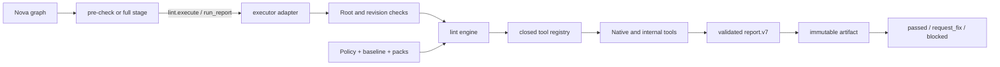

# Extend Lint

Status: implemented
Audience: lint rule author, policy maintainer, Nova maintainer
Owner: lint
Evidence: skills/nova/plugins/lint/plugin.json; skills/nova/plugins/lint/src; skills/nova/plugins/lint/tests; charts/kubeclaw/files/config
Evidence revision: `549dfe003d41fca50b85c3040029a74a817715d6`
Applies to: `kubeclaw.lint` and the shipped lint policy
Last verified: source and focused package checks on 2026-09-20

## Objective

Add or change lint behavior without bypassing policy, filesystem authority,
report validation, or Nova lifecycle ownership.

Read the [Lint Policy Reference](../reference/lint-policy.md) for every current
tool and repository-owned rule, plus exact configuration, scope, severity,
baseline, admission, policy-pack, and failure behavior.

## Architecture



The stages own pipeline meaning. They select a tier, invoke `lint.execute`, store
the report, and return a canonical stage result. They do not run commands or
inspect files. The executor adapter owns filesystem and process authority. The
engine owns policy interpretation, discovery, selection, normalization,
fingerprints, and report construction.

This split prevents a quality rule from granting itself process or filesystem
access. Operators grant the adapter. Pipeline code receives a validated report.

> **Implementation evidence:** [The manifest registers two stages and one
> adapter](https://github.com/datrab/kubeclaw/blob/549dfe003d41fca50b85c3040029a74a817715d6/skills/nova/plugins/lint/plugin.json#L1-L48).
> [The stage maps reports to lifecycle meaning](https://github.com/datrab/kubeclaw/blob/549dfe003d41fca50b85c3040029a74a817715d6/skills/nova/plugins/lint/src/stage.ts#L24-L100).
> [The adapter owns admission, candidate isolation, cancellation, and shutdown](https://github.com/datrab/kubeclaw/blob/549dfe003d41fca50b85c3040029a74a817715d6/skills/nova/plugins/lint/src/adapter.ts#L28-L63).

## Pre-Check And Full

Pre-check selects applicable pre-check tools. Full selects both pre-check and
full tools. A tool also needs a detected language or its own detection condition.
Experimental tools need `includeExperimental=true`.

The tiers are cumulative because final acceptance must not omit earlier fast
checks. Selected tools run sequentially in registry order. This makes logs,
cancellation, cache use, and failure attribution deterministic.

Both stages use the same schemas. Their only fixed difference is the tier. Test
both paths after a shared policy, discovery, normalization, or reporting change.

> **Tier evidence:** [Selection applies cumulative tier, experimental, and
> detection filters](https://github.com/datrab/kubeclaw/blob/549dfe003d41fca50b85c3040029a74a817715d6/skills/nova/plugins/lint/src/engine/report.ts#L166-L190).

## Choose The Smallest Change

| Need | Correct change | Reason |
| --- | --- | --- |
| Change timeout, paths, scope, severity, arguments, or tier | Policy | The adapter already exists. |
| Add a supported Kubernetes check | Policy-pack rule | Data is sufficient; no executable code is needed. |
| Add a Kubernetes rule type | Pack validator and evaluator | The closed type vocabulary needs new meaning. |
| Add an analyser | Tool adapter and policy entry | Execution and canonical policy stay exact. |
| Add a language or target family | Policy validation, discovery, and tools | Evidence and authority vocabularies are closed. |
| Change pipeline outcome semantics | Stage or report contract | Only this boundary owns lifecycle meaning. |

Do not create another stage only to run one command. A stage is a lifecycle
boundary. Add the analyser to the engine unless the work has distinct pipeline
meaning and a separate typed result.

## Add A Rule To An Existing Tool

Use this path when ESLint, Semgrep, Ruff, ShellCheck, Hadolint, yamllint, TFLint,
or another installed tool already owns the rule language.

1. Confirm that targets and include patterns reach the intended files.
2. Add the rule to the native configuration.
3. Decide whether it is blocking or experimental. A rule in blocking `eslint`
   inherits that tool's blocking threshold.
4. Add `rule_admission` evidence for a new repository-owned blocking rule.
5. Fix current findings or add narrow, approved, expiring fingerprints.
6. Test one finding, one clean case, config failure, parser failure, and stable
   fingerprint behavior.
7. Run each applicable tier and inspect policy and config digests in the report.

Do not use a permanent baseline entry. Put a real boundary exemption in the
canonical native configuration, where readers can see it.

> **Rule evidence:** [ESLint keeps rules and exact boundary exemptions together](https://github.com/datrab/kubeclaw/blob/549dfe003d41fca50b85c3040029a74a817715d6/charts/kubeclaw/files/config/eslint.config.mjs#L255-L338),
> and [admission validation requires a principle and remediation](https://github.com/datrab/kubeclaw/blob/549dfe003d41fca50b85c3040029a74a817715d6/skills/nova/plugins/lint/src/engine/lint-governance.ts#L45-L65).

## Add A Local ESLint Rule

Use a local rule when a repository architecture constraint cannot be expressed
clearly by a standard rule.

1. State the engineering principle in one sentence.
2. Add blocking rules to the local `discipline` plugin. Add audit-only evidence
   rules to `type-evidence-eslint-plugin.mjs`.
3. Use a stable lowercase ID and one actionable message.
4. Match the smallest correct syntax set. Handle tests, fixtures, generated
   sources, and legitimate boundaries explicitly.
5. Add positive, negative, and false-positive fixtures.
6. Enable it in the correct file group. Add admission evidence if it blocks.
7. Run the ESLint discipline, type-evidence, and repository configuration tests.

The type-evidence rules are experimental. Moving one into the blocking gate is
an admission decision, not only a severity edit.

> **Examples:** [The discipline plugin implements blocking local rules](https://github.com/datrab/kubeclaw/blob/549dfe003d41fca50b85c3040029a74a817715d6/charts/kubeclaw/files/config/eslint.config.mjs#L65-L253),
> while [the type-evidence plugin implements audit rules separately](https://github.com/datrab/kubeclaw/blob/549dfe003d41fca50b85c3040029a74a817715d6/charts/kubeclaw/files/config/type-evidence-eslint-plugin.mjs#L226-L307).

## Add A Tool

A tool adapter converts one analyser into the common report model. It does not
decide the stage outcome.

1. Add one object with stable `id`, display `name`, executable `binary`, optional
   `detect(ctx)`, and async `run(ctx)`.
2. Register it in its implementation family or import that family from
   `tool-registry.ts`.
3. Use `safeExec()` for native processes. Pass signal, working directory,
   configured timeout, input, and only allowlisted environment overrides.
4. Distinguish documented nonzero finding exits from timeout or failed start.
5. Parse output strictly. Use `failParse()` when output cannot prove a complete
   result. Never convert malformed output into zero findings.
6. Return error and warning counts, findings, and bounded evidence. Findings need
   file or `null`, coordinates where known, severity, stable code, and useful message.
7. Add `fingerprint_seed` when code, file, and message are not stable identity.
8. Add exactly one policy entry with category, scope, tier, timeout, threshold,
   languages, config, targets, and filters.
9. Add the native config and runtime binary where required.
10. Add admission evidence or experimental selection.
11. Test detection, findings, malformed output, missing binary, documented
    nonzero exit, timeout, abort, cleanup, fingerprint, baseline, and report.
12. Test policy-without-adapter and adapter-without-policy failures.

The two-sided registry check prevents dormant code and policy that claims a
check which no implementation runs.

> **Tool evidence:** [The registry requires an exact adapter-policy match](https://github.com/datrab/kubeclaw/blob/549dfe003d41fca50b85c3040029a74a817715d6/skills/nova/plugins/lint/src/engine/tool-registry-core.ts#L105-L129).
> [Native execution applies timeout and environment controls](https://github.com/datrab/kubeclaw/blob/549dfe003d41fca50b85c3040029a74a817715d6/skills/nova/plugins/lint/src/engine/execution.ts#L8-L95).
> [The report engine normalizes tool success and failure](https://github.com/datrab/kubeclaw/blob/549dfe003d41fca50b85c3040029a74a817715d6/skills/nova/plugins/lint/src/engine/report.ts#L104-L163).

## Add A Target Or Language

Targets are filesystem authority, not only command arguments.

For a target in an existing language:

1. Add a repository-relative target and narrow include patterns.
2. Check global and tool exclusions.
3. Prove that path components and symlinks stay in repository and project roots.
4. Test changed-file, module, project, and full behavior as applicable.

For a new language:

1. Add it to the closed `LANGUAGES` set.
2. Define required language-evidence patterns and discovery tests.
3. Decide whether it needs a canonical authority section like Go modules or
   Terraform roots.
4. Add the adapter and exact policy entry.
5. Make detection depend on discovered evidence.
6. Test invalid evidence, missing markers, depth, exclusions, symlinks, and a
   multi-language project.

An empty tool-language list means language-neutral. It is not a shortcut around
new language discovery.

> **Target evidence:** [Policy closes the language vocabulary](https://github.com/datrab/kubeclaw/blob/549dfe003d41fca50b85c3040029a74a817715d6/skills/nova/plugins/lint/src/engine/policy.ts#L12-L16),
> [discovery uses declared evidence](https://github.com/datrab/kubeclaw/blob/549dfe003d41fca50b85c3040029a74a817715d6/skills/nova/plugins/lint/src/engine/discovery.ts#L138-L159),
> and [target checks cover native traversal](https://github.com/datrab/kubeclaw/blob/549dfe003d41fca50b85c3040029a74a817715d6/skills/nova/plugins/lint/src/engine/policy-paths.ts#L43-L55).

## Add A Policy Pack

Use a new pack when another deployment group needs a different approved set of
the six supported Kubernetes rule types.

1. Create JSON with schema version, stable ID, semantic version, and non-empty rules.
2. Give each rule a stable unique ID, severity, supported type, and exact parameters.
3. Stay within 1 MiB and 256 rules.
4. Calculate SHA-256 over the exact bytes.
5. Add ID, version, relative path, and digest to the canonical policy.
6. Select the pack ID in the project.
7. Test clean and failing manifests for every rule, including relevant init
   container, service account, namespace, optional reference, and `envFrom` cases.
8. Run full lint and verify report pack digest and pack evidence.

Change the version when meaning changes. Change the digest after every byte
change. Never update a digest only to make an unexplained pack pass.

> **Pack evidence:** [Admission binds path, bytes, digest, ID, version, and rules](https://github.com/datrab/kubeclaw/blob/549dfe003d41fca50b85c3040029a74a817715d6/skills/nova/plugins/lint/src/engine/kubernetes-policy-pack.ts#L67-L115),
> and [execution preserves manifest and pack evidence](https://github.com/datrab/kubeclaw/blob/549dfe003d41fca50b85c3040029a74a817715d6/skills/nova/plugins/lint/src/engine/kubernetes-policy-tools.ts#L135-L155).

## Add A Policy-Pack Rule Type

A new type adds executable meaning and needs wider proof than a new rule instance.

1. Add the type to `RULE_TYPES`.
2. Define exact parameters in `parametersForRule()` and reject unknown or
   contradictory values.
3. Add evaluation to a clearly named evaluator.
4. Define applicable workload kinds, container groups, namespaces, and indexes.
5. Return stable `kubernetes-policy/<rule-id>` findings with source coordinates.
6. Test admission and evaluation independently.
7. Test every applicable workload and prove intentional non-applicability.
8. Add the type to the [policy reference](../reference/lint-policy.md#kubernetes-policy-packs).

Keep executable meaning in code and values in packs. Packs cannot contain code,
templates, or command strings.

## Change A Baseline Or Waiver

Use a baseline only when a finding is real, immediate correction is unsafe, and
an owner accepts time-bounded debt.

1. Capture the fingerprint from a validated full report.
2. Record tool, owner, reason, tracking, creation, later expiry, approver, and approval date.
3. Keep each tool/fingerprint pair unique.
4. Run normal output and verify that active count falls while debt count remains.
5. Run with `includeDebt=true` and verify finding and waiver metadata.
6. Run an unscoped full report to reject stale entries.

Experimental findings cannot be baselined. Avoid casual message changes when the
default fingerprint includes the message. Supply a stable seed when necessary.

> **Fingerprint evidence:** [The engine derives and applies fingerprints here](https://github.com/datrab/kubeclaw/blob/549dfe003d41fca50b85c3040029a74a817715d6/skills/nova/plugins/lint/src/engine/finding-fingerprints.ts#L4-L53).

## Change The Report Contract

Lint has no separate `reportAdapter` registration. Its report validator performs
that boundary inside the stage before storage and interpretation.

1. Change the report version when meaning or required fields change.
2. Update builder and validator together.
3. Recompute summary counts instead of trusting producer totals.
4. Bind policy, baseline, config, pack, targets, scope, tier, and visibility.
5. Preserve evidence limits and content digest checks.
6. Test hostile reports: missing tools, false totals, changed policy identity,
   invalid fingerprints, excess evidence, and hidden debt or experimental counts.
7. Change the stage only when lifecycle meaning changes.

Recomputation prevents an analyser from deciding acceptance by reporting false totals.

> **Contract evidence:** [The validator checks findings, evidence, policy
> identity, scope, inventory, and recomputed summary](https://github.com/datrab/kubeclaw/blob/549dfe003d41fca50b85c3040029a74a817715d6/skills/nova/plugins/lint/src/engine/report-contract.ts#L38-L231).

## Failure And Cleanup Rules

- Missing optional tools are `not_applicable`; missing required tools are errors.
- Timeout, failed start, malformed output, and exceptions are not clean results.
- Cancellation rejects the invocation and cannot become a normal report.
- Adapter shutdown aborts active invocations and waits for settlement.
- TERM then KILL covers the Linux process group; completion requires descendant exit.
- Candidate cleanup always runs in `finally`.
- Invalid policy or report stops the stage before a quality decision.

This process control is not a general sandbox. Source, configuration, and
installed binaries remain in the operator trust boundary.

## Proof Ladder

Run focused package checks:

```bash
npm run build --prefix skills/nova/plugins/lint
npm test --prefix skills/nova/plugins/lint
```

The final live-function test also needs `shellcheck` and `shfmt` in `PATH`. A new
native tool needs a run inside the target image so its real binary and config are
part of the evidence.

| Change | Minimum evidence |
| --- | --- |
| Existing rule | Clean and finding cases, admission, baseline effect, applicable tiers. |
| Local rule | Positive, negative, false-positive, exemptions, admission, fingerprint. |
| Tool | Detection, parser, findings, missing binary, exit, timeout, abort, cleanup, report. |
| Target/language | Discovery, scopes, exclusions, path escape, symlink, multi-language. |
| Pack | Admission, digest mismatch, invalid field/type, rule results, report evidence. |
| Pack type | Parameters, workload shapes, non-applicable objects, finding identity. |
| Report | Builder, hostile validator, recomputed summary, stage mapping, artifact. |

> **Test evidence:** [The package declares the exact focused suite](https://github.com/datrab/kubeclaw/blob/549dfe003d41fca50b85c3040029a74a817715d6/skills/nova/plugins/lint/package.json),
> and [the remediation suite uses real process, Git, path, cancellation, and
> cleanup behavior](https://github.com/datrab/kubeclaw/blob/549dfe003d41fca50b85c3040029a74a817715d6/skills/nova/plugins/lint/tests/remediation.test.mjs).

## Completion Criteria

The extension is complete only when ownership is clear, registry and policy stay
exact, filesystem authority remains bounded, findings have stable identity,
blocking behavior has admission evidence, debt has approval and expiry, failures
cannot look successful, reports bind all policy inputs, stage outcome follows the
validated report, and target-runtime checks pass or state an exact prerequisite.
