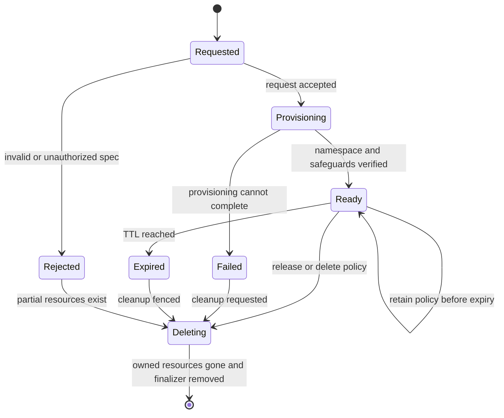

# Buster Namespace Leases and Controller

Status: implemented; disabled by default
Audience: platform operator, Buster maintainer, fixture author
Owner: buster
Evidence: charts/kubeclaw/templates/buster-namespace-lease-crd.yaml; charts/kubeclaw/templates/buster-namespace-controller.yaml; charts/kubeclaw/templates/buster-namespace-fence.yaml; cmd/buster-namespace-controller
Evidence revision: `3cf7dc4f72c2ae1e0ba4c47cceb08c98f4c70b7f`
Applies to: Kubernetes-backed Buster fixtures and preview exposure
Last verified: source, chart, and controller inspection on 2026-09-19

## Why The Broker Exists

A test process must not have cluster-wide namespace authority. Buster therefore
asks for a lease. A separate controller validates the request and creates the
namespace, quota, limits, network policy, role bindings, copied secrets, and
optional credentials. The fixture receives only the lease result.

### Decision record: isolate namespace lifecycle authority

- **Problem and constraints:** A test needs a temporary namespace, but provider
  code must not receive unrestricted cluster lifecycle authority.
- **Decision:** A provider requests a bounded lease. A
  separate controller owns namespace creation, safeguards, access, retention,
  and deletion for Kubernetes-backed Buster fixtures.
- **Rejected alternative:** Give the fixture or test provider direct namespace
  authority. [D-014 through D-019](../decisions/test-gate.md#d-014-fixture-is-a-base-system-part)
  record the fixture, deployment, retention, secret, and exposure boundaries.
- **Reason:** The separate identity lets policy constrain the requested resource
  and prevents the provider from silently granting broader access.
- **Cost:** Providers receive a small lease interface, but the platform
  must operate another reconciler, preserve its state, and diagnose finalizers.
  The shipped broker requires Kubernetes 1.30 or later when enabled.
- **Reconsider when:** Reconsider the controller shape when the platform adopts
  another isolation boundary that can enforce the same ownership, lease, and
  cleanup rules. Do not move lifecycle authority into provider code.
- **Decision status:** Accepted in D-014 through D-019.
- **Implementation status:** Implemented and disabled by default. Live admission,
  secret-copy, and Tailscale behavior still require environment acceptance.
- **Supersession:** No identified successor.

> **Source evidence — enforced authority**
>
> **Claim:** The worker cannot manage namespaces directly; the controller uses a
> separate identity and bounded reconciliation permissions.
>
> **Implementation:** [Namespace admission fence](https://github.com/datrab/kubeclaw/blob/3cf7dc4f72c2ae1e0ba4c47cceb08c98f4c70b7f/charts/kubeclaw/templates/buster-namespace-fence.yaml#L1-L43) ·
> [controller ServiceAccount and RBAC](https://github.com/datrab/kubeclaw/blob/3cf7dc4f72c2ae1e0ba4c47cceb08c98f4c70b7f/charts/kubeclaw/templates/buster-namespace-controller.yaml#L1-L118)
>
> **Contract or setting:** [Lease CRD](https://github.com/datrab/kubeclaw/blob/3cf7dc4f72c2ae1e0ba4c47cceb08c98f4c70b7f/charts/kubeclaw/templates/buster-namespace-lease-crd.yaml#L33-L182) ·
> [D-014 through D-019](../decisions/test-gate.md#d-014-fixture-is-a-base-system-part)
>
> **Test evidence:** `go test ./cmd/buster-namespace-controller/...` is the local
> controller check. It was unavailable on 2026-09-19 because this host has no
> `go` executable. The page does not claim a live admission-policy result.
>
> **Revision:** `3cf7dc4f72c2ae1e0ba4c47cceb08c98f4c70b7f`
>
> **Limit:** Rendered policy and unit behavior do not prove a live Kubernetes,
> secret-copy, DNS, or Tailscale operation.

## Lease Flow

The controller watches namespaced `BusterNamespaceLease` objects. It validates
the immutable request, adds its finalizer, and then creates or verifies the
owned namespace resources. It publishes `Ready` only after the observed state
matches the lease. A consumer must use status from the same lease UID and
generation. A name alone is not sufficient because Kubernetes can reuse it.

Deletion is deliberately two-stage. The controller first fences the status as
deleting or terminal, removes only resources that still prove lease ownership,
and removes its finalizer only after cleanup. This order prevents a stale
reconciler from deleting a replacement resource.

## Lease Specification

| Field | Required and default | Meaning and rule |
| --- | --- | --- |
| `namespaceName` | Required; no default | Exact requested name. It is immutable and must match the CRD pattern. |
| `namespacePrefix` | Optional | Must be one configured allowed prefix. It is immutable. The shipped allowed list is `test`. |
| `runId`, `project` | Optional | Trace identity. Both are immutable after creation. |
| `purpose` | Optional | `pretest`, `gate`, or `final-preview`. |
| `access[]` | Controller requires a non-empty authorized set | Each entry contains a `namespace/serviceaccount` subject and `deployer` or `tester` mode. Maximum eight. |
| `serviceName` | Optional | Service used to calculate the internal endpoint. Immutable. |
| `servicePort` | Optional, 1–65535 | Service port. Immutable. |
| `serviceTargetPort` | Optional, 1–65535 | Workload target port. Immutable. |
| `verifiedImage` | Optional | Registry image with an immutable `sha256` digest. A tag-only image is rejected. |
| `manifestDigest` | Optional | Digest of the checked manifest. |
| `cleanupPolicy` | Required | `delete` removes the namespace; `retain` keeps it only until the bounded expiry. |
| `ttlSeconds` | Default 7200; range 60–86400 in shipped values | Lease lifetime. The chart can lower or raise the maximum. |
| `secretsToCopy[]` | Optional | Source secret names. The controller also requires each name in its operator allowlist. |
| `testCredentials` | Optional | Generate or reference a secret and grant only named readers. |
| `exposure` | Optional | `off` or `tailscale-ingress`, with host, service, port, and path. |

The CRD makes the authority-bearing fields immutable. This is more than input
validation: it prevents a caller from changing a harmless accepted lease into
a different image, secret set, role grant, or retention policy.

> [The CRD defines immutable fields, access limits, digest-only images, TTL,
> credentials, and exposure](https://github.com/datrab/kubeclaw/blob/3cf7dc4f72c2ae1e0ba4c47cceb08c98f4c70b7f/charts/kubeclaw/templates/buster-namespace-lease-crd.yaml#L33-L182).

## Access, Secrets, and Credentials

`deployer` can manage normal workload objects in the leased namespace. `tester`
can read workload state and manage test Jobs. The controller accepts only
subject and mode pairs in `controller.allowedAccess`. The shipped values permit
the Buster deployer and tester identities and the Nova deployer identity.

The controller can copy a source secret only when the operator listed the name
in `allowedSourceSecrets`. Generated credentials contain only `username` and
`password`. Existing credentials must list at least one key. Reader subjects
receive lease-local RBAC; the provider does not receive the controller token.

### Local decision: require an operator allowlist in addition to RBAC

- **Problem and constraint:** Kubernetes RBAC controls what the controller can
  bind. It does not define which requested subjects the product trusts.
- **Decision:** The controller accepts only subject and access-mode
  pairs in `controller.allowedAccess`.
- **Rejected alternative:** Accept each subject that the
  controller's Kubernetes permissions can bind. No historical source records a
  wider alternatives discussion.
- **Reason:** This extra check makes product trust narrower than controller RBAC.
  This reason is an inference from the implemented fail-closed checks.
- **Cost:** An unlisted identity cannot gain lease access, but operators
  must update the allowlist when an approved identity changes.
- **Reconsider when:** Reconsider the setting source if another authenticated
  policy authority supplies the same subject-and-mode decision.
- **Decision status:** Local implemented rule; historical approval metadata is
  unknown.
- **Implementation status:** Implemented in chart values and controller checks.
- **Supersession:** No identified successor.

> **Source evidence — access allowlist**
>
> **Claim:** The controller rejects a lease access request when its exact
> ServiceAccount and mode are not in the operator allowlist.
>
> **Implementation:** [`accessRequests` checks subject and mode](https://github.com/datrab/kubeclaw/blob/3cf7dc4f72c2ae1e0ba4c47cceb08c98f4c70b7f/cmd/buster-namespace-controller/main.go#L1068-L1098)
>
> **Contract or setting:** [`controller.allowedAccess` shipped values](https://github.com/datrab/kubeclaw/blob/3cf7dc4f72c2ae1e0ba4c47cceb08c98f4c70b7f/charts/kubeclaw/values.yaml#L425-L433)
>
> **Test evidence:** [`TestAllowedAccessAndLeaseRequests` accepts listed pairs and
> rejects an unlisted subject](https://github.com/datrab/kubeclaw/blob/3cf7dc4f72c2ae1e0ba4c47cceb08c98f4c70b7f/cmd/buster-namespace-controller/main_test.go#L287-L304).
> The linked test covers both outcomes. The command
> `go test ./cmd/buster-namespace-controller/...` was unavailable during the
> documentation verification on 2026-09-19 because this host has no `go`
> executable.
>
> **Revision:** `3cf7dc4f72c2ae1e0ba4c47cceb08c98f4c70b7f`
>
> **Limit:** This proof covers the controller check. It does not prove that a live
> cluster uses the reviewed Helm values or admission policy.

## Status and Fencing

Important status fields are `phase`, `namespaceName`, `createdAt`, `internalUrl`,
`previewUrl`, `exposurePhase`, `exposureOwner`, `exposureGeneration`,
`credentialsRef`, and `credentialsAvailable`. The controller also stores a
digest of the accepted specification. Consumers must not infer readiness from
the existence of a namespace or URL.

Exposure uses an owner and generation fence. Before it changes an ingress, the
controller records an `exposureMutation` claim. It then reads the lease again.
If the UID, generation, owner, predecessor lineage, deletion state, or claim
changed, it stops. An old cleanup can delete only an ingress that still proves
the old ownership.

> [Exposure mutation compares current lease identity before changing the ingress](https://github.com/datrab/kubeclaw/blob/3cf7dc4f72c2ae1e0ba4c47cceb08c98f4c70b7f/cmd/buster-namespace-controller/exposure-generation.go#L21-L95).
>
> [Status changes use resource version, UID, generation, terminal-state, and exposure-claim checks](https://github.com/datrab/kubeclaw/blob/3cf7dc4f72c2ae1e0ba4c47cceb08c98f4c70b7f/cmd/buster-namespace-controller/demo-readiness-lifecycle.go#L82-L130).

## Retention and Release

`delete` is the normal test-fixture policy. Cleanup releases the lease and the
controller deletes the owned namespace. `retain` supports a bounded preview. It
does not mean permanent retention. `ttlSeconds` still defines expiry, and the
controller expires retained work when the deadline passes.

A provider cleanup error is part of the Buster result. Do not manually remove
the finalizer first: that can orphan resources. Inspect the lease status,
controller log, namespace labels, and owned ingress. Repair the cause and let
the controller reconcile. Manual finalizer removal is a last recovery action
after an operator proves that no owned resource remains.

## Configuration Boundary

The complete Helm subtree is `busterNamespaceBroker`. The broker is disabled
by default and is rendered only for `agentRole: buster`. The principal defaults
are:

- API group `kubeclaw.forgestack.ai`, version `v1alpha1`;
- allowed namespace prefix `test`;
- default TTL 7200 seconds and maximum TTL 86400 seconds;
- one controller replica with a 3000 ms poll interval;
- generated image tag `latest` and pull policy `Always` in development values;
- readiness, product-decision endpoints, lease client, and verification reads
  disabled until their required identities and TLS values are supplied.

### Complete shipped values

| Value path | Shipped default | Effect |
| --- | --- | --- |
| `busterNamespaceBroker.enabled` | `false` | Render the broker only for a Buster role. |
| `leaseClient.enabled` | `false` | Let this release create lease objects. It does not grant namespace authority. |
| `leaseClient.verificationRead.enabled` | `false` | Add the narrowly scoped Tailscale verification read. |
| `leaseClient.verificationRead.tailscaleOperatorNamespace` | `tailscale` | Existing operator namespace to inspect. |
| `leaseClient.verificationRead.tailscaleOAuthSecretName` | `operator-oauth` | Existing Secret name used only for the scoped verification path. |
| `readyClient.enabled` | `false` | Enable the trusted Nova readiness client in the same container boundary. |
| `readyClient.endpoint` | empty | TLS readiness endpoint. Required when the client is enabled. |
| `readyClient.audience` | empty | Expected token audience. Required when enabled. |
| `readyClient.caSecretName` | empty | Secret with the trusted server CA. Required when enabled. |
| `leaseApiGroup` | `kubeclaw.forgestack.ai` | CRD API group. |
| `leaseApiVersion` | `v1alpha1` | Served and stored CRD version. |
| `allowedPrefixes` | `test` | Namespace prefixes accepted by CRD, controller, and admission fence. |
| `defaultTtlSeconds` | `7200` | TTL used when the request omits it. |
| `maxTtlSeconds` | `86400` | Hard chart/controller maximum. |
| `controller.productDecisions.enabled` | `false` | Enable signed human product-decision handling. |
| `controller.productDecisions.audience` | empty | Required token audience. |
| `controller.productDecisions.producerNamespace` | empty | Namespace of the only accepted producer ServiceAccount. |
| `controller.productDecisions.producerServiceAccount` | empty | Name of the only accepted producer ServiceAccount. |
| `controller.productDecisions.issuer` | empty | Required decision-envelope issuer. |
| `controller.productDecisions.verifyKey` | empty | Base64 Ed25519 public verification key; never a signing key. |
| `controller.productDecisions.allowedActors` | empty | Actor allowlist; empty denies every human decision. |
| `controller.readiness.enabled` | `false` | Enable the controller TLS readiness endpoint. |
| `controller.readiness.audience` | empty | Required readiness token audience. |
| `controller.readiness.producerNamespace` | empty | Namespace of the accepted readiness producer. |
| `controller.readiness.producerServiceAccount` | empty | ServiceAccount of the accepted readiness producer. |
| `controller.readiness.tlsSecretName` | empty | Secret that supplies server certificate and key. |
| `controller.allowedAccess[0]` | Buster deployer/tester | Permitted lease access modes for the Buster ServiceAccount. |
| `controller.allowedAccess[1]` | Nova deployer | Permitted deployment access for the Nova ServiceAccount. |
| `controller.allowedSourceSecrets` | empty | Exact source secret allowlist. Empty denies copying. |
| `controller.image.repository` | `ghcr.io/datrab/kubeclaw-namespace-controller` | Controller image repository. |
| `controller.image.tag` | `latest` | Development default. Select an immutable release in deployment configuration. |
| `controller.image.pullPolicy` | `Always` | Shipped development pull behavior. |
| `controller.pollIntervalMs` | `3000` | Reconciliation polling interval. |
| `controller.resources.requests.cpu` | `50m` | Requested CPU. |
| `controller.resources.requests.memory` | `128Mi` | Requested memory. |
| `controller.resources.limits.cpu` | `500m` | CPU limit. |
| `controller.resources.limits.memory` | `512Mi` | Memory limit. |

Helm stops rendering when an enabled optional endpoint lacks its required
identity, audience, TLS, or verification values. An empty default therefore
means disabled or fail closed. It does not mean anonymous access.

> [The shipped values define every broker default and disabled optional client](https://github.com/datrab/kubeclaw/blob/3cf7dc4f72c2ae1e0ba4c47cceb08c98f4c70b7f/charts/kubeclaw/values.yaml#L381-L441).

## Failure Guide

| Observation | Likely boundary | Safe response |
| --- | --- | --- |
| Lease becomes `Rejected` | Invalid prefix, subject, mode, TTL, secret, image, or immutable field | Read the status message; correct the request and create a new identity when an immutable field changes. |
| Lease remains `Provisioning` | Namespace resource, quota, policy, binding, secret, or readiness mismatch | Compare controller findings with live objects. Do not use the namespace as ready. |
| `credentialsAvailable` is false | Secret generation/copy or reader binding is incomplete | Check allowed source names and exact secret UID; never copy credentials by hand into provider storage. |
| Exposure remains reconciling | Ingress, Tailscale operator, DNS, service, or generation fence | Inspect the mutation claim and owner. Retry only through the current lease generation. |
| Lease is `Expired` | TTL passed | Stop consumers. Allow deletion; create a new lease for more work. |
| Finalizer remains | Owned cleanup cannot be proved | Repair ownership or API access, then reconcile. Remove the finalizer only after independent resource inspection. |

## Verification

Use `helm template` with the broker enabled to verify the CRD, roles, controller,
and admission fence. Run `go test ./cmd/buster-namespace-controller/...` for
transition, ownership, credential, retention, and stale-writer behavior. These
checks do not prove a live Kubernetes admission policy, Tailscale ingress, DNS,
or secret copy. Those require a disposable Kubernetes 1.30+ environment.
