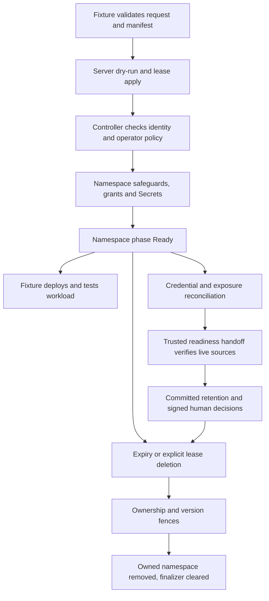

# Buster Namespace Leases and Controller

Status: implemented; disabled by default
Audience: platform operator, Buster maintainer, fixture author
Owner: buster
Evidence: charts/kubeclaw/templates/buster-namespace-lease-crd.yaml; charts/kubeclaw/templates/buster-namespace-controller.yaml; charts/kubeclaw/templates/buster-namespace-fence.yaml; cmd/buster-namespace-controller; skills/buster/engine/test-gates/kubernetes-fixture-runtime.ts
Evidence revision: `be78787633d774e9fd2a2ff401311499a555156d`
Applies to: Kubernetes-backed Buster fixtures, dedicated demo credentials and preview retention
Last verified: local source and contract inspection on 2026-10-10

## Why a fixture requests a lease

A test needs a temporary namespace with bounded access. The fixture process
requests a `BusterNamespaceLease`. A separate controller creates the namespace,
resource quota, limits, network policy, role bindings and approved copied Secrets.
The fixture deploys and tests workload manifests inside that namespace. The
controller can also create dedicated credentials and a Tailscale preview ingress.
The worker does not receive the controller's namespace-management identity.

A **lease** is a namespaced Kubernetes object that connects this request to its
observed result. Its **UID** identifies one stored object, even when a deleted
name is reused. Its **generation** identifies a changed desired resource.
Its **resourceVersion** is the server token used to reject writes based on stale
state. A **finalizer** keeps the lease object present until the controller has
completed owned cleanup. A **fence** is an identity and state check that prevents
an older operation from changing resources owned by a newer operation.

The controller uses a separate ServiceAccount. The lease client creates and reads
leases; deployer and tester subjects receive namespace-local RoleBindings to
the existing deployer/tester ClusterRoles. Dedicated credential readers receive
namespace-local Roles and RoleBindings for access to the named Secret. Readiness and
human product decisions use separately authenticated TLS endpoints. Enabling one
client does not enable all these authorities.

The decision to separate fixture work from namespace lifecycle is accepted in
[D-014 through D-019](../decisions/test-gate.md#d-014-fixture-is-a-base-system-part).
It lets the operator enforce access, secret and cleanup policy outside provider
code. It costs another reconciler and requires operators to diagnose retained
objects and finalizers. Reconsider this shape if another isolation mechanism
can enforce the same lifecycle boundary. The shipped admission fence requires
Kubernetes 1.30 or later; configured endpoints still need live environment checks.

> **Source evidence — separate identities**
>
> **Claim:** The controller and lease client have separate permission boundaries.
>
> **Implementation:** [Controller ServiceAccount and RBAC](https://github.com/datrab/kubeclaw/blob/be78787633d774e9fd2a2ff401311499a555156d/charts/kubeclaw/templates/buster-namespace-controller.yaml#L1-L118).
>
> **Contract or setting:** [Namespace admission fence](https://github.com/datrab/kubeclaw/blob/be78787633d774e9fd2a2ff401311499a555156d/charts/kubeclaw/templates/buster-namespace-fence.yaml#L1-L43) and the decision record linked above.
>
> **Test evidence:** [`TestAllowedAccessAndLeaseRequests`](https://github.com/datrab/kubeclaw/blob/be78787633d774e9fd2a2ff401311499a555156d/cmd/buster-namespace-controller/main_test.go#L288-L304) checks allowed and denied requests. Use `go test ./cmd/buster-namespace-controller/...` where the Go toolchain is installed.
>
> **Revision:** `be78787633d774e9fd2a2ff401311499a555156d`
>
> **Limit:** Source and unit checks do not prove the deployed RBAC, admission policy or cluster version.

## From request to workload

The fixture validates its own request, reads and checks the manifest, and sends a
server dry-run before applying the lease. The controller normalizes the requested
namespace name and checks its configured allowed prefixes. It adds its finalizer,
checks the immutable spec and operator policy, then provisions namespace resources
in sequence. The fixture polls the lease and applies its workload after the
namespace phase becomes `Ready`.

The public lease supports more than the fixture constructor writes. The
[complete recursive lease reference](../reference/helm-values.md#api-field-2d7090db945e3299f8e7) includes all spec variants,
status records, nested collections, required members, CEL rules and receiving
conditions. CEL is the API server's expression language for validating a resource
and its transition from the previous stored resource. Standard root `metadata`
is Kubernetes ObjectMeta, handled by the server; it is not a separate owned
metadata-child schema. Use the [metadata boundary](../reference/helm-values.md#api-field-e5b8003a74b771aad5b3) for
that authority and its operation-specific reference.

The controller also creates fixed namespace safeguards. The ResourceQuota bounds
Pods, CPU, memory, ephemeral storage, PVC count and requested persistent storage.
The LimitRange supplies container requests and limits and rejects values above
its container maximum. These are controller-selected safeguards, independent of
a fixture's smaller manifest limits. The namespace NetworkPolicy selects all
Pods, permits same-namespace traffic, DNS to kube-system, and selected Nova/Buster
and managed Tailscale ingress sources. Its Tailscale namespace is hard-coded to
`tailscale`; a scoped verification-read namespace override does not change this
policy. Kubernetes policies combine allowed traffic from all applicable policies,
so inspect the effective policy set and network plugin in the target cluster.
[Fixed quota and limits](https://github.com/datrab/kubeclaw/blob/be78787633d774e9fd2a2ff401311499a555156d/cmd/buster-namespace-controller/main.go#L933-L962)
and [namespace traffic policy](https://github.com/datrab/kubeclaw/blob/be78787633d774e9fd2a2ff401311499a555156d/cmd/buster-namespace-controller/main.go#L811-L851)
are their source authority.

The main resource and its `/status` subresource have different write roles.
The CRD enables the status subresource. Ordinary create clears submitted status;
ordinary updates preserve the stored status. A status request changes status
without changing spec. RBAC must therefore restrict status writers. Matching a
status schema does not authenticate readiness or a human decision.

```mermaid
flowchart TD
    Fixture[Fixture validates request and manifest] --> DryRun[Server dry-run and lease apply]
    DryRun --> Policy[Controller checks identity and operator policy]
    Policy --> Provision[Namespace safeguards, grants and Secrets]
    Provision --> NamespaceReady[Namespace phase Ready]
    NamespaceReady --> Workload[Fixture deploys and tests workload]
    NamespaceReady --> Optional[Credential and exposure reconciliation]
    Optional --> Verified[Trusted readiness handoff verifies live sources]
    Verified --> Retained[Committed retention and signed human decisions]
    NamespaceReady --> Cleanup[Expiry or explicit lease deletion]
    Retained --> Cleanup
    Cleanup --> Fence[Ownership and version fences]
    Fence --> Removed[Owned namespace removed, finalizer cleared]
```

The diagram answers who owns each handoff. The controller can fail during policy,
provisioning, exposure or cleanup. It publishes observations or returns an error;
the next reconciliation reads current state. A successful lease apply alone does
not prove namespace readiness. [Fixture preparation](https://github.com/datrab/kubeclaw/blob/be78787633d774e9fd2a2ff401311499a555156d/skills/buster/engine/test-gates/kubernetes-fixture-runtime.ts#L692-L734)
and [controller reconciliation](https://github.com/datrab/kubeclaw/blob/be78787633d774e9fd2a2ff401311499a555156d/cmd/buster-namespace-controller/main.go#L251-L316)
are the source authority for this sequence.

## Choose a request and keep its authority stable

`namespaceName` and `cleanupPolicy` are schema-required. Access is schema-optional,
but new usable work requires at least one allowed access entry. A legacy lease
without access cannot provision new work. The controller removes its old runner
access only after proving namespace ownership, and waits for deletion or expiry.
The root schema does not require `spec`; an absent spec still cannot provision a
usable lease because its requested namespace is missing.

The fixture writes `spec.runId` from the lease name and `spec.project` from
its validated request payload. These optional trace values are stored and included
in the accepted spec digest. Namespace ownership labels use the lease name, UID,
purpose and metadata scope instead. The readiness producer supplies a separate
`runId`; the controller stores it in `demoReadiness` without comparing it to
`spec.runId`. Do not use equality of these fields as an implemented ownership
check. [Owner-label construction](https://github.com/datrab/kubeclaw/blob/be78787633d774e9fd2a2ff401311499a555156d/cmd/buster-namespace-controller/main.go#L1765-L1781)
and [readiness state construction](https://github.com/datrab/kubeclaw/blob/be78787633d774e9fd2a2ff401311499a555156d/cmd/buster-namespace-controller/demo-readiness.go#L250-L256)
show their separate sources.

The CRD makes the namespace, trace identity, access, workload service claims,
verified image and manifest digest, cleanup policy, TTL, copied-secret set and
credential request immutable. Create a new lease for those changes. An optional
member cannot be added later to bypass its immutability rule. `purpose` and
`exposure` have a mutable preview path and are excluded from the accepted spec
digest. The controller permits a bounded migration from its former full-spec
digest. This does not make the remaining authority mutable.

A `verifiedImage` must use the declared registry-and-`sha256` digest form. The
fixture checks allowed registries and manifest content before deployment.
`serviceName` and `servicePort` can produce an internal URL; a URL string does not
prove that a Service or endpoint exists. `serviceTargetPort` is an immutable claim
in the lease schema; the controller does not create the workload Service from
that value. It does use the target port for the lease-scoped Buster E2E egress
policy, defaulting it to the Service port. When they differ, both TCP ports are
allowed to the owned namespace and labelled E2E target Pods. The fixture manifest
owns workload resources. [The deployed ClusterRole definitions](https://github.com/datrab/kubeclaw/blob/be78787633d774e9fd2a2ff401311499a555156d/charts/kubeclaw/templates/buster-namespace-controller.yaml#L24-L67)
and [E2E port selection](https://github.com/datrab/kubeclaw/blob/be78787633d774e9fd2a2ff401311499a555156d/cmd/buster-namespace-controller/main.go#L858-L906)
show the actual receiving permissions and ports.

The exact constraints and transition rules are in the
[owned spec reference](../reference/helm-values.md#api-field-446072fe13a4ef01e5dc). The controller's
[spec validation and digest](https://github.com/datrab/kubeclaw/blob/be78787633d774e9fd2a2ff401311499a555156d/cmd/buster-namespace-controller/main.go#L1598-L1653)
apply operator policy after schema validation. A locally constructed request can
pass a helper and still fail API admission, or pass admission and fail operator
policy. Check both results.

## Access and credential boundaries

Each access entry requests a `namespace/serviceaccount` subject and either
`deployer` or `tester` mode. The controller checks the exact pair against
`controller.allowedAccess` and deduplicates identical pairs. The shipped tester ClusterRole reads core workload state and manages Jobs.
The shipped deployer ClusterRole manages normal workload resources, including
ServiceAccounts, PVCs and StatefulSets, and has direct `get`/`list` access to
Secrets in the leased namespace. Neither mode grants Ingress, Role, RoleBinding
or port-forward access. Dedicated credential-reader grants are exact-Secret
permissions, but do not remove a deployer's broader existing Secret read access.
Existing
ServiceAccounts and broad Kubernetes RBAC do not replace this allowlist.

The controller binds the existing chart ClusterRoles. Its `namespaceRole`
helper has different rules and is exercised by a unit test; that helper is not
the effective deployed permission authority. Inspect the rendered ClusterRole
and RoleBinding when verifying access. In particular, a helper test that excludes
Secrets does not prove that deployed deployers cannot read Secrets.
[Actual binding](https://github.com/datrab/kubeclaw/blob/be78787633d774e9fd2a2ff401311499a555156d/cmd/buster-namespace-controller/main.go#L964-L990)
selects the chart role.

The allowlist is an implemented local policy. Its benefit is narrower product
trust than the controller's binding permissions. Its cost is explicit operator
maintenance when an approved identity changes. This reason is inferred from the
fail-closed implementation; no separate historical alternatives discussion is
recorded. Reconsider its configuration source if another authenticated policy
service can enforce the same exact pair decision.

`secretsToCopy` selects source Secret names. Every name must also occur in the
operator's `allowedSourceSecrets`. An empty allowlist denies all source copying.
Copied Secrets and dedicated user-deliverable credentials have different purposes.
A dedicated credential Secret must not reuse a copied source Secret name.

`testCredentials.mode: generate` creates an immutable Secret with exactly
`username` and `password`; omitted keys select those names. `existing` requires
at least one key and a deployer to populate a dedicated Secret. The controller
creates an empty placeholder if that Secret does not exist and reports credentials
unavailable until the requested nonempty keys are present. Every workload-capable
lease subject must appear in `readers`, and every reader must be allowed by the
operator. The CRD treats readers and keys as sets.

For generated credentials, the controller first persists
`generatedCredentialIntent`, including lease identity and content digest. It then
creates the immutable Secret and records `generatedCredentials` from its actual
UID, resource version, labels, annotations and exact encoded keys. On restart,
a missing Secret after recorded intent is an unresolved creation. The controller
does not silently create a different password. A same-name Secret with another UID
or changed digest also fails provenance. Status contains references and digests,
not password bytes. Retrieve deliverable credentials only through the approved
reader path. Do not put them into logs or provider state.

[Access checks](https://github.com/datrab/kubeclaw/blob/be78787633d774e9fd2a2ff401311499a555156d/cmd/buster-namespace-controller/main.go#L1072-L1099),
[credential policy](https://github.com/datrab/kubeclaw/blob/be78787633d774e9fd2a2ff401311499a555156d/cmd/buster-namespace-controller/main.go#L1101-L1175) and
[generated Secret provenance](https://github.com/datrab/kubeclaw/blob/be78787633d774e9fd2a2ff401311499a555156d/cmd/buster-namespace-controller/demo-credentials.go#L121-L158)
establish these separate boundaries.

## Read each observation at its own level

`status.createdAt` reports the lease object's `metadata.creationTimestamp`,
parsed as RFC3339 and converted to UTC. If that timestamp cannot be parsed, the
controller uses current UTC time. It is not a measured namespace preparation
time. [The timestamp helper](https://github.com/datrab/kubeclaw/blob/be78787633d774e9fd2a2ff401311499a555156d/cmd/buster-namespace-controller/main.go#L674-L680)
defines this observation. The fixture requires a valid timestamp in this status
field. If status has no string `expiresAt`, the fixture derives its returned
expiry from this lease timestamp plus its requested retention seconds;
[it does not measure namespace preparation](https://github.com/datrab/kubeclaw/blob/be78787633d774e9fd2a2ff401311499a555156d/skills/buster/engine/test-gates/kubernetes-fixture-runtime.ts#L721-L726).

Namespace `phase: Ready` means that the controller completed its namespace
provisioning sequence. It can coexist with `CredentialsReady=False` or
`ExposureReady=False`. The controller reports separate conditions keyed by `type`:
`NamespaceReady`, `AccessReady`, `SecretsReady`, `CredentialsReady` and
`ExposureReady`. A rejection uses `Ready=False`. Condition order is not lifecycle
order. `lastTransitionTime` is set when the controller constructs the condition;
the implementation does not preserve an earlier timestamp merely because the
truth value stayed the same.

The fixture's basic wait loop returns status when `phase` is `Ready` and throws
on `Rejected` or `Failed`. That loop does not compare lease UID and generation
before returning. Generated credential retrieval and the readiness endpoint
perform stronger identity checks. Do not assume those stronger checks protect
every basic fixture read. The wait and release commands also use a bare resource
name; multiple installed lease API groups need separate discovery qualification.
[The actual wait loop](https://github.com/datrab/kubeclaw/blob/be78787633d774e9fd2a2ff401311499a555156d/skills/buster/engine/test-gates/kubernetes-fixture-runtime.ts#L525-L540)
is the authority for this limit.

`runtimeSecurity` is a separate observation of live Pods, Services, Roles,
RoleBindings and Ingresses. Without `verifiedImage` or `manifestDigest`, it reports
`Unavailable`, not a clean runtime. With those inputs, it inspects resources,
reports `Observed` findings and computes a result digest. Findings are bounded by
count and serialized size, with `totalFindingCount` and `omittedFindingCount`.
Read the omitted count before treating the published list as complete. This check
is not a proof that every runtime security risk is absent. The controller refreshes
an old snapshot after its five-second freshness interval during reconciliation.
[Runtime observation](https://github.com/datrab/kubeclaw/blob/be78787633d774e9fd2a2ff401311499a555156d/cmd/buster-namespace-controller/main.go#L543-L592) and
[bounded findings](https://github.com/datrab/kubeclaw/blob/be78787633d774e9fd2a2ff401311499a555156d/cmd/buster-namespace-controller/main.go#L415-L466) define it.

## Preview ownership and verified readiness

Before committed readiness, preview creation requires `purpose: final-preview`
and `exposure.provider: tailscale-ingress`. Omitted exposure or provider selects
`off`. The preview port defaults to 80. Its service name falls back to
`spec.serviceName`, then `app`; its hostname derives from namespace and service
when omitted. An omitted path selects `/` in the controller. An explicit empty
string fails the CRD leading-slash pattern during admission, including the
fixture server dry-run. The controller also has a defensive empty-string fallback
for absent or legacy data; this does not make an empty path admissible. Nonempty
paths must begin
with one slash and exclude query, fragment, NUL and line-break characters.
[The owned path pattern](https://github.com/datrab/kubeclaw/blob/be78787633d774e9fd2a2ff401311499a555156d/charts/kubeclaw/templates/buster-namespace-lease-crd.yaml#L176-L179)
applies before reconciliation. The controller checks service endpoints and the observed ingress before reporting
a preview URL. Tailscale operator, DNS and network reachability remain external
dependencies.

Before an ingress change, the controller checks current UID, generation, exposure
owner, predecessor lineage, deletion state and committed readiness/product state.
It persists an `exposureMutation` reservation and rereads it. Another claim or a
changed owner stops the operation. `startedAt` records when the claim began;
it does not establish an automatic timeout takeover. Ingress update uses its
resource version; deletion also requires its UID. An old cleanup cannot delete
a replacement ingress that no longer proves authorized ownership.

The trusted readiness producer sends `POST /v1/demo-ready` and rereads the
committed result with `POST /v1/demo-ready/status`. It uses the TLS endpoint with the configured audience
and ServiceAccount identity. The controller rejects stale observations, changed
request replay, unresolved exposure reservations and expired or deleting leases.
It verifies namespace ownership, the exact live ingress route, the immutable
generated Secret and accepted Discord delivery evidence. It then commits
`demoReadiness` with resource-version compare-and-swap and verifies the stored
result. Do not manufacture this status with `kubectl patch`: schema validity does
not perform these checks.

After readiness commits, exposure comes from its `exposureSpec` snapshot. Its
owner changes to the committed readiness owner. Later mutable spec exposure
changes do not replace the retained route. The readiness record binds source
revision, candidate, test decision/result, image, manifest, credentials, delivery
receipt, namespace, lease UID and exposure generation. These relationships explain
why a changed dependency requires a new verified handoff.

[Exposure selection](https://github.com/datrab/kubeclaw/blob/be78787633d774e9fd2a2ff401311499a555156d/cmd/buster-namespace-controller/main.go#L1199-L1232),
[ingress fencing](https://github.com/datrab/kubeclaw/blob/be78787633d774e9fd2a2ff401311499a555156d/cmd/buster-namespace-controller/exposure-generation.go#L21-L95) and
[readiness commitment](https://github.com/datrab/kubeclaw/blob/be78787633d774e9fd2a2ff401311499a555156d/cmd/buster-namespace-controller/demo-readiness.go#L202-L280)
are the current mechanisms. For the supported delivery task, use
[Demo Delivery](../use/demo-delivery.md).

## Retention, decisions and cleanup

Before valid demo readiness, expiry is lease creation time plus `ttlSeconds`,
using the operator default when omitted and the operator maximum as its bound.
`retain` does not mean unlimited lifetime. The fixture chooses whether to release
its lease; explicit lease deletion still invokes owned cleanup.

Valid demo readiness changes the deadline authority. Historical
`demo-readiness.v1` has an implicit seven-day duration and must omit
`retentionSeconds`. New commits use `demo-readiness.v2` with explicit
`retentionSeconds`, and expiry must equal `readyAt` plus that duration. The numeric
upper bound protects duration arithmetic; it is not an operational retention
recommendation. This committed retention is distinct from the initial lease TTL.
An invalid stored readiness deadline falls back to initial TTL for expiry and
fails trusted readiness verification.

Human product decisions use the separately enabled signed-decision endpoint.
`POST /v1/demo-product/subjects` returns current eligible subjects;
`POST /v1/demo-product/decisions` commits a signed envelope;
`POST /v1/demo-product/status` resolves an uncertain decision by its stable
identity and digest. An omitted lease name in the subjects request lists
eligible subjects; it does not authorize a decision for every lease.
The controller requires its configured issuer, actor allowlist and Ed25519 verify
key, exact readiness subject, generation, expiry and resource version, plus a
short decision validity window. Product decisions require an enabled readiness
server and a different producer ServiceAccount from the readiness producer. `accept` records acceptance without changing
expiry. `extend` appends a validated expiry link. Each `decisionId` is idempotent
only with the same payload digest; changed replay fails. The CRD prevents removing
`demoProduct`, rebinding its lease/readiness identity, removing an old decision or
rewriting an existing receipt. The list-map is keyed by `decisionId`; expiry
follows exact `previousExpiry` links, not array order. This history remains stored
with the lease and disappears when the lease is deleted.

The append-only history is an implemented local decision. Its inferred benefit
is durable evidence and safe replay across restarts; its cost is bounded history
and more status storage. The controller caps history at 128 receipts. Historical
approval rationale is not recorded separately. Reconsider the storage shape if
another durable authority preserves immutable receipts and exact subject binding.

Expiry first publishes `Expired`, then deletes only an owned namespace. Explicit
delete fences cleanup, proves namespace ownership, removes lease-scoped egress
policy and uses namespace deletion preconditions and removes the finalizer after deletion completes. A namespace ownership
mismatch stops deletion of that namespace, but the controller can remove the
lease finalizer because it must not delete another owner's resource.
Deletion can remove workload data and PVCs inside the namespace. Backing-volume
retention still depends on the StorageClass and volume reclaim policy; use the
[fixture plugin guide](../extend/plugin-catalogue/kubeclaw.kubernetes-fixture.md)
for storage choices. Removing the lease is not proof that every external copy,
Discord message or retained backing volume disappeared.

[Deadline selection](https://github.com/datrab/kubeclaw/blob/be78787633d774e9fd2a2ff401311499a555156d/cmd/buster-namespace-controller/main.go#L1580-L1596),
[versioned retention](https://github.com/datrab/kubeclaw/blob/be78787633d774e9fd2a2ff401311499a555156d/cmd/buster-namespace-controller/demo-retention.go#L14-L50),
[decision expiry links](https://github.com/datrab/kubeclaw/blob/be78787633d774e9fd2a2ff401311499a555156d/cmd/buster-namespace-controller/demo-product.go#L198-L248) and
[decision commitment](https://github.com/datrab/kubeclaw/blob/be78787633d774e9fd2a2ff401311499a555156d/cmd/buster-namespace-controller/demo-product.go#L260-L330)
are the deadline authorities. [Owned namespace deletion](https://github.com/datrab/kubeclaw/blob/be78787633d774e9fd2a2ff401311499a555156d/cmd/buster-namespace-controller/main.go#L1442-L1470)
and [finalizer removal](https://github.com/datrab/kubeclaw/blob/be78787633d774e9fd2a2ff401311499a555156d/cmd/buster-namespace-controller/demo-readiness-lifecycle.go#L147-L162)
protect cleanup.

## Configure and change the broker

Helm `busterNamespaceBroker` values produce the CRD, controller environment,
client RBAC and admission fence. The subtree is disabled by default and renders
only with `agentRole: buster`. The shipped API identity is
`kubeclaw.forgestack.ai/v1alpha1`; group and version are configurable. The CRD,
controller and clients must agree on the served identity. Changing it requires
an explicit migration plan for existing objects and discovery; editing a value
does not migrate stored leases.

The shipped namespace prefix is `test`, default TTL is 7200 seconds, maximum TTL
is 86400 seconds, controller count is one replica, and poll interval is 3000 ms.
The controller image uses development tag `latest` with pull policy `Always`;
select the intended immutable release when deploying. The controller requests
50m CPU and 128Mi memory and limits CPU to 500m and memory to 512Mi.

The lease-client value defaults to false, but an enabled Buster broker grants
the Buster agent lease-client permission automatically. Other agent roles must
opt in to the lease client separately. Verification read, readiness client,
readiness server and product decisions are separate disabled options. Verification read defaults name the
`tailscale` namespace and `operator-oauth` Secret; enabling this scoped read does
not authorize arbitrary Secret access. Enabling readiness requires explicit
endpoint/listen configuration, audience, producer identity and TLS trust.
Product decisions additionally require issuer, public verify key and allowed
actors. Empty actor/source-secret allowlists deny their operations. Missing
required enabled-endpoint settings stop Helm rendering or controller startup.

Use the [generated configuration reference](../reference/helm-values.md)
for every nested value and its exact defaults, and
[configuration precedence](../reference/configuration-precedence.md) for authored
values through rendered environment to runtime. The operator configuration is
checked before the lease request can grant access or copy Secrets. A request
cannot override that policy. [Controller configuration](https://github.com/datrab/kubeclaw/blob/be78787633d774e9fd2a2ff401311499a555156d/cmd/buster-namespace-controller/main.go#L132-L197)
and [shipped broker values](https://github.com/datrab/kubeclaw/blob/be78787633d774e9fd2a2ff401311499a555156d/charts/kubeclaw/values.yaml#L381-L441) establish this boundary.

Before an operator policy or image change, inspect active leases and retain the
previous effective values. Render the candidate chart and verify CRD identity,
RBAC, allowed subjects, secret names, TTL and enabled endpoint requirements.
Apply through the deployment's supported Helm or GitOps path. Check a new lease,
a denied request and expiry/cleanup in the target environment. A stricter allowlist
can cause active reconciliations to fail; changing an immutable lease field is
not a recovery path. Rollback restores the previous chart values/image, but does
not undo deleted namespaces, delivered messages or append-only decisions. Preserve
required data before a destructive cleanup.

## Diagnose failures and resume safely

| Observation | Meaning and next action |
| --- | --- |
| API create/update rejected | Inspect schema/CEL and effective configured identity. Correct the request; create a new lease when an immutable member must change. |
| `Rejected` | Read controller `message`; compare normalized prefix, exact subject/mode, TTL, credentials and approved source Secrets. Do not use a partially created namespace. |
| `Provisioning` or `Failed` | Inspect controller error and namespace resources. Repair API permissions or resource policy, then let reconciliation reread current state. Legacy no-access leases cannot resume new work. |
| Namespace `Ready`, credentials unavailable | Check the dedicated Secret and reader/writer contract. Existing mode waits for populated keys; generated provenance failures require investigation of original intent and Secret identity. Do not silently replace credentials. |
| Exposure reconciling or unavailable | Check Service endpoints, Tailscale operator, ingress route and current owner/generation. An unresolved claim blocks readiness; do not clear it solely because its timestamp is old. |
| `DEMO_READY_VERSION_CONFLICT` or `DEMO_PRODUCT_VERSION_CONFLICT` | Reread the trusted current subject. A different generation, deadline or revision invalidates the old operation. |
| `DEMO_READY_COMMIT_UNCERTAIN` or `DEMO_PRODUCT_COMMIT_UNCERTAIN` | The write can have succeeded. Use the trusted status/receipt read before retrying the same request or decision identity. Do not create a new identity to hide uncertain effect. |
| `Expired` or `Deleting` | Stop consumers and let fenced cleanup finish. A new task requires a new lease identity. |
| Finalizer remains | Inspect namespace ownership labels, current ingress, deletion progress and controller access. Repair the cause. Manual finalizer removal is a last action only after proving no owned resource remains. |

When preparation fails or is cancelled inside the protected block after lease
apply returned, the fixture attempts release with a separate abort signal and cleanup timer
bounded by its configured maximum execution time. It suppresses any cleanup
error and rethrows only the original preparation error. That result therefore
does not establish whether cleanup completed. Inspect the current lease,
namespace and owned ingress directly before retrying or assuming resources are
gone. [Failed-prepare cleanup](https://github.com/datrab/kubeclaw/blob/be78787633d774e9fd2a2ff401311499a555156d/skills/buster/engine/test-gates/kubernetes-fixture-runtime.ts#L616-L625)
and [error suppression](https://github.com/datrab/kubeclaw/blob/be78787633d774e9fd2a2ff401311499a555156d/skills/buster/engine/test-gates/kubernetes-fixture-runtime.ts#L733-L735)
define this limit. Errors before that protected block, including a failed lease
apply, do not invoke this cleanup handler. An apply error can leave an uncertain
server result. Inspect the lease before concluding that no resource was created.
[The apply-to-cleanup boundary](https://github.com/datrab/kubeclaw/blob/be78787633d774e9fd2a2ff401311499a555156d/skills/buster/engine/test-gates/kubernetes-fixture-runtime.ts#L703-L714)
shows where cleanup protection starts.

An explicit release request awaits deletion and propagates a delete failure.
Its reported success follows the completed delete command; it does not prove
removal of external copies or retained backing volumes.
[Explicit release](https://github.com/datrab/kubeclaw/blob/be78787633d774e9fd2a2ff401311499a555156d/skills/buster/engine/test-gates/kubernetes-fixture-runtime.ts#L739-L744)
has this different error contract. Reconciliation uses current server state after
restart, rather than trusting the caller's previous response. Do not infer
successful deletion from a timed-out client call.

Use [the fixture guide](../extend/plugin-catalogue/kubeclaw.kubernetes-fixture.md)
for prepare/release tasks and [Demo Delivery](../use/demo-delivery.md) for verified
handoff, status, acceptance and extension tasks. Provider extensions use the
[Buster runtime capability reference](../reference/buster-runtime-configuration.md);
they do not receive namespace lifecycle authority or permission to forge status.

## Verification and limits

Run `node --test scripts/tests/buster-lease-receiver.test.mjs` to check recursive
contract coverage and the documented policy, retention, status and provenance
boundaries. Run `go test ./cmd/buster-namespace-controller/...` for controller
behavior with the Go toolchain required by the repository. Record the source
revision and terminal test result. Render the chart with the broker enabled and
exercise the selected configuration in the target cluster before deployment
acceptance.

Local source-derived contract checks do not establish live CRD admission,
ServiceAccount authorization, Tailscale routing, DNS, Discord delivery, Secret
copying, namespace deletion or restart recovery. The supported optional mechanisms
are implemented, but those environment observations must be collected separately.
The diagram and this explanation are maintained with the controller and fixture
sources listed in this page's evidence metadata.
