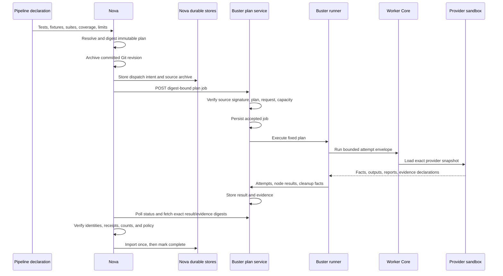

# Buster: From Test Intent to Verified Result

Status: implemented with stated environment limits
Audience: technical reader, operator, test author, Buster maintainer
Owner: buster
Evidence: skills/nova/core/test-gates; skills/buster/engine/test-gates; contracts/pipeline-test-gate/v1
Evidence revision: `3cf7dc4f72c2ae1e0ba4c47cceb08c98f4c70b7f`
Applies to: the current Nova-to-Buster remote test-gate path
Last verified: source and contract inspection on 2026-09-19

## Product Boundary

Buster executes a test plan. It does not decide which product work Nova must do.
Nova selects the test scope, resolves suites, and freezes the plan. Buster admits
that plan, executes its nodes, retains evidence, and returns a signed result
identity. Nova verifies and imports the result. Nova then applies the gate policy.

This separation prevents a test provider from changing the pipeline. A provider
can report facts about one attempt. It cannot add a test, change a blocking node
to advisory, or declare the complete pipeline successful.

**Decision:** Freeze the complete plan before remote execution.

**Reason:** The caller and executor must agree on the same nodes, packages,
configuration, limits, links, and source revision.

**Rejected alternative:** Send a project file to Buster and let Buster discover
or select tests at execution time.

**Cost:** A plan cannot absorb a later provider or configuration change. Nova
must resolve a new plan with a new digest.

> **Source evidence — authority split**
>
> [Nova resolves suite and project declarations into one digest-bound plan](https://github.com/datrab/kubeclaw/blob/3cf7dc4f72c2ae1e0ba4c47cceb08c98f4c70b7f/skills/nova/core/test-gates/resolver.ts#L720-L754).
>
> [Buster checks plan and provider identity before it executes a node](https://github.com/datrab/kubeclaw/blob/3cf7dc4f72c2ae1e0ba4c47cceb08c98f4c70b7f/skills/buster/engine/test-gates/runner.ts#L234-L265).
>
> [Nova derives the gate decision from the verified remote result](https://github.com/datrab/kubeclaw/blob/3cf7dc4f72c2ae1e0ba4c47cceb08c98f4c70b7f/skills/nova/core/test-gates/remote-result-authority.ts#L109-L190).

## Complete Request Path

Text version: Nova reads the selected test scope and creates a deterministic
plan. It archives only one committed Git tree and signs that source identity.
Nova stores the job before network dispatch. Buster verifies the job before it
stores an `accepted` status. The runner executes each ready node through Worker
Core and a package snapshot. Buster stores the terminal result and evidence.
Nova fetches those bytes by digest, verifies them, and records the import before
it returns the decision to the pipeline.

## 1. Plan Resolution

The input scope contains direct tests, fixtures, selected suites, coverage, and
concurrency limits. Suite templates are composition data. They can contribute
nodes, defaults, links, conditions, and concurrency groups. They cannot install
code or grant authority.

The resolver performs these operations:

1. Validate every suite contract and build a unique catalogue.
2. Apply exclusions and permitted overrides.
3. combine suite nodes with project-local nodes;
4. validate provider configuration against the selected package schema;
5. expand permitted matrix fields within the policy limit;
6. bind input ports to exact upstream output ports;
7. reject cycles, missing dependencies, and incompatible ports;
8. bind provider and report-adapter package digests;
9. calculate stable execution and test identities; and
10. calculate the final plan digest.

The resolved plan records what will run. It does not prove that a provider,
cluster, browser, scanner, or network target is available.

> [Suite admission, exclusions, overrides, and template digests are resolved before node expansion](https://github.com/datrab/kubeclaw/blob/3cf7dc4f72c2ae1e0ba4c47cceb08c98f4c70b7f/skills/nova/core/test-gates/resolver.ts#L279-L409).
>
> [The resolver validates links, graph order, concurrency, coverage, and the final plan digest](https://github.com/datrab/kubeclaw/blob/3cf7dc4f72c2ae1e0ba4c47cceb08c98f4c70b7f/skills/nova/core/test-gates/resolver.ts#L624-L754).

## 2. Committed Source Snapshot

Nova never sends the mutable working tree to Buster. It resolves a commit and
its tree, creates a compressed Git archive, and binds repository, stage,
revision, tree, archive digest, size, and creator authority. An Ed25519
signature protects this source statement.

Buster verifies the configured authority and public key before admission. The
signature proves which authority created the snapshot statement. The archive
digest proves byte identity. Neither fact proves that the source is safe.

The archive limit is at most 128 MiB. Nova rejects a non-root repository path,
an invalid Git object identity, an empty archive, or a changed digest.

> [Nova archives one committed Git tree and signs its exact identity](https://github.com/datrab/kubeclaw/blob/3cf7dc4f72c2ae1e0ba4c47cceb08c98f4c70b7f/skills/nova/core/test-gates/source-snapshot.ts#L17-L64).
>
> [The shared contract signs and verifies the source statement with Ed25519](https://github.com/datrab/kubeclaw/blob/3cf7dc4f72c2ae1e0ba4c47cceb08c98f4c70b7f/contracts/pipeline-test-gate/v1/src/remote.ts#L61-L104).

## 3. Dispatch and HTTP API

Nova calculates the job ID from the idempotency key. The request contains the
resolved plan, source snapshot, encoded archive, node grants, concurrency
limit, stage identity, and submission time. Its request digest covers the
complete job.

The Buster API has these routes:

| Route | Meaning |
| --- | --- |
| `GET /health` | HTTP process liveness. |
| `GET /ready` | Recovery completed and the service can admit work. |
| `POST /v1/plan-jobs` | Validate and durably admit one exact job. |
| `GET /v1/plan-jobs/:jobId` | Read current durable status. |
| `DELETE /v1/plan-jobs/:jobId` | Request cancellation for the same job. |
| `GET /v1/plan-jobs/:jobId/results/:digest` | Read one terminal result by content digest. |
| `GET /v1/plan-jobs/:jobId/evidence/:digest` | Read one retained evidence object by digest. |

The transport permits HTTPS or loopback HTTP. Bearer mode requires a token of
at least 32 characters. SPIFFE-proxy mode requires a loopback endpoint because
the local proxy owns peer authentication. Redirects are rejected. Request,
response, result, archive, evidence, and store limits remain separate.

> [The Nova transport defines job, status, cancellation, result, and evidence calls](https://github.com/datrab/kubeclaw/blob/3cf7dc4f72c2ae1e0ba4c47cceb08c98f4c70b7f/skills/nova/core/test-gates/remote-dispatch.ts#L94-L197).
>
> [Remote non-loopback plaintext endpoints fail before transport creation](https://github.com/datrab/kubeclaw/blob/3cf7dc4f72c2ae1e0ba4c47cceb08c98f4c70b7f/skills/nova/core/test-gates/secure-endpoint.ts#L7-L15).

## 4. Durable Admission and State

Buster verifies the source signature, archive encoding and digest, derived job
ID, plan digest, request digest, and wire contract. It also reserves the maximum
result capacity before it accepts a job. This conservative reservation prevents
several admitted jobs from exhausting the result store after they finish.

The status states are `accepted`, `running`, `completed`, `failed`, and
`cancelled`. A compare-and-transition record protects each state change. A
repeated idempotency key returns the prior status only when job and request
identities match. A different request under the same key fails.

The stores are local durable record and blob stores under the configured state
root. They are not a replicated database. Backup, filesystem durability,
capacity monitoring, and off-host recovery remain operator responsibilities.

> [Admission verifies identities, reserves result capacity, and stores one accepted job under a lock](https://github.com/datrab/kubeclaw/blob/3cf7dc4f72c2ae1e0ba4c47cceb08c98f4c70b7f/skills/buster/engine/test-gates/remote-plan-service.ts#L94-L165).
>
> [State transition rejects an unexpected predecessor and preserves an existing terminal result](https://github.com/datrab/kubeclaw/blob/3cf7dc4f72c2ae1e0ba4c47cceb08c98f4c70b7f/skills/buster/engine/test-gates/remote-plan-service.ts#L180-L258).

## 5. Execution, Providers, and Worker Core

The runner validates the plan against the installed registry snapshot. It
creates a secure workspace, extracts the verified repository archive, and
schedules nodes only after their dependencies permit execution. Concurrency
groups and the job-wide limit bound parallel work.

For each attempt, Buster loads the exact provider package snapshot. Worker Core
binds attempt identity, limits, deadline, cancellation, resource accounting,
cleanup, and the sealed result. The provider receives only its declared
configuration, inputs, workspace, log function, signal, and capability calls.

Fixtures can retain a live resource for dependent tests. Their cleanup runs
after consumers finish. Tests return facts and evidence, not fixture lifecycle
authority. A non-retry-safe provider cannot gain retries from a suite override.

> [Provider loading verifies the package digest and imports an attempt-owned snapshot](https://github.com/datrab/kubeclaw/blob/3cf7dc4f72c2ae1e0ba4c47cceb08c98f4c70b7f/skills/buster/engine/test-gates/provider-loader.ts#L37-L86).
>
> [The runner validates result counts, evidence, reports, and output contracts](https://github.com/datrab/kubeclaw/blob/3cf7dc4f72c2ae1e0ba4c47cceb08c98f4c70b7f/skills/buster/engine/test-gates/runner.ts#L325-L390).

## 6. Evidence, Reports, and Result Authority

A provider declares evidence files. Buster opens and stores them under bounded
rules, calculates content digests, and creates immutable references. The runner
adds its own log evidence. It rejects duplicate IDs or paths, undeclared types,
missing report files, unknown report formats, invalid counts, and incompatible
outputs.

A report adapter parses one declared report artifact. It receives bytes and
limits, but no host capability. The current installed adapter handles JUnit XML.
The original report remains evidence when normalized case or finding lists are
truncated.

Buster creates attempt receipts, node receipts, and one remote result receipt.
These receipts bind authority, identity, and result digest. They do not sign
with a private key. The remote result receipt uses deterministic hashes under
the named `buster-plan-service.v1` authority. Source authentication uses the
separate Ed25519 signature described above.

> [The result contract derives the Buster receipt from job and result identity](https://github.com/datrab/kubeclaw/blob/3cf7dc4f72c2ae1e0ba4c47cceb08c98f4c70b7f/contracts/pipeline-test-gate/v1/src/remote.ts#L106-L137).
>
> [Report admission checks format, media type, size, cancellation, and runtime-root integrity](https://github.com/datrab/kubeclaw/blob/3cf7dc4f72c2ae1e0ba4c47cceb08c98f4c70b7f/skills/buster/engine/test-gates/report-adapter-runtime.ts#L118-L153).

## 7. Nova Verification and One-Time Import

Nova accepts only a terminal status that belongs to the submitted job and
request. For a completed job, it downloads the exact result object, validates
the content and result digests, checks all job, run, plan, node, attempt,
receipt, and source identities, and derives the gate decision.

Nova then stores a pending import record, imports every referenced evidence
blob by digest, and changes the record to `complete`. A retry with the same
identity continues or returns that import. A conflicting result fails. Nova
does not use the Buster status alone as the pipeline verdict.

> [The importer validates terminal status, result identity, total evidence size, and every evidence digest](https://github.com/datrab/kubeclaw/blob/3cf7dc4f72c2ae1e0ba4c47cceb08c98f4c70b7f/skills/nova/core/test-gates/remote-result-import.ts#L156-L207).
>
> [The import store writes pending intent before blobs and completes with a guarded transition](https://github.com/datrab/kubeclaw/blob/3cf7dc4f72c2ae1e0ba4c47cceb08c98f4c70b7f/skills/nova/core/test-gates/remote-result-import.ts#L82-L154).

## 8. Failure, Cancellation, Restart, and Recovery

| Failure | Current behavior | Safe action |
| --- | --- | --- |
| Dispatch response lost | Nova keeps the stored job and polls the derived job ID. | Reuse the same idempotency key and inspect durable status. |
| Retryable HTTP failure | Dispatcher retries within the one gate deadline. | Restore transport; do not create a different job. |
| Job deadline | Nova requests cancellation and records interruption facts. | Inspect both Nova and Buster records before another run. |
| Buster restart | Runtime calls recovery before it listens. | Keep readiness closed until recovery finishes. |
| Running work after restart | Service reconciles durable jobs and terminal workspaces. | Preserve workspaces that cannot prove cleanup. |
| Provider crash | Attempt becomes errored or unresolved according to Worker proof. | Read attempt, cleanup, and process evidence. |
| Fixture cleanup failure | Cleanup error remains in the remote result. | Do not treat a passed test as complete cleanup. |
| Evidence import interruption | Nova retains `pending_evidence` and retries the same import. | Restore the missing blob path; do not re-execute tests. |
| Store capacity exhausted | Admission fails before accepting more result liability. | Free only verified retained data or add capacity. |
| Completed archive pressure | Manual compaction can remove inline archive bytes after full proof. | Use an exact compaction intent; retain source, result, and evidence authority. |

Cancellation is cooperative across boundaries. Nova aborts transport and asks
Buster to cancel. Buster aborts the running job. Worker Core and capability
implementations must propagate their signals to owned processes. A closed HTTP
connection alone does not prove that every descendant stopped.

## 9. Configuration and Environment Boundary

The production path depends on a selected Buster runtime role, Worker Core,
the local durable state volume, exact provider packages, and capability
implementations. Individual suites add BuildKit, Kubernetes, Tailscale,
browsers, network targets, Trivy databases, or report tools.

The [suite reference](../reference/buster-suites.md) gives all shipped suite
fields and prerequisites. The [namespace controller](buster-namespace-controller.md)
explains Kubernetes fixture ownership. The [workflow](../use/workflows/buster-suite.md)
shows one complete suite, fixture, matrix, report, and decision path.

## 10. Implemented Limits

- The durable stores use one local filesystem. They do not provide replication.
- Result receipts are deterministic integrity bindings, not asymmetric Buster signatures.
- Suite templates can be empty and require project nodes or overrides.
- A role manifest proves package selection, not live capability readiness.
- Local contract tests do not prove BuildKit, Kubernetes, Tailscale, browsers,
  scanners, SPIFFE, or remote network behavior.
- Compaction is a manual local operation. It does not define general retention
  or garbage collection.
- Buster cannot turn missing mandatory coverage, an excluded node, or a skipped
  node into a pass.

These limits are part of the architecture. They prevent a reader from treating
one green provider result as complete pipeline or platform evidence.
