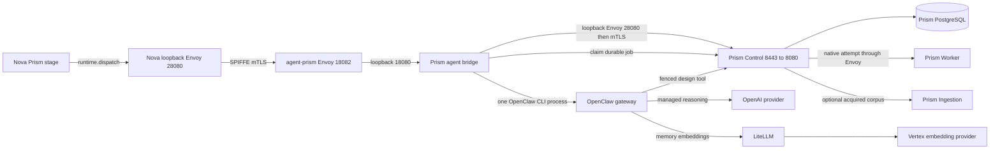

# Communication: End-To-End Transport And Failure Contracts

Status: implemented paths documented; unavailable guarantees stated explicitly
Audience: platform operator, runtime maintainer, integration developer, security reviewer
Owner: runtime and platform maintainers
Evidence: contracts/pipeline-test-gate/v1; contracts/pipeline-worker-core/v1; skills/nova/core; skills/worker/core; skills/common/plugins/redis-transport; charts/kubeclaw; charts/prism; tests/verification/reliability
Evidence revision: `32b02816cc19cc8865a45b221b8b6ca28e99e8fb`
Applies to: current Nova, Buster, Prism, Worker Core, specialist, Redis, registry, Git, BuildKit, Tailscale, and SPIFFE paths
Last verified: code, schema, chart, manifest, and focused test inspection on 2026-09-21

## How To Read This Page

A connection is safe only when its message, identity, time, ordering, storage,
and failure rules agree. A diagram can show direction, but it cannot show all
these conditions. The matrix below is therefore the primary communication
inventory.

“None” means that the implementation deliberately has no mechanism. “Owner
store” means the receiving domain persists the accepted operation. “Caller
journal” means Nova or the invoking runtime keeps the durable intent. A retry is
safe only when the row names an idempotency or identity rule.

## Prism Request Topology

The production design path does not connect Nova directly to Prism Control.
The complete path is:

Text version: Nova sends one idempotent request to its loopback Envoy. Envoy
authenticates the Nova workload to the `agent-prism` Envoy. That proxy forwards
to the bridge on loopback. The bridge sends the request through its second
loopback Envoy listener to Prism Control. The first hop validates Nova. Control
validates the Prism Agent identity, persists the request and agent job in
PostgreSQL, and returns waiting state. The bridge later claims that durable job,
starts one OpenClaw CLI process, and the OpenClaw Prism tool commits exactly
three designs or one revision back to Control with the job ID and fence.
Control, not OpenClaw, owns the final document, revision, approval, and job state.

The bridge and Control have different failure boundaries. A 30-second bridge
dispatch timeout can lose the HTTP response after Control committed the request.
The caller must reconcile the same idempotency key. After the bridge claims a
job, any uncertain OpenClaw launch becomes `needs_nova`; the implementation does
not replay it. A claim expires after 16 minutes. The OpenClaw attempt allows 15
minutes plus 10 seconds for cleanup, and its local logs and result are each
limited to 1 MiB. PostgreSQL retains the job, request digest, stable session key,
fence, result, and outcome. The OpenClaw PVC retains gateway session state, but
it is not the authority for Control state.

> **Source evidence — the complete Prism bridge**
>
> [Nova derives the dispatch idempotency key from run, architecture, and phase](https://github.com/datrab/kubeclaw/blob/32b02816cc19cc8865a45b221b8b6ca28e99e8fb/skills/nova/plugins/prism-design/src/stage.ts#L10-L34).
>
> [Nova and Prism-agent proxies define the two mTLS hops and loopback listeners](https://github.com/datrab/kubeclaw/blob/32b02816cc19cc8865a45b221b8b6ca28e99e8fb/charts/kubeclaw/templates/configmap-worker-trust.yaml#L84-L130) and [the agent-to-Control cluster](https://github.com/datrab/kubeclaw/blob/32b02816cc19cc8865a45b221b8b6ca28e99e8fb/charts/kubeclaw/templates/configmap-worker-trust.yaml#L175-L197).
>
> [The bridge bounds request size and dispatch/read time, polls once per second, and stops its runner on shutdown](https://github.com/datrab/kubeclaw/blob/32b02816cc19cc8865a45b221b8b6ca28e99e8fb/skills/prism/server/agent-bridge.mjs#L1-L37).
>
> [The shared dispatch adapter defaults request and response limits to 1 MiB](https://github.com/datrab/kubeclaw/blob/32b02816cc19cc8865a45b221b8b6ca28e99e8fb/skills/common/plugins/runtime-dispatch/src/adapter.ts#L63-L89).
> [The OpenClaw attempt fixes its timeout, cleanup period, and output limits](https://github.com/datrab/kubeclaw/blob/32b02816cc19cc8865a45b221b8b6ca28e99e8fb/skills/prism/server/agent-attempt.ts#L10-L28).
>
> [Control persists the request before job admission](https://github.com/datrab/kubeclaw/blob/32b02816cc19cc8865a45b221b8b6ca28e99e8fb/skills/prism/server/control-server.ts#L202-L240).
>
> [The job store enforces one active session, a 16-minute fence, and `needs_nova`](https://github.com/datrab/kubeclaw/blob/32b02816cc19cc8865a45b221b8b6ca28e99e8fb/skills/prism/control/agent-jobs.ts#L31-L65).

## Complete Connection Matrix

| Sender → receiver | Purpose and schema | Transport / endpoint | Authentication and authorization | Timeout and ordering | Retry, persistence, and deduplication | Backpressure | Failure effect and recovery |
| --- | --- | --- | --- | --- | --- | --- | --- |
| Nova → Buster | Submit `buster-plan-job.v1`; read status, `remote-plan-result.v1`, and digest-bound evidence. | HTTP(S): `POST /v1/plan-jobs`; `GET` or `DELETE /v1/plan-jobs/:jobId`; `GET .../results/:digest` and `.../evidence/:digest`. | Bearer token of at least 32 characters, or loopback HTTP behind a SPIFFE proxy; capability and fixed plan/source grants are in the job. | One gate deadline; polling is at least 10 ms; cleanup defaults to 10 s. Submit precedes status and import. | Nova stores intent first. Job ID derives from idempotency key. Buster locks and stores one job. Retry uses the same ID. Import records pending before blobs and completes once. | Configured response/result ceilings, plan limits, Buster concurrency, and evidence byte limits. | Retry only classified transport/server failures within the deadline. Lost response causes status reconciliation, never a new job. Digest or identity mismatch blocks import. |
| Nova → Prism agent bridge → Control | Submit `prism.design-request.v1`; receive `202 waiting` or an approved archive. | `POST /v1/dispatch`: Nova Envoy `127.0.0.1:28080` → `agent-prism:8080`/Envoy `18082` → bridge `127.0.0.1:18080` → its Envoy `28080` → Control mTLS Service `8443` → app `8080`. | SPIFFE authenticates Nova to agent-prism and agent-prism to Control. Control admits Nova, Prism Agent, or test runner. The idempotency key and configured preference subject are mandatory. HMAC is only the non-SPIFFE Control fallback. | Adapter request/response defaults are 1 MiB; bridge and Control accept at most 2 MB. Bridge dispatch is 30 s. Architecture revisions must move forward. | PostgreSQL stores the request before job admission. Dispatch idempotency starts one design round. Existing approved baseline is returned for the bound approval. | Body ceilings, database pool, one active agent session, and bridge admission. | Invalid peer, transition, schema, or signature fails closed. Reconcile a lost response with the same key; it is not a new design identity. |
| Prism Control → native Prism Worker | Execute `worker-attempt-envelope.v3`; receive `worker-attempt-result.v3`. | HTTP `POST /v1/attempts`; `/health`, `/bootstrap`, and `/ready` separate liveness and admission. | SPIFFE Control allowlist or body-bound HMAC with timestamp and one-time nonce. Worker profile, claim, package, capability, and attempt digests authorize work. | Envelope queue deadline, attempt timeout, claim expiry, and cleanup deadlines. Worker executes one admitted native attempt at a time. | Control operation store reserves idempotency identity and records terminal result before hydration. Conflicting results are rejected. | Input ceiling, one native attempt, declared CPU/memory/task/log/evidence budgets. | 503 means dependency, reconciliation, or busy; 422 means rejected input/execution. Reconcile stored operation and Worker journal before retry. |
| Prism Control ↔ Prism Agent Bridge / OpenClaw | Claim durable agent jobs and commit exactly three designs or one next revision. | Control agent-job HTTP routes through loopback Envoy; bridge listens on `127.0.0.1:18080` and polls each second. | SPIFFE Prism Agent identity at Control. Job ID and fence bind mutation tools. | Bridge dispatch timeout 30 s; control reads 10 s; one active job; accepted job fence lasts 16 minutes. | PostgreSQL owns job state. Stable session key and job fence prevent replacement. A lost launch becomes an explicit errored/needs-Nova state. | One active job, 2 MB bridge body, fixed attempt and model limits. | Do not spawn again after uncertain launch. Inspect durable job; Nova resolves `needs_nova`. Shutdown stops polling and terminates the owned process. |
| Prism Control → Ingestion | Acquire allowed corpus input into quarantine, verify it, and delete it after publication. | HTTP `POST /v1/acquisitions` and `DELETE /v1/acquisitions/:sha256` at `prism-ingestion:8080`. | Bearer `PRISM_INGESTION_SECRET`; NetworkPolicy permits Control only. Control rejects public-web input until a source policy is approved. | Acquisition 30 s; cleanup 10 s; request 2 MB; acquired body 6 MB; HTTPS fetch 15 s with at most three redirects. | Quarantine file name is the SHA-256. Control verifies bytes, stores an inactive corpus revision and embedding, cleans quarantine, then activates the exact revision. | One 4 GiB `emptyDir`; TTL defaults to one hour and is clamped to 1 minute–1 day. | Acquisition, digest, embedding, publication, and cleanup errors stay distinct. Do not activate the corpus until storage and cleanup complete. |
| Prism Control → native Worker → design provider | Generate, render, evaluate, ingest, or publish a bounded native attempt. | Control calls Worker through Envoy/mTLS; the per-attempt host invokes the in-process Prism engine. | Control and Worker SPIFFE IDs, claim/fence, accepted profile, resource policy, and content digest. | Attempt 300 s; cleanup 10 s; queue claim 10 minutes; Worker request-body timeout defaults to 120 s. | Control operation state and Worker native journal bind the result. The current native host instantiates `DeterministicDesignProvider`; it does not call the available OpenAI-compatible provider. | One native attempt, 16 MiB result, 128 MiB evidence, 64 files, and cgroup budgets. | Reconcile a failed or interrupted attempt from Control state and the Worker journal. Do not infer an external provider call from a provider class that is not composed. |
| Nova, Buster, or Prism OpenClaw → managed OpenAI | Supply reasoning for one OpenClaw agent session. Provider request and response schemas are owned by the pinned OpenClaw runtime, not by Nova or Prism contracts. | External provider transport selected by OpenClaw; the repository configures provider `openai` and allowed model IDs, but not a fixed remote URL. | OpenClaw OAuth profiles authenticate the external account. The role model selection and generated allowlist authorize `openai/gpt-5.6-sol` and `openai/gpt-5.5`. | Provider timeout and retry policy are not defined in this repository. The owning pipeline deadline, Prism 15-minute attempt, and OpenClaw session order remain the outer bounds. | OpenClaw retains session state. Prism also retains job ID and fence; Nova retains its effect and stage records. No repository contract proves provider-side request deduplication. | Provider quotas, OpenClaw session limits, and the owning operation deadline. | Preserve and reconcile the same session or durable job after an unknown outcome. Do not create a replacement agent merely because transport failed. |
| Nova, Buster, or Prism OpenClaw → LiteLLM → Vertex | Create remote memory-search embeddings. Agent reasoning uses the separately configured managed OpenAI model route. | OpenAI-compatible `http://litellm.kubeclaw.svc.cluster.local:4000/v1`; model `gemini-embedding-001`; LiteLLM routes to Vertex AI. | OpenClaw receives `LITELLM_API_KEY`; LiteLLM reads its master key and mounted Google service-account credential. | The repository sets no OpenClaw embedding request limit, timeout, error map, or retry count. The bounded role probe calls only `/health`. | LiteLLM can store gateway state in its PostgreSQL. Embeddings do not own pipeline or Prism lifecycle state. | Provider quota, gateway resources, PostgreSQL, and unknown pinned-client limits. | Keep the owning operation incomplete on timeout, auth, quota, provider, or vector error. Diagnose and prove one real embedding; health success is not route proof. |
| Discord service and allowed user ↔ Nova or Buster OpenClaw | Carry the two enabled bot channels, allowed commands, threaded sessions, replies, and Buster execution approvals. | External Discord bot gateway and HTTPS APIs as implemented by the pinned OpenClaw Discord plugin. The repository fixes channel IDs but not Discord service endpoints. | Distinct `DISCORD_TOKEN` Secret keys authenticate each bot. Channel, allowed-user, owner, mention, and Buster approver lists authorize application handling. | Guild messages require a mention. The configured inbound worker limit is 12 hours; thread idle is 999 hours. External request timeout, reconnect, and rate-limit retry are not defined here. | OpenClaw retains role session state. Discord retains external message identity. No Discord message can replace a Nova journal, Buster receipt, or Prism row, and no repository contract proves end-to-end message deduplication. | Discord limits, one gateway's session controls, and external rate controls. | Keep domain state unchanged on disconnect, denial, or uncertain reply. Restore the same bot and channel, then prove an allowed user and a denied user without replaying an uncertain command. |
| Prism Control / Worker → Prism PostgreSQL | Transact projects, revisions, operations, agent jobs, approvals, preferences, corpus, and worker nonces. | PostgreSQL to `prism-postgresql:5432`; separate runtime, migration, backup, and test URLs. | Credentials come from `prism-postgresql-auth`; NetworkPolicy restricts named Prism clients. | Pool, statement, lock, and transaction limits are owner-specific. Worker dependency checks default to 750 ms. | PostgreSQL is authoritative. Row locks, unique keys, advisory locks, revision CAS, and job fences serialize conflicts. | Database pool and retained PVC. | Stop Prism mutation when unavailable. Restore the matched database-and-artifact group and reconcile operations before new admission. |
| Nova stage → Forge or Echo via runtime adapter | `kubeclaw.implementation.v2` or the Echo review request; strict typed completion. | In-process capability call, then OpenClaw Gateway HTTP/MCP/ACP for the selected allowlisted target. | Core capability grant, target ID allowlist, named secret; optional verified workspace owner. OpenClaw controls model/tool access. | Target polling defaults 1–15 s and session deadline 30 minutes. One session identity orders all polls and result collection. | Core effect identity and runtime idempotency key; session identity is reconciled after lost response. Final artifact is stored by the stage. | Fixed prompt/context/output budgets; target response sizes; bounded session polls. | Parser rejection blocks the stage. Abort sends cancel/stop and must prove terminal state. Unresolved cleanup blocks retry to prevent duplicate agents. |
| Nova Core → stage | Invoke stage with `StageInvocationContract`; receive `stage-result.v2`, wait, effects, facts, and artifacts. | In-process module call for direct activation; isolated stage IPC when that activation is selected. | Registry snapshot, package digest, registration ID, role selection, stage capability grant, attempt lease and fence. | Attempt lease and abort signal propagate. Scheduler orders graph dependencies; stages do not select successors. | Run journal and attempt records are authoritative. Attempt number and effect idempotency keys prevent reuse. | Declared input/artifact limits, scheduler concurrency, effect limits, and isolation channel limits. | Invalid result or expired fence cannot change lifecycle. Core records failure and applies declared retry/repair policy. |
| Stage → adapter | Request one effect such as Git, artifact, secret, dispatch, Redis, or Buster transport. | In-process capability router; adapter can then use local or network transport. | Exact capability grant, operation, resource type and canonical ID; confidential calls hide secret results from ordinary stage data. | Caller abort and effect deadline propagate. Core journals intent before uncertain external work. | Effect ID and idempotency key bind retries. Adapter-specific reconciliation decides whether an unknown result can repeat. | Adapter request/response limits and bounded cleanup scope. | Unknown external outcome becomes reconciliation-required. Do not translate it into an ordinary stage retry. |
| Buster provider → configured HTTP(S) target | Execute a Buster `network.http` request whose method and complete URL are supplied by the admitted provider request; inventory identity is `DYNAMIC {configuredUrl}`. | Fetch with manual redirects; HTTP or HTTPS only. WebSocket is a separately gated operation and is not this HTTP family. | The capability request must name `network.http`, `network.url`, and an allowed operation. Runtime policy checks exact origin or suffix, port, exact-origin authority, method, request headers, and optional registry-health credentials; URL credentials and fragments are denied. | The request timeout is the smaller configured request value or runtime maximum and is combined with caller cancellation. There is no automatic redirect or request retry. | The invoker stores no response or deduplication state. The owning Buster job/attempt and its evidence remain authoritative, so an uncertain non-idempotent target outcome needs target-specific reconciliation. | Configured request and response byte ceilings; request header entries and requested response-header names are each limited to 32; WebSocket message count/bytes are separately bounded. | Denied policy, cancellation, timeout, redirect, response overflow, or transport error fails the provider request. Do not replay a mutating configured method unless the owning effect and remote target make that replay safe. |
| Granted stage/plugin → common `network.http` adapter → configured HTTP(S) target | Execute the common adapter's runtime-configured method and URL; inventory identity is `DYNAMIC {configuredUrl}`. | Fetch to the request canonical URL with manual redirects and connection close. | Core must grant `network.http`/`request`; the adapter requires an exact configured origin and allowed method/header set, rejects URL credentials, and checks the current fence for non-confidential calls. Any application credential is an explicitly allowed request header, not implicit adapter identity. | Caller cancellation propagates; adapter timeout defaults to 30 s. It performs one request and never follows or retries a redirect. | The adapter is stateless. Core's effect journal, effect ID, and idempotency key own retry/reconciliation; the remote service owns any accepted mutation. | Request and decompressed response each default to 1 MiB and are configurable; response collection stops at the ceiling. | Origin, method, header, fence, timeout, redirect, size, HTTP, decode, or transport failure rejects the effect. Preserve an unknown remote outcome for reconciliation rather than turning it into a fresh stage retry. |
| Core → observer | Deliver lifecycle and telemetry events after authoritative state changes. | In-process observer callback; an observer may emit to Redis or another sink through a granted adapter. | Observer registration and narrow telemetry capabilities. Observer has no lifecycle-write grant. | Delivery follows committed lifecycle order; observer deadline applies. | Canonical journal is the source of truth. Sink delivery can deduplicate by event/idempotency identity. | Observer queue and sink bounds. | Observer failure can degrade visibility but cannot reverse or invent pipeline state. Replay from authority where supported. |
| Native supervisor ↔ unprivileged worker host | Carry role-defined control messages; process input/result use the Worker envelope/result contracts. | One duplex native control stream with 4-byte big-endian length framing; process stdin/stdout is separate. | Local process ownership, fixed executable, dropped privilege, attempt identity, cgroup, and journal. No network credential. | Single reader; writes serialize in call order. Attempt, close, poll, and cleanup timeouts come from native policy. | Native journal records accepted input, process result, spooled output, and sealed result. The framing layer has no message deduplication. | Per-message and total-session byte ceilings; stdout/stderr spool and result limits. Stream write backpressure is awaited. | Truncated, oversized, closed, or ambiguous channel fails the attempt. Supervisor terminates and drains the owned process tree before recovery. |
| Plugin → Redis | Publish transport payload or telemetry JSON. | RESP over `redis://` or TLS over `rediss://`; `AUTH`, then one Lua `EVAL`. Stream is `<prefix>:v2:<kind>:<encoded target>`. | Password is resolved through `secrets.read`; URL cannot contain credentials. TLS validates the server hostname in `rediss` mode. Capability must match publisher or telemetry adapter. | Configured timeout, maximum 300 s. Redis stream IDs order accepted entries per stream. | Lua checks a digest-derived dedup key, then `XADD MAXLEN ~`, then stores entry ID with configured TTL. Redis is transport, not run authority. | Payload ≤1 MiB; response ≤about 1 MiB; `maxLen` ≤1,000,000; socket pressure and timeout stop the call. | Connection, auth, protocol, timeout, or response failure rejects the effect. Reconcile by the same idempotency key; lifecycle recovers from Nova's journal. |
| OpenClaw observer → Redis | Write agent-observability v1 control or payload events and failed-control dead letters. | `XADD MAXLEN ~` to fixed `pipeline:agent-observability:{control,payload,deadletter}:v1` streams. | Observer Redis credentials and optional TLS; host policy controls which OpenClaw hooks enter the writer. | One queue drains control before payload. Each command has a configured timeout. Control retries use bounded exponential delay; payload writes try once. | Redis retains entries to approximate configured length. Runtime sequence/content suppression reduces duplicate observations, but there is no atomic Redis dedup key and no consumer acknowledgement here. | Separate bounded control and payload queues. A full queue drops the new event for that same queue. Control drain priority does not evict a payload event. | Failed control writes go to the dead-letter stream after bounded retry. If that write also fails, counters and warnings are the only evidence. Telemetry loss never changes lifecycle authority. |
| Browser → Prism Studio static responder | Load the Studio shell or a built asset. The server route is the method-agnostic SPA fallback `ANY /*`, excluding exact `/health` and `/ready` and the proxied `/v1/*` prefix; `/v1` without the trailing slash is therefore static fallback input. | HTTPS through the private Tailscale Ingress, then local filesystem streaming. Missing files fall back to `index.html`; this path never calls Control. | Tailnet route policy protects external reachability. The static responder itself does not require the Prism session cookie and grants no domain authority; browser API mutations still use the separate `/v1/*` proxy with session and CSRF checks. | There is no application fallback timer or ordering state. The response stream awaits filesystem and socket backpressure; health and API classification precede fallback selection. | Built Studio files are deployment content, not mutable domain state. The fallback writes no database, journal, session, or deduplication record. | Traversal outside the configured root is denied. Content streams without buffering the whole file; limits are filesystem, server, and ingress bounds rather than a route body quota. | Invalid URL encoding returns 400, traversal returns 403, a missing fallback index returns 404, and other I/O failures return 500. Repair or redeploy the static bundle; never infer Control state from a successful shell response. |
| User → Prism Studio / Control | Browser session, project and revision work, approval, publication. | HTTPS Tailscale Ingress to Studio; Studio proxies the `/v1/*` prefix to Control. | Tailscale identity exchange, signed 15-minute session cookie, CSRF cookie/header for mutations, product-role checks. | Studio proxy timeout; disconnect aborts upstream. Revision CAS orders edits and approval. | PostgreSQL persists domain state. Operation and revision identities reject stale writes. | Request/body limits, pool limits, one publication per locked project path. | Authentication, CSRF, stale revision, validation, or publication evidence failure stops mutation. Reload authoritative revision and retry explicitly. |
| Private client → Tailscale-published service | Reach Prism Studio, Archviewer, Argo/Ops surfaces, or a temporary Buster fixture. | Tailnet DNS and Tailscale Ingress; Buster exposure returns a typed HTTPS endpoint and lease. | Tailnet device/user ACL plus service auth where present. Archviewer also requires Basic auth. Temporary fixture authority is namespace-lease and capability bound. | Readiness and lease deadlines are service-specific. Exposure must exist before tests use it and release follows consumers. | Platform routes have controller state. Buster exposure persists lease identity; it is not a general durable message queue. | Ingress/service limits and test concurrency. | DNS, certificate, ACL, readiness, or lease failure blocks that consumer. Release or retain according to cleanup policy; never reuse a stale lease URL. |
| Nova / Buster → Git | Clone or fetch source; create a local worktree; commit selected files; merge an exact revision. | Operator-configured Git SSH/HTTPS remote and local filesystem worktrees. No supported local Git-mirror service exists in the current repository. | Deploy key and host trust at Git transport; Core capability grants and workspace owner records for mutation. | Git command deadlines; expected parent and source revision impose order. | Git objects and refs persist. Attempt generation separates worktrees. Commit SHA and owner record bind identity. | Repository size, command output, path count, disk, and lock-wait bounds. | Stale parent, conflict, lock timeout, remote failure, or owner mismatch blocks. Reconcile refs before retry. A managed Git mirror remains roadmap work and has no current fallback contract. |
| Buster → BuildKit → OCI registry | Build an image, push immutable manifest/layers, verify digest, then let consumers pull it. | BuildKit client protocol to rootless BuildKit; OCI Distribution API to local registry; upstream pulls may use Docker Hub mirror. | Registry client configuration controls endpoints and credentials. Current lab local registry is anonymous HTTP; it is not production-grade HTTPS. | Build and push deadlines are provider settings. Manifest digest binds later verification and pull order. | BuildKit cache and registry blobs persist independently. Content digests deduplicate layers and bind the selected manifest. | Build context, output, cache, disk, concurrent build, and registry limits. | Build, push, digest check, or pull failure fails the node. Retry only after checking whether the digest exists. A mirror miss is not local-registry success. |
| Workload → SPIRE / Envoy → protected service | Obtain SVID, establish mTLS, and forward verified SPIFFE identity to loopback application HTTP. | SPIFFE Workload API over CSI socket; Envoy mTLS listener and local plaintext application listener. | SPIRE issues workload identity. Envoy validates peer trust domain and SAN. Application accepts forwarded identity only from loopback proxy and an exact peer allowlist. | SVID rotation is handled by workload API/Envoy. Application request deadlines still apply. | No message persistence or deduplication at mTLS. Domain stores retain accepted operations. | Envoy connection/request limits plus application limits. | Missing SVID, invalid SAN, unlisted peer, non-loopback forwarded header, or proxy failure denies the request. Restore identity/proxy; never fall back silently to anonymous remote HTTP. |
| Codex client → Ops MCP → Kubernetes API | Request read-only cluster, Argo, workload, event, or log evidence. | Bearer-authenticated MCP at Pod loopback `127.0.0.1:8080/mcp`; Ops MCP uses `GET {kubernetesApiPath}` over HTTPS to the configured Kubernetes API origin. The symbolic path covers tool-selected core and grouped API paths without inventing one static URL. | Rotating bearer for MCP; projected ServiceAccount token is re-read for every request, the configured CA verifies TLS, and RBAC authorizes Kubernetes reads; optional exact Origin allowlist and namespace enum constrain MCP callers. | Each Kubernetes request has a 10 s timeout and 8 MiB response ceiling; logs have 64 KiB. Lists reduce page size only after an oversized response. `namespace_overview` and `get_events` have no aggregate page, duration, scan-item, or encoded-output ceiling. | No durable MCP session or result store and no automatic general retry. Kubernetes supplies current state and continuation tokens; oversized list pages alone are retried with a smaller page size and the same selectors/token. | Per-request and log ceilings. The two full-scan tools remain unbounded at operation level. | Invalid path, token/CA, 401/403, RBAC, API, timeout, parse, or size error returns no write. Prefer a one-page or single-object tool. Do not interpret an absent full-scan response as an empty namespace. |
| Ops MCP → Hubble Relay | Read bounded Cilium flow evidence. | Fixed `hubble observe` process to `hubble-relay.cilium.svc.cluster.local:4245`. | Ops Pod process and cluster network boundary; result filtering rechecks exact namespace and Pod identity. | Two concurrent queries; 12 s; maximum 15-minute window; 2 MiB raw and 192 KiB returned; 1–50 flows. | No lossless cursor. Warnings and partial reasons are part of the result. | Query semaphore, byte ceilings, and Hubble peer capacity. | Partial, lost-event, timeout, parse, relay, or process failure cannot prove absence of traffic or drops. Narrow the window and retain partial reasons. |
| Prometheus / Alloy → monitoring stores → Grafana | Project metrics and logs for diagnosis. | Prometheus scrapes; Alloy reads CRI logs and posts to Loki `/loki/api/v1/push`; Grafana queries configured data sources. | Target-specific scrape identity; checked-in Loki uses network controls, not application auth; Grafana reads an existing admin Secret. | Profile-specific scrape and batch settings; Prometheus retains 15 days and Loki 720 hours. | Prometheus, Loki, and Alloy positions hold derived observations only. | Collector queues, storage, retention, and backend availability. | Monitoring failure reduces visibility. Recover backend before collectors and correlate gaps with canonical journals; do not synthesize lifecycle events. |

The two `{configuredUrl}` records and `{kubernetesApiPath}` are deliberately
symbolic. They describe active runtime provider families whose concrete targets
exist only after an admitted request selects them. They are not wildcard server
routes and must not be expanded into fabricated concrete endpoints. Likewise,
Studio's `/*` record is explicitly a static-response fallback with exclusions;
it is not a general application catchall.

> **Source evidence — dynamic HTTP families and Studio fallback**
>
> [Buster validates the configured URL, origin, and port before it permits the dynamic target](https://github.com/datrab/kubeclaw/blob/32b02816cc19cc8865a45b221b8b6ca28e99e8fb/skills/buster/engine/test-gates/network-http-runtime.ts#L185-L198).
>
> [The request path enforces the method, headers, timeout, and byte ceilings before and during the dynamic fetch](https://github.com/datrab/kubeclaw/blob/32b02816cc19cc8865a45b221b8b6ca28e99e8fb/skills/buster/engine/test-gates/network-http-runtime.ts#L208-L268).
>
> [The common adapter converts its configured origins, methods, headers, timeout, and byte limits into an enforceable policy](https://github.com/datrab/kubeclaw/blob/32b02816cc19cc8865a45b221b8b6ca28e99e8fb/skills/common/plugins/network-http/src/adapter.ts#L18-L51).
>
> [Its fetch path applies cancellation, timeout, redirect, and response-size controls](https://github.com/datrab/kubeclaw/blob/32b02816cc19cc8865a45b221b8b6ca28e99e8fb/skills/common/plugins/network-http/src/adapter.ts#L53-L100).
>
> [Activation binds the dynamic canonical URL and method to that policy and checks the execution fence](https://github.com/datrab/kubeclaw/blob/32b02816cc19cc8865a45b221b8b6ca28e99e8fb/skills/common/plugins/network-http/src/adapter.ts#L107-L137).
>
> [Ops MCP fixes HTTPS and GET while accepting a validated dynamic Kubernetes API path, rotating token, CA, timeout, and response ceiling](https://github.com/datrab/kubeclaw/blob/32b02816cc19cc8865a45b221b8b6ca28e99e8fb/tools/ops-mcp/src/kubernetes.mjs#L1-L58).
>
> [Studio classifies health first, proxies only `/v1/`, and sends every other path to the bounded static-file/SPA responder](https://github.com/datrab/kubeclaw/blob/32b02816cc19cc8865a45b221b8b6ca28e99e8fb/skills/prism/server/studio-request.ts#L89-L139).

### Dynamic Prism Route Families

Prism Control matches several routes at runtime because project, document,
revision, direction, job, artifact, and decision IDs are part of the path. The
families below are application contracts, not a promise that any arbitrary ID
is valid. Each handler authenticates first, then checks ownership or binding in
PostgreSQL or the artifact store.

| Route family | Caller and authority | State, ordering, and limits | Failure and safe continuation |
| --- | --- | --- | --- |
| `GET /health`, `GET /ready` | Kubernetes or an operator. Health proves the process; readiness also executes `SELECT 1`. Neither route grants domain authority. | No mutation. Readiness depends on Prism PostgreSQL. | Keep admission stopped when readiness fails. Process health alone cannot justify a write. |
| `POST /v1/session` | Tailscale-authenticated browser exchanges trusted identity headers for a signed 15-minute session and a separate CSRF value. | Session cookie is HTTP-only; mutation requests must carry the CSRF value. Product mode also checks the exact configured Origin. | Reject missing or changed identity and origin. Start a new authenticated browser session; do not reuse a failed mutation as proof of success. |
| `POST /v1/dispatch` | Nova, Prism Agent, or test-runner over the protected proxy path; HMAC is the non-SPIFFE fallback. | Body is at most 2 MB. Idempotency key, preference subject, project, architecture digest, and forward-only revision bind admission. PostgreSQL records the request before an agent job. | A lost response is reconciled with the same key. Invalid identity, signature, schema, project transition, or stale revision fails closed. |
| `/v1/agent/jobs/{claim|<job>|<job>/finish}` and `GET /v1/agent-jobs/<job>` | The Prism Agent identity claims, reads, and finishes the durable job; an authenticated human can read the separate public status receipt. | One active session, stable session key, runner ID, 16-minute claim, fence, request digest, and terminal outcome live in PostgreSQL. | An uncertain launch is not replayed. Inspect the same job and fence; Nova resolves `needs_nova`. |
| `POST /v1/agent/design-sets` and `POST /v1/agent/revisions` | Only the protected Prism Agent tool identity can commit generated work. | A design set has exactly three unique directions. A revision must belong to the project and increment the expected revision once. Job ID, generation, and fence bind both writes. | Reject stale fence, changed project/document, invalid generation, or schema. Reconcile the durable job rather than submitting an unbound replacement. |
| `GET/POST /v1/projects`, `GET /v1/projects/<projectId>/brief`, and `GET/POST /v1/projects/<projectId>/directions` | Authenticated Studio user lists or creates projects, reads the active architecture, reads directions, or starts another agent round. | PostgreSQL owns the project and active request. A new round binds user, document, expected revision, parent round, architecture digest, and an explicit idempotency key. | Reload the active project and round after conflict. Do not attach a result from an old architecture or preference generation. |
| `POST /v1/directions/<id>/{feedback|select}` | Authenticated Studio user records preference feedback or selects one direction. | The idempotency header, user identity, direction ID, action, and optional document bind the decision. PostgreSQL serializes the change. | Re-read the direction state after a lost response. Reuse the original key; do not create a second preference event to guess the outcome. |
| `POST /v1/documents`, `GET /v1/documents/<documentId>`, `GET .../revisions`, `POST .../revisions/<revisionId>/restore`, `POST .../operations`, and `POST .../engine` | Authenticated Studio user creates a document in an active project, reads it, restores or edits it, or requests a bounded agent/native operation. | Creation requires an active design request and a valid document. Revision compare-and-set, operation identity, base revision, worker envelope, and artifact digests order later changes. `generate` becomes a durable agent job; render, evaluate, and publish use the native Worker. | Missing active request, invalid document, stale revision, or changed digest stops the mutation. Re-read the current project and revision before another request. |
| `POST /v1/approvals` and `POST /v1/baselines` | Authenticated Studio user accepts the current design and then publishes its bound baseline. | Approval binds project, current revision, design digest, architecture digest, operator, and accepted warning IDs. Publication checks that binding, renders every declared view/state/viewport, stores content-addressed files, and records one bundle digest. | Any stale digest, changed warning, missing selection, render failure, or accessibility failure blocks publication. Repair the same revision or create an explicit later revision; never relabel bytes. |
| `POST /v1/artifacts`, `GET /v1/artifacts/<sha256:64hex>`, and protected `GET/POST /v1/internal/artifacts/<sha256:64hex>` | Authenticated Studio writes up to 6 MB of canonical base64; authenticated readers fetch by digest; Control, Worker, and Prism Agent use the protected internal route. | Content hash is the identity. The store, not a caller filename, owns retrieval. The internal route requires an exact trusted workload identity or the configured non-SPIFFE secret. | Reject malformed base64, oversized content, digest mismatch, or unauthorized peer. Restore the same content-addressed bytes; do not mint a different digest for missing content. |
| `POST /v1/corpus`, `GET /v1/corpus/search`, `DELETE /v1/acquisitions/<64hex>`, `GET/POST /v1/preferences`, and `PUT /v1/preferences/policy` | Authenticated Studio user governs approved corpus and personal preference input. Control coordinates optional Ingestion, native embedding, PostgreSQL, and cleanup. Ingestion accepts the protected cleanup request. | Corpus activation occurs only after acquisition, digest verification, embedding, inactive revision storage, and quarantine deletion. The cleanup path uses raw 64-hex without the `sha256:` prefix. Search limits results to 50. Preference identity must match the session. | Keep an item inactive if publication or cleanup fails. Do not activate partial input. Repair the classified step, then continue with the same source digest or create an explicit new revision. |
| `GET/POST /v1/product-decisions`, `GET .../subjects`, `POST .../<decisionId>/recover`, and `GET .../operator` | An authenticated operator records or reconciles an optional signed product decision. The static operator page has no authority by itself. | Input is at most 32 KB. PostgreSQL stores intent before the external controller call. Decision ID, payload digest, signed envelope, actor, lease identity, generation, and receipt bind the outcome. | A lost controller response remains `pending`. Recover the same decision ID; never issue a replacement decision while the result is unknown. |

> **Source evidence — route matching and authority**
>
> [Control separates health, database readiness, session exchange, and protected pipeline dispatch](https://github.com/datrab/kubeclaw/blob/32b02816cc19cc8865a45b221b8b6ca28e99e8fb/skills/prism/server/control-server.ts#L141-L200).
>
> [The agent tool routes bind exactly three designs or one forward revision to the protected agent identity](https://github.com/datrab/kubeclaw/blob/32b02816cc19cc8865a45b221b8b6ca28e99e8fb/skills/prism/server/control-server.ts#L242-L278).
> [Claim, read, and finish use the same `/v1/agent/jobs` family and bind finish to the durable job fence](https://github.com/datrab/kubeclaw/blob/32b02816cc19cc8865a45b221b8b6ca28e99e8fb/skills/prism/server/agent-job-routes.ts#L6-L26).
> [The Bridge reads that protected job family](https://github.com/datrab/kubeclaw/blob/32b02816cc19cc8865a45b221b8b6ca28e99e8fb/skills/prism/server/agent-bridge.mjs#L20-L31), and [the runner submits the finish result to the same family](https://github.com/datrab/kubeclaw/blob/32b02816cc19cc8865a45b221b8b6ca28e99e8fb/skills/prism/server/agent-job-runner.mjs#L39-L47).
>
> [Project and direction routes bind an active request and explicit round identity](https://github.com/datrab/kubeclaw/blob/32b02816cc19cc8865a45b221b8b6ca28e99e8fb/skills/prism/server/control-server.ts#L346-L386).
>
> [Document routes preserve revision and operation ordering](https://github.com/datrab/kubeclaw/blob/32b02816cc19cc8865a45b221b8b6ca28e99e8fb/skills/prism/server/control-server.ts#L389-L444).
> [Agent generation records a durable job instead of an inline model result](https://github.com/datrab/kubeclaw/blob/32b02816cc19cc8865a45b221b8b6ca28e99e8fb/skills/prism/server/control-server.ts#L445-L488).
>
> [Approval binds the current architecture and design revision](https://github.com/datrab/kubeclaw/blob/32b02816cc19cc8865a45b221b8b6ca28e99e8fb/skills/prism/server/control-server.ts#L521-L565), and [baseline publication rechecks the approval before generating evidence](https://github.com/datrab/kubeclaw/blob/32b02816cc19cc8865a45b221b8b6ca28e99e8fb/skills/prism/server/control-server.ts#L567-L625).
>
> [Public artifact upload and download bind content to size and digest](https://github.com/datrab/kubeclaw/blob/32b02816cc19cc8865a45b221b8b6ca28e99e8fb/skills/prism/server/control-server.ts#L799-L808) and [the internal route authenticates exact workload peers](https://github.com/datrab/kubeclaw/blob/32b02816cc19cc8865a45b221b8b6ca28e99e8fb/skills/prism/server/internal-artifacts.ts#L17-L53).
>
> [Corpus publication keeps acquisition, digest verification, storage, cleanup, and activation in explicit order](https://github.com/datrab/kubeclaw/blob/32b02816cc19cc8865a45b221b8b6ca28e99e8fb/skills/prism/server/control-server.ts#L810-L842), and [search bounds results and filters](https://github.com/datrab/kubeclaw/blob/32b02816cc19cc8865a45b221b8b6ca28e99e8fb/skills/prism/server/control-server.ts#L844-L887).
>
> [Preference routes bind policy and events to the authenticated user](https://github.com/datrab/kubeclaw/blob/32b02816cc19cc8865a45b221b8b6ca28e99e8fb/skills/prism/server/control-server.ts#L888-L920).
>
> [Product decisions store intent and expose recovery of the same decision](https://github.com/datrab/kubeclaw/blob/32b02816cc19cc8865a45b221b8b6ca28e99e8fb/skills/prism/server/product-decisions.ts#L42-L70), and [the route layer authenticates every data action](https://github.com/datrab/kubeclaw/blob/32b02816cc19cc8865a45b221b8b6ca28e99e8fb/skills/prism/server/product-decisions.ts#L73-L104).

## Endpoint Catalogue

| Service | Important endpoints | Caller identity | Main limit or failure response |
| --- | --- | --- | --- |
| Buster remote plan | `/v1/plan-jobs`, `/v1/plan-jobs/:id`, `/results/:digest`, `/evidence/:digest` | Nova bearer or SPIFFE proxy | Configured response/result/evidence ceilings; contract or digest mismatch fails. |
| Prism Control | `/v1/dispatch`, protected agent job/tool routes, public job status, internal artifacts, user `/v1` routes | Nova, Prism Agent, Worker, test runner, or signed user session according to route | Dispatch body 2 MB; route-specific validation and database transaction. |
| Prism Studio | Exact `/health` and `/ready`; proxied `/v1/*`; static SPA fallback `ANY /*` excluding those paths | Private browser through Tailscale; static fallback itself has no application session authority | Proxy request 2 MB and configured timeout; static traversal is denied and missing fallback index is 404. `/v1` without a trailing slash is static, not proxied. |
| Prism Worker | `/health`, `/bootstrap`, `/ready`, `POST /v1/attempts` | Control SPIFFE ID or HMAC principal | 503 for busy/dependency/reconciliation; 422 for rejected attempt. |
| Prism Agent Bridge | `/health`, `/ready`, `/v1/dispatch`, `/v1/design-set`, `/v1/revise` on loopback | Same-pod OpenClaw/Envoy path and durable job ID | 2 MB body; 30 s dispatch; 10 s job read. |
| Buster `network.http` provider | `DYNAMIC {configuredUrl}` with a configured HTTP method | Admitted Buster capability request plus origin/suffix, port, method, and header policy | Runtime execution/request/response ceilings; redirects and implicit retry are denied. |
| Common `network.http` adapter | `DYNAMIC {configuredUrl}` with a configured HTTP method | Core capability grant and adapter exact-origin/method/header policy; fence for non-confidential calls | 30 s, 1 MiB request, and 1 MiB response defaults; redirects and adapter retry are denied. |
| Ops MCP | `/healthz`, `/mcp` on loopback 8080; outbound `GET {kubernetesApiPath}` over configured API HTTPS origin | Shared MCP bearer and optional Origin allowlist; projected Kubernetes bearer, CA, and RBAC | Logs 64 KiB; Kubernetes 8 MiB/10 s; Hubble 2 MiB raw/192 KiB output/12 s. |
| Archviewer | `/healthz`, static document paths on 3456 | Tailnet route plus Basic auth for documents | No directory listing; 401/403/404 fail closed. |
| OCI registry | `/v2/` and OCI blob/manifest routes | Anonymous HTTP in the current lab service | Not suitable as the final production registry security posture. |
| Local registry | `registry-local:5001` Service to container port 5000, `/v2/` health and OCI routes | Anonymous in the current lab | ReadWriteOncePod storage and one Recreate writer; no TLS or registry authentication. |
| Docker Hub mirror | `registry-mirror:5000`, `/v2/` and pull-through OCI routes | Cluster network boundary; upstream Docker Hub policy applies | Cache is not source authority; a running mirror does not configure clients. |
| Redis | `redis-master.kubeclaw.svc.cluster.local:6379` | Password; optional TLS is adapter-specific | Streams and dedup keys are bounded transport state, not canonical run state. |
| Prism PostgreSQL | `prism-postgresql:5432` | Four chart-managed database identities and NetworkPolicy | Domain transactions stop when unavailable; restore database and artifact set to one recovery point. |
| LiteLLM | `litellm.kubeclaw.svc.cluster.local:4000/v1`; `/health/liveliness`, `/health/readiness` | Consumer API key and provider credentials | OpenAI-compatible model/embedding gateway; not lifecycle authority. |
| Managed OpenAI | Endpoint and wire protocol are owned by the pinned OpenClaw runtime; selected models are `openai/gpt-5.6-sol` and `openai/gpt-5.5` | OpenClaw OAuth profile and model allowlist | A gateway health response does not prove a reasoning request; provider retry behavior is not specified here. |
| Vertex AI | External HTTPS route selected by LiteLLM for `gemini-embedding-001` | Mounted Google service-account identity, LiteLLM model configuration, and upstream project policy | Prove a valid vector, not only LiteLLM readiness. Quota and provider availability remain external. |
| Discord | External bot gateway and HTTPS APIs selected by the pinned OpenClaw plugin; distinct configured Nova and Buster channels | Per-role bot token plus channel, user, mention, owner, and approver rules | Bot delivery has no pipeline authority. External reconnect and rate-limit retry are not specified in this repository. |
| Prometheus / Grafana | Chart-managed scrape endpoints; Grafana NodePort 30030 in the lab values | Grafana existing admin Secret; scrape authorization is chart/target specific | Optional monitoring. Prometheus retains 15 days on a 20 GiB claim in the checked-in values. |
| Alloy → Loki | `POST http://loki.monitoring.svc.cluster.local:3100/loki/api/v1/push` | Monitoring namespace/network boundary; checked-in Loki has `auth_enabled: false` | Optional log projection. Alloy positions persist on each node; Loki retains 720 hours in the checked-in values. |

> **Source evidence — service and optional monitoring endpoints**
>
> [Prism Services expose Studio, Control, Worker, ingestion, and their mTLS variants on separate ports](https://github.com/datrab/kubeclaw/blob/32b02816cc19cc8865a45b221b8b6ca28e99e8fb/charts/prism/templates/services.yaml#L1-L47).
>
> [The local registry defines one retained writer](https://github.com/datrab/kubeclaw/blob/32b02816cc19cc8865a45b221b8b6ca28e99e8fb/my-values/infra/registry-local.yaml#L1-L55).
>
> [Its Service maps port 5001 to port 5000 and probes `/v2/`](https://github.com/datrab/kubeclaw/blob/32b02816cc19cc8865a45b221b8b6ca28e99e8fb/my-values/infra/registry-local.yaml#L56-L106).
>
> [The mirror names Docker Hub as its only upstream](https://github.com/datrab/kubeclaw/blob/32b02816cc19cc8865a45b221b8b6ca28e99e8fb/my-values/infra/registry-mirror.yaml#L1-L55) and [exposes its bounded Service on port 5000](https://github.com/datrab/kubeclaw/blob/32b02816cc19cc8865a45b221b8b6ca28e99e8fb/my-values/infra/registry-mirror.yaml#L56-L94).
>
> [The generated gateway separates OpenAI OAuth from the LiteLLM embedding client](https://github.com/datrab/kubeclaw/blob/32b02816cc19cc8865a45b221b8b6ca28e99e8fb/charts/kubeclaw/templates/configmap-gateway.yaml#L24-L75).
> [The agent block fixes the allowed reasoning models](https://github.com/datrab/kubeclaw/blob/32b02816cc19cc8865a45b221b8b6ca28e99e8fb/charts/kubeclaw/templates/configmap-gateway.yaml#L77-L108).
>
> [LiteLLM maps the one public model name to Vertex project and location](https://github.com/datrab/kubeclaw/blob/32b02816cc19cc8865a45b221b8b6ca28e99e8fb/my-values/infra/litellm-config.yaml#L1-L14), and [its Deployment mounts the Google identity](https://github.com/datrab/kubeclaw/blob/32b02816cc19cc8865a45b221b8b6ca28e99e8fb/my-values/infra/litellm-deployment.yaml#L35-L75).
>
> [Nova selects its enabled Discord bot identity, channel, and allowed users](https://github.com/datrab/kubeclaw/blob/32b02816cc19cc8865a45b221b8b6ca28e99e8fb/my-values/nova-values.yaml#L38-L58).
> [Buster selects a different enabled channel and execution approver](https://github.com/datrab/kubeclaw/blob/32b02816cc19cc8865a45b221b8b6ca28e99e8fb/my-values/buster-values.yaml#L41-L65).
>
> [The rendered Discord block applies token indirection, user rules, mention behavior, session binding, and execution approvers](https://github.com/datrab/kubeclaw/blob/32b02816cc19cc8865a45b221b8b6ca28e99e8fb/charts/kubeclaw/templates/configmap-gateway.yaml#L180-L232).
>
> [Alloy discovers and processes node log streams](https://github.com/datrab/kubeclaw/blob/32b02816cc19cc8865a45b221b8b6ca28e99e8fb/gitops/platform/values/alloy.yaml#L30-L79) and [sends them to the exact Loki push URL](https://github.com/datrab/kubeclaw/blob/32b02816cc19cc8865a45b221b8b6ca28e99e8fb/gitops/platform/values/alloy.yaml#L80-L101).
>
> [Prometheus and Grafana values define credentials, persistence, retention, resources, and the lab NodePort](https://github.com/datrab/kubeclaw/blob/32b02816cc19cc8865a45b221b8b6ca28e99e8fb/gitops/platform/values/prometheus.yaml#L1-L44).

## Detailed Transport Notes

### Nova And Buster

Nova creates the complete job before transport. The job contains the resolved
plan, signed source snapshot, repository archive identity, per-node grants,
concurrency, stage ID, and request digest. Buster stores admission under the
derived job ID. Status polling and cancellation address that same ID. Result and
evidence downloads include a digest in the URL; Nova hashes received bytes
before import.

> **Source evidence — remote calls and content binding**
>
> [The transport defines endpoint, authentication, and request rules](https://github.com/datrab/kubeclaw/blob/32b02816cc19cc8865a45b221b8b6ca28e99e8fb/skills/nova/core/test-gates/remote-dispatch.ts#L23-L74).
>
> [It defines remote operations and response ceilings](https://github.com/datrab/kubeclaw/blob/32b02816cc19cc8865a45b221b8b6ca28e99e8fb/skills/nova/core/test-gates/remote-dispatch.ts#L75-L134).
>
> [It checks result and evidence digests](https://github.com/datrab/kubeclaw/blob/32b02816cc19cc8865a45b221b8b6ca28e99e8fb/skills/nova/core/test-gates/remote-dispatch.ts#L135-L194).

### Core, Plugins, And Worker Control

Core communication is an authority boundary even when it is an in-process
function call. Registry selection and a capability grant occur before the call.
The invocation context carries attempt identity, fence, abort signal, config,
and effect access. A result is data until Core validates and reduces it.

The native control channel deliberately knows nothing about message meaning.
It preserves message boundaries and provides one ordered writer, one reader,
and byte ceilings. The specialist role must define schema and durable phase
acknowledgment. This keeps binary framing reusable without making it a hidden
state machine.

> **Source evidence — bounded framing**
>
> [The channel validates limits and serializes framed writes](https://github.com/datrab/kubeclaw/blob/32b02816cc19cc8865a45b221b8b6ca28e99e8fb/skills/worker/core/worker/native-control-channel.ts#L1-L45), then [rejects a second reader and truncated or oversized input](https://github.com/datrab/kubeclaw/blob/32b02816cc19cc8865a45b221b8b6ca28e99e8fb/skills/worker/core/worker/native-control-channel.ts#L46-L74).

### Redis

The Redis publisher sends `AUTH` and one atomic Lua operation on a fresh socket.
The script returns the earlier stream entry when the dedup key exists. Otherwise
it appends the payload with approximate stream trimming and stores the new entry
ID for `dedupTtlMs`. The dedup TTL must cover the caller's retry window. After
it expires, the same key can create another entry.

The current adapter is a publisher, not a consumer-group implementation. It
does not promise end-to-end acknowledgement, replay position, or lossless
retention. Consumers must define those rules separately. Redis interruption
does not change Nova's durable lifecycle record.

The OpenClaw observer uses different, fixed observability streams. It keeps
control and payload queues separate, drains control first, retries only control
writes, and sends exhausted control events to a bounded dead-letter stream.
This path intentionally favors lifecycle-shaped observations over large model
payloads under pressure. It still does not create a durable consumer contract.

Redis migration is a storage operation, not a live protocol negotiation. The
migration check preserves stream entries, consumer pending state, and absolute
dedup expiry. It also proves that a lost-ack retry returns the original entry
after restore. Stop writers, verify the snapshot digest, migrate to an empty
target, verify it, and then cut clients over. Do not let two Redis instances
accept writes under one logical stream prefix.

> **Source evidence — stream, atomic deduplication, and limits**
>
> [The adapter validates bounded configuration](https://github.com/datrab/kubeclaw/blob/32b02816cc19cc8865a45b221b8b6ca28e99e8fb/skills/common/plugins/redis-transport/src/adapter.ts#L1-L48) and [atomically deduplicates before `XADD`](https://github.com/datrab/kubeclaw/blob/32b02816cc19cc8865a45b221b8b6ca28e99e8fb/skills/common/plugins/redis-transport/src/adapter.ts#L49-L91).
>
> [Stream names include version, kind, encoded target, and a hashed idempotency key](https://github.com/datrab/kubeclaw/blob/32b02816cc19cc8865a45b221b8b6ca28e99e8fb/skills/common/plugins/redis-transport/src/stream-identity.ts#L1-L8).
>
> [The RESP decoder bounds scalar and bulk replies](https://github.com/datrab/kubeclaw/blob/32b02816cc19cc8865a45b221b8b6ca28e99e8fb/skills/common/plugins/redis-transport/src/resp.ts#L1-L40) and [permits only the required reply forms](https://github.com/datrab/kubeclaw/blob/32b02816cc19cc8865a45b221b8b6ca28e99e8fb/skills/common/plugins/redis-transport/src/resp.ts#L41-L67).
>
> [The OpenClaw writer applies queue priority and bounded retry](https://github.com/datrab/kubeclaw/blob/32b02816cc19cc8865a45b221b8b6ca28e99e8fb/skills/common/plugins/openclaw-agent-observer/src/redis-writer.ts#L140-L195) and [`MAXLEN` plus dead-letter handling](https://github.com/datrab/kubeclaw/blob/32b02816cc19cc8865a45b221b8b6ca28e99e8fb/skills/common/plugins/openclaw-agent-observer/src/redis-writer.ts#L196-L255).
>
> [The native migration test creates stream, pending-consumer, and dedup-expiry state](https://github.com/datrab/kubeclaw/blob/32b02816cc19cc8865a45b221b8b6ca28e99e8fb/tests/verification/reliability/redis-migration.test.mts#L12-L60) and [verifies that state after migration](https://github.com/datrab/kubeclaw/blob/32b02816cc19cc8865a45b221b8b6ca28e99e8fb/tests/verification/reliability/redis-migration.test.mts#L61-L83).

### SPIFFE And mTLS

Applications do not parse a remote client's self-asserted SPIFFE header. Envoy
terminates mTLS and forwards verified client-certificate identity to the local
application. The application then requires a loopback proxy connection and an
exact allowed SPIFFE ID. This two-part check stops a remote caller from adding
the forwarding header directly.

SPIFFE protects transport identity. It does not replace attempt, job, digest,
fence, capability, or application-role authorization.

> **Source evidence — application-side peer proof**
>
> [Worker trust accepts one URI identity, validates its form, checks loopback proxy origin, and enforces the exact allowlist](https://github.com/datrab/kubeclaw/blob/32b02816cc19cc8865a45b221b8b6ca28e99e8fb/skills/worker/core/worker/trust.ts#L1-L52).

### Git, OCI, BuildKit, And Tailscale

These paths move artifacts or expose services; they do not decide pipeline
state. A Git commit binds source. Git currently uses the configured remote
directly; the repository does not provide a supported Git-mirror service. An
OCI manifest digest binds image content.
A Tailscale lease binds a temporary private endpoint. Nova and Buster import
these identities into their own durable records before they use the result.

The local registry and Docker Hub mirror have different jobs. The local
registry stores KubeClaw build output on Service port 5001. The mirror caches
Docker Hub pulls on port 5000. A cache hit does not prove that a locally built
image exists, and a pushed local image does not prove that clients use the
mirror. Generated node, BuildKit, and runtime client configuration must select
the correct endpoint explicitly.

> **Source evidence — content and route wiring**
>
> [The Buster runtime starts rootless BuildKit with generated registry configuration](https://github.com/datrab/kubeclaw/blob/32b02816cc19cc8865a45b221b8b6ca28e99e8fb/docker/buster-runtime-entrypoint.sh#L1-L38).
>
> [One generator produces node, BuildKit, and runtime registry client settings from the selected endpoints](https://github.com/datrab/kubeclaw/blob/32b02816cc19cc8865a45b221b8b6ca28e99e8fb/scripts/registry-client-config.mjs#L57-L104).
>
> [Archviewer demonstrates a private Tailscale Ingress whose Cilium rule binds the exact owning proxy](https://github.com/datrab/kubeclaw/blob/32b02816cc19cc8865a45b221b8b6ca28e99e8fb/charts/kubeclaw/templates/archviewer.yaml#L22-L53).

### Prism Ingestion, Providers, And State

Control is the coordinator for all three paths, but it does not perform every
effect in its own process.

- For corpus acquisition, Control sends a bearer-authenticated request to the
  optional Ingestion workload. Ingestion applies protocol, address, redirect,
  media-type, size, and active-SVG checks. Control verifies the returned digest.
  It calls the native Worker for the embedding, writes the inactive relational
  revision, deletes the quarantine file, and activates the exact revision last.
- For current native design-engine operations, Control sends a V3 worker
  envelope to Prism Worker. The isolated host composes
  `DeterministicDesignProvider`. The OpenAI-compatible provider class is
  available to other compositions, but it is not the current native worker's
  provider. This distinction prevents a source file from becoming a false
  runtime edge.
- For OpenClaw memory search, the `agent-prism` gateway calls the configured
  LiteLLM embedding route. OpenClaw's reasoning model is a separate configured
  managed OpenAI route. Prism Control does not call LiteLLM on this path.

**Decision status:** The implementation admits durable Control state before the
external OpenClaw action. **Historical reason:** Unknown. **Current rationale
(inference):** The durable job and fence make an uncertain external launch
visible instead of silently duplicating model work. The cost is a stop state,
`needs_nova`, that requires operator or Nova reconciliation. Reconsider this
boundary only if an external agent protocol can prove replay safety and bind the
same Control result receipt after a lost response.

> **Source evidence — Prism adjacent paths**
>
> [Control acquires, verifies, embeds, stores, cleans, and activates a corpus revision in that order](https://github.com/datrab/kubeclaw/blob/32b02816cc19cc8865a45b221b8b6ca28e99e8fb/skills/prism/server/control-server.ts#L810-L842).
>
> [Ingestion bounds TTL and remote HTTPS acquisition](https://github.com/datrab/kubeclaw/blob/32b02816cc19cc8865a45b221b8b6ca28e99e8fb/skills/prism/server/ingestion.ts#L10-L58) and [authenticates, validates, quarantines, and classifies failures](https://github.com/datrab/kubeclaw/blob/32b02816cc19cc8865a45b221b8b6ca28e99e8fb/skills/prism/server/ingestion.ts#L60-L97).
>
> [The native worker host composes the deterministic provider](https://github.com/datrab/kubeclaw/blob/32b02816cc19cc8865a45b221b8b6ca28e99e8fb/skills/prism/server/native-worker-host.ts#L1-L24).
>
> [The optional OpenAI-compatible provider uses a 60-second default timeout](https://github.com/datrab/kubeclaw/blob/32b02816cc19cc8865a45b221b8b6ca28e99e8fb/skills/prism/engine/design-providers.ts#L38-L96).
>
> [It validates embedding status and vectors](https://github.com/datrab/kubeclaw/blob/32b02816cc19cc8865a45b221b8b6ca28e99e8fb/skills/prism/engine/design-providers.ts#L121-L155).

### Operations And Monitoring

Ops MCP is a read path, not a repair path. A local client authenticates to the
MCP server. The server then uses a projected ServiceAccount token for HTTPS GET
requests to Kubernetes. The Hubble tool is different: it starts one fixed CLI
against Hubble Relay and returns bounded, possibly partial flow evidence. The
MCP server cannot mutate a workload through either path.

Prometheus, Alloy, Loki, and Grafana are also projections. Prometheus scrapes
metrics. Alloy reads node CRI logs and pushes batches to Loki. Grafana reads the
stores. A dashboard or log line can locate a symptom, but only the owning
journal, database row, receipt, or digest proves the system transition.

> **Source evidence — observation paths**
>
> [The deployed MCP binds to loopback and receives a separate projected Kubernetes credential](https://github.com/datrab/kubeclaw/blob/32b02816cc19cc8865a45b221b8b6ca28e99e8fb/charts/ops-pod/templates/workload.yaml#L85-L112).
>
> [Kubernetes reads fix TLS, token rotation, timeout, and response size](https://github.com/datrab/kubeclaw/blob/32b02816cc19cc8865a45b221b8b6ca28e99e8fb/tools/ops-mcp/src/kubernetes.mjs#L1-L58).
>
> [List reads reduce pages and preserve continuation](https://github.com/datrab/kubeclaw/blob/32b02816cc19cc8865a45b221b8b6ca28e99e8fb/tools/ops-mcp/src/kubernetes.mjs#L59-L98).
>
> [Hubble fixes endpoint, concurrency, time, and byte ceilings](https://github.com/datrab/kubeclaw/blob/32b02816cc19cc8865a45b221b8b6ca28e99e8fb/tools/ops-mcp/src/hubble.mjs#L1-L59) and [returns explicit partial-result reasons](https://github.com/datrab/kubeclaw/blob/32b02816cc19cc8865a45b221b8b6ca28e99e8fb/tools/ops-mcp/src/hubble.mjs#L60-L118).
>
> [Alloy discovers and processes CRI log files](https://github.com/datrab/kubeclaw/blob/32b02816cc19cc8865a45b221b8b6ca28e99e8fb/gitops/platform/values/alloy.yaml#L30-L79) and [pushes them to the fixed Loki endpoint](https://github.com/datrab/kubeclaw/blob/32b02816cc19cc8865a45b221b8b6ca28e99e8fb/gitops/platform/values/alloy.yaml#L80-L101).

## Complete Showcase Success Trace

Use the [successful request trace](../use/workflows/examples/request-trace-success.json)
to inspect every identity and authority handoff. Use the matching
[Redis-unavailable trace](../use/workflows/examples/request-trace-redis-unavailable.json)
to follow the safe-stop and recovery boundary. These files are contract
examples. Their status fields prevent a reader from confusing them with live
execution evidence.

This trace exercises all dependencies that the checked-in complete showcase
requires or enables for this workflow. It is intentionally larger than the
portable pipeline contract. A smaller graph can omit a conditional provider or
human channel, but it must not claim that the checked-in profile is healthy
while one of its mandatory readiness endpoints is absent.

This is a target acceptance trace, not a record of a completed run. Buster
values do not select the writable registry and mirror client contract without
deployment overrides. Each step below states the intended owner so that this
missing deployment input and every required live proof remain visible.

1. The operator selects one deployment profile before any workload starts.
   That profile names the CNI, storage classes, registry and mirror endpoints,
   secrets, and one deployment owner. The selected values are configuration
   authority; a Helm release or Argo Application is only the reconciler.
2. K3s supplies API, scheduling, DNS, storage, and one Pod network. The current
   secured profile uses Cilium policies. Live allowed-and-denied requests and
   Hubble flows prove enforcement; checked-in manifests prove only intent.
3. SPIRE derives workload identities from namespace and ServiceAccount. Envoy
   obtains rotating SVIDs and proves the exact Nova, Buster, Prism Agent,
   Control, and Worker identities. The application also checks that the
   forwarded identity came from loopback. SPIRE is transport identity, not job
   authority.
4. The deployment first supplies Buster's unresolved writable-registry and
   mirror client selection. The writable registry and Docker Hub mirror then
   answer `/v2/` at those selected endpoints. A cold digest-pinned Docker Hub
   pull through inspected client configuration proves the mirror route. A
   push/read/pull proves the current anonymous HTTP lab registry path; it does
   not satisfy the planned authenticated HTTPS production boundary. Registry
   blobs are artifact authority; the mirror remains a replaceable cache.
5. Redis authenticates with `redis-secrets/redis-password`. Nova and Buster
   readiness perform `PING`, and the configured stream check writes one bounded
   observation. Redis owns that transport entry, but Nova's journal remains
   lifecycle authority.
6. LiteLLM PostgreSQL starts with the `litellm` database identity. The separate
   Prism PostgreSQL release exposes distinct runtime, migration, backup, and
   test identities. Each database proves its own readiness and retained volume;
   neither can restore the other.
7. LiteLLM starts under one selected deployment owner. An authenticated request
   for `gemini-embedding-001` uses the mounted Google service-account identity
   and returns a valid Vertex vector. LiteLLM owns gateway state, Vertex owns
   the provider result, and neither owns an agent session or pipeline state.
8. Nova and Buster start their enabled Discord channels with different bot
   tokens and channel IDs. One allowed user message and one denied-user check
   prove the application rules. Discord owns message delivery; the receiving
   OpenClaw session and later Nova records own local progress.
9. The operator asks Nova to start the workflow through the allowed Discord
   channel. OpenClaw uses the configured managed OpenAI model under its OAuth
   profile. The response helps Nova form the request, but only Nova Core can
   admit a pipeline run and write its canonical journal.
10. Nova resolves the exact Git revision through its mounted deploy-key identity,
    verifies the source tree, and stores the source identity before execution.
    Git objects and the commit identify source; a branch name or successful SSH
    connection does not.
11. Nova records the Prism stage attempt and reads the digest-bound architecture
    artifact. Its runtime-dispatch effect derives one idempotency key from run,
    architecture digest, and phase. The journal is authority before transport.
12. Nova's Envoy presents its SPIFFE identity to `agent-prism`. The agent Envoy
    verifies Nova and forwards to the loopback bridge. The bridge uses the Prism
    Agent identity through its second Envoy to reach Control.
13. Control validates body size, peer, idempotency key, preference subject,
    schema, and forward-only architecture revision. Prism PostgreSQL commits the
    project, request, preference generation, and agent job before `202 waiting`.
14. The bridge claims the durable job. PostgreSQL records runner, expiry,
    attempt envelope, and fence. OpenClaw can use its stable project session and
    managed OpenAI reasoning route. Memory search can use the already proved
    LiteLLM-to-Vertex route. The Prism tool can return exactly three designs
    bound to job ID, generation, and fence.
15. Control locks and validates the result, writes its digest and terminal job
    state, and rejects stale or changed input. The bridge commits its Worker
    receipt through the protected finish route. A model response or process
    exit alone is not Prism success.
16. The operator reaches Prism Studio through the private Tailscale route,
    exchanges Tailnet identity for a signed application session, selects one
    direction, and approves its exact digest. Tailscale owns the route; Prism
    PostgreSQL owns selection and approval.
17. Nova resumes with the authorized signal and a new deterministic phase key.
    Control returns the approved content-addressed baseline archive. Nova
    verifies its manifest and digests before its artifact store and journal
    record the imported baseline.
18. Nova submits the digest-bound Buster job under the same run. Buster admits
    one job ID and stores its source, plan, result, and evidence. A suite that
    needs a private fixture obtains one Tailscale lease; its generation and
    owner bind use and release.
19. After the missing registry-client selection is supplied and proved, the
    container-build node calls Buster's local rootless BuildKit socket.
    BuildKit uses the selected mirror for eligible upstream Docker Hub content
    and pushes the output to the writable registry. Buster verifies the
    immutable manifest digest before it records node success. BuildKit cache is
    replaceable; the registry digest and Buster receipt are authoritative.
20. Nova imports Buster result and evidence bytes only after digest checks and
    records completion in its journal. Redis observers can then publish derived
    events with the original idempotency identity, and Discord can report the
    result. Neither delivery can create or change the terminal run state.

Every step names the authenticated caller, the state owner, and the record that
can advance the workflow. DNS, a ready Pod, an HTTP 200 response, a Discord
message, a model answer, or a cache hit is never a substitute for that owner
record.

> **Source evidence — full showcase bindings**
>
> [The role workload receives exact Git, Redis, LiteLLM, and gateway configuration](https://github.com/datrab/kubeclaw/blob/32b02816cc19cc8865a45b221b8b6ca28e99e8fb/charts/kubeclaw/templates/deployment.yaml#L1278-L1300).
> [It renders the selected provider routes](https://github.com/datrab/kubeclaw/blob/32b02816cc19cc8865a45b221b8b6ca28e99e8fb/charts/kubeclaw/templates/deployment.yaml#L1301-L1343).
> [It turns selected dependencies into readiness inputs](https://github.com/datrab/kubeclaw/blob/32b02816cc19cc8865a45b221b8b6ca28e99e8fb/charts/kubeclaw/templates/deployment.yaml#L1365-L1388).
>
> [The registry contract creates separate writable-registry and Docker Hub mirror settings for BuildKit and nodes](https://github.com/datrab/kubeclaw/blob/32b02816cc19cc8865a45b221b8b6ca28e99e8fb/scripts/registry-client-config.mjs#L57-L104).
>
> [Nova's selected capability routes bind Buster and Prism to their protected endpoints](https://github.com/datrab/kubeclaw/blob/32b02816cc19cc8865a45b221b8b6ca28e99e8fb/my-values/nova-values.yaml#L82-L112).
>
> [Control stores the design request before returning waiting state](https://github.com/datrab/kubeclaw/blob/32b02816cc19cc8865a45b221b8b6ca28e99e8fb/skills/prism/server/control-server.ts#L202-L240).
> [The durable agent store binds claim, fence, and non-replay outcome](https://github.com/datrab/kubeclaw/blob/32b02816cc19cc8865a45b221b8b6ca28e99e8fb/skills/prism/control/agent-jobs.ts#L31-L65).
>
> [The Buster entrypoint starts rootless BuildKit only after it writes selected registry configuration](https://github.com/datrab/kubeclaw/blob/32b02816cc19cc8865a45b221b8b6ca28e99e8fb/docker/buster-runtime-entrypoint.sh#L4-L61).

## Dependency Failure Traces To An Operator Decision

| Failure trace | Evidence to inspect | Safe operator decision |
| --- | --- | --- |
| Redis | The transport effect reports connection, authentication, timeout, protocol, or no-eviction capacity failure. Nova's journal still shows the committed lifecycle state; Redis stream absence does not. | Stop only consumers that require the failed transport. Restore the same Redis authority, then reconcile or replay with the original idempotency key. Do not create lifecycle events from stream contents. |
| Prism PostgreSQL or LiteLLM PostgreSQL | Prism `/ready`, transaction errors, or agent-job reads identify the Prism database. LiteLLM startup, route, or database errors identify the separate gateway database. | Stop the affected domain. Restore the correct owner and credentials. For Prism, restore its matched artifacts and reconcile operations. For LiteLLM, verify models and keys, then one real route. Never cross-restore these databases. |
| Registry or BuildKit | BuildKit log and socket state show builder health. The OCI registry answers whether the expected immutable digest exists. A build timeout can occur after a push. | Stop the build node and inspect the digest before retry. Reuse a verified manifest if the recorded attempt permits it. If absent, repair builder/registry and resume with the same attempt identity. Never change the digest or trust a tag. |
| Tailscale | Inspect the exact fixture lease/Ingress generation, proxy readiness, Tailnet DNS/TLS/ACL, and application response. Internal service state can remain healthy. | Do not allocate a replacement while the first outcome is uncertain. Reconcile or release the recorded owner, restore the route, prove the same client path, and then resume the consumer. |
| LiteLLM or upstream embedding provider | Separate `/health`, PostgreSQL, master-key authentication, model presence, Vertex credential/quota, and one embedding response. The chart does not define OpenClaw's request retry count. | Keep the model-backed operation incomplete. Do not loop on 401/403, 429, invalid model, or invalid vector. Repair the classified boundary and retry only within the owner deadline with the same identity. |
| Git origin | Verify whether the exact commit already exists and matches the recorded source identity. A failed fetch and an existing checkout are different facts. | Use a verified existing snapshot only when it is the required commit and the workflow permits it. Otherwise stop, restore access to that exact revision, and fetch it. Do not substitute a newer branch head. |

These are decision traces, not proof that a live recovery ran. Retain the owner
record, failing observation, repair evidence, and final end-to-end check for a
live incident.

## Global Retry Rules

1. Retry an in-memory calculation when it made no external change.
2. Retry a transport call only with the same durable operation identity.
3. Reconcile a lost response before creating new work.
4. Do not retry an expired claim, stale revision, failed identity proof, invalid
   schema, digest mismatch, or authorization denial as a transient error.
5. Apply pressure at the narrowest boundary. Do not increase every byte, queue,
   or concurrency limit to solve one oversized request.
6. Preserve the authoritative record before returning an ambiguous error.

## Evidence Limits

Contract and focused tests prove parsing, identities, limits, deterministic
retries, and failure mapping. They do not by themselves prove live DNS, Tailnet
ACLs, TLS certificates, SPIRE issuance, NetworkPolicy enforcement, registry
retention, BuildKit isolation, Redis durability settings, or external model
behavior. Those claims need the matching deployment and live acceptance checks.
