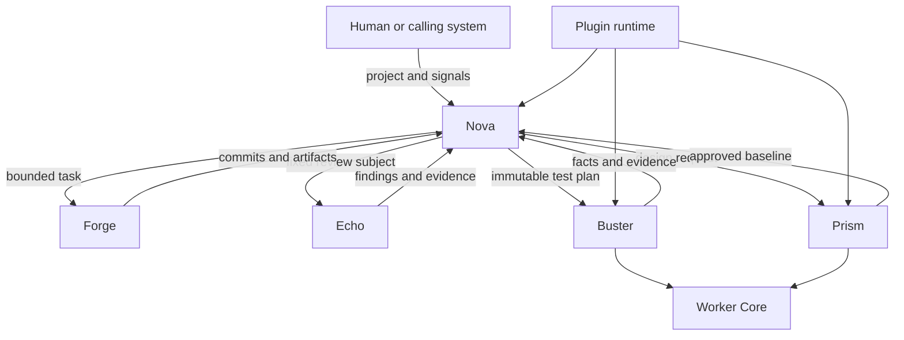

# Components and Authority

Status: implemented with stated limits
Audience: new reader, architecture reader, maintainer, security reviewer
Owner: platform architecture
Evidence: skills/nova/core; skills/worker/core; packaging/runtime/roles
Evidence revision: `85e73b1885f04a9494f388cf6622ad0bde2db447`
Applies to: current source and declared runtime roles
Last verified: source review on 2026-09-15

## Purpose

This page explains what each KubeClaw part does.
It also explains what each part must not do.

The boundary matters more than the component name.
Most serious failures occur when two parts believe that they own the same decision.

## Authority Map

Text version: A human gives the project and signals to Nova.
Nova delegates bounded work to Forge, Echo, Prism, and Buster.
All specialists return facts or artifacts to Nova.
Nova makes the canonical lifecycle decision.
Buster and Prism use Worker Core.
The plugin runtime loads declared extension points for each applicable role.

## Nova: The Process Authority

Nova owns the pipeline graph and the canonical run state.
It decides which stage is ready.
It starts bounded attempts and records their results.
It applies retry, wait, repair, cancellation, and terminal rules.

Nova does not own the meaning of every specialist operation.
For example, Buster knows how to execute a test plan.
Nova knows whether the verified test result blocks the pipeline.

**Why this design exists:** One writer makes recovery deterministic.
If two schedulers advanced the same run, replay could produce two different histories.

**Cost:** Nova is a central decision boundary.
Its durable state and recovery rules need careful protection.

**Reconsider when:** A future design can prove one ordered authority across multiple writers.
No current decision approves that change.

> **Source evidence — scheduling and closure**
>
> [`PipelineLoop.run()` selects ready stages, records decisions, pauses, and finalizes](https://github.com/datrab/kubeclaw/blob/85e73b1885f04a9494f388cf6622ad0bde2db447/skills/nova/core/execution/pipeline-loop.ts#L20-L37).
>
> [`PipelineLoop.#finalize()` derives one terminal result from stage states](https://github.com/datrab/kubeclaw/blob/85e73b1885f04a9494f388cf6622ad0bde2db447/skills/nova/core/execution/pipeline-loop.ts#L137-L143).
>
> [ADR-001 records the decision and its consequences](../decisions/core-and-plugins.md#adr-001-core-owns-canonical-lifecycle-authority).

## Foundation and SDK: The Shared Language

The Foundation package validates platform configuration, manifests, schemas, and package integrity.
It also provides isolation and durable observability mechanics.

The SDK defines the values that Core and plugins exchange.
Examples include a stage definition, a stage result, an effect request, and an artifact reference.

Foundation and SDK do not schedule the pipeline.
They provide rules and tools that several runtimes use.

**Why this design exists:** Shared contracts prevent each component from inventing a private message format.
They also permit validation before execution.

**Cost:** Contract changes require explicit version and compatibility work.

> **Source evidence — fixed registry**
>
> [`buildRegistry()` rejects duplicate packages, registrations, stage owners, and provider contracts](https://github.com/datrab/kubeclaw/blob/85e73b1885f04a9494f388cf6622ad0bde2db447/skills/common/plugin-runtime/foundation/registry/build.ts#L265-L317).
>
> [`activateRegistry()` loads only enabled registrations and checks package digests](https://github.com/datrab/kubeclaw/blob/85e73b1885f04a9494f388cf6622ad0bde2db447/skills/common/plugin-runtime/foundation/registry/activation.ts#L103-L137).
>
> [The versioned schema defines capability grants and trust scope](https://github.com/datrab/kubeclaw/blob/85e73b1885f04a9494f388cf6622ad0bde2db447/skills/common/plugin-runtime/contracts/plugin-system/v2/plugin-system-v2.schema.json#L894-L963).

## Worker Core: The Neutral Attempt Controller

Worker Core sits below specialist engines.
It does not decide whether a design is good or a test proves quality.

It handles mechanics that all workers need:

- worker identity and supported protocol;
- profiles and capacity;
- attempt and claim identity;
- queue and claim deadlines;
- duplicate-attempt rejection;
- cancellation and drain behavior;
- process limits and resource observations;
- durable attempt admission and result binding;
- cleanup state.

**Why this design exists:** Buster and Prism need the same safety controls.
Duplicated controls would drift and create different recovery behavior.

**Cost:** Specialist results must fit a neutral envelope.
Specialist policy cannot leak into Worker Core.

> **Source evidence — neutral controls**
>
> [`LocalWorkerRuntime.runAttempt()` checks readiness, capacity, claims, deadlines, protocols, profiles, and replay](https://github.com/datrab/kubeclaw/blob/85e73b1885f04a9494f388cf6622ad0bde2db447/skills/worker/core/worker/local-runtime.ts#L155-L204).
>
> [`executeNativeWorkerAttempt()` persists admission before launch and seals the result before delivery](https://github.com/datrab/kubeclaw/blob/85e73b1885f04a9494f388cf6622ad0bde2db447/skills/worker/core/worker/native-attempt-executor.ts#L20-L60).
>
> [ADR-002 explains the neutral-core decision](../decisions/core-and-plugins.md#adr-002-use-one-neutral-worker-core-below-specialist-engines).

## Buster: The Test Engine

Buster executes immutable test plans.
Its providers can run HTTP, browser, accessibility, performance, security, container, and Kubernetes checks.

Buster owns test execution semantics and evidence collection.
It does not own the canonical pipeline graph.
It does not convert test facts into Nova's final lifecycle verdict.

The Buster role contains Worker Core, the Buster engine, declared providers, and required adapters.
Nova sends a resolved plan and a read-only source snapshot.
Buster returns a result that remains bound to that plan and run.

**Why this design exists:** Test execution can evolve without adding provider logic to Nova.
Evidence also remains separate from quality policy.

**Cost:** The remote handoff needs strict identities, durable stores, and result import checks.

> **Source evidence — Buster boundary**
>
> [The Buster engine exports Worker Core, plan service, provider loader, and result stores](https://github.com/datrab/kubeclaw/blob/85e73b1885f04a9494f388cf6622ad0bde2db447/skills/buster/engine/src/index.ts#L1-L23).
>
> [The Buster role grants read-only source access and plan execution](https://github.com/datrab/kubeclaw/blob/85e73b1885f04a9494f388cf6622ad0bde2db447/packaging/runtime/roles/buster.json#L49-L59).
>
> [ADR-003 explains why test semantics stay outside Nova and Worker Core](../decisions/core-and-plugins.md#adr-003-keep-buster-test-semantics-outside-nova-and-worker-core).

## Prism: The Design Engine and Product Surface

Prism turns product constraints into a design document and a rendered baseline.
It keeps revisioned design state and supports human approval.

Prism can prepare Forge assignments and a Buster visual plan from an approved baseline.
It does not replace Nova's product architecture or pipeline authority.
It does not make Forge the owner of design approval.

Prism has source, a runtime-role manifest, native worker integration, services, and a Helm chart.
These facts prove implementation presence.
They do not prove deployment in each environment.

**Why this design exists:** Design decisions must remain inspectable before implementation changes the product.
An approved baseline also gives visual tests a stable comparison target.

**Cost:** Prism adds state, artifact, approval, and provenance boundaries.
Its current result path does not have Buster's Ed25519 artifact signature.

> **Source evidence — baseline handoff**
>
> [`toBusterPlan()` and `toForgeAssignments()` derive bounded handoffs from one baseline](https://github.com/datrab/kubeclaw/blob/85e73b1885f04a9494f388cf6622ad0bde2db447/skills/prism/pipeline-adapter/index.ts#L20-L57).
>
> [The Prism role includes Worker Core and the Prism engine](https://github.com/datrab/kubeclaw/blob/85e73b1885f04a9494f388cf6622ad0bde2db447/packaging/runtime/roles/prism.json#L1-L28).
>
> [Prism decisions explain design ownership and current limits](../decisions/prism.md).

## Forge: The Implementation Specialist

Forge is the specialist identity used for implementation work.
The current implementation-agent plugin dispatches that work through the runtime adapter.

Forge can receive a bounded task, use a workspace, produce commits, and return artifacts.
It cannot write Nova's lifecycle journal.
It cannot silently add a capability that the stage did not receive.

Forge is not a current runtime role manifest.
Its plugin can be present without being enabled in a given project.
Its configured runtime target can also be unreachable.

**Why this design exists:** The implementation specialist needs tools, but it must not receive scheduler authority.

> **Source evidence — Forge permissions**
>
> [The implementation stage declares dispatch, workspace, commit, merge, and artifact capabilities](https://github.com/datrab/kubeclaw/blob/85e73b1885f04a9494f388cf6622ad0bde2db447/skills/nova/plugins/implementation-agent/plugin.json#L1-L26).
>
> [`createPluginInvocationContext()` denies missing grants and checks each requested resource](https://github.com/datrab/kubeclaw/blob/85e73b1885f04a9494f388cf6622ad0bde2db447/skills/nova/core/execution/context.ts#L34-L79).

## Echo: The Review Specialist

Echo is the specialist identity used for agent-assisted review.
The review plugin sends a fixed review subject and receives proposed findings.

Echo can assess evidence and propose findings.
It cannot declare a verified revision, accept its own findings, or change lifecycle state.
Nova-owned code validates evidence and applies the configured policy.

Echo is not a current runtime role manifest.
The review package can be present while its stages remain disabled or unreachable.

**Why this design exists:** A creative reviewer can find subtle problems.
A deterministic boundary must still verify identity, evidence, and policy.

> **Source evidence — Echo permissions**
>
> [The review plugin declares three review stages and read-only repository access](https://github.com/datrab/kubeclaw/blob/85e73b1885f04a9494f388cf6622ad0bde2db447/skills/nova/plugins/review/plugin.json#L1-L54).
>
> [Echo decisions separate observations from lifecycle verdicts](../decisions/echo.md).

## The Plugin Runtime: The Controlled Connection Layer

A plugin package declares one or more registrations.
The registry knows these registration kinds:

| Kind | Purpose | Can change lifecycle state? |
| --- | --- | --- |
| Stage | Performs one graph step and returns a typed stage result. | No. Core interprets the result. |
| Observer | Receives committed events for telemetry or notification. | No. |
| Capability adapter | Performs a controlled external effect. | No. It returns a receipt. |
| Test provider | Performs one declared Buster test operation. | No. |
| Report adapter | Reads one declared report format and normalizes facts. | No. |
| OpenClaw extension | Connects OpenClaw hooks to a host integration. | No pipeline authority. |

Discovery means that the runtime found and validated a package declaration.
Registration means that the fixed registry contains its declared surface.
Activation means that configuration enabled one registration and loaded its executable.
Invocation means that an active stage reached that executable with a valid lease.

These are four different events.

**Why this design exists:** A manifest makes authority visible before code runs.
Separate platform grants let an operator reduce that requested authority.

**Cost:** Installation alone does nothing useful.
The operator must configure providers, grants, and reachable runtime targets.

## Runtime Role, Engine, and Specialist

These terms are related, but they are not synonyms.

| Term | Plain meaning | Current examples |
| --- | --- | --- |
| Runtime role | A declared package and plugin bundle for one deployable purpose. | Nova, Buster, Prism. |
| Engine | Code that interprets one class of work. | Nova lifecycle, Buster test plan, Prism design operation. |
| Specialist | A bounded worker identity used through dispatch. | Forge, Echo. |
| Plugin | A package that declares one or more extension registrations. | Implementation agent, review, artifact store. |

Role packaging decides what bytes can enter an image.
Registry activation decides what executable surfaces enter one run.
Capability grants decide what an invocation can request.
Network and service configuration decide what a running component can reach.

## How Authority Moves Through One Stage

1. The graph names a stage type and fixed limits.
2. The registry resolves exactly one package as the stage owner.
3. Platform configuration enables the required registration and adapters.
4. Core creates an attempt identity and a revocable lease.
5. The context contains only granted capabilities and visible artifacts.
6. The plugin requests effects through that context.
7. Adapters perform permitted effects and return durable receipts.
8. The plugin returns a typed stage result.
9. Core maps that result to one lifecycle action.

The plugin never receives a direct method that changes the canonical stage state.

## Read Next

- [Request, State, and Recovery](request-state-recovery.md) follows these boundaries through a complete run.
- [Deployment and Trust](deployment-and-trust.md) maps them to pods, identities, networks, and stores.
- [Plugin catalogue](../extend/plugin-catalogue/README.md) lists discovered extension packages.
- [Decisions](../decisions/README.md) preserves the detailed reasons and rejected alternatives.
