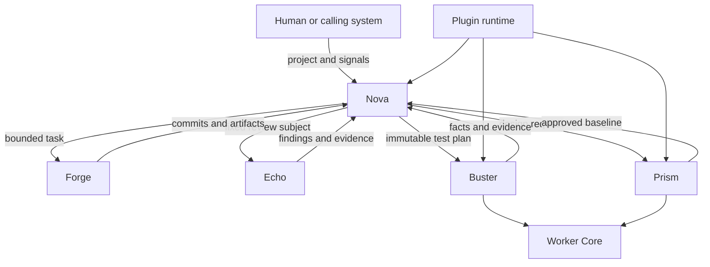
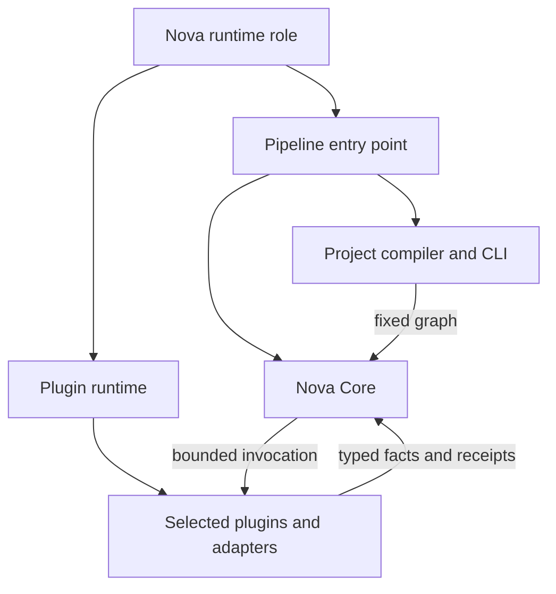
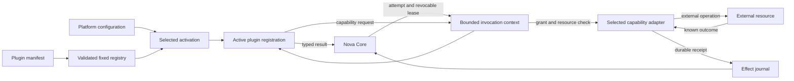

# Components and Authority

Status: implemented with stated limits
Audience: new reader, architecture reader, maintainer, security reviewer
Owner: platform architecture
Evidence: skills/nova/core; skills/worker/core; packaging/runtime/roles
Evidence revision: `85e73b1885f04a9494f388cf6622ad0bde2db447`
Applies to: current source and declared runtime roles
Last verified: source and contract inspection on 2026-09-19

## Purpose

This page explains what each KubeClaw part does.
It also explains what each part must not do.

The boundary matters more than the component name.
Most serious failures occur when two parts believe that they own the same decision.

## Authority Map

Text version: A human gives the project and signals to Nova.
Nova delegates bounded work to Forge, Echo, Prism, and Buster.
All specialists return facts or artifacts to Nova.
Nova makes the canonical lifecycle decision.
Buster and Prism use Worker Core.
The plugin runtime loads declared extension points for each applicable role.

## Nova and Nova Core

Nova and Nova Core are related, but they are not two names for the same thing.

**Nova** is the complete runtime role.
It is the process that an operator deploys and starts.
The role contains Nova Core, the project compiler, shared contracts, and selected plugins.
It also contains adapters for repositories, artifacts, dispatch, waits, secrets, telemetry, and transport.

**Nova Core** is the deterministic control engine inside that role.
Core owns graph execution, lifecycle state, effects, recovery, waits, and final run closure.
Core starts without product-specific stages.
The configured plugin registry supplies those stages and their bounded capabilities.

This distinction prevents two common mistakes.
A Nova deployment is not only the scheduler code.
Installing a Nova plugin also does not make that plugin part of Core.

Text version: The Nova role contains the entry point, project compiler, Nova Core, plugin runtime, and selected extensions.
The compiler gives Core a fixed graph.
Core invokes plugins and interprets their typed results.

> **Source evidence — role and engine boundary**
>
> [The Nova role lists Core, project code, shared contracts, and its selected plugins](https://github.com/datrab/kubeclaw/blob/85e73b1885f04a9494f388cf6622ad0bde2db447/packaging/runtime/roles/nova.json#L1-L61).
>
> [The Nova entry point exports Core and starts the separate project CLI](https://github.com/datrab/kubeclaw/blob/85e73b1885f04a9494f388cf6622ad0bde2db447/skills/nova/pipeline.ts#L1-L14).
>
> [A new Core run freezes the graph, prepares plugins, writes snapshots, and starts the runner](https://github.com/datrab/kubeclaw/blob/85e73b1885f04a9494f388cf6622ad0bde2db447/skills/nova/core/execution/engine-run.ts#L36-L43).

### Nova Core: The Process Authority

Nova owns the pipeline graph and the canonical run state.
It decides which stage is ready.
It starts bounded attempts and records their results.
It applies retry, wait, repair, cancellation, and terminal rules.

Nova does not own the meaning of every specialist operation.
For example, Buster knows how to execute a test plan.
Nova knows whether the verified test result blocks the pipeline.

**Why this design exists:** One writer makes recovery deterministic.
If two schedulers advanced the same run, replay could produce two different histories.

**Cost:** Nova is a central decision boundary.
Its durable state and recovery rules need careful protection.

**Reconsider when:** A future design can prove one ordered authority across multiple writers.
No current decision approves that change.

> **Source evidence — scheduling and closure**
>
> [`PipelineLoop.run()` selects ready stages, records decisions, pauses, and finalizes](https://github.com/datrab/kubeclaw/blob/85e73b1885f04a9494f388cf6622ad0bde2db447/skills/nova/core/execution/pipeline-loop.ts#L20-L37).
>
> [`PipelineLoop.#finalize()` derives one terminal result from stage states](https://github.com/datrab/kubeclaw/blob/85e73b1885f04a9494f388cf6622ad0bde2db447/skills/nova/core/execution/pipeline-loop.ts#L137-L143).
>
> [ADR-001 records the decision and its consequences](../decisions/core-and-plugins.md#adr-001-core-owns-canonical-lifecycle-authority).

## Foundation and SDK: The Shared Language

The Foundation package validates platform configuration, manifests, schemas, and package integrity.
It also provides isolation and durable observability mechanics.

The SDK defines the values that Core and plugins exchange.
Examples include a stage definition, a stage result, an effect request, and an artifact reference.

Foundation and SDK do not schedule the pipeline.
They provide rules and tools that several runtimes use.

**Why this design exists:** Shared contracts prevent each component from inventing a private message format.
They also permit validation before execution.

**Cost:** Contract changes require explicit version and compatibility work.

> **Source evidence — fixed registry**
>
> [`buildRegistry()` rejects duplicate packages, registrations, stage owners, and provider contracts](https://github.com/datrab/kubeclaw/blob/85e73b1885f04a9494f388cf6622ad0bde2db447/skills/common/plugin-runtime/foundation/registry/build.ts#L265-L317).
>
> [`activateRegistry()` loads only enabled registrations and checks package digests](https://github.com/datrab/kubeclaw/blob/85e73b1885f04a9494f388cf6622ad0bde2db447/skills/common/plugin-runtime/foundation/registry/activation.ts#L103-L137).
>
> [The versioned schema defines capability grants and trust scope](https://github.com/datrab/kubeclaw/blob/85e73b1885f04a9494f388cf6622ad0bde2db447/skills/common/plugin-runtime/contracts/plugin-system/v2/plugin-system-v2.schema.json#L894-L963).

## Worker Core: The Neutral Attempt Controller

Worker Core sits below specialist engines.
It does not decide whether a design is good or a test proves quality.

It handles mechanics that all workers need:

- worker identity and supported protocol;
- profiles and capacity;
- attempt and claim identity;
- queue and claim deadlines;
- duplicate-attempt rejection;
- cancellation and drain behavior;
- process limits and resource observations;
- durable attempt admission and result binding;
- cleanup state.

**Why this design exists:** Buster and Prism need the same safety controls.
Duplicated controls would drift and create different recovery behavior.

**Cost:** Specialist results must fit a neutral envelope.
Specialist policy cannot leak into Worker Core.

> **Source evidence — neutral controls**
>
> [`LocalWorkerRuntime.runAttempt()` checks readiness, capacity, claims, deadlines, protocols, profiles, and replay](https://github.com/datrab/kubeclaw/blob/85e73b1885f04a9494f388cf6622ad0bde2db447/skills/worker/core/worker/local-runtime.ts#L155-L204).
>
> [`executeNativeWorkerAttempt()` persists admission before launch and seals the result before delivery](https://github.com/datrab/kubeclaw/blob/85e73b1885f04a9494f388cf6622ad0bde2db447/skills/worker/core/worker/native-attempt-executor.ts#L20-L60).
>
> [ADR-002 explains the neutral-core decision](../decisions/core-and-plugins.md#adr-002-use-one-neutral-worker-core-below-specialist-engines).

## Buster: The Test Engine

Buster executes immutable test plans.
Its providers can run HTTP, browser, accessibility, performance, security, container, and Kubernetes checks.

Buster owns test execution semantics and evidence collection.
It does not own the canonical pipeline graph.
It does not convert test facts into Nova's final lifecycle verdict.

The Buster role contains Worker Core, the Buster engine, declared providers, and required adapters.
Nova sends a resolved plan and a read-only source snapshot.
Buster returns a result that remains bound to that plan and run.

**Why this design exists:** Test execution can evolve without adding provider logic to Nova.
Evidence also remains separate from quality policy.

**Cost:** The remote handoff needs strict identities, durable stores, and result import checks.

> **Source evidence — Buster boundary**
>
> [The Buster engine exports Worker Core, plan service, provider loader, and result stores](https://github.com/datrab/kubeclaw/blob/85e73b1885f04a9494f388cf6622ad0bde2db447/skills/buster/engine/src/index.ts#L1-L23).
>
> [The Buster role grants read-only source access and plan execution](https://github.com/datrab/kubeclaw/blob/85e73b1885f04a9494f388cf6622ad0bde2db447/packaging/runtime/roles/buster.json#L49-L59).
>
> [ADR-003 explains why test semantics stay outside Nova and Worker Core](../decisions/core-and-plugins.md#adr-003-keep-buster-test-semantics-outside-nova-and-worker-core).

## Prism: The Design Engine and Product Surface

Prism turns product constraints into a design document and a rendered baseline.
It keeps revisioned design state and supports human approval.

Prism can prepare Forge assignments and a Buster visual plan from an approved baseline.
It does not replace Nova's product architecture or pipeline authority.
It does not make Forge the owner of design approval.

Prism has source, a runtime-role manifest, native worker integration, services, and a Helm chart.
These facts prove implementation presence.
They do not prove deployment in each environment.

**Why this design exists:** Design decisions must remain inspectable before implementation changes the product.
An approved baseline also gives visual tests a stable comparison target.

**Cost:** Prism adds state, artifact, approval, and provenance boundaries.
Its current result path does not have Buster's Ed25519 artifact signature.

> **Source evidence — baseline handoff**
>
> [`toBusterPlan()` and `toForgeAssignments()` derive bounded handoffs from one baseline](https://github.com/datrab/kubeclaw/blob/85e73b1885f04a9494f388cf6622ad0bde2db447/skills/prism/pipeline-adapter/index.ts#L20-L57).
>
> [The Prism role includes Worker Core and the Prism engine](https://github.com/datrab/kubeclaw/blob/85e73b1885f04a9494f388cf6622ad0bde2db447/packaging/runtime/roles/prism.json#L1-L28).
>
> [Prism decisions explain design ownership and current limits](../decisions/prism.md).

## Forge: The Implementation Specialist

Forge is the specialist identity used for implementation work.
The current implementation-agent plugin dispatches that work through the runtime adapter.

Forge can receive a bounded task, use a workspace, produce commits, and return artifacts.
It cannot write Nova's lifecycle journal.
It cannot silently add a capability that the stage did not receive.

Forge is not a current runtime role manifest.
Its plugin can be present without being enabled in a given project.
Its configured runtime target can also be unreachable.

**Why this design exists:** The implementation specialist needs tools, but it must not receive scheduler authority.

> **Source evidence — Forge permissions**
>
> [The implementation stage declares dispatch, workspace, commit, merge, and artifact capabilities](https://github.com/datrab/kubeclaw/blob/85e73b1885f04a9494f388cf6622ad0bde2db447/skills/nova/plugins/implementation-agent/plugin.json#L1-L26).
>
> [`createPluginInvocationContext()` denies missing grants and checks each requested resource](https://github.com/datrab/kubeclaw/blob/85e73b1885f04a9494f388cf6622ad0bde2db447/skills/nova/core/execution/context.ts#L34-L79).

## Echo: The Review Specialist

Echo is the specialist identity used for agent-assisted review.
The review plugin sends a fixed review subject and receives proposed findings.

Echo can assess evidence and propose findings.
It cannot declare a verified revision, accept its own findings, or change lifecycle state.
Nova-owned code validates evidence and applies the configured policy.

Echo is not a current runtime role manifest.
The review package can be present while its stages remain disabled or unreachable.

**Why this design exists:** A creative reviewer can find subtle problems.
A deterministic boundary must still verify identity, evidence, and policy.

> **Source evidence — Echo permissions**
>
> [The review plugin declares three review stages and read-only repository access](https://github.com/datrab/kubeclaw/blob/85e73b1885f04a9494f388cf6622ad0bde2db447/skills/nova/plugins/review/plugin.json#L1-L54).
>
> [Echo decisions separate observations from lifecycle verdicts](../decisions/echo.md).

## The Plugin Runtime: The Controlled Connection Layer

A plugin package declares one or more registrations.
The registry knows these registration kinds:

| Kind | Purpose | Can change lifecycle state? |
| --- | --- | --- |
| Stage | Performs one graph step and returns a typed stage result. | No. Core interprets the result. |
| Observer | Receives committed events for telemetry or notification. | No. |
| Capability adapter | Performs a controlled external effect. | No. It returns a receipt. |
| Test provider | Performs one declared Buster test operation. | No. |
| Report adapter | Reads one declared report format and normalizes facts. | No. |
| OpenClaw extension | Connects OpenClaw hooks to a host integration. | No pipeline authority. |

Discovery means that the runtime found and validated a package declaration.
Registration means that the fixed registry contains its declared surface.
Activation means that configuration enabled one registration and loaded its executable.
Invocation means that an active stage reached that executable with a valid lease.

These are four different events.

**Why this design exists:** A manifest makes authority visible before code runs.
Separate platform grants let an operator reduce that requested authority.

**Cost:** Installation alone does nothing useful.
The operator must configure providers, grants, and reachable runtime targets.

## Runtime Role, Engine, and Specialist

These terms are related, but they are not synonyms.

| Term | Plain meaning | Current examples |
| --- | --- | --- |
| Runtime role | A declared package and plugin bundle for one deployable purpose. | Nova, Buster, Prism. |
| Engine | Code that interprets one class of work. | Nova lifecycle, Buster test plan, Prism design operation. |
| Specialist | A bounded worker identity used through dispatch. | Forge, Echo. |
| Plugin | A package that declares one or more extension registrations. | Implementation agent, review, artifact store. |

Role packaging decides what bytes can enter an image.
Registry activation decides what executable surfaces enter one run.
Capability grants decide what an invocation can request.
Network and service configuration decide what a running component can reach.

## How Authority Moves Through One Stage

Text version: The manifest enters a validated registry.
Platform configuration selects registrations from that registry for activation.
Nova gives an active plugin one attempt and one revocable lease through a bounded context.
The plugin returns a typed result to Nova.
For an external operation, the plugin must request a capability through the same context.
The context checks the grant and the requested resource before it calls the selected adapter.
The adapter performs the operation and records its known outcome as a durable receipt.
Nova uses the typed result and durable evidence to make the lifecycle decision.

1. The graph names a stage type and fixed limits.
2. The registry resolves exactly one package as the stage owner.
3. Platform configuration enables the required registration and adapters.
4. Core creates an attempt identity and a revocable lease.
5. The context contains only granted capabilities and visible artifacts.
6. The plugin requests effects through that context.
7. Adapters perform permitted effects and return durable receipts.
8. The plugin returns a typed stage result.
9. Core maps that result to one lifecycle action.

The plugin never receives a direct method that changes the canonical stage state.

> **Source evidence — bounded plugin invocation**
>
> [`activateRegistry()` activates only configured registrations after package-integrity and import checks](https://github.com/datrab/kubeclaw/blob/85e73b1885f04a9494f388cf6622ad0bde2db447/skills/common/plugin-runtime/foundation/registry/activation.ts#L103-L137).
>
> [`createPluginInvocationContext()` checks the lease, grant, and requested resource](https://github.com/datrab/kubeclaw/blob/85e73b1885f04a9494f388cf6622ad0bde2db447/skills/nova/core/execution/context.ts#L34-L79).
>
> [`DurableInvocation` records requests and receipts around the selected adapter](https://github.com/datrab/kubeclaw/blob/85e73b1885f04a9494f388cf6622ad0bde2db447/skills/nova/core/effects/durable-invocation.ts#L39-L117).

## Failure Domains And Stop Boundaries

A component boundary must also be a failure boundary.
One failed dependency must not silently move authority to another component.

| Failure domain | Direct dependency | Authoritative retained data | Safe response | Forbidden response |
| --- | --- | --- | --- | --- |
| Project compilation | Project document, repository layout, and fixed source revision | Validated project input and compiled graph | Reject the input before a run starts | Guess a revision, path, module, or graph edge |
| Nova process | Durable run root and immutable package bytes | Graph snapshot, registry snapshot, lifecycle journal, signals, and effect records | Recover from the recorded history with the same identities | Continue from process memory or current package bytes |
| Plugin registry | Installed manifests, schemas, package roots, and trust configuration | Canonical package and registration identities with digests | Reject discovery, admission, conflict, or activation as a startup error | Import unvalidated code or select a registration by load order |
| Capability adapter | Selected provider, grant, resource constraint, and external service | Effect request, idempotency key, acceptance state, and receipt | Recover the receipt or stop for reconciliation | Repeat an accepted effect because its response was lost |
| Redis transport | Redis availability, stream policy, and authenticated callers | Transport records and the component's own durable control state | Retry transport delivery within its contract; recover authority from the owning store | Treat Redis delivery as the canonical lifecycle decision |
| Buster service | Immutable plan, source snapshot, providers, Worker Core, and result store | Remote job status, complete plan result, evidence identities, and import record | Resume or import only after identity and terminal-result checks | Convert transport completion directly into a quality verdict |
| Worker host | Profile, capacity pool, trusted supervisor, engine, and persistent attempt stores | Admission, claim, ownership, journal, output spool, observations, cleanup, and sealed result | Reconcile ownership and process state; stop when either remains uncertain | Launch a replacement attempt while an earlier process can still run |
| Prism service | PostgreSQL, artifact storage, Worker Core, and approved design identities | Projects, revisions, operations, approvals, bundles, and immutable artifacts | Recover canonical records and rebuild only declared projections | Treat a preview, editor state, or local receipt as canonical approval |
| Git or artifact storage | Repository or object-store availability and exact identity | Commit identity or artifact digest, namespace, size, and producer | Stop or recover the exact object before dependent work continues | Substitute a newer commit or an object with the same display name |
| Observer or telemetry sink | Event subscription, delivery policy, and sink | Core journal plus observer-owned checkpoint and delivery evidence | Preserve lifecycle truth and expose degraded or exhausted delivery | Reconstruct lifecycle state from a dashboard or notification |
| Kubernetes and required services | Scheduling, storage, DNS, identities, registries, BuildKit, databases, and configured network paths | Component-owned persistent volumes and external service stores | Stop the affected operation and preserve diagnostic evidence | Claim platform readiness from manifests or local source checks alone |

The table separates three questions.
A dependency can transport data, store authority, or present a projection.
Those roles are not interchangeable.

## Data Authority And Derived Copies

| Data | Canonical owner | Permitted copies or projections | Required identity check |
| --- | --- | --- | --- |
| Compiled pipeline graph | Nova run snapshot | Operator display and audit read model | Run ID and graph digest |
| Lifecycle state | Nova lifecycle journal and reducer | Status page, notification, telemetry, and audit projection | Run, stage, attempt, event sequence, and schema version |
| Plugin selection | Frozen registry and package snapshot | Catalogue and activation diagnostics | Package ID, version, content digest, registration ID, and API version |
| External effect outcome | Adapter receipt in the effect journal | Stage evidence and recovery diagnostics | Effect ID, idempotency key, owner attempt, capability, and resource |
| Human or orchestrator response | Accepted resume-signal record | Resolved-wait lifecycle event | Wait, signal, issuer, issue time, and idempotency identity |
| Worker attempt fact | Worker journal, ownership state, and sealed terminal result | Buster or Prism specialist result | Attempt, claim generation, engine, profile, protocol, result digest, and transport identity |
| Test-plan result | Buster result store | Nova import record, report, and operator view | Job, plan, run, source, request, result, and evidence digests |
| Design state | Prism PostgreSQL records and immutable artifact objects | Studio projection, preview, export, Forge assignment, and Buster plan | Project, design, revision, operation, approval, bundle, and artifact identities |
| Source state | Git object database and authorized workspace | Source archive, diff, review bundle, and build context | Repository identity and immutable commit digest |
| Large evidence | Artifact store | Report attachment and bounded display summary | Artifact ID, namespace, digest, size, and producer attempt |

## Communication, Persistence, And Retention Map

This table lists each communication path that crosses a component boundary in
the documented platform baseline. It does not list private calls inside one
component. A later implementation can replace a transport only if it preserves
the contract, authority, persistence, and failure behavior in the same row.

| Producer | Consumer | Contract or message | Transport | Authoritative persistence | Retention or cleanup owner | Effect of a failed handoff |
| --- | --- | --- | --- | --- | --- | --- |
| Project author or automation | Nova project compiler | `nova-project.v2`, referenced control files, and the selected source revision | CLI arguments and local files | Admitted project input, compiled graph, and source identity in the run root | Nova run-root policy | Compilation stops before execution. Nova does not guess a missing file, revision, or graph value. |
| Nova Core | Stage plugin | Resolved stage input, attempt lease, limits, grants, and typed stage result | In-process call for trusted code; bounded child protocol for an external stage | Nova lifecycle journal, plugin-state journal, effect journal, and artifacts | Nova run owner and artifact-store policy | The attempt fails, times out, or stops for reconciliation. A returned result cannot directly change lifecycle state. |
| Stage or observer plugin | Capability adapter | Capability, operation, canonical resource, payload, effect identity, and fence | Bounded host context; external plugins relay requests through the isolated protocol | Effect request, acceptance, receipt, and resource-lock record | Nova effect and lock-store policy | Authority is denied before the adapter, or recovery stops if an accepted effect has no known result. |
| Nova Core | Observer plugin | Ordered lifecycle or plugin-domain event with run and sequence identity | Observer invocation through the admitted registry | Core journal plus observer delivery attempts and checkpoints | Core retains the event; observer policy retains or expires delivery evidence | Required-observer exhaustion fails the flush. Optional-observer failure records a visible gap without rewriting lifecycle truth. |
| Nova test gate | Buster remote-plan service | Immutable plan job, source snapshot identity, status, result, and evidence digests | Authenticated HTTP or loopback HTTP behind the SPIFFE proxy | Nova dispatch/import stores and Buster job/result stores | Nova owns import records; Buster owns jobs, results, and evidence | Nova retries only declared transport failures. It reconciles the same job identity before a new dispatch. |
| Buster or Prism runtime | Worker Core | Worker envelope, profile, claim, cancellation, progress, logs, evidence, and terminal result | Local runtime call or a role-owned remote transport | Worker attempt journal, ownership store, output spool, and result seal | Worker host policy and the calling role's result policy | Admission rejects before launch, or recovery fences new work until ownership and process state are safe. |
| Trusted native supervisor | Unprivileged specialist host | Length-bounded envelope, framed control messages, cancellation, and provisional result | Standard input/output plus a private framed control endpoint | Supervisor-owned journal, spool, ownership record, observations, and final seal | Native worker host policy | The supervisor terminates and drains the process tree. It does not accept a result while control requests remain unsettled. |
| Redis transport adapter | Redis and an external consumer | `transport.publish` or `telemetry.emit` payload plus idempotency identity | RESP over `redis:` or TLS-protected `rediss:` | Redis stream and deduplication key; lifecycle authority stays in Nova | Redis stream length and deduplication TTL from platform configuration | Delivery can retry within adapter policy. Redis loss cannot create or change a lifecycle decision. |
| Source-capable stage or service | Git repository and isolated workspace | Repository identity, immutable revision, allowed path, commit, merge, or sync request | Git process through the selected capability adapter | Git object database; Nova stores the accepted commit identity | Repository owner and workspace-cleanup policy | The operation stops on identity or path mismatch. Recovery does not substitute the current branch head. |
| Buster container-build provider | BuildKit and OCI registry | Bounded build context, Dockerfile, platform, image reference, and digest-bearing result | BuildKit API and OCI registry protocol | BuildKit cache is derived; registry content digest is the image authority | BuildKit cache policy and registry retention policy | The suite reports an execution error or failed check. It does not treat a local cache hit as a published image. |
| Prism services | PostgreSQL and artifact storage | Projects, revisions, operations, approvals, retrieval records, bundles, and artifact identities | PostgreSQL protocol and artifact capability calls | PostgreSQL owns relational design state; artifact storage owns immutable bytes | Prism database and artifact retention policy | Prism stops the affected operation. It can rebuild a declared projection, but it cannot recreate an approval from a preview. |
| Private service | Authorized remote user or test client | Service-specific HTTP route | Kubernetes Service plus Tailscale exposure when the declared path needs private external access | The service store remains authoritative; Tailscale stores connectivity state only | Service owner and Tailscale operator | The service can remain healthy while the route is unavailable. Route recovery must not replay product work. |
| Helm or Argo CD owner | Kubernetes API | Rendered Kubernetes objects and declared ownership labels | Kubernetes API | Kubernetes stores desired and observed object state; component stores retain product truth | The selected deployment owner | Reconciliation stops or reports drift. Direct Helm and Argo CD must not control the same object set. |
| Runtime and platform exporters | Monitoring stack | Metrics, logs, and traces with correlation identity | Scrape, log, or trace protocol selected by the deployment | Monitoring storage is a diagnostic projection | Monitoring retention policy | Loss reduces visibility. It does not change the run, attempt, effect, or approval state. |

> **Source evidence — component-boundary communication**
>
> [Nova dispatches a resolved attempt through one bounded stage context](https://github.com/datrab/kubeclaw/blob/4f089958db97a551f406c157d774bda143a38946/skills/nova/core/execution/stage-executor.ts#L31-L119).
>
> [The remote-plan transport binds HTTP jobs, results, and evidence to stable identities](https://github.com/datrab/kubeclaw/blob/4f089958db97a551f406c157d774bda143a38946/skills/nova/core/test-gates/remote-dispatch.ts#L23-L197).
>
> [Observer delivery records attempts and advances provenance-bound checkpoints](https://github.com/datrab/kubeclaw/blob/4f089958db97a551f406c157d774bda143a38946/skills/nova/core/telemetry/observers.ts#L14-L106).
>
> [The Redis adapter publishes with a stream bound and a deduplication key](https://github.com/datrab/kubeclaw/blob/4f089958db97a551f406c157d774bda143a38946/skills/common/plugins/redis-transport/src/adapter.ts#L14-L91).
>
> [Worker Core binds specialist work to the generic execution hooks](https://github.com/datrab/kubeclaw/blob/4f089958db97a551f406c157d774bda143a38946/skills/worker/core/worker/attempt-executor.ts#L30-L106).
>
> **Limit:** The table proves source-level contracts and ownership. Deployment-specific retention periods and live reachability still require the target environment's configuration and acceptance evidence.

**Why this design exists:** Recovery needs one answer for each fact.
A cache or transport copy can disappear without changing the fact's owner.

**Cost:** Each handoff needs explicit identities and duplicate checks.
The system stops when it cannot prove that two copies describe the same fact.

**Rejected alternative:** A shared database or message bus does not become one
universal authority merely because several components can read it.

> **Source evidence — retained authority across boundaries**
>
> [Nova writes graph and registry snapshots before execution](https://github.com/datrab/kubeclaw/blob/d8c38328ae305d431574aed008c4e1333e4b49f5/skills/nova/core/execution/engine-run.ts#L36-L43).
>
> [The effect path records a request before invocation and records the returned receipt](https://github.com/datrab/kubeclaw/blob/d8c38328ae305d431574aed008c4e1333e4b49f5/skills/nova/core/effects/durable-invocation.ts#L88-L117).
>
> [Nova verifies a terminal Buster result and its evidence before import](https://github.com/datrab/kubeclaw/blob/d8c38328ae305d431574aed008c4e1333e4b49f5/skills/nova/core/test-gates/remote-result-import.ts#L213-L247).
>
> [Worker Core writes admission before launch and seals the result before delivery](https://github.com/datrab/kubeclaw/blob/d8c38328ae305d431574aed008c4e1333e4b49f5/skills/worker/core/worker/native-attempt-executor.ts#L20-L60).
>
> **Limit:** These source paths prove ordering and validation in the inspected implementation. They do not prove storage durability or service availability in a live environment.

## Read Next

- [Request, State, and Recovery](request-state-recovery.md) follows these boundaries through a complete run.
- [Nova Core](nova-core.md) gives the detailed lifecycle, scheduling, effect, recovery, and audit model.
- [Plugin Runtime](plugin-runtime.md) gives the detailed package, registry, grant, activation, and isolation model.
- [Worker Core](worker-core.md) gives the detailed claim, process, resource, journal, ownership, and result model.
- [Deployment and Trust](deployment-and-trust.md) maps them to pods, identities, networks, and stores.
- [Plugin catalogue](../extend/plugin-catalogue/README.md) lists discovered extension packages.
- [Decisions](../decisions/README.md) preserves the detailed reasons and rejected alternatives.
