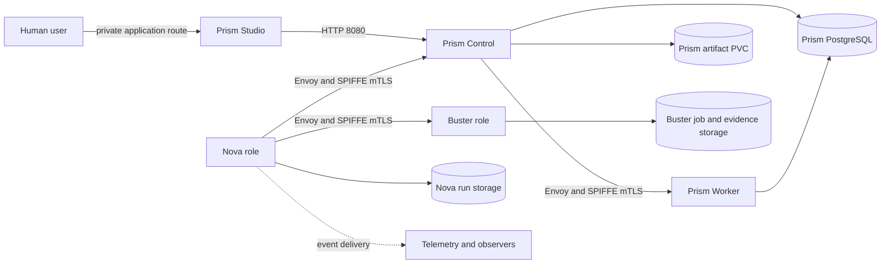
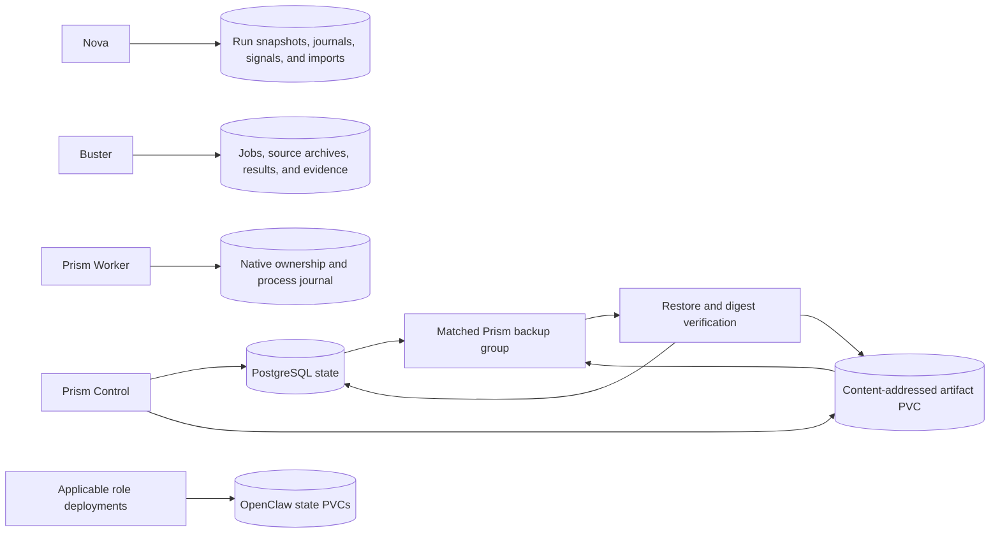

# Deployment and Trust

Status: implemented design; live acceptance remains separate
Audience: operator, architecture reader, security reviewer, maintainer
Owner: platform architecture and operations
Evidence: packaging/runtime/roles; charts/kubeclaw; charts/prism
Evidence revision: `85e73b1885f04a9494f388cf6622ad0bde2db447`
Applies to: current Helm charts and runtime-role declarations
Last verified: source review on 2026-09-15

## Purpose

This page maps the software boundaries to running workloads.
It explains identity, network, storage, permissions, observability, and failure domains.

It does not treat supporting services as an unnamed infrastructure box.
[Pipeline Dependencies](pipeline-dependencies.md) explains the Git, Redis, PostgreSQL, BuildKit, registry, mirror, and Tailscale paths.
[Platform and Operations Architecture](platform-and-operations.md) explains K3s, Cilium, Argo CD, and the optional Ops Pod.

A rendered chart proves intended Kubernetes resources.
It does not prove that a live cluster applies or enforces them.
Use the linked operations checks for that proof.

## Deployment Map



Text version: Nova calls Buster and Prism Control through authenticated worker routes.
Prism Studio calls Prism Control through the application route.
Prism Control calls Prism Worker through another authenticated worker route.
Nova, Buster, and Prism keep different durable stores.
Observers receive committed events after Nova writes them.

## Runtime Roles and Workloads

A runtime role is a packaging boundary.
It declares the packages and plugins available to one purpose.

| Role or workload | Main responsibility | Included authority | Excluded authority |
| --- | --- | --- | --- |
| Nova role | Compile and control pipeline runs. | Lifecycle state, stage leases, configured adapters. | Worker execution semantics and specialist judgment. |
| Buster role | Run fixed test plans. | Test providers, evidence, Worker Core controls. | Canonical pipeline decisions. |
| Prism role | Host the OpenClaw Prism integration. | Prism engine and selected shared adapters. | Nova lifecycle authority. |
| Prism Control | Own Prism operations and durable application state. | Revision, operation, approval, and artifact coordination. | Native host process authority. |
| Prism Worker | Run bounded native Prism operations. | Worker Core attempt and process controls. | Product approval and public entry. |
| Prism Studio | Give humans the application interface. | User-facing requests through Control. | Direct database or worker authority. |
| Prism Ingestion | Fetch and quarantine optional external input. | Narrow outbound fetch path. | Control state ownership. |
| PostgreSQL | Store Prism relational state. | Database persistence only. | Pipeline and product decisions. |

Forge and Echo do not appear as current role manifests.
Nova reaches them through configured runtime dispatch.
Their actual process location depends on that runtime configuration.

> **Source evidence — package boundaries**
>
> [Nova role declaration](https://github.com/datrab/kubeclaw/blob/85e73b1885f04a9494f388cf6622ad0bde2db447/packaging/runtime/roles/nova.json#L1-L61), [Buster role declaration](https://github.com/datrab/kubeclaw/blob/85e73b1885f04a9494f388cf6622ad0bde2db447/packaging/runtime/roles/buster.json#L1-L60), and [Prism role declaration](https://github.com/datrab/kubeclaw/blob/85e73b1885f04a9494f388cf6622ad0bde2db447/packaging/runtime/roles/prism.json#L1-L28).
>
> **Decision record:** [ADR-012 explains role-specific immutable bundles](../decisions/core-and-plugins.md#adr-012-assemble-exact-role-specific-runtime-bundles).

## Why Role Bundles Exist

A single large image could contain every engine and plugin.
That image would make accidental authority easier and review harder.

Role bundles make the intended content explicit.
Nova does not need the Buster engine to control a Buster job.
Buster does not need Nova Core to execute a test provider.

The bundle is only the first limit.
Activation selects a smaller set of registrations.
Capability grants reduce each invocation again.
Network policy and workload identity limit process-to-process access.

These limits overlap on purpose.
One incorrect setting must not silently grant every other permission.

## Four Independent Trust Questions

Before one component trusts another, it asks four questions.

1. **Who connected?** SPIFFE gives the workload an identity.
2. **Was the route protected?** Envoy authenticates and encrypts the connection with mutual TLS.
3. **May this identity call this service?** Worker code checks the exact expected SPIFFE ID.
4. **Can packets reach the port?** Kubernetes NetworkPolicy limits pods, namespaces, and ports.

Nova-to-Buster source transfer adds another question:
does this archive match the source identity that Nova signed?

**Why this design exists:** Network location is not an identity.
A pod IP can change, and another pod can exist in the same namespace.

**Cost:** SPIRE, its CSI driver, Envoy configuration, and network-policy enforcement become service dependencies.
Protected routes fail closed when those dependencies fail.

> **Source evidence — application identity check**
>
> [Worker Core parses and authorizes proxied SPIFFE identities](https://github.com/datrab/kubeclaw/blob/85e73b1885f04a9494f388cf6622ad0bde2db447/skills/worker/core/worker/trust.ts#L1-L52).
>
> [Prism workloads receive separate trusted caller identities](https://github.com/datrab/kubeclaw/blob/85e73b1885f04a9494f388cf6622ad0bde2db447/charts/prism/templates/workloads.yaml#L127-L138).
>
> [Worker Trust gives the complete certificate and proxy path](worker-trust.md).

## Identity Boundaries

Each Prism workload has its own Kubernetes ServiceAccount.
The chart disables automatic service-account token mounting.
SPIRE derives the workload identity from namespace and ServiceAccount.

The expected identity has this form:

```text
spiffe://kubeclaw.internal/ns/<namespace>/sa/<service-account>
```

The application cannot select another identity through a normal environment variable.
Envoy receives the short-lived certificate from the SPIRE Workload API.

Human identity remains separate.
Keycloak can authenticate a human and supply application roles.
It does not provide a workload identity or artifact signature.

> **Source evidence — separate service accounts**
>
> [The Prism chart creates Control, Studio, Worker, Ingestion, Backup, and test-runner accounts](https://github.com/datrab/kubeclaw/blob/85e73b1885f04a9494f388cf6622ad0bde2db447/charts/prism/templates/serviceaccounts.yaml#L1-L7).

## Network Boundaries

The Prism chart first denies ingress and egress for its named workloads.
It then adds only the required paths.

Important paths include:

| Caller | Destination | Port or route | Purpose |
| --- | --- | --- | --- |
| Prism Studio | Prism Control | HTTP 8080 | Human application actions. |
| Nova | Prism Control | mTLS service 8443 when enabled | Design and pipeline operations. |
| Prism Control | Prism Worker | mTLS service 8443 when enabled | Bounded native operation. |
| Prism Control and Worker | PostgreSQL | TCP 5432 | Prism state. |
| Prism Control | Prism Ingestion | HTTP 8080 | Optional controlled ingestion. |
| Nova | Buster | mTLS worker route | Plan submission, status, result, evidence, cancellation. |

The Service sends protected traffic to the Envoy sidecar.
The sidecar sends accepted local traffic to the application port.
The runtime port is not the public worker endpoint.

Prism Studio is different.
It is an application entry point and can use a private Tailscale ingress.
It does not use the internal worker route for browser traffic.

> **Source evidence — default deny and allowed paths**
>
> [The Prism default-deny and DNS policies](https://github.com/datrab/kubeclaw/blob/85e73b1885f04a9494f388cf6622ad0bde2db447/charts/prism/templates/networkpolicy.yaml#L1-L22).
>
> [The Prism application paths name allowed callers, destinations, and ports](https://github.com/datrab/kubeclaw/blob/85e73b1885f04a9494f388cf6622ad0bde2db447/charts/prism/templates/networkpolicy.yaml#L24-L59).
>
> [Internal Prism services target the mTLS sidecar port](https://github.com/datrab/kubeclaw/blob/85e73b1885f04a9494f388cf6622ad0bde2db447/charts/prism/templates/services.yaml#L8-L29).

## Capability Grants

Network access does not authorize a plugin operation.
A stage lease contains explicit capability grants.

A grant names the capability, its selected provider, and resource constraints.
Examples include allowed repository roots, artifact namespaces, secret names, agents, and network origins.

The plugin context denies a capability that has no grant.
The authorization code then checks the requested resource against the grant.

**Why this design exists:** A review plugin needs repository read access.
It does not need repository write access or every secret.

**Cost:** Each new operation needs a defined capability, constraints, an adapter, and platform configuration.
This work is intentional security review, not incidental wiring.

> **Source evidence — least authority**
>
> [`createPluginInvocationContext()` creates the grant map and denies missing grants](https://github.com/datrab/kubeclaw/blob/85e73b1885f04a9494f388cf6622ad0bde2db447/skills/nova/core/execution/context.ts#L34-L58).
>
> [Capability authorization checks paths, namespaces, names, targets, sources, origins, commands, and signals](https://github.com/datrab/kubeclaw/blob/85e73b1885f04a9494f388cf6622ad0bde2db447/skills/nova/core/execution/authorization.ts#L39-L130).

## Process Isolation

Trusted first-party registrations can load in the host process after import audit and digest checks.
An external stage or observer runs through the isolation runner.

The isolated process receives a bounded context protocol.
It requests capabilities through the parent instead of obtaining host authority.
The runner limits readable paths and disables native add-ons.

External capability adapters need a persistent isolated adapter runtime.
The current activation path rejects them without that boundary.

Native Worker Core adds another process boundary.
It writes admission before launch, applies host resource limits, captures bounded output, and seals the result.

**Why this design exists:** A manifest declaration is not a process sandbox.
The runtime must also constrain how untrusted code reaches the host.

> **Source evidence — trust-dependent activation**
>
> [`load()` selects direct import or isolated invocation from the package trust scope](https://github.com/datrab/kubeclaw/blob/85e73b1885f04a9494f388cf6622ad0bde2db447/skills/common/plugin-runtime/foundation/registry/activation.ts#L47-L100).
>
> [The isolation runner grants only selected file reads and disables add-ons](https://github.com/datrab/kubeclaw/blob/85e73b1885f04a9494f388cf6622ad0bde2db447/skills/common/plugin-runtime/foundation/isolation/runner.ts#L33-L52).

## Storage Boundaries

The main durable stores have different owners and recovery needs.



Text version: Nova owns its run records, and Buster owns its remote-job and evidence records.
Prism Control owns relational state and content-addressed artifacts.
Prism Worker keeps separate native ownership and process records.
Applicable role deployments also keep separate OpenClaw state.
Prism backup and restore must treat its database and artifacts as one matched group.
Restore verification must complete before Prism enables new writes.

| Store | Owner | Data | Failure effect |
| --- | --- | --- | --- |
| Nova run storage | Nova | Snapshots, events, effects, signals, decisions, imports. | Nova cannot safely recover or prove prior authority. |
| Buster runtime storage | Buster | Job admission, source archive, result, and evidence. | Nova can lose remote reconciliation and evidence import. |
| Prism PostgreSQL | Prism Control and bounded clients | Projects, revisions, operations, preferences, and approvals. | Prism cannot reconstruct current application state. |
| Prism artifact PVC | Prism Control | Content-addressed design and operation artifacts. | Database references can point to unavailable content. |
| Prism native host state | Prism Worker supervisor | Ownership, journal, policy, and resource-pool identity. | Native admission must fence rather than guess ownership. |
| OpenClaw state PVC | Each applicable role deployment | Gateway and host-integration state. | Agent sessions and host configuration can fail independently. |

The Prism artifact PVC uses `ReadWriteOnce`.
The current chart therefore requires one Control replica.
This protects one-writer behavior but creates a Control availability limit.

Backups must keep the Prism database and content-addressed artifacts as one recovery group.
Database-only restore can create references to missing artifacts.

> **Source evidence — Prism persistence**
>
> [The chart enforces one Control replica and mounts the artifact PVC only there](https://github.com/datrab/kubeclaw/blob/85e73b1885f04a9494f388cf6622ad0bde2db447/charts/prism/templates/workloads.yaml#L1-L6).
>
> [The retained artifact PVC uses `ReadWriteOnce`](https://github.com/datrab/kubeclaw/blob/85e73b1885f04a9494f388cf6622ad0bde2db447/charts/prism/templates/workloads.yaml#L217-L230).
>
> [The backup script defines one database-and-artifact group](https://github.com/datrab/kubeclaw/blob/85e73b1885f04a9494f388cf6622ad0bde2db447/charts/prism/files/prism-backup.sh#L54-L105).

## Observability Boundary

Nova writes canonical lifecycle events before observers deliver derived views.
Observers can send telemetry, notifications, or agent event records.
They cannot rewrite the lifecycle journal.

Delivery can fail after the lifecycle event is durable.
The observability layer therefore tracks delivery attempts separately.
An observer failure must not create a second pipeline authority.

Logs help diagnosis, but a raw log does not prove a lifecycle transition.
Use the ordered event, effect receipt, artifact digest, or remote result record as authoritative evidence.

> **Source evidence — committed events before delivery**
>
> [`executePrepared()` creates a serialized observer drainer around the pipeline runner](https://github.com/datrab/kubeclaw/blob/85e73b1885f04a9494f388cf6622ad0bde2db447/skills/nova/core/execution/engine-run.ts#L21-L34).
>
> [ADR-011 explains immutable observer input and independent delivery](../decisions/core-and-plugins.md#adr-011-observers-consume-immutable-events-without-lifecycle-mutation).

## Failure Domains

One failure does not always stop every surface.
The table shows the expected boundary.

| Failure | Direct effect | What remains available | Required response |
| --- | --- | --- | --- |
| Nova process stops | No new canonical pipeline decisions. | Durable run records and independent services. | Recover the same run from pinned state. |
| Buster stops during a job | Test outcome can remain unknown. | Nova journal and other independent stages. | Reconnect by job identity; do not submit a changed duplicate. |
| Prism Control stops | Studio operations and worker coordination stop. | Stored database and artifacts, if storage is healthy. | Restore Control and reconcile operation records. |
| Prism Worker stops | Native Prism attempt can be interrupted. | Control state, Studio, and stored artifacts. | Use Worker Core ownership and journal recovery. |
| PostgreSQL stops | Prism state operations stop. | Nova and Buster can remain independent. | Restore database service before Prism application work. |
| Artifact PVC fails | Prism content becomes unavailable. | Relational records can remain. | Restore the matched database-and-artifact backup group. |
| SPIRE or Envoy fails | Protected worker routes fail closed. | Local durable state and unrelated public paths. | Restore identity service and verify exact peer routes. |
| Observer destination fails | Derived telemetry becomes delayed. | Canonical lifecycle journal. | Replay durable observer delivery. |
| Redis fails | Configured transport and status projections can stop. | File-backed canonical Nova state. | Restore Redis and reconcile projections; do not infer lifecycle loss. |

## Infrastructure Dependency Order

The safe order follows data and identity dependencies.

1. Provide Kubernetes, storage classes, DNS, and network-policy enforcement.
2. Provide required secrets without placing secret values in documentation or logs.
3. Provide SPIRE, its CSI driver, and workload registration when worker trust is enabled.
4. Provide shared data services, such as Redis and PostgreSQL.
5. Run database migration and storage preparation jobs.
6. Deploy Nova, Buster, and Prism role workloads with their fixed bundles.
7. Wait for application and Envoy readiness.
8. Verify permitted and denied identity paths.
9. Verify durable writes and restore inputs.
10. Enable independent user entry only after internal checks succeed.

**Why this order exists:** An application can look ready before its identity sidecar or durable store is ready.
The ordered checks prevent that partial state from becoming an acceptance claim.

## Independent Access

Operator and human access must not depend on an active agent conversation.
Prism Studio uses a private Tailscale route in the complete showcase topology.
Operational access uses its own controlled path and credentials.

This separation helps during an incident.
An operator can inspect or repair the platform when a specialist runtime is unavailable.

Independent access is not anonymous access.
The entry route still needs human authentication, authorization, and network controls.

## Current Limits

- Live SPIRE, mTLS, and denial proof remains a separate acceptance scope.
- Prism results do not currently use durable Ed25519 artifact provenance.
- A runtime role does not prove activation or reachability in a target cluster.
- Prism Control currently has a single-replica limit for its `ReadWriteOnce` artifact volume.
- Some Buster native-runner and fixture-lifetime integration remains in the open implementation issues.
- The operations track supplies backup, restore, upgrade, incident, and daily-operation procedures.

## Continue With Operations

- [Pipeline Dependencies](pipeline-dependencies.md) explains every direct and conditional pipeline service.
- [Platform and Operations Architecture](platform-and-operations.md) explains the surrounding platform and optional operations tool.
- [Operate Worker Trust](../use/worker-trust.md) gives the deployment and live proof procedure.
- [Operate KubeClaw](../use/README.md) is the operations entry point.
- [Current status](../status/current.md) separates source implementation from live acceptance.
- [Open issues](../status/open-issues.md) lists remaining implementation work.
- [Request, State, and Recovery](request-state-recovery.md) explains how these failures affect a run.
