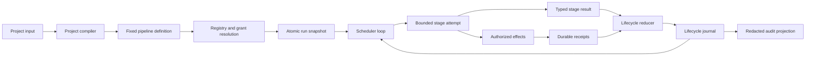

# Nova Core: From Project Input to Durable Decision

Status: implemented with stated limits
Audience: architecture reader, Nova developer, operator, incident responder
Owner: Nova maintainers
Evidence: skills/nova/project; skills/nova/core; skills/common/plugin-runtime
Evidence revision: `4f089958db97a551f406c157d774bda143a38946`
Applies to: `nova-project.v2`, `pipeline-definition.v2`, and the current Nova Core runtime
Last verified: source and contract inspection on 2026-09-19

## Purpose

Nova Core is the control authority for one pipeline run.
It turns a fixed graph into ordered attempts, durable decisions, and one final run status.

Core does not implement product work.
Plugins implement stages and adapters perform external operations.
Core decides when work can start, what authority it receives, and how its result changes the run.

This page follows that complete path.
It also explains why each safety boundary exists and what happens when a boundary fails.

For the wider component map, see [Components and Authority](components-and-authority.md).
For a shorter request trace, see [Request, State, and Recovery](request-state-recovery.md).
For operational commands, see [Operate the Pipeline](../use/operate.md).

## The Core Model

Nova separates four kinds of truth.

| Truth | Owner | Durable representation | Why it is separate |
| --- | --- | --- | --- |
| What work exists | Project compiler and graph validator | Graph in `run-snapshot.json` | Running code must not add undeclared work. |
| Which implementation may run | Plugin registry and platform policy | Registry in `run-snapshot.json` | A stage name alone does not grant authority. |
| What happened | Nova Core | Hash-chained journals and artifact records | Recovery needs ordered facts, not process memory. |
| What the facts mean for the run | Nova lifecycle reducer | Derived stage state and terminal event | Plugins must not select their own lifecycle transition. |

The separation makes replay predictable.
It also lets Core reject a changed graph, package, or result before the change gains authority.

Text version: The compiler creates a fixed definition.
The runtime resolves packages, registrations, grants, and providers.
Nova writes both views into one run snapshot.
The scheduler starts bounded attempts.
Core records effects and results before it changes lifecycle state.
Recovery and audit rebuild their views from durable records.

> **Source evidence — control authority**
>
> [The runner validates the graph and stage inputs before it creates the scheduling loop](https://github.com/datrab/kubeclaw/blob/4f089958db97a551f406c157d774bda143a38946/skills/nova/core/execution/runner.ts#L40-L78).
>
> [The reducer owns all stage states and permitted lifecycle actions](https://github.com/datrab/kubeclaw/blob/4f089958db97a551f406c157d774bda143a38946/skills/nova/core/lifecycle/reducer.ts#L9-L52).

## Authority and Invariants

The following rules hold across the complete run.

| Rule | Core enforces it by | Failure behavior |
| --- | --- | --- |
| One graph defines the run. | Core freezes, sorts, hashes, and stores the graph. | Recovery stops on a pipeline or graph digest mismatch. |
| One active runtime owns a run mutation. | A run mutation lease surrounds new runs, recovery, resume, and administrative actions. | A second mutation fails before it writes state. |
| One registration owns each stage type. | Registry build rejects duplicate owners and runtime validation resolves every stage. | Admission stops before the first attempt. |
| A plugin cannot select a lifecycle state. | The plugin returns a typed result and Core maps it through the reducer. | Invalid results or illegal source states fail closed. |
| A capability is not general access. | Core checks the grant and its resource constraints for each call. | The invocation is denied and the attempt returns a controlled failure. |
| An external effect needs stable identity. | Core writes request, acceptance, lock, fence, and receipt records. | An uncertain outcome blocks automatic continuation. |
| A wait accepts one matching signal. | Core checks wait identity, signal type, issuer, time, and prior consumption. | A stale, foreign, expired, or second signal is rejected. |
| Recovery preserves consumed budgets. | Replay folds attempt and repair events into counters. | Restart cannot restore spent attempts or repair orders. |
| A terminal run stays terminal. | Recovery and resume inspect the last run boundary. | Normal recovery and normal resume are rejected. |

These rules trade convenience for evidence.
For example, Core stops when it cannot distinguish a completed effect from an incomplete effect.
Automatic repetition would be easier, but it could duplicate a deployment, publication, or remote job.

> **Source evidence — immutable run identity**
>
> [The graph snapshot contains ordered nodes, ordinary edges, remediation edges, concurrency, and a content digest](https://github.com/datrab/kubeclaw/blob/4f089958db97a551f406c157d774bda143a38946/skills/nova/core/execution/graph.ts#L13-L50).
>
> [New, recovery, and resume paths execute inside the run mutation lock](https://github.com/datrab/kubeclaw/blob/4f089958db97a551f406c157d774bda143a38946/skills/nova/core/execution/engine-run.ts#L36-L43).

### Identities do not substitute for each other

| Identity | What it names | Authority that verifies it |
| --- | --- | --- |
| Project ID | One authored project definition. | Project compiler. |
| Pipeline ID | One compiled pipeline definition. | Graph snapshot verification. |
| Run ID | One execution history. | Run-root resolver and every lifecycle event. |
| Graph digest | Exact nodes, edges, limits, and concurrency. | New-run snapshot and recovery. |
| Package content digest | Exact installed package content. | Discovery trust policy and pinned-package recovery. |
| Registration ID | One stage, adapter, or observer entry inside a package. | Registry and activation policy. |
| Stage ID | One graph node. | Graph builder and scheduler. |
| Attempt ID and number | One bounded execution of a stage. | Stage executor and artifact producer checks. |
| Lease ID | Temporary authority of one attempt context. | Invocation context and revocation checks. |
| Effect ID and idempotency key | One intended external operation and its retry identity. | Effect coordinator and effect journal. |
| Resource lock and fencing token | Current writer for one external resource. | Lock manager and adapter fence check. |
| Wait ID, signal ID, and signal idempotency key | One pause, one answer, and repeat-safe delivery. | Resume validation and signal journal. |
| Artifact ID and digest | A named output and its exact bytes. | Artifact adapter and checkpoint recorder. |
| Repair request digest and order ID | One defect-driven repair authority. | Repair budget and replay projection. |
| Remote job, request, plan, result, and decision digests | One Nova-to-Buster handoff and its returned facts. | Dispatch store, importer, and Nova decision logic. |

An equal label does not imply equal authority.
For example, an artifact ID without its digest and producer attempt does not identify trusted artifact content.
A remote job ID without its request digest does not identify the admitted request.

> **Source evidence — attempt and effect identity**
>
> [The stage executor creates the attempt and lease identities and records package ownership](https://github.com/datrab/kubeclaw/blob/4f089958db97a551f406c157d774bda143a38946/skills/nova/core/execution/stage-executor.ts#L55-L79).
>
> [The effect contract binds idempotency, attempt, capability, operation, resource, and payload](https://github.com/datrab/kubeclaw/blob/4f089958db97a551f406c157d774bda143a38946/skills/nova/core/effects/contracts.ts#L4-L14).

## 1. Project Admission and Compilation

### The command boundary

The Nova project command accepts `--project` and `--platform`.
It accepts one optional operation: compile, recover, or signal.
Without one of these options, it starts a new run.

The compile operation writes a pipeline definition without starting effects.
The command uses exclusive file creation, so it does not replace an existing output file.
A new run also checks the repository `HEAD` and the clean working tree against the declared baseline.
Recovery compiles the recovery form and then verifies the stored run identity.

> **Source evidence — command selection and baseline checks**
>
> [The project CLI validates its operation, validates the installed runtime, and selects compile, run, recover, or resume](https://github.com/datrab/kubeclaw/blob/4f089958db97a551f406c157d774bda143a38946/skills/nova/project/cli.ts#L19-L56).

### Input admission

The compiler accepts only `nova-project.v2`.
It rejects unknown object fields instead of silently ignoring them.
Project and module IDs use a restricted form.
Repository and workspace paths must be absolute and normalized.
The workspace must remain outside the repository.
The baseline must be a full 40-character Git object ID.

Each module must have requirements, owned paths, runtime configuration, and a test plan.
Owned paths cannot overlap between modules.
Module dependencies must exist and must not form a cycle.
A module test plan must contain at least one non-skipped blocking test.
Its plan digest and project scope must match the project.

**Why these checks exist:** The compiler converts author intent into execution authority.
An ignored field, moving revision, or overlapping owner can make two valid-looking runs mean different things.
Admission rejects that ambiguity before a plugin can change the repository.

Source admission creates a second, narrower boundary for control documents.
The project declares required architecture files and one blueprint path for each module.
A module can select named substeps.
Core then selects the corresponding `FORGE.md` files.
The compiler sorts and deduplicates these paths and rejects absolute paths, parent traversal, control characters, and empty segments.

The source binding covers the project, repository root, architecture reference, selected paths, and a digest of the project contract.
That contract includes the baseline, module requirements, ownership, checks, and final integration requirements.
An optional architecture-check stage reads the immutable subject.
An optional approval stage runs only when the architecture check reports that approval is required.
Blueprint synchronization receives the same source binding.

**Why Core selects control files before implementation:** An agent must not choose its own instructions after it receives write authority.
The source binding makes the exact instruction set part of the admitted project meaning.

> **Source evidence — strict project validation**
>
> [Compiler helpers reject unknown fields, invalid IDs, non-canonical paths, duplicate lists, and unsafe ownership paths](https://github.com/datrab/kubeclaw/blob/4f089958db97a551f406c157d774bda143a38946/skills/nova/project/compiler.ts#L11-L45).
>
> [Module admission checks unique ownership, requirements, plan digest, plan scope, and a blocking test](https://github.com/datrab/kubeclaw/blob/4f089958db97a551f406c157d774bda143a38946/skills/nova/project/compiler.ts#L89-L134).
>
> [Project admission checks the schema version, paths, baseline, dependency order, and final configuration](https://github.com/datrab/kubeclaw/blob/4f089958db97a551f406c157d774bda143a38946/skills/nova/project/compiler.ts#L137-L192).
>
> [Source admission selects architecture and module control files and binds them to the project contract](https://github.com/datrab/kubeclaw/blob/4f089958db97a551f406c157d774bda143a38946/skills/nova/project/source.ts#L19-L66).

### Compiler output

The compiler creates a predictable module chain.
Each module has an implementation stage, a lint stage, an optional product-review stage, and a quality-test stage.
Lint, product review, and quality testing can request repair from the implementation stage.
The compiler adds source and architecture stages before module work.
It adds cumulative final stages after module work.

The project compiler sets `maxConcurrency` to `1`.
This value protects the single shared repository publication lane.
The generic Core still supports higher concurrency for explicit graphs.

Attempt and repair limits are separate.
The current module compiler gives one technical retry and category-specific repair orders.
It includes all possible orders in `maxAttempts`, so a repair recheck does not accidentally consume the technical retry allowance.

> **Source evidence — emitted stages and budgets**
>
> [The module compiler creates implementation, lint, optional review, and test stages with declared repair routes](https://github.com/datrab/kubeclaw/blob/4f089958db97a551f406c157d774bda143a38946/skills/nova/project/compiler.ts#L47-L86).
>
> [The compiler orders modules, adds source and cumulative stages, sets project concurrency to one, and validates the final definition](https://github.com/datrab/kubeclaw/blob/4f089958db97a551f406c157d774bda143a38946/skills/nova/project/compiler.ts#L171-L192).

## 2. Graph Construction, Validation, and Freeze

Core models two edge types.

- An ordinary edge means that a stage must finish successfully or skip safely before a dependent stage becomes ready.
- A remediation edge means that a failed evaluation can send work to a declared repair stage.

An activation condition can skip a stage from a fact produced by an ancestor.
Core does not let an arbitrary stage control activation.
The source must exist and must be an ancestor of the conditional stage.
A remediation target cannot also use activation.

Graph admission rejects:

- an empty graph or duplicate stage IDs;
- invalid attempt, repair, timeout, or orchestrator thresholds;
- duplicate, missing, or self dependencies;
- ordinary dependency cycles;
- missing or self remediation targets;
- a remediation target without a safe order relationship;
- a remediation route that creates a prerequisite deadlock;
- unordered requesters that share one repair target;
- an invalid activation source;
- a remediation-only target with downstream ordinary work.

Core clones and deeply freezes each stage definition.
It sorts stages and edges before it calculates the versioned graph digest.
Declaration order therefore does not change a version 3 snapshot.

**Why ordinary and remediation edges stay separate:** A dependency describes normal completion.
A remediation edge describes controlled backward movement.
If Core treated both as ordinary dependencies, repair could create a cycle or release downstream work too early.

> **Source evidence — graph safety rules**
>
> [The graph builder validates execution limits, dependencies, cycles, remediation order, shared targets, and activations](https://github.com/datrab/kubeclaw/blob/4f089958db97a551f406c157d774bda143a38946/skills/nova/core/execution/graph-build.ts#L8-L96).
>
> [The graph object freezes sorted structures and creates a versioned digest from portable JSON](https://github.com/datrab/kubeclaw/blob/4f089958db97a551f406c157d774bda143a38946/skills/nova/core/execution/graph.ts#L19-L50).

## 3. Registry Admission and Snapshot Handoff

The graph states which stage types are required.
The registry states which installed package owns each type.
Nova joins these facts before execution.

Runtime preparation performs this sequence:

1. Validate the pipeline contract.
2. Discover packages only from configured installation roots.
3. Apply built-in and external trust policy.
4. Build a registry and identify each required registration.
5. Resolve enabled registrations, grants, and selected providers.
6. Validate registration configuration.
7. Activate only the granted registry entries.
8. Validate each stage configuration and input against its owner's schemas.

Core then stores a registry record with package provenance, registrations, enabled entries, grants, selected providers, and configured stage owners.
It binds that record to the graph digest.
The snapshot also stores runtime-dispatch and review-cache profiles.

Nova writes `run-snapshot.json` through a private temporary file.
It uses a no-replace hard link to publish the final file.
It synchronizes the file and directory before it removes the temporary name.
A reader therefore sees either no snapshot or one complete snapshot.

**Why the registry is part of the run snapshot:** A stage type is not a complete implementation identity.
Package version, content digest, registration, grants, and provider selection can change its behavior.
A recovered run must use the admitted set, or use an explicit package-upgrade decision.

> **Source evidence — runtime preparation**
>
> [Runtime preparation discovers trusted packages, builds the registry, resolves policy, validates configuration, and activates registrations](https://github.com/datrab/kubeclaw/blob/4f089958db97a551f406c157d774bda143a38946/skills/nova/core/execution/engine-runtime.ts#L23-L49).
>
> [The runner validates every stage owner, configuration, and input against the granted registry](https://github.com/datrab/kubeclaw/blob/4f089958db97a551f406c157d774bda143a38946/skills/nova/core/execution/runner.ts#L40-L46).
>
> [The snapshot code records runtime provenance and publishes one integrity-checked file atomically](https://github.com/datrab/kubeclaw/blob/4f089958db97a551f406c157d774bda143a38946/skills/nova/core/execution/engine-snapshots.ts#L75-L134).

### Recovery compatibility

Recovery rebuilds the current registry and compares it with the stored registry.
It rejects a missing pinned package, a changed version, or a changed content digest.
An administrative package-upgrade record can authorize an exact old-to-new identity change.
The new identity must keep the same plugin ID and API version.

Recovery also rebuilds the graph from the supplied definition.
It rejects an unsupported snapshot version, changed pipeline ID, or changed graph digest.
It never reinterprets an old run with a convenient new graph.

> **Source evidence — pinned package and graph verification**
>
> [Recovery checks recorded package upgrades and every pinned package identity](https://github.com/datrab/kubeclaw/blob/4f089958db97a551f406c157d774bda143a38946/skills/nova/core/execution/engine-snapshots.ts#L20-L66).
>
> [Recovery requires the same pipeline ID and graph digest](https://github.com/datrab/kubeclaw/blob/4f089958db97a551f406c157d774bda143a38946/skills/nova/core/execution/engine-snapshots.ts#L68-L72).

## 4. Durable State and the Run Root

Core maps a run ID to a directory below `<storageRoot>/runs`.
New directories use a SHA-256 hash of the run ID in their name.
The hash avoids path interpretation and collisions from simple character replacement.
Core can locate an older directory only after it finds the exact run ID in its event journal.

The main run records are:

| Record | Purpose | Important failure meaning |
| --- | --- | --- |
| `run-snapshot.json` | Immutable graph, registry, configuration, and runtime profiles. | A missing or invalid snapshot makes safe recovery impossible. |
| `events.jsonl` | Lifecycle and plugin-domain history. | Divergence, rewind, or invalid hash stops replay. |
| Effect journal and result blobs | Requests, acceptance, receipts, and large result bodies. | An accepted request without a recoverable receipt can block recovery. |
| `signals.jsonl` | Consumed resume signals. | A second signal for one wait is rejected. |
| `administrative-decisions.jsonl` | Authorized reopen and package decisions. | A changed decision identity or unauthorized issuer is rejected. |
| Observer delivery journals | Delivery attempts and checkpoints. | A required observer can stop progress after bounded retries. |

The generic file journal serializes one JSON record per line.
Each record has a sequence, previous hash, and current hash.
Append uses a cross-process file mutex and `fsync`.
Startup truncates only an incomplete final line.
It rejects a changed file identity, a shorter history, or a different prior hash chain.

The journal takes a detached JSON snapshot before it writes.
It rejects cycles, proxies, accessors, sparse arrays, non-finite numbers, functions, and other non-JSON values.
This rule prevents later object mutation from changing the meaning of an earlier event.

Plugin state uses the same durable journal properties but a separate namespace.
Core derives the exact namespace as `plugin.<plugin-id>.<registration-id>`.
It checks registration provenance, monotonic sequence, and stable idempotency identity.
The same idempotency key can repeat only with the same entry.
A plugin cannot write another registration's state or select a shorter namespace.

This separation keeps plugin-owned progress out of canonical lifecycle state.
Core can store a plugin projection without letting that plugin change scheduler authority.

**Operational limit:** The file mutex needs Linux and `/usr/bin/flock` from util-linux.
The storage filesystem must supply correct kernel `flock` behavior.
File and directory synchronization reduce risk, but they do not prove storage durability after host power loss.

> **Source evidence — run directory and journal**
>
> [The run-root resolver validates the run ID, uses a hashed directory, and verifies an older directory before use](https://github.com/datrab/kubeclaw/blob/4f089958db97a551f406c157d774bda143a38946/skills/nova/core/execution/run-root.ts#L62-L75).
>
> [The journal repairs an incomplete tail and rejects rewind or divergence](https://github.com/datrab/kubeclaw/blob/4f089958db97a551f406c157d774bda143a38946/skills/nova/core/state/journal.ts#L59-L103).
>
> [Journal append computes the hash chain, writes all bytes, synchronizes them, and verifies the final size](https://github.com/datrab/kubeclaw/blob/4f089958db97a551f406c157d774bda143a38946/skills/nova/core/state/journal.ts#L125-L155).
>
> [The JSON snapshotter accepts only detached JSON-safe values](https://github.com/datrab/kubeclaw/blob/4f089958db97a551f406c157d774bda143a38946/skills/nova/core/state/json-value.ts#L6-L48).
>
> [The plugin-state journal enforces namespace, registration provenance, sequence, and idempotency](https://github.com/datrab/kubeclaw/blob/4f089958db97a551f406c157d774bda143a38946/skills/nova/core/state/plugins.ts#L22-L105).

## 5. Scheduling, Readiness, and Concurrency

The scheduler derives readiness from current state and the frozen graph.
It does not ask a plugin what should run next.

A normal stage is ready when:

- it is not complete or active;
- it is not a remediation-only target;
- all ordinary dependencies are `succeeded` or `skipped`.

Fan-out needs no special scheduler mode.
Several stages can depend on one completed stage and become ready together.
Fan-in is also explicit.
A joining stage stays pending until every declared dependency completes.
The graph-wide concurrency limit applies after Core calculates the complete ready set.

Core sorts ready stages by stage ID.
It starts only the first `maxConcurrency` entries in that stable order.
This gives a deterministic selection from the same state.
Concurrent attempts can finish in any order, so Core collects the completed decisions before it records them.
It records ordinary siblings before a repair decision can invalidate their older results.

Conditional activation runs after readiness selection.
Core reads only a named fact from the declared ancestor.
If the value does not match, Core records `stage.skipped` with the observed condition details.

Repair work uses a forced queue.
The scheduler still checks the repair target's dependencies.
After repair succeeds, Core returns the requesting evaluation stage to `pending`.

The loop stops with `succeeded` only when every required stage succeeded or skipped.
An unused remediation-only target can remain pending.
If no stage is ready and the graph is not complete, Core derives the strongest present terminal or waiting status.

> **Source evidence — deterministic readiness**
>
> [The graph returns sorted stages whose dependencies are complete and excludes remediation-only targets](https://github.com/datrab/kubeclaw/blob/4f089958db97a551f406c157d774bda143a38946/skills/nova/core/execution/graph.ts#L52-L54).
>
> [The loop limits each batch, orders repair decisions after siblings, and pauses or terminates from recorded decisions](https://github.com/datrab/kubeclaw/blob/4f089958db97a551f406c157d774bda143a38946/skills/nova/core/execution/pipeline-loop.ts#L20-L37).
>
> [Selection handles forced repair work and records conditional skips](https://github.com/datrab/kubeclaw/blob/4f089958db97a551f406c157d774bda143a38946/skills/nova/core/execution/pipeline-loop.ts#L86-L116).
>
> [Finalization defines completion and derives the run status](https://github.com/datrab/kubeclaw/blob/4f089958db97a551f406c157d774bda143a38946/skills/nova/core/execution/pipeline-loop.ts#L137-L143).

## 6. Stage Dispatch and Attempt Authority

Core resolves exactly one active registration for the stage type.
It then creates an attempt identity with run ID, stage ID, random attempt ID, and monotonic attempt number.
It records `attempt.created` and `attempt.dispatched` before it calls the plugin.

Each attempt receives a revocable invocation lease.
The lease contains:

- the attempt identity;
- the owning package and registration provenance;
- the exact capability grants;
- wall-time, memory, and CPU limits;
- issue and expiry timestamps.

The invocation lease and the resource lock solve different problems.
The invocation lease authorizes plugin-context use for one attempt.
Core revokes it when the attempt completes, times out, or receives cancellation.
It is not a cross-host worker claim and it does not renew.
The external resource lock serializes one durable effect.
Core renews that lock during adapter execution and uses its fencing token to reject an old writer.

The current Core lease declares memory and CPU limits.
The in-process stage executor enforces the wall-time deadline directly.
The selected adapter or worker must enforce resource limits that need process isolation.

The plugin context contains validated configuration, stage input, optional continuation guidance, spent budgets, and visible artifacts.
A stage can see artifacts from itself and its ordinary ancestors.
It cannot see an unrelated branch by default.

Every capability call checks the active lease first.
Core then checks that the registration received the capability grant.
A capability-specific handler checks the requested path, namespace, agent, secret, target, source, network origin, executable, or event prefix.
Plugin events must use `plugin.<plugin-id>.` and the current run ID.

**Why Core checks on every call:** Startup admission proves that a grant exists.
It does not prove that every later resource value is safe.
The invocation check prevents a broadly typed capability from becoming broad access.

> **Source evidence — attempt and lease construction**
>
> [The executor resolves the active owner, validates the returned result, records completion, and always cleans up](https://github.com/datrab/kubeclaw/blob/4f089958db97a551f406c157d774bda143a38946/skills/nova/core/execution/stage-executor.ts#L31-L52).
>
> [The executor creates attempt identity, lease limits, context, artifact visibility, and durable attempt records](https://github.com/datrab/kubeclaw/blob/4f089958db97a551f406c157d774bda143a38946/skills/nova/core/execution/stage-executor.ts#L55-L119).
>
> [Capability authorization applies a specific resource rule for each supported capability family](https://github.com/datrab/kubeclaw/blob/4f089958db97a551f406c157d774bda143a38946/skills/nova/core/execution/authorization.ts#L39-L129).
>
> [The invocation context checks lease state, grants, event namespace, and run identity](https://github.com/datrab/kubeclaw/blob/4f089958db97a551f406c157d774bda143a38946/skills/nova/core/execution/context.ts#L34-L79).

### Timeout and cleanup order

Core races the plugin operation against cancellation and the stage deadline.
A deadline aborts the attempt context and produces `timed_out`.
Run cancellation produces `cancelled`.
Other thrown errors become a `retry` result unless they describe an uncertain external effect.
An uncertain effect becomes `blocked` and requires reconciliation.

After result recording, Core aborts the attempt controller and revokes the lease.
The outer execution boundary drains observers and then shuts down adapters.
Adapter shutdown runs even when the pipeline throws.

> **Source evidence — deadline and result normalization**
>
> [The executor races operation, cancellation, and timeout, then maps failures to controlled stage results](https://github.com/datrab/kubeclaw/blob/4f089958db97a551f406c157d774bda143a38946/skills/nova/core/execution/stage-executor.ts#L121-L145).
>
> [The engine drains observers and shuts down adapters in nested `finally` blocks](https://github.com/datrab/kubeclaw/blob/4f089958db97a551f406c157d774bda143a38946/skills/nova/core/execution/engine-run.ts#L21-L34).

## 7. Lifecycle State and Result Mapping

Core has ten stage states.

| State | Meaning | Can normal scheduling select it? |
| --- | --- | --- |
| `pending` | The stage has no active attempt and can become ready. | Yes, after dependencies complete. |
| `scheduled` | A durable projection says that selection occurred. | No new selection. |
| `running` | An attempt is active or replay found an interrupted attempt. | No. |
| `waiting` | Core needs a signal, cooldown, repair, or orchestrator action. | No. |
| `retrying` | The last result authorized another attempt. | Core converts it to pending through the decision recorder. |
| `skipped` | Its declared activation condition did not match. | No; it satisfies ordinary dependencies. |
| `succeeded` | The stage passed and its facts are durable. | No; it satisfies ordinary dependencies. |
| `failed` | The stage produced a known terminal failure or timeout. | No. |
| `blocked` | Core cannot safely continue without a different authority. | No. |
| `cancelled` | The run or attempt was cancelled. | No. |

Every execution consumes one attempt.
Core removes an old wait, cooldown, or pending repair before it applies the new result.
Non-passing results must include a reason.

The journal events below drive the complete state projection.

| Durable input | Required prior condition | Projected result |
| --- | --- | --- |
| Run creation without prior stage events | Graph admission succeeded. | Every stage starts as `pending` with zero spent budgets. |
| `stage.started` | Scheduler selected a ready stage. | Stage becomes `running`. |
| `attempt.created` | Core created a new attempt identity. | Attempt number and attempts used increase monotonically. |
| `attempt.completed`, `attempt.cancelled`, or `attempt.timed_out` | Stage is `running` and the payload has a typed result. | The reducer derives success, retry, repair, wait, failure, blockage, or cancellation. |
| `stage.retrying` | A retry decision exists. | Stage returns to `pending` with spent budgets preserved. |
| `stage.waiting` or `orchestrator.required` | A wait, cooldown, or repair decision exists. | Stage becomes `waiting` and keeps its bound request. |
| `wait.resolved` | The signal matches the active wait. | Stage becomes `pending`; signal payload becomes continuation guidance. |
| `stage.scheduled` after repair | The repair target succeeded. | Requesting stage returns to `pending`; repair return markers clear. |
| `stage.skipped` | Activation condition does not match. | Stage becomes `skipped`. |
| `stage.succeeded` | Core accepted a passing result. | Stage becomes `succeeded` and stores typed facts. |
| `stage.failed`, `stage.blocked`, or `stage.cancelled` | Core selected the matching stop action. | Stage becomes terminal. |
| Recovery finds `running` without later completion | The prior process ended before a terminal attempt event. | Stage returns to `pending`; the created attempt remains spent. |

A result can change state only from `running`.
The reducer rejects a result from any other state.
Replay applies the same result mapping, repair policy, and wait creation logic as live execution.

| Plugin result | Core decision | Important limit |
| --- | --- | --- |
| `passed` | Store facts, mark `succeeded`, record completion. | Facts must use the result schema. |
| `retry` | Schedule the same stage again. | Attempt and technical-retry budgets must remain. |
| `request_fix` | Schedule the declared repair target. | The graph route and repair budget must permit it. |
| `wait` | Store the typed wait and pause. | Attempt budget must remain. |
| `orchestrator_required` | Store an orchestrator wait and pause. | Only the authorized issuer can resume it. |
| `rate_limited` | Store `retryAt` and pause. | Recovery before that time is rejected. |
| `blocked` | Mark the stage and run blocked. | Normal resume cannot reopen it. |
| `failed` | Mark the stage and run failed. | Terminal. |
| `timed_out` | Mark the stage and run failed. | Terminal, unless a higher layer creates another run. |
| `cancelled` | Mark the stage and run cancelled. | Terminal. |

If concurrent stages produce different terminal results, Core uses a stable priority.
Failure has priority over blockage, and blockage has priority over cancellation.
This rule prevents completion order from changing the final result of one batch.

> **Source evidence — complete reducer table**
>
> [The reducer defines every stage state, lifecycle action, result handler, and budget check](https://github.com/datrab/kubeclaw/blob/4f089958db97a551f406c157d774bda143a38946/skills/nova/core/lifecycle/reducer.ts#L9-L135).
>
> [The decision recorder persists retry, repair, wait, stop, completion, and terminal priority](https://github.com/datrab/kubeclaw/blob/4f089958db97a551f406c157d774bda143a38946/skills/nova/core/execution/run-decisions.ts#L29-L131).

## 8. Technical Retry and Product Repair

Technical retry repeats the same stage because execution did not produce a trusted product verdict.
Examples include a temporary adapter failure or rate limit.
It consumes `maxAttempts` and, when present, `maxTechnicalRetries`.
It does not change the graph or send work to another stage.

Product repair responds to a trusted defect finding.
The requesting stage returns `request_fix`.
Core follows only its frozen `on.request_fix` edge.
It stores the original result and repair request, invalidates affected downstream state, and schedules the repair target.
After repair succeeds, Core schedules a new evaluation attempt.

Category budgets separate lint, product review, and test repair.
A category can permit a fixed number of automatic repair orders.
The policy can then request one or more orchestrator-authorized extra orders.
An authorization signal binds the pending request digest, actor, reason, wait, and current repair history.
A stale authorization cannot approve a changed repair request.

The generic pipeline contract supplies no implicit execution budget.
Every stage must declare `maxAttempts`, `maxRemediationCycles`, and
`timeoutMs`. `maxTechnicalRetries`, `repairCategory`, `repairBudget`, and
`orchestratorAfterAttempt` are optional and change only their named behavior.
If `maxTechnicalRetries` is absent, technical retries use the shared
`maxAttempts` ceiling. If `repairCategory` is absent, repair uses
`maxRemediationCycles`. A category-based repair requires the repair target to
own a matching `repairBudget`; an absent category is an error, not a zero
budget.

The project compiler supplies an opinionated policy. It sets a 30-minute stage
timeout, one technical retry, two automatic repair orders for each enabled
lint, review, or test category, and at most one orchestrator-authorized extra
order. It calculates `maxAttempts` so that the initial attempt, all possible
repair orders, their rechecks, and the technical retry fit under the same hard
ceiling. An explicit `pipeline-definition.v2` does not inherit these compiler
values.

| Condition | Core response | Safe next action |
| --- | --- | --- |
| Technical retry remains | Repeat the same stage. | No operator action. |
| Technical retry limit ends | Block the stage. | Inspect the attempt reason before any administrative action. |
| Automatic repair order remains | Run the declared repair target. | Let the target finish and then re-evaluate. |
| Extra repair order needs authority | Create an orchestrator wait. | Submit one matching authorization signal. |
| All repair authority ends | Block the run. | Correct the underlying product or use an authorized administrative decision. |
| Repair target is failed, blocked, or cancelled | Propagate a terminal state. | Diagnose the target; do not force the requester forward. |

**Why retry and repair use different budgets:** A network retry and a product change have different risks.
Combining them could let infrastructure noise consume all repair work, or let repeated product edits bypass a technical retry limit.

> **Source evidence — repair budgets and identity**
>
> [The stage contract requires the hard execution bounds and declares each optional specialized budget](https://github.com/datrab/kubeclaw/blob/4f089958db97a551f406c157d774bda143a38946/skills/common/plugin-runtime/contracts/plugin-system/v2/plugin-system-v2.schema.json#L481-L510).
>
> [The project compiler calculates its explicit timeout, technical retry, repair categories, and aggregate attempt ceiling](https://github.com/datrab/kubeclaw/blob/4f089958db97a551f406c157d774bda143a38946/skills/nova/project/compiler.ts#L55-L66).
>
> [The repair budget decides automatic, authorized, and blocked orders and records their stable identity](https://github.com/datrab/kubeclaw/blob/4f089958db97a551f406c157d774bda143a38946/skills/nova/core/lifecycle/repair-budget.ts#L27-L100).
>
> [Repair authorization checks the request digest, current history, budget disposition, wait, and issuer](https://github.com/datrab/kubeclaw/blob/4f089958db97a551f406c157d774bda143a38946/skills/nova/core/lifecycle/repair-authorization.ts#L6-L31).
>
> [Repair application records the return path and invalidates dependent results before reuse](https://github.com/datrab/kubeclaw/blob/4f089958db97a551f406c157d774bda143a38946/skills/nova/core/lifecycle/remediation.ts#L15-L53).

## 9. Wait, Signal, and Resume

A wait is durable control state.
It is not a sleeping process.
Core can stop, restart, and still require the same external decision.

A wait request states its wait ID, signal type, authorized issuer, optional expiry, and stage context.
A resume signal uses `resume-signal.v2` and adds signal ID, idempotency key, issue time, issuer, and payload.

The two contracts have closed field sets.

| Contract | Required fields | Optional field and meaning |
| --- | --- | --- |
| `wait-request.v2` | `schemaVersion`, `waitId`, `kind`, `signalType`, `authorizedIssuer`, `expiresAt` | `request` carries bounded JSON context for the named signal. |
| `resume-signal.v2` | `schemaVersion`, `signalId`, `idempotencyKey`, `waitId`, `signalType`, `issuer`, `issuedAt`, `payload` | None. `payload` is always a JSON object, including when it is empty. |

`kind` is `signal` or `orchestrator`. Issuer type is `orchestrator`,
`operator`, or `adapter`. The shared contract validates the outer payload, but
it does not give every namespaced signal type a global inner schema. The stage
or the repair-authorization path must interpret its own `request` and `payload`
fields. Core validates the complete repair payload because that signal spends
additional repair authority.

A plugin-provided `wait` keeps the plugin's declared kind, signal type, issuer, expiry, and request.
Core-generated orchestrator waits use kind `orchestrator` and signal type `core.orchestrator.resume`.
Their wait ID is a digest of run, stage, and attempt.
They authorize only the configured orchestrator issuer and do not expire automatically.
A repair-authorization wait also embeds the complete pending repair identity.

Resume performs these checks in order:

1. Rebuild and verify the current runtime.
2. Verify pinned packages and graph.
3. Reject a terminal run.
4. Replay state and locate the exact active wait.
5. Locate the durable wait-creation event.
6. Validate the signal schema.
7. Match wait ID, signal type, and issuer type and ID.
8. Reject an expired wait or a signal older than wait creation.
9. Validate repair authorization when the wait represents a repair order.
10. Record the signal once and append `wait.resolved`.
11. Replay again and start a new attempt with signal payload as guidance.

The signal journal enforces two forms of idempotency.
The same idempotency key and same content is safe to repeat.
The same key with different content is a conflict.
A different signal for an already resolved wait is also rejected.

Normal recovery cannot bypass an active wait.
It returns `RECOVERY_SIGNAL_REQUIRED` with the wait ID.
A cooldown is different: recovery can continue after `retryAt`, but not before it.

> **Source evidence — signal validation and single use**
>
> [The shared schema gives wait requests and resume signals closed field sets, issuer types, timestamps, and JSON payloads](https://github.com/datrab/kubeclaw/blob/4f089958db97a551f406c157d774bda143a38946/skills/common/plugin-runtime/contracts/plugin-system/v2/plugin-system-v2.schema.json#L747-L806).
>
> [Signal validation checks contract, wait, signal type, issuer, expiry, and freshness](https://github.com/datrab/kubeclaw/blob/4f089958db97a551f406c157d774bda143a38946/skills/nova/core/execution/engine-snapshots.ts#L137-L143).
>
> [Resume verifies identity, replays the wait, records the signal once, and supplies continuation guidance](https://github.com/datrab/kubeclaw/blob/4f089958db97a551f406c157d774bda143a38946/skills/nova/core/execution/engine-run.ts#L82-L121).
>
> [Recovery refuses an active wait and an early cooldown](https://github.com/datrab/kubeclaw/blob/4f089958db97a551f406c157d774bda143a38946/skills/nova/core/execution/engine-run.ts#L56-L79).

## 10. Effects, Locks, Fencing, and Receipts

A plugin cannot perform an admitted external operation through an untracked direct call.
It asks for a capability, operation, resource, and payload through its context.
Core creates a stable effect request and routes it to the selected adapter.

The durable sequence is:

1. Resolve any parent adapter dependency identity.
2. Find a prior request by idempotency key.
3. Reject different content under the same key.
4. Return an existing matching receipt when one exists.
5. Acquire the canonical resource lock.
6. Repeat prior-request and receipt checks under the lock.
7. Write the request.
8. Mark acceptance once.
9. Invoke the adapter, or ask it to recover the prior receipt.
10. Require the adapter to assert the current fence.
11. Write a completed or failed receipt.
12. Release the resource lock.

The adapter receives the lock and a fence callback.
It must assert the fence during the operation.
Core checks the fence again before it accepts the result.
Lock renewal failure aborts the adapter signal.
A later lock owner receives a higher fencing token.

**Why request and acceptance are separate:** A stored request means that Core intended the operation.
Acceptance means that the adapter crossed the point where remote work can exist.
After acceptance, absence of a local receipt is uncertain.
Core asks the adapter for a receipt instead of repeating the effect.

Confidential effects use a different path.
Core keeps the secret-bearing request out of the durable effect journal.
The audit stream contains a redacted resource and payload.
The cost is weaker automatic recovery because Core does not retain the confidential request body.

> **Source evidence — durable effect ordering**
>
> [Durable invocation checks prior state, locks the resource, rechecks identity, and chooses invoke or receipt recovery](https://github.com/datrab/kubeclaw/blob/4f089958db97a551f406c157d774bda143a38946/skills/nova/core/effects/durable-invocation.ts#L39-L116).
>
> [The adapter must assert the current fence before Core stores its receipt](https://github.com/datrab/kubeclaw/blob/4f089958db97a551f406c157d774bda143a38946/skills/nova/core/effects/durable-invocation.ts#L119-L163).
>
> [The coordinator keeps confidential values out of the durable request and writes redacted audit facts](https://github.com/datrab/kubeclaw/blob/4f089958db97a551f406c157d774bda143a38946/skills/nova/core/effects/coordinator.ts#L34-L71).
>
> [The file lock manager assigns monotonic fencing tokens and rejects a live competing owner](https://github.com/datrab/kubeclaw/blob/4f089958db97a551f406c157d774bda143a38946/skills/nova/core/effects/locks.ts#L83-L144).

### Effect recovery stops

Before Core starts adapters on recovery, it inspects durable effects.
It stops in two important cases.

- `RECOVERY_EFFECT_OUTCOME_UNRESOLVED` means the adapter accepted a request but Core has no trusted terminal receipt.
- `RECOVERY_EXTERNAL_CONTINUATION_REQUIRED` means a prior external continuation cannot restart as an ordinary local attempt.

Read and checkpoint-style operations can continue when their contract makes repetition safe.
Other operations need an explicit reconciliation result.
The operator must verify the external system and repair the receipt or use the supported administrative path.
Deleting the journal is not recovery because it removes the evidence needed to prevent duplication.

> **Source evidence — effect recovery gate**
>
> [Recovery classifies safe checkpoint operations and rejects unresolved or interrupted external work](https://github.com/datrab/kubeclaw/blob/4f089958db97a551f406c157d774bda143a38946/skills/nova/core/execution/effect-recovery.ts#L8-L29).

## 11. Artifact Checkpoints and Visibility

A stage usually returns artifacts with its final result.
Long operations can also request a checkpoint during the attempt through `artifacts.write` with `checkpoint: true`.

Core accepts only a JSON `put_json` checkpoint.
It calculates the serialized value's digest and byte length.
It compares artifact ID, namespace, media type, encoding, digest, size, and producer with the adapter response.
The producer must be the current attempt.
Core then writes `artifact.created` immediately.

Replay rebuilds checkpoints from lifecycle events.
It also reconstructs missing `artifact.created` rows from completed attempt results.
An exact repeated artifact is idempotent.
The same artifact ID and producer with different content is a conflict.

A later attempt receives artifacts from its own stage and ordinary ancestors.
It does not receive artifacts from unrelated branches.
This visibility rule matches the graph's data authority.

**Why checkpoints exist:** A long fan-out stage can complete valuable units before its process exits.
A durable checkpoint lets the next attempt reuse certified work.
It does not let a partial attempt claim final stage success.

> **Source evidence — checkpoint admission and replay**
>
> [Checkpoint admission verifies operation, serialized content, digest, size, metadata, and producer attempt](https://github.com/datrab/kubeclaw/blob/4f089958db97a551f406c157d774bda143a38946/skills/nova/core/execution/artifact-checkpoints.ts#L37-L59).
>
> [The recorder restores artifacts, deduplicates exact records, rejects conflicts, and writes lifecycle evidence](https://github.com/datrab/kubeclaw/blob/4f089958db97a551f406c157d774bda143a38946/skills/nova/core/execution/artifact-checkpoints.ts#L74-L144).

## 12. Cancellation and Shutdown

Run cancellation uses an `AbortSignal` at the Core boundary.
The pipeline loop checks it before each scheduling selection.
Core marks every non-terminal stage as cancelled and writes `stage.cancelled` for each one.
It then writes `run.cancelled` and returns the cancelled result.

An active stage receives cancellation through its attempt controller.
The stage executor records `attempt.cancelled`, revokes the lease, and prevents later context calls.
Adapters receive the same cancellation chain.
Adapter invocation phases bound cleanup and reject new calls after close.

Cancellation stops local authority.
It does not undo an external effect that already crossed adapter acceptance.
The effect receipt and recovery rules decide whether the external state is known.
Core does not claim rollback when no compensating operation exists.

Shutdown order is deliberate:

1. Stop new pipeline progress.
2. Abort active attempt contexts.
3. Record controlled attempt and stage outcomes when possible.
4. Flush observer delivery.
5. Shut down adapters and their dependencies.
6. Release the run mutation lease.

`shutdownTimeoutMs` is a required positive platform value. Core uses it for
adapter invocation cleanup and adapter shutdown. Observer registrations own
their delivery timeout, maximum attempts, and backoff. A required observer
failure can make the flush fail. A later adapter-shutdown failure can become
the thrown shutdown error because shutdown runs in the outer `finally`
boundary. Neither error can change an already stored lifecycle event. Operators
must therefore inspect observer delivery records, adapter errors, and the
canonical journal instead of treating the last thrown error as the full run
history.

> **Source evidence — cancellation and cleanup**
>
> [The platform contract requires one positive shutdown timeout and passes it to adapter runtime control](https://github.com/datrab/kubeclaw/blob/4f089958db97a551f406c157d774bda143a38946/skills/common/plugin-runtime/foundation/config/platform.ts#L6-L28).
>
> [The loop records cancellation for all open stages and for the run](https://github.com/datrab/kubeclaw/blob/4f089958db97a551f406c157d774bda143a38946/skills/nova/core/execution/pipeline-loop.ts#L75-L84).
>
> [The attempt executor propagates cancellation, records its outcome, and revokes the lease](https://github.com/datrab/kubeclaw/blob/4f089958db97a551f406c157d774bda143a38946/skills/nova/core/execution/stage-executor.ts#L65-L79).
>
> [The adapter invocation phase rejects calls after close and bounds cleanup](https://github.com/datrab/kubeclaw/blob/4f089958db97a551f406c157d774bda143a38946/skills/nova/core/execution/adapter-invocation-phase.ts#L14-L60).
>
> [The engine drains observers before adapter shutdown and preserves both actions in nested cleanup boundaries](https://github.com/datrab/kubeclaw/blob/4f089958db97a551f406c157d774bda143a38946/skills/nova/core/execution/engine-run.ts#L21-L34).

## 13. Restart and Recovery

Recovery does not restore a memory dump.
It verifies immutable inputs and folds the append-only journal through the same lifecycle rules.

The recovery sequence is:

1. Freeze the supplied definition and prepare the current runtime.
2. Resolve the run root and acquire its mutation lease.
3. Read administrative decisions.
4. Verify pinned packages and allowed package upgrades.
5. Verify the pipeline ID and graph digest.
6. Load and hash-verify lifecycle records.
7. Reject an already terminal run.
8. Reconcile the Nova observability plan when present.
9. Replay lifecycle events in sequence.
10. Reset an interrupted `running` stage to `pending` without restoring its spent attempt.
11. Require a signal for an active wait, or wait until a cooldown is due.
12. Check unresolved effects before adapter startup.
13. Continue through the normal runner with `run.resumed`.

Replay recalculates decisions from stored results.
It rebuilds repair routes, wait state, facts, attempt counters, repair counters, and continuation guidance.
It validates repair projection identity while it does so.
A corrupt or semantically inconsistent projection stops recovery.

**Why interrupted work returns to pending:** Core cannot assume that the old process still owns execution.
The prior attempt remains spent because the journal proves that it started.
A new attempt gets a new identity and lease.

> **Source evidence — replay and interrupted attempts**
>
> [Recovery folds matching lifecycle events and resets only interrupted running states](https://github.com/datrab/kubeclaw/blob/4f089958db97a551f406c157d774bda143a38946/skills/nova/core/lifecycle/recovery.ts#L18-L34).
>
> [The replay reducer reconstructs attempts, waits, repairs, facts, and terminal states](https://github.com/datrab/kubeclaw/blob/4f089958db97a551f406c157d774bda143a38946/skills/nova/core/lifecycle/recovery-state.ts#L30-L179).
>
> [The engine verifies immutable identity, reconciles state, and resumes through the normal execution path](https://github.com/datrab/kubeclaw/blob/4f089958db97a551f406c157d774bda143a38946/skills/nova/core/execution/engine-run.ts#L46-L69).

## 14. Administrative Reopen

Normal resume resolves a recorded wait.
It cannot reopen a blocked run.
Administrative reopen is a separate authority with a separate decision record.

An `administrative-reopen.v2` decision binds:

- decision and idempotency identities;
- actor and trusted issuer;
- reason and timestamp;
- target run and stage;
- the selected continuation;
- the existing remediation target when remediation is selected.

The continuation can authorize one retry, one declared remediation path, or cancellation.
It does not reset consumed counters.
The host authenticator must identify the same actor as the decision.
The platform issuer allowlist must permit that principal.

For remediation, Core loads the last durable attempt result.
It validates the result and reconstructs the original defect evidence.
It refuses a missing result, wrong continuation, or exhausted repair authority.
It never creates a synthetic passing result to move the run forward.

**Trade-off:** Administrative reopen can restore progress after an exceptional stop.
It also increases authority.
The separate journal and strict binding make that authority visible and replayable.

> **Source evidence — administrative repair**
>
> [Administrative repair requires the remediation continuation, durable result evidence, current state, and remaining budget](https://github.com/datrab/kubeclaw/blob/4f089958db97a551f406c157d774bda143a38946/skills/nova/core/execution/administrative-repair.ts#L9-L28).
>
> [The lifecycle contract describes the trusted issuer, identity, and continuation limits](https://github.com/datrab/kubeclaw/blob/4f089958db97a551f406c157d774bda143a38946/skills/nova/core/lifecycle/README.md#L23-L41).

## 15. Nova-to-Buster Test Dispatch

Nova owns the pipeline decision, but Buster owns test execution.
The handoff therefore binds input, transport state, result authority, and imported evidence.

### Resolve and bind the plan

Nova resolves suite templates and declarations into one `ResolvedTestPlanV1`.
Resolution validates IDs, provider contracts, dependencies, conditions, links, limits, retries, matrices, evidence policy, and provider configuration.
It calculates stable node identities and the final plan digest.

Nova builds a source snapshot from one committed Git tree.
It checks the repository root, resolves the commit and tree, creates a bounded archive, hashes it, and adds an Ed25519 attestation.
It never reads uncommitted working-tree bytes for this handoff.

> **Source evidence — plan and source binding**
>
> [The resolver validates declarations and creates stable plan structures before contract validation](https://github.com/datrab/kubeclaw/blob/4f089958db97a551f406c157d774bda143a38946/skills/nova/core/test-gates/resolver.ts#L30-L220).
>
> [Source snapshot creation binds repository, commit, tree, archive digest, size, and creator authority](https://github.com/datrab/kubeclaw/blob/4f089958db97a551f406c157d774bda143a38946/skills/nova/core/test-gates/source-snapshot.ts#L16-L64).

### Dispatch and transport recovery

The remote job binds plan, run, pipeline stage, source snapshot, grants, and maximum concurrency.
Its job ID and request digest come from canonical contract content.
The dispatch store records the job and source archive before transport can report completion.

The endpoint policy permits HTTPS.
It permits plain HTTP only for a loopback endpoint behind the expected local proxy boundary.
Transport retries only retryable status classes.
Each response has a byte limit and schema validation.

Dispatch handles uncertain transport state explicitly.
If a request fails, Nova queries the remote job by identity.
It persists the reconciled state before it returns the failure.
A failure that also cannot persist reconciliation carries both causes.

One gate deadline covers dispatch, polling, result download, evidence download,
and retry delays. Each operation receives only the remaining time. Expiry
raises `NOVA_REMOTE_PLAN_TIMEOUT`; caller cancellation remains
`NOVA_REMOTE_PLAN_CANCELLED`. A transport retry cannot reset the overall
deadline.

> **Source evidence — remote dispatch**
>
> [The gate deadline shares one expiry across child operations, delays, cancellation, and timeout errors](https://github.com/datrab/kubeclaw/blob/4f089958db97a551f406c157d774bda143a38946/skills/nova/core/test-gates/deadline.ts#L1-L43).
>
> [Remote job creation binds the plan, source, grants, idempotency key, and request digest](https://github.com/datrab/kubeclaw/blob/4f089958db97a551f406c157d774bda143a38946/skills/nova/core/test-gates/remote-dispatch.ts#L23-L55).
>
> [The secure endpoint rule rejects plaintext transport outside loopback](https://github.com/datrab/kubeclaw/blob/4f089958db97a551f406c157d774bda143a38946/skills/nova/core/test-gates/secure-endpoint.ts#L1-L14).
>
> [Dispatch operation reconciles remote state and preserves both operation and persistence failures](https://github.com/datrab/kubeclaw/blob/4f089958db97a551f406c157d774bda143a38946/skills/nova/core/test-gates/dispatch-operation.ts#L11-L82).

### Import result authority once

Nova imports only `completed`, `failed`, or `cancelled` remote states.
For a completed state, it fetches the result under a configured byte limit.
It verifies job, request, plan, run, stage, source, node, attempt, report, and result digests.
It calculates a gate decision from those verified facts.

Nova fetches every referenced evidence object.
It enforces a total evidence limit and checks each size and digest.
It first stores a pending import, then stores evidence blobs, then changes the import to complete.
The same job can repeat only with identical content.
A later consumer reads a result only through an exact execution binding.

Nova is the decision authority after import.
Buster states what ran and returns evidence.
Nova converts that evidence into passed, failed, execution-error, or product-review-required pipeline meaning.

> **Source evidence — result verification and import**
>
> [Result authority verifies remote identities, digests, attempts, reports, artifacts, and node decisions](https://github.com/datrab/kubeclaw/blob/4f089958db97a551f406c157d774bda143a38946/skills/nova/core/test-gates/remote-result-authority.ts#L35-L190).
>
> [The importer accepts only terminal status, verifies completed results, checks evidence limits and digests, and records once](https://github.com/datrab/kubeclaw/blob/4f089958db97a551f406c157d774bda143a38946/skills/nova/core/test-gates/remote-result-import.ts#L200-L248).
>
> [The import store uses pending and complete states and rejects a conflicting import](https://github.com/datrab/kubeclaw/blob/4f089958db97a551f406c157d774bda143a38946/skills/nova/core/test-gates/remote-result-import.ts#L146-L196).

## 16. Audit and Observer Delivery

The lifecycle journal is the authority.
The audit output is a derived read model.
`readPipelineAudit()` selects one run, preserves event order, includes each source record hash, and calculates an audit digest.

The output contract is `pipeline-audit.v1`. It contains `runId`, the complete
journal head, ordered event projections, and a digest of that projection. Each
event exposes event ID, sequence, type, redacted identity, occurrence time,
causation ID, redacted payload, and source-record hash. The version is the
stability boundary. A consumer must reject an unknown version instead of
inferring fields.

The audit command does not require a terminal run. For an incomplete run, it
returns the verified prefix that exists at read time. It does not add a
synthetic completion marker. A missing journal or missing run fails. A corrupt,
internally inconsistent hash chain fails inside the journal reader before the
audit projection exists.

The audit reader does not compare the current journal head with an external,
previously trusted head. A cleanly truncated file can therefore look like a
valid, shorter journal to a new process. Consumers that must detect rollback
must retain the last trusted `journalHead` or audit digest outside the run root
and compare it with later reads. The current projection proves internal chain
integrity. By itself, it does not prove that the storage owner kept every
previously observed record.

The audit projection recursively redacts fields whose names indicate credentials, secrets, tokens, cookies, passwords, or authorization data.
Redaction protects common structured fields.
It cannot make an arbitrary value safe when a producer puts a secret under an innocent field name.
Producers must still keep secrets out of ordinary event payloads.

Observers receive canonical lifecycle and plugin-domain events.
Each observer has subscriptions and a failure policy.
Delivery records every started, completed, and failed attempt.
A checkpoint binds observer provenance, run, sequence, and event ID.

Observer modes differ:

- A required observer exhausts its bounded attempts and then fails the flush.
- A non-required observer records the failure and stops later events for that run during the current drain.

Core drains observers after committed event batches.
Observer-generated effect events do not feed back into observer delivery.
This rule prevents an observation loop.

> **Source evidence — audit projection**
>
> [Audit rebuilds from the hash-verified journal, redacts sensitive keys, preserves source hashes, and adds a digest](https://github.com/datrab/kubeclaw/blob/4f089958db97a551f406c157d774bda143a38946/skills/nova/core/telemetry/audit.ts#L6-L27).
>
> [A new journal reader validates the file that it sees but has no previously trusted head for a rollback comparison](https://github.com/datrab/kubeclaw/blob/4f089958db97a551f406c157d774bda143a38946/skills/nova/core/state/journal.ts#L42-L77).
>
> [Observer delivery uses durable attempts, provenance-bound checkpoints, subscriptions, and bounded failure policy](https://github.com/datrab/kubeclaw/blob/4f089958db97a551f406c157d774bda143a38946/skills/nova/core/telemetry/observers.ts#L14-L106).

## 17. Failure Families and Operator Response

Core error messages use stable prefixes for the failed boundary.
Some messages append identities after a colon.
Treat those suffixes as diagnostic values, not as a separate error family.

| Family | What it means | Lifecycle effect | Retry rule | Safe response |
| --- | --- | --- | --- | --- |
| `PROJECT_*` | Project input, source, plan, or repository baseline failed admission. | No run starts, or recovery admission stops. | Do not retry unchanged input. | Correct the named field, plan binding, baseline, or repository state. Compile again before execution. |
| `GRAPH_*` | The graph, budget, dependency, activation, or repair route is unsafe or differs during recovery. | Admission or recovery stops. | Do not retry with a changed graph for the same run. | Correct a new definition, or supply the exact stored definition for recovery. |
| `PIPELINE_RUN_*`, `RUN_*`, or `RUN_SNAPSHOT_*` | Run identity, exclusive mutation, snapshot integrity, or completion evidence is missing or inconsistent. | Creation, recovery, mutation, or completion verification stops. | Retry a lock conflict after the active owner exits. Do not retry an integrity conflict. | Identify the current owner. Preserve the run root. Compare the stored snapshot, journal, repository head, effects, artifacts, and budgets. |
| `PIPELINE_STAGE_*` | A required stage owner is absent or inactive. | Admission or attempt dispatch stops. | Retry only after registry correction. | Restore the admitted package and registration. Verify its digest and grants. |
| `STAGE_*` | A stage returned a result that is illegal for its current state or requested an undeclared repair route. | The result does not change the stage to the requested state. | Do not repeat unchanged output. | Correct the plugin result or graph declaration. Keep lifecycle authority in Core. |
| `PLUGIN_*` | An attempt timed out, lost context, used an undeclared capability, or emitted an invalid event. | Usually controlled retry, timeout failure, or cancellation. | Follow stage budgets. | Inspect the attempt reason. Correct plugin behavior or its declared grant. |
| `CAPABILITY_*` | Resource detail did not satisfy the grant constraint. | The effect is denied before adapter authority. | Do not retry unchanged input. | Narrow the request or explicitly change platform policy. |
| `ADAPTER_*` | Adapter activation, dependency, cleanup, fence, or confidential operation failed. | Attempt retry or effect reconciliation block. | Retry only when no uncertain accepted effect exists. | Inspect effect records and adapter health. Reconcile external state first. |
| `EFFECT_*` | Effect identity, request, receipt, acceptance, result, lock, or recovery is inconsistent. | Attempt or recovery blocks when outcome is uncertain. | Never blindly repeat an accepted effect. | Check the external system and durable receipt. Preserve journals. |
| `RESOURCE_LOCK_*` or `RESOURCE_LOCKED` | Resource ownership, lease time, fencing, or metadata is invalid, or another current owner holds the resource. | Effect does not gain trusted completion. | Retry contention after the current owner completes. Retry no stale or inconsistent fence. | Restore lock storage and reconcile the protected resource. |
| `ARTIFACT_*` | Checkpoint or final artifact metadata does not match content or producer. | The attempt fails and the artifact gets no authority. | Retry after fixing producer or adapter. | Compare ID, digest, size, encoding, namespace, and attempt identity. |
| `JOURNAL_*` or `FILE_MUTEX_*` | Durable history changed, is not JSON-safe, or cannot be locked or written. | State mutation and recovery stop. | Do not retry while storage is suspect. | Protect the run root, verify `flock`, preserve files, and restore from a trusted copy. |
| `WAIT_*` | Signal identity, issuer, type, age, expiry, or single-use rule failed. | The run remains waiting. | Submit the correct signal; do not edit the journal. | Read the active wait and issue one new matching signal. |
| `RECOVERY_*` | The stored run is terminal, incompatible, waiting, cooling down, or has unresolved effects. | Recovery stops before new work. | Retry only after the stated condition changes. | Use signal, wait for cooldown, restore pinned runtime, or reconcile effects. |
| `REPAIR_*` or `ADMIN_*` | Repair identity, evidence, issuer, history, or budget is invalid. | Repair does not start; the run remains waiting or blocked. | Do not resubmit changed content under the same identity. | Rebuild the decision from current durable state and remaining authority. |
| `NOVA_SOURCE_*` | Source repository, process, archive, identity, or attestation failed. | Remote test dispatch does not start. | Retry after source correction. | Use the repository root, a committed revision, valid key, and allowed archive limit. |
| `NOVA_REMOTE_*` or `NOVA_DISPATCH_*` | Remote endpoint, transport, job, result, evidence, import, or retention failed. | Test gate retries, blocks, or reports execution error according to the stage result. | Reconcile the job before a new dispatch. | Query the same job identity and preserve request and import stores. |
| `NOVA_OBSERVABILITY_*`, `NOVA_FINAL_OBSERVABILITY_*`, `NOVA_RECONCILIATION_*`, or `NOVA_VERIFIED_OUTPUT_*` | Required observability, reconciled attempt ownership, or verified output binding is incomplete or conflicting. | Final evidence acceptance or recovery stops. | Retry only after the missing evidence exists or the same identity can be proved. | Compare plan, run, attempt, owner, time, and output bindings. Do not manufacture a replacement record. |
| `TEST_PLAN_*` | Test declaration or resolved plan is invalid. | Plan resolution stops before dispatch. | Do not retry unchanged plan. | Correct the exact node, link, provider, limit, retry, or evidence field. |
| `TEST_REPORT_*` | A returned test report cannot prove that a required case executed. | The quality gate does not pass. | Retry only after correcting the provider or report input. | Inspect executed, skipped, and missing cases and retain the rejected report as evidence. |
| `OBSERVER_*` or `REQUIRED_OBSERVER_*` | Event delivery or checkpoint state failed. | Required policy can fail the event flush; optional policy records a gap. | Use the observer's bounded delivery policy. | Repair observer configuration or endpoint, then resume from its checkpoint. |
| `AUDIT_*` | The requested journal or run has no audit source. | Audit command fails; run state does not change. | Retry only after choosing the correct run root and run ID. | Locate and verify the authoritative event journal. |
| `DURABLE_RECORD_*` | A durable record operation lost synchronous authorization or reused an idempotency identity with different content. | The record is rejected before it becomes authority. | Retry only the same record after authority returns. | Restore the authorized context or issue a new identity for different content. |
| `LEGACY_IMPORT_*` or `LEGACY_SCAN_*` | A one-time legacy import lacks required structure, policy acknowledgement, canonical paths, or bounded scan input. | Import stops and no new run gains the old data. | Do not retry unchanged legacy input. | Correct the import bundle or start a new run when safe conversion cannot preserve meaning. |

The family table gives the decision rule.
The thrown site gives the exact trigger and identity.
The following source groups are the canonical detailed index for the current revision:

- [Project compiler and command error sites](https://github.com/datrab/kubeclaw/tree/4f089958db97a551f406c157d774bda143a38946/skills/nova/project)
- [Graph, dispatch, wait, recovery, and attempt error sites](https://github.com/datrab/kubeclaw/tree/4f089958db97a551f406c157d774bda143a38946/skills/nova/core/execution)
- [Reducer and repair error sites](https://github.com/datrab/kubeclaw/tree/4f089958db97a551f406c157d774bda143a38946/skills/nova/core/lifecycle)
- [Journal and plugin-state error sites](https://github.com/datrab/kubeclaw/tree/4f089958db97a551f406c157d774bda143a38946/skills/nova/core/state)
- [Effect and lock error sites](https://github.com/datrab/kubeclaw/tree/4f089958db97a551f406c157d774bda143a38946/skills/nova/core/effects)
- [Remote test-gate error sites](https://github.com/datrab/kubeclaw/tree/4f089958db97a551f406c157d774bda143a38946/skills/nova/core/test-gates)
- [Audit and observer error sites](https://github.com/datrab/kubeclaw/tree/4f089958db97a551f406c157d774bda143a38946/skills/nova/core/telemetry)

## 18. Design Decisions and Their Costs

### One lifecycle writer

**Decision:** Nova Core owns canonical stage and run transitions.

**Reason:** Replay must produce the same state from the same ordered facts.

**Alternative:** Let each plugin write stage state directly.

**Why it was not selected:** Two plugins could apply incompatible transitions or bypass budget and wait rules.

**Cost:** Core becomes a central authority and must stay available with durable storage.

### Frozen graph and runtime

**Decision:** Store graph and registry identity before execution and verify them on recovery.

**Reason:** A recovered run must retain the meaning that it had when admitted.

**Alternative:** Load the newest installed packages and rebuild the graph after restart.

**Why it was not selected:** A restart could change stage ownership, capability access, repair paths, or policy without a decision record.

**Cost:** Package and graph changes need a new run or a narrowly authorized compatibility action.

### Journal and projection

**Decision:** Keep append-only events as authority and derive current state and audit views.

**Reason:** An event history preserves why a state exists and lets Core rebuild after process loss.

**Alternative:** Overwrite one mutable state document.

**Why it was not selected:** A partial write or logic error could erase the prior decision and its cause.

**Cost:** Replay, hash verification, compaction limits, and storage growth need active management.

### Fail closed on uncertain effects

**Decision:** Stop automatic recovery when Core cannot prove an accepted effect's outcome.

**Reason:** Repeating an external effect can be worse than delayed progress.

**Alternative:** Retry every operation after a timeout or process crash.

**Why it was not selected:** The first request can succeed remotely while its response is lost.

**Cost:** Some incidents require human or adapter-specific reconciliation.

### Bounded repair

**Decision:** Separate technical retries, automatic repair orders, and authorized extra repairs.

**Reason:** Each action spends a different kind of authority and has a different failure meaning.

**Alternative:** Use one large attempt counter.

**Why it was not selected:** Infrastructure noise could consume product-repair capacity, and repeated edits could continue without explicit approval.

**Cost:** Graph authors must configure more than one budget and operators must understand which one ended.

## 19. Safe Change Checklist

Use this checklist when you change Nova Core.

1. Identify the authority that changes: compiler, graph, registry, lifecycle, effect, state, or remote import.
2. Update the versioned contract before code when the durable shape changes.
3. Preserve stable identity fields and document any new digest input.
4. Add a fail-closed rule for missing, conflicting, stale, or oversized input.
5. Define restart behavior before you add the normal execution path.
6. Keep technical retry, product repair, wait, and administrative authority separate.
7. Record the decision before an external action can become ambiguous.
8. Test normal, duplicate, timeout, cancellation, process-loss, and corrupt-state paths.
9. Verify that old runs either replay with unchanged meaning or stop with a precise compatibility error.
10. Update the operator action for every new error family.

The central rule is simple: do not infer authority from successful transport or available code.
Authority comes from the fixed graph, admitted runtime, durable record, and current bounded decision.
