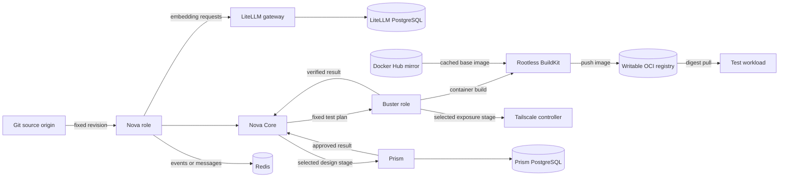

# Pipeline Dependencies

Status: documented showcase baseline; implementation and live-proof gaps are stated
Audience: architecture reader, operator, maintainer, security reviewer
Owner: platform architecture and pipeline owners
Evidence: packaging/runtime/roles; skills/nova/core; skills/common/plugins/redis-transport; skills/buster/engine; charts/kubeclaw; charts/prism
Applies to: current source, role declarations, charts, and selected infrastructure
Last verified: 2026-09-16

## Purpose

A pipeline is more than its sequence of stages.
It also needs source, state, model access, build services, image storage, and selected exposure paths.

This page explains those dependencies as one system.
It separates Core authority from the mandatory showcase deployment baseline.
It also identifies the stage that actively consumes each service.

## Dependency Classes

KubeClaw uses five dependency classes.

| Class | Meaning | Example |
| --- | --- | --- |
| Core | Every durable run needs it. | Nova run storage. |
| Showcase baseline | Every complete learning-lab deployment provides it. | Redis, Tailscale, registries, and BuildKit. |
| Role | A deployed role needs it. | Prism needs its PostgreSQL database. |
| Stage | A selected stage needs it. | Container build needs BuildKit and a writable registry. |
| Access | A user or operator path needs it. | A private Tailscale route. |

An unavailable stage dependency can block one path without corrupting Nova state.
An unavailable Core dependency can stop safe progress for every run.

The showcase baseline is stricter than the smallest executable graph.
A run might not call every baseline service.
The platform still proves each service before it claims full readiness.

## Required Showcase Baseline

The complete KubeClaw learning lab requires these pipeline-facing services:

| Service | Why the baseline requires it | Active consumer |
| --- | --- | --- |
| Kubernetes, DNS, network, and storage | Supply execution, service discovery, traffic boundaries, and durable volumes. | All deployed roles and services. |
| SPIRE and Envoy | Supply exact workload identity and protected service routes. | Nova, Buster, and Prism worker paths. |
| Git source origin | Supplies exact source revisions. | Nova workspaces and source adapters. |
| Nova durable storage | Preserves canonical run state and recovery evidence. | Nova Core. |
| Redis | Supplies shared transport, health, telemetry, and observer paths. | Nova role and selected integrations. |
| LiteLLM and its PostgreSQL | Supply the selected embedding path and gateway state. | OpenClaw memory search. |
| Prism PostgreSQL | Preserves design and approval state. | Prism Control and bounded Prism clients. |
| Rootless BuildKit | Builds project images in the Buster boundary. | Buster container-build provider. |
| Writable local OCI registry | Stores produced images by immutable digest. | BuildKit, Buster, and Kubernetes nodes. |
| Docker Hub pull-through mirror | Caches reviewed public base-image pulls. | BuildKit and configured node runtimes. |
| Tailscale | Supplies private access and pipeline exposure fixtures. | Users, operators, and Buster exposure stages. |

The chart still permits reduced developer configurations.
Those configurations do not represent the complete showcase baseline.
This difference is a deployment profile, not a change to Nova Core semantics.

## Complete Pipeline Map

Text version: Git supplies a fixed source revision to Nova.
Nova Core controls the run.
The showcase platform provides Redis, LiteLLM, Prism, BuildKit, both registry services, and Tailscale.
The active graph determines which service receives work during one run.
Buster and Prism return bounded results to Core.

The complete lab deploys and verifies every solid-line dependency shown here.
One individual graph can leave a service idle when it has no matching stage.

## Nova, Nova Core, and Their Host Role

Nova is the deployable orchestration role.
Nova Core is the state machine and execution engine inside that role.

The Nova role also contains the project compiler and the plugin runtime.
Its declared plugins connect Core to Git, Redis, artifacts, model-backed specialists, Buster, and Prism.

Core writes the fixed graph and registry snapshot before it starts execution.
It records lifecycle events in the run store.
It remains the only authority that can close or recover the complete run.

**Why this design exists:** Core must remain deterministic and independent from specialist implementation details.
The Nova role can add controlled integrations without adding them to the state machine.

**Failure effect:** A lost Nova run store prevents safe recovery.
A failed optional adapter can block its stages while the canonical run record remains intact.

> **Source evidence — Nova contains more than Core**
>
> [The role manifest includes Nova Core, project code, contracts, and selected plugins](https://github.com/datrab/kubeclaw/blob/85e73b1885f04a9494f388cf6622ad0bde2db447/packaging/runtime/roles/nova.json#L11-L56).
>
> [The entry point exports Core and starts the project CLI as a separate layer](https://github.com/datrab/kubeclaw/blob/85e73b1885f04a9494f388cf6622ad0bde2db447/skills/nova/pipeline.ts#L5-L14).
>
> [Core writes the graph and registry snapshots before it runs the pipeline](https://github.com/datrab/kubeclaw/blob/85e73b1885f04a9494f388cf6622ad0bde2db447/skills/nova/core/execution/engine-run.ts#L36-L43).

## Git Source and the Missing Git Mirror

Git provides the source identity for compilation, implementation, review, and tests.
Nova binds work to a repository root and an exact revision.
Role deployments can clone the configured origin into a workspace.

The current repository does not implement a shared Git mirror service.
It uses the configured Git origin and local workspaces.
The Docker Hub mirror described below is an OCI registry mirror, not a Git mirror.

This distinction is important.
A Git mirror would cache repository objects and reduce dependence on the upstream Git service.
It would also need synchronization, authentication, freshness, and failover rules.
None of those rules exist as a supported KubeClaw contract today.

**Why exact revisions exist:** Branch names can move during a run.
An exact commit lets Nova detect changed input and prevents silent source substitution.

**Failure effect:** A fresh clone or fetch fails when the Git origin is unavailable.
An existing workspace is not proof that a new run can fetch its required revision.

**Recovery rule:** Restore access to the same revision.
Do not replace it with a newer branch head during recovery.

> **Source evidence — current Git path**
>
> [The Nova role selects the Git workspace and repository adapters](https://github.com/datrab/kubeclaw/blob/85e73b1885f04a9494f388cf6622ad0bde2db447/packaging/runtime/roles/nova.json#L25-L56).
>
> [The deployment clones the configured repository and later fetches its origin](https://github.com/datrab/kubeclaw/blob/85e73b1885f04a9494f388cf6622ad0bde2db447/charts/kubeclaw/templates/deployment.yaml#L374-L409).
>
> **Current limit:** No source file declares a supported Git mirror service or mirror failover contract.

## Redis: Transport and Projection, Not Lifecycle Authority

Redis is mandatory in the showcase deployment.
It supports message, health, telemetry, and observer paths.
The Nova role includes a bounded Redis transport adapter.
The deployment health checks can verify Redis and a Redis stream.

Redis does not own the canonical pipeline lifecycle.
Nova stores canonical run events in its durable run store.
This prevents a lost cache or stream from rewriting pipeline history.

The Redis adapter publishes with a deduplication key.
It also limits payload size and supports a bounded operation set.
Authentication comes through the secret resolver instead of the authored pipeline.

**Why this design exists:** Redis gives fast shared transport without becoming a second state machine.
The durable journal remains authoritative after a transport interruption.

**Failure effect:** Selected delivery, health, or status paths can stop.
The failure does not mean that the canonical lifecycle record disappeared.

**Recovery rule:** Restore Redis and reconcile derived delivery from durable records.
Do not infer missing pipeline events from an empty Redis stream.

> **Source evidence — bounded Redis use**
>
> [The Nova role selects the Redis transport plugin](https://github.com/datrab/kubeclaw/blob/85e73b1885f04a9494f388cf6622ad0bde2db447/packaging/runtime/roles/nova.json#L25-L40).
>
> [The adapter accepts bounded publish operations and resolves its password through a secret capability](https://github.com/datrab/kubeclaw/blob/85e73b1885f04a9494f388cf6622ad0bde2db447/skills/common/plugins/redis-transport/src/adapter.ts#L57-L84).
>
> [Nova writes its canonical run journal before the runner controls stage progress](https://github.com/datrab/kubeclaw/blob/85e73b1885f04a9494f388cf6622ad0bde2db447/skills/nova/core/execution/engine-run.ts#L36-L43).

## PostgreSQL: Two Different Data Owners

The selected deployment has two PostgreSQL uses.
They do not share authority or recovery groups.

| Database | Owner | Stored data | Pipeline impact |
| --- | --- | --- | --- |
| LiteLLM PostgreSQL | Model gateway operator | Gateway configuration, accounting, and gateway state. | Model-backed stages can fail when the selected gateway needs this database. |
| Prism PostgreSQL | Prism Control | Projects, revisions, operations, approvals, and preferences. | Prism design stages and Studio operations stop. |

Nova Core does not store its lifecycle journal in either database.
Buster also keeps its job and evidence state outside these databases.

The LiteLLM database belongs to the selected model-gateway deployment.
Another supported gateway topology could use a different persistence design.

The Prism database is a direct role dependency when Prism is active.
Its backup must match the Prism artifact set from the same recovery point.

**Why the stores stay separate:** Each owner has different consistency and recovery rules.
One shared database would couple unrelated recovery operations and credentials.

**Failure effect:** LiteLLM database loss blocks the selected model path.
Prism database loss blocks Prism state work.
Neither failure proves that Nova lost its run journal.

> **Source evidence — separate PostgreSQL owners**
>
> [The LiteLLM deployment reads its database URL from a dedicated Secret](https://github.com/datrab/kubeclaw/blob/85e73b1885f04a9494f388cf6622ad0bde2db447/my-values/infra/litellm-deployment.yaml#L34-L45).
>
> [The Prism chart creates a separate PostgreSQL workload and four database identities](https://github.com/datrab/kubeclaw/blob/85e73b1885f04a9494f388cf6622ad0bde2db447/charts/prism/templates/postgresql.yaml#L1-L52).
>
> [The Prism chart gives that database its own persistent volume](https://github.com/datrab/kubeclaw/blob/85e73b1885f04a9494f388cf6622ad0bde2db447/charts/prism/templates/postgresql.yaml#L54-L73).

## BuildKit, Local OCI Registry, and Pull-Through Mirror

The container-build stage is one chain with three different responsibilities.

1. Rootless BuildKit creates the image.
2. The writable local OCI registry stores the produced image.
3. The Docker Hub mirror caches public base-image pulls.

The complete showcase baseline requires all three services.
An individual run uses them when its graph contains an image build or an uncached pull.

The mirror cannot replace the writable registry.
The writable registry cannot silently act as the public mirror.
Their trust, retention, and failure behavior differ.

The checked-in `registry-local` service is an anonymous HTTP lab implementation.
It proves storage and image-lifetime mechanics, but it is not an authenticated production registry.
The complete secure path needs an authenticated HTTPS registry through the same client contract.
The [roadmap](../status/roadmap.md#production-grade-local-oci-registry) defines that replacement and its acceptance conditions.

The checked-in Docker Hub mirror is a cache, not an offline source guarantee.
A cache miss still needs its upstream unless the requested content already exists locally.
Readiness must test a hit, a miss, and an upstream outage separately.

Buster starts its colocated rootless BuildKit process before it accepts build work.
The provider passes the selected Dockerfile and bounded build arguments to BuildKit.
It pushes the result to the configured writable registry.

Buster then reads the registry manifest.
It verifies that the manifest digest equals the digest returned by BuildKit.
Later deployment stages use the immutable digest, not a mutable tag.

**Why this design exists:** A successful build process does not prove that the registry stored the expected image.
The second digest check closes that gap.

**Failure effect:** BuildKit loss blocks container-build stages.
Registry loss also blocks publication and uncached test-workload pulls.
Mirror loss can block uncached base-image pulls, while existing cache hits can still work.

**Recovery rule:** Reconcile by immutable digest.
Do not claim success from a tag, a BuildKit exit code, or a registry health response alone.

> **Source evidence — image production chain**
>
> [The Buster entry point writes validated BuildKit configuration and starts rootless BuildKit](https://github.com/datrab/kubeclaw/blob/85e73b1885f04a9494f388cf6622ad0bde2db447/docker/buster-runtime-entrypoint.sh#L7-L35).
>
> [The container runtime sends the build to BuildKit with its bounded environment](https://github.com/datrab/kubeclaw/blob/85e73b1885f04a9494f388cf6622ad0bde2db447/skills/buster/engine/test-gates/container-build-runtime.ts#L236-L270).
>
> [One contract generates matching node, BuildKit, and runtime registry configuration](https://github.com/datrab/kubeclaw/blob/85e73b1885f04a9494f388cf6622ad0bde2db447/scripts/registry-client-config.mjs#L57-L104).
>
> [The lab OCI registry uses retained storage and one writer during service replacement](https://github.com/datrab/kubeclaw/blob/85e73b1885f04a9494f388cf6622ad0bde2db447/my-values/infra/registry-local.yaml#L1-L45).
>
> [The separate mirror caches Docker Hub content and keeps its own cache volume](https://github.com/datrab/kubeclaw/blob/85e73b1885f04a9494f388cf6622ad0bde2db447/my-values/infra/registry-mirror.yaml#L14-L78).

## Tailscale: Required Platform Service With Two Consumers

Tailscale has two separate uses.

The first use is a Buster test provider.
A graph can expose a temporary Kubernetes fixture and return a typed HTTPS endpoint.
An HTTP provider can then test that endpoint.

The second use is private human or operator access.
Prism Studio, Argo CD, and the Ops Pod can use private routes.
Those routes do not own pipeline state.

Tailscale is mandatory in the showcase deployment.
It is still not part of Nova Core and does not own lifecycle state.

A test plan consumes it when the plan selects the exposure provider.
Humans consume it through the private access routes.
The platform readiness check must prove both uses separately.

**Why this design exists:** Public exposure must remain explicit and temporary.
The provider receives a bounded exposure capability instead of cluster credentials.

**Failure effect:** Exposure stages or private entry routes stop.
Internal Nova state and unrelated test providers can remain available.

**Recovery rule:** Reconcile the exact exposure owner and lease generation.
Do not create a second exposure for an uncertain attempt.

> **Source evidence — conditional exposure**
>
> [The Buster role includes the Tailscale exposure provider](https://github.com/datrab/kubeclaw/blob/85e73b1885f04a9494f388cf6622ad0bde2db447/packaging/runtime/roles/buster.json#L25-L50).
>
> [The provider requires only the bounded Kubernetes exposure capability](https://github.com/datrab/kubeclaw/blob/85e73b1885f04a9494f388cf6622ad0bde2db447/skills/buster/plugins/tailscale-exposure/plugin.json#L1-L25).
>
> [Prism Studio can select a private Tailscale ingress without changing internal worker routes](https://github.com/datrab/kubeclaw/blob/85e73b1885f04a9494f388cf6622ad0bde2db447/charts/prism/templates/services.yaml#L38-L47).

## Failure and Recovery Summary

| Dependency failure | Run meaning | Safe response |
| --- | --- | --- |
| Git origin unavailable | Required source revision can be unavailable. | Restore the same revision or use a verified existing snapshot. |
| Nova run storage unavailable | Canonical state cannot be proved. | Stop mutation and restore the authoritative store. |
| Redis unavailable | Required transport and projection paths stop. | Restore Redis and replay derived delivery. |
| LiteLLM PostgreSQL unavailable | Selected model gateway can fail. | Restore its matched database before model-backed work. |
| Prism PostgreSQL unavailable | Prism state work stops. | Restore the matched Prism database and artifacts. |
| BuildKit unavailable | Image-build stages stop. | Restore the same configured builder and resume by attempt identity. |
| Writable registry unavailable | Push, verification, or uncached pulls stop. | Restore retained digests and verify a real pull. |
| Docker Hub mirror unavailable | The showcase baseline is not ready; uncached public pulls can stop. | Restore the mirror and verify cache misses and hits. |
| Tailscale unavailable | The showcase baseline is not ready; exposure and private access stop. | Restore the route and reconcile its owner before retry. |

## Replacement Rules

A replacement is safe only when it preserves the contract at the boundary.

- A Git service must return the exact required revision and repository bytes.
- A Redis service must preserve authentication, stream identity, and deduplication behavior.
- A PostgreSQL replacement must preserve the data owner's supported backup and migration contract.
- A BuildKit replacement must return a verifiable immutable image result.
- A registry replacement must preserve digest reads, authentication, trust, and retained manifests.
- A Tailscale replacement must preserve explicit ownership, private routing, and bounded cleanup.

Brand compatibility is not enough.
The verification must cover the actual producer and consumer path.

## Related Operations

- [Install and bootstrap](../use/install.md) gives the dependency order and readiness checks.
- [Operate KubeClaw](../use/operate.md) explains run inspection and controlled recovery.
- [Recovery](../use/recovery.md) separates each store and restore group.
- [Maintenance](../use/maintenance.md) covers upgrades, GitOps, registry, and BuildKit work.
- [Platform and operations architecture](platform-and-operations.md) explains the replaceable platform layer.
