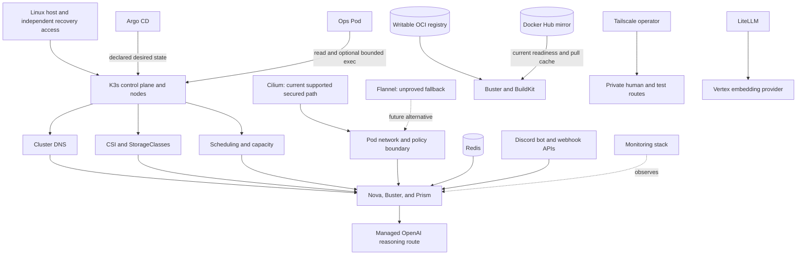

# Platform and Operations Architecture

Status: implemented in parts; host automation and live acceptance remain open
Audience: architecture reader, platform operator, maintainer, security reviewer
Owner: platform architecture and operations
Evidence: scripts/deploy.sh; scripts/platform-services.mjs; charts/ops-pod; gitops/platform; my-values/infra
Evidence revision: `32b02816cc19cc8865a45b221b8b6ca28e99e8fb`
Applies to: current Kubernetes platform and its supported deployment paths
Last verified: source inspection on 2026-09-21

## Purpose

KubeClaw needs a platform, but the pipeline does not own that platform.
This page explains the host, cluster, network, storage, deployment, build,
registry, access, model-gateway, monitoring, and operations layers around the
pipeline.

The distinction is important. A failed platform dependency can stop work, but
it must not invent a Nova stage result. A platform controller can create a Pod,
but it must not write Nova's lifecycle journal. This boundary keeps deployment
health, pipeline truth, and operational observations separate.

## Required, Conditional, and Optional Systems

“Required” has two different meanings here. The portable pipeline engine needs
only the services used by its selected graph. The checked-in showcase profile
enables more paths and makes their readiness part of that deployment. Mixing
these meanings would make an optional engine capability look optional in a Pod
that refuses readiness without it.

| System | Current role | Checked-in showcase profile | Portable pipeline boundary | Pipeline authority |
| --- | --- | --- | --- | --- |
| Linux host and K3s | Supply the Kubernetes control plane and nodes. | Required. | A different conforming runtime can host the engine. | None. |
| Cluster DNS, storage, scheduler, and one CNI | Supply basic Kubernetes behavior. | Required. | Required by this Kubernetes deployment, not by pipeline semantics. | None. |
| Redis | Carries configured messages and projections. | Required. The Nova and Buster role defaults probe it. | Required only when a selected adapter or observer uses Redis. | Transport only. |
| Tailscale operator | Supplies private platform entry and bounded test exposure. | Required for the complete showcase and enabled by the deployment default. | Required only for a private route or a Tailscale test fixture. | Route owner only. |
| Writable OCI registry | Receives tested images by immutable digest. | Required for the intended container-build showcase, but not fully selected by the checked-in Buster values alone. A deployment must supply the endpoint and transport. A lab-only Helm override can make the chart render, but that override is not a selected deployment. | Required only for a graph that builds, pushes, or pulls an image. | Artifact transport and storage only. |
| Rootless BuildKit | Builds and pushes an image for Buster's container-build provider. | Required by the Buster runtime profile. | Required only when the container-build provider is selected. | Build worker only. |
| Docker Hub pull-through mirror | Caches Docker Hub pulls. | Its default endpoint is a Nova and Buster readiness input, but the Buster registry-client selection is empty. A green `/v2/` probe therefore does not prove that BuildKit or node clients use the mirror. | A cache is not required for pipeline correctness. Clients can use an approved immutable upstream path. | Cache only. |
| LiteLLM PostgreSQL | Stores LiteLLM model, key, and accounting state. | Required because the default infrastructure profile enables LiteLLM. | Required only when that gateway profile uses database-backed state. | Database only. |
| LiteLLM | Routes the configured Vertex embedding request. | Required by the checked-in Nova and Buster probes and Prism memory-search configuration. | Required only when a selected role uses this gateway. | Model gateway only. |
| Managed OpenAI route | Supplies OpenClaw reasoning for Nova, Buster, and Prism. | Required for their enabled agent sessions; Prism selects `openai/gpt-5.6-sol` with `openai/gpt-5.5` fallback. | Core can run deterministic work without an agent-model call. | Model output only. |
| Vertex AI | Supplies the configured `gemini-embedding-001` route through LiteLLM. | Required when remote memory search runs. | Not required by Core or by an operation that does not request this embedding. | Embedding output only. |
| Discord | Supplies the enabled Nova and Buster bot channels and makes a webhook credential available to selected notification paths. | Required for the two enabled bot entry paths. The webhook is required only when a selected stage or observer uses it. | Not required for Core execution or a non-Discord operator path. | Human transport only. |
| Cilium | Enforces the checked-in security policies and supplies Hubble flow evidence. | Required by the current supported secured profile. The optional Archviewer resource enabled in Nova values also renders a Cilium-specific policy. Repository evidence proves manifests and checks, not live enforcement. | Core does not call a Cilium API. Another CNI can carry the pipeline if it supplies the required network behavior and Archviewer is disabled or gets an equivalent policy. | Network enforcement only. |
| Argo CD | Reconciles declared Git state. | Optional deployment owner. | Not required. | Kubernetes desired state only. |
| Prometheus, Grafana, Loki, and Alloy | Collect and present observations. | Optional. | Not required. | No pipeline authority. |
| Ops Pod | Gives a separate analysis and administration workspace. | Optional. | Not required. | Kubernetes rights assigned to its ServiceAccount. |

**Decision:** Classify a service by the behavior that consumes it, not by where
it is installed.

**Reason:** Redis and Tailscale are platform services, but selected supported
paths depend on them. The current role profiles also make LiteLLM and two
registry endpoints readiness dependencies. This fact does not make those
services unconditional requirements of every possible pipeline graph.
Monitoring is installed near them, but pipeline correctness does not depend on
a dashboard. Readiness configuration and client routing are separate facts. A
probe can reach a registry or mirror that BuildKit does not use.

## Layer Map

Text version: the host supports K3s. K3s supplies scheduling, DNS, storage, and
the network used by workloads. Cilium owns the Pod network in the supported
secured deployment. Flannel is an architectural alternative only. Argo CD can
own deployment reconciliation. Redis, registries, BuildKit, Tailscale,
PostgreSQL, and LiteLLM support selected runtime paths. Monitoring and the Ops
Pod remain separate operational surfaces.

## Host and K3s Boundary

The repository starts with an existing supported Kubernetes cluster. It does
not turn an empty machine into a fully configured host. The host must already
provide a usable kernel, cgroup v2, time synchronization, storage prerequisites,
container networking prerequisites, and an administration route that does not
depend on the cluster workloads.

This is a product boundary, not a hidden manual step. The roadmap requires a
future host workflow to accept declared inputs, show a plan, support dry-run,
remain idempotent, report outputs, and prove rollback and recovery.

**Decision:** Keep host bootstrap outside Nova.

**Reason:** Host setup can change the control plane, kernel, storage, and
network of every run. A pipeline must not rebuild its own authority platform.

**Failure effect:** Loss of K3s can stop all in-cluster roles. It does not erase
off-cluster backups or make the Ops Pod an independent recovery path.

**Recovery rule:** Restore host and control-plane access first. Restore storage,
network, identity, and data services before application reconciliation.

> **Source evidence — present bootstrap boundary**
>
> [The deployment command defines the selected cluster inputs and explicit component switches](https://github.com/datrab/kubeclaw/blob/32b02816cc19cc8865a45b221b8b6ca28e99e8fb/scripts/deploy.sh#L1-L60).
>
> [The host-automation roadmap states the required planned result](../status/roadmap.md#automated-host-bootstrap-and-recovery).

## DNS, Storage, and Scheduling

Cluster DNS resolves service names used by Nova, Buster, Prism, Redis,
PostgreSQL, LiteLLM, registries, and internal proxies. A Pod that is running but
cannot resolve its required service is not ready for application work.

Storage has two different jobs:

- retained volumes hold authoritative or recoverable state;
- temporary volumes hold caches, unpacked work, or process-local files.

Do not replace one with the other. A registry cache can be cold after loss. A
Nova journal or Buster receipt store cannot be recreated from a cache.

The platform includes an adopted SMB CSI driver, but KubeClaw does not require
all installations to use SMB. A selected StorageClass must satisfy the access
mode, durability, topology, expansion, and recovery needs of its consumer. The
local writable registry is stricter: it requires `ReadWriteOncePod` so a second
writer or garbage-collection Pod cannot mount the same volume concurrently.

Scheduling must account for requests, limits, volume topology, CNI readiness,
and node prerequisites. The rootless BuildKit and browser runtime also need
specific kernel and cgroup features. A scheduler placement is therefore not an
acceptance result; readiness and functional checks must still pass.

**Capacity rule:** Alert before a retained volume becomes full. Expand or drain
the owner before recovery space is exhausted. Do not delete unknown files from
an owner-managed volume.

**DNS failure rule:** Diagnose CoreDNS and network reachability before changing
application endpoints. A retry with a changed service name can create a second
configuration fault.

> **Source evidence — storage and scheduling inputs**
>
> [Argo CD adopts the SMB CSI driver as a separate storage project](https://github.com/datrab/kubeclaw/blob/32b02816cc19cc8865a45b221b8b6ca28e99e8fb/scripts/platform-services.mjs#L3-L40).
>
> [The local registry requires an explicit StorageClass, capacity, and `ReadWriteOncePod`](https://github.com/datrab/kubeclaw/blob/32b02816cc19cc8865a45b221b8b6ca28e99e8fb/my-values/infra/registry-local.yaml#L1-L14).
>
> [Buster declares CPU, memory, ephemeral-storage, retained runtime state, and a dedicated cgroup subtree](https://github.com/datrab/kubeclaw/blob/32b02816cc19cc8865a45b221b8b6ca28e99e8fb/my-values/buster-values.yaml#L5-L19).

## One Network Owner: Flannel or Cilium

The architecture requires working Pod networking and enforced traffic
boundaries. Nova Core does not call a Cilium API. This makes another conforming
CNI possible in principle. It does not make that CNI supported now.

The current secured deployment requires Cilium. The repository supplies
`CiliumNetworkPolicy` and `CiliumClusterwideNetworkPolicy` resources, uses the
`kube-apiserver` entity in policy, and queries Hubble for flow evidence. It does
not supply an equivalent Flannel policy set or a completed positive-and-negative
fallback test. A default K3s Flannel network can carry packets, but it cannot
satisfy the current documented enforcement and evidence contract by itself.

The automated portability check renders the Nova core profile with optional
Archviewer disabled, plus Buster, Prism Agent, and Prism. These core renders
contain no Cilium API object; Prism still renders 11 standard Kubernetes
`NetworkPolicy` objects. The same check scans current core runtime sources for
Cilium API bindings. It also renders the maintained Nova profile separately and
expects exactly one Cilium object: the optional Archviewer policy. This proves
source and render portability. It does not prove a live Flannel deployment,
equivalent traffic enforcement, or Hubble-like incident evidence. Run
`npm run docs:cni-portability:check` after a network or chart change.

Only one CNI can own the Pod network. The Cilium installation path treats the
first installation as a guarded cutover. It checks old network sandboxes,
cordons the affected node, applies the new layer, and keeps acceptance separate
from installation.

**Decision status:** The implementation-neutral network boundary is an accepted
architecture direction. Cilium is the implemented deployment choice. A Flannel
fallback is planned, not implemented or proved.

**Historical reason:** Unknown. **Current rationale (inference):** Keeping Nova
independent from a CNI API reduces coupling, while Cilium supplies the policy
and Hubble functions that the present deployment needs. The cost is that the
smallest current secured installation must operate Cilium, SPIRE, and Envoy.
Reconsider the deployment choice only after another CNI enforces every allowed
and denied path and supplies equivalent incident evidence in fresh-cluster tests.

**Failure effect:** A CNI fault can break DNS, service traffic, identity paths,
and operator access together. An overbroad allow rule can expose a protected
service without stopping it.

**Recovery rule:** Keep host access outside the affected dataplane. Verify both
allowed and denied connections before returning a node to service.

> **Source evidence — guarded CNI ownership**
>
> [The installer separates first cutover from later Cilium updates](https://github.com/datrab/kubeclaw/blob/32b02816cc19cc8865a45b221b8b6ca28e99e8fb/scripts/deploy-cilium.sh#L7-L32).
>
> [The selected values explicitly disable the normal K3s CNI ownership](https://github.com/datrab/kubeclaw/blob/32b02816cc19cc8865a45b221b8b6ca28e99e8fb/my-values/infra/cilium-values.yaml#L24-L31).
>
> [The active platform policy uses Cilium identities and a Cilium API resource](https://github.com/datrab/kubeclaw/blob/32b02816cc19cc8865a45b221b8b6ca28e99e8fb/my-values/infra/network-policies.yaml#L1-L55).

## Argo CD and Exclusive Resource Ownership

Argo CD can reconcile KubeClaw after an explicit handover from direct Helm
ownership. The generated platform separates infrastructure, identity, data,
monitoring, Ops, and runtime applications into bounded projects.

One Kubernetes resource must have one deployment owner. Do not let an operator
run direct Helm updates while Argo CD reconciles the same resource. The platform
applications use `FailOnSharedResource=true` to reject part of that conflict.
The root application keeps self-heal but does not automatically prune every
resource.

**Decision:** Keep direct deployment and Git reconciliation as two supported
ownership modes, with an explicit handover.

**Reason:** Direct deployment supports bootstrap and repair. Git reconciliation
provides reviewable desired state and drift repair. Concurrent ownership would
make neither source authoritative.

**Failure effect:** Existing workloads can continue when Argo CD is down. New
reconciliation, promotion, and drift repair stop.

**Recovery rule:** Restore one owner, verify its exact Git commit, and reconcile
drift before enabling the other path for a later handover.

**Historical reason:** Unknown. **Current rationale (inference):** Direct
deployment gives the bootstrap path an owner, and GitOps gives later desired
state a reviewable owner. The cost is an explicit handover and two configuration
profiles that maintainers must compare. Reconsider the split if one path can
bootstrap, recover, and reconcile every resource without a shared-owner window.

> **Source evidence — Git deployment boundary**
>
> [Platform projects restrict source repositories, destinations, and resource kinds](https://github.com/datrab/kubeclaw/blob/32b02816cc19cc8865a45b221b8b6ca28e99e8fb/scripts/argocd-self-management.mjs#L15-L29).
>
> [The platform tree assigns separate Tailscale, Ops, Redis, and registry applications](https://github.com/datrab/kubeclaw/blob/32b02816cc19cc8865a45b221b8b6ca28e99e8fb/scripts/argocd-self-management.mjs#L55-L105).
>
> [Adopted SPIRE and storage applications reject shared resource ownership](https://github.com/datrab/kubeclaw/blob/32b02816cc19cc8865a45b221b8b6ca28e99e8fb/scripts/platform-services.mjs#L24-L57).

## Runtime Dependency Contracts

The following records identify the configuration that a caller actually uses.
“Rendered values” means chart defaults followed by the selected values files
and explicit Helm overrides; the last supplied value wins. A Kubernetes Secret
supplies a credential value after the non-secret endpoint has been selected.

| Dependency | Owner, purpose, and consumers | Protocol, endpoint, and identity | Configuration, default, and precedence | Health signal |
| --- | --- | --- | --- | --- |
| Redis | Platform data owner; bounded transport, health, and observability state; Nova roles and configured publishers consume it. Redis is not Nova lifecycle authority. | RESP at `redis-master.kubeclaw.svc.cluster.local:6379`; password from `redis-secrets/redis-password`; the adapter also permits `rediss://` with hostname verification. | Direct installation selects `REDIS_RELEASE` and `REDIS_VALUES_FILE`; the selected values override the chart. Role values then set `redis.host`, `port`, Secret name, and key; their chart defaults are the endpoint and Secret above. | Role readiness performs authenticated `PING` and, when enabled, a bounded `XADD`; the Redis workload also has chart health. |
| LiteLLM PostgreSQL | Platform database owner; stores LiteLLM model, key, and accounting state; LiteLLM consumes it. | PostgreSQL at `postgresql.<namespace>.svc.cluster.local:5432/litellm`; user `litellm`; password from `postgresql-secrets/litellm-password`. | Direct installation selects `POSTGRESQL_RELEASE` and `POSTGRESQL_VALUES_FILE`; GitOps selects `gitops/platform/values/postgresql.yaml`. These are different capacity and image profiles. `litellm-secrets/DATABASE_URL` is the runtime authority and must agree with the selected namespace. | PostgreSQL chart readiness plus a real LiteLLM route check. A LiteLLM `/health` response alone does not prove database contents or provider use. |
| Prism PostgreSQL | Prism owns project, revision, operation, agent-job, approval, preference, and corpus state; Control, Worker, migration, and backup clients consume it. | PostgreSQL Service `prism-postgresql:5432`; separate runtime, migration, backup, and test URLs come from `prism-postgresql-auth`. | Prism chart values set its image, 100 GiB default storage, and external Secret. Rendered values win; it does not inherit the LiteLLM database settings. | Control `/ready` executes `SELECT 1`; Worker has a bounded database dependency check; backup verification remains a separate operation. |
| Git origin | Repository owner; supplies exact source objects to role workspaces and Nova Git adapters. | Operator-selected SSH or HTTPS remote; current role values use GitHub SSH through port 443 and a mounted deploy key with pinned host keys. | `agent.git.enabled` defaults to `true`, but `repoUrl` and `secretName` have no usable default. Selected role values override them. There is no supported Git mirror or failover endpoint. | Clone/fetch and exact revision resolution. An existing checkout is evidence only for its local commit, not origin availability. |
| Writable OCI registry | Registry operator; stores produced manifests and layers; BuildKit pushes and Buster or Kubernetes clients read them. | OCI Distribution API. The lab endpoint is `http://registry-local...:5001` with explicit `http-lab`, anonymous identity; the supported production contract requires HTTPS and explicit credential environment names. | `runtimeInfrastructure.registry` has empty endpoint and transport defaults and must be set. `my-values/buster-values.yaml` does not fill them. A Helm render that injects lab values proves only template structure; operators must not treat those values as a selected deployment. A real rendered deployment produces one `registry-clients.v1` contract. That contract, not legacy sidecar variables, wins for BuildKit, runtime, and node projections. | `/v2/` proves process reachability. A push, digest read, and pull of the immutable manifest prove the active path. |
| Docker Hub mirror | Registry operator; caches Docker Hub manifests and layers; current Nova and Buster readiness checks target its default endpoint. | OCI Distribution API at the checked-in lab endpoint `http://registry-mirror.kubeclaw.svc.cluster.local:5000`; no client credential; Docker Hub remains upstream authority. | Chart defaults list the readiness endpoint, but Buster's `runtimeInfrastructure.dockerHubMirror` selection is empty and `deploy.sh infra` does not create the lab mirror unless `KUBECLAW_DEPLOY_LAB_DOCKERHUB_MIRROR=true`. Select the mirror in the generated registry-client contract or remove its readiness dependency. Do not infer routing from the probe. | `/v2/` proves cache-process reachability only. A cold digest-pinned pull through inspected client configuration proves mirror, upstream, and client routing. |
| Rootless BuildKit | Buster runtime owner; builds and pushes an image for container-build nodes. | Local BuildKit socket `unix:///run/user/1000/buildkit/buildkitd.sock`; Unix ownership and Pod isolation are the identity boundary. Registry identity comes from the shared registry contract. | Buster values set `CONTAINER_BUILD_BUILDKIT_HOST`; the entrypoint requires `BUILDKIT_HOST`, state root, and registry contract. No cluster TCP default exists. | Entrypoint permits 60 one-second worker checks; provider readiness and an actual digest-bound build are stronger checks. |
| Tailscale | Tailscale operator owns private Ingress routes; Buster owns each temporary exposure lease. Human clients and exposure tests consume different routes. | Tailnet HTTPS/DNS; OAuth identity comes from `tailscale/operator-oauth`; each published service can add application authentication. | Operator values leave OAuth fields empty so the chart reads the existing Secret. The `tailscale` IngressClass and tags are defaults; selected Helm values win. A fixture’s lease and generation are separate runtime authority. | Operator rollout, proxy readiness, Tailnet DNS/TLS/ACL, and the application check. A created Ingress alone is insufficient. |
| LiteLLM gateway | Platform gateway owner; routes current remote memory-search embeddings; Nova and Buster also make gateway health part of readiness. | OpenAI-compatible HTTP at `litellm.kubeclaw.svc.cluster.local:4000/v1`; consumer key from `openclaw-shared-secrets/litellmApiKey`; gateway master key and database URL from `litellm-secrets`. | `deploy.sh` enables the direct profile by default and disables role probes only when `KUBECLAW_DEPLOY_LITELLM=false`. The separate GitOps profile has a different image, fixed NodePort, and no Pod probes. The selected owner and its rendered resources win. | Direct Pod probes check liveness/readiness. Role readiness calls authenticated `/health`. Only a real embedding proves the configured route. |
| Managed OpenAI reasoning | OpenClaw provider owner; supplies Nova, Buster, and Prism agent reasoning. It does not own Core state or Prism results. | Provider traffic is owned by the pinned OpenClaw runtime. The generated configuration selects OpenAI OAuth profiles and the allowed `openai/gpt-5.6-sol` and `openai/gpt-5.5` model IDs. OAuth material lives in OpenClaw's protected persistent state, not in the public ConfigMap. | Role values select primary and fallback models. The generated allowlist limits those choices. Persistent OpenClaw configuration is retained across restart and synchronizes the managed auth section from the selected chart input. | Gateway readiness does not prove a provider request. Prove one bounded agent request and retain its session/error evidence without logging credentials. |
| Vertex embedding provider | Google Cloud owner; returns vectors for the one LiteLLM model route. LiteLLM is the direct caller; OpenClaw memory search is the consumer. | HTTPS through LiteLLM; model `vertex_ai/gemini-embedding-001`, project and location from `litellm-config`; Google identity from mounted `google-sa-key`. | The externally managed ConfigMap and Secret supply route and identity. The direct renderer binds ConfigMap bytes to the Pod checksum; the GitOps Deployment does not. | One authenticated embedding with a valid vector proves the route. LiteLLM process health does not prove credential, quota, model, or provider health. |
| Discord | Discord owns bot gateway and HTTPS APIs; enabled Nova and Buster OpenClaw gateways consume bot channels. Selected notification adapters can consume the separately injected webhook. | External Discord endpoints are selected by the pinned OpenClaw plugin or by the secret URL. Bot identities come from `discordToken-nova` and `discordToken-buster`; the webhook identity is the secret URL. User and channel allowlists restrict application handling. | Nova and Buster values set `discord.enabled=true`, distinct channel IDs, token keys, allowed users, and the shared webhook key. Prism leaves Discord disabled. Selected role values win; the repository does not fix Discord API retry policy. | A gateway process can be ready while Discord is unavailable. Prove an allowed inbound message and its bounded reply; prove notification delivery separately when that path is selected. |
| SPIRE and Envoy | Identity platform owner and each workload owner; issue SVIDs, authenticate mTLS peers, and forward verified identity to Buster and Prism applications. | SPIFFE Workload API on the CSI Unix socket; Envoy listeners use 8443 or role-specific ports and local plaintext loopback. ServiceAccount-derived SPIFFE IDs are the identities. | `workerTrust.spiffe.enabled` defaults to `false` in generic charts. The supported secured values enable it and select trust domain `kubeclaw.internal`; rendered chart values define exact peers and Envoy image. There is no anonymous fallback. | SPIRE/CSI readiness, Envoy `/bootstrap`, `/ready`, and `/health`, then allowed and denied peer requests. |

| Dependency | Failure effect and safe stop | Recovery and proof before resume |
| --- | --- | --- |
| Redis | Stop a transport effect after connection, authentication, timeout, protocol, or capacity failure. Do not infer lost lifecycle state or publish under a new idempotency key. | Restore the same logical stream owner, reconcile with the original key, and replay only from the durable producer authority. |
| LiteLLM PostgreSQL | Stop LiteLLM-dependent requests. Do not recreate keys or models from memory. | Restore and verify the database and encryption inputs, then run one authenticated configured model or embedding request. |
| Prism PostgreSQL | Stop Prism mutations and agent admission. Do not construct current revision or job state from artifacts alone. | Restore the matched database-and-artifact recovery group, run migrations, verify Control readiness, and reconcile durable operations. |
| Git origin | Stop a new clone or missing-object fetch. Do not replace the required commit with a newer branch head. | Restore access to the same commit, verify its object bytes, and continue with the recorded revision. |
| Writable OCI registry | Stop push, manifest verification, and any pull that is not already proved locally. Do not change the expected digest. | Restore the retained registry, check whether the expected digest exists, then prove authenticated push/read/pull as applicable. |
| Docker Hub mirror | A cold upstream pull and the current role readiness check can stop. A cached digest can remain usable, but the cache is not source authority. | Restore the same route or atomically select an approved upstream route in both generated client configuration and role readiness. Prove a cold digest-pinned pull. |
| Rootless BuildKit | Stop the build node. Do not treat a BuildKit process exit as proof that no manifest was pushed. | Check the registry by expected digest, repair host/rootless/socket prerequisites, start one worker, then resume with the same attempt identity. |
| Tailscale | Stop private entry or the exposure consumer. Do not allocate a second route when the prior lease outcome is unknown. | Reconcile the exact Ingress or lease generation, restore OAuth/ACL/DNS/TLS, and prove the intended client path before reuse. |
| LiteLLM gateway | Stop gateway-backed calls. Do not infer route health from the Pod or silently change model identity. | Restore the selected deployment owner, database, keys, and configuration; then prove one authenticated configured embedding. |
| Managed OpenAI reasoning | Stop the affected agent session. Do not create a replacement session while an external outcome is unknown. | Reconcile the OpenClaw session, repair provider authentication or availability, and prove one bounded request with the same owning operation or an explicitly new operator action. |
| Vertex embedding provider | Keep the memory-backed operation incomplete on credential, quota, model, timeout, or invalid-vector failure. Do not use a different embedding model silently. | Repair the classified boundary and prove one vector from the same configured model before resuming. |
| Discord | Stop the Discord consumer or notification path; Core and durable owner state can remain healthy. Do not treat message delivery as pipeline authority. | Restore the exact bot or webhook credential and allowlist, then prove the same channel/user or notification target without replaying an uncertain mutation. |
| SPIRE and Envoy | Protected calls fail closed. Do not bypass the proxy with remote plaintext or trust a forwarded header from a non-loopback peer. | Restore SPIRE, CSI, SVID issuance, and Envoy; verify one permitted peer and one denied peer before resuming protected work. |

> **Source evidence — dependency configuration and precedence inputs**
>
> [Role defaults define Git, Redis, LiteLLM, and worker-trust inputs](https://github.com/datrab/kubeclaw/blob/32b02816cc19cc8865a45b221b8b6ca28e99e8fb/charts/kubeclaw/values.yaml#L132-L173) and [the adjacent Git and Redis defaults](https://github.com/datrab/kubeclaw/blob/32b02816cc19cc8865a45b221b8b6ca28e99e8fb/charts/kubeclaw/values.yaml#L204-L232).
>
> [The registry contract rejects implicit transport and unsafe credential combinations](https://github.com/datrab/kubeclaw/blob/32b02816cc19cc8865a45b221b8b6ca28e99e8fb/scripts/registry-client-config.mjs#L23-L54) and [generates distinct BuildKit, runtime, and node projections](https://github.com/datrab/kubeclaw/blob/32b02816cc19cc8865a45b221b8b6ca28e99e8fb/scripts/registry-client-config.mjs#L57-L104).
>
> [Prism assigns database URLs, ingestion, worker, and exact trusted identities to Control and Worker](https://github.com/datrab/kubeclaw/blob/32b02816cc19cc8865a45b221b8b6ca28e99e8fb/charts/prism/templates/workloads.yaml#L90-L138).
>
> [Role defaults make Redis, LiteLLM, and both registry endpoints readiness inputs](https://github.com/datrab/kubeclaw/blob/32b02816cc19cc8865a45b221b8b6ca28e99e8fb/charts/kubeclaw/values.yaml#L320-L352).
> [The infrastructure command leaves both anonymous lab registries unselected by default](https://github.com/datrab/kubeclaw/blob/32b02816cc19cc8865a45b221b8b6ca28e99e8fb/scripts/deploy.sh#L1186-L1221).
>
> [The gateway configuration separates managed OpenAI reasoning from the LiteLLM memory route](https://github.com/datrab/kubeclaw/blob/32b02816cc19cc8865a45b221b8b6ca28e99e8fb/charts/kubeclaw/templates/configmap-gateway.yaml#L24-L75) and [limits the allowed reasoning models](https://github.com/datrab/kubeclaw/blob/32b02816cc19cc8865a45b221b8b6ca28e99e8fb/charts/kubeclaw/templates/configmap-gateway.yaml#L77-L108).
>
> [Nova enables its Discord channel and token source](https://github.com/datrab/kubeclaw/blob/32b02816cc19cc8865a45b221b8b6ca28e99e8fb/my-values/nova-values.yaml#L38-L58), and [Buster enables its distinct channel and execution approver](https://github.com/datrab/kubeclaw/blob/32b02816cc19cc8865a45b221b8b6ca28e99e8fb/my-values/buster-values.yaml#L41-L65).

## Rootless BuildKit

BuildKit is colocated with the Buster v2 runtime. It is not a central Nova
service. The Buster entrypoint validates one registry-client contract, writes a
private BuildKit configuration, starts `buildkitd` as UID 1000 through
RootlessKit, and waits until `buildctl debug workers` succeeds. The container
build provider then uses the Unix socket at
`/run/user/1000/buildkit/buildkitd.sock`.

The runtime uses host networking for RootlessKit and
`--oci-worker-no-process-sandbox`. This is a deliberate compatibility choice for
the rootless worker, not a claim that the whole Buster Pod has no isolation.
Submitted suites enter a separate UID and drop capabilities. The worker image
contains pinned BuildKit binaries, rootless UID/GID mappings, and the state
directory.

BuildKit state is a build cache. Buster job receipts and evidence have different
owners. Deleting the BuildKit cache can make builds slower; deleting Buster
state can break reconciliation.

| Concern | Current behavior | Operator consequence |
| --- | --- | --- |
| Endpoint | Local Unix socket inside the Buster Pod. | No cluster-wide unauthenticated BuildKit port exists. |
| Registry configuration | Derived from `registry-clients.v1`. | Endpoint, transport, trust, and credentials fail closed before startup. |
| Parallel work | Limited by Buster admission and provider limits. | Do not infer concurrency from Pod CPU alone. |
| Cache | Rootless BuildKit state directory. | Treat as replaceable performance state unless a deployment adds retention. |
| Logging | BuildKit writes its own startup log; provider output is bounded. | Inspect startup and provider diagnostics separately. |
| Shutdown | Entrypoint traps termination and stops worker and BuildKit. | Do not kill only one child and assume clean closure. |

The cluster preflight uses a temporary non-privileged BuildKit Pod. It verifies
an immutable image reference, the rootless worker, the socket, and required host
features. It deletes the probe afterward and reports a cleanup failure.

> **Source evidence — builder lifecycle**
>
> [The Buster entrypoint creates registry configuration, starts rootless BuildKit, waits for its worker, and owns shutdown](https://github.com/datrab/kubeclaw/blob/32b02816cc19cc8865a45b221b8b6ca28e99e8fb/docker/buster-runtime-entrypoint.sh#L4-L61).
>
> [The worker image pins BuildKit and rootless tools](https://github.com/datrab/kubeclaw/blob/32b02816cc19cc8865a45b221b8b6ca28e99e8fb/docker/Dockerfile.buster-runtime#L1-L44) and [defines the runtime user mappings and paths](https://github.com/datrab/kubeclaw/blob/32b02816cc19cc8865a45b221b8b6ca28e99e8fb/docker/Dockerfile.buster-runtime#L45-L78).
>
> [The host preflight creates the bounded rootless probe](https://github.com/datrab/kubeclaw/blob/32b02816cc19cc8865a45b221b8b6ca28e99e8fb/scripts/deploy.sh#L745-L804) and [checks its worker, result, and cleanup](https://github.com/datrab/kubeclaw/blob/32b02816cc19cc8865a45b221b8b6ca28e99e8fb/scripts/deploy.sh#L816-L875).

## Writable Local OCI Registry

`registry-local` is an anonymous HTTP laboratory service. It is not the future
production registry design. The service listens inside the cluster, exposes
port 5001 to clients, stores blobs on one retained volume, disables delete and
upload purging, and uses a single `Recreate` replica.

The explicit `http-lab` transport name prevents an operator from mistaking
plain HTTP for ordinary production HTTPS. Credentials are forbidden on that
transport. A production registry must add HTTPS, authentication, credential and
CA rotation, backup, verified restore, controlled garbage collection, capacity
alerts, and negative access tests. That work remains on the roadmap.

**Outage behavior:** Existing immutable images already present on nodes can
continue. New pushes, manifest verification, and pulls that need the registry
stop. Do not change an expected digest to bypass an outage.

**Capacity behavior:** Delete is disabled, so space does not recover
automatically. Measure the volume, stop writers before storage repair, and use a
registry-aware backup or garbage-collection procedure. Do not remove blob files
directly.

> **Source evidence — explicit laboratory limits**
>
> [The manifest declares anonymous HTTP and one retained writer](https://github.com/datrab/kubeclaw/blob/32b02816cc19cc8865a45b221b8b6ca28e99e8fb/my-values/infra/registry-local.yaml#L1-L55).
>
> [It sets resource bounds, `/v2/` probes, and Service port 5001](https://github.com/datrab/kubeclaw/blob/32b02816cc19cc8865a45b221b8b6ca28e99e8fb/my-values/infra/registry-local.yaml#L56-L106).
>
> [Deployment requires explicit storage input and never enables the lab registry by default](https://github.com/datrab/kubeclaw/blob/32b02816cc19cc8865a45b221b8b6ca28e99e8fb/scripts/deploy.sh#L1187-L1219).
>
> [The production-grade registry roadmap gives the required acceptance boundary](../status/roadmap.md#production-grade-local-oci-registry).

## Docker Hub Pull-Through Mirror

The mirror is a separate anonymous cache for Docker Hub. It does not accept the
writable registry's role, and it does not mirror GHCR or private registries.
The mirror has a 5 GiB volume, one replica, and an upstream URL of
`https://registry-1.docker.io`.

The cache is optional to pipeline semantics, but the checked-in Nova and Buster
profiles list its endpoint in mandatory registry readiness. The direct
infrastructure command leaves the anonymous lab mirror off by default. An
operator must therefore make one coherent choice: deploy the selected mirror,
or replace the endpoint in both role readiness and generated client settings.
Leaving a dead default endpoint is not a supported “no mirror” profile.

A running mirror does not configure any client. The operator must project the
same contract into BuildKit and the node runtime. The registry-client generator
rejects a mirror that collides with `docker.io`, shares the writable registry
host, or contains credentials.

| Event | Result | Safe response |
| --- | --- | --- |
| Cache hit | Client can receive retained upstream content. | Verify the requested image digest as usual. |
| Cold miss with healthy upstream | Mirror downloads and retains the content. | Allow normal bounded pull time. |
| Cold miss with failed upstream | Pull fails. | Restore upstream reachability or use an already verified immutable source. |
| Mirror loss | Cached acceleration disappears. | Recreate cache; do not restore it as authoritative artifact state. |
| Cache corruption | Digest verification must fail. | Stop routing clients to the mirror, replace the cache, and test a cold pull. |

The manifest does not declare a TTL or automatic capacity policy. The operator
must observe volume use and define retirement outside the cache Pod. Normal
operation does not need a backup because upstream content and digests are authoritative.

> **Source evidence — cache boundary and client routing**
>
> [The mirror manifest names Docker Hub and its retained cache](https://github.com/datrab/kubeclaw/blob/32b02816cc19cc8865a45b221b8b6ca28e99e8fb/my-values/infra/registry-mirror.yaml#L1-L55), with [resource bounds, probes, and Service port 5000](https://github.com/datrab/kubeclaw/blob/32b02816cc19cc8865a45b221b8b6ca28e99e8fb/my-values/infra/registry-mirror.yaml#L56-L94).
>
> [The client generator keeps writable registry and mirror routes separate and creates BuildKit and node configuration](https://github.com/datrab/kubeclaw/blob/32b02816cc19cc8865a45b221b8b6ca28e99e8fb/scripts/registry-client-config.mjs#L57-L104).

## Git Source and the Absent Git Mirror

The supported source path resolves an exact Git revision and verifies the
resulting source identity. The repository contains no supported Git mirror
service. The OCI pull-through cache does not cache Git.

This absence is intentional documentation of the current state. Do not point
Git clients at an undeclared local service and call it a supported mirror. A
future mirror must define freshness, exact-revision behavior, corruption
detection, authentication, capacity, failback, and recovery before adoption.

**Decision:** Prefer exact source identity over an implicit local cache.

**Cost:** A source fetch can depend on the upstream Git service until the
roadmap item delivers this function.

## Redis, PostgreSQL, and Tailscale

Redis is a password-protected standalone service with a retained 2 GiB volume
in the selected platform values. It carries transport messages and projections.
It is not Nova's lifecycle authority. Loss can delay delivery and health
projections, but recovery must replay from the owning journals where that path
exists.

The platform PostgreSQL release is also standalone. It holds the `litellm`
database, reads credentials from `postgresql-secrets`, and uses a retained 1 GiB
volume. Prism has a separate PostgreSQL ownership and recovery model. Never
restore one database into the other.

The Tailscale operator creates private platform routes through the `tailscale`
IngressClass. Its OAuth Secret and tags belong to the operator. This use is
different from the Buster Tailscale exposure fixture, which creates and later
releases a bounded test route.

> **Source evidence — service ownership**
>
> [Redis values declare authentication, standalone topology, persistence, and resource bounds](https://github.com/datrab/kubeclaw/blob/32b02816cc19cc8865a45b221b8b6ca28e99e8fb/gitops/platform/values/redis.yaml#L1-L21).
>
> [Platform PostgreSQL declares the LiteLLM database, existing Secret keys, persistence, and resources](https://github.com/datrab/kubeclaw/blob/32b02816cc19cc8865a45b221b8b6ca28e99e8fb/gitops/platform/values/postgresql.yaml#L1-L25).
>
> [Tailscale values declare the ingress class, tags, and bounded resources](https://github.com/datrab/kubeclaw/blob/32b02816cc19cc8865a45b221b8b6ca28e99e8fb/gitops/platform/values/tailscale-operator.yaml#L1-L21).

## LiteLLM Model Gateway

LiteLLM is a platform gateway, not a pipeline state store. The current public
configuration declares one Vertex AI embedding route for OpenClaw memory search.
It reads the master key from the environment and a Google service-account file
from a Secret mount. The Deployment also enables database-backed model state
through `DATABASE_URL` in `litellm-secrets`.

LiteLLM is conditional in the portable architecture. It is required in the
checked-in showcase profile because the infrastructure command enables it by
default, Nova and Buster probe it, and the OpenClaw memory configuration points
to it. `KUBECLAW_DEPLOY_LITELLM=false` also disables the role probe during the
supported direct render; changing only the Deployment would leave an
inconsistent profile.

Two deployment profiles exist, and they are not byte-for-byte equivalents.

| Profile | Owner and behavior | Readiness and update boundary |
| --- | --- | --- |
| Direct `deploy.sh infra` | Renders `my-values/infra/litellm-config.yaml` with the pinned direct Deployment. The renderer creates `litellm-config`, hashes its exact bytes into the Pod template, and applies the Service. The script can override the NodePort, then waits 120 seconds for rollout. | Startup uses `/health/liveliness`; readiness uses `/health/readiness`; liveness uses `/health/liveliness`. A config-byte change forces a rollout. |
| GitOps `litellm` Application | Reconciles `gitops/platform/litellm/resources.yaml` manually with `FailOnSharedResource=true`. It expects `litellm-config`, `litellm-secrets`, and `google-sa-key` to be managed outside that directory. It uses a different pinned image and a fixed NodePort of 30050. | The GitOps resource declares no Pod probes and does not bind the external ConfigMap bytes to a rollout checksum. Argo records observed application health, but that is not a configured-route check. |

Do not switch owners while both profiles can write the same Deployment or
Service. Before a handover, compare the image digest, ConfigMap bytes, Secret
names, Service type and port, resource limits, and probe behavior. The GitOps
profile does not inherit the stronger direct-profile probes or checksum.

| Boundary | Current owner | Failure effect |
| --- | --- | --- |
| Route names and provider parameters | LiteLLM configuration | Requests to an absent route fail. |
| Master key | `litellm-secrets` | Authenticated gateway use fails. |
| Vertex credential | `google-sa-key` | Vertex requests fail. |
| Database URL and schema | LiteLLM plus platform PostgreSQL | Stateful gateway startup or operation fails. |
| Consumer readiness | Each role's dependency probe | A role can remain unready without changing an existing run result. |

The current file declares embeddings only. Do not infer a general chat-model
route from the presence of the gateway. Provider quotas, upstream availability,
and credential rotation remain external operational dependencies.

The checked-in OpenClaw client uses the gateway only for remote memory-search
embeddings. It sends model `gemini-embedding-001` to the configured `/v1` base
URL and resolves `LITELLM_API_KEY` from the selected Secret. Agent reasoning in
the checked-in Prism values uses OpenClaw's managed OpenAI model route, not this
LiteLLM model list. The role health check sends authenticated `GET /health` with
the probe execution timeout. It does not exercise an embedding.

The repository does not configure an OpenClaw embedding request byte limit,
per-request timeout, status-to-error table, or retry count. Those client details
belong to the pinned OpenClaw runtime and are not proved by these charts. The
safe rule is therefore strict: on timeout, 401/403, 429, 5xx, invalid JSON, or an
invalid vector, keep the owning operation incomplete. Do not start an unbounded
retry. First distinguish gateway readiness, master-key mismatch, PostgreSQL,
Vertex credentials, quota, and route/model errors. Retry only under the owning
operation deadline and only when the caller keeps the same operation identity.
After repair, prove one real authenticated embedding before resuming model-backed
work. A health-only success is insufficient.

**Decision status:** The implementation provides the embeddings-only route. **Historical
reason:** Unknown. **Current rationale (inference):** A single named route limits
credential and model ambiguity. The cost is dependence on LiteLLM, PostgreSQL,
and Vertex for memory search, plus profile drift that operators must control.
Reconsider the gateway or model only when the replacement preserves the client
base URL, authentication, model identity, vector validation, and recovery proof.

> **Source evidence — gateway configuration and rollout**
>
> [The current model list, provider location, master-key source, and parameter behavior](https://github.com/datrab/kubeclaw/blob/32b02816cc19cc8865a45b221b8b6ca28e99e8fb/my-values/infra/litellm-config.yaml#L1-L14).
>
> [The direct Deployment declares the image, database mode, provider mount, and startup/readiness checks](https://github.com/datrab/kubeclaw/blob/32b02816cc19cc8865a45b221b8b6ca28e99e8fb/my-values/infra/litellm-deployment.yaml#L23-L81).
>
> [The renderer binds the mounted configuration to a rollout checksum](https://github.com/datrab/kubeclaw/blob/32b02816cc19cc8865a45b221b8b6ca28e99e8fb/scripts/render-litellm-deployment.mjs#L1-L22).
>
> [The direct deployment validates the NodePort, applies the rendered resources, and waits 120 seconds for rollout](https://github.com/datrab/kubeclaw/blob/32b02816cc19cc8865a45b221b8b6ca28e99e8fb/scripts/deploy.sh#L1166-L1184).
>
> [The GitOps profile declares its separate image, external configuration, and Service](https://github.com/datrab/kubeclaw/blob/32b02816cc19cc8865a45b221b8b6ca28e99e8fb/gitops/platform/litellm/resources.yaml#L1-L60) and [the fixed NodePort](https://github.com/datrab/kubeclaw/blob/32b02816cc19cc8865a45b221b8b6ca28e99e8fb/gitops/platform/litellm/resources.yaml#L64-L80).
>
> [The role renders the embedding URL, Secret reference, and model](https://github.com/datrab/kubeclaw/blob/32b02816cc19cc8865a45b221b8b6ca28e99e8fb/charts/kubeclaw/templates/configmap-gateway.yaml#L55-L75).
>
> [Its dependency check calls only authenticated `/health`](https://github.com/datrab/kubeclaw/blob/32b02816cc19cc8865a45b221b8b6ca28e99e8fb/charts/kubeclaw/templates/deployment.yaml#L842-L847).

## Managed Reasoning, Vertex Embeddings, and Discord

The OpenClaw gateway has two model paths. Do not combine them in diagnosis.

- The managed OpenAI path supplies agent reasoning. The rendered configuration
  selects OAuth profiles, an allowed model set, and a primary/fallback order.
  The OAuth material belongs to OpenClaw's protected state. It is not a LiteLLM
  key and is not present in the public ConfigMap.
- The LiteLLM path supplies remote memory-search embeddings. LiteLLM uses the
  mounted Google service-account credential to call Vertex AI for
  `gemini-embedding-001`. It does not route the configured reasoning models.

This separation affects recovery. A valid Vertex vector does not prove that an
agent can reason. A successful reasoning response does not prove that memory
search can embed text. Test the failed path with its own model, identity, and
consumer.

The repository fixes model names and application credential sources, but it
does not define the managed OpenAI transport endpoint, provider retry policy,
or provider-side quota. Those details belong to the pinned OpenClaw runtime and
the external service. On an uncertain response, keep the owning agent job or
session and reconcile it. Do not start a replacement session merely because a
provider call timed out.

Nova and Buster also enable distinct Discord bot channels. Each role receives a
different bot-token key and channel ID. The rendered gateway applies the user
allowlist, requires a mention in guilds, binds the default Discord account to
the main agent, and sends execution approvals only to configured approvers.
Prism declares a Discord credential source but leaves its channel disabled.

The shared webhook is a second Discord identity. Its secret value contains the
destination. A bot-channel check cannot prove webhook delivery, and a webhook
response cannot authenticate an inbound user. Discord transport does not own a
pipeline transition. The durable Nova journal, Buster receipt, or Prism row
remains authoritative when a message is delayed or lost.

Secret injection alone does not prove that a stage or observer sends a webhook.
That path becomes required only when the selected plugin configuration names it
and grants its secret and network capabilities.

| Path | Safe health proof | Failure boundary | Recovery proof |
| --- | --- | --- | --- |
| Managed OpenAI reasoning | One bounded request through the intended OpenClaw session and selected model. | OAuth, provider availability, model permission, quota, or an unknown external outcome. | Reconcile the same session or durable agent job; then prove the selected model without exposing OAuth data. |
| LiteLLM to Vertex embedding | One authenticated request that returns a valid vector for `gemini-embedding-001`. | Consumer key, LiteLLM master key, gateway database, Google identity, model, quota, or vector validation. | Repair the classified layer and repeat one embedding under the owning operation deadline. |
| Nova or Buster Discord bot | One allowed user message in the configured channel and the bounded reply. | Bot token, allowlist, Discord service, channel, gateway session, or external rate control. | Restore the same bot identity and channel; prove allowed and denied users separately. |
| Discord webhook | One message to the intended secret destination with a retained delivery result. | Secret URL, Discord response, sender timeout, or an uncertain delivery. | Reconcile the original notification identity before any replay. |

> **Source evidence — distinct external paths**
>
> [The generated gateway keeps OpenAI auth and the LiteLLM memory endpoint in separate configuration blocks](https://github.com/datrab/kubeclaw/blob/32b02816cc19cc8865a45b221b8b6ca28e99e8fb/charts/kubeclaw/templates/configmap-gateway.yaml#L24-L75).
>
> [Prism selects the managed reasoning models while retaining the separate LiteLLM key and endpoint](https://github.com/datrab/kubeclaw/blob/32b02816cc19cc8865a45b221b8b6ca28e99e8fb/my-values/prism-agent-values.yaml#L24-L52).
>
> [LiteLLM fixes the one Vertex model, project, location, and master-key source](https://github.com/datrab/kubeclaw/blob/32b02816cc19cc8865a45b221b8b6ca28e99e8fb/my-values/infra/litellm-config.yaml#L1-L14).
> [Its direct Deployment mounts the Google identity and external gateway Secret](https://github.com/datrab/kubeclaw/blob/32b02816cc19cc8865a45b221b8b6ca28e99e8fb/my-values/infra/litellm-deployment.yaml#L23-L75).
>
> [The gateway applies Discord enablement, token indirection, allowlists, mention rules, session binding, and execution approvers](https://github.com/datrab/kubeclaw/blob/32b02816cc19cc8865a45b221b8b6ca28e99e8fb/charts/kubeclaw/templates/configmap-gateway.yaml#L180-L232).
>
> [The workload injects bot and webhook secrets only into the runtime container](https://github.com/datrab/kubeclaw/blob/32b02816cc19cc8865a45b221b8b6ca28e99e8fb/charts/kubeclaw/templates/deployment.yaml#L1342-L1356).
>
> [The notification adapter requires an explicit target, endpoint mode, secret name, payload limit, and format](https://github.com/datrab/kubeclaw/blob/32b02816cc19cc8865a45b221b8b6ca28e99e8fb/skills/common/plugins/operator-messaging/src/config.ts#L59-L80).
> [It uses granted secret and network capabilities only after durable reservation](https://github.com/datrab/kubeclaw/blob/32b02816cc19cc8865a45b221b8b6ca28e99e8fb/skills/common/plugins/operator-messaging/src/adapter.ts#L35-L63).

## Monitoring Is Optional and Non-Authoritative

Prometheus stores metrics. Grafana presents metrics and logs. Loki stores
retained logs. Alloy discovers Pod logs and sends them to Loki. None of these
components proves a pipeline transition.

The selected values keep Prometheus data for 15 days and Loki data for 30 days.
Loki disables application authentication in the selected internal topology, so
network and namespace controls must protect it. Alloy reads node CRI logs as a
privileged observation boundary. Promtail remains configured only for a
controlled handover and does not run normal collector Pods.

Alertmanager is disabled. The repository therefore does not claim a complete
paging path.

**Failure effect:** Dashboards, log delivery, or queries can stop while Nova
journals and Buster evidence remain valid.

**Recovery rule:** Restore the storage backend before collectors. Reconcile
gaps from canonical records; never manufacture missing lifecycle events from a
dashboard.

> **Source evidence — retention and collector boundary**
>
> [Prometheus and Grafana values declare retained storage, credentials, and metric retention](https://github.com/datrab/kubeclaw/blob/32b02816cc19cc8865a45b221b8b6ca28e99e8fb/gitops/platform/values/prometheus.yaml#L1-L50).
>
> [Loki values declare retained filesystem storage and log retention](https://github.com/datrab/kubeclaw/blob/32b02816cc19cc8865a45b221b8b6ca28e99e8fb/gitops/platform/values/loki.yaml#L1-L33).
>
> [Alloy values declare CRI discovery and processing](https://github.com/datrab/kubeclaw/blob/32b02816cc19cc8865a45b221b8b6ca28e99e8fb/gitops/platform/values/alloy.yaml#L30-L79) and [the Loki delivery and collector resource boundary](https://github.com/datrab/kubeclaw/blob/32b02816cc19cc8865a45b221b8b6ca28e99e8fb/gitops/platform/values/alloy.yaml#L80-L130).

## Ops Pod: Tool Policy Is Not Kubernetes Authority

The Ops Pod is an optional security, analysis, and administration workspace. Its
MCP service exposes read-oriented investigation tools. That tool list is not the
permission boundary for the complete Pod.

Both containers use the same ServiceAccount. The MCP container receives a
rotating token for read calls. By default, `rbac.execNamespaces` contains
`kubeclaw`. The chart then mounts another token and generated kubeconfig into the
Codex container and grants `get`, `list`, and `create` on `pods/exec` in that
namespace. Code in the Codex container can therefore start a command in a
selected Pod and receive the target container's output.

Set `rbac.execNamespaces` to an empty list when Codex must not receive this path.
That removes the namespace Role, RoleBinding, token, and kubeconfig mount. It
does not remove the MCP container's separately selected read access.

**Decision:** Document effective Kubernetes RBAC, not the most restrictive user
interface in the Pod.

**Reason:** A prompt, plugin label, or MCP method list cannot reduce rights that
the ServiceAccount and mounted credentials already grant.

**Recovery rule:** Keep a host or control-plane route outside the Ops Pod. The
Pod cannot repair the cluster that must schedule it.

> **Source evidence — effective operations authority**
>
> [Chart defaults enable namespace-scoped Codex execution in `kubeclaw`](https://github.com/datrab/kubeclaw/blob/32b02816cc19cc8865a45b221b8b6ca28e99e8fb/charts/ops-pod/values.yaml#L21-L28).
>
> [RBAC declares the read surface](https://github.com/datrab/kubeclaw/blob/32b02816cc19cc8865a45b221b8b6ca28e99e8fb/charts/ops-pod/templates/rbac.yaml#L1-L50) and [separates namespace-scoped Pod execution](https://github.com/datrab/kubeclaw/blob/32b02816cc19cc8865a45b221b8b6ca28e99e8fb/charts/ops-pod/templates/rbac.yaml#L51-L92).
>
> [The workload mounts the Codex credential boundary](https://github.com/datrab/kubeclaw/blob/32b02816cc19cc8865a45b221b8b6ca28e99e8fb/charts/ops-pod/templates/workload.yaml#L34-L77) and [a separate token into the MCP container](https://github.com/datrab/kubeclaw/blob/32b02816cc19cc8865a45b221b8b6ca28e99e8fb/charts/ops-pod/templates/workload.yaml#L85-L103).

## Dependency and Recovery Order

Use this order because each later layer needs behavior from the earlier layer.

1. Restore independent host and control-plane access.
2. Restore K3s, time, node capacity, DNS, storage drivers, and Cilium for the
   current supported secured deployment.
3. Restore required Secrets without printing their values.
4. Restore SPIRE and its Workload API when protected routes are enabled.
5. Restore Redis and each separately owned PostgreSQL service.
6. Restore the writable registry and verify its content before new builds.
7. Start Buster and its rootless BuildKit worker.
8. Start LiteLLM when enabled and verify the selected route, not only `/health`.
9. Start Nova, Buster, Prism, and their protected proxies.
10. Verify allowed and denied network paths and durable writes.
11. Enable Tailscale entry routes.
12. Restore monitoring and the Ops Pod after their dependencies are stable.

Readiness at one layer does not prove the next layer. For example, registry
`/v2/` readiness does not prove push authorization, and a healthy LiteLLM
process does not prove that Vertex credentials or quota permit one embedding.

## Failure and Recovery Matrix

| Failure | Direct effect | State that remains authoritative | First safe action |
| --- | --- | --- | --- |
| K3s control plane unavailable | In-cluster scheduling and API work stop. | Off-cluster backups and source repositories. | Restore independent control-plane access. |
| DNS unavailable | Service-name connections fail. | Existing owner stores. | Repair DNS and CNI; keep configured identities unchanged. |
| Storage backend unavailable | Selected retained stores stop or become unsafe. | Verified backups and unaffected stores. | Fence writers before storage recovery. |
| Redis unavailable | Transport and projections stop. | Nova, Worker, Buster, and Prism owner records. | Restore Redis, then replay or reconcile from owners. |
| Either PostgreSQL owner unavailable | LiteLLM or Prism state operations stop according to the failed database. | Nova/Buster state and the unaffected database owner. | Restore the correct database and its credentials; never cross-restore the two owners. |
| Git origin unavailable | A new clone or missing-object fetch stops. | Exact commits already present in verified workspaces. | Restore the recorded revision; do not substitute a moving branch head. |
| Writable registry unavailable | New push, verification, or cold pull stops. | Existing immutable digests and node-local images. | Restore registry and verify manifests. |
| Pull-through mirror unavailable | Cache acceleration stops. | Upstream registry and digest pins. | Bypass only through an approved client configuration. |
| BuildKit unavailable | Container builds stop. | Source snapshot and prior image artifacts. | Inspect BuildKit startup and host prerequisites. |
| Tailscale unavailable | Private entry and exposure routes fail. | Cluster-local services and owner state. | Restore operator identity and route readiness. |
| LiteLLM unavailable | Configured model calls stop. | Pipeline journals and already stored artifacts. | Restore gateway, database, credentials, and one real route. |
| SPIRE, CSI, or Envoy unavailable | Protected routes deny or cannot establish identity. | Durable owner state and unrelated local paths. | Restore issuance and proxy readiness, then prove one allowed and one denied peer. |
| Argo CD unavailable | Reconciliation and drift repair stop. | Current cluster resources and Git desired state. | Restore one deployment owner and compare exact revision. |
| Monitoring unavailable | Observations and dashboards degrade. | Canonical lifecycle and evidence records. | Restore backends, then collectors. |
| Ops Pod unavailable | In-cluster analysis is unavailable. | Platform and pipeline services. | Use independent administration access. |

## Expansion Rules

- A new infrastructure controller must not write Nova run state.
- A new data service must name its owner, schema, writer, readers, capacity,
  backup group, restore order, and deletion rule.
- A new cache must state which authority can rebuild it.
- A new access layer must keep human identity separate from workload identity.
- A new deployment controller must receive exclusive resource ownership.
- A new analysis tool must document its effective runtime, filesystem, network,
  secret, and Kubernetes rights.
- Every critical service needs positive, negative, outage, and recovery checks.

These rules support the long-term goal: a large platform that can be installed
and extended in a few clear steps without hiding authority or recovery costs.

## Related Pages

- [Communication Architecture](communication.md) maps every important connection.
- [Data and State](data-and-state.md) maps persistence, retention, and backup ownership.
- [Security and Trust](security-and-trust.md) maps threats, identities, secrets, and least privilege.
- [Deployment and Trust](deployment-and-trust.md) maps roles to workloads.
- [Pipeline Dependencies](pipeline-dependencies.md) explains stage-level dependency effects.
- [Install and Bootstrap](../use/install.md) gives the supported deployment procedure.
- [Recovery](../use/recovery.md) gives the operator recovery sequence.
