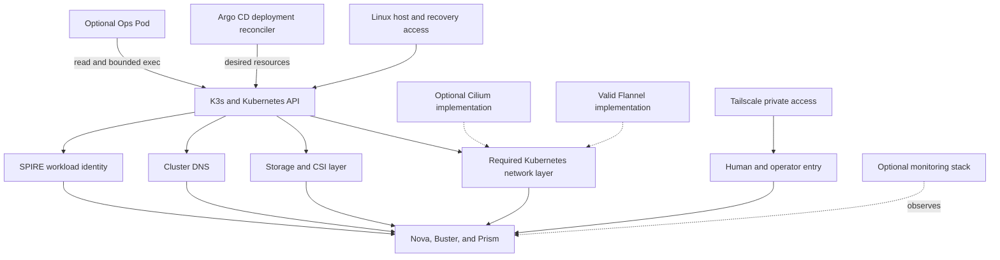

# Platform and Operations Architecture

Status: implemented in parts; host automation and live acceptance remain open
Audience: architecture reader, platform operator, maintainer, security reviewer
Owner: platform architecture and operations
Evidence: scripts/deploy.sh; scripts/deploy-cilium.sh; scripts/argocd-self-management.mjs; charts/ops-pod; gitops/platform
Applies to: current Kubernetes deployment and operations tooling
Last verified: source inspection on 2026-09-17

## Purpose

The pipeline needs a place to run, but it must not own the complete platform.
This page explains the surrounding platform and operations systems.

K3s hosts the workloads.
Cilium can replace the default Flannel network and enforce advanced policy.
Argo CD can replace direct Helm ownership with Git reconciliation.
Monitoring can collect metrics, logs, and dashboards.
The Ops Pod gives a separate security and analysis surface.

These systems affect availability and security.
They do not decide whether a Nova stage succeeds.

## Layer Map

Text version: The host supports K3s.
K3s supplies the API used by networking, storage, DNS, identity, and runtime workloads.
Flannel or Cilium can provide the required network layer.
Argo CD can reconcile resources into K3s.
Tailscale supplies selected private entry routes.
The optional Ops Pod inspects the platform through bounded Kubernetes rights.
The optional monitoring stack observes workloads without controlling their verdicts.

## Platform Boundary

The application architecture defines required behavior at each boundary.
The platform can replace an implementation when the replacement preserves that behavior.

For example, the pipeline needs service discovery and enforced traffic boundaries.
It does not require Nova Core to know the Cilium API.

The same rule applies to deployment ownership.
Argo CD can own a resource after a reviewed handover.
Nova Core does not know whether Helm or Argo CD created its Pod.

This separation permits a larger platform to grow around the pipeline.
It also prevents infrastructure controllers from becoming hidden lifecycle authorities.

## Host and K3s

K3s supplies the Kubernetes API, scheduling, service discovery, and container runtime integration.
The selected host must also provide storage, cgroup v2, kernel features, time synchronization, and recovery access.

The repository currently starts from an existing supported cluster.
It does not yet build a complete host from an empty machine.
This is a known product gap, not an undocumented operator step.

**Why K3s is outside Nova:** Cluster creation has machine-level authority and a different failure domain.
A pipeline run must never reconfigure its own control plane.

**Failure effect:** A K3s failure can stop every in-cluster role.
Off-cluster backups and an independent administration path must remain usable.

**Recovery rule:** Restore the platform before starting application reconciliation.
Do not use a cluster-dependent Ops Pod as the only recovery path.

> **Source evidence — current bootstrap boundary**
>
> [The deployment script installs platform services and roles into an existing cluster](https://github.com/datrab/kubeclaw/blob/85e73b1885f04a9494f388cf6622ad0bde2db447/scripts/deploy.sh#L1108-L1217).
>
> [IFR-01-001 tracks the missing empty-host automation](../status/open-issues.md#ifr-01-001).
>
> [The roadmap defines the required host-bootstrap and restore outcome](../status/roadmap.md#automated-host-bootstrap-and-recovery).

## Kubernetes Networking, Flannel, and Cilium

Cilium is an optional advanced network and policy implementation.
It can enforce traffic rules below the application and provide Cilium policy types.

Cilium is not part of Nova Core.
A conforming Flannel deployment can support the pipeline without Cilium.
It must enforce the required default-deny and allowed paths.

Flannel provides a smaller networking layer for the current cluster topology.
Cilium adds richer identity, observation, and policy features for the learning lab.
Neither implementation may change the meaning of a Nova stage result.

The current migration script treats first installation as a guarded cutover.
It checks old network sandboxes before installation.
It leaves the node cordoned until policy and negative-path tests pass.

**Why this design exists:** Changing the network layer can disconnect every workload at once.
Application deployment cannot safely hide that change inside a routine release.

**Failure effect:** DNS, service traffic, workload identity routes, and access paths can fail together.
An incorrect allow rule can also expose a protected service.

**Recovery rule:** Keep host access outside the affected dataplane.
Verify allowed and denied paths before the node returns to service.

> **Source evidence — guarded network ownership**
>
> [The Cilium installer distinguishes first cutover from later upgrades](https://github.com/datrab/kubeclaw/blob/85e73b1885f04a9494f388cf6622ad0bde2db447/scripts/deploy-cilium.sh#L7-L32).
>
> [The script installs Cilium, applies baseline policy, and keeps acceptance separate](https://github.com/datrab/kubeclaw/blob/85e73b1885f04a9494f388cf6622ad0bde2db447/scripts/deploy-cilium.sh#L33-L54).
>
> [The selected Cilium values explicitly replace the normal K3s Flannel CNI](https://github.com/datrab/kubeclaw/blob/85e73b1885f04a9494f388cf6622ad0bde2db447/my-values/infra/cilium-values.yaml#L24-L31).
>
> **Current limit:** Live cutover and negative connectivity evidence remain environment-specific acceptance work.

## Argo CD

Argo CD can own continuous deployment after an explicit handover.
It reads reviewed Git state and reconciles Kubernetes resources.

Argo CD is not required for Nova Core to compute a pipeline result.
An operator can deploy the same supported resources through the direct Helm path.
Only one controller may own each resource at one time.

The current platform tree separates infrastructure, data services, monitoring, Ops, and runtime applications.
It also disables automatic pruning for the root platform application.
Self-healing remains enabled for declared drift.

**Why this design exists:** Git provides a reviewable desired state and a durable deployment history.
Separation by project limits the destinations and resource types of each controller.

**Cost:** Git, Argo CD, and the cluster can disagree during an outage or partial handover.
Health also needs the resolved commit, not only a branch name.

**Failure effect:** Existing workloads can continue when Argo CD stops.
New reconciliation, drift repair, and deployment promotion stop.

**Recovery rule:** Restore one ownership path.
Do not let direct Helm and Argo CD reconcile the same resource.

> **Source evidence — deployment controller boundary**
>
> [The platform project limits source repositories, destinations, and cluster resource types](https://github.com/datrab/kubeclaw/blob/85e73b1885f04a9494f388cf6622ad0bde2db447/scripts/argocd-self-management.mjs#L15-L29).
>
> [The generated tree declares separate Tailscale, Ops, Redis, registry, and monitoring applications](https://github.com/datrab/kubeclaw/blob/85e73b1885f04a9494f388cf6622ad0bde2db447/scripts/argocd-self-management.mjs#L55-L139).
>
> [The root platform enables self-heal, disables prune, and rejects shared ownership](https://github.com/datrab/kubeclaw/blob/85e73b1885f04a9494f388cf6622ad0bde2db447/scripts/argocd-self-management.mjs#L182-L195).

## Monitoring

Monitoring is an optional platform layer.
The pipeline can run without Prometheus, Grafana, Loki, and Alloy.
Their absence reduces operational evidence and learning value.
It does not transfer pipeline authority.

The current stack separates four responsibilities:

| Component | Responsibility | Explicit non-responsibility |
| --- | --- | --- |
| Prometheus | Stores and queries platform metrics. | Does not own Nova lifecycle state. |
| Grafana | Presents metrics and Loki logs. | Does not prove a pipeline transition. |
| Loki | Stores retained workload logs. | Does not replace journals, receipts, or artifacts. |
| Alloy | Discovers Pod logs and sends them to Loki. | Does not decide log retention or run success. |

Prometheus uses a retained volume and a 15-day metric retention setting.
Loki uses a single retained filesystem volume and a 30-day log retention setting.
Alloy runs on each selected node and reads CRI logs.
It preserves the prior Promtail position file and sends records to Loki.

Grafana reads its administrator identity from an existing Secret.
Its current Service uses NodePort `30030`.
The platform operator must restrict that node route outside the chart.

Loki disables application authentication in the selected internal topology.
Network policy and namespace controls must therefore protect its service.
Alloy runs as root because it reads node log paths.
That host access makes Alloy a privileged observation boundary.

Alertmanager is disabled in the selected values.
The stack therefore does not claim a complete paging or incident-notification path.

Promtail remains declared only for a controlled handover.
Its node selector schedules no collector Pods after Alloy takes ownership.
This prevents two collectors from sending the same files during normal operation.

**Why this design exists:** Metrics, logs, and dashboards need different storage and query behavior.
Separating them also keeps displayed observations outside the canonical pipeline state.

**Failure effect:** Dashboards, alerts, queries, or new log delivery can stop.
Nova journals and Buster evidence remain authoritative when their own stores remain healthy.

**Recovery rule:** Restore collectors after their backends can accept data.
Use canonical run records to reconcile gaps instead of inventing missing lifecycle events.

> **Source evidence — optional monitoring stack**
>
> [Prometheus and Grafana declare retained storage, credentials, and metric retention](https://github.com/datrab/kubeclaw/blob/85e73b1885f04a9494f388cf6622ad0bde2db447/gitops/platform/values/prometheus.yaml#L1-L50).
>
> [Loki declares one retained filesystem deployment and its log retention period](https://github.com/datrab/kubeclaw/blob/85e73b1885f04a9494f388cf6622ad0bde2db447/gitops/platform/values/loki.yaml#L1-L33).
>
> [Alloy discovers node-local Pod logs, parses CRI records, and writes to Loki](https://github.com/datrab/kubeclaw/blob/85e73b1885f04a9494f388cf6622ad0bde2db447/gitops/platform/values/alloy.yaml#L30-L130).
>
> [The monitoring check verifies chart pins, storage, retention, and the collector handover](https://github.com/datrab/kubeclaw/blob/85e73b1885f04a9494f388cf6622ad0bde2db447/scripts/check-monitoring.mjs#L12-L87).

## Ops Pod

The Ops Pod is an optional security, analysis, and administration tool.
It is not a pipeline stage and does not own Nova lifecycle state.

The Pod can inspect selected namespaces, workloads, events, policies, Argo applications, and nodes.
Its local MCP service exposes read-only investigation tools. This tool policy is
not the Kubernetes permission boundary for the complete Pod.

Both containers use the same ServiceAccount. The MCP container receives a
rotating Kubernetes token for its read calls. By default, the chart also sets
`rbac.execNamespaces` to `[kubeclaw]`. This setting mounts a token and generated
kubeconfig into the Codex container and gives that ServiceAccount `get`, `list`,
and `create` access for Pod execution in `kubeclaw`. Code that runs in the Codex
container can therefore start commands in Pods in that namespace. It receives
the data and effective authority of the selected target container.

Set `rbac.execNamespaces` to `[]` when Codex must not receive this execution
path. This setting removes the namespace exec Role and RoleBinding. It also
removes the Kubernetes token and kubeconfig mounts from Codex. The MCP container
keeps its read token and selected read bindings. A prompt, a Codex plugin
capability label, or the MCP read-only tool list does not reduce Kubernetes RBAC.

The Ops Pod also depends on the cluster that it inspects.
It cannot serve as the only recovery tool for cluster loss or network-layer failure.

**Why this design exists:** Investigation needs stable tools and access that do not depend on an active agent session.
Separate rights make that access visible and reviewable.

**Failure effect:** Routine analysis and in-cluster assistance stop.
Pipeline execution can continue when its own dependencies remain healthy.

**Recovery rule:** Use the independent host or control-plane route first.
Restore the Ops Pod only after the cluster can schedule and mount it.

> **Source evidence — optional bounded analysis**
>
> [The chart defaults enable Codex Pod execution in `kubeclaw`](https://github.com/datrab/kubeclaw/blob/d8c38328ae305d431574aed008c4e1333e4b49f5/charts/ops-pod/values.yaml#L21-L28).
>
> [The shared ServiceAccount has read bindings and namespace-scoped exec bindings](https://github.com/datrab/kubeclaw/blob/d8c38328ae305d431574aed008c4e1333e4b49f5/charts/ops-pod/templates/rbac.yaml#L1-L92).
>
> [The workload mounts separate projected credentials into MCP and, when exec is enabled, Codex](https://github.com/datrab/kubeclaw/blob/d8c38328ae305d431574aed008c4e1333e4b49f5/charts/ops-pod/templates/workload.yaml#L34-L103).
>
> [The network policy limits cluster API and external HTTPS access](https://github.com/datrab/kubeclaw/blob/85e73b1885f04a9494f388cf6622ad0bde2db447/charts/ops-pod/templates/network.yaml#L1-L36).

## Tailscale at the Platform Boundary

Tailscale can expose selected interfaces to a private network.
Examples include Prism Studio, Argo CD, and the Ops Pod.

This platform use differs from the Buster exposure provider.
The provider creates a bounded test fixture route.
The platform routes support human and operator access.

Both uses need independent identity, DNS, route, and recovery checks.
A healthy operator does not prove that an application route is authorized.
A reachable route also does not prove that Nova can complete a pipeline run.

The showcase baseline requires Tailscale even when one run has no exposure stage.
See [Pipeline Dependencies](pipeline-dependencies.md#tailscale-required-platform-service-with-two-consumers) for the stage-level use.

## Ownership Matrix

| System | Primary owner | May stop pipeline work? | Owns pipeline verdict? |
| --- | --- | --- | --- |
| Host and K3s | Platform operator | Yes, for in-cluster work. | No. |
| Flannel or Cilium | Network operator | Yes, when required traffic fails. | No. |
| Argo CD | Deployment operator | Only when it owns the required deployment. | No. |
| Monitoring | Observability operator | No direct requirement. | No. |
| Tailscale operator | Access operator | Yes, in the showcase baseline. | No. |
| Ops Pod | Operations and security owner | No direct requirement. | No. |
| Nova Core | Pipeline owner | Yes. | Yes. |

## Expansion Rules for a Larger Platform

The platform can grow without weakening these boundaries.

- A new infrastructure controller must not write Nova run state.
- A new data service must name its owner, authority, backup, and restore group.
- A new access layer must keep human identity separate from workload identity.
- A new deployment controller must have exclusive resource ownership.
- A new analysis tool must receive explicit read or execution rights.
- Every replaceable component needs positive and negative acceptance checks.
- Every critical service needs an independent recovery path and retained evidence.

These rules make a short installation path possible later.
Automation can compose reviewed layers without hiding their authority or failure boundaries.

## Related Pages

- [Deployment and Trust](deployment-and-trust.md) explains workload identity, storage, grants, and service paths.
- [Pipeline Dependencies](pipeline-dependencies.md) explains services used directly by selected pipeline paths.
- [Install and Bootstrap](../use/install.md) gives the current deployment procedure and its prerequisites.
- [Recovery](../use/recovery.md) explains cluster loss and independent access.
- [Roadmap](../status/roadmap.md) records planned product and platform work.
