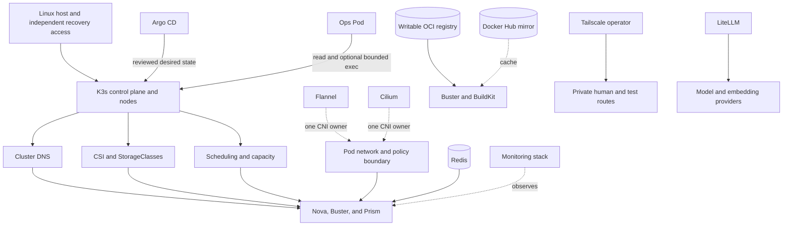

# Platform and Operations Architecture

Status: implemented in parts; host automation and live acceptance remain open
Audience: architecture reader, platform operator, maintainer, security reviewer
Owner: platform architecture and operations
Evidence: scripts/deploy.sh; scripts/platform-services.mjs; charts/ops-pod; gitops/platform; my-values/infra
Evidence revision: `5b6e1b97415ffefa4bb42bf2ae331f27597170b5`
Applies to: current Kubernetes platform and its supported deployment paths
Last verified: source inspection on 2026-09-20

## Purpose

KubeClaw needs a platform, but the pipeline does not own that platform.
This page explains the host, cluster, network, storage, deployment, build,
registry, access, model-gateway, monitoring, and operations layers around the
pipeline.

The distinction is important. A failed platform dependency can stop work, but
it must not invent a Nova stage result. A platform controller can create a Pod,
but it must not write Nova's lifecycle journal. This boundary keeps deployment
health, pipeline truth, and operational observations separate.

## Required, Conditional, and Optional Systems

| System | Current role | Requirement class | Pipeline authority |
| --- | --- | --- | --- |
| Linux host and K3s | Supply the Kubernetes control plane and nodes. | Required for this deployment. | None. |
| Cluster DNS, storage, scheduler, and one CNI | Supply basic Kubernetes behavior. | Required. | None. |
| Redis | Carries configured messages and projections. | Required by the showcase deployment. | Transport only. |
| Tailscale operator | Supplies private platform entry and bounded test exposure. | Required by the showcase deployment. | Route owner only. |
| Writable OCI registry | Receives tested images by immutable digest. | Required for the container-build path. | Artifact transport and storage only. |
| Rootless BuildKit | Builds and pushes an image for Buster's container-build provider. | Required for that suite. | Build worker only. |
| PostgreSQL | Stores LiteLLM state in the platform release. | Required when LiteLLM is enabled. | Database only. |
| LiteLLM | Routes the configured model and embedding requests. | Conditional platform service. | Model gateway only. |
| OCI pull-through mirror | Caches Docker Hub pulls. | Optional optimization. | Cache only. |
| Cilium | Can enforce the required network boundaries and add observability. | Optional CNI implementation; Flannel remains valid. | Network enforcement only. |
| Argo CD | Reconciles reviewed Git state. | Optional deployment owner. | Kubernetes desired state only. |
| Prometheus, Grafana, Loki, and Alloy | Collect and present observations. | Optional. | No pipeline authority. |
| Ops Pod | Gives a separate analysis and administration workspace. | Optional. | Kubernetes rights assigned to its ServiceAccount. |

**Decision:** Classify a service by the behavior that consumes it, not by where
it is installed.

**Reason:** Redis and Tailscale are platform services, but selected supported
pipeline paths depend on them. Monitoring is installed near them, but pipeline
correctness does not depend on a dashboard.

## Layer Map

Text version: the host supports K3s. K3s supplies scheduling, DNS, storage, and
the network used by workloads. One CNI owns the Pod network. Argo CD can own
deployment reconciliation. Redis, registries, BuildKit, Tailscale, PostgreSQL,
and LiteLLM support selected runtime paths. Monitoring and the Ops Pod remain
separate operational surfaces.

## Host and K3s Boundary

The repository starts with an existing supported Kubernetes cluster. It does
not turn an empty machine into a fully configured host. The host must already
provide a usable kernel, cgroup v2, time synchronization, storage prerequisites,
container networking prerequisites, and an administration route that does not
depend on the cluster workloads.

This is a product boundary, not a hidden manual step. The roadmap requires a
future host workflow to accept declared inputs, show a plan, support dry-run,
remain idempotent, report outputs, and prove rollback and recovery.

**Decision:** Keep host bootstrap outside Nova.

**Reason:** Host setup can change the control plane, kernel, storage, and
network of every run. A pipeline must not rebuild its own authority platform.

**Failure effect:** Loss of K3s can stop all in-cluster roles. It does not erase
off-cluster backups or make the Ops Pod an independent recovery path.

**Recovery rule:** Restore host and control-plane access first. Restore storage,
network, identity, and data services before application reconciliation.

> **Source evidence — present bootstrap boundary**
>
> [The deployment command installs services into a selected cluster and exposes explicit component switches](https://github.com/datrab/kubeclaw/blob/5b6e1b97415ffefa4bb42bf2ae331f27597170b5/scripts/deploy.sh#L1-L67).
>
> [The host-automation roadmap states the required planned result](../status/roadmap.md#automated-host-bootstrap-and-recovery).

## DNS, Storage, and Scheduling

Cluster DNS resolves service names used by Nova, Buster, Prism, Redis,
PostgreSQL, LiteLLM, registries, and internal proxies. A Pod that is running but
cannot resolve its required service is not ready for application work.

Storage has two different jobs:

- retained volumes hold authoritative or recoverable state;
- temporary volumes hold caches, unpacked work, or process-local files.

Do not replace one with the other. A registry cache can be cold after loss. A
Nova journal or Buster receipt store cannot be recreated from a cache.

The platform includes an adopted SMB CSI driver, but KubeClaw does not require
all installations to use SMB. A selected StorageClass must satisfy the access
mode, durability, topology, expansion, and recovery needs of its consumer. The
local writable registry is stricter: it requires `ReadWriteOncePod` so a second
writer or garbage-collection Pod cannot mount the same volume concurrently.

Scheduling must account for requests, limits, volume topology, CNI readiness,
and node prerequisites. The rootless BuildKit and browser runtime also need
specific kernel and cgroup features. A scheduler placement is therefore not an
acceptance result; readiness and functional checks must still pass.

**Capacity rule:** Alert before a retained volume becomes full. Expand or drain
the owner before recovery space is exhausted. Do not delete unknown files from
an owner-managed volume.

**DNS failure rule:** Diagnose CoreDNS and network reachability before changing
application endpoints. A retry with a changed service name can create a second
configuration fault.

> **Source evidence — storage and scheduling inputs**
>
> [Argo CD adopts the SMB CSI driver as a separate storage project](https://github.com/datrab/kubeclaw/blob/5b6e1b97415ffefa4bb42bf2ae331f27597170b5/scripts/platform-services.mjs#L3-L40).
>
> [The local registry requires an explicit StorageClass, capacity, and `ReadWriteOncePod`](https://github.com/datrab/kubeclaw/blob/5b6e1b97415ffefa4bb42bf2ae331f27597170b5/my-values/infra/registry-local.yaml#L1-L14).
>
> [Buster declares CPU, memory, ephemeral-storage, retained runtime state, and a dedicated cgroup subtree](https://github.com/datrab/kubeclaw/blob/5b6e1b97415ffefa4bb42bf2ae331f27597170b5/my-values/buster-values.yaml#L5-L19).

## One Network Owner: Flannel or Cilium

The pipeline requires working Pod networking and enforced traffic boundaries.
It does not require Nova Core to call the Cilium API. Flannel is a valid CNI for
a conforming installation. Cilium is an optional implementation that adds rich
policy and observation features for the learning lab.

Only one CNI can own the Pod network. The Cilium installation path treats the
first installation as a guarded cutover. It checks old network sandboxes,
cordons the affected node, applies the new layer, and keeps acceptance separate
from installation.

**Decision:** Keep the network contract implementation-neutral.

**Reason:** This permits a smaller Flannel deployment while preserving the same
required caller, destination, port, DNS, and denial behavior.

**Failure effect:** A CNI fault can break DNS, service traffic, identity paths,
and operator access together. An overbroad allow rule can expose a protected
service without stopping it.

**Recovery rule:** Keep host access outside the affected dataplane. Verify both
allowed and denied connections before returning a node to service.

> **Source evidence — guarded CNI ownership**
>
> [The installer separates first cutover from later Cilium updates](https://github.com/datrab/kubeclaw/blob/5b6e1b97415ffefa4bb42bf2ae331f27597170b5/scripts/deploy-cilium.sh#L7-L32).
>
> [The selected values explicitly disable the normal K3s CNI ownership](https://github.com/datrab/kubeclaw/blob/5b6e1b97415ffefa4bb42bf2ae331f27597170b5/my-values/infra/cilium-values.yaml#L24-L31).

## Argo CD and Exclusive Resource Ownership

Argo CD can reconcile KubeClaw after an explicit handover from direct Helm
ownership. The generated platform separates infrastructure, identity, data,
monitoring, Ops, and runtime applications into bounded projects.

One Kubernetes resource must have one deployment owner. Do not let an operator
run direct Helm updates while Argo CD reconciles the same resource. The platform
applications use `FailOnSharedResource=true` to reject part of that conflict.
The root application keeps self-heal but does not automatically prune every
resource.

**Decision:** Keep direct deployment and Git reconciliation as two supported
ownership modes, with an explicit handover.

**Reason:** Direct deployment supports bootstrap and repair. Git reconciliation
provides reviewable desired state and drift repair. Concurrent ownership would
make neither source authoritative.

**Failure effect:** Existing workloads can continue when Argo CD is down. New
reconciliation, promotion, and drift repair stop.

**Recovery rule:** Restore one owner, verify its exact Git commit, and reconcile
drift before enabling the other path for a later handover.

> **Source evidence — Git deployment boundary**
>
> [Platform projects restrict source repositories, destinations, and resource kinds](https://github.com/datrab/kubeclaw/blob/5b6e1b97415ffefa4bb42bf2ae331f27597170b5/scripts/argocd-self-management.mjs#L15-L29).
>
> [The platform tree separates Tailscale, Ops, Redis, registry, and monitoring applications](https://github.com/datrab/kubeclaw/blob/5b6e1b97415ffefa4bb42bf2ae331f27597170b5/scripts/argocd-self-management.mjs#L55-L139).
>
> [Adopted SPIRE and storage applications reject shared resource ownership](https://github.com/datrab/kubeclaw/blob/5b6e1b97415ffefa4bb42bf2ae331f27597170b5/scripts/platform-services.mjs#L24-L57).

## Rootless BuildKit

BuildKit is colocated with the Buster v2 runtime. It is not a central Nova
service. The Buster entrypoint validates one registry-client contract, writes a
private BuildKit configuration, starts `buildkitd` as UID 1000 through
RootlessKit, and waits until `buildctl debug workers` succeeds. The container
build provider then uses the Unix socket at
`/run/user/1000/buildkit/buildkitd.sock`.

The runtime uses host networking for RootlessKit and
`--oci-worker-no-process-sandbox`. This is a deliberate compatibility choice for
the rootless worker, not a claim that the whole Buster Pod has no isolation.
Submitted suites enter a separate UID and drop capabilities. The worker image
contains pinned BuildKit binaries, rootless UID/GID mappings, and the state
directory.

BuildKit state is a build cache. Buster job receipts and evidence have different
owners. Deleting the BuildKit cache can make builds slower; deleting Buster
state can break reconciliation.

| Concern | Current behavior | Operator consequence |
| --- | --- | --- |
| Endpoint | Local Unix socket inside the Buster Pod. | No cluster-wide unauthenticated BuildKit port exists. |
| Registry configuration | Derived from `registry-clients.v1`. | Endpoint, transport, trust, and credentials fail closed before startup. |
| Parallel work | Limited by Buster admission and provider limits. | Do not infer concurrency from Pod CPU alone. |
| Cache | Rootless BuildKit state directory. | Treat as replaceable performance state unless a deployment adds retention. |
| Logging | BuildKit writes its own startup log; provider output is bounded. | Inspect startup and provider diagnostics separately. |
| Shutdown | Entrypoint traps termination and stops worker and BuildKit. | Do not kill only one child and assume clean closure. |

The cluster preflight uses a temporary non-privileged BuildKit Pod. It verifies
an immutable image reference, the rootless worker, the socket, and required host
features. It deletes the probe afterward and reports a cleanup failure.

> **Source evidence — builder lifecycle**
>
> [The Buster entrypoint creates registry configuration, starts rootless BuildKit, waits for its worker, and owns shutdown](https://github.com/datrab/kubeclaw/blob/5b6e1b97415ffefa4bb42bf2ae331f27597170b5/docker/buster-runtime-entrypoint.sh#L4-L61).
>
> [The worker image pins BuildKit, rootless tools, user mappings, and runtime paths](https://github.com/datrab/kubeclaw/blob/5b6e1b97415ffefa4bb42bf2ae331f27597170b5/docker/Dockerfile.buster-runtime#L1-L78).
>
> [The host preflight explains and tests the required unprivileged-user and AppArmor boundary](https://github.com/datrab/kubeclaw/blob/5b6e1b97415ffefa4bb42bf2ae331f27597170b5/scripts/deploy.sh#L745-L875).

## Writable Local OCI Registry

`registry-local` is an anonymous HTTP laboratory service. It is not the future
production registry design. The service listens inside the cluster, exposes
port 5001 to clients, stores blobs on one retained volume, disables delete and
upload purging, and uses a single `Recreate` replica.

The explicit `http-lab` transport name prevents an operator from mistaking
plain HTTP for ordinary production HTTPS. Credentials are forbidden on that
transport. A production registry must add HTTPS, authentication, credential and
CA rotation, backup, verified restore, controlled garbage collection, capacity
alerts, and negative access tests. That work remains on the roadmap.

**Outage behavior:** Existing immutable images already present on nodes can
continue. New pushes, manifest verification, and pulls that need the registry
stop. Do not change an expected digest to bypass an outage.

**Capacity behavior:** Delete is disabled, so space does not recover
automatically. Measure the volume, stop writers before storage repair, and use a
registry-aware backup or garbage-collection procedure. Do not remove blob files
directly.

> **Source evidence — explicit laboratory limits**
>
> [The manifest declares anonymous HTTP, one retained writer, disabled delete, bounded resources, and `/v2/` probes](https://github.com/datrab/kubeclaw/blob/5b6e1b97415ffefa4bb42bf2ae331f27597170b5/my-values/infra/registry-local.yaml#L1-L106).
>
> [Deployment requires explicit storage input and never enables the lab registry by default](https://github.com/datrab/kubeclaw/blob/5b6e1b97415ffefa4bb42bf2ae331f27597170b5/scripts/deploy.sh#L1187-L1219).
>
> [The production-grade registry roadmap gives the required acceptance boundary](../status/roadmap.md#production-grade-local-oci-registry).

## Docker Hub Pull-Through Mirror

The mirror is a separate anonymous cache for Docker Hub. It does not accept the
writable registry's role, and it does not mirror GHCR or private registries.
The mirror has a 5 GiB volume, one replica, and an upstream URL of
`https://registry-1.docker.io`.

A running mirror does not configure any client. The operator must project the
same contract into BuildKit and the node runtime. The registry-client generator
rejects a mirror that collides with `docker.io`, shares the writable registry
host, or contains credentials.

| Event | Result | Safe response |
| --- | --- | --- |
| Cache hit | Client can receive retained upstream content. | Verify the requested image digest as usual. |
| Cold miss with healthy upstream | Mirror downloads and retains the content. | Allow normal bounded pull time. |
| Cold miss with failed upstream | Pull fails. | Restore upstream reachability or use an already verified immutable source. |
| Mirror loss | Cached acceleration disappears. | Recreate cache; do not restore it as authoritative artifact state. |
| Cache corruption | Digest verification must fail. | Stop routing clients to the mirror, replace the cache, and test a cold pull. |

The manifest does not declare a TTL or automatic capacity policy. The operator
must observe volume use and define retirement outside the cache Pod. Normal
operation does not need a backup because upstream content and digests are authoritative.

> **Source evidence — cache boundary and client routing**
>
> [The mirror manifest names Docker Hub, its volume, resources, probes, and service port](https://github.com/datrab/kubeclaw/blob/5b6e1b97415ffefa4bb42bf2ae331f27597170b5/my-values/infra/registry-mirror.yaml#L1-L94).
>
> [The client generator keeps writable registry and mirror routes separate and creates BuildKit and node configuration](https://github.com/datrab/kubeclaw/blob/5b6e1b97415ffefa4bb42bf2ae331f27597170b5/scripts/registry-client-config.mjs#L57-L104).

## Git Source and the Absent Git Mirror

The supported source path resolves an exact Git revision and verifies the
resulting source identity. The repository contains no supported Git mirror
service. The OCI pull-through cache does not cache Git.

This absence is intentional documentation of the current state. Do not point
Git clients at an undeclared local service and call it a supported mirror. A
future mirror must define freshness, exact-revision behavior, corruption
detection, authentication, capacity, failback, and recovery before adoption.

**Decision:** Prefer exact source identity over an implicit local cache.

**Cost:** A source fetch can depend on the upstream Git service until the
roadmap item delivers this function.

## Redis, PostgreSQL, and Tailscale

Redis is a password-protected standalone service with a retained 2 GiB volume
in the selected platform values. It carries transport messages and projections.
It is not Nova's lifecycle authority. Loss can delay delivery and health
projections, but recovery must replay from the owning journals where that path
exists.

The platform PostgreSQL release is also standalone. It holds the `litellm`
database, reads credentials from `postgresql-secrets`, and uses a retained 1 GiB
volume. Prism has a separate PostgreSQL ownership and recovery model. Never
restore one database into the other.

The Tailscale operator creates private platform routes through the `tailscale`
IngressClass. Its OAuth Secret and tags belong to the operator. This use is
different from the Buster Tailscale exposure fixture, which creates and later
releases a bounded test route.

> **Source evidence — service ownership**
>
> [Redis values declare authentication, standalone topology, persistence, and resource bounds](https://github.com/datrab/kubeclaw/blob/5b6e1b97415ffefa4bb42bf2ae331f27597170b5/gitops/platform/values/redis.yaml#L1-L21).
>
> [Platform PostgreSQL declares the LiteLLM database, existing Secret keys, persistence, and resources](https://github.com/datrab/kubeclaw/blob/5b6e1b97415ffefa4bb42bf2ae331f27597170b5/gitops/platform/values/postgresql.yaml#L1-L25).
>
> [Tailscale values declare the ingress class, tags, and bounded resources](https://github.com/datrab/kubeclaw/blob/5b6e1b97415ffefa4bb42bf2ae331f27597170b5/gitops/platform/values/tailscale-operator.yaml#L1-L21).

## LiteLLM Model Gateway

LiteLLM is a platform gateway, not a pipeline state store. The current public
configuration declares one Vertex AI embedding route for OpenClaw memory search.
It reads the master key from the environment and a Google service-account file
from a Secret mount. The Deployment also enables database-backed model state
through `DATABASE_URL` in `litellm-secrets`.

The service listens on port 4000 and is currently exposed as a NodePort. Startup,
readiness, and liveness use different health paths and budgets. The deployment
renderer hashes the exact config bytes into the Pod template. A configuration
change therefore causes a rollout instead of leaving old Pods with stale bytes.

| Boundary | Current owner | Failure effect |
| --- | --- | --- |
| Route names and provider parameters | LiteLLM configuration | Requests to an absent route fail. |
| Master key | `litellm-secrets` | Authenticated gateway use fails. |
| Vertex credential | `google-sa-key` | Vertex requests fail. |
| Database URL and schema | LiteLLM plus platform PostgreSQL | Stateful gateway startup or operation fails. |
| Consumer readiness | Each role's dependency probe | A role can remain unready without changing an existing run result. |

The current file declares embeddings only. Do not infer a general chat-model
route from the presence of the gateway. Provider quotas, upstream availability,
and credential rotation remain external operational dependencies.

> **Source evidence — gateway configuration and rollout**
>
> [The current model list, provider location, master-key source, and parameter behavior](https://github.com/datrab/kubeclaw/blob/5b6e1b97415ffefa4bb42bf2ae331f27597170b5/my-values/infra/litellm-config.yaml#L1-L14).
>
> [The Deployment declares secrets, database mode, port, probes, mounts, and resources](https://github.com/datrab/kubeclaw/blob/5b6e1b97415ffefa4bb42bf2ae331f27597170b5/my-values/infra/litellm-deployment.yaml#L1-L97).
>
> [The renderer binds the mounted configuration to a rollout checksum](https://github.com/datrab/kubeclaw/blob/5b6e1b97415ffefa4bb42bf2ae331f27597170b5/scripts/render-litellm-deployment.mjs#L1-L22).

## Monitoring Is Optional and Non-Authoritative

Prometheus stores metrics. Grafana presents metrics and logs. Loki stores
retained logs. Alloy discovers Pod logs and sends them to Loki. None of these
components proves a pipeline transition.

The selected values keep Prometheus data for 15 days and Loki data for 30 days.
Loki disables application authentication in the selected internal topology, so
network and namespace controls must protect it. Alloy reads node CRI logs as a
privileged observation boundary. Promtail remains configured only for a
controlled handover and does not run normal collector Pods.

Alertmanager is disabled. The repository therefore does not claim a complete
paging path.

**Failure effect:** Dashboards, log delivery, or queries can stop while Nova
journals and Buster evidence remain valid.

**Recovery rule:** Restore the storage backend before collectors. Reconcile
gaps from canonical records; never manufacture missing lifecycle events from a
dashboard.

> **Source evidence — retention and collector boundary**
>
> [Prometheus and Grafana values declare retained storage, credentials, and metric retention](https://github.com/datrab/kubeclaw/blob/5b6e1b97415ffefa4bb42bf2ae331f27597170b5/gitops/platform/values/prometheus.yaml#L1-L50).
>
> [Loki values declare retained filesystem storage and log retention](https://github.com/datrab/kubeclaw/blob/5b6e1b97415ffefa4bb42bf2ae331f27597170b5/gitops/platform/values/loki.yaml#L1-L33).
>
> [Alloy values declare CRI discovery, processing, and Loki delivery](https://github.com/datrab/kubeclaw/blob/5b6e1b97415ffefa4bb42bf2ae331f27597170b5/gitops/platform/values/alloy.yaml#L30-L130).

## Ops Pod: Tool Policy Is Not Kubernetes Authority

The Ops Pod is an optional security, analysis, and administration workspace. Its
MCP service exposes read-oriented investigation tools. That tool list is not the
permission boundary for the complete Pod.

Both containers use the same ServiceAccount. The MCP container receives a
rotating token for read calls. By default, `rbac.execNamespaces` contains
`kubeclaw`. The chart then mounts another token and generated kubeconfig into the
Codex container and grants `get`, `list`, and `create` on `pods/exec` in that
namespace. Code in the Codex container can therefore start a command in a
selected Pod and receive the target container's output.

Set `rbac.execNamespaces` to an empty list when Codex must not receive this path.
That removes the namespace Role, RoleBinding, token, and kubeconfig mount. It
does not remove the MCP container's separately selected read access.

**Decision:** Document effective Kubernetes RBAC, not the most restrictive user
interface in the Pod.

**Reason:** A prompt, plugin label, or MCP method list cannot reduce rights that
the ServiceAccount and mounted credentials already grant.

**Recovery rule:** Keep a host or control-plane route outside the Ops Pod. The
Pod cannot repair the cluster that must schedule it.

> **Source evidence — effective operations authority**
>
> [Chart defaults enable namespace-scoped Codex execution in `kubeclaw`](https://github.com/datrab/kubeclaw/blob/5b6e1b97415ffefa4bb42bf2ae331f27597170b5/charts/ops-pod/values.yaml#L21-L28).
>
> [RBAC separates cluster reads from namespace-scoped Pod execution](https://github.com/datrab/kubeclaw/blob/5b6e1b97415ffefa4bb42bf2ae331f27597170b5/charts/ops-pod/templates/rbac.yaml#L1-L92).
>
> [The workload mounts different projected credentials into MCP and Codex](https://github.com/datrab/kubeclaw/blob/5b6e1b97415ffefa4bb42bf2ae331f27597170b5/charts/ops-pod/templates/workload.yaml#L34-L103).

## Dependency and Recovery Order

Use this order because each later layer needs behavior from the earlier layer.

1. Restore independent host and control-plane access.
2. Restore K3s, time, node capacity, DNS, storage drivers, and exactly one CNI.
3. Restore required Secrets without printing their values.
4. Restore SPIRE and its Workload API when protected routes are enabled.
5. Restore Redis and each separately owned PostgreSQL service.
6. Restore the writable registry and verify its content before new builds.
7. Start Buster and its rootless BuildKit worker.
8. Start LiteLLM when enabled and verify the selected route, not only `/health`.
9. Start Nova, Buster, Prism, and their protected proxies.
10. Verify allowed and denied network paths and durable writes.
11. Enable Tailscale entry routes.
12. Restore monitoring and the Ops Pod after their dependencies are stable.

Readiness at one layer does not prove the next layer. For example, registry
`/v2/` readiness does not prove push authorization, and a healthy LiteLLM
process does not prove that Vertex credentials or quota permit one embedding.

## Failure and Recovery Matrix

| Failure | Direct effect | State that remains authoritative | First safe action |
| --- | --- | --- | --- |
| K3s control plane unavailable | In-cluster scheduling and API work stop. | Off-cluster backups and source repositories. | Restore independent control-plane access. |
| DNS unavailable | Service-name connections fail. | Existing owner stores. | Repair DNS and CNI; keep configured identities unchanged. |
| Storage backend unavailable | Selected retained stores stop or become unsafe. | Verified backups and unaffected stores. | Fence writers before storage recovery. |
| Redis unavailable | Transport and projections stop. | Nova, Worker, Buster, and Prism owner records. | Restore Redis, then replay or reconcile from owners. |
| Writable registry unavailable | New push, verification, or cold pull stops. | Existing immutable digests and node-local images. | Restore registry and verify manifests. |
| Pull-through mirror unavailable | Cache acceleration stops. | Upstream registry and digest pins. | Bypass only through an approved client configuration. |
| BuildKit unavailable | Container builds stop. | Source snapshot and prior image artifacts. | Inspect BuildKit startup and host prerequisites. |
| Tailscale unavailable | Private entry and exposure routes fail. | Cluster-local services and owner state. | Restore operator identity and route readiness. |
| LiteLLM unavailable | Configured model calls stop. | Pipeline journals and already stored artifacts. | Restore gateway, database, credentials, and one real route. |
| Argo CD unavailable | Reconciliation and drift repair stop. | Current cluster resources and Git desired state. | Restore one deployment owner and compare exact revision. |
| Monitoring unavailable | Observations and dashboards degrade. | Canonical lifecycle and evidence records. | Restore backends, then collectors. |
| Ops Pod unavailable | In-cluster analysis is unavailable. | Platform and pipeline services. | Use independent administration access. |

## Expansion Rules

- A new infrastructure controller must not write Nova run state.
- A new data service must name its owner, schema, writer, readers, capacity,
  backup group, restore order, and deletion rule.
- A new cache must state which authority can rebuild it.
- A new access layer must keep human identity separate from workload identity.
- A new deployment controller must receive exclusive resource ownership.
- A new analysis tool must document its effective runtime, filesystem, network,
  secret, and Kubernetes rights.
- Every critical service needs positive, negative, outage, and recovery checks.

These rules support the long-term goal: a large platform that can be installed
and extended in a few clear steps without hiding authority or recovery costs.

## Related Pages

- [Communication Architecture](communication.md) maps every important connection.
- [Data and State](data-and-state.md) maps persistence, retention, and backup ownership.
- [Security and Trust](security-and-trust.md) maps threats, identities, secrets, and least privilege.
- [Deployment and Trust](deployment-and-trust.md) maps roles to workloads.
- [Pipeline Dependencies](pipeline-dependencies.md) explains stage-level dependency effects.
- [Install and Bootstrap](../use/install.md) gives the supported deployment procedure.
- [Recovery](../use/recovery.md) gives the operator recovery sequence.
