# Plugin Runtime: From Package Bytes To Bounded Execution

Status: implemented design; host-kernel acceptance remains environment-specific
Audience: platform developer, plugin author, security engineer, operator
Owner: plugin-runtime maintainers
Evidence: skills/common/plugin-runtime/contracts/plugin-system/v2/plugin-system-v2.schema.json; skills/common/plugin-runtime/foundation; skills/nova/core/execution; skills/nova/core/state/plugins.ts; tests/verification/contracts/check-plugin-system-v2-registry.mjs; tests/verification/contracts/check-plugin-system-v2-capability-security.mjs; tests/verification/contracts/check-plugin-system-v2-phase11.mts
Evidence revision: `4f089958db97a551f406c157d774bda143a38946`
Applies to: `pipeline-plugin-v2`, `pipeline-platform.v2`, and the current Nova plugin host
Last verified: source and contract inspection on 2026-09-19

## Purpose

A plugin package contains code, but the presence of code does not give it authority.
The runtime moves a package through a sequence of narrower decisions:

1. The operator places exact package bytes in an installation root.
2. Discovery reads the manifest and records the package identity without importing code.
3. Registry construction validates references and assigns each public name to one owner.
4. Platform policy selects registrations, providers, configuration, and grants.
5. Activation checks the bytes again before it loads an executable export.
6. Each invocation receives a time-limited lease and only its required grants.
7. Core owns durable state, effects, recovery, and final lifecycle decisions.

This page explains that complete path. It focuses on runtime behavior and safety.
[Extension Contracts](../extend/contracts.md) explains how an author selects one of the five registration contracts.
[Deployment and Trust](deployment-and-trust.md) explains the surrounding workload and network controls.

## The Runtime In One View

```mermaid
flowchart LR
    A[Installed package bytes] --> B[Inert discovery]
    B --> C[Validated registry snapshot]
    C --> D[Enabled registration set]
    D --> E[Provider and grant resolution]
    E --> F[Configuration validation]
    F --> G[Integrity recheck and import audit]
    G --> H[Activation]
    H --> I[Lease-bound invocation]
    I --> J[Core-owned effects, events, and state]
    J --> K[Durable recovery record]
```

Text version: the host starts with operator-installed bytes. It reads data before it executes code. It then validates global ownership, resolves policy, validates configuration, checks integrity, and activates only the selected runtime surfaces. An invocation can use external authority only through a valid lease and a matching grant. Core records the result and the recovery facts.

This order is a safety property. The runtime must know *which bytes*, *which owner*, and *which authority* before plugin code can run.

> **Source evidence — the complete preparation order**
>
> [`prepareRuntime()` performs discovery, registry construction, enablement, grant resolution, configuration validation, and activation in that order](https://github.com/datrab/kubeclaw/blob/4f089958db97a551f406c157d774bda143a38946/skills/nova/core/execution/engine-runtime.ts#L29-L50).

## Four Identities That Must Not Be Confused

The system uses related identities for different questions.

| Identity | Question that it answers | Can it change without the others changing? |
| --- | --- | --- |
| Package ID | Which logical plugin package owns this code? | No for the same logical package. A different ID is a different owner. |
| Package version | Which compatibility release did the author declare? | Yes. A version can change with new bytes. Bytes can also change incorrectly without a version change. |
| Content digest | Which exact package paths and bytes did the host inspect? | It changes when a path or file content changes. |
| Registration ID | Which stage, observer, adapter, test provider, or report adapter inside the package is this? | Yes. One package can own many registrations. |

A global runtime registration name uses `package-id:registration-id`.
A stage also owns a globally unique stage type because pipeline definitions select a stage by type.
Test providers additionally own a unique contract ID.
Report adapters are different: more than one adapter can support the same format, so a resolved plan must select an exact adapter identity.

The package version communicates author intent. It does not prove byte identity.
The digest binds the actual package tree. It does not prove who published the bytes.
Trust evidence supplies the separate policy decision about the source.

**Why use separate identities:** one overloaded version string cannot safely answer ownership, compatibility, integrity, and registration-selection questions.

**Cost:** snapshots and diagnostic records carry more identity fields. That cost makes recovery and audit decisions explicit.

> **Source evidence — identity contracts**
>
> [The manifest contract fixes the API version, validates a semantic package version, and declares the five registration arrays](https://github.com/datrab/kubeclaw/blob/4f089958db97a551f406c157d774bda143a38946/skills/common/plugin-runtime/contracts/plugin-system/v2/plugin-system-v2.schema.json#L410-L448).
>
> [Package and registration provenance bind source, trust evidence, canonical path, surface, and registration ID](https://github.com/datrab/kubeclaw/blob/4f089958db97a551f406c157d774bda143a38946/skills/common/plugin-runtime/contracts/plugin-system/v2/plugin-system-v2.schema.json#L874-L930).

## Runtime Roles And Their Authority

The plugin system is shared, but each role uses only the surfaces that it owns.

| Runtime role | Uses | Owns | Must not own |
| --- | --- | --- | --- |
| Plugin Foundation | Discovery, validation, registry, configuration, isolation, and package functions | Mechanism and fail-closed checks | Pipeline scheduling or product policy |
| Nova Core | Stages, observers, and capability adapters | Graph execution, leases, lifecycle state, effects, and recovery records | Specialist judgment inside a stage |
| Buster | Test providers and report adapters | Test-plan execution and evidence interpretation | Nova run lifecycle |
| Platform operator | Installation roots, trust roots, provider choices, grants, active adapters, observer configuration, and isolation root | Which code and authority can enter a runtime | Project stage logic |
| Pipeline author | Installed stage types and stage input/configuration | Desired project workflow within admitted choices | Installation, trust, provider choice, or grant expansion |
| Plugin registration | Its declared function and namespaced data | Returned contract value and requested operations | Direct canonical lifecycle transitions or undeclared authority |

This split lets Foundation stay role-neutral. Nova can use the same package facts without making Foundation understand stage scheduling. Buster can use provider registrations without giving a test provider Nova authority.

> **Source evidence — role-neutral boundary**
>
> [Foundation explicitly excludes pipeline policy and worker or specialist execution meaning](https://github.com/datrab/kubeclaw/blob/4f089958db97a551f406c157d774bda143a38946/skills/common/plugin-runtime/foundation/BOUNDARIES.md#L1-L5).

## Discovery Reads Data, Not Executable Code

Discovery accepts one or more operator-configured installation roots.
It performs these steps:

1. Resolve every installation and trusted root with `realpath`.
2. Reject a missing root, a non-directory, or two configured paths that resolve to the same root.
3. Inspect direct child directories only.
4. Keep a child only when it contains `plugin.json`.
5. Sort candidates to make discovery order stable.
6. Resolve each package directory with `realpath` and reject a repeated canonical package path.
7. Parse and freeze the manifest.
8. Calculate a content digest.
9. Establish provenance and trust scope from operator policy.

Discovery does not import a registration module. A malicious module cannot run only because the package appears below an installation root.

The direct-child rule is important. Nested packages do not appear automatically.
A directory without `plugin.json` is not a plugin package.
Symlink aliases cannot create two logical copies of one package because canonical paths are compared.

**Rejected alternative:** recursive search would make an unrelated nested directory part of the runtime by accident. It would also make precedence depend on filesystem layout.

**Failure behavior:** discovery stops for the complete runtime when a root, manifest, digest, duplicate path, or trust decision is invalid. It does not return a partial trusted set.

> **Source evidence — deterministic inert discovery**
>
> [Root canonicalization, direct-child selection, sorting, manifest parsing, digest calculation, and provenance creation are one discovery flow](https://github.com/datrab/kubeclaw/blob/4f089958db97a551f406c157d774bda143a38946/skills/common/plugin-runtime/foundation/registry/discovery.ts#L13-L137).

## Manifest, Schema, And Path Admission

The manifest is a closed JSON object. Unknown manifest fields fail validation.
Its `apiVersion` must be exactly `pipeline-plugin-v2`.
At least one registration array must contain an entry.

Each registration declares inert metadata:

- a local registration ID;
- a package-relative module path;
- an exported function name;
- the schemas and contract fields for that registration type;
- required capabilities, where the surface supports capabilities.

The registry resolves every module and schema path below the canonical package root.
An absolute path, `..` escape, symlink escape, missing target, directory target, or other outside reference fails admission.
Schema documents are parsed as JSON and checked as JSON Schema 2020-12 before their validators are compiled.

Each schema document has its own `$id` namespace and its own validator lifetime.
Two packages can use the same schema `$id` because their validators remain in different snapshot scopes.
Arbitrary cross-package `$ref` resolution is not supported.
The runtime keeps both a validator that does not add defaults and a resolver that adds schema defaults to a structured clone.

**Why schemas belong to the snapshot:** a later registry build must not change how an existing run validates its input or result.

**Important limit:** manifest and schema admission proves structure. It does not prove that the export exists, that code has no import-time effects, or that the function behaves correctly. Activation handles export and import checks later.

> **Source evidence — path and schema admission**
>
> [Registry construction resolves referenced files by canonical path and requires each target to remain a file inside its package](https://github.com/datrab/kubeclaw/blob/4f089958db97a551f406c157d774bda143a38946/skills/common/plugin-runtime/foundation/registry/build.ts#L33-L70).
>
> [Manifest parsing and per-document schema compilation fail with structured registry errors](https://github.com/datrab/kubeclaw/blob/4f089958db97a551f406c157d774bda143a38946/skills/common/plugin-runtime/foundation/registry/schema.ts#L62-L116).

## Integrity And Provenance

The package digest is SHA-256 over every regular file in the package tree.
The digest input includes the relative path length, relative path, byte length, and file bytes.
Files are sorted before hashing. Symlinks are forbidden.
This means a renamed file changes the digest even when its content does not change.

The trust decision has two paths:

- A package below a trusted built-in root receives `trusted_first_party` scope and `builtin_allowlist` evidence.
- Any other package must match an allowed source digest or a verified attestation. It receives `isolated_external` scope.

An attestation digest is evidence that an operator-selected verifier accepted an attestation.
The runtime does not treat the package content digest as a publisher signature.
The trust record keeps the verifier, method, verification time, source reference, canonical path, and resolution time.

**Why built-in and external trust differ:** first-party packages can run in the host process after import checks. External stages and observers must cross an operating-system isolation boundary.

**Cost:** the operator must maintain digest or attestation policy and retain exact old package bytes for recoverable runs.

> **Source evidence — digest and trust decision**
>
> [The digest covers sorted paths and bytes and rejects symlinks](https://github.com/datrab/kubeclaw/blob/4f089958db97a551f406c157d774bda143a38946/skills/common/plugin-runtime/foundation/registry/digest.ts#L6-L27).
>
> [Discovery maps built-in roots, digest allowlists, and verified attestations to distinct provenance records](https://github.com/datrab/kubeclaw/blob/4f089958db97a551f406c157d774bda143a38946/skills/common/plugin-runtime/foundation/registry/discovery.ts#L62-L103).

## External Package Installation

Installation is an operator action. The installer accepts an already local, bundled source tree. It does not download a package.

Before publication, it verifies:

- the actor appears in the operator allowlist;
- the canonical source is not empty and is not a local or file reference;
- the source digest or attestation matches policy;
- file count and total size remain below configured limits;
- there are no symlinks, unusual file types, `node_modules`, or package lifecycle scripts;
- every bundled JavaScript or TypeScript file has valid syntax;
- the manifest, references, schemas, and registry rules are valid;
- the expected content digest matches;
- the external package contains no capability adapter.

The installer copies files to a private staging directory, validates the copy again, and then publishes it with a rename.
The installed directory name includes a safe package ID, package version, and digest prefix.
If the exact target already exists with the same digest, installation is idempotent.
A different digest at that target is a conflict.

The installer does not execute lifecycle scripts or imports.
Syntax checks do not prove module resolution, export shape, or runtime behavior.
The final rename gives atomic visibility. The implementation does not claim a power-loss durability guarantee for installation.

> **Source evidence — install admission and publication**
>
> [External installation enforces authority, source trust, package limits, bundled dependencies, syntax checks, double validation, and rename publication](https://github.com/datrab/kubeclaw/blob/4f089958db97a551f406c157d774bda143a38946/skills/common/plugin-runtime/foundation/packages/install.ts#L43-L218).

## Registry Construction And Global Ownership

Discovery returns packages. Registry construction turns them into a single ownership snapshot.

The snapshot contains maps for packages, stages, observers, adapters, capability providers, test providers, test-provider contracts, report adapters, report formats, and compiled schemas.

The build rejects these conflicts:

| Conflict | Reason for rejection |
| --- | --- |
| Repeated package ID | Two packages would claim one logical owner. |
| Repeated `package-id:registration-id` | One registration lookup would have two results. |
| Repeated stage type | A pipeline stage type must have one owner. |
| Repeated test-provider contract ID | Buster must resolve one provider contract without discovery-order precedence. |
| Repeated port name in one test provider | The provider input or output would be ambiguous. |
| Unsupported evidence default | A plan could request evidence that the provider did not declare. |

Multiple adapters may declare the same capability. Multiple report adapters may declare the same report format.
The registry keeps these candidates because policy or the resolved Buster plan must make the exact selection later.
Discovery order never resolves this ambiguity.

The final snapshot uses read-only map and set wrappers, freezes nested registration data, and records a deterministic snapshot digest.
The snapshot digest covers package versions and digests plus the stable registration ownership facts.

**Rejected alternative:** “first package wins” would make authority depend on directory order. The current design turns ambiguity into an explicit error or selection task.

> **Source evidence — build and freeze**
>
> [The builder validates global ownership and constructs every registry index](https://github.com/datrab/kubeclaw/blob/4f089958db97a551f406c157d774bda143a38946/skills/common/plugin-runtime/foundation/registry/build.ts#L183-L220).
>
> [Package, registration, stage, and provider-contract conflicts fail before snapshot creation](https://github.com/datrab/kubeclaw/blob/4f089958db97a551f406c157d774bda143a38946/skills/common/plugin-runtime/foundation/registry/build.ts#L223-L317).

## Compatibility Is Explicit And Conservative

The current host accepts only `pipeline-plugin-v2` manifests.
It does not infer compatibility from a close version number.
Registration input, output, configuration, checkpoints, provider contracts, and report contract versions carry their own schema or contract identity.

For an existing run, package version and digest are pinned in the run snapshot.
Recovery compares the current package set and runtime configuration with that snapshot.
Without an explicit administrative package-upgrade chain, a version or digest mismatch stops recovery.
An upgrade record must form an exact chain from the stored identity to the current identity and must keep the package ID and API version.

This policy prefers a safe stop over an automatic reinterpretation of durable state.
The rejected alternative is “use the newest compatible-looking package.” That choice could run recovery with bytes that never produced the stored records.

> **Source evidence — compatibility during recovery**
>
> [Recovery verifies the package set, runtime configuration, pinned versions and digests, and every explicit upgrade edge](https://github.com/datrab/kubeclaw/blob/4f089958db97a551f406c157d774bda143a38946/skills/nova/core/execution/engine-snapshots.ts#L23-L66).

## Selection Is Separate From Installation

An installed package is only available for selection. It is not automatically active.

Nova enables:

- the owner of each stage type present in the pipeline definition;
- every observer named in platform configuration;
- every adapter listed in `activeAdapters`;
- each adapter that provides a capability required by one of those registrations;
- providers required by those adapters, until no new dependency is found.

An enabled registration must exist.
A provider mapping must name an installed adapter that declares the capability.
A required capability without a selected provider fails.
If multiple providers exist and the operator did not select one, resolution reports ambiguity rather than choosing by order.
An adapter dependency cycle fails before activation.

**Why selection is separate:** installation answers “may these bytes be considered?”
Selection answers “does this runtime need this registration?”
This prevents unused installed code from gaining runtime authority.

> **Source evidence — explicit and transitive selection**
>
> [Nova derives the initial enabled set from configured stages, observers, and adapters](https://github.com/datrab/kubeclaw/blob/4f089958db97a551f406c157d774bda143a38946/skills/nova/core/execution/engine-runtime.ts#L44-L50).
>
> [Capability resolution adds provider dependencies, rejects missing or ambiguous providers, and detects adapter cycles](https://github.com/datrab/kubeclaw/blob/4f089958db97a551f406c157d774bda143a38946/skills/common/plugin-runtime/foundation/registry/capabilities.ts#L75-L217).

## Capabilities And Grants

A capability is a named class of external authority, such as reading an artifact, calling an HTTP origin, executing a command, or resolving a secret.
A registration declaration states what it needs.
An adapter declaration states what it can provide.
Platform policy selects the provider and gives each registration bounded constraints.
All three statements must agree.

The current vocabulary defines the allowed operation names, resource types, and required constraint fields for each capability.
Unknown capabilities fail admission.
The platform can never grant core-only capabilities to a plugin.
These capabilities include lifecycle mutation, scheduler advance, canonical event mutation, and registry mutation.

The resolver rejects:

- a missing grant for a declared requirement;
- a grant for a capability that the registration did not request;
- a grant for a disabled registration;
- an unknown or core-only capability;
- an invalid provider;
- invalid, empty, repeated, relative, or non-canonical constraint values.

At invocation time, the host checks the exact operation, resource type, canonical resource identity, and capability-specific constraints.
For example, HTTP uses canonical origins, command execution uses an exact executable plus an allowed working root, and secret access uses an allowed secret name.
`secrets.read` also uses the confidential effect path, which keeps its result out of the normal durable effect record.

There is no wildcard syntax. A value such as `*` is only the literal string
`*`; it does not expand authority. Some resource families use an explicit
hierarchy rule. A state namespace can be equal to or below an allowed
namespace. A repository path or working directory must remain below a
canonical allowed root. A `kubernetes.exposure` namespace requires the exact
allowed prefix or that prefix followed by `-`. All other rows below use exact
equality unless the row states a prefix rule.

The following table gives the complete resource-matching model.

| Capability family | Resource match |
| --- | --- |
| `report.evidence.read` | The run ID must equal one item in `allowedRunIds`. |
| `state.read`, `state.append` | The namespace must equal an allowed namespace or be below it. |
| `artifacts.read`, `artifacts.write`, `test.plan.evidence`, `demo.handoff` | The request payload namespace must equal one item in `allowedNamespaces`. |
| `runtime.dispatch` | The canonical agent ID must equal one item in `allowedAgents`. |
| `git.repository.read` | The repository-relative path must remain below an allowed prefix. Root-wide operations use the exact `.` identity. |
| `git.workspace.create`, `git.workspace.remove` | The existing repository must remain below an allowed root. The potential workspace path must remain below an allowed workspace root. |
| `git.commit`, `git.merge`, `git.sync` | The canonical existing repository or workspace must remain below an allowed root. |
| `network.http` | The parsed HTTP or HTTPS origin must equal one item in `allowedOrigins`. |
| `secrets.read` | The secret name must equal one item in `allowedNames`. |
| `command.execute` | The executable must match exactly. The canonical working directory must remain below an allowed root. |
| `container.build` | Repository, scratch, context, and Dockerfile paths must stay in their allowed relationship. The platform must match exactly. |
| `kubernetes.fixture` | The namespace prefix must match exactly. A prepare manifest must remain below an allowed workspace root. |
| `kubernetes.exposure` | The namespace must equal an allowed prefix or start with that prefix plus `-`. |
| `lint.execute` | Project ID must match. Working and policy paths must remain below their separate allowed roots. |
| `test.plan.execute` | The resource and payload repository must resolve to the same existing path below an allowed root. |
| `operator.receipt`, `operator.request`, `transport.publish` | The target must equal one item in `allowedTargets`. |
| `signal.wait` | The signal type and authorized issuer ID must each match their own allowlist. |
| `telemetry.emit` | The event identity must start with an allowed event prefix. |
| `agent.events.subscribe` | The source must equal one item in `allowedSources`. |

**Why declaration and grant are both required:** a manifest is an author request, not operator permission. A broad platform grant must also not give an undeclared power to a registration.

> **Source evidence — vocabulary and denial rules**
>
> [The capability vocabulary defines 28 plugin-facing capabilities and four permanently core-only capabilities](https://github.com/datrab/kubeclaw/blob/4f089958db97a551f406c157d774bda143a38946/skills/common/plugin-runtime/foundation/registry/capability-vocabulary.ts#L37-L127).
>
> [Constraint validation requires exact fields and canonical paths, prefixes, and origins](https://github.com/datrab/kubeclaw/blob/4f089958db97a551f406c157d774bda143a38946/skills/common/plugin-runtime/foundation/registry/capability-vocabulary.ts#L130-L197).
>
> [Nova checks the resource-specific constraint again for every capability invocation](https://github.com/datrab/kubeclaw/blob/4f089958db97a551f406c157d774bda143a38946/skills/nova/core/execution/authorization.ts#L39-L130).

## Configuration Ownership And Precedence

Configuration comes from two authorities.

The platform file owns installation roots, trust policy, provider choices, grants, and runtime configuration.
Runtime configuration includes adapters, observers, isolation, storage, time limits, effect locks, and administrative issuers.
The pipeline definition owns the selected stage types and each stage's configuration and input.

Relative installation, trusted, storage, and isolation paths resolve against the platform configuration file directory.
The platform schema is closed. Unknown top-level fields fail validation.
The loader reports every schema or format rejection as
`PLATFORM_CONFIG_INVALID` and includes the canonical file and validator detail.

Each registration owns its configuration schema:

- a configured stage must exist, be enabled, and accept its stage configuration;
- an enabled observer or adapter receives its configured object, or an empty object when no object is present;
- an unknown configured observer or adapter fails;
- a test-provider configuration resolves through the provider contract and records the configuration-schema digest;
- schema defaults are added only by a dedicated resolver that clones the input first.

There is no hidden merge of arbitrary project and platform objects.
The pipeline cannot select trust roots, providers, or grants.
The platform cannot silently replace a stage type's registration-owned schema.

Nova stores the effective runtime configuration in `run-snapshot.json` so that
recovery can compare the same provider, grant, adapter, observer, and isolation
choices. The snapshot keeps the configured values; this path does not redact
configuration and it does not produce a separate sanitized “effective config”
view. A configuration must therefore contain secret references, such as names
used through `secrets.read`, and not secret values. Registration schemas can
reject unwanted fields, but the host does not infer which arbitrary field is
sensitive.

This stored configuration is a deliberate subset, not a copy of the complete
platform file. It contains `providers`, `grants`, `adapters`,
`activeAdapters`, `observers`, and optional `isolation`. Package provenance
separately records the selected package identity and its trust evidence. The
graph snapshot separately retains each stage configuration and input. The
snapshot configuration does not include installation roots, trusted roots,
external trust policy, the platform `schemaVersion`, `storageRoot`,
`shutdownTimeoutMs`, `effectLockTtlMs`, `orchestratorIssuerId`, or
`administrativeDecisionIssuers`. Recovery uses the current platform values at
those boundaries unless a separate durable record binds the relevant identity.
The snapshot comparison cannot by itself detect a change to an omitted field.
An operator must therefore review these changes as recovery and security
changes, not as harmless host tuning.

> **Source evidence — configuration boundary**
>
> [The platform type lists every host-owned configuration family](https://github.com/datrab/kubeclaw/blob/4f089958db97a551f406c157d774bda143a38946/skills/common/plugin-runtime/foundation/config/platform.ts#L6-L28).
>
> [The loader validates the closed platform schema and resolves its host paths relative to the configuration file](https://github.com/datrab/kubeclaw/blob/4f089958db97a551f406c157d774bda143a38946/skills/common/plugin-runtime/foundation/config/platform.ts#L30-L70).
>
> [Registration-owned validators reject missing owners and invalid stage, observer, adapter, and test-provider values](https://github.com/datrab/kubeclaw/blob/4f089958db97a551f406c157d774bda143a38946/skills/common/plugin-runtime/foundation/registry/configuration.ts#L28-L121).
>
> [Runtime preparation defines the exact platform-configuration subset that enters the immutable run record](https://github.com/datrab/kubeclaw/blob/4f089958db97a551f406c157d774bda143a38946/skills/nova/core/execution/engine-runtime.ts#L23-L42).
>
> [The graph snapshot retains its nodes as complete stage definitions](https://github.com/datrab/kubeclaw/blob/4f089958db97a551f406c157d774bda143a38946/skills/nova/core/execution/graph.ts#L13-L19).
>
> [The stage-definition contract includes registration-owned `config` and `input`](https://github.com/datrab/kubeclaw/blob/4f089958db97a551f406c157d774bda143a38946/skills/common/plugin-runtime/sdk/src/generated/contracts.ts#L446-L468).
>
> [The immutable registry record retains effective provider, grant, adapter, observer, isolation, package, and stage-owner choices](https://github.com/datrab/kubeclaw/blob/4f089958db97a551f406c157d774bda143a38946/skills/nova/core/execution/engine-snapshots.ts#L123-L134).

## Import Audit Is An Admission Check, Not The Runtime Sandbox

Before trusted first-party code enters the host process, activation runs every stage, observer, and adapter export in each enabled package through a separate audit process.
It performs the audit between two package-digest checks.

The audit process:

- runs with Node permission mode and read access only;
- blocks filesystem writes, subprocess creation, workers, sockets, DNS, HTTP, timers, `fetch`, and WebSocket construction;
- blocks selected process-global operations;
- records global values, working directory, environment, process title, and umask before import;
- imports the module and verifies that the named export is a function;
- rejects detected changes to those recorded process and global values;
- has a 30-second host timeout.

The second digest check detects package changes that occur during the audit window.

This audit finds a broad set of import-time side effects. It is not proof that later function execution is harmless. Trusted code executes in the host process after activation and must still use the capability context for external operations.

**Why audit all runtime exports in an enabled package:** an enabled package is the integrity unit. Auditing only one selected export could leave an unaudited sibling module inside the same admitted byte identity.

> **Source evidence — import admission**
>
> [Activation checks package integrity, audits trusted imports, and checks integrity again before any import](https://github.com/datrab/kubeclaw/blob/4f089958db97a551f406c157d774bda143a38946/skills/common/plugin-runtime/foundation/registry/activation.ts#L103-L137).
>
> [The audit child blocks side-effect APIs and verifies the requested export and process-global state](https://github.com/datrab/kubeclaw/blob/4f089958db97a551f406c157d774bda143a38946/skills/common/plugin-runtime/foundation/registry/import-audit-child.mjs#L9-L121).

## Activation Is Fail-Closed

Activation receives an immutable snapshot and an enabled registration set.
It does not activate every installed package.

For trusted first-party registrations, it imports the module and requires the named export to be a function.
For external stages and observers, it creates an invocation wrapper that starts an isolated child only when the host invokes the registration.
An external invocation must receive a bounded plugin context.

External capability adapters are rejected.
An adapter can have startup state, readiness, dependency calls, cleanup, and shutdown behavior. A one-call isolated wrapper cannot preserve those semantics safely.
The current runtime therefore requires a future persistent isolated adapter host before it can support external adapters.

Adapter startup is transactional. Dependencies start first. Every adapter must activate and become ready. A startup failure rolls back the adapters that already started.
Shutdown and startup have host-owned time limits.

**Rejected alternative:** returning a partially activated registry would make behavior depend on which asynchronous import failed first. The caller receives either the complete selected registry or an error.

> **Source evidence — activation modes and current boundary**
>
> [Activation selects direct import or isolated invocation from trust scope and rejects external adapters](https://github.com/datrab/kubeclaw/blob/4f089958db97a551f406c157d774bda143a38946/skills/common/plugin-runtime/foundation/registry/activation.ts#L47-L100).
>
> [Adapter startup resolves dependencies, validates configuration, waits for readiness, and rolls back on failure](https://github.com/datrab/kubeclaw/blob/4f089958db97a551f406c157d774bda143a38946/skills/nova/core/execution/adapter-startup.ts#L21-L62).

## Invocation Leases

Activation says that a function can exist in the runtime.
A lease says that one invocation can use its context now.

An invocation lease binds:

- a unique lease ID;
- the run, stage, and attempt identity;
- exact registration provenance;
- its grants;
- wall-time, memory, and CPU limits;
- issue and expiry times;
- active or revoked status.

The context checks the lease before a capability call, event emission, or state access.
Expiry uses a strict boundary: the lease is invalid at or after `expiresAt`.
Revocation is permanent and idempotent.
Core revokes the lease when an attempt finishes and aborts the related signal on cancellation or timeout.

A plugin must not retain the context and use it after completion.
Possession of an old JavaScript object does not preserve authority because every operation checks the live lease object.

> **Source evidence — lease contract and enforcement**
>
> [The contract binds attempt, registration, grants, limits, time, and revocation facts](https://github.com/datrab/kubeclaw/blob/4f089958db97a551f406c157d774bda143a38946/skills/common/plugin-runtime/contracts/plugin-system/v2/plugin-system-v2.schema.json#L942-L1011).
>
> [`RevocableLease` denies revoked, invalid, and expired contexts and records permanent revocation](https://github.com/datrab/kubeclaw/blob/4f089958db97a551f406c157d774bda143a38946/skills/nova/core/execution/lease.ts#L6-L35).

## Isolation For External Stages And Observers

Each external invocation gets a new process boundary.
The host resolves the package and module to canonical paths and requires the module to remain inside the package.
It verifies that the argument and contract can be serialized before launch.

The isolated child receives:

- read access to the trusted child loader and the package tree;
- no native Node add-ons;
- a V8 heap limit derived from the lease;
- a native supervisor with resource and syscall limits;
- a dedicated cgroup-v2 child with a page-aligned memory limit and disabled swap;
- a line-framed JSON protocol for invocation, capability requests, events, results, and errors.

The child does not receive direct capability implementations.
It sends a capability request to the parent. The parent calls the same bounded context that trusted code uses.
This keeps grants and resource matching in the trusted host.

The protocol limits a line to 256 KiB and buffered output to 1 MiB.
It limits serialized values to 1 MiB, stderr to 64 KiB, and concurrent pending requests to 64.
A result is not accepted while capability or event requests remain pending.

Cancellation or wall-time expiry starts termination with `SIGTERM`.
After one second, the host kills the cgroup tree and sends `SIGKILL`.
After another second without process closure, the session reports a cleanup timeout.
The cgroup cleanup also checks whether the kernel recorded an out-of-memory kill.

**Host prerequisites:** this path needs the built native launcher and Linux x86-64 syscall support.
It also needs Landlock, seccomp, readable process-child information, and a correctly delegated cgroup-v2 subtree.
A protocol test alone does not prove those kernel controls on a deployment host.

> **Source evidence — process and protocol boundary**
>
> [The isolation runner creates the cgroup, starts the native supervisor with limited reads and no add-ons, and always closes the cgroup](https://github.com/datrab/kubeclaw/blob/4f089958db97a551f406c157d774bda143a38946/skills/common/plugin-runtime/foundation/isolation/runner.ts#L16-L58).
>
> [The session bounds messages, routes capabilities through the parent context, rejects undrained work, and escalates process termination](https://github.com/datrab/kubeclaw/blob/4f089958db97a551f406c157d774bda143a38946/skills/common/plugin-runtime/foundation/isolation/session.ts#L43-L165).
>
> [The cgroup controller validates delegation, applies an exact memory ceiling, disables swap, kills the full group, and detects OOM termination](https://github.com/datrab/kubeclaw/blob/4f089958db97a551f406c157d774bda143a38946/skills/common/plugin-runtime/foundation/isolation/cgroup.ts#L13-L59).

## Plugin State Ownership

Plugin state is not a mutable private file owned by plugin code.
Nova stores it as an append-only journal.

Each journal instance is bound to exact registration provenance.
Its namespace has the fixed form `plugin.<package-id>.<registration-id>`.
An entry contains a monotonic sequence, optional attempt identity, entry type, optional entry-schema version, idempotency key, time, and JSON payload.

The host rejects:

- an entry for another namespace;
- an entry whose provenance differs from the journal owner;
- a sequence that does not match journal order;
- reuse of an idempotency key with different content.

Reuse of the same idempotency key with the same content returns the existing entry.
Readers reconstruct current meaning by projecting the append-only entries.

The registration provenance includes the package digest. A replacement package cannot silently become the writer of the old registration's state.
An explicit upgrade must define how the new identity interprets or replaces that state.

**Why append-only state:** a crash cannot leave an in-place object half updated, and recovery can explain how a state was derived. The cost is retention and projection work.

> **Source evidence — state ownership and idempotency**
>
> [`PluginStateJournal` binds one namespace to one registration provenance and enforces sequence and idempotency](https://github.com/datrab/kubeclaw/blob/4f089958db97a551f406c157d774bda143a38946/skills/nova/core/state/plugins.ts#L12-L140).
>
> [The canonical state-entry contract fixes its ownership and replay fields](https://github.com/datrab/kubeclaw/blob/4f089958db97a551f406c157d774bda143a38946/skills/common/plugin-runtime/contracts/plugin-system/v2/plugin-system-v2.schema.json#L1155-L1177).

## Effects And Durable Authority

A plugin asks for an effect through a capability adapter. It does not mark the effect complete by changing lifecycle state.
Nova creates an effect identity, checks the grant, records intent, invokes the selected adapter, and records a receipt.
Resource locks and fencing tokens prevent an expired owner from acting as the current owner of the same resource.

This separation matters during a crash.
A retry can inspect durable intent and a receipt.
It does not assume that a missing in-memory return value means that no external action occurred.
Confidential capability results use a separate path and do not enter the normal durable payload record.

The plugin runtime therefore contains two different lease concepts:

- an invocation lease limits one plugin call;
- a fenced resource lock coordinates an external resource across calls and recovery.

They solve different problems and must not be treated as interchangeable.

> **Source evidence — durable effect ownership**
>
> [Nova constructs the effect journal and resource-lock manager and records requested, accepted, completed, and failed effect facts](https://github.com/datrab/kubeclaw/blob/4f089958db97a551f406c157d774bda143a38946/skills/nova/core/execution/engine-runtime.ts#L53-L87).
>
> [The contract requires monotonically fenced resource locks with active, released, or expired state](https://github.com/datrab/kubeclaw/blob/4f089958db97a551f406c157d774bda143a38946/skills/common/plugin-runtime/contracts/plugin-system/v2/plugin-system-v2.schema.json#L1140-L1153).

## Replacement, Disablement, And Removal

Replacement is not an in-place overwrite.
A new package has a new digest and a digest-specific installation directory.
New runtime preparation can select it, but an existing run remains pinned to its original package identities and configuration.

A safe replacement sequence is:

1. Install and admit the new bytes as a separate immutable package identity.
2. Stop new selection of the old registration.
3. Drain active invocations, observer delivery, adapter work, and recoverable runs that still need the old identity.
4. Record any explicit package upgrade decision that permits a blocked run to use the new identity.
5. Move or transform registration-owned state only through an owner-defined procedure.
6. Keep old bytes while a journal, checkpoint, snapshot, or recovery decision can still reference them.
7. Remove the old package only after those references and external resources are retired.

Disablement means that policy no longer enables a registration. It does not delete bytes or durable state.
Removal moves one direct installation-root child to a private trash directory and deletes the tombstone.
The removal function rejects paths outside the direct installation root.

The caller owns authorization and drain checks. The removal function does not inspect active runs, state journals, external credentials, or resources.
Removal is therefore a final filesystem action, not a complete lifecycle manager.

> **Source evidence — removal boundary**
>
> [`removeInstalledPackage()` accepts only a direct installation-root child and performs rename-before-delete](https://github.com/datrab/kubeclaw/blob/4f089958db97a551f406c157d774bda143a38946/skills/common/plugin-runtime/foundation/packages/install.ts#L220-L234).
>
> [Run recovery refuses silent byte replacement and permits only an exact recorded upgrade chain](https://github.com/datrab/kubeclaw/blob/4f089958db97a551f406c157d774bda143a38946/skills/nova/core/execution/engine-snapshots.ts#L28-L66).

## Failure And Recovery Map

Registry failures use a stable `RegistryError.code` value and a frozen detail object.
The current error vocabulary is:

| Area | Codes |
| --- | --- |
| Root and package admission | `REGISTRY_ROOT_INVALID`, `REGISTRY_MANIFEST_INVALID`, `REGISTRY_PACKAGE_DUPLICATE`, `REGISTRY_PACKAGE_UNTRUSTED` |
| Package integrity and references | `REGISTRY_PACKAGE_INTEGRITY_MISMATCH`, `REGISTRY_REFERENCE_FORBIDDEN`, `REGISTRY_REFERENCE_MISSING` |
| Ownership | `REGISTRY_STAGE_OWNER_CONFLICT`, `REGISTRY_REGISTRATION_CONFLICT`, `REGISTRY_TEST_PROVIDER_CONTRACT_CONFLICT`, `REGISTRY_REGISTRATION_MISSING` |
| Provider policy | `REGISTRY_ADAPTER_PROVIDER_CONFLICT`, `REGISTRY_CAPABILITY_PROVIDER_INVALID`, `REGISTRY_CAPABILITY_PROVIDER_MISSING`, `REGISTRY_CAPABILITY_PROVIDER_AMBIGUOUS`, `REGISTRY_ADAPTER_CYCLE` |
| Capability policy | `REGISTRY_CAPABILITY_FORBIDDEN`, `REGISTRY_CAPABILITY_UNKNOWN`, `REGISTRY_CAPABILITY_CONSTRAINT_INVALID`, `REGISTRY_CAPABILITY_DENIED`, `REGISTRY_CAPABILITY_UNREQUESTED` |
| Import, activation, and values | `REGISTRY_EXECUTOR_INVALID`, `REGISTRY_IMPORT_SIDE_EFFECT`, `REGISTRY_ACTIVATION_FAILED`, `REGISTRY_RESULT_INVALID` |

The import-audit child also uses three internal protocol markers.
`REGISTRY_IMPORT_AUDIT_MODULE_REQUIRED` means that the parent omitted the
module path. `REGISTRY_IMPORT_AUDIT_EXPORT_REQUIRED` means that it omitted the
export name. `REGISTRY_IMPORT_AUDIT_OK` is the bounded success marker; it is not
an error. The parent converts a missing marker, invalid output, timeout, or
child failure into the public import or activation failure.

The package installer uses these exact admission codes:

| Boundary | Codes | Safe response |
| --- | --- | --- |
| Operator and source | `PLUGIN_INSTALL_OPERATOR_UNAUTHORIZED`, `PLUGIN_INSTALL_CANONICAL_SOURCE_INVALID`, `PLUGIN_INSTALL_SOURCE_DIGEST_UNTRUSTED`, `PLUGIN_INSTALL_ATTESTATION_UNVERIFIED` | Use an authorized operator and one immutable, policy-approved source identity. |
| Package tree | `PLUGIN_INSTALL_FILE_COUNT_LIMIT`, `PLUGIN_INSTALL_SIZE_LIMIT`, `PLUGIN_INSTALL_FILE_TYPE_FORBIDDEN`, `PLUGIN_INSTALL_SYMLINK_FORBIDDEN`, `PLUGIN_INSTALL_DEPENDENCIES_MUST_BE_BUNDLED` | Rebuild the bundle within declared limits. Do not relax traversal or file-type checks for one package. |
| Executable content | `PLUGIN_INSTALL_SCRIPTS_FORBIDDEN`, `PLUGIN_INSTALL_MODULE_FORMAT_INVALID`, `PLUGIN_INSTALL_MODULE_INVALID`, `PLUGIN_INSTALL_EXTERNAL_ADAPTER_UNSUPPORTED` | Remove lifecycle scripts, use supported bundled modules, correct syntax, or use a supported external stage or observer surface. |
| Publication | `PLUGIN_INSTALL_DIGEST_MISMATCH`, `PLUGIN_INSTALL_TARGET_CONFLICT` | Recalculate the immutable package identity or select the already installed identical target. Never overwrite conflicting bytes. |

Removal adds `PLUGIN_REMOVE_OUTSIDE_INSTALLATION_ROOT`. It protects the final
filesystem action from an incorrect or nested target.

External-stage and external-observer isolation uses the following exact groups:

| Boundary | Codes | Safe response |
| --- | --- | --- |
| Host prerequisites | `ISOLATION_SANDBOX_NOT_BUILT`, `ISOLATION_CGROUP_REQUIRED`, `ISOLATION_CGROUP_ROOT_INVALID`, `ISOLATION_CGROUP_NOT_DELEGATED`, `ISOLATION_PAGE_SIZE_UNAVAILABLE`, `ISOLATION_PAGE_SIZE_INVALID`, `ISOLATION_MEMORY_LIMIT_INVALID` | Provision and verify the host. Do not run the external package directly in the trusted host as a fallback. |
| Scope setup and cleanup | `ISOLATION_CGROUP_SETUP_FAILED`, `ISOLATION_CGROUP_SETUP_CLEANUP_FAILED`, `ISOLATION_CGROUP_LIMIT_MISMATCH`, `ISOLATION_CGROUP_CLEANUP_FAILED`, `ISOLATION_CLEANUP_FAILED`, `ISOLATION_TREE_TERMINATION_FAILED`, `ISOLATION_PROCESS_CLEANUP_TIMEOUT` | Stop admission, retain diagnostics, and prove tree termination before another invocation. |
| Package and surface | `ISOLATION_MODULE_OUTSIDE_PACKAGE`, `ISOLATION_EXPORT_INVALID`, `ISOLATION_SURFACE_UNSUPPORTED`, `ISOLATION_PIPE_FAILED` | Correct the admitted package path, export, supported surface, or host pipe. Do not widen the package root. |
| JSON boundaries | `ISOLATION_INVOCATION_NOT_SERIALIZABLE`, `ISOLATION_INVOCATION_TOO_LARGE`, `ISOLATION_RESPONSE_NOT_SERIALIZABLE`, `ISOLATION_RESPONSE_TOO_LARGE`, `ISOLATION_RESULT_NOT_SERIALIZABLE`, `ISOLATION_RESULT_TOO_LARGE` | Keep the invocation, each host response, and the final result inside the JSON and one-mebibyte boundary. A circular value, a top-level undefined result, or an oversized encoded message cannot cross the process boundary. |
| Framed protocol | `ISOLATION_PROTOCOL_INIT_REQUIRED`, `ISOLATION_PROTOCOL_INVALID_MESSAGE`, `ISOLATION_PROTOCOL_INVALID_JSON`, `ISOLATION_PROTOCOL_INVALID_UTF8`, `ISOLATION_PROTOCOL_INPUT_LIMIT`, `ISOLATION_PROTOCOL_LINE_LIMIT`, `ISOLATION_PROTOCOL_OUTPUT_LIMIT`, `ISOLATION_PROTOCOL_TRUNCATED` | Terminate the child and correct its protocol implementation. Do not accept a partial message or result. |
| Relayed requests | `ISOLATION_PROTOCOL_CAPABILITY_INVALID`, `ISOLATION_PROTOCOL_EVENT_INVALID`, `ISOLATION_RPC_LIMIT`, `ISOLATION_RPC_NOT_DRAINED`, `ISOLATION_SESSION_CLOSED` | Reject the request or result. The child must finish all bounded capability and event calls before it returns. |
| Child outcome | `ISOLATED_PLUGIN_CANCELLED`, `ISOLATED_PLUGIN_TIMEOUT`, `ISOLATED_PLUGIN_STDERR_LIMIT`, `ISOLATED_PLUGIN_MEMORY_LIMIT`, `ISOLATED_PLUGIN_FAILED`, `ISOLATED_PLUGIN_EXITED` | Preserve the controlled attempt outcome. Retry only through Nova policy and only after effect reconciliation when external work can exist. |

`REGISTRY_SCHEMA_NOT_COMPILED` identifies an internal lookup for a schema that
the admitted snapshot did not compile. Registry construction or configuration
validation stops; the runtime must not continue with an unvalidated value.

`REGISTRY_ADAPTER_PROVIDER_CONFLICT` belongs to the declared public type.
The current resolver does not emit it.
It uses missing, invalid, ambiguous, and cycle codes for active provider failures.

Installation errors use the `PLUGIN_INSTALL_*` family.
They distinguish actor, source, attestation, digest, file, size, syntax, script, dependency, adapter, and target failures.
Removal uses `PLUGIN_REMOVE_OUTSIDE_INSTALLATION_ROOT` for its path boundary.

Isolation errors distinguish setup from execution.
`ISOLATION_*` reports host, cgroup, protocol, serialization, and cleanup failures.
`ISOLATED_PLUGIN_*` reports cancellation, timeout, stderr limit, plugin failure, exit, and memory-limit outcomes.
State and recovery use `PLUGIN_STATE_*` and `RECOVERY_*` families.
Their suffix identifies the failed ownership, sequence, idempotency, package, graph, or configuration invariant.

> **Source evidence — registry error vocabulary**
>
> [The typed registry error list is the source for public registry admission and activation codes](https://github.com/datrab/kubeclaw/blob/4f089958db97a551f406c157d774bda143a38946/skills/common/plugin-runtime/foundation/registry/errors.ts#L1-L37).
>
> [The installer throws bounded operator, trust, tree, syntax, adapter, digest, and publication diagnostics](https://github.com/datrab/kubeclaw/blob/4f089958db97a551f406c157d774bda143a38946/skills/common/plugin-runtime/foundation/packages/install.ts#L43-L234).
>
> [The isolation session defines protocol, RPC, child-outcome, and cleanup diagnostics](https://github.com/datrab/kubeclaw/blob/4f089958db97a551f406c157d774bda143a38946/skills/common/plugin-runtime/foundation/isolation/session.ts#L43-L165).

| Phase | Representative failure | Safe result | Recovery owner |
| --- | --- | --- | --- |
| Root discovery | Invalid root or canonical alias | No package set | Operator fixes installation roots. |
| Trust | Unknown digest or invalid attestation | Package remains untrusted | Operator changes bytes or approved trust policy. |
| Manifest | Invalid JSON, unknown field, wrong API version | Package is not admitted | Package author fixes and republishes bytes. |
| References | Missing file or package escape | Registry build stops | Package author fixes the package tree. |
| Ownership | Duplicate ID, stage type, or provider contract | No snapshot | Operator removes the conflict or author renames the surface. |
| Capability policy | Unknown capability, missing provider, excess grant, cycle | No granted registry | Operator fixes providers and grants. |
| Configuration | Missing owner or schema rejection | No activation | Pipeline author or operator fixes the owning configuration. |
| Integrity | Digest differs after discovery or audit | No activation | Operator restores the exact bytes and investigates mutation. |
| Import audit | Side effect, timeout, or invalid export | No trusted import | Author makes imports inert and exports the required function. |
| Adapter startup | Dependency, readiness, or timeout failure | Started adapters roll back | Operator checks adapter config and dependency health. |
| External launch | Missing sandbox or cgroup delegation | Invocation does not start | Host operator provisions and verifies kernel prerequisites. |
| External protocol | Oversize, malformed, truncated, or undrained message | Child is terminated | Author fixes protocol behavior; operator retains diagnostics. |
| Invocation | Expired or revoked lease | Capability and state calls fail | Core decides retry, wait, repair, or final failure. |
| Recovery | Package, config, graph, or provenance mismatch | Recovery stops before execution | Operator restores pinned inputs or supplies an authorized upgrade. |
| Removal | Package is outside the direct installation root | No deletion | Caller resolves the exact admitted package and repeats drain checks. |

These failures are intentionally fail-closed.
The runtime does not keep a partly valid registry or silently reduce requested authority.
An operator can remove a missing optional plugin from the selected configuration.
Once selected, it must pass the complete admission path.

## What The Runtime Guarantees

The implemented design provides these source-level guarantees:

- discovery does not import executable registration modules;
- exact package bytes have a deterministic digest;
- the runtime records trust scope and trust evidence separately from integrity;
- global ownership conflicts stop registry creation;
- provider choice and grants are explicit;
- the platform cannot grant an undeclared capability;
- the pipeline cannot expand platform authority;
- trusted imports pass a bounded side-effect audit before host import;
- external stages and observers use a per-invocation operating-system boundary;
- invocation authority expires and can be permanently revoked;
- plugin state is append-only, idempotent, and registration-owned;
- existing runs remain pinned to their package and configuration facts;
- removal cannot target an arbitrary nested or outside path.

These guarantees do not mean that every deployment host has passed live kernel checks.
They also do not make plugin code logically correct.
Contract tests prove runtime behavior in their test environments. A deployment must separately verify cgroup delegation, Landlock, seccomp, process cleanup, filesystem permissions, and retained package bytes.

> **Source evidence — focused verification**
>
> [Registry tests exercise schema validation, grants, duplicate roots, digest mutation, import side effects, and invalid exports](https://github.com/datrab/kubeclaw/blob/4f089958db97a551f406c157d774bda143a38946/tests/verification/contracts/check-plugin-system-v2-registry.mjs#L1-L323).
>
> [Capability-security tests exercise unrequested grants, invalid constraints, ambiguous providers, adapter cycles, and core-only capabilities](https://github.com/datrab/kubeclaw/blob/4f089958db97a551f406c157d774bda143a38946/tests/verification/contracts/check-plugin-system-v2-capability-security.mjs#L1-L466).
>
> [External-package and isolation tests cover operator authority, source identity, package trust, cancellation, crash behavior, and the external-adapter rejection](https://github.com/datrab/kubeclaw/blob/4f089958db97a551f406c157d774bda143a38946/tests/verification/contracts/check-plugin-system-v2-phase11.mts#L1-L297).

## A Practical Trace

When a pipeline contains stage type `example.build`, follow this trace:

1. Find the package root below an installation root.
2. Confirm that its frozen manifest declares `example.build` on one stage registration.
3. Confirm the package ID, version, digest, source, trust scope, and trust evidence.
4. Find `example.build` in the registry stage map and record its registration provenance.
5. Confirm that no other package claimed the stage type.
6. List its required capabilities.
7. For each capability, identify the exact selected adapter and its transitive dependencies.
8. Confirm that platform policy grants only the declared capability and valid resource constraints.
9. Validate the stage configuration through its package-owned schema.
10. Check whether trust scope selects direct or isolated activation.
11. At invocation, inspect the attempt identity, lease expiry, limits, and grants.
12. Follow each requested effect to its durable intent, selected adapter, receipt, and resource fence.
13. Follow emitted events and plugin state to their registration-owned namespaces.
14. At recovery, compare the stored registry and configuration facts with the current runtime before executing more code.

If any step has no unique answer, stop there. The runtime is designed to turn ambiguity into a diagnostic instead of guessing.

## Related Reading

- [Components and Authority](components-and-authority.md) places the plugin runtime inside the complete platform.
- [Request, State, and Recovery](request-state-recovery.md) follows Nova lifecycle decisions around plugin execution.
- [Extension Contracts](../extend/contracts.md) compares stage, observer, capability adapter, test-provider, and report-adapter contracts.
- [Plugin Selection Guide](../extend/README.md) routes an author to the correct extension path.
- [Deployment and Trust](deployment-and-trust.md) adds workload identity, network, and storage boundaries.
- [Plugin Capabilities](../reference/capabilities.md) lists the generated capability vocabulary and registration declarations.
