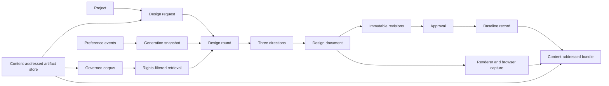

# Prism Data: From Design Intent to a Verified Baseline

Status: implemented with stated limits
Audience: Prism developer, platform engineer, operator, and incident responder
Owner: Prism maintainers
Evidence: contracts/prism/v1; skills/prism; charts/prism
Evidence revision: `4e52c72788ac002788bc036a497d76c13e6a35fd`
Applies to: prism.design-document.v1, the current Prism services, and the Prism PostgreSQL schema
Last verified: source, schema, migration, chart, and test inspection on 2026-09-19

## Purpose

Prism turns design intent into a revisioned design document and then into an
approved baseline bundle. It also keeps the evidence that explains how the
design was selected.

This page explains the data model and the rules that protect it. It follows a
project through design requests, design rounds, documents, revisions,
approval, rendering, and publication. It also explains corpus retrieval,
preferences, PostgreSQL, file artifacts, and backup behavior.

The key idea is simple: Prism does not overwrite an accepted fact when it can
add a new fact. A document revision, a preference event, an approval, and a
baseline are separate records. This costs storage and adds joins, but it makes
the reason for a result visible and makes stale work easier to reject.

## The Data Map

Text version: A project owns design requests. The active request owns the
current design round. A round produces three direction records and three
documents. Each document points to its current immutable revision. Preference
events become a fixed generation snapshot before generation starts. Corpus
retrieval can supply governed reference material. A matching approval permits
Prism to render every view, state, and viewport and publish one
content-addressed baseline bundle.

> **Source evidence — relational ownership**
>
> [The first migration defines projects, documents, revisions, directions, baselines, corpus records, preferences, engine operations, and approvals](https://github.com/datrab/kubeclaw/blob/4e52c72788ac002788bc036a497d76c13e6a35fd/skills/prism/storage/migrations/001_prism.sql#L1-L74).
>
> [The round migration binds a round to its request, preference generation, parent round, source document, and source revision](https://github.com/datrab/kubeclaw/blob/4e52c72788ac002788bc036a497d76c13e6a35fd/skills/prism/storage/migrations/013_design_round.sql#L1-L22).

## Four Forms of Truth

| Form of truth | Main record | Can it change? | Why Prism keeps it separate |
| --- | --- | --- | --- |
| Current product intent | Active `design_request` | A newer architecture revision can supersede it. | Old design work must not become valid for new architecture input. |
| Design history | `design_revision` rows | Existing rows are not updated by normal editing. | Undo, audit, stale-write detection, and exact approval need stable revisions. |
| Human decision | `preference_event` and `approval` | Events can be retracted by a new event. An approval remains bound to one revision. | Feedback and release authority have different meanings. |
| Published delivery | `baseline` plus artifact bytes | A published object is immutable. | A downstream consumer must receive the exact approved files. |

An item can be current without being approved. An item can be approved without
being published. A bundle can exist but no longer match the active
architecture. Prism checks each boundary instead of treating one status as a
substitute for another.

## Projects and Design Requests

A project has an internal UUID and a unique external ID. The external ID is
the stable product-facing key. The internal UUID is the relational key.
Project status supports `active`, `approved`, and `archived`, but the current
request and current round determine whether design output is current.

A design request binds these items:

- the project;
- an architecture artifact ID and digest;
- a positive architecture revision;
- the complete request JSON;
- an `active` or `superseded` state;
- the current design round, after a round starts.

Prism accepts the same architecture revision again only when its digest and
request content still match. The comparison ignores `approvalId` because that
field asks Prism to return an already approved result. It does not change the
design intent. A newer architecture revision supersedes older active requests.
A lower revision fails as stale input.

This rule has a cost: a caller cannot correct content while it reuses the same
revision number. It must publish a new architecture revision. That cost gives
the revision number one stable meaning.

> **Source evidence — architecture frontier**
>
> [The design-request table requires positive revisions, keeps one project/revision pair, and has an active-request index](https://github.com/datrab/kubeclaw/blob/4e52c72788ac002788bc036a497d76c13e6a35fd/skills/prism/storage/migrations/006_design_request.sql#L1-L17).
>
> [The transition check rejects an older revision or a changed digest at the same revision](https://github.com/datrab/kubeclaw/blob/4e52c72788ac002788bc036a497d76c13e6a35fd/skills/prism/control/design-generations.ts#L63-L82).
> It also rejects changed request content and an approval for different architecture.
>
> [Control locks the project, validates the transition, supersedes older requests, and records the active request in one transaction](https://github.com/datrab/kubeclaw/blob/4e52c72788ac002788bc036a497d76c13e6a35fd/skills/prism/server/control-server.ts#L215-L229).

## Design Rounds and Directions

### Why a round is a stored object

A round is not only a request to an agent. It is the frozen context for one
generation. It stores the architecture identity, parent round, source
document and revision, feedback, request, start identity, result identity, and
result.

The round ID is also the preference-generation ID. This one-to-one identity
prevents a generation result from being paired with a different preference
snapshot.

The `start_key` is unique per project. A repeat with the same input returns the
recorded generation. A repeat with different input fails. This makes a retry
safe without making unrelated starts equivalent.

### The current-round frontier

The active request points to one current round. A new child round must name
the current parent round and the exact current document revision. The project
row is locked while Prism checks and moves this frontier. Two concurrent child
starts cannot both become current.

When a result arrives, Prism checks the frontier again. It rejects the result
when the request became inactive, the architecture changed, the round is no
longer current, or the source document changed. A late agent response is
therefore evidence of completed work, but it is not authority to change the
product.

### Exactly three directions

A design-set result must contain exactly three unique direction keys. Prism
also checks material diversity. Its signature includes theme values, view
surfaces, visual node types and visual properties, and component structure.
Different copy alone is not a different direction. A pair needs a material
distance of at least three.

Prism writes all three documents and direction records in one transaction.
If the second or third write fails, the complete set rolls back. This is more
expensive than partial publication, but it prevents a user from choosing from
an incomplete comparison.

> **Source evidence — round admission and delivery**
>
> [Round start locks the project, checks its inputs, captures evidence, inserts the round, and advances the request frontier](https://github.com/datrab/kubeclaw/blob/4e52c72788ac002788bc036a497d76c13e6a35fd/skills/prism/control/design-generations.ts#L14-L43).
>
> [Result binding supports exact replay and rejects stale architecture, stale rounds, and changed source documents](https://github.com/datrab/kubeclaw/blob/4e52c72788ac002788bc036a497d76c13e6a35fd/skills/prism/control/design-generations.ts#L46-L59).
>
> [Direction-set creation validates three designs and writes their documents, revisions, direction records, and round result in one transaction](https://github.com/datrab/kubeclaw/blob/4e52c72788ac002788bc036a497d76c13e6a35fd/skills/prism/storage/index.ts#L151-L178).
>
> [The diversity gate gives extra weight to node type and root-structure differences and rejects a distance below three](https://github.com/datrab/kubeclaw/blob/4e52c72788ac002788bc036a497d76c13e6a35fd/skills/prism/directions/index.ts#L4-L37).

## Design Documents

A design document is data, not free-form HTML. Its closed contract contains:

| Part | Meaning |
| --- | --- |
| `meta` | Document, project, schema, revision, title, and timestamps. |
| `theme` | Colors, typography, spacing, radius, shadow, motion, breakpoints, and design rules. |
| `assets` | References and metadata for images, icons, media, and fonts. |
| `components` | Reusable node trees with optional variants. |
| `views` | Surface-specific node trees, states, responsive patches, and optional mock data. |
| `flows` | Declared starts, successes, recovery targets, and transitions. |

The JSON Schema closes declared objects with `additionalProperties: false`.
The semantic validator then performs checks that JSON Schema alone cannot do.
It validates theme values, node properties, component references, variants,
patch targets, and component cycles.

All contract inputs also have general complexity limits: 32 MiB of encoded
JSON, depth 256, one million visited nodes, and one million object properties.
These are admission limits. They are not a promise that a document near each
limit will render quickly or fit the service memory limit.

Prism supports 37 node types. The catalog gives each type an allowed property
set, required properties, and child-count rules. A renderer change is not
complete until the schema, semantic catalog, renderer, evaluation behavior,
tests, and baseline compatibility agree.

> **Source evidence — closed document contract**
>
> [The contract defines document metadata, theme, assets, components, views, and flows as closed structures](https://github.com/datrab/kubeclaw/blob/4e52c72788ac002788bc036a497d76c13e6a35fd/contracts/prism/v1/schemas/prism-v1.schema.json#L281-L519).
>
> [The semantic validator checks themes, patch targets, component references, component cycles, views, states, and responsive groups](https://github.com/datrab/kubeclaw/blob/4e52c72788ac002788bc036a497d76c13e6a35fd/contracts/prism/v1/src/document-semantics.ts#L7-L136).
>
> [The complexity guard defines the four general JSON limits and rejects cycles, accessors, sparse arrays, non-finite numbers, and excessive input](https://github.com/datrab/kubeclaw/blob/4e52c72788ac002788bc036a497d76c13e6a35fd/contracts/prism/v1/src/complexity.ts#L1-L68).
>
> [The node catalog lists the supported node types, allowed properties, required properties, and child rules](https://github.com/datrab/kubeclaw/blob/4e52c72788ac002788bc036a497d76c13e6a35fd/contracts/prism/v1/src/node-catalog.ts#L1-L189).

## Operations and Revisions

Prism supports insert, remove, duplicate, move, property update, responsive
property update, and batch operations. Every operation carries
`baseRevision`. A batch requires every child operation to carry the same base
revision.

The domain layer clones the document, applies the operation, increments the
revision once, advances `updatedAt`, verifies unique node IDs, and validates
the complete result. It refuses these unsafe changes:

- an operation against a different revision;
- a missing or duplicate node;
- an insert or move outside the child range;
- movement into the same node or one of its descendants;
- movement or removal of a root node;
- a batch with mixed base revisions;
- a result that fails the document contract.

The storage layer then inserts a new `design_revision`. It changes the
document's `current_revision_id` only when that pointer still names the
revision that was read. This compare-and-swap update is the final concurrency
check. A concurrent writer can leave only one new revision as current. The
losing transaction rolls back, including its inserted revision.

Restore does not move the pointer backwards. It copies the selected historical
content into a new revision and records a `revision.restored` operation. This
preserves both the undo action and all history after the source revision.

`replace` is the whole-document path used by agent results. It checks the
expected revision ID, records a parent link and operation evidence, and uses
the same compare-and-swap update. Agent delivery adds a job fence and replay
record around this write.

> **Source evidence — deterministic editing**
>
> [The domain operation union and application code define all operations, structural guards, one revision increment, and final validation](https://github.com/datrab/kubeclaw/blob/4e52c72788ac002788bc036a497d76c13e6a35fd/skills/prism/domain/index.ts#L5-L113).
>
> [Revision apply inserts the child revision and advances the current pointer with a compare-and-swap condition](https://github.com/datrab/kubeclaw/blob/4e52c72788ac002788bc036a497d76c13e6a35fd/skills/prism/storage/index.ts#L262-L292).
>
> [Restore creates a new revision instead of changing or deleting historical revisions](https://github.com/datrab/kubeclaw/blob/4e52c72788ac002788bc036a497d76c13e6a35fd/skills/prism/storage/index.ts#L240-L260).
>
> [The native PostgreSQL regression proves one winner from eight concurrent replacements and proves rollback of a failed transaction](https://github.com/datrab/kubeclaw/blob/4e52c72788ac002788bc036a497d76c13e6a35fd/tests/verification/contracts/check-prism-postgres-transactions.mts#L26-L41).

## Direction Decisions and Preference Evidence

Selecting a direction and learning from that choice are one transaction. Prism
locks the project and direction, confirms that the direction is proposed,
confirms that it belongs to the current round and active request, and confirms
that its source revision is still current. It then selects that direction,
rejects competing current directions, and records a preference event.

Feedback actions are `selected`, `rejected`, `liked`, `disliked`,
`preserved`, `changed`, `reverted`, and `retracted`. An event declares whether
its learning scope is `project` or `personal` and whether its source is
`explicit` or `observed`.

An idempotency key for a direction decision has at most 200 characters. Prism
derives a stable event ID and request digest from the actor, key, target, and
input. An exact repeat returns the stored response. Reuse for a different
decision fails.

### Projection and decay

Preference projection is deterministic:

- selected and liked evidence adds 1;
- preserved evidence adds 0.5;
- rejected, disliked, and reverted evidence subtracts 1;
- a retraction removes its target event from the projection;
- effective strength halves every 180 days from the last evidence time.

The projection key includes user, projection type, learning scope, project
when applicable, context, and trait. Project evidence overrides personal
evidence for the same context and trait in an effective generation snapshot.
A per-project user policy can disable personal evidence. It defaults to
enabled for an identified subject. A null subject receives no personal event
history.

Before generation, Prism stores the eligible events, full profile, effective
profile, target, policy version, subject, project, policy result, reference
time, and digest. Future events cannot change a generation that already
started.

The pipeline cannot nominate an arbitrary user. A personal subject must match
the platform-owned `PRISM_PIPELINE_PREFERENCE_SUBJECT`, and that value must
match `user-` plus 24 lowercase hexadecimal characters. An empty chart value
disables pipeline personal learning.

> **Source evidence — decisions and preferences**
>
> [Direction decision uses project and row locks, validates the current round and revision, and records its preference receipt in one transaction](https://github.com/datrab/kubeclaw/blob/4e52c72788ac002788bc036a497d76c13e6a35fd/skills/prism/control/direction-decisions.ts#L10-L60).
>
> [Preference projection defines identity, deduplication, retraction, scoring, context, scope, and 180-day decay](https://github.com/datrab/kubeclaw/blob/4e52c72788ac002788bc036a497d76c13e6a35fd/skills/prism/preferences/index.ts#L42-L88).
>
> [Generation snapshots apply the personal policy, project override, reference time, and content digest before storage](https://github.com/datrab/kubeclaw/blob/4e52c72788ac002788bc036a497d76c13e6a35fd/skills/prism/control/preference-snapshot.ts#L5-L37).
>
> [Pipeline preference identity is platform-owned and fails when a request does not equal the configured subject](https://github.com/datrab/kubeclaw/blob/4e52c72788ac002788bc036a497d76c13e6a35fd/skills/prism/control/pipeline-preference-subject.ts#L1-L10).

## Evaluation, Approval, and Publication

### Evaluation is advisory and blocking

The evaluator emits stable finding IDs from the finding content. Findings have
three levels:

| Level | Effect |
| --- | --- |
| `blocking` | Approval and publication stop. |
| `review` | A human must accept the exact finding ID before approval. |
| `information` | Evidence only. It does not change status. |

Current findings cover view coverage, broken references, flow completeness,
responsive coverage, accessible labels and alternatives, and heading and
content structure. The type model also reserves `information` findings and a
`visual-quality` gate, but the current evaluator does not emit them. The
evaluator does not perform full browser conformance. Browser capture adds
interactive-label and contrast findings during baseline publication.

### Approval is revision authority

Approval confirms all of these facts:

- project and document ownership match;
- the document is the current revision;
- no blocking evaluation finding exists;
- the caller accepted the exact current set of review finding IDs;
- the document belongs to the current round of the active request;
- the approval stores the architecture digest that was active at that time.

The supplied `designDigest` is stored, but publication recomputes the digest
from the current document and compares it with the approval. A caller cannot
make an approval valid for different bytes by supplying only a label.

### A baseline is stronger than an approval

Publication first looks for an existing baseline for the same approval,
project, and document. An exact repeat returns that record. A new publication
requires the approved revision, architecture digest, accepted warning set,
and selected direction to remain current.

These are application preflight checks, not one long database transaction.
Browser rendering happens after the checks and before the baseline insert.
The code does not hold the document row lock or recheck its current-revision
pointer at the final insert. A concurrent revision can therefore advance the
document during rendering while publication completes for the earlier approved
revision. The bundle remains internally bound to that approved revision, but
the baseline is not proof that the revision was still current at commit time.
The pipeline lookup checks the active request, current round, architecture,
approval, and baseline. It does not compare the approved revision with the
document's current-revision pointer. Operators must prevent concurrent editing
during approval and publication until this boundary is strengthened.

Prism then creates:

- the design document;
- a generated design specification;
- acceptance criteria for each view state and flow;
- a quality report with accepted warnings;
- every referenced asset;
- a PNG and accessibility-tree capture for every view, state, and compact,
  regular, and wide viewport;
- a preview index;
- a manifest and checksums.

Any browser accessibility finding blocks publication. New bundles use baseline
archive v2. The checksum document has fixed fields and a deterministic UTF-16
JSON encoding. The archive accepts at most 4,094 payload files because the
complete file set, including manifest and checksum files, is limited to 4,096.
Paths must be relative, normalized, and free of empty, dot, parent, backslash,
and NUL segments.

Two digests have different meanings. `bundle_digest` is the SHA-256 digest of
the deterministic checksum document for the payload files. The artifact ID is
the SHA-256 digest of the complete serialized archive object, including the
manifest, checksum document, text-file map, and Base64 binary-file map. The
archive is a JSON envelope, not a tar or ZIP file. A consumer must not compare
these two digests as if they identify the same byte sequence.

Document and request digests usually use `JSON.stringify` on the accepted
object. They are stable for a saved object and its replay, but they are not a
general canonical-JSON identity. A semantically equal object with a different
member insertion order can have a different digest. Baseline v2 canonicalizes
its closed checksum map separately.

The bundle bytes enter the content-addressed artifact store before the
baseline row is inserted. If the database insert then fails, an unreferenced
immutable file can remain. This is safe for integrity but can consume storage.
There is no automatic artifact garbage collector in the current implementation.

> **Source evidence — quality and release authority**
>
> [Evaluation derives stable findings and maps them to the final status](https://github.com/datrab/kubeclaw/blob/4e52c72788ac002788bc036a497d76c13e6a35fd/skills/prism/evaluation/index.ts#L27-L36).
> [It checks references, accessibility, responsive groups, and flows](https://github.com/datrab/kubeclaw/blob/4e52c72788ac002788bc036a497d76c13e6a35fd/skills/prism/evaluation/index.ts#L37-L235).
>
> [Approval binds the current revision, active architecture, quality result, and exact accepted warning IDs](https://github.com/datrab/kubeclaw/blob/4e52c72788ac002788bc036a497d76c13e6a35fd/skills/prism/server/control-server.ts#L521-L565).
>
> [Publication rechecks revision, digest, architecture, warnings, and selected direction before it assembles evidence](https://github.com/datrab/kubeclaw/blob/4e52c72788ac002788bc036a497d76c13e6a35fd/skills/prism/server/control-server.ts#L567-L645).
>
> [Prism renders every view, state, and viewport and blocks on missing or failing accessibility evidence](https://github.com/datrab/kubeclaw/blob/4e52c72788ac002788bc036a497d76c13e6a35fd/skills/prism/server/control-server.ts#L646-L752).
>
> [The final baseline insert follows rendering without a second current-revision check](https://github.com/datrab/kubeclaw/blob/4e52c72788ac002788bc036a497d76c13e6a35fd/skills/prism/server/control-server.ts#L753-L797).
> [The pipeline lookup does not join the document current-revision pointer](https://github.com/datrab/kubeclaw/blob/4e52c72788ac002788bc036a497d76c13e6a35fd/skills/prism/control/design-generations.ts#L69-L70).
>
> [The v2 archive code validates paths and file sets, computes deterministic checksums, validates the manifest, and returns the exact archive bytes](https://github.com/datrab/kubeclaw/blob/4e52c72788ac002788bc036a497d76c13e6a35fd/contracts/prism/v1/src/baseline-archive.ts#L23-L91).

## Renderer and Assets

The renderer never accepts arbitrary HTML or CSS from a design document. It
maps the closed node catalog to fixed HTML templates. Text and attribute
values are escaped. Style construction accepts only known properties and
validated values. Theme tokens start with `$` and resolve through the theme
object. Unknown or unsafe values do not become style declarations.

State patches apply first and viewport patches apply second. A viewport patch
therefore wins when both set the same property. Component variants apply
before instance overrides. Data references use a `$data` path and resolve
against view mock data or list-item data.

The HTML document has a restrictive content-security policy. It permits no
default source, permits images and fonts only as data URLs, and permits inline
style for the generated style block. Browser capture uses fixed locale
`en-US`, timezone `UTC`, reduced motion, a height of 1,000 pixels, and widths
390, 768, and 1,440 for the three viewports. Animations, transitions, and the
caret are disabled before capture. These choices reduce visual drift. They do
not make browser output identical across different Chromium versions, so the
renderer metadata includes the browser version.

Document assets contain artifact references and media metadata. Control loads
the bytes from its artifact store and passes data URLs to the worker. The sum
of assets used for a render or baseline is limited to 6,000,000 bytes. The
worker also rejects an individual supplied data URL longer than 16,000,000
characters. Studio preview accepts PNG, JPEG, WebP, SVG, and a total of
6,000,000 bytes, uses a 30-second deadline, and verifies each SHA-256 digest.

The public artifact upload accepts at most 6,000,000 decoded bytes and rejects
non-canonical Base64. The internal worker artifact route accepts at most
134,217,728 bytes and verifies that the digest in the URL matches the body.
These are different routes for different trust and evidence needs.

> **Source evidence — deterministic safe rendering**
>
> [The renderer escapes text and attributes, resolves only known token forms, and builds styles from an allowlisted set](https://github.com/datrab/kubeclaw/blob/4e52c72788ac002788bc036a497d76c13e6a35fd/skills/prism/renderer/index.ts#L4-L120).
>
> [The renderer maps every supported node to fixed HTML and fails on missing components or assets](https://github.com/datrab/kubeclaw/blob/4e52c72788ac002788bc036a497d76c13e6a35fd/skills/prism/renderer/index.ts#L177-L304).
>
> [Render operation applies the content-security policy and fixed browser capture environment](https://github.com/datrab/kubeclaw/blob/4e52c72788ac002788bc036a497d76c13e6a35fd/skills/prism/engine/render-operation.ts#L37-L139).
>
> [Studio preview enforces media, size, timeout, same-origin, and digest checks](https://github.com/datrab/kubeclaw/blob/4e52c72788ac002788bc036a497d76c13e6a35fd/skills/prism/studio/preview-assets.ts#L3-L65).
>
> [The internal route authenticates the caller, limits evidence to 128 MiB, and binds upload bytes to the URL digest](https://github.com/datrab/kubeclaw/blob/4e52c72788ac002788bc036a497d76c13e6a35fd/skills/prism/server/internal-artifacts.ts#L17-L52).

## Content-Addressed Artifact Storage

An artifact ID has the form `artifact:sha256:<64 lowercase hexadecimal
characters>`. The filesystem path is `<root>/<first two hex
characters>/<complete hex digest>`.

Publication uses this durable sequence:

1. Copy caller bytes before the first asynchronous action.
2. Create and synchronize the directory path.
3. Create a unique pending file with mode `0600`.
4. Write and synchronize its bytes.
5. Create the final immutable name with a hard link.
6. If that name exists, read it without following links and verify its digest.
7. Synchronize the directory.
8. Remove the pending name and synchronize the directory again.

A hard link avoids replacement of an existing object. An existing name is
accepted only when its bytes match. Reads use `O_NOFOLLOW`, require a regular
file, and verify the complete digest. The implementation gives durable local
publication on the mounted filesystem. It does not provide replication,
remote object storage, encryption by itself, automatic deletion, or repair of
a corrupt object.

Control uses one ReadWriteOnce persistent volume for these files and therefore
requires one Control replica. The workload uses `Recreate` so two Control pods
do not write the single-writer volume during rollout.

> **Source evidence — local CAS**
>
> [The artifact store implements pending-file publication, file and directory synchronization, hard-link collision handling, no-follow reads, and digest verification](https://github.com/datrab/kubeclaw/blob/4e52c72788ac002788bc036a497d76c13e6a35fd/skills/prism/storage/artifacts.ts#L6-L67).
>
> [The chart rejects more than one Control replica while artifact storage is ReadWriteOnce](https://github.com/datrab/kubeclaw/blob/4e52c72788ac002788bc036a497d76c13e6a35fd/charts/prism/templates/workloads.yaml#L1-L9).
>
> [The artifact claim is ReadWriteOnce, retained across chart deletion, and excluded from Argo pruning](https://github.com/datrab/kubeclaw/blob/4e52c72788ac002788bc036a497d76c13e6a35fd/charts/prism/templates/workloads.yaml#L217-L230).

## Corpus Ingestion

The corpus stores reference material for design use. It separates item
identity, immutable revision content, rights policy, and embedding evidence.

| Record | Purpose |
| --- | --- |
| `corpus_item` | Stable item identity, current revision pointer, and active, restricted, expired, or removed status. |
| `corpus_revision` | Normalized metadata, search text, source evidence, normalization version, content digest, and rights link. |
| `rights_policy` | Retention class, original and derivative rules, embedding permission, design-use permission, validity time, and policy basis. |
| `corpus_embedding` | One embedding per revision with model, model version, normalization version, and source digest. |

Ingestion validates an optional source-content digest and rejects unsafe direct
public addresses. The separate ingestion service performs DNS resolution,
rejects private or special addresses, pins the selected address for the HTTPS
request, allows at most three redirects, requires every redirect to stay on
HTTPS, limits the response to 6,000,000 bytes, and permits a fixed media-type
set. It rejects active SVG content.

Acquired bytes enter quarantine before publication. Quarantine files use
their digest as the name. The TTL defaults to one hour and is clamped between
one minute and one day. Control verifies the returned digest, creates an
embedding, writes a restricted corpus revision, requests quarantine cleanup,
and activates the exact revision only after publication and cleanup succeed.
If publication and cleanup both fail, the returned aggregate error preserves
both failures.

Identical normalized input has one content digest. A transaction advisory lock
serializes that digest before lookup and insertion. Concurrent identical
requests therefore return the same revision instead of racing through four
tables. All rights, item, revision, pointer, and embedding writes share one
transaction.

Rights `full` and `derived` permit design use. `analysis-only` and `temporary`
do not. The current writer always records `retain_original=false`,
`allow_embedding=true`, and a policy basis of `explicit-ingestion-policy`.
The schema also knows `forbidden`, but the current `CorpusInput` type does not
accept it.

The current ingestion path does not copy acquired source bytes into the
content-addressed artifact store. It stores normalized metadata and the source
content digest, then removes the quarantine file. The `source_artifact_id` and
`analysis_artifact_id` columns remain empty on this path. Thus, the source
digest proves which acquired bytes the service processed only while independent
evidence still has those bytes. It does not let Prism reconstruct them.

Retention names are policy metadata, not a deletion scheduler. The current
writer does not set `valid_until`. Search observes `valid_until` when another
authority sets it, and `expire()` can change an item to `expired`, but no
current background task expires or removes corpus records.

Important current boundary: the Control endpoint rejects `public-web` input
until a source policy is approved. The ingestion code can acquire public web
content, but the user-facing Control path does not grant that authority.
Ingestion is also disabled by default in chart values.

> **Source evidence — governed ingestion**
>
> [Corpus input, source rules, embedding limits, digest locking, and atomic insertion are implemented here](https://github.com/datrab/kubeclaw/blob/4e52c72788ac002788bc036a497d76c13e6a35fd/skills/prism/corpus/index.ts#L5-L148).
>
> [The ingestion service enforces DNS and address policy, HTTPS, redirect, size, media, SVG, quarantine, and TTL rules](https://github.com/datrab/kubeclaw/blob/4e52c72788ac002788bc036a497d76c13e6a35fd/skills/prism/server/ingestion.ts#L10-L80).
>
> [Control keeps a new item restricted until digest verification, embedding, database publication, and quarantine cleanup complete](https://github.com/datrab/kubeclaw/blob/4e52c72788ac002788bc036a497d76c13e6a35fd/skills/prism/server/control-server.ts#L810-L842).
>
> [The native pool test injects failures at every corpus write boundary and verifies full rollback](https://github.com/datrab/kubeclaw/blob/4e52c72788ac002788bc036a497d76c13e6a35fd/skills/prism/integration/corpus-pool.mts#L24-L80).
> It also verifies one result from 12 concurrent identical requests.

## Retrieval, Embeddings, Ranking, and Access Boundaries

### Admission before ranking

Retrieval first admits only the current revision of an active corpus item. Its
rights policy must permit design use and must not be past `valid_until`.
Vector retrieval also requires the same embedding model as the query.

Required metadata uses JSON containment. Avoided metadata is excluded. The
same match rules run again in application code before final selection. This
second pass is a defense against differences between SQL JSON containment and
the intended scalar-or-array matching rules.

This is a rights filter, not a user or project access-control list. Corpus
records have no tenant, project, owner, or reader column. All authenticated
Control users that can reach corpus search share the same active,
design-usable corpus. Do not document or depend on per-project corpus privacy;
it is not implemented.

### Text and vector ranking

Without a query embedding, PostgreSQL uses a generated `simple` language
`tsvector`, `websearch_to_tsquery`, and `ts_rank`. A GIN index supports the text
match.

With an embedding, Prism builds two ranked lists of at most 100 candidates:
text relevance and pgvector cosine distance. It combines them with reciprocal
rank fusion:

`1 / (60 + text rank) + 1 / (60 + vector rank)`

This avoids comparing raw text and vector scores, which have different units.
The fixed constant 60 reduces the influence of small rank differences. The
cost is loss of raw score magnitude.

The final SQL candidate request is `max(limit * 10, 100)`. The public endpoint
clamps `limit` to 1 through 50, so it can ask SQL for as many as 500 candidates.
It clamps `sourceFamilyLimit` to 1 through 10, with default 2. Preferred
metadata moves matching candidates ahead without excluding other candidates.
The family cap then limits one source family before Prism stops at the caller
limit. Each result explains its ranking method, preference match, source
family, and diversity cap. A short result sets a coverage-gap message.

### Embedding limits and scaling cost

Ingestion accepts 1 through 4,096 finite embedding values. Search accepts a
non-empty finite vector. PostgreSQL enforces dimensional compatibility when it
performs distance comparison. The table uses the unconstrained `vector` type,
and there is no HNSW or IVFFlat index in the migrations. Current vector ranking
is exact and can become expensive as the eligible corpus grows. Model
partitioning happens by a text equality filter, not separate tables or vector
indexes.

> **Source evidence — retrieval policy and algorithm**
>
> [The hybrid query applies active-status, rights, validity, model, required, and avoid filters and fuses text and vector ranks](https://github.com/datrab/kubeclaw/blob/4e52c72788ac002788bc036a497d76c13e6a35fd/skills/prism/corpus/index.ts#L150-L185).
>
> [Application selection applies metadata matching, preference ordering, source-family diversity, explanations, and the final limit](https://github.com/datrab/kubeclaw/blob/4e52c72788ac002788bc036a497d76c13e6a35fd/skills/prism/corpus/index.ts#L186-L249).
>
> [The API clamps result and family limits and reports a coverage gap](https://github.com/datrab/kubeclaw/blob/4e52c72788ac002788bc036a497d76c13e6a35fd/skills/prism/server/control-server.ts#L844-L886).
>
> [The schema creates the generated text vector and its GIN index](https://github.com/datrab/kubeclaw/blob/4e52c72788ac002788bc036a497d76c13e6a35fd/skills/prism/storage/migrations/001_prism.sql#L40-L57).
> It creates no approximate vector index. [It indexes text search and rights lookup](https://github.com/datrab/kubeclaw/blob/4e52c72788ac002788bc036a497d76c13e6a35fd/skills/prism/storage/migrations/001_prism.sql#L71-L74).

## Other Durable Coordination Records

Not every Prism table stores visible design content. Some tables make remote
work repeat-safe or preserve a security decision.

### Native engine operations

`engine_operation` uses the idempotency key as its primary key. Before remote
dispatch, Control stores the complete worker-attempt envelope, request digest,
execution ID, and operation. A repeat with the same request returns the saved
attempt and, when present, its result. A repeat with different input fails.

Control records the bound terminal result before it hydrates the returned
artifacts. Thus, a hydration failure cannot make a retry execute the remote
operation again. A separate completion timestamp is set only for a stored
completed result.

Migration 017 adds a database check for the v3 attempt identity and a trigger
that makes the accepted identity immutable. After an attempt exists, an update
cannot change its envelope, idempotency key, creation time, execution ID,
request digest, or operation. A stored result and completion time also cannot
change. Historical rows without a v3 attempt remain readable. A pending
historical row needs explicit reconciliation because it does not contain the
complete accepted identity.

### Agent jobs

An `agent_job` uses the preference-generation ID as its ID. This binds one
design-set or revision job to one captured generation. Accepted jobs have no
fence. Claim changes the job to `running`, writes a random fence, runner ID,
16-minute expiry, and complete attempt envelope in one transaction.

Only one job in a session can be `running` or `needs_nova`. Expired running
work is not returned to the queue. It becomes `needs_nova` because Control
cannot know whether the external agent performed an action. Accepted work
whose source changed becomes `superseded` before dispatch.

A result writer must hold the job row lock, present the current fence, and
arrive before expiry. An exact repeated payload returns the stored result. A
different payload fails. This trades automatic recovery for protection from a
late or replaced agent that writes to a new product state.

### Nonces and product decisions

`worker_request_nonce` makes secret-authenticated internal requests one-use.
The authentication window is five minutes. Consumption deletes at most 1,000
expired rows, then inserts the audience and hashed nonce under a composite
primary key. A conflict means replay. SPIFFE mode uses peer identity instead
of this shared-secret request format.

Product decisions have a separate durable intent and receipt. The intent row
stores actor, normalized intent digest, payload digest, and signed envelope.
The receipt table stores the external result. A repeated decision ID must have
the same actor and normalized intent. A repeated receipt must have identical
JSON content. These records survive temporary demonstration-namespace cleanup.

### Defined but not active: brief revisions

The first migration defines `brief_revision` with project-local revision and
content-digest uniqueness and an optional parent revision. The inspected
runtime does not write or read this table. Current architecture input is stored
as a `design_request` plus a content-addressed architecture artifact. Treat
`brief_revision` as a reserved schema surface, not as the current source of
project intent.

> **Source evidence — durable coordination**
>
> [Native operation reservation locks the idempotency key, commits the accepted attempt before dispatch, and returns only a matching stored attempt or result](https://github.com/datrab/kubeclaw/blob/4e52c72788ac002788bc036a497d76c13e6a35fd/skills/prism/control/native-operation-store.ts#L10-L45).
>
> [Result recording binds the receipt to the stored attempt and refuses a conflicting second result](https://github.com/datrab/kubeclaw/blob/4e52c72788ac002788bc036a497d76c13e6a35fd/skills/prism/control/native-operation-store.ts#L47-L68).
>
> [The database constraint and trigger protect v3 native-operation identity and completed results](https://github.com/datrab/kubeclaw/blob/4e52c72788ac002788bc036a497d76c13e6a35fd/skills/prism/storage/migrations/017_native_operation_identity.sql#L1-L30).
>
> [Agent job claim serializes admission, expires uncertain running work to `needs_nova`, supersedes stale accepted work, and creates a 16-minute fenced attempt](https://github.com/datrab/kubeclaw/blob/4e52c72788ac002788bc036a497d76c13e6a35fd/skills/prism/control/agent-jobs.ts#L31-L53).
>
> [Agent result commit checks the row lock, fence, live claim, and payload digest](https://github.com/datrab/kubeclaw/blob/4e52c72788ac002788bc036a497d76c13e6a35fd/skills/prism/control/agent-jobs.ts#L84-L100).
>
> [The nonce store and verifier implement bounded cleanup, one-use insertion, a five-minute time window, HMAC validation, and replay rejection](https://github.com/datrab/kubeclaw/blob/4e52c72788ac002788bc036a497d76c13e6a35fd/skills/prism/server/internal-auth.ts#L3-L86).
>
> [Product decision storage makes normalized intent and receipt retries conflict-safe](https://github.com/datrab/kubeclaw/blob/4e52c72788ac002788bc036a497d76c13e6a35fd/skills/prism/storage/product-decisions.ts#L4-L28).
>
> [The initial schema defines brief revisions, while active request storage is a separate later table](https://github.com/datrab/kubeclaw/blob/4e52c72788ac002788bc036a497d76c13e6a35fd/skills/prism/storage/migrations/001_prism.sql#L6-L10).

## PostgreSQL Ownership and Migrations

Prism uses three application roles:

| Role | Authority |
| --- | --- |
| `prism_migrator` | Owns the `prism` schema and runs migrations. |
| `prism_runtime` | Select, insert, update, and delete on Prism tables. |
| `prism_readonly` | Select on Prism tables. |

The bootstrap job is additive. It creates a missing role, but it does not
rotate an existing password. For an existing role, it first proves that the
server rejects a random wrong password with PostgreSQL code `28P01`. It then
checks the configured password. If server authentication does not prove the
password, bootstrap stops. Credential rotation is therefore a separate
operator transition.

Bootstrap uses a transaction advisory lock. It creates the pgvector extension,
schema ownership, current grants, and default grants. It retries connection
startup failures at most 60 times with a 2,000 ms delay and a 5,000 ms
connection timeout.

Schema migration reads files whose names match `NNN_name.sql`, sorts them,
and records each applied filename in `prism.schema_migration`. One transaction
and one transaction advisory lock cover the complete pending set. A failing
migration rolls back the set and releases the reserved pool connection.

In deployed `preprovisioned` mode, migration refuses to run unless the current
user owns the existing `prism` schema. It does not create database-wide roles,
extensions, or schemas. Those actions belong to the bootstrap job. Embedded
mode exists for tests and local use and can create them.

Migrations are forward-only files. There is no down-migration runner. Migration
010 is an example of explicit data preservation: before it restores uniqueness
for directions with no source document, it archives displaced duplicate rows
with their complete JSON and reason.

### Complete migration reference

The order is part of the database contract. Do not rename or edit an applied
file. Add the next numbered file.

| Migration | Durable change |
| --- | --- |
| [`001_prism.sql`](https://github.com/datrab/kubeclaw/blob/4e52c72788ac002788bc036a497d76c13e6a35fd/skills/prism/storage/migrations/001_prism.sql) | Creates the initial project, document, revision, direction, baseline, rights, corpus, preference, approval, and engine-operation model. |
| [`002_engine_operation_results.sql`](https://github.com/datrab/kubeclaw/blob/4e52c72788ac002788bc036a497d76c13e6a35fd/skills/prism/storage/migrations/002_engine_operation_results.sql) | Adds request identity and the stored result to engine operations. |
| [`003_worker_nonce.sql`](https://github.com/datrab/kubeclaw/blob/4e52c72788ac002788bc036a497d76c13e6a35fd/skills/prism/storage/migrations/003_worker_nonce.sql) | Adds one-use internal-authentication nonces and their expiry index. |
| [`004_approval_warnings.sql`](https://github.com/datrab/kubeclaw/blob/4e52c72788ac002788bc036a497d76c13e6a35fd/skills/prism/storage/migrations/004_approval_warnings.sql) | Records which evaluation warnings a reviewer accepted. |
| [`005_direction_source.sql`](https://github.com/datrab/kubeclaw/blob/4e52c72788ac002788bc036a497d76c13e6a35fd/skills/prism/storage/migrations/005_direction_source.sql) | Binds a direction to its source document and revision and changes direction uniqueness. |
| [`006_design_request.sql`](https://github.com/datrab/kubeclaw/blob/4e52c72788ac002788bc036a497d76c13e6a35fd/skills/prism/storage/migrations/006_design_request.sql) | Adds architecture-bound design requests and the approval architecture digest. |
| [`007_direction_evidence.sql`](https://github.com/datrab/kubeclaw/blob/4e52c72788ac002788bc036a497d76c13e6a35fd/skills/prism/storage/migrations/007_direction_evidence.sql) | Adds structured evidence to each direction. |
| [`008_document_request_binding.sql`](https://github.com/datrab/kubeclaw/blob/4e52c72788ac002788bc036a497d76c13e6a35fd/skills/prism/storage/migrations/008_document_request_binding.sql) | Binds each Design Document to the design request that authorized it. |
| [`009_corpus_source_evidence.sql`](https://github.com/datrab/kubeclaw/blob/4e52c72788ac002788bc036a497d76c13e6a35fd/skills/prism/storage/migrations/009_corpus_source_evidence.sql) | Adds a validated source-content digest to corpus revisions. |
| [`010_direction_unsourced_uniqueness.sql`](https://github.com/datrab/kubeclaw/blob/4e52c72788ac002788bc036a497d76c13e6a35fd/skills/prism/storage/migrations/010_direction_unsourced_uniqueness.sql) | Archives displaced duplicates before restoring uniqueness for directions without a source document. |
| [`011_preference_wire_ids.sql`](https://github.com/datrab/kubeclaw/blob/4e52c72788ac002788bc036a497d76c13e6a35fd/skills/prism/storage/migrations/011_preference_wire_ids.sql) | Adds stable wire IDs and conflict-safe request and response receipts to preference events. |
| [`012_preference_generation.sql`](https://github.com/datrab/kubeclaw/blob/4e52c72788ac002788bc036a497d76c13e6a35fd/skills/prism/storage/migrations/012_preference_generation.sql) | Adds per-project personal-preference policy and stored generation snapshots. |
| [`013_design_round.sql`](https://github.com/datrab/kubeclaw/blob/4e52c72788ac002788bc036a497d76c13e6a35fd/skills/prism/storage/migrations/013_design_round.sql) | Adds design rounds and binds current requests and documents to their round. |
| [`014_agent_jobs.sql`](https://github.com/datrab/kubeclaw/blob/4e52c72788ac002788bc036a497d76c13e6a35fd/skills/prism/storage/migrations/014_agent_jobs.sql) | Adds durable fenced Agent jobs and idempotent revision-start records. |
| [`015_product_decisions.sql`](https://github.com/datrab/kubeclaw/blob/4e52c72788ac002788bc036a497d76c13e6a35fd/skills/prism/storage/migrations/015_product_decisions.sql) | Adds the separate signed product-decision audit and controller receipts. |
| [`016_preference_legacy_insert_compatibility.sql`](https://github.com/datrab/kubeclaw/blob/4e52c72788ac002788bc036a497d76c13e6a35fd/skills/prism/storage/migrations/016_preference_legacy_insert_compatibility.sql) | Lets an older writer omit a preference wire ID during an application rollback. |
| [`017_native_operation_identity.sql`](https://github.com/datrab/kubeclaw/blob/4e52c72788ac002788bc036a497d76c13e6a35fd/skills/prism/storage/migrations/017_native_operation_identity.sql) | Stores the complete Worker V3 attempt identity and prevents later identity mutation. |

> **Source evidence — bootstrap and migration**
>
> [Role bootstrap verifies password authentication, serializes setup, creates missing roles, and installs ownership and grants](https://github.com/datrab/kubeclaw/blob/4e52c72788ac002788bc036a497d76c13e6a35fd/skills/prism/server/database-roles.ts#L8-L57).
>
> [Bootstrap retry defaults and retryable connection failures are explicit](https://github.com/datrab/kubeclaw/blob/4e52c72788ac002788bc036a497d76c13e6a35fd/skills/prism/config/database-bootstrap.ts#L1-L10) and [applied by the bootstrap entry point](https://github.com/datrab/kubeclaw/blob/4e52c72788ac002788bc036a497d76c13e6a35fd/skills/prism/server/bootstrap-database.ts#L1-L20).
>
> [Migration uses one reserved connection, transaction, advisory lock, ownership preflight, migration journal, rollback, and release](https://github.com/datrab/kubeclaw/blob/4e52c72788ac002788bc036a497d76c13e6a35fd/skills/prism/storage/index.ts#L21-L74).
>
> [The duplicate-direction migration archives displaced legacy rows before it adds the partial unique index](https://github.com/datrab/kubeclaw/blob/4e52c72788ac002788bc036a497d76c13e6a35fd/skills/prism/storage/migrations/010_direction_unsourced_uniqueness.sql#L1-L32).

## Transactions, Locks, and Compare-and-Swap

Prism uses different concurrency tools for different identities.

| Tool | Protected identity | Why this tool fits |
| --- | --- | --- |
| Transaction | One multi-table business change | All writes commit or all writes roll back. |
| Transaction advisory lock | Migration name space, corpus digest, preference wire ID, or bootstrap | The lock key is logical and does not need an existing row. |
| `FOR UPDATE` | Project, direction, job, or other mutable frontier | Competing decisions must see one ordered current state. |
| `FOR SHARE` | Parent project or source revision during child creation | The referenced state must not change during validation and write. |
| Compare-and-swap update | `design_document.current_revision_id` | Only the writer based on the current parent can advance the document. |
| Unique constraint | External ID, revision number, digest, wire ID, start key | The database is the last defense against duplicates. |
| Fence value | Agent job delivery | A prior or replaced runner cannot commit a result. |

The generic transaction helper reserves one pool connection. This is
essential: `BEGIN` on one connection and writes on another would not form one
transaction. It always attempts rollback after the callback fails and always
releases a pooled connection.

The normal Control entry point creates a `pg.Pool` with library defaults. The
repository does not add a statement timeout, lock timeout, or maximum pool size.
The nonce readiness path is different: it owns a private pool of four
connections, admits at most four active operations, and uses the same deadline
for connect, statement, and lock timeout. Its default is 750 ms. On request
cancellation or dependency deadline, it destroys the connection so timed-out
SQL cannot continue in the background.

This distinction matters during incidents. A healthy nonce probe does not
prove that all Control database operations have a deadline. A blocked Control
query can wait according to PostgreSQL or connection-string settings.

> **Source evidence — concurrency boundaries**
>
> [The transaction helper reserves one connection and owns begin, commit, rollback, and release](https://github.com/datrab/kubeclaw/blob/4e52c72788ac002788bc036a497d76c13e6a35fd/skills/prism/storage/index.ts#L79-L96).
>
> [The document pointer update is conditional on the parent revision ID and fails with `revision conflict` when it loses](https://github.com/datrab/kubeclaw/blob/4e52c72788ac002788bc036a497d76c13e6a35fd/skills/prism/storage/index.ts#L273-L291).
>
> [The nonce dependency pool has four connections, a 750 ms default, admission control, server timeouts, cancellation, diagnostics, and connection destruction](https://github.com/datrab/kubeclaw/blob/4e52c72788ac002788bc036a497d76c13e6a35fd/skills/prism/server/worker-readiness.ts#L32-L106).
>
> [The production Control entry point uses a normal pool and closes it after server shutdown](https://github.com/datrab/kubeclaw/blob/4e52c72788ac002788bc036a497d76c13e6a35fd/skills/prism/server/control.ts#L1-L9).

## Backup, Verification, Restore Proof, and Retention

### What one backup contains

The scheduled backup groups the PostgreSQL dump and the complete
content-addressed artifact tree. This pairing is necessary because database
rows refer to artifact IDs but do not contain the artifact bytes.

Backup takes the database snapshot first and copies the immutable artifact
superset second. An artifact published after the snapshot can be copied but is
unreferenced by that dump. An artifact referenced by the snapshot was already
published durably before its database row committed, so it must be available
for copying unless an operator changes or deletes storage concurrently.

Each group contains:

- `database.dump` in PostgreSQL custom format;
- `artifacts/` with digest-named objects;
- `ARTIFACTS.sha256` rebuilt from the copied files;
- `metadata.txt` with format, database, application image, scope, credential
  boundary, completion time, and dump version;
- `SHA256SUMS` for the dump, metadata, and artifact index.

The job writes into `.incomplete-*`, synchronizes the group, renames it to
`backup-*` without replacement, synchronizes the backup root, and verifies the
published group. A failed partial group is intentionally retained for incident
inspection and capacity accounting.

### Verification and restore proof

Verification does not trust artifact filenames alone. It enumerates regular
files without symbolic links, checks the two-level digest path, hashes every
object, reconstructs the index, compares it with the stored index, verifies
the top-level checksums, format marker, and group size.

The database proof restores the latest verified dump into a random new
database with `--single-transaction`. It runs count queries on project,
design-revision, and baseline tables and then drops the proof database. This is
a database smoke test. It does not restore artifacts into a separate volume,
start Prism from restored state, restore external credentials, or prove an
off-site disaster-recovery procedure.

### Schedule, limits, and retention boundary

Default chart policy is:

| Setting | Default |
| --- | --- |
| Backup schedule | Daily at 02:00 |
| Verification schedule | Sunday at 03:00 |
| Database proof schedule | Sunday at 04:00 |
| Maximum one group | 85,899,345,920 bytes, 80 GiB |
| Maximum retained bytes | 96,636,764,160 bytes, 90 GiB |
| Maximum operation duration | 3,600 seconds |
| CronJob deadline | Maximum duration plus 30 seconds |
| Concurrent jobs | Forbidden |
| Job retries | None |

The backup script takes a non-blocking exclusive file lock and places one
deadline around the complete operation. It does not automatically delete old
groups. `maximumRetainedBytes` is a hard capacity gate, not a retention-age
policy. When retained data leaves insufficient allowance, the next backup
fails. An operator must preserve required copies and remove groups through a
separate controlled process.

The chart keeps the backup and artifact claims when Helm or Argo removes the
release. It does not create an off-host copy. Credentials and external journals
are outside the backup group and require a separate recovery authority.

> **Source evidence — backup behavior**
>
> [Backup configuration declares schedules, byte ceilings, duration, and the explicit no-auto-expiry and off-host-copy boundary](https://github.com/datrab/kubeclaw/blob/4e52c72788ac002788bc036a497d76c13e6a35fd/charts/prism/values.yaml#L64-L73).
>
> [The script validates configuration, tools, roots, object paths, checksums, manifests, and group size](https://github.com/datrab/kubeclaw/blob/4e52c72788ac002788bc036a497d76c13e6a35fd/charts/prism/files/prism-backup.sh#L1-L64).
>
> [Backup takes the dump first, copies and hashes immutable artifacts, synchronizes, atomically publishes, and verifies the group](https://github.com/datrab/kubeclaw/blob/4e52c72788ac002788bc036a497d76c13e6a35fd/charts/prism/files/prism-backup.sh#L66-L117).
>
> [The database proof restores the latest group into a random database and states its limited smoke-test scope](https://github.com/datrab/kubeclaw/blob/4e52c72788ac002788bc036a497d76c13e6a35fd/charts/prism/files/prism-backup.sh#L119-L153).
>
> [The whole operation runs under one deadline and non-blocking exclusive lock](https://github.com/datrab/kubeclaw/blob/4e52c72788ac002788bc036a497d76c13e6a35fd/charts/prism/files/prism-backup.sh#L156-L169).
>
> [The CronJobs forbid overlap, disable retries, and mount the artifact source read-only](https://github.com/datrab/kubeclaw/blob/4e52c72788ac002788bc036a497d76c13e6a35fd/charts/prism/templates/backup.yaml#L9-L79).

## Failure and Recovery Matrix

| Failure | Durable state | Safe next action |
| --- | --- | --- |
| Operation uses a stale base revision. | The losing transaction has no new revision. | Reload current content and decide whether to reapply the intent. |
| Agent result arrives after a new round or architecture. | Old round and job evidence remain, but the current frontier does not move. | Start a new round from the current request and revision. |
| Direction-set write fails part way. | The transaction rolls back all documents, revisions, directions, and result updates. | Retry with the same generation only after the cause is corrected. |
| Preference event ID repeats with identical content. | One event exists. | Treat the repeat as success. |
| Preference ID or decision idempotency key repeats with different content. | The first record remains authoritative. | Use a new key only for a genuinely new intent. |
| Corpus publication fails. | The corpus transaction rolls back. Quarantine cleanup is attempted separately. | Resolve publication and cleanup errors; do not activate a partial record. |
| Corpus cleanup fails after database publication. | The item remains restricted because activation occurs after cleanup. | Remove quarantine safely, then repeat the controlled publication path. |
| Artifact name exists with different bytes. | Existing object remains unchanged. | Treat it as storage corruption; investigate and restore from verified backup. |
| Approval no longer matches current revision, warnings, round, or architecture. | Approval remains as historical evidence. No new baseline is created. | Evaluate and approve the new current revision. |
| Bundle file write succeeds but baseline insert fails. | An unreferenced immutable artifact can remain. | Diagnose the database failure. Exact retry can reuse content-addressed bytes. |
| Migration fails. | The migration transaction rolls back and no filename is recorded. | Correct the failing migration or environment, then rerun. |
| Backup capacity is exhausted. | Existing complete and incomplete groups remain. No group is deleted. | Preserve required copies, investigate incomplete groups, and free capacity by policy. |
| Backup verification fails. | The suspect group remains for investigation. | Do not restore from it. Select a verified group or recover from an off-host copy. |
| Database proof succeeds. | It proves SQL restore and three basic queries only. | Continue the full recovery procedure; do not claim complete disaster recovery. |

## Implemented Boundaries

The following statements prevent the current implementation from being
described as more complete than it is.

| Area | Implemented now | Not implemented or not proved |
| --- | --- | --- |
| Revision history | Append-only normal editing, parent links, restore-as-new, compare-and-swap current pointer. | A database trigger does not make every revision column immutable against privileged direct SQL. |
| Approval | Current-revision, current-round, architecture, quality, and warning checks; digest is enforced at publication. | Multi-person quorum, expiry, revocation, and cryptographic approval signatures are not part of this table. |
| Baseline | Deterministic v2 archive, checksums, complete previews, CAS object, idempotent lookup. | Publication does not lock the document across rendering or recheck the current pointer at commit. Automatic artifact garbage collection and remote publication are absent. |
| Corpus rights | Status, retention class, validity time, embedding and design-use flags. | Per-user, per-project, and tenant ACLs are absent. Retention labels do not schedule expiry or deletion. |
| Corpus source evidence | Normalized metadata and the SHA-256 digest of acquired bytes. | The current path does not retain the acquired bytes or set the source and analysis artifact columns. |
| Public sources | Hardened acquisition code and quarantine exist. | Control rejects public-web ingestion until policy approval; chart ingestion is off by default. |
| Embeddings | Model and version evidence, finite vector checks, pgvector cosine distance. | Fixed dimensions, approximate indexes, automatic re-embedding, and model migration are absent. |
| Ranking | Text rank, exact vector rank, reciprocal-rank fusion, preference boost, avoidance, and family diversity. | Learned ranking and calibrated cross-model scoring are absent. |
| Renderer | Closed node model, escaped HTML, controlled style output, fixed browser environment, capture evidence. | It is not a general web browser or arbitrary HTML/CSS/JavaScript renderer. |
| PostgreSQL | Roles, pgvector, forward migrations, pooled transactions, locks, constraints, and recovery tests. | Automatic failover and point-in-time recovery are not provided by the Prism chart. |
| Backup | Local immutable database-and-artifact groups, scheduled verification, and SQL restore smoke test. | Automatic expiry, off-host replication, credential recovery, and full service restore proof are separate operator work. |

## Change Guide

Use the smallest complete change surface. A change that updates only one row
in this table is usually incomplete.

| Change | Required surfaces | Main risks to test |
| --- | --- | --- |
| Add a document field | JSON Schema, generated validator, TypeScript type, semantic checks, renderer or consumer, fixtures, baseline compatibility. | Closed-schema rejection, old document reading, complexity, deterministic archive bytes. |
| Add a node type | Node catalog, property rules, schema if needed, renderer, evaluation, Studio adapter, tests. | Unsafe HTML or CSS, child rules, accessibility, component and patch behavior. |
| Add an operation | Operation schema and type, domain application, revision evidence, Studio client, tests. | Revision increment, batch behavior, structural invariants, compare-and-swap conflict. |
| Change round behavior | Round schema migration, start and result binding, agent job identity, current-frontier queries, transaction tests. | Late result admission, duplicate start, parent race, partial direction set. |
| Add preference evidence | Event schema, projection identity and score, snapshot policy version, prompt consumer, migration when storage changes. | Retraction, project/personal isolation, deterministic reference time, old snapshot replay. |
| Change retrieval | Corpus schema, ingestion evidence, rights admission, SQL and application filters, explanation, native PostgreSQL tests. | Rights bypass, model mismatch, vector dimensions, ranking drift, pool rollback. |
| Add an asset media type | Document schema, upload validation, preview loader, render input, baseline extension map, content-security policy, backup. | active content, size amplification, digest mismatch, browser support. |
| Change baseline files | Archive profile or compatible reader, manifest schema, checksum codec, importer, fixture and archive tests. | Byte drift, path injection, missing evidence, old bundle readability. |
| Add a table or index | Forward migration, grants, bootstrap assumptions, PGlite tests and native PostgreSQL tests, backup restore proof. | transaction rollback, lock time, extension availability, production ownership. |
| Change retention | Chart values and schema, backup program, capacity tests, runbook, off-host policy. | silent deletion, incomplete group removal, loss of last verified copy. |

## Verification Map

Use test evidence that matches the behavior under review.

| Behavior | Relevant evidence |
| --- | --- |
| Document schema and semantic rules | `contracts/prism/v1/tests/contracts.test.mts`; `skills/prism/tests/domain.test.mts` |
| Revisions, restore, artifacts, and migrations | `skills/prism/tests/storage.test.mts`; `skills/prism/tests/domain-storage.test.mts` |
| Real pooled transactions and concurrent revision writes | `tests/verification/contracts/check-prism-postgres-transactions.mts` with a dedicated PostgreSQL server |
| Corpus rights and ranking | `skills/prism/tests/corpus.test.mts` |
| Corpus rollback and concurrency on native PostgreSQL | `skills/prism/integration/corpus-pool.mts` with a dedicated local PostgreSQL server |
| Preferences and generation snapshots | `skills/prism/tests/preferences-generation.test.mts`; `skills/prism/tests/product-decisions.test.mts` |
| Renderer and browser evidence | `skills/prism/tests/renderer.test.mts`; `skills/prism/tests/renderer-remediation.test.mts` |
| Artifact crash durability | `skills/prism/tests/artifact-durability.test.mts` |
| Baseline archive compatibility | `tests/verification/integration/prism-baseline-archive.test.mts`; `tests/verification/integration/prism-archive.test.mts` |
| Backup rendering and behavior | `tests/verification/deployment/prism-backup.test.mts`; Helm render checks |

PGlite tests prove much of the SQL and transaction design quickly. They do not
prove native PostgreSQL pool scheduling, server locks, pgvector extension
behavior, filesystem durability, or browser capture. Use the named native,
filesystem, and browser tests for those claims.
