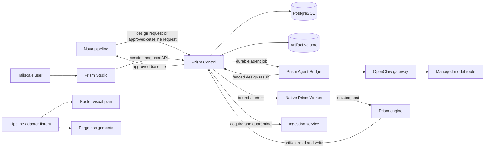
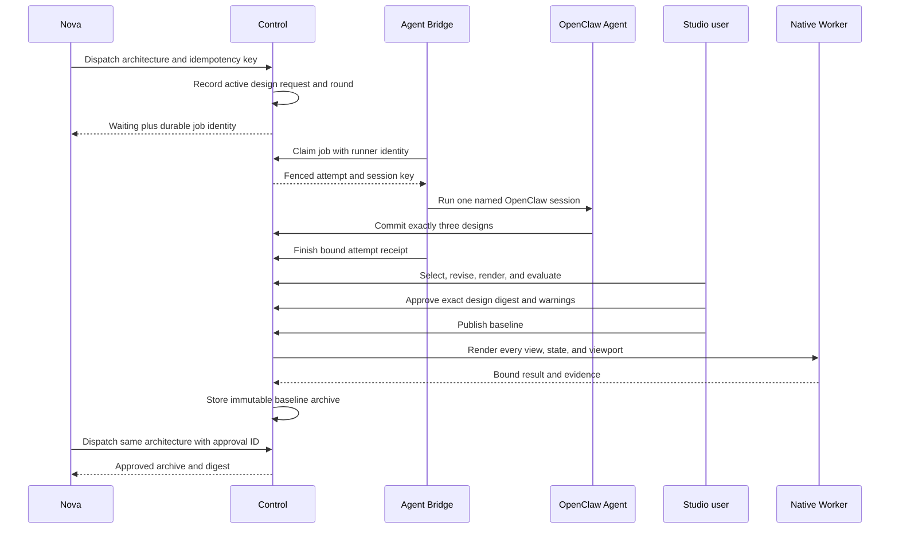

# Prism Runtime: From Design Request to Approved Baseline

Status: implemented with stated deployment and recovery limits
Audience: architecture reader, Prism developer, operator, incident responder
Owner: Prism maintainers
Evidence: skills/prism; contracts/prism/v1; charts/prism; my-values/prism-agent-values.yaml
Evidence revision: `4e52c72788ac002788bc036a497d76c13e6a35fd`
Applies to: the current Prism Control, Studio, native Worker, Ingestion service, Agent Bridge, and pipeline adapter
Last verified: source, deployment, and test inspection on 2026-09-19

## Purpose

Prism turns an approved product boundary into design evidence that an implementation pipeline can use.
It stores design revisions, asks one managed design agent for proposals, renders previews, evaluates quality, records human decisions, and publishes one content-addressed baseline.

Prism is not a second pipeline orchestrator.
Nova owns pipeline order and final pipeline state.
Prism owns design state and design publication.
Worker Core owns the safety rules for each bounded Prism engine attempt.
The OpenClaw gateway owns model access.

This separation is important because design work has two different kinds of execution:

- Deterministic work, such as render, evaluate, and embedding, runs in the native Prism Worker.
- Model-driven design generation runs through the Prism Agent and its OpenClaw gateway.

The split has a cost.
Prism needs two execution paths and more identities to reconcile.
The benefit is that a model response cannot silently become a durable design revision, and a rendering process cannot acquire pipeline authority.

> **Source evidence — product boundary**
>
> [The engine contract defines generate, render, evaluate, ingest, and publish as the Prism operation names](https://github.com/datrab/kubeclaw/blob/4e52c72788ac002788bc036a497d76c13e6a35fd/skills/prism/engine/index.ts#L12-L33).
>
> [The native operation rejects generation because generation must use the OpenClaw agent path](https://github.com/datrab/kubeclaw/blob/4e52c72788ac002788bc036a497d76c13e6a35fd/skills/prism/server/worker-operation.ts#L58-L76).

## Runtime Map

Text version: Nova sends a design request to Control. A user reaches Studio through the Tailscale ingress. Studio proxies the user API to Control. Control owns PostgreSQL records and the artifact volume. Model-driven jobs go through the Agent Bridge and OpenClaw. Deterministic operations go to the native Worker. The Worker reads and writes artifacts through Control. The optional Ingestion service acquires untrusted corpus content. The pipeline adapter converts a published baseline handoff into Buster and Forge inputs.

### Components and authority

| Component | Owns | Does not own |
| --- | --- | --- |
| Control | API admission, durable design state, revisions, preferences, approvals, baseline publication, durable agent jobs, native-operation replay | Pipeline scheduling, model execution, browser process isolation |
| Studio | Static web client and same-origin proxy | Durable state, user identity, authorization decisions |
| Agent Bridge | Polling and execution of already admitted agent jobs | Job admission, final design state, automatic replay after an uncertain external action |
| OpenClaw Prism Agent | Exactly three initial proposals and explicit design revisions | Direct database changes, baseline approval, pipeline lifecycle |
| Native Worker | One bounded engine attempt, process-tree control, resource evidence, durable native-attempt recovery | Model generation, design approval, pipeline scheduling |
| Ingestion | Acquisition, media checks, short-lived quarantine, and cleanup | Corpus activation, search policy, design state |
| PostgreSQL | Transactional design and operation records | Binary artifact bytes |
| Artifact store | Content-addressed input, evidence, preview, and baseline bytes | Business state or access policy by itself |
| Pipeline adapter | Pure conversion of a baseline handoff into Buster targets and Forge assignments | Network I/O, persistence, execution, or approval |

> **Source evidence — packaged role**
>
> [The Prism runtime role declares its packages, platform plugins, observer extension, and read-only project snapshot capability](https://github.com/datrab/kubeclaw/blob/4e52c72788ac002788bc036a497d76c13e6a35fd/packaging/runtime/roles/prism.json#L1-L28).
>
> [The Helm chart deploys separate Control, Studio, and Worker workloads and requires exactly one native Worker](https://github.com/datrab/kubeclaw/blob/4e52c72788ac002788bc036a497d76c13e6a35fd/charts/prism/templates/workloads.yaml#L1-L23).

## 1. Control: The Durable Authority

Control is the only Prism service that combines the database, the artifact store, user sessions, agent admission, and Worker dispatch.
Its production entry point creates a PostgreSQL pool and composes the HTTP server.
It listens on all interfaces and closes the pool after the server closes on `SIGTERM`.

Control loads its service configuration once.
It also loads the optional product-decision authority before it accepts requests.
This startup snapshot prevents later environment changes from changing a running process.

### Required and default configuration

| Setting | Rule or default | Reason |
| --- | --- | --- |
| `DATABASE_URL` | Passed to the PostgreSQL pool. The listener does not provide an embedded mode. | Production state must use the durable database. |
| `PORT` | `8080` | Standard in-cluster service port. |
| `PRISM_SESSION_SECRET` | Required | Signs the 15-minute user session. |
| `PRISM_INGRESS_SECRET` | Required | Trusts only the Studio ingress when it exchanges Tailscale identity. |
| `PRISM_INGESTION_SECRET` | Required, even when the optional Ingestion workload is disabled | Keeps one fixed Control configuration, but corpus acquisition will not work without the service. |
| `ARTIFACT_ROOT` | `/var/lib/prism/artifacts` | Gives Control one local content-addressed artifact root. |
| `PRISM_WORKER_URL` | `http://prism-worker:8080` | Selects the deterministic execution service. |
| `PRISM_INGESTION_URL` | `http://prism-ingestion:8080` | Selects the optional acquisition service. |
| `PRISM_CONTROL_INTERNAL_URL` | `http://prism-control:8080` | Gives workers a canonical artifact origin. |
| `PRISM_STUDIO_PUBLIC_URL` | `https://prism-studio` | Builds links in agent design-set responses. |
| `PRISM_NATIVE_MAXIMUM_RESULT_BYTES` | 64 MiB | Bounds the Worker HTTP response. |
| `PRISM_NATIVE_DISPATCH_TIMEOUT_MS` | 900,000 ms | Bounds the complete Control-to-Worker request. |
| `PRISM_PIPELINE_PREFERENCE_SUBJECT` | No default subject | Pipeline learning is disabled unless an existing subject is explicit. |

> **Source evidence — composition and defaults**
>
> [Control validates secrets, trust identities, URLs, storage, result size, and dispatch time during composition](https://github.com/datrab/kubeclaw/blob/4e52c72788ac002788bc036a497d76c13e6a35fd/skills/prism/server/control-config.ts#L16-L72).
>
> [The production listener uses a PostgreSQL pool and has no embedded-runtime switch](https://github.com/datrab/kubeclaw/blob/4e52c72788ac002788bc036a497d76c13e6a35fd/skills/prism/server/control.ts#L1-L9).

### Public health and readiness

- `GET /health` proves only that the Control HTTP handler is alive.
- `GET /ready` runs `SELECT 1`. It proves that Control can reach PostgreSQL at that moment.
- Readiness does not probe the Worker, Agent, Ingestion service, artifact volume, or optional product controller.

This narrow meaning is deliberate for service independence, but an operator must not read it as complete Prism readiness.

### User session and authorization

The Studio sends the Tailscale identity headers to `POST /v1/session`.
It also adds `x-prism-ingress-secret`.
Control rejects the exchange if that secret is wrong or `tailscale-user-login` is absent.
It then returns two Secure, SameSite=Strict cookies:

- `prism_session` is HTTP-only and contains a signed user, audience, roles, and 15-minute expiry.
- `prism_csrf` is readable by the client and must match `x-prism-csrf` on non-GET and non-HEAD user requests.

Control stores roles in the session, but the general design routes do not currently apply role-specific permissions.
Possession of a valid session gives access to those routes.
The optional product-decision routes add a separate operator allowlist.

> **Source evidence — session boundary**
>
> [Session signing, expiry, audience validation, and Tailscale identity exchange are explicit](https://github.com/datrab/kubeclaw/blob/4e52c72788ac002788bc036a497d76c13e6a35fd/skills/prism/control/session.ts#L3-L19).
>
> [Control sets both 15-minute cookies and requires the CSRF value on mutating user requests](https://github.com/datrab/kubeclaw/blob/4e52c72788ac002788bc036a497d76c13e6a35fd/skills/prism/server/control-server.ts#L108-L123).

### Internal trust modes

Prism supports two internal trust modes.

| Mode | Control-to-Worker and internal artifact trust | Dispatch trust |
| --- | --- | --- |
| SPIFFE enabled | Envoy terminates mutual TLS and adds verified peer identity headers. Application code permits only configured SPIFFE IDs and loopback proxy traffic. | Nova, Prism Agent, and the test runner must match the configured identities. |
| SPIFFE disabled | Control signs Worker requests with HMAC, timestamp, and nonce. Internal artifact calls use a bearer secret. | Nova dispatch uses an HMAC over `idempotency-key + "." + raw body`. |

SPIFFE mode requires the complete Nova, Worker, Control, and Prism Agent identity set.
HMAC mode requires both dispatch and Worker secrets.
Worker HMAC requests have a five-minute timestamp window and a PostgreSQL nonce record, so a valid request cannot be replayed.

> **Source evidence — internal authentication**
>
> [Control fails startup when the selected trust policy is incomplete](https://github.com/datrab/kubeclaw/blob/4e52c72788ac002788bc036a497d76c13e6a35fd/skills/prism/server/control-config.ts#L22-L37).
>
> [Worker HMAC binds timestamp, nonce, body digest, signature, audience, and one-time nonce consumption](https://github.com/datrab/kubeclaw/blob/4e52c72788ac002788bc036a497d76c13e6a35fd/skills/prism/server/internal-auth.ts#L3-L14).
>
> [Verification enforces the five-minute window and rejects a consumed nonce](https://github.com/datrab/kubeclaw/blob/4e52c72788ac002788bc036a497d76c13e6a35fd/skills/prism/server/internal-auth.ts#L52-L86).

## 2. API Surface and Request Flows

Control has three API classes.
They have different trust rules and must not be treated as one public API.

### Service and pipeline routes

| Route | Caller | Result |
| --- | --- | --- |
| `GET /health` | Probe | Process liveness only. |
| `GET /ready` | Probe | Database connectivity. |
| `POST /v1/session` | Studio proxy | Signed user session and CSRF value. |
| `POST /v1/dispatch` | Nova, Prism Agent, or test runner | `202 waiting` with a durable agent job, or `200` with an approved baseline archive. |
| `GET/POST /v1/internal/artifacts/:digest` | Worker, Control, or Prism Agent | Digest-bound binary read or write. |

The dispatch request must have JSON content, an idempotency key, valid transport identity, and a valid `prism.design-request.v1` body.
Control stores the project and active architecture revision before it starts design work.
A newer architecture supersedes older active requests.
An incompatible architecture transition is rejected.

Without `approvalId`, dispatch starts or reuses a design round and admits one durable Agent job.
With `approvalId`, dispatch returns only a baseline that is already bound to that approved round.
It does not publish a new baseline on the pipeline request path.

> **Source evidence — pipeline dispatch**
>
> [Dispatch checks transport identity, a 2 MB body limit, idempotency, and the design-request contract](https://github.com/datrab/kubeclaw/blob/4e52c72788ac002788bc036a497d76c13e6a35fd/skills/prism/server/control-server.ts#L174-L213).
>
> [Control records the architecture transition before it either admits design work or returns the approved archive](https://github.com/datrab/kubeclaw/blob/4e52c72788ac002788bc036a497d76c13e6a35fd/skills/prism/server/control-server.ts#L214-L240).

### Agent routes

| Route | Purpose |
| --- | --- |
| `POST /v1/agent/jobs/claim` | Claim the oldest safe job for one bridge runner. |
| `GET /v1/agent/jobs/:id` | Read the internal durable job. |
| `POST /v1/agent/jobs/:id/finish` | Record the bound Worker Core outcome. |
| `POST /v1/agent/design-sets` | Commit exactly three distinct designs under a live job fence. |
| `POST /v1/agent/revisions` | Commit exactly one next revision under a live job fence. |

All these routes require SPIFFE mode and the configured Prism Agent identity.
The design-set route requires exactly three unique direction keys and materially different documents.
The revision route verifies project ownership, the preference generation, the expected source revision, and an exact increment of one.

The result commit and its agent job receipt share a database transaction.
This prevents a process failure from leaving a design change without its durable external-action record.

> **Source evidence — fenced agent writes**
>
> [Agent job routes require the trusted Prism Agent peer and expose claim, read, and finish operations](https://github.com/datrab/kubeclaw/blob/4e52c72788ac002788bc036a497d76c13e6a35fd/skills/prism/server/agent-job-routes.ts#L6-L26).
>
> [Design sets and revisions validate job identity and commit through the revision repository](https://github.com/datrab/kubeclaw/blob/4e52c72788ac002788bc036a497d76c13e6a35fd/skills/prism/server/control-server.ts#L243-L277).

### Session routes

After the internal routes, Control requires a valid user session.

| Route | Purpose |
| --- | --- |
| `GET /v1/agent-jobs/:id` | Read the public receipt for an asynchronous design job. |
| `GET /v1/projects` | List projects and the active direction summary. |
| `POST /v1/projects` | Create a standalone Studio project and its first synthetic design request. |
| `GET /v1/projects/:id/brief` | Read the active architecture request for one project. |
| `GET /v1/projects/:id/directions` | Read directions from the current active round. |
| `POST /v1/projects/:id/directions` | Start or reuse a new design round for an exact document revision. |
| `POST /v1/documents` | Create a validated document under the active design request. |
| `GET /v1/documents/:id` | Read the current immutable revision target. |
| `GET /v1/documents/:id/revisions` | Read revision history. |
| `POST /v1/documents/:id/revisions/:revisionId/restore` | Create a new revision from an older revision. |
| `POST /v1/documents/:id/operations` | Apply one typed design operation with optimistic revision control. |
| `POST /v1/documents/:id/engine` | Start agent generation or run native render, evaluate, or publish engine work. |
| `POST /v1/directions/:id/feedback` | Record rejected, liked, disliked, or preserved feedback. |
| `POST /v1/directions/:id/select` | Select one direction and document. |
| `POST /v1/approvals` | Approve the exact current design and explicit warning set. |
| `POST /v1/baselines` | Build or reuse the approved baseline archive. |
| `POST /v1/artifacts` | Store one strict base64 artifact of at most 6 MB. |
| `GET /v1/artifacts/:digest` | Read one content-addressed artifact. |
| `POST /v1/corpus` | Acquire, embed, store, clean, and activate one corpus revision. |
| `GET /v1/corpus/search` | Embed a query and search the active governed corpus. |
| `PUT /v1/preferences/policy` | Enable or disable personal preferences for one project. |
| `POST /v1/preferences` | Record one validated preference event for the session user. |
| `GET /v1/preferences` | Read preference events and their learned projection. |

Most request or domain errors return `422`; JSON parse errors return `400`.
This is the current implementation.
It does not yet give each error a stable machine-readable code or a precise HTTP class.

### Product-decision routes

Product decisions are optional and disabled by default.
When enabled, Control adds an operator page and routes to list subjects, list decisions, submit a decision, and recover an uncertain decision.

| Route | Purpose |
| --- | --- |
| `GET /v1/product-decisions/operator` | Serve the static operator page without granting authority. |
| `GET /v1/product-decisions/subjects` | Read eligible subjects from the product controller. |
| `GET /v1/product-decisions` | List at most 100 decisions owned by the authenticated operator. |
| `POST /v1/product-decisions` | Validate, sign, store, and submit one accept or extend decision. |
| `POST /v1/product-decisions/:id/recover` | Reconcile one uncertain decision that the same operator owns. |

Control calls three controller routes over pinned HTTPS.
It uses `POST /v1/demo-product/subjects`, `POST /v1/demo-product/decisions`,
and `POST /v1/demo-product/status`.

The path uses a dedicated operator allowlist plus exact Origin and CSRF checks.
It also uses an Ed25519 key, HTTPS-only origins, a service-account token, and a controller CA.

Control stores the signed intent before it calls the external controller.
If the result is uncertain, it returns `202 pending` and requires recovery of the same decision ID.
It does not create a replacement decision.

> **Source evidence — optional authority**
>
> [Product authority is disabled unless all explicit HTTPS, operator, key, controller, CA, and token settings validate](https://github.com/datrab/kubeclaw/blob/4e52c72788ac002788bc036a497d76c13e6a35fd/skills/prism/control/product-decisions.ts#L20-L35).
>
> [The controller transport uses a 15-second timeout, a 1 MB response limit, a pinned CA, and its service-account token](https://github.com/datrab/kubeclaw/blob/4e52c72788ac002788bc036a497d76c13e6a35fd/skills/prism/server/product-controller.ts#L12-L28).
>
> [An uncertain outcome retries the same status or decision envelope and never issues a replacement](https://github.com/datrab/kubeclaw/blob/4e52c72788ac002788bc036a497d76c13e6a35fd/skills/prism/server/product-decisions.ts#L26-L40).

## 3. The Main Design Journey

Text version: Nova records one architecture and starts a durable design round. The bridge claims its job and uses one stable OpenClaw session. The Agent commits exactly three designs. A user selects and revises a direction, reviews quality findings, and approves an exact revision. Publication renders all declared states at three viewport classes and stores one immutable archive. Nova then requests that already approved archive.

### Why the Agent job is durable

Model execution is an external action.
After a bridge claims a job, Control cannot prove that a lost bridge did or did not reach the model or submit a result.
Automatic replay could create a second, conflicting action in the same agent session.

For this reason, a claim has a random fence and a 16-minute expiry.
Only `accepted` work can be claimed.
Once work is `running`, expiry changes it to `needs_nova`.
It is never returned to the automatic queue.
The same session blocks later accepted jobs until an operator resolves the uncertain outcome.

The bridge polls once per second and runs only one active job.
It validates the envelope identity and local profile before launch.
It starts `openclaw agent` with the stored session key and a 900-second gateway timeout.
On shutdown, it aborts the active Worker Core executor.
The local process termination path sends `SIGTERM` to the process group and sends `SIGKILL` after one second if required.

> **Source evidence — no blind replay**
>
> [Claim serializes admission, expires old running work to `needs_nova`, supersedes stale accepted work, and issues a 16-minute fenced attempt](https://github.com/datrab/kubeclaw/blob/4e52c72788ac002788bc036a497d76c13e6a35fd/skills/prism/control/agent-jobs.ts#L38-L53).
>
> [The runner validates the durable identity, uses the stable session key, and records any launch uncertainty as an errored outcome](https://github.com/datrab/kubeclaw/blob/4e52c72788ac002788bc036a497d76c13e6a35fd/skills/prism/server/agent-job-runner.mjs#L16-L46).
>
> [The launcher uses a detached process group and escalates from `SIGTERM` to `SIGKILL` after one second](https://github.com/datrab/kubeclaw/blob/4e52c72788ac002788bc036a497d76c13e6a35fd/skills/prism/server/agent-process.ts#L14-L38).

### Agent Bridge admission and probes

The Agent Bridge is a loopback HTTP helper in the OpenClaw Prism Agent pod.
It listens on `127.0.0.1` and defaults to port 18080.
Its default Control address is the local trust-proxy port `http://127.0.0.1:28080`.
The deployed Envoy listener provides the SPIFFE transport boundary around it.

The bridge accepts bodies of at most 2 MB and accepts only `POST` for work routes.
Its routes have narrow meanings:

| Route | Behavior |
| --- | --- |
| `GET /health` | Returns ready without checking Control, OpenClaw, or the active runner. |
| `GET /ready` | Returns the same local-process result as health. |
| `POST /v1/dispatch` | Forwards a design dispatch to Control with a 30-second deadline and the original idempotency key. |
| `POST /v1/design-set` | Requires an existing durable `jobId` and reads its Control status. It does not admit new work. |
| `POST /v1/revise` | Requires an existing durable `jobId` and reads its Control status. It does not admit new work. |

The bridge polls Control once per second for admitted work.
The OpenClaw plugin gives the model only two Prism mutation tools:
`prism_create_design_set` and `prism_apply_revision`.
Both tools send their complete payload to the SPIFFE-protected Control agent routes.
Control, not the plugin schema, performs the final document, generation, fence, and revision checks.

The Agent Worker Core envelope uses a 900-second execution limit and a 10-second cleanup limit.
It allows 1 MiB each for logs and results. Two evidence files can use at most 2 MiB.
CPU, memory, and complete child-process counts are explicitly unrequested because this deployment cannot measure the remote gateway and model as one local process tree.

> **Source evidence — bridge and tool surface**
>
> [The bridge defines its loopback listener, routes, body limit, deadlines, poll interval, and shutdown request](https://github.com/datrab/kubeclaw/blob/4e52c72788ac002788bc036a497d76c13e6a35fd/skills/prism/server/agent-bridge.mjs#L1-L37).
>
> [The OpenClaw extension exposes only the design-set and revision tools](https://github.com/datrab/kubeclaw/blob/4e52c72788ac002788bc036a497d76c13e6a35fd/skills/prism/openclaw-plugin/index.mjs#L22-L80).
>
> [The launcher envelope declares its unavailable measurements and exact execution, cleanup, log, result, and evidence limits](https://github.com/datrab/kubeclaw/blob/4e52c72788ac002788bc036a497d76c13e6a35fd/skills/prism/server/agent-attempt.ts#L5-L28).

### Approval is not publication

Approval records the exact current design revision, the supplied design digest, the user, the active architecture digest, and the exact set of accepted review warnings.
Approval fails if the quality gate is blocked or the accepted warning list differs from the current findings.

Publication checks those bindings again.
It also requires one selected direction from the active round.
It builds:

- the canonical Design Document;
- a readable design specification;
- generated acceptance criteria;
- a quality report with accepted warnings;
- declared binary assets;
- one screenshot and one accessibility snapshot for every view, state, and compact, regular, and wide viewport;
- a preview index, checksums, and a baseline manifest.

The archive is content-addressed and the baseline row binds its digest, artifact, revision, approval, specification, criteria, and preview index.
A repeated publication request for the same approval, project, and document returns the existing archive.

This costs time because publication can require many render attempts.
It prevents a lightweight approval from being mistaken for complete implementation evidence.

> **Source evidence — approval and publication**
>
> [Approval binds the current revision, architecture, quality status, and exact warning acceptance](https://github.com/datrab/kubeclaw/blob/4e52c72788ac002788bc036a497d76c13e6a35fd/skills/prism/server/control-server.ts#L521-L565).
>
> [Publication renders each view, state, and viewport and rejects missing or failing accessibility evidence](https://github.com/datrab/kubeclaw/blob/4e52c72788ac002788bc036a497d76c13e6a35fd/skills/prism/server/control-server.ts#L693-L752).
>
> [The assembled archive and its exact component digests are committed to the baseline record](https://github.com/datrab/kubeclaw/blob/4e52c72788ac002788bc036a497d76c13e6a35fd/skills/prism/server/control-server.ts#L753-L797).

## 4. Native Worker and Engine Execution

The Prism Worker is a privileged supervisor, not the design engine itself.
It verifies host policy, owns a fixed native pool, recovers its journal, and only then opens HTTP admission.
Each attempt starts a separate unprivileged Node process inside a governed cgroup scope.

### Startup order

1. Capture and validate Worker configuration.
2. Read the root-managed pool policy, node identity, and runtime identity.
3. Verify supervisor authority and the fixed launcher.
4. Open the bounded ownership store.
5. Reconcile existing ownership and native attempt journals.
6. Build the native execution adapter.
7. Select SPIFFE or HMAC admission.
8. Start the HTTP server.

The sequence chooses safety over fast startup.
The Worker does not report initialized readiness while ownership reconciliation is incomplete.

### Worker endpoints

| Route | Meaning |
| --- | --- |
| `GET /health` | HTTP process is alive. It can still be unreconciled or unsafe for new work. |
| `GET /bootstrap` | Native ownership is reconciled. This is the Kubernetes startup readiness route. |
| `GET /ready` | Native ownership is ready and, in HMAC mode, the nonce database is reachable. |
| `POST /v1/attempts` | Authenticate, validate, and execute one Worker Core v3 envelope. |

The Helm workload intentionally probes `/bootstrap`, not `/ready`.
On a first install, the migration hook can create the nonce table only after the Worker pod becomes ready.
Thus Kubernetes readiness proves native initialization but does not prove HMAC nonce-table readiness.
Call `/ready` when end-to-end Worker admission must be checked.

> **Source evidence — readiness meaning**
>
> [The Worker distinguishes liveness, bootstrap reconciliation, dependency readiness, and attempt admission](https://github.com/datrab/kubeclaw/blob/4e52c72788ac002788bc036a497d76c13e6a35fd/skills/prism/server/worker-service.ts#L28-L107).
>
> [The deployment uses `/bootstrap` to break the first-install migration dependency](https://github.com/datrab/kubeclaw/blob/4e52c72788ac002788bc036a497d76c13e6a35fd/charts/prism/templates/workloads.yaml#L157-L162).

### Admission limits and defaults

| Limit | Default |
| --- | ---: |
| Active non-probe HTTP requests | 16 |
| Extra probe requests | 4 |
| TCP connections | 128 |
| Attempt request body | 16 MiB |
| Request body timeout | 120 seconds |
| Graceful Worker shutdown | 120 seconds |
| Native engine operation timeout | 300 seconds |
| Engine cleanup timeout | 10 seconds |
| Attempt logs | 1 MiB |
| Specialist result | 16 MiB |
| Evidence | 128 MiB in at most 64 files |
| Native CPU time | 60,000 ms |
| Native memory | 8 GiB |
| Native Linux tasks | 2,048 |
| Native output | 32 MiB |
| Native result HTTP body | 64 MiB |
| Native ownership records | 65,536 records and 64 MiB |
| Native journal | 64 GiB |
| Native poll interval | 20 ms |
| Native close timeout | 105 seconds |

All numeric environment values must be positive safe integers.
Most timer and HTTP limits cannot exceed 2,147,483,647.
The Helm chart also requires Worker shutdown to exceed native close plus drain time and requires the pod termination grace to exceed Worker shutdown.

> **Source evidence — limits**
>
> [Ingress defaults and validation are centralized in Worker configuration](https://github.com/datrab/kubeclaw/blob/4e52c72788ac002788bc036a497d76c13e6a35fd/skills/prism/server/worker-config.ts#L17-L38).
>
> [Native policy, store, journal, launcher, identity, and timing defaults are explicit](https://github.com/datrab/kubeclaw/blob/4e52c72788ac002788bc036a497d76c13e6a35fd/skills/prism/config/native-worker.ts#L25-L83).
>
> [The produced attempt fixes execution, cleanup, log, result, and evidence budgets](https://github.com/datrab/kubeclaw/blob/4e52c72788ac002788bc036a497d76c13e6a35fd/skills/prism/engine/worker-envelope.ts#L33-L52).

### Attempt and evidence flow

Control first stores the complete engine input as an artifact.
It then creates and durably reserves one Worker Core v3 envelope under the operation idempotency key.
The envelope binds the engine content digest, profile digest, input digest, capability set, limits, resource budgets, claim, execution, and attempt identities.

The Worker accepts only its installed profile and configured resource maxima.
The child host reads one bounded envelope from standard input, validates it, creates an artifact client, and runs Worker Core.
Render evidence is uploaded back to Control.
Control verifies result binding before it reads evidence.
It permits only:

- `prism-full-log` as `text/plain`;
- `render-screenshot` as `image/png` for render;
- `render-aria` as `text/plain` for render.

It checks evidence count, total bytes, duplicate IDs, media type, canonical artifact URL, size, and digest.

> **Source evidence — attempt binding**
>
> [Control stores the input, reserves the attempt, records the terminal result before hydration, and completes only after hydration](https://github.com/datrab/kubeclaw/blob/4e52c72788ac002788bc036a497d76c13e6a35fd/skills/prism/control/native-operation.ts#L12-L29).
>
> [The Worker accepts only the installed profile and resource budgets within host policy](https://github.com/datrab/kubeclaw/blob/4e52c72788ac002788bc036a497d76c13e6a35fd/skills/prism/server/native-worker-execution.ts#L28-L47).
>
> [Control validates bound results and all evidence limits before import](https://github.com/datrab/kubeclaw/blob/4e52c72788ac002788bc036a497d76c13e6a35fd/skills/prism/control/worker-evidence.ts#L5-L37).

### Cancellation and shutdown

A client disconnect aborts the request signal.
The native operation combines that signal with its own termination signal.
Worker Core bounds execution, termination, cleanup, evidence, and finalization.

On `SIGTERM` or `SIGINT`, the Worker:

1. fences native admission;
2. rejects new HTTP work;
3. closes idle connections;
4. aborts all active request controllers;
5. waits for active work and dependencies;
6. closes all connections if the shutdown deadline expires;
7. asks native ownership to reconcile before the process exits.

If a result reports failed cleanup or unresolved termination, the HTTP lifecycle marks itself unsafe and stops accepting work.
Closing connections at the deadline is not a claim that the child process tree stopped.
The native ownership layer must provide that proof.

> **Source evidence — cancellation and shutdown**
>
> [The lifecycle has separate stopping and unsafe states and aborts active requests during bounded shutdown](https://github.com/datrab/kubeclaw/blob/4e52c72788ac002788bc036a497d76c13e6a35fd/skills/prism/server/worker-lifecycle.ts#L24-L64).
>
> [Shutdown drains requests and dependencies and reports unresolved work or a deadline instead of claiming success](https://github.com/datrab/kubeclaw/blob/4e52c72788ac002788bc036a497d76c13e6a35fd/skills/prism/server/worker-lifecycle.ts#L66-L103).

## 5. Durable Restart and Recovery

Prism has different recovery contracts for different work.

| Work | Durable record | Restart behavior |
| --- | --- | --- |
| Design documents and directions | PostgreSQL revisions, rounds, and direction rows | Read the current pointer and immutable history. Conflicting revision writes fail. |
| Native engine operation | PostgreSQL envelope and bound result plus native attempt journal | Reuse the original envelope. Replay the same result when complete. Do not create a new attempt for uncertain work. |
| Native process ownership | Host ownership store and attempt journal | Reconcile scopes and journal before readiness. |
| Agent job before claim | PostgreSQL `accepted` job | A bridge can claim it once. |
| Agent job after claim | Fence, runner, expiry, attempt envelope, result, and outcome | Expiry becomes `needs_nova`. No automatic replay. |
| Baseline | PostgreSQL binding plus content-addressed archive | Return the existing archive for the same approval. |
| Ingestion quarantine | Ephemeral file named by digest | Startup and periodic reaper delete expired files. Control activates corpus only after Worker processing and cleanup. |

### Native operation replay

Control reserves the proposed envelope before dispatch.
A repeated idempotency key must have the same request digest.
If the row has an original envelope, Control reuses it.
If it also has a bound terminal result, Control validates and hydrates that result without dispatch.

Control records the Worker result before it reads evidence.
This order is important.
If evidence hydration fails after the Worker completed, a retry must not run the engine again.
It must reconcile the stored result and evidence.

Older pending rows without a stored envelope stop with `PRISM_NATIVE_LEGACY_PENDING_RECONCILIATION_REQUIRED`.
An old cached result without its accepted attempt stops with `PRISM_WORKER_CACHE_UNBOUND`.
Prism does not invent missing authority for legacy data.

> **Source evidence — durable replay**
>
> [Reservation locks the idempotency key, checks request identity, and preserves the original accepted envelope](https://github.com/datrab/kubeclaw/blob/4e52c72788ac002788bc036a497d76c13e6a35fd/skills/prism/control/native-operation-store.ts#L25-L44).
>
> [Result recording rejects changed attempts and conflicting terminal results](https://github.com/datrab/kubeclaw/blob/4e52c72788ac002788bc036a497d76c13e6a35fd/skills/prism/control/native-operation-store.ts#L47-L67).

### Restart limits

Control has durable operation records, but its HTTP shutdown is basic.
It closes the server and then the pool on `SIGTERM`.
It has no explicit drain deadline or request-wide cancellation controller.

Studio and Ingestion have no explicit signal handler in their entry points.
The Agent Bridge closes its loopback server and requests cancellation of its active job, but its signal handler does not await that work before returning.
Only the native Worker has the complete bounded shutdown sequence described above.

These facts do not make stored data unsafe.
They do mean that deployment shutdown proof is strongest for Worker and weaker for the other stateless or Control processes.

## 6. Studio: User Entry and Same-Origin Proxy

Studio serves the built React application and proxies every `/v1/` request to Control.
It does not contain database access or session-signing authority.

The proxy copies only a small header allowlist: Origin, content type, cookies, CSRF, idempotency key, and the three Tailscale identity headers.
It always adds the ingress secret.
It limits a request body to 2 MB and uses a 30-second Control timeout by default.
It cancels upstream work after client disconnect. It blocks redirects and streams the response with backpressure.

Static-file resolution decodes the path and proves that it remains under `STUDIO_ROOT`.
Unknown client routes fall back to `index.html`.
The response adds a content security policy.

`GET /health` and `GET /ready` both return ready without checking the static root or Control.
They prove Studio process liveness only.

Stable Studio errors include:

- `PRISM_STUDIO_REQUEST_TOO_LARGE`;
- `PRISM_STUDIO_PROXY_NOT_CONFIGURED`;
- `PRISM_STUDIO_CONTROL_TIMEOUT`;
- `PRISM_STUDIO_UPSTREAM_FAILED`;
- `PRISM_STUDIO_PATH_ENCODING_INVALID`;
- `PRISM_STUDIO_PATH_OUTSIDE_ROOT`;
- `PRISM_STUDIO_STATIC_NOT_FOUND`;
- `PRISM_STUDIO_URL_INVALID`.

> **Source evidence — Studio boundary**
>
> [Studio validates its port and timeout and defaults to the built static root and in-cluster Control](https://github.com/datrab/kubeclaw/blob/4e52c72788ac002788bc036a497d76c13e6a35fd/skills/prism/server/studio-config.ts#L4-L17).
>
> [The proxy header allowlist, body limit, disconnect cancellation, timeout, and streaming behavior are explicit](https://github.com/datrab/kubeclaw/blob/4e52c72788ac002788bc036a497d76c13e6a35fd/skills/prism/server/studio-request.ts#L44-L103).
>
> [Static serving prevents path escape and adds the browser content policy](https://github.com/datrab/kubeclaw/blob/4e52c72788ac002788bc036a497d76c13e6a35fd/skills/prism/server/studio-request.ts#L106-L138).

## 7. Ingestion: Untrusted Content Boundary

The Ingestion service is optional and disabled by default in the Helm chart.
When enabled, it requires explicit CPU and memory sizing and uses a 4 GiB ephemeral quarantine volume.

It accepts `POST /v1/acquisitions` with a bearer secret.
It can process uploaded base64 content, metadata-only content, or an HTTPS public source.
For public sources it:

- permits HTTPS only;
- resolves DNS before connection;
- rejects private, loopback, link-local, multicast, and other blocked IPv4 and IPv6 ranges;
- pins the selected address while retaining the original TLS server name and Host header;
- follows at most three redirects and checks every new target;
- uses a 15-second request timeout;
- accepts at most 6 MB.

It allows JSON, HTML, plain text, PNG, JPEG, WebP, SVG, and WOFF2.
It rejects basic active SVG forms.
It stores the bytes under their SHA-256 digest with mode `0600` and returns both the normalized metadata and bytes to Control.

Control verifies the digest and asks the Worker to create the embedding.
It stores the corpus revision as inactive and deletes quarantine content. It then activates that exact revision.
If publication and cleanup both fail, Control reports both failures.

Current boundary: Control explicitly rejects `sourceKind: public-web` until a source policy is approved.
Thus the acquisition implementation exists, but it is not admitted through the user-facing Control route.

The quarantine time-to-live defaults to one hour and is clamped to between one minute and one day.
The service reaps expired entries on startup and at least once per minute.
Its `/health` and `/ready` routes do not test quarantine writes or external DNS and HTTPS access.

> **Source evidence — acquisition controls**
>
> [Ingestion validates its secret, quarantine root, bounded TTL, and address deny rules at startup](https://github.com/datrab/kubeclaw/blob/4e52c72788ac002788bc036a497d76c13e6a35fd/skills/prism/server/ingestion.ts#L10-L35).
>
> [HTTPS acquisition pins DNS, limits redirects, enforces size, filters media, and quarantines by digest](https://github.com/datrab/kubeclaw/blob/4e52c72788ac002788bc036a497d76c13e6a35fd/skills/prism/server/ingestion.ts#L36-L80).
>
> [Control currently blocks public-web input and activates a corpus revision only after embedding and quarantine cleanup](https://github.com/datrab/kubeclaw/blob/4e52c72788ac002788bc036a497d76c13e6a35fd/skills/prism/server/control-server.ts#L810-L842).

## 8. Pipeline Adapter

The pipeline adapter is a pure TypeScript conversion library.
It is not an HTTP service and it does not read the baseline archive.
Its caller must provide a `BaselineHandoff` with a SHA-256 baseline digest, project ID, and fidelity targets.

`toBusterPlan` converts targets into the visual plugin configuration and explicit viewport sizes:

- compact: 390 by 844;
- regular: 768 by 1024;
- wide: 1440 by 1000.

It fixes the visual plugin to `kubeclaw.visual@1`, the strict comparison profile, and the two `.swarm` manifest paths.

`toForgeAssignments` gives each module a read-only baseline assignment and rejects an unknown target ID.
The adapter validates the digest and a nonempty target set.
Its caller must validate project IDs, path safety, duplicate identities, and archive content.
Those checks remain the caller's responsibility.

> **Source evidence — adapter scope**
>
> [The complete adapter is a pair of pure conversion functions with fixed viewport and visual-plan mappings](https://github.com/datrab/kubeclaw/blob/4e52c72788ac002788bc036a497d76c13e6a35fd/skills/prism/pipeline-adapter/index.ts#L1-L56).

## 9. Deployment Topology

The default chart has one Control, one Studio, one native Worker, one PostgreSQL instance, and an optional Ingestion service.
Control and Worker use `Recreate` deployment strategy.
Control must stay at one replica while the artifact claim is ReadWriteOnce.
Worker must stay at one replica because it is bound to one prepared host node and native pool.

The Worker pod runs as root only for native supervision.
Its container has a read-only root filesystem, drops all capabilities, and adds only `SETUID`, `SETGID`, and `KILL`.
The per-attempt host drops to the configured UID and GID.
Control, Studio, and Ingestion run as UID and GID 1000 with no added capability.

The chart starts with default-deny network policies.
It opens only named paths between the declared Prism, Nova, database, Agent, and test-runner components.
When SPIFFE is enabled, Envoy sidecars expose mutual-TLS internal services while application processes use loopback proxy ports.

Tailscale ingress exposes only Studio.
Studio then performs the controlled identity exchange with Control.
Direct Control access does not create a trusted human identity.

The Prism Agent is a separate OpenClaw workload.
Its bridge sidecar listens on loopback port 18080.
An Envoy listener exposes the trusted dispatch port and forwards authenticated calls to the bridge.
The deployed Prism Agent values enable SPIFFE and disable Redis and registry probes for that role.

> **Source evidence — deployment constraints**
>
> [The workload binds the Worker to one node, mounts the native cgroup and identity files, and gives only Control the artifact volume](https://github.com/datrab/kubeclaw/blob/4e52c72788ac002788bc036a497d76c13e6a35fd/charts/prism/templates/workloads.yaml#L45-L65).
>
> [Application and trust-sidecar environment, probes, mounts, and credentials are separate](https://github.com/datrab/kubeclaw/blob/4e52c72788ac002788bc036a497d76c13e6a35fd/charts/prism/templates/workloads.yaml#L71-L188).
>
> [The Prism Agent values colocate the loopback bridge with OpenClaw and configure SPIFFE trust](https://github.com/datrab/kubeclaw/blob/4e52c72788ac002788bc036a497d76c13e6a35fd/my-values/prism-agent-values.yaml#L55-L85).

## 10. Implemented Boundaries and Open Limits

The following table separates present behavior from a future or external responsibility.

| Area | Implemented now | Limit or external responsibility |
| --- | --- | --- |
| Pipeline integration | Durable design dispatch and approved archive return | The adapter does not itself wire a complete Nova pipeline. |
| Design generation | Durable, fenced OpenClaw Agent jobs | An uncertain claimed action needs Nova or operator reconciliation. |
| Deterministic engine work | Native Worker with bounded process-tree execution | `generate` is intentionally unavailable in the native engine path. |
| User entry | Tailscale identity through Studio and signed sessions | General design routes do not use the stored session roles for finer authorization. |
| Product decisions | Optional signed operator authority and recovery | Disabled by default and dependent on an external controller. |
| Ingestion | Hardened acquisition implementation and quarantine | User-facing public-web admission is disabled until policy approval. |
| Artifacts | Content-addressed local filesystem with digest checks | One ReadWriteOnce volume limits Control to one replica; off-host durability is an operator duty. |
| Native recovery | Durable operation row, native ownership, and attempt journal | Legacy pending rows without an envelope require manual reconciliation. |
| Shutdown | Complete bounded Worker shutdown | Control, Studio, Ingestion, and bridge shutdown have weaker drain guarantees. |
| Readiness | Component-specific probe endpoints | No single endpoint proves that the complete Prism journey is ready. |
| API errors | Stable codes for many Worker and Studio boundaries | Most Control domain failures are free-text `422` responses. |
| Observability | Structured failure output in selected services and Worker receipts | There is no complete Prism-wide metrics and trace contract on these entry points. |

These are not reasons to hide the architecture.
They are part of the architecture.
A reader can only operate and extend Prism safely when the proof boundary and the missing proof are both clear.

## 11. Failure Codes That Matter During Recovery

| Code or state | Meaning | Required response |
| --- | --- | --- |
| `needs_nova` | A claimed external Agent action has an uncertain outcome, or the session is blocked by one. | Reconcile the same job. Do not submit a replacement automatically. |
| `PRISM_NATIVE_RECONCILIATION_REQUIRED` | Native ownership recovery is incomplete. | Keep Worker admission closed and inspect the host journal and scope state. |
| `PRISM_NONCE_DATABASE_UNAVAILABLE` | HMAC admission cannot check its nonce table. | Restore PostgreSQL access or the migration. Do not bypass replay protection. |
| `PRISM_NATIVE_PROFILE_NOT_ACCEPTED` | A new attempt does not match the installed engine profile. | Align producer and Worker image identity. |
| `PRISM_NATIVE_BUDGET_NOT_ACCEPTED:<metric>` | A new request exceeds host policy or lacks a requested budget. | Correct the producer policy. Do not widen it inside the Worker. |
| `PRISM_OPERATION_IDEMPOTENCY_CONFLICT` | One key names different engine input. | Use the original request or a new deliberate key. |
| `PRISM_NATIVE_LEGACY_PENDING_RECONCILIATION_REQUIRED` | Old durable state lacks the original envelope. | Reconcile manually. Automatic rerun is forbidden. |
| `PRISM_NATIVE_OPERATION_BINDING_INVALID` | Stored attempt, operation, or result identities disagree. | Stop and investigate durable state integrity. |
| `PRISM_NATIVE_OPERATION_RESULT_CONFLICT` | A second terminal result differs from the stored result. | Preserve both facts for investigation. Do not select one silently. |
| `PRISM_WORKER_RESULT_BINDING_INVALID` | The Worker result does not bind to the accepted attempt. | Reject it before evidence import. |
| `PRISM_WORKER_SHUTDOWN_UNRESOLVED` | Active work reported unresolved cleanup or termination. | Keep the instance unavailable and inspect native ownership. |
| `PRISM_WORKER_SHUTDOWN_DEADLINE` | The HTTP shutdown deadline expired. | Treat connection closure as incomplete process proof. |
| `PRISM_STUDIO_CONTROL_TIMEOUT` | Studio did not receive a Control response within its configured deadline. | Check Control and dependencies before repeating a mutating request. |
| `PRISM_INGESTION_IO_FAILED` | An unhandled acquisition I/O failure occurred. | Inspect the structured server record and quarantine state. |

## 12. Extension Rules

Use these rules when a new Prism feature crosses a runtime boundary.

1. Put durable design authority in Control, not Studio, Agent, or Worker.
2. Add a closed contract before a new operation crosses a service boundary.
3. Bind every external action to stable request, attempt, and result identities.
4. Store the admitted request before execution.
5. Store a terminal receipt before optional hydration or projection.
6. Do not automatically replay work after an external side effect can have occurred.
7. Add the new evidence type to the Control evidence policy before the Worker can emit it.
8. Give each probe a narrow stated meaning. Do not call liveness complete readiness.
9. Add explicit input size, output size, time, concurrency, and cleanup bounds.
10. State whether cancellation proves that a process stopped or only that a connection closed.
11. Keep model calls behind OpenClaw and deterministic engine work behind Worker Core.
12. Update deployment identity, network policy, migrations, backup, and recovery evidence with the code change.

These rules keep one central promise. A client can request work.
Only the durable authority records accepted work and commits a result to Prism state.
