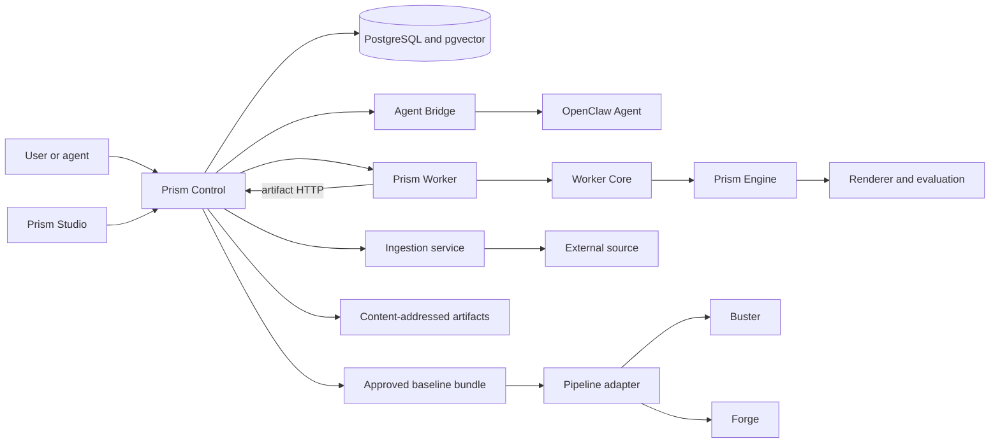

# Prism: From Design Request to Approved Baseline

Status: implemented architecture with stated environment limits
Audience: platform engineer, Prism developer, operator, technical reviewer
Owner: Prism maintainers
Evidence: skills/prism; contracts/prism/v1; skills/nova/plugins/prism-design
Evidence revision: `4e52c72788ac002788bc036a497d76c13e6a35fd`
Applies to: current Prism contracts, services, storage, Studio, and pipeline handoff
Last verified: source and test inspection on 2026-09-19

## Purpose

Prism turns design intent into an approved, immutable baseline that other
parts of KubeClaw can use. It is not one service and it is not only a visual
editor. It is a bounded product system with separate authorities for user
sessions, design changes, background work, source ingestion, durable state,
human approval, and pipeline handoff.

This page gives the complete map. Follow its links when you need field-level,
route-level, storage-level, or change-level detail.

## Read the Prism Documentation

| Need | Page | Result |
| --- | --- | --- |
| Trace services, requests, jobs, sessions, authentication, cancellation, and restart | [Prism runtime architecture](prism-runtime.md) | You can identify the owner and trust boundary for each call. |
| Trace projects, rounds, documents, revisions, corpus records, preferences, approvals, artifacts, and migrations | [Prism data architecture](prism-data.md) | You can identify the durable authority and consistency rule for each record. |
| Configure, start, use, diagnose, back up, restore, and stop Prism | [Operate Prism](../use/prism-studio.md) | You can complete and recover the supported operator and Studio journey. |
| Change a contract, operation, provider, route, renderer, Studio, retrieval, storage, or handoff | [Extend Prism safely](../extend/platform/prism.md) | You can plan the change and select the required checks. |
| Understand accepted tradeoffs and rejected alternatives | [Prism decisions](../decisions/prism.md) | You can see why the major boundaries exist. |

These pages are the canonical Prism documentation. Historical plans and
implementation records are not reader prerequisites.

## The Product Boundary

Prism owns the path from a design request to an approved baseline bundle.
It owns the meaning of a Design Document and the rules for changing it.
It also owns the evidence that connects an approval to one exact revision.

Prism does not own generic pipeline scheduling. Nova owns that work.
Prism does not own generic attempt isolation. Worker Core owns that work.
Prism does not own the test decision. Buster consumes an approved baseline and
produces test evidence. Forge receives a read-only implementation assignment.

**Decision:** Keep design authority in Prism and reuse neutral execution and
pipeline mechanisms at the outer boundaries.

**Reason:** A design revision, an approval, and a baseline have product meaning.
Generic workers and schedulers must not invent or weaken that meaning.

**Rejected alternative:** Put design state directly in Nova or in Worker Core.

**Cost:** A complete request crosses more than one process and contract.
Operators must be able to trace those identities across the boundary.

> **Source evidence — product and runtime boundary**
>
> [The Prism runtime exports the specialist Engine, Worker binding, and Domain as separate owners](https://github.com/datrab/kubeclaw/blob/4e52c72788ac002788bc036a497d76c13e6a35fd/skills/prism/runtime.ts#L1-L3).
>
> [The runtime role assembles Prism with neutral Worker Core and explicit package and capability inputs](https://github.com/datrab/kubeclaw/blob/4e52c72788ac002788bc036a497d76c13e6a35fd/packaging/runtime/roles/prism.json#L1-L28).
>
> [The pipeline adapter creates digest-bound Buster targets and read-only Forge assignments](https://github.com/datrab/kubeclaw/blob/4e52c72788ac002788bc036a497d76c13e6a35fd/skills/prism/pipeline-adapter/index.ts#L1-L57).

## One Request Through the System

Text version: A user works through Studio or calls Control through an allowed
agent path. Control validates identity and intent, and stores the durable
request. Model-driven generation uses a durable Agent job, the Agent Bridge,
and OpenClaw. Deterministic render, evaluation, embedding, and low-level
publication work goes through the Prism Worker and neutral Worker Core before
the Prism Engine interprets it. The production native Worker rejects
`generate`. Source ingestion enters through a separate service and rights
gate. PostgreSQL holds relational authority. The Worker reads and writes
immutable artifact bytes through Control. Human approval binds one revision
and its evidence into a baseline. The pipeline adapter then creates a
digest-bound Buster plan or read-only Forge assignments. Nova calls Control
directly; the adapter does not create a Nova input.

## Authority Map

| Component | Owns | Must not own |
| --- | --- | --- |
| Control | Public product API, sessions, durable product transitions, dispatch intent, approval and publication coordination | Browser rendering, generic process isolation, or unrecorded remote effects |
| Agent Bridge | Bounded agent request and job interface | Operator session authority or direct database mutation |
| Prism Worker | Prism attempt endpoint and specialist binding | Human approval or pipeline scheduling |
| Worker Core | Admission, deadlines, cancellation, native execution, accounting, journal, and sealed attempt result | Design semantics |
| Prism Engine | `generate`, `render`, `evaluate`, `ingest`, and `publish` semantics | Public session policy or human approval |
| Ingestion | Bounded external acquisition, quarantine, normalization, rights evidence, and Control handoff | Direct eligibility without rights admission |
| Studio | User interaction, typed edit intent, preview, comparison, and approval request | Canonical state, authority, or silent conflict resolution |
| PostgreSQL and pgvector | Relational records, current pointers, transactions, locks, and vector retrieval data | Large immutable artifact bytes |
| Artifact store | Digest-verified immutable bytes | Mutable project state or approval policy |
| Pipeline adapter | Translation from one approved baseline to bounded downstream inputs | Creation of approval or mutation of the baseline |

The separation is deliberate. It makes a partial failure visible. For example,
Control can retain a durable job while a worker is unavailable. A restart can
then reconcile the recorded intent instead of guessing whether the user asked
for the operation.

## The Durable Spine

The project is the long-lived product container. A round groups one design
cycle. A Design Document is the typed design value. Each accepted operation
creates a revision. The current-revision pointer can move only with a
compare-and-swap rule. This rule rejects a stale edit instead of overwriting a
newer revision.

Directions and preference events provide design input and learning evidence.
Corpus sources and revisions provide rights-qualified retrieval material.
Evaluation findings describe quality and risk. They do not grant approval.
Approval binds a person and a decision to one exact revision. Publication
creates an immutable baseline bundle and artifact digest for downstream use.

**Decision:** Use immutable revisions and evidence with small mutable pointers.

**Reason:** A reviewer must be able to reconstruct what was seen and approved.
A mutable document cannot supply this proof after a later edit.

**Rejected alternative:** Update one document row in place and store only its
latest content.

**Cost:** Storage grows with revisions. Retention, backup grouping, and
artifact cleanup need explicit rules.

> **Source evidence — durable spine**
>
> [The domain applies typed operations to a clone, checks the base revision, and validates the complete result](https://github.com/datrab/kubeclaw/blob/4e52c72788ac002788bc036a497d76c13e6a35fd/skills/prism/domain/index.ts#L5-L113).
>
> [The storage repository uses transactions and row locks for project and direction transitions](https://github.com/datrab/kubeclaw/blob/4e52c72788ac002788bc036a497d76c13e6a35fd/skills/prism/storage/index.ts#L79-L179).
>
> [Revision writes advance the current pointer with a compare-and-swap condition](https://github.com/datrab/kubeclaw/blob/4e52c72788ac002788bc036a497d76c13e6a35fd/skills/prism/storage/index.ts#L262-L292).
>
> [The artifact store verifies content identity and publishes with no-replace behavior](https://github.com/datrab/kubeclaw/blob/4e52c72788ac002788bc036a497d76c13e6a35fd/skills/prism/storage/artifacts.ts#L39-L67).

## Five Engine Operations

The Prism Engine accepts five operations in contract major 1:

- `generate` proposes typed document changes when a caller supplies a design
  provider; the production native Worker does not admit this operation;
- `render` creates bounded preview or export output;
- `evaluate` creates quality findings;
- `ingest` validates text and requests an embedding from the provider; it does
  not acquire a source or grant rights; and
- `publish` requires an `approved: true` input and emits a small manifest. It
  does not perform the governed approval checks or assemble the complete
  baseline archive.

The Engine validates the request and result identity for each operation.
The provider does not receive authority to replace the document directly.
The Engine applies provider operations and validates the resulting document.

This design contains an unreliable or external provider. It can propose work,
but it cannot bypass document semantics, approval, or result validation.
The Ingestion, corpus, Control, approval, and baseline paths provide the
product-level admission and publication boundaries around these lower-level
Engine operations.

> **Source evidence — engine boundary**
>
> [The Worker binding admits exactly five operations and validates operation-specific request and result schemas](https://github.com/datrab/kubeclaw/blob/4e52c72788ac002788bc036a497d76c13e6a35fd/skills/prism/engine/worker-binding.ts#L1-L49).
>
> [The Engine owns fingerprinting, idempotent execution, document validation, and application of provider operations](https://github.com/datrab/kubeclaw/blob/4e52c72788ac002788bc036a497d76c13e6a35fd/skills/prism/engine/index.ts#L69-L176).

## Retrieval, Rights, and Preference Evidence

Retrieval does not search every stored item and rank it later. Eligibility
comes first. Current state, rights, validity, model identity, required traits,
and avoid rules remove records that must not participate. Text and vector
candidates are then combined with deterministic ranking and source-family
limits.

Preference data is append-only evidence. A projection can group and decay that
evidence, but it retains its origins and respects retractions. This prevents one
mutable score from hiding why Prism learned a preference.

**Decision:** Separate admission, eligibility, ranking, and preference
projection.

**Reason:** A high similarity score must never override a rights restriction.
An explanation must also remain possible after preferences change over time.

**Cost:** Retrieval needs more filters and stored evidence than a simple vector
nearest-neighbor query.

> **Source evidence — retrieval and learning**
>
> [Corpus ingestion commits rights, revision, current pointer, and embedding in one transaction](https://github.com/datrab/kubeclaw/blob/4e52c72788ac002788bc036a497d76c13e6a35fd/skills/prism/corpus/index.ts#L30-L148).
>
> [Corpus search filters eligible current records before deterministic text and vector ranking](https://github.com/datrab/kubeclaw/blob/4e52c72788ac002788bc036a497d76c13e6a35fd/skills/prism/corpus/index.ts#L150-L238).
>
> [Preference projection deduplicates events, applies retractions, retains origins, and calculates time-dependent scores](https://github.com/datrab/kubeclaw/blob/4e52c72788ac002788bc036a497d76c13e6a35fd/skills/prism/preferences/index.ts#L1-L89).

## Failure Is Part of the Design

Prism has distinct answers for different failures:

| Failure | Safe response |
| --- | --- |
| Stale Studio edit | Keep the local intent, load the current revision, and reconcile explicitly. |
| Duplicate request | Return or reconcile the result only when the stable identity and input fingerprint agree. |
| Lost worker response | Inspect durable job and attempt state before dispatching again. |
| Cancellation | Treat cancellation as boundary-specific. Worker Core propagates its accepted attempt signal into Engine and cleanup. Studio aborts its Control HTTP request, but Control does not currently bind that disconnect to a request-wide operation signal. |
| Process restart | Reconcile durable intent, ownership, journal, and result state. Do not infer success from process exit. |
| Database uncertainty | Stop the transition and inspect the transaction outcome through stable record identity. |
| Missing artifact | Treat the baseline as incomplete. Do not replace content under the expected digest. |
| Ineligible source | Keep it outside retrieval even when its content or embedding exists. |
| Evaluation finding | Report and remediate it. Do not confuse a passing evaluation with human approval. |

The runtime, data, and operator pages give the exact records and procedures for
these cases.

## Configuration and Environment Proof

Prism needs more than source code. The complete path depends on PostgreSQL with
pgvector, artifact storage, service identities and secrets, Worker Core,
browser support for render and Studio checks, and the selected provider or
external source path.

A local contract test proves the contract at the inspected source revision.
It does not prove database migration, browser isolation, cgroup behavior,
cluster identity, backup recovery, or an external provider. Each guide names
the environment that its stronger checks require.

The operator page is the authority for every runtime setting and its
precedence. The data page is the authority for backup groups and retention.
The extension page maps each change to focused, native, browser, and live
checks.

## Current Limits

- The repository can prove source contracts without proving a live cluster.
- Native PostgreSQL checks need a compatible database with pgvector.
- Native worker checks need the documented launcher, cgroup, browser, and host
  controls.
- Browser acceptance needs the built Studio and Playwright environment.
- Real provider and source checks need separately authorized credentials and
  network access.
- A runtime-role manifest proves packaging intent. It does not prove that the
  role is active or reachable in a selected cluster.

Keep these limits visible in acceptance records. Do not turn an unavailable
environment check into a pass.

## Start Here for a Change

1. Use the authority map to select the smallest owner.
2. Trace the request in [Prism runtime architecture](prism-runtime.md).
3. Trace every durable value in [Prism data architecture](prism-data.md).
4. Confirm the operator effect in [Operate Prism](../use/prism-studio.md).
5. Follow the procedure and verification matrix in
   [Extend Prism safely](../extend/platform/prism.md).
6. Record which local, native, browser, and live checks actually ran.

This sequence keeps a feature understandable from intent to recovery. It also
keeps the documentation useful when the implementation grows.
