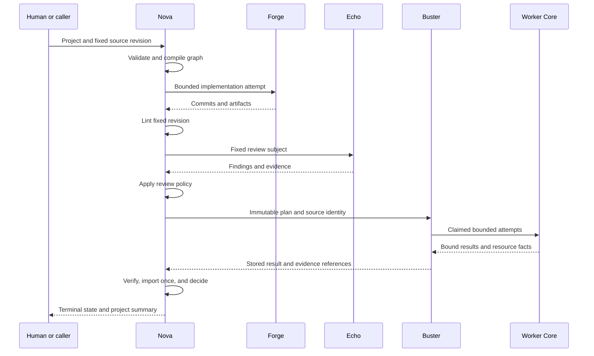
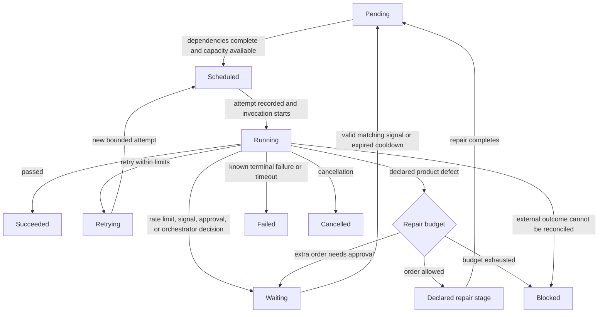

# Request, State, and Recovery

Status: implemented with stated limits
Audience: new reader, operator, maintainer, incident responder
Owner: Nova Core
Evidence: skills/nova/project/compiler.ts; skills/nova/core/execution; skills/nova/core/lifecycle
Evidence revision: `85e73b1885f04a9494f388cf6622ad0bde2db447`
Applies to: `nova-project.v2` and pipeline-plugin-v2
Last verified: source inspection on 2026-09-15

## Purpose

This page follows one software request from input to closure.
It explains the normal path first.
It then explains retry, repair, approval, restart, cancellation, and uncertain effects.

The example uses one account-page module.
The same lifecycle rules apply to a larger project graph.

## The Records That Give the Run Its Memory

KubeClaw does not treat process memory as the truth.
It writes ordered records under the run storage root.

| Record | What it preserves | Main identity |
| --- | --- | --- |
| Run snapshot | Fixed graph, registry, packages, and runtime profiles. | Run ID and content digests. |
| Lifecycle journal | Created, started, completed, waiting, resumed, and terminal events. | Run, stage, attempt, event sequence. |
| Effect journal | External-effect request, acceptance, and receipt. | Idempotency key and effect ID. |
| Signal journal | Human or orchestrator answers to a wait. | Wait ID, signal ID, idempotency key. |
| Artifact store | Reports, source archives, review material, and result evidence. | Artifact ID, namespace, digest, and size. |
| Remote job store | Buster plan request, status, result, and retained evidence. | Job, plan, run, request, and result digests. |

**Why this design exists:** A restart must not erase the difference between “not started” and “started without a known result.”
That difference controls whether a retry is safe.

> **Source evidence — durable run creation**
>
> [`runNewPipeline()` writes graph and registry snapshots before execution](https://github.com/datrab/kubeclaw/blob/85e73b1885f04a9494f388cf6622ad0bde2db447/skills/nova/core/execution/engine-run.ts#L36-L43).
>
> [`FileJournal` appends sequenced JSON records and uses a file mutex for transactions](https://github.com/datrab/kubeclaw/blob/85e73b1885f04a9494f388cf6622ad0bde2db447/skills/nova/core/state/journal.ts#L21-L94).
>
> **Limit:** A durable local file still depends on the durability and protection of its mounted storage.

## Normal Path

Text version: Nova validates and compiles the project.
Forge implements it, and Echo reviews a fixed revision.
Nova then sends a fixed test plan to Buster.
Worker Core controls each Buster attempt.
Nova verifies the returned evidence and closes the run.

### 1. Admit the Project

The input declares the project ID, run ID, repository roots, source revision, modules, and final checks.
The compiler rejects version 1 input.
It also rejects an invalid revision and a workspace inside the repository.

The source revision is important.
Without it, two attempts could claim to test the same task while reading different source.

> **Source evidence — project admission**
>
> [`compileProject()` validates the project shape, paths, revision, modules, and final policy](https://github.com/datrab/kubeclaw/blob/85e73b1885f04a9494f388cf6622ad0bde2db447/skills/nova/project/compiler.ts#L153-L192).

### 2. Compile a Fixed Graph

For each module, the compiler creates implementation, lint, optional review, and quality stages.
It adds final checks after all modules.
The project lane uses one-at-a-time execution to protect the shared repository revision.

The graph builder then checks every stage ID and dependency.
It rejects cycles, missing dependencies, invalid limits, and unsafe repair edges.
It freezes each stage definition.

**Why this design exists:** The full route must be known before any stage changes the repository.
This rule prevents a plugin from inventing later work during execution.

> **Source evidence — real module chain**
>
> [The compiler emits implementation, lint, review, and quality stages with repair routes](https://github.com/datrab/kubeclaw/blob/85e73b1885f04a9494f388cf6622ad0bde2db447/skills/nova/project/compiler.ts#L60-L86).
>
> [`buildGraph()` validates limits, dependencies, cycles, activation, and remediation](https://github.com/datrab/kubeclaw/blob/85e73b1885f04a9494f388cf6622ad0bde2db447/skills/nova/core/execution/graph-build.ts#L8-L96).

### 3. Select and Start a Stage

Nova finds stages whose dependencies succeeded or were safely skipped.
It starts no more than the graph concurrency limit.

Before invocation, Nova resolves one registered stage owner.
It requires that owner to be active.
It creates an attempt, a deadline, a revocable lease, and a capability-limited context.

The context exposes only declared artifacts and granted capabilities.
Every effect request passes a second resource check.

> **Source evidence — bounded invocation**
>
> [`StageExecutor.execute()` requires an active owner, records the attempt, validates the result, and cleans up](https://github.com/datrab/kubeclaw/blob/85e73b1885f04a9494f388cf6622ad0bde2db447/skills/nova/core/execution/stage-executor.ts#L31-L52).
>
> [`createPluginInvocationContext()` checks the lease, capability grant, resource constraint, event namespace, and run ID](https://github.com/datrab/kubeclaw/blob/85e73b1885f04a9494f388cf6622ad0bde2db447/skills/nova/core/execution/context.ts#L34-L79).

### 4. Perform External Effects

A stage often needs an external effect.
Examples include creating a workspace, writing an artifact, calling a runtime, or reading a secret.

The stage does not call the external system directly.
It requests a named capability through its context.
The selected adapter performs the effect.

Nova gives the effect a stable identity and an idempotency key.
It stores the request before it trusts the response.
It locks the target resource while the adapter works.
It stores a receipt when the result becomes known.

**Why this design exists:** A network timeout does not prove that the remote system did nothing.
A durable receipt prevents an automatic duplicate when the first call already succeeded.

> **Source evidence — effect ordering**
>
> [`DurableInvocation.execute()` checks prior state, acquires a resource lock, and rechecks under that lock](https://github.com/datrab/kubeclaw/blob/85e73b1885f04a9494f388cf6622ad0bde2db447/skills/nova/core/effects/durable-invocation.ts#L39-L67).
>
> [`DurableInvocation.#executeLocked()` stores the request before adapter invocation or receipt recovery](https://github.com/datrab/kubeclaw/blob/85e73b1885f04a9494f388cf6622ad0bde2db447/skills/nova/core/effects/durable-invocation.ts#L88-L100).

### 5. Return a Typed Result

The stage returns one result outcome.
The result can pass, request retry, request repair, wait, require the orchestrator, report a rate limit, block, fail, time out, or cancel.

Nova validates the result against the owning plugin schema.
Nova then maps the result to one allowed lifecycle action.
The plugin cannot supply a direct state change.

> **Source evidence — state machine**
>
> [The state type lists all stage states](https://github.com/datrab/kubeclaw/blob/85e73b1885f04a9494f388cf6622ad0bde2db447/skills/nova/core/lifecycle/reducer.ts#L9-L36).
>
> [The action type lists every lifecycle action that Core can take](https://github.com/datrab/kubeclaw/blob/85e73b1885f04a9494f388cf6622ad0bde2db447/skills/nova/core/lifecycle/reducer.ts#L38-L52).
>
> [`applyStageResult()` rejects illegal state and applies attempt limits](https://github.com/datrab/kubeclaw/blob/85e73b1885f04a9494f388cf6622ad0bde2db447/skills/nova/core/lifecycle/reducer.ts#L111-L135).

### 6. Dispatch and Import Buster Work

Nova resolves the test plan before dispatch.
The remote job binds the plan, run, source, and request identities.
Buster stores admission and moves the job through explicit states.

Buster uses Worker Core to enforce attempt claims and host limits.
It stores the complete result before it reports completion.
Evidence remains available through content digests and size limits.

Nova accepts only a terminal remote status.
It verifies the completed result and each evidence object.
It records the import so that the same result cannot gain authority twice.

**Why this design exists:** Transport success and quality success are different facts.
Buster proves what executed.
Nova applies the project policy to verified facts.

> **Source evidence — remote result boundary**
>
> [Buster checks result identity and stores result bytes before terminal status](https://github.com/datrab/kubeclaw/blob/85e73b1885f04a9494f388cf6622ad0bde2db447/skills/buster/engine/test-gates/remote-plan-service.ts#L217-L258).
>
> [`NovaRemoteGateImporter.import()` accepts terminal status, verifies a completed result, fetches evidence, and records the import](https://github.com/datrab/kubeclaw/blob/85e73b1885f04a9494f388cf6622ad0bde2db447/skills/nova/core/test-gates/remote-result-import.ts#L213-L247).
>
> [ADR-013 explains durable Nova-to-Buster jobs](../decisions/core-and-plugins.md#adr-013-use-authenticated-durable-nova-to-buster-plan-jobs).

### 7. Close the Run

Nova succeeds the run only when all required stages succeeded or were safely skipped.
An unused repair-only stage can remain pending.

Nova writes one terminal event for success, failure, blockage, or cancellation.
A terminal run rejects normal recovery and stale wait signals.

## Failure Paths

Failure handling is not one generic retry.
KubeClaw separates technical failure, product repair, human decision, interruption, and uncertain external state.

Text version: Nova moves a ready stage from pending to scheduled.
Nova records the attempt and moves the stage to running when invocation starts.
A passing result succeeds the stage.
A permitted technical retry creates another bounded attempt.
A cooldown, approval, or external signal puts the stage in waiting.
A declared product defect uses a separate repair budget and repair stage.
Nova blocks progress when a repair budget is exhausted or an external result remains uncertain.
A known terminal error fails the stage, and cancellation moves it to cancelled.

The diagram shows control decisions, not every journal event.
Recovery reconstructs these decisions from the journal before it permits the next transition.

### Technical Retry

A technical retry repeats the same class of work after a retryable failure.
Examples include temporary transport failure and rate limiting.

Each stage has `maxAttempts`.
A stage can also have `maxTechnicalRetries`.
Nova stops when a limit is exhausted.

The graph can require an orchestrator after a stated attempt number.
This rule prevents endless automatic work when repeated attempts do not help.

For a rate limit, Nova stores `retryAt`.
Recovery refuses to continue before that time.

### Product Repair

A product repair is not a technical retry.
A checker found a product defect and requests a change from a declared repair stage.

In the example, lint, Echo review, or Buster quality can send work back to Forge.
The graph declares this edge before execution.

Repair budgets use named categories, such as lint, review, and test.
The first configured orders can proceed automatically.
An additional order can require explicit authorization.
Later orders block after that exceptional authorization was used.

**Why this design exists:** An agent must not enter an unlimited fix-and-review loop.
Named budgets show which checker consumed the repair allowance.

> **Source evidence — repair limits**
>
> [`repairDisposition()` returns only allowed, authorize, or blocked](https://github.com/datrab/kubeclaw/blob/85e73b1885f04a9494f388cf6622ad0bde2db447/skills/nova/core/lifecycle/repair-budget.ts#L48-L56).
>
> [`budgetedRepairDecision()` records a repair order, creates a wait, or stops](https://github.com/datrab/kubeclaw/blob/85e73b1885f04a9494f388cf6622ad0bde2db447/skills/nova/core/lifecycle/repair-budget.ts#L64-L84).

### Wait and Approval

A wait means that the run needs an external fact before it can continue.
An approval is one kind of wait.

Nova stores a wait ID and its expected signal contract.
The run returns the `waiting` state.
It does not keep a process open and hope that the answer arrives.

A resume signal must match the run, wait, issuer, time window, and expected payload.
Nova stores the signal with an idempotency key.
A different signal with the same key causes a conflict.
A second answer for the same wait is rejected.

**Why this design exists:** A human decision can arrive after a restart.
The durable signal makes the decision attributable and safe to replay.

> **Source evidence — safe resume**
>
> [`resumePipeline()` verifies pinned inputs, validates the signal, records it, and rebuilds state](https://github.com/datrab/kubeclaw/blob/85e73b1885f04a9494f388cf6622ad0bde2db447/skills/nova/core/execution/engine-run.ts#L82-L96).
>
> [`recordSignal()` rejects changed duplicates and already-resolved waits](https://github.com/datrab/kubeclaw/blob/85e73b1885f04a9494f388cf6622ad0bde2db447/skills/nova/core/execution/engine-run.ts#L109-L114).

### Restart and Recovery

Recovery reloads the fixed graph, package identities, and lifecycle journal.
It does not compile a new graph for the old run.

Nova verifies that package changes have an authorized upgrade record.
It reconstructs every stage state from ordered events.
It reconciles applicable remote work and effects before new execution.

Recovery stops when a wait still needs a signal.
It also stops before a rate-limit cooldown expires.
A terminal run cannot enter ordinary recovery.

**Why this design exists:** Recovery must continue the same run, not create a similar replacement run.

> **Source evidence — recovery boundary**
>
> [`recoverPipeline()` verifies pinned packages and graph, reconciles, replays state, and rejects unresolved waits](https://github.com/datrab/kubeclaw/blob/85e73b1885f04a9494f388cf6622ad0bde2db447/skills/nova/core/execution/engine-run.ts#L56-L69).

### Cancellation

Cancellation first stops new pipeline progress.
Nova marks each unfinished stage as cancelled and writes the run cancellation event.

A remote worker has its own cancellation boundary.
Buster changes a job to `cancelling` before it reports `cancelled`.
Worker Core aborts active work during bounded drain when normal completion takes too long.

Cancellation is a request for controlled stop.
It is not proof that every external effect was reversed.
Cleanup state and effect receipts remain part of the evidence.

> **Source evidence — cancellation**
>
> [`PipelineLoop.#cancelled()` marks unfinished stages and the run](https://github.com/datrab/kubeclaw/blob/85e73b1885f04a9494f388cf6622ad0bde2db447/skills/nova/core/execution/pipeline-loop.ts#L75-L84).
>
> [`LocalWorkerRuntime.#drainOnce()` waits, aborts, and becomes unhealthy after a second timeout](https://github.com/datrab/kubeclaw/blob/85e73b1885f04a9494f388cf6622ad0bde2db447/skills/worker/core/worker/local-runtime.ts#L223-L235).

### Uncertain External Result

The hardest case occurs when an adapter accepted work but Nova did not receive the result.
Automatic repetition could create two workspaces, two jobs, or two publications.

Nova checks the effect journal before it invokes the adapter again.
If the adapter supports receipt lookup, Nova asks for the prior outcome.
If no reliable receipt exists, Nova blocks the stage for reconciliation.

It does not convert uncertainty into failure.
Failure says that the effect failed.
Uncertainty says that the effect outcome is not known.

**Why this design exists:** A visible stop is safer than an invisible duplicate side effect.

> **Source evidence — unknown outcome**
>
> [`DurableInvocation.#recover()` requires an adapter receipt for an accepted request](https://github.com/datrab/kubeclaw/blob/85e73b1885f04a9494f388cf6622ad0bde2db447/skills/nova/core/effects/durable-invocation.ts#L112-L117).
>
> [`StageExecutor.#failure()` converts unresolved effect recovery into a blocked stage](https://github.com/datrab/kubeclaw/blob/85e73b1885f04a9494f388cf6622ad0bde2db447/skills/nova/core/execution/stage-executor.ts#L125-L137).

### Escalation and Administrative Repair

An orchestrator wait is a normal, declared escalation.
It asks an authorized actor for a bounded decision.

Administrative reopen or repair is exceptional.
It needs a separate signed decision record and strict replay checks.
It must not edit the old lifecycle journal.

Use the operator procedure for any administrative action.
The architecture only defines why the control exists.

## State Summary

| State | Plain meaning | Normal next action |
| --- | --- | --- |
| `pending` | Dependencies or scheduling still prevent a start. | Nova selects it when ready. |
| `scheduled` | Nova selected the stage but has not recorded a running result. | Start the bounded attempt. |
| `running` | One recorded attempt is active. | Accept one validated result. |
| `retrying` | A retryable result remains within budget. | Schedule another attempt. |
| `waiting` | A repair, signal, approval, or cooldown must complete. | Resume only through the matching route. |
| `skipped` | A declared activation condition was false. | Treat as complete for dependency selection. |
| `succeeded` | The stage returned an accepted pass. | Release dependent stages. |
| `failed` | The stage produced a terminal failure. | Fail the run. |
| `blocked` | Policy, budget, or uncertainty forbids automatic progress. | Diagnose and use an authorized procedure. |
| `cancelled` | Cancellation stopped the stage. | Reconcile cleanup and close the run. |

## What the Final Result Proves

A succeeded run proves that the fixed graph reached its success rules.
It proves this for the recorded source, packages, configuration, and evidence.

It does not prove deployment acceptance unless the graph contains that scope.
It does not prove a live cluster path unless live acceptance tested that path.
It does not prove that an optional or disabled stage ran.

## Continue With Operations or Extension

- [Operate KubeClaw](../use/README.md) explains commands, diagnosis, backup, recovery, maintenance, and stated implementation limits.
- [Worker Trust operations](../use/worker-trust.md) explains live identity checks.
- [Extend KubeClaw](../extend/README.md) explains the supported extension points.
- [Deployment and Trust](deployment-and-trust.md) explains the process and network boundaries behind this flow.
- [Current status](../status/current.md) identifies remaining implementation and live acceptance work.
