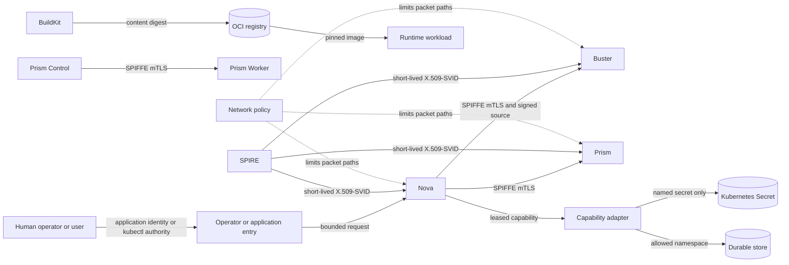

# Security and Trust

Status: implemented in parts; live enforcement and acceptance remain environment-specific
Audience: operator, security reviewer, architecture reader, maintainer
Owner: platform security and runtime maintainers
Evidence: my-values/infra/spire-values.yaml; charts/kubeclaw/templates/configmap-worker-trust.yaml; charts/prism/templates/networkpolicy.yaml; skills/nova/core/execution/authorization.ts; my-values/setup-secrets.sh; skills/nova/core/test-gates/source-snapshot.ts
Evidence revision: `5b6e1b97415ffefa4bb42bf2ae331f27597170b5`
Applies to: the current supported release and its documented lab deployment
Last verified: source inspection on 2026-09-20

## Purpose

KubeClaw runs code, reads repositories, starts test workloads, and stores evidence.
These actions cross several trust boundaries.
This page explains how the system identifies callers, limits authority, protects traffic, handles secrets, and verifies software inputs.

The design does not depend on one security control.
It uses several smaller controls because each control answers a different question.
A network rule answers where a packet can travel.
A workload certificate answers which workload connected.
A capability grant answers which operation a plugin can request.
A digest answers whether bytes changed.
None of these answers all four questions.

This page describes the implemented controls and their limits.
It does not claim that a rendered manifest proves enforcement in a live cluster.

## Security Goals and Assumptions

The current design has these goals:

- A worker accepts requests only from an explicitly allowed workload identity.
- A plugin receives only the capabilities and resource ranges that its stage lease grants.
- A network path stays closed unless a policy names its caller, destination, and port.
- Buster executes the exact committed source archive that Nova signed.
- Stored records and artifacts keep stable identities so that recovery does not depend on a mutable name.
- Secret values do not enter the repository or ordinary documentation.
- An optional operations tool does not silently become pipeline authority.

The design assumes that the Kubernetes control plane, the node operating system, and the SPIRE server are trusted administrative systems.
An administrator who controls these systems can replace workloads, policies, or identity material.
KubeClaw reduces application-level authority; it does not protect a cluster from its own administrator.

The design also assumes that operators protect signing keys, backup media, registry credentials, and external provider credentials.
Kubernetes Secrets are an access boundary, but they are not a hardware security module.

## Trust Boundary Map

Text version: humans enter through an operator or application boundary. Nova delegates work through explicit leases. Protected worker calls use SPIFFE mutual TLS. The Nova-to-Buster path also carries a signed, immutable source snapshot. Capability adapters mediate access to secrets and durable stores. BuildKit sends content to a registry, and deployments select immutable image identities. Network policy limits which of these paths packets can use.

## One Request Passes Several Independent Checks

| Question | Control | Rejected condition | Why the control is separate |
| --- | --- | --- | --- |
| Which workload connected? | SPIRE X.509-SVID and Envoy mutual TLS | Missing certificate, untrusted trust domain, or wrong URI SAN | An IP address is not a stable identity. |
| Did the request come through the trusted proxy? | Worker Core loopback check | The identity header comes from a non-loopback peer | An application header alone is easy to forge. |
| May this workload call this worker? | Exact SPIFFE-ID allowlist | The verified identity is not an allowed peer | A valid platform identity does not grant access to every service. |
| May this plugin request this operation? | Revocable lease and capability constraints | The capability, path, namespace, name, origin, or executable is outside the grant | Workload identity is broader than one plugin attempt. |
| Can the packet reach the port? | Default-deny and allow policies | No policy selects the path | Authentication should not make every service reachable. |
| Are these the intended bytes? | Git identity, signature, and content digest | Revision, signature, archive digest, plan digest, or request digest differs | Caller identity does not prove content identity. |

> **Source evidence — application authorization**
>
> [Worker Core requires a loopback proxy, parses one SPIFFE URI, and checks an exact allowlist](https://github.com/datrab/kubeclaw/blob/5b6e1b97415ffefa4bb42bf2ae331f27597170b5/skills/worker/core/worker/trust.ts#L17-L52).
>
> [Nova denies missing capabilities and checks every invocation against its lease](https://github.com/datrab/kubeclaw/blob/5b6e1b97415ffefa4bb42bf2ae331f27597170b5/skills/nova/core/execution/context.ts#L34-L79).
>
> [Capability authorization limits paths, namespaces, secret names, agents, origins, executables, and other resource classes](https://github.com/datrab/kubeclaw/blob/5b6e1b97415ffefa4bb42bf2ae331f27597170b5/skills/nova/core/execution/authorization.ts#L39-L130).

## Identity Types Must Not Be Confused

| Identity | Subject | Used for | Not used for |
| --- | --- | --- | --- |
| Human application identity | A person or external client | Sign-in, application roles, and product actions when that integration is enabled | Workload-to-workload authentication |
| Kubernetes ServiceAccount | A pod workload | Kubernetes API authorization and the input to SPIRE workload selection | Human sign-in or source integrity |
| SPIFFE ID | A running workload | Mutual TLS peer identity on protected internal routes | Long-term artifact signing |
| Stage lease | One plugin attempt | Capability names and resource constraints | Network encryption or Kubernetes RBAC |
| Ed25519 source authority | Nova source-snapshot signer | Nova-to-Buster committed-source provenance | General image signing or human identity |
| Git revision and tree | A committed source state | Selecting exact source bytes | Proving who approved or deployed those bytes |
| SHA-256 digest | An archive, request, plan, artifact, package, or image | Change detection and immutable references | Proving that the content is safe |

Human identity is intentionally separate from workload identity.
An application identity provider can authenticate a person, but it does not issue the SPIFFE certificate used by a worker route.
The current repository contains integration settings for application identity where a component uses them.
This page does not claim that one identity provider is required for every deployment.

The implemented Prism Studio path uses Tailscale identity headers at its trusted ingress boundary.
Studio adds a shared ingress secret when it forwards the request to Control.
Control requires both that secret and a non-empty Tailscale login before it creates a local Prism session.
The session contains the user, the `prism` audience, roles, and a 15-minute expiry, and an HMAC protects its payload.
The browser receives the session in an `HttpOnly`, `Secure`, `SameSite=Strict` cookie.
A second cookie and request header implement the CSRF check for state-changing requests.

Product acceptance adds another authorization check.
The session user must appear in the explicit product-operator allowlist.
The request origin and CSRF value must match, and a dedicated Ed25519 key signs the short-lived decision envelope.
Thus, sign-in does not by itself grant product-acceptance authority.
Changing the allowlist, ingress secret, session secret, or decision key needs a coordinated restart and a new positive and negative acceptance check.
The current session format does not include an automatic multi-key overlap mechanism.

> **Source evidence — current human session path**
>
> [Prism exchanges a trusted Tailscale ingress identity for a 15-minute HMAC session](https://github.com/datrab/kubeclaw/blob/5b6e1b97415ffefa4bb42bf2ae331f27597170b5/skills/prism/control/session.ts#L1-L20).
>
> [Control checks the session and CSRF value](https://github.com/datrab/kubeclaw/blob/5b6e1b97415ffefa4bb42bf2ae331f27597170b5/skills/prism/server/control-server.ts#L108-L122).
> [It creates protected cookies only through the ingress exchange](https://github.com/datrab/kubeclaw/blob/5b6e1b97415ffefa4bb42bf2ae331f27597170b5/skills/prism/server/control-server.ts#L152-L172).
>
> [Product decisions require an explicit operator, origin and CSRF checks, and a dedicated Ed25519 signing key](https://github.com/datrab/kubeclaw/blob/5b6e1b97415ffefa4bb42bf2ae331f27597170b5/skills/prism/control/product-decisions.ts#L20-L43).

Kubernetes ServiceAccounts are also not bearer identities by default in the main KubeClaw workloads.
The chart disables automatic token mounting unless a narrowly defined controller requires Kubernetes API access.
SPIRE uses the namespace and ServiceAccount name to derive the workload identity.

> **Source evidence — workload identity**
>
> [SPIRE selects labeled workloads and derives the SPIFFE ID from namespace and ServiceAccount](https://github.com/datrab/kubeclaw/blob/5b6e1b97415ffefa4bb42bf2ae331f27597170b5/my-values/infra/spire-values.yaml#L25-L40).
>
> [The KubeClaw ServiceAccount disables automatic token mounting by default](https://github.com/datrab/kubeclaw/blob/5b6e1b97415ffefa4bb42bf2ae331f27597170b5/charts/kubeclaw/templates/serviceaccount.yaml#L1-L10).

## SPIFFE, SPIRE, Envoy, and Worker Core

The trust domain is `kubeclaw.internal`.
An identity has this form: `spiffe://kubeclaw.internal/ns/<namespace>/sa/<service-account>`.
SPIRE attests the Kubernetes workload and supplies a short-lived X.509-SVID through the CSI and Workload API path.
The application does not read a long-lived private key from a configuration value.

Envoy is the transport boundary.
The calling application sends plain HTTP to a loopback listener.
The caller-side Envoy obtains its certificate through SDS and opens a mutual TLS connection.
The destination Envoy requires a client certificate, checks the exact URI SAN, replaces untrusted forwarded-certificate data, and sends verified identity data to the local application.
Worker Core then accepts that identity header only from loopback and checks its own allowlist.

This duplication is intentional.
Envoy rejects an invalid certificate before the request reaches the application.
Worker Core prevents a direct pod-network caller from supplying a forged identity header.

The configured peer relationships include these paths:

| Caller | Destination | Transport identity result |
| --- | --- | --- |
| Nova | Buster plan service | Buster accepts only the configured Nova ServiceAccount identity. |
| Nova | Prism agent | Prism accepts the configured Nova identity. |
| Prism Control and test runner | Prism agent | Prism accepts only the named Control and test-runner identities. |
| Prism agent | Prism Control | The agent verifies the Control identity. |
| Prism Control | Prism Worker | The Worker verifies the Control identity. |
| Prism Worker | Prism Control | Control verifies the Worker identity. |

> **Source evidence — proxy peer policy**
>
> [The shared worker-trust template defines protected listeners, exact URI SAN matches, SDS, and the Buster and Prism routes](https://github.com/datrab/kubeclaw/blob/5b6e1b97415ffefa4bb42bf2ae331f27597170b5/charts/kubeclaw/templates/configmap-worker-trust.yaml#L14-L197).
>
> [The Prism policies select the same application callers and protected ports](https://github.com/datrab/kubeclaw/blob/5b6e1b97415ffefa4bb42bf2ae331f27597170b5/charts/prism/templates/networkpolicy.yaml#L24-L59).

### Rotation and failure behavior

SPIRE controls SVID issuance and rotation.
Envoy receives updates through SDS, so applications do not need a restart for each normal certificate rotation.
If SPIRE, its CSI path, the Workload API socket, SDS, or peer validation is unavailable, the protected route fails closed.
The correct recovery action is to restore the identity path and verify the expected peer identity.
It is not to disable certificate validation or accept a wider identity.

A Helm render proves that the listener and peer policy are syntactically present.
Unit tests prove parser and authorization behavior.
Only a live negative-path test proves that the cluster rejects a missing certificate, a wrong SVID, and a forged forwarded-certificate header.

## Secrets: Ownership, Resolution, and Recovery

The operator owns secret creation, copying, rotation, and revocation.
The application owns only the use of a secret key that its workload or capability grant names.
This split prevents a plugin from turning a general secret store into an unbounded lookup service.

The generated [Secret Inventory](../reference/secrets.md) is the authoritative list of current secret names, keys, producers, and consumers.
Do not duplicate secret values in documentation, values files, logs, test fixtures, or support bundles.

Secret setup uses a controlled precedence:

1. Keep a complete existing Secret unless overwrite was explicitly requested.
2. Repair required missing keys when the setup path supports that repair.
3. Copy from an operator-selected source namespace when configured.
4. Read protected operator input or generate a value only in the supported interactive path.
5. Stop or warn when a required value is unavailable; do not invent an external credential.

The source-attestation Secret is a useful example.
Setup reuses a complete key pair or copies it from the configured source.
Otherwise, it generates an Ed25519 pair and restricts the temporary-file permissions.
Nova mounts the private key, while Buster mounts the public key.
This is deliberate asymmetry: Buster can verify source identity but cannot create a valid Nova source signature.

The secret-resolver adapter adds a second application boundary.
Its configuration maps a public logical name to one environment-variable name.
The stage lease must grant the logical name first.
The adapter then rejects an unmapped name, an unsupported operation, an empty value, and an already cancelled request.
It returns the value as confidential capability output.
It does not enumerate the environment and it does not accept an environment-variable name from the caller.

> **Source evidence — secret lifecycle**
>
> [Secret setup creates or repairs the source-attestation key pair and applies it as one Kubernetes Secret](https://github.com/datrab/kubeclaw/blob/5b6e1b97415ffefa4bb42bf2ae331f27597170b5/my-values/setup-secrets.sh#L610-L646).
>
> [Nova receives the private key from the source-attestation Secret](https://github.com/datrab/kubeclaw/blob/5b6e1b97415ffefa4bb42bf2ae331f27597170b5/my-values/nova-values.yaml#L125-L130), while [Buster receives its public key](https://github.com/datrab/kubeclaw/blob/5b6e1b97415ffefa4bb42bf2ae331f27597170b5/my-values/buster-values.yaml#L96-L101).
>
> [The secret resolver maps bounded logical names to environment values and fails closed for all other requests](https://github.com/datrab/kubeclaw/blob/5b6e1b97415ffefa4bb42bf2ae331f27597170b5/skills/common/plugins/secret-resolver/src/adapter.ts#L3-L22).

### Rotation procedure and compromise response

Plan rotation by consumer, not only by Secret name.
List every mount, environment reference, external client, and stored object that depends on the old value.
Create the replacement through the supported setup path.
Restart or reload consumers that do not watch changes, and run a positive and a negative check.
Revoke the old external credential after the new path works.

For the Nova-to-Buster signing key, coordinate both sides.
Buster must trust the matching public key before Nova sends snapshots signed by the new private key.
Existing retained jobs can still require the old verification key during their retention period.
The current single-key configuration does not provide an automatic overlapping-key rotation window.
Treat that limit as an operator-controlled maintenance boundary.

If a secret leaks, stop the affected entry path and revoke or replace the upstream credential.
Rotate the Kubernetes Secret, restart consumers, and inspect retained audit and request records.
Deleting only the Kubernetes Secret is not sufficient when the external credential remains valid.

## Network Segmentation and Negative Paths

KubeClaw treats a connection as an allowlist entry, not as an assumed property of one namespace.
Policies use default deny and add DNS, database, worker, ingestion, telemetry, registry, and external paths only where required.

The portable security contract is the permitted caller, destination, protocol, and port.
Cilium can add cluster-wide and identity-aware controls, but the pipeline must also operate on a different conforming CNI such as Flannel.
A deployment that uses standard Kubernetes NetworkPolicy must preserve the documented paths and prove enforcement with its chosen CNI.

Important negative checks are:

- An unrelated pod cannot reach a protected worker port.
- A valid but unlisted SPIFFE identity fails the TLS handshake or application allowlist.
- A direct caller cannot make Worker Core trust `x-forwarded-client-cert` from the pod network.
- A Prism workload cannot make an unlisted egress connection after default deny.
- A plugin cannot use network reachability to bypass a missing `network.http` grant.
- An operations Pod cannot execute in a namespace outside `rbac.execNamespaces`.

> **Source evidence — policy boundary**
>
> [Prism applies default deny, DNS, and explicit application paths](https://github.com/datrab/kubeclaw/blob/5b6e1b97415ffefa4bb42bf2ae331f27597170b5/charts/prism/templates/networkpolicy.yaml#L1-L110).
>
> [The platform policy separates cluster-wide default deny and DNS from namespace-specific routes](https://github.com/datrab/kubeclaw/blob/5b6e1b97415ffefa4bb42bf2ae331f27597170b5/my-values/infra/cilium-cluster-policies.yaml#L19-L90).

## Source, Package, Image, and Artifact Integrity

Integrity controls protect different objects at different times.

### Nova-to-Buster source

Nova resolves a commit and its tree and creates an archive from that commit.
It calculates the archive digest and size, and it signs canonical snapshot metadata with Ed25519.
Working-tree bytes are not included.
Buster verifies the source authority, signature, archive limit, archive digest, derived job ID, plan digest, and request digest before admission.

This design prevents a mutable checkout or changed archive from silently replacing the approved input.
It does not publish general public provenance and does not prove that the selected source is free from vulnerabilities.

> **Source evidence — committed source**
>
> [Nova builds and signs one archive from a verified Git commit](https://github.com/datrab/kubeclaw/blob/5b6e1b97415ffefa4bb42bf2ae331f27597170b5/skills/nova/core/test-gates/source-snapshot.ts#L16-L60).
>
> [Buster verifies the source signature and all request identities before admission](https://github.com/datrab/kubeclaw/blob/5b6e1b97415ffefa4bb42bf2ae331f27597170b5/skills/buster/engine/test-gates/remote-plan-service.ts#L84-L123).

### Plugin packages and isolated execution

A plugin declaration is not authority by itself.
Installation validates the package and its content identity.
Activation selects registrations for one runtime role.
The stage lease then grants a smaller set of capabilities.
Trusted first-party code can load in process; external code uses the isolation path and reaches host functions only through the bounded protocol.

This layered design makes a package manifest review useful without pretending that a manifest is a sandbox.
The [Plugin Runtime](plugin-runtime.md) explains package trust, activation, isolation, and removal in full.

### Container images and registry transport

The build path uses BuildKit and an operator-owned registry contract.
An immutable digest identifies the resulting image bytes.
Deployment configuration must preserve that digest identity instead of relying only on a mutable tag.

The current local registry is an anonymous HTTP lab service.
It does not provide production transport or authentication.
The client generator requires an explicit `http-lab` transport choice for that path and permits credentials only with HTTPS.
This prevents a lab exception from looking like a secure default.

Image digest pinning proves byte identity, not vulnerability status.
Scanning and SBOM evidence are separate release checks.
The Buster runtime includes a pinned Trivy database for repeatable offline checks; operators must understand that frozen vulnerability data becomes stale.

> **Source evidence — registry and scanner limits**
>
> [The registry client contract separates HTTPS from explicit HTTP lab transport and rejects authentication on HTTP](https://github.com/datrab/kubeclaw/blob/5b6e1b97415ffefa4bb42bf2ae331f27597170b5/scripts/registry-client-config.mjs#L57-L118).
>
> [The Buster runtime copies a versioned Trivy database into the immutable image](https://github.com/datrab/kubeclaw/blob/5b6e1b97415ffefa4bb42bf2ae331f27597170b5/docker/Dockerfile.buster-runtime#L115-L124).

### Durable artifacts and receipts

Content digests detect a changed artifact.
They do not decide whether an artifact is approved.
Approval, lifecycle state, producer identity, and content identity remain separate fields and records.
This separation lets recovery detect a missing or changed blob without inventing a new lifecycle decision.

Prism results currently use authenticated transport and contract identities.
Do not describe every Prism result as a signed artifact attestation.
The Nova-to-Buster source signature is the specific implemented signed provenance path described above.

## Least Authority by Layer

| Layer | Normal authority | Important exception or limit |
| --- | --- | --- |
| Kubernetes ServiceAccount | No automatically mounted token for ordinary KubeClaw workloads | The namespace controller mounts a token because it must manage bounded namespace resources. |
| Kubernetes RBAC | Named read or management verbs for one controller purpose | The optional Ops Pod has broad read access and optional namespace-scoped exec. |
| SPIFFE peer policy | Exact ServiceAccount identities for one protected route | A valid SVID still needs application authorization. |
| Network policy | Named pod, namespace, port, and external paths | Enforcement depends on the live CNI. |
| Plugin lease | Named capabilities with resource constraints | A grant must still have a configured adapter. |
| Secret access | Named Secret or resolver name for a declared consumer | A pod-level mount exposes that value to the selected container process. |
| File and process access | Canonical roots, allowed commands, isolated runners, and Worker Core limits | Trusted in-process plugins share the host process boundary. |
| OCI access | Configured endpoint, transport, and optional credential | The local HTTP lab registry is intentionally not production-grade. |

The Ops Pod deserves explicit attention.
It is an optional analysis and recovery tool, not a pipeline dependency.
Its ClusterRoles can read selected cluster resources, and `rbac.execNamespaces` creates pod-exec authority in each named namespace.
The default value contains `kubeclaw`.
An operator must review that list as privileged access and keep it as small as possible.

> **Source evidence — Ops authority**
>
> [The Ops chart separates cluster reads from namespace-scoped pod exec](https://github.com/datrab/kubeclaw/blob/5b6e1b97415ffefa4bb42bf2ae331f27597170b5/charts/ops-pod/templates/rbac.yaml#L1-L92).
>
> [The default exec namespace list contains only `kubeclaw`](https://github.com/datrab/kubeclaw/blob/5b6e1b97415ffefa4bb42bf2ae331f27597170b5/charts/ops-pod/values.yaml#L20-L29).

## Threats, Controls, and Residual Risk

| Threat | Primary controls | Residual risk or required operator proof |
| --- | --- | --- |
| A pod impersonates Nova | SPIRE attestation, exact URI SAN, loopback proxy check | A compromised cluster administrator or SPIRE authority can issue or redirect identity. |
| A plugin reads an unrelated secret | Lease grant, allowed secret names, resolver contract | Trusted in-process code still shares the process; package trust and activation must be correct. |
| Source changes between approval and test | Commit archive, tree identity, Ed25519 signature, archive digest | The signing private key and Nova runtime must remain trusted. |
| A mutable image tag changes | Digest selection and registry contract | Digest identity does not prove safety; scan data and release approval remain separate. |
| A workload reaches an undeclared service | Default deny and explicit paths | The operator must prove that the chosen CNI enforces policy. |
| A secret remains valid after deletion | Rotation and upstream revocation procedure | External systems control final revocation. |
| An observer or specialist changes lifecycle truth | Nova-owned journal and bounded plugin contract | A privileged operator can still modify storage or deployment configuration. |
| The Ops Pod becomes a general shell | Optional deployment and bounded exec namespace list | Any granted pod exec is high authority inside that namespace. |

## Verification and Recovery Order

Use this order when a protected path fails:

1. Confirm the expected source revision and rendered configuration.
2. Confirm that the source and destination use the intended ServiceAccounts.
3. Confirm SPIRE server, agent, CSI, and Workload API readiness.
4. Confirm that Envoy received an SVID and the trust bundle through SDS.
5. Confirm the exact caller URI SAN and destination peer allowlist.
6. Confirm the network policy allows only the expected caller and port.
7. Confirm Worker Core receives the request from loopback and accepts the verified identity.
8. Confirm the stage lease contains the required capability and exact resource range.
9. Confirm content signatures and digests before replay or re-admission.
10. Run one valid request and the relevant negative requests.

Do not recover by making the identity wildcard, disabling mutual TLS, opening all egress, or adding an unbounded capability.
Those changes hide the failed boundary and create a second incident.

## Current Limits

- Live SPIFFE, mutual TLS, and network-policy enforcement need environment-specific acceptance evidence.
- The local writable registry is an anonymous HTTP lab service.
- The single Nova-to-Buster signing-key configuration needs coordinated rotation.
- A trusted in-process plugin shares more authority than an isolated external plugin.
- Image digests and source signatures prove identity, not vulnerability status or business approval.
- Prism transport identity must not be described as general signed artifact provenance.
- The Ops Pod remains a privileged optional component when namespace exec is enabled.

These limits are not reasons to remove the existing controls.
They define where operators need additional production controls or live proof.

## Related Guides

- [Deployment and Trust](deployment-and-trust.md) maps these controls to workloads and storage.
- [Worker Trust](worker-trust.md) gives the route-level proxy and identity details.
- [Communication](communication.md) explains request, response, retry, and failure semantics.
- [Data and State](data-and-state.md) explains durable ownership and recovery boundaries.
- [Platform and Operations Architecture](platform-and-operations.md) explains the infrastructure that supplies these controls.
- [Plugin Runtime](plugin-runtime.md) explains package trust, activation, grants, and isolation.
- [Secret Inventory](../reference/secrets.md) lists exact secret producers and consumers without secret values.
- [Core and plugin decisions](../decisions/core-and-plugins.md) and [runtime and operations decisions](../decisions/runtime-and-operations.md) record the enduring trust choices and their trade-offs.
