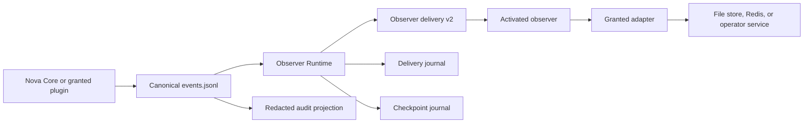
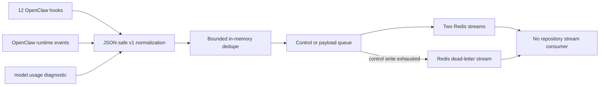
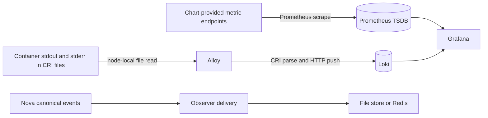

# Telemetry: Events, Delivery, and Evidence

Status: Nova v2 and OpenClaw agent-observability v1 producers are active; retained telemetry v1 has no active runtime producer or consumer
Audience: runtime developer, observer author, operator, security reviewer
Owner: observability maintainers
Evidence: skills/nova/core/telemetry; skills/common/plugins/openclaw-agent-observer; contracts/agent-observability/v1; skills/common/plugins/telemetry-observer; skills/common/plugins/telemetry-store; skills/common/plugins/redis-transport; contracts/telemetry/v1
Evidence revision: `32b02816cc19cc8865a45b221b8b6ca28e99e8fb`
Applies to: Nova lifecycle-event.v2, plugin-domain-event.v2, observer delivery v2, OpenClaw agent-observability ingress v1, and retained telemetry v1 assets
Last verified: contract, runtime, plugin, chart configuration, and focused-test inspection on 2026-09-21

## Purpose

Telemetry answers what the system observed. It does not get permission to
change what the pipeline decided.

In the Nova path, Nova first commits a canonical event to its run journal. An observer can then
receive that event, redact it, and send a projection to a file store, Redis, an
operator channel, or another granted adapter. If a sink fails, the canonical
event still exists. Recovery restarts delivery from a verified checkpoint.

This order is deliberate. It prevents a dashboard, transport, or notification
service from becoming a second pipeline state machine.

## Two Contract Families And One Host Ingress Contract

The repository contains two telemetry contract families and one separate
OpenClaw host-ingress contract. Nova v2 and host ingress have active producers,
but they do not join into one end-to-end path.

| Family | Status | Runtime producer and consumer | Use |
| --- | --- | --- | --- |
| Nova v2 events and observer delivery | Active | Nova Core, plugin contexts, Observer Runtime, activated observer plugins, and selected adapters | Canonical runtime events and their controlled delivery |
| `agent-observability` ingress v1 | Active producer on the Buster OpenClaw host | `kubeclaw-agent-observer` writes Redis; no repository consumer reads these streams | Bounded copies of OpenClaw hooks, runtime events, and model-usage diagnostics |
| `contracts/telemetry/v1` flat envelope | Retained asset | None found in repository runtime code | Compatibility material for possible external readers; schema and generated-type checks only |

Do not confuse the two v1 names. Agent-observability v1 is a live Redis writer.
Telemetry v1 is the inactive retained asset described below. Do not describe
telemetry v1 schemas as the live ingestion contract. Their `cursor`,
timestamps, source, authority strings, quarantine bundles, and generated types
do not create a running service. No v1-to-v2 adapter exists.

> **Source evidence — the version boundary**
>
> [The retained v1 README defines its inactive runtime status and limits](https://github.com/datrab/kubeclaw/blob/32b02816cc19cc8865a45b221b8b6ca28e99e8fb/contracts/telemetry/v1/README.md#L1-L7).
>
> [The active agent-observability contract fixes its schema, source, stream
> names, event types, and absolute event-size ceiling](https://github.com/datrab/kubeclaw/blob/32b02816cc19cc8865a45b221b8b6ca28e99e8fb/contracts/agent-observability/v1/src/constants.ts#L1-L47).
>
> [The active SDK defines lifecycle and plugin-domain event envelopes](https://github.com/datrab/kubeclaw/blob/32b02816cc19cc8865a45b221b8b6ca28e99e8fb/skills/common/plugin-runtime/sdk/src/generated/contracts.ts#L597-L656).
> [It defines observer delivery and checkpoint contracts separately](https://github.com/datrab/kubeclaw/blob/32b02816cc19cc8865a45b221b8b6ca28e99e8fb/skills/common/plugin-runtime/sdk/src/generated/contracts.ts#L657-L672).

### What the retained v1 asset contains

The retained catalog names 53 event types. Each type has one source payload
schema and one generated flat event schema. The bundle directory adds 16 schema
documents for archives, manifests, evidence exports, logs, health, and related
read models. The content manifest binds 132 delivered files by byte count and
SHA-256. Generated TypeScript and Go models are part of that set.

These counts describe repository assets only. They do not prove that a service
emits, accepts, stores, orders, or queries any v1 event. The schema accepts a
nullable cursor, but no current consumer enforces its proposed
`project/run/sequence` meaning. `source` and `authority` fields also do not
authenticate a sender.

> [The retained catalog is the complete 53-type source list](https://github.com/datrab/kubeclaw/blob/32b02816cc19cc8865a45b221b8b6ca28e99e8fb/contracts/telemetry/v1/catalog.json#L1-L28).
>
> [The retained contract describes its generated 132-file content manifest](https://github.com/datrab/kubeclaw/blob/32b02816cc19cc8865a45b221b8b6ca28e99e8fb/contracts/telemetry/v1/README.md#L26-L36).
> [The manifest states the compatibility rules and binds each listed file by
> byte count and SHA-256](https://github.com/datrab/kubeclaw/blob/32b02816cc19cc8865a45b221b8b6ca28e99e8fb/contracts/telemetry/v1/contract-manifest.json#L1-L23).

## Active Data Path

Text version: Nova Core or a granted plugin appends an event to the canonical
journal. Observer Runtime filters it by an installed subscription. It records
each delivery attempt, invokes the observer with a bounded lease, and writes a
checkpoint only after success. The observer invokes a granted adapter. The sink
stores a projection. Audit is rebuilt directly from the canonical journal.

The active path has six authority boundaries:

1. The producer owns event meaning.
2. The Nova journal owns canonical order and durable presence.
3. The observer registration owns subscription and failure policy.
4. Observer Runtime owns attempt and checkpoint state.
5. The adapter owns transport-specific durability and limits.
6. The sink owns query and retention, but not pipeline lifecycle.

### OpenClaw agent-observability v1 path

This second active path does not enter Nova's journal or Observer Runtime. The
current chart enables it only for the Buster OpenClaw role.

The extension registers 12 hooks. It also subscribes to six OpenClaw runtime
streams and to the `model.usage` diagnostic. It converts accepted input to
`AgentObservabilityIngressEventV1`. The envelope contains `v: 1`, the fixed
source `openclaw.plugin.agent-observer`, a producer timestamp, optional
correlation identity, and a type-specific payload. Tool events are the only
events that require both `tool_call_id` and `model_call_id`. Other identity
fields can be absent, so a Redis reader must not assume that `run_id` exists.

The normalizer accepts plain JSON values, dates, and errors. It rejects
accessors and proxies, converts circular references to `[Circular]`, and limits
traversal to depth 256, 2,621,440 nodes, and a 5 MiB normalization ceiling. The
configured 3 MiB serialized-event check is stricter and runs before queue
admission. These checks protect the process from unsafe object traversal. They
do not remove confidential content.

Two in-memory controls reduce duplicate writes:

- a runtime event with `runId`, `stream`, and `seq` uses their SHA-256 value for
  60-second deduplication; this map holds at most 10,000 entries;
- an LLM-output event with `model_call_id` uses a canonical content digest for
  a 10-second hook/runtime pairing window; this map also holds at most 10,000
  entries.

Other events have no deduplication key. Both maps disappear when the process
restarts. Redis uses `XADD *`, not an idempotency key, so a restart or a replay
can create another entry.

| Redis stream | Event types |
| --- | --- |
| `pipeline:agent-observability:payload:v1` | `openclaw.llm.input`, `openclaw.llm.output`, `openclaw.tool.started`, `openclaw.tool.finished` |
| `pipeline:agent-observability:control:v1` | `openclaw.agent.ended`, the three `openclaw.subagent.*` types, `openclaw.model.started`, `openclaw.model.ended`, `openclaw.model.usage`, `openclaw.session.started`, `openclaw.session.ended` |
| `pipeline:agent-observability:deadletter:v1` | A failed control entry plus failure time, source stream, error text, and original serialized data |

The writer has one control queue and one payload queue. The configured limit is
100 events in each queue. Control has priority. A full queue or an event larger
than 3 MiB is dropped before Redis. Control writes get three attempts with
100 ms and 200 ms waits under the configured 1,000 ms delay ceiling. Payload
writes get one attempt. Each command has a 5,000 ms timeout. After the final
control failure, the writer tries one write to the dead-letter stream. A failed
dead-letter write drops the record. All three streams use approximate `MAXLEN`:
10,000 for control and payload, and 1,000 for dead letters.

The repository has no `XREAD`, consumer group, acknowledgement, checkpoint, or
replay implementation for these three stream names. The mapping from ingress
types to possible telemetry types is descriptive data; no current service
performs that promotion. Therefore, a successful `XADD` proves only that Redis
accepted one bounded projection. It does not prove that a consumer processed
the event. An external consumer must define its own start position,
acknowledgement, idempotency, retention, and recovery contract before this path
can support end-to-end evidence.

> **Source evidence — OpenClaw producer path**
>
> [The extension registers hooks and its runtime-event subscription](https://github.com/datrab/kubeclaw/blob/32b02816cc19cc8865a45b221b8b6ca28e99e8fb/skills/common/plugins/openclaw-agent-observer/src/index.ts#L240-L268).
> [It also registers status, self-test, and service lifecycle](https://github.com/datrab/kubeclaw/blob/32b02816cc19cc8865a45b221b8b6ca28e99e8fb/skills/common/plugins/openclaw-agent-observer/src/index.ts#L269-L308).
> [Normalization extracts optional correlation identities](https://github.com/datrab/kubeclaw/blob/32b02816cc19cc8865a45b221b8b6ca28e99e8fb/skills/common/plugins/openclaw-agent-observer/src/hook-normalizers.ts#L67-L90)
> and [constructs and validates the v1 event before queue admission](https://github.com/datrab/kubeclaw/blob/32b02816cc19cc8865a45b221b8b6ca28e99e8fb/skills/common/plugins/openclaw-agent-observer/src/hook-normalizers.ts#L126-L166).
>
> [The in-memory dedupe rules and their 10,000-entry bounds are explicit](https://github.com/datrab/kubeclaw/blob/32b02816cc19cc8865a45b221b8b6ca28e99e8fb/skills/common/plugins/openclaw-agent-observer/src/observer-support.ts#L32-L79).
> [The contract fixes depth and node limits from the 5 MiB absolute
> ceiling](https://github.com/datrab/kubeclaw/blob/32b02816cc19cc8865a45b221b8b6ca28e99e8fb/contracts/agent-observability/v1/src/complexity.ts#L1-L28).
> [Routing assigns four raw-content types to the payload stream and all other
> ingress types to control](https://github.com/datrab/kubeclaw/blob/32b02816cc19cc8865a45b221b8b6ca28e99e8fb/contracts/agent-observability/v1/src/routing.ts#L14-L29).
> [Validation permits optional identity fields but requires tool and model-call
> identity for tool events](https://github.com/datrab/kubeclaw/blob/32b02816cc19cc8865a45b221b8b6ca28e99e8fb/contracts/agent-observability/v1/src/validation.ts#L225-L244).
> [Queue admission, event-size rejection, and control-first selection are in the
> Redis writer](https://github.com/datrab/kubeclaw/blob/32b02816cc19cc8865a45b221b8b6ca28e99e8fb/skills/common/plugins/openclaw-agent-observer/src/redis-writer.ts#L122-L155).
> [The writer applies bounded retries and command timeouts](https://github.com/datrab/kubeclaw/blob/32b02816cc19cc8865a45b221b8b6ca28e99e8fb/skills/common/plugins/openclaw-agent-observer/src/redis-writer.ts#L201-L231),
> then [records a drop and makes the one dead-letter attempt for control
> data](https://github.com/datrab/kubeclaw/blob/32b02816cc19cc8865a45b221b8b6ca28e99e8fb/skills/common/plugins/openclaw-agent-observer/src/redis-writer.ts#L234-L264).

#### Exact deployed configuration

Configuration from a hook overrides service configuration. Service
configuration overrides registration configuration. The merged plugin value
then overrides the matching environment variable. The Buster chart supplies
all required non-secret values in the OpenClaw entry and supplies the Redis
host, port, and password as environment variables.

| Plugin key | Environment fallback | Deployed value | Effect |
| --- | --- | --- | --- |
| `enabled` | `OPENCLAW_AGENT_OBSERVER_ENABLED` | `true` | Starts Redis output and diagnostic subscription. |
| `redisHost` | `REDIS_HOST` | chart Redis host | Selects the Redis service. |
| `redisPort` | `REDIS_PORT` | chart value, default `6379` | Selects the Redis port. |
| `redisUsername` | `REDIS_USERNAME` | unset | Uses password-only Redis authentication. |
| `redisPassword` | `REDIS_PASSWORD` | Secret value | Authenticates the Redis connection. |
| `redisTls` | `REDIS_TLS` | unset, therefore `false` | Does not add TLS in this profile. |
| `redisNetworkIsolation` | `REDIS_NETWORK_ISOLATION` | `isolated` | Satisfies the extension's secure-transport policy with the password. |
| `maxEventBytes` | `OPENCLAW_AGENT_OBSERVER_MAX_EVENT_BYTES` | `3145728` | Drops a normalized event above 3 MiB; the contract hard ceiling is 5 MiB. |
| `maxQueuePerStream` | `OPENCLAW_AGENT_OBSERVER_MAX_QUEUE_PER_STREAM` | `100` | Bounds each in-memory queue separately. |
| `redisCommandTimeoutMs` | `OPENCLAW_AGENT_OBSERVER_REDIS_COMMAND_TIMEOUT_MS` | `5000` | Bounds each `XADD`. |
| `streamMaxLen` | `OPENCLAW_AGENT_OBSERVER_STREAM_MAXLEN` | `10000` | Sets approximate control and payload stream length. |
| `deadLetterMaxLen` | `OPENCLAW_AGENT_OBSERVER_DEADLETTER_MAXLEN` | `1000` | Sets approximate dead-letter stream length. |
| `controlWriteMaxAttempts` | `OPENCLAW_AGENT_OBSERVER_CONTROL_WRITE_MAX_ATTEMPTS` | `3` | Retries control writes only. |
| `controlWriteRetryBaseMs` | `OPENCLAW_AGENT_OBSERVER_CONTROL_WRITE_RETRY_BASE_MS` | `100` | Starts exponential retry delay. |
| `controlWriteRetryMaxMs` | `OPENCLAW_AGENT_OBSERVER_CONTROL_WRITE_RETRY_MAX_MS` | `1000` | Caps each retry delay. |
| `hookPriority` | `OPENCLAW_AGENT_OBSERVER_HOOK_PRIORITY` | `-100` | Registers the observer early in hook order. |
| `hookTimeoutMs` | `OPENCLAW_AGENT_OBSERVER_HOOK_TIMEOUT_MS` | `1000` | Bounds each OpenClaw hook callback. |

> [The resolver defines configuration precedence and validation](https://github.com/datrab/kubeclaw/blob/32b02816cc19cc8865a45b221b8b6ca28e99e8fb/skills/common/plugins/openclaw-agent-observer/src/config.ts#L83-L112).
> [The Buster gateway entry supplies the active values](https://github.com/datrab/kubeclaw/blob/32b02816cc19cc8865a45b221b8b6ca28e99e8fb/charts/kubeclaw/templates/configmap-gateway.yaml#L262-L311).
> [The Pod obtains Redis host, port, and password from values and the configured
> Secret](https://github.com/datrab/kubeclaw/blob/32b02816cc19cc8865a45b221b8b6ca28e99e8fb/charts/kubeclaw/templates/deployment.yaml#L1282-L1299).

#### Sensitive data and evidence limit

LLM input can contain the prompt, system prompt, history, and provider request.
LLM output can contain the complete response and history. Tool events can carry
parameters, results, and errors. Error normalization can include a stack. The
producer does not apply semantic or field-name redaction to these values. Redis
and any external consumer must therefore be treated as authorized for raw agent
content. Queue bounds and JSON normalization are not privacy controls.

The status method exposes queue and drop counters, written counts, retry and
dead-letter counts, the last error, and whether a Redis client object exists.
`connected: true` does not prove a successful command or a consumer. A host
restart loses the counters and both queues. No metric exporter persists them.
If later configuration disables the extension, the flush loop stops. Existing
queued entries remain only in memory. A later enabled event can schedule them,
but stopping the service while disabled loses them. Configuration-resolution
and normalization failures produce one warning per failure class outside the
writer counters, so the counters are not a complete received-event total.
Repository tests exercise normalization and writer behavior with controlled
clients. They do not prove delivery through a deployed OpenClaw host, Redis
persistence, or downstream consumption.

> [LLM payload construction retains raw prompts, responses, histories, and
> metadata](https://github.com/datrab/kubeclaw/blob/32b02816cc19cc8865a45b221b8b6ca28e99e8fb/skills/common/plugins/openclaw-agent-observer/src/hook-payloads.ts#L54-L91).
> [Tool and agent-end construction retains parameters, results, histories, and
> errors](https://github.com/datrab/kubeclaw/blob/32b02816cc19cc8865a45b221b8b6ca28e99e8fb/skills/common/plugins/openclaw-agent-observer/src/hook-payloads.ts#L94-L124).
> [The status and counter surface reports process-local writer state](https://github.com/datrab/kubeclaw/blob/32b02816cc19cc8865a45b221b8b6ca28e99e8fb/skills/common/plugins/openclaw-agent-observer/src/index.ts#L129-L147).
> [The flush loop runs only while configuration remains enabled and reschedules
> only under that condition](https://github.com/datrab/kubeclaw/blob/32b02816cc19cc8865a45b221b8b6ca28e99e8fb/skills/common/plugins/openclaw-agent-observer/src/redis-writer.ts#L170-L199).

## Active Event Catalog

### Lifecycle events

Nova Core owns the complete closed list of lifecycle event types.

| Family | Event types | Producer | Meaning and primary consumer |
| --- | --- | --- | --- |
| Run | `run.created`, `run.started`, `run.resumed`, `run.waiting`, `run.paused`, `run.succeeded`, `run.failed`, `run.blocked`, `run.cancelled` | Pipeline runner and administrative continuation | Run frontier and terminal status; recovery, audit, observers |
| Stage | `stage.scheduled`, `stage.started`, `stage.waiting`, `stage.retrying`, `stage.skipped`, `stage.succeeded`, `stage.failed`, `stage.blocked`, `stage.cancelled` | Pipeline loop and administrative repair | Stage lifecycle and consumed attempts; recovery, audit, observers |
| Attempt | `attempt.created`, `attempt.dispatched`, `attempt.completed`, `attempt.timed_out`, `attempt.cancelled` | Stage executor | Exact attempt lifecycle and result boundary; recovery, artifact reconciliation, observers |
| Effect | `effect.requested`, `effect.accepted`, `effect.completed`, `effect.failed` | Effect Coordinator bridge | External side-effect audit; effect recovery and audit. Observer-owned effect events are intentionally not re-observed. |
| Artifact | `artifact.created` | Artifact checkpoint recorder after a verified adapter response | Durable artifact reference and producer binding; later stages, recovery, audit |
| Wait | `wait.created`, `wait.resolved`, `orchestrator.required` | Lifecycle reducer, signal path, and orchestrator boundary | Durable pause, exact resume signal, or required external decision |

Each lifecycle event has the same envelope fields:

| Field | Rule |
| --- | --- |
| `schemaVersion` | Exactly `lifecycle-event.v2`. |
| `eventId` | New opaque event identity. Current Nova producers use `event:<UUID>`. |
| `sequence` | Positive append position in the canonical event journal. |
| `type` | One value from the closed list above. |
| `identity` | Always `runId`; optionally stage, attempt, effect, wait, or artifact ID as relevant. |
| `occurredAt` | Producer timestamp. It does not override journal sequence. |
| `causationId` | Prior decision, attempt, delivery, or signal identity when the producer has one; otherwise null. |
| `payload` | Event-specific portable JSON. Meaning belongs to the producer path. |

> **Source evidence — lifecycle production**
>
> [The SDK contract contains the full closed list and common envelope fields](https://github.com/datrab/kubeclaw/blob/32b02816cc19cc8865a45b221b8b6ca28e99e8fb/skills/common/plugin-runtime/sdk/src/generated/contracts.ts#L605-L645).
>
> [The pipeline runner assigns the journal sequence and writes run, stage, and attempt events through one append function](https://github.com/datrab/kubeclaw/blob/32b02816cc19cc8865a45b221b8b6ca28e99e8fb/skills/nova/core/execution/runner.ts#L49-L78).
>
> [The effect bridge emits bounded effect facts but excludes effects created by observer delivery to prevent a feedback loop](https://github.com/datrab/kubeclaw/blob/32b02816cc19cc8865a45b221b8b6ca28e99e8fb/skills/nova/core/execution/engine-runtime.ts#L53-L59).

### Plugin domain events

`plugin-domain-event.v2` uses the same event identity, sequence, timestamp,
causation, and JSON payload model. Its `type` is an open string, and it adds the
exact registration provenance of the producer.

A stage plugin emits through its leased invocation context. Nova supplies the
producer provenance and uses the attempt ID as causation. An adapter can emit
through Adapter Runtime. An observer can also emit a domain event, but events
that describe its adapter effects are excluded from later observer delivery.

An open event type is an extension point, not permission to invent an
unversioned contract. A producer must document the type, payload fields,
sensitive fields, subscribers, compatibility rule, and removal plan before a
consumer relies on it.

> **Source evidence — domain event authority**
>
> [The SDK requires producer provenance on every plugin domain event](https://github.com/datrab/kubeclaw/blob/32b02816cc19cc8865a45b221b8b6ca28e99e8fb/skills/common/plugin-runtime/sdk/src/generated/contracts.ts#L646-L656).
>
> [Stage emission assigns canonical sequence, producer provenance, attempt causation, and the supplied type and payload](https://github.com/datrab/kubeclaw/blob/32b02816cc19cc8865a45b221b8b6ca28e99e8fb/skills/nova/core/execution/stage-executor.ts#L82-L97).

## Producer and Consumer Matrix

| Record | Producer | Canonical authority | Direct consumers | Subscription or filter | Delivery and sink |
| --- | --- | --- | --- | --- | --- |
| Lifecycle v2 event | Nova runner, loop, executor, effect bridge, wait/resume, or administrative repair | Hash-verified `events.jsonl` | Recovery projections, artifact recorder, audit reader, Observer Runtime | Recovery selects run and known types; observers require exact registered type | Observer policy controls retries; selected adapter controls sink |
| Plugin domain v2 event | Granted stage, adapter, or observer context; Nova assigns provenance and sequence | Same `events.jsonl` | Observer Runtime, audit, domain-specific readers | Exact subscription string; effect-loop exclusion applies | Same observer and adapter path |
| Observer delivery v2 | Observer Runtime | Delivery is not lifecycle authority; source event remains authority | One activated observer registration | Registry grant plus exact event-type subscription | Direct in-process invocation under a revocable lease and timeout |
| Delivery attempt record | Observer Runtime | Recovery authority for delivery attempts | Observer recovery | Exact observer ID, event ID, and attempt number | Local hash-chained `observer-deliveries.jsonl` |
| Observer checkpoint v2 | Observer Runtime after successful delivery | Recovery frontier for one observer and run | Observer recovery | Registration provenance, run ID, sequence, event ID | Local hash-chained `observer-checkpoints.jsonl` |
| Telemetry envelope v2 | Telemetry observer | Projection only | `telemetry.emit` adapter | Observer subscriptions in the active platform configuration | File telemetry store or Redis telemetry adapter |
| Audit v1 projection | Audit reader | Projection only; includes source record hash and journal head | CLI caller or operator | One run ID | Returned JSON; not written as a second authority by this reader |
| Agent-observability ingress v1 | Buster OpenClaw extension | OpenClaw host input is the source; the Redis copy is a projection | No repository stream consumer | Hook registration, runtime-stream mapping, or `model.usage` diagnostic | In-memory queue, then control or payload Redis stream |
| Agent-observability dead letter | Same extension after a control write exhausts retries | Failure copy only | No repository stream consumer | Control events only | One best-effort `XADD` to the bounded dead-letter stream |
| Retained telemetry v1 event | No active repository runtime producer | None in current runtime | No active repository runtime consumer | Not applicable | Schema generation and tests only |

The plugin manifest declares what an observer can subscribe to. The platform
configuration decides whether that registration is enabled and granted. A
manifest on disk does not prove activation or a reachable sink.

### Shipped observer registrations

The repository ships five observer registrations. This table is an available
registration catalog. A deployment activates only the entries selected in its
platform configuration.

| Registration | Exact subscriptions | Capability and policy |
| --- | --- | --- |
| `kubeclaw.telemetry-observer:telemetry` | All lifecycle types listed above except `run.resumed`, `run.waiting`, `run.paused`, and `stage.scheduled` | `telemetry.emit`; at least once, per run, best effort, 5 attempts, 1,000 ms backoff, 10,000 ms timeout |
| `kubeclaw.notification-observer:notifications` | `run.started`, the four terminal run events, `stage.started`, the five terminal stage events including `stage.skipped`, `stage.retrying`, `stage.waiting`, and `orchestrator.required` | `operator.request`; at least once, per run, best effort, 5 attempts, 1,000 ms backoff, 10,000 ms timeout |
| `kubeclaw.notification-observer:preview-delivery` | `artifact.created` | `operator.request`; same delivery policy |
| `kubeclaw.agent-observability:ingester` | The 12 OpenClaw domain types `agent-end`, `llm-input`, `llm-output`, `subagent-spawned`, `subagent-delivery-target`, `subagent-ended`, `before-tool-call`, `after-tool-call`, `model-call-started`, `model-call-ended`, `session-start`, and `session-end`, each prefixed with `plugin.kubeclaw.openclaw-agent-events.` | `telemetry.emit`; at least once, per run, best effort, 5 attempts, 1,000 ms backoff, 10,000 ms timeout |
| `kubeclaw.agent-observability:evidence` | `agent-end`, `subagent-delivery-target`, `subagent-ended`, `model-call-ended`, and `session-end` under the same prefix | `artifacts.write`; same delivery policy |

The telemetry observer does not receive the four omitted lifecycle types unless
its manifest changes. The event still remains canonical in Nova. This difference
is important when a sink is used for dashboards: absence from that sink does not
mean the run or scheduler did not emit the event.

This Nova v2 path is different from the direct OpenClaw-to-Redis path above.
OpenClaw Agent Events is the only shipped production *pipeline adapter* that constructs the
12 named plugin-domain types. It normalizes an accepted host hook, changes
underscores to hyphens, and emits under its fixed plugin prefix. The two agent
observers are its declared consumers. Other plugins can use the open domain
event API, but no additional fixed production type catalog was found at this
revision.

> **Source evidence — shipped producer and consumers**
>
> [The telemetry observer manifest contains its exact 27 subscriptions and bounded best-effort policy](https://github.com/datrab/kubeclaw/blob/32b02816cc19cc8865a45b221b8b6ca28e99e8fb/skills/common/plugins/telemetry-observer/plugin.json#L6-L50).
>
> [The notification manifest separates lifecycle notifications from artifact preview delivery](https://github.com/datrab/kubeclaw/blob/32b02816cc19cc8865a45b221b8b6ca28e99e8fb/skills/common/plugins/notification-observer/plugin.json#L6-L59).
>
> [The agent-observability manifest declares both the 12-event telemetry consumer and the five-event evidence consumer](https://github.com/datrab/kubeclaw/blob/32b02816cc19cc8865a45b221b8b6ca28e99e8fb/skills/common/plugins/agent-observability/plugin.json#L6-L65).
>
> [The OpenClaw adapter derives only the fixed prefixed type from an admitted hook name](https://github.com/datrab/kubeclaw/blob/32b02816cc19cc8865a45b221b8b6ca28e99e8fb/skills/common/plugins/openclaw-agent-events/src/adapter.ts#L52-L82).

## Identity and Correlation

The current v2 model uses several identities for different questions.

| Identity | Answers | Stability |
| --- | --- | --- |
| `runId` | Which pipeline run owns this fact? | Stable across the complete run. |
| `stageId` | Which graph stage does it concern? | Stable inside the pinned graph. |
| `attemptId` and attempt number | Which bounded execution produced it? | Stable for replay of that attempt. |
| `effectId` | Which external effect does it describe? | Stable with the effect request. |
| `eventId` | Which canonical event is this? | Unique event identity. |
| `sequence` | Where is it in the canonical journal? | Monotonic in one event journal. |
| `causationId` | Which decision or operation directly caused it? | Producer-selected from an existing stable identity. |
| `deliveryId` | Which observer and event pair is being delivered? | `delivery:<observerId>:<eventId>`; stable across retries. |

There is no separate global trace ID in the active v2 event envelope. `runId`
is the broad correlation key. The optional identities and `causationId` provide
the narrower chain. A sink must not claim cross-run or cross-producer total
ordering from timestamps.

## Ordering and Deduplification

### Canonical order

`events.jsonl` is one append-only file per run root. `FileJournal` assigns the
next record sequence under an append lock. Event producers receive that same
next sequence. This gives one canonical order for records in that file.

The contract does not promise a total order across different run roots, hosts,
or external sinks. `occurredAt` can be useful for a display, but clock time does
not outrank the journal sequence.

### At-least-once delivery

Observer delivery is at least once around crashes. Runtime records `started`
before invocation and `completed` after success. A crash can occur after a sink
accepted a request but before Nova recorded completion. Recovery can send the
same stable delivery again.

The observer uses a stable delivery ID. Adapter effect keys remain stable for
normal observer retries. The special operator-messaging path separates the
stable logical key from the physical execution attempt, so a retry can execute
again while the sink can still recognize the logical request.

Sinks must treat an exact repeated idempotency key and payload as the same
delivery. A conflicting payload under that key is corruption or a producer bug,
not a new event.

> **Source evidence — stable delivery**
>
> [Observer delivery derives a stable delivery ID and stable adapter keys from observer and event identity](https://github.com/datrab/kubeclaw/blob/32b02816cc19cc8865a45b221b8b6ca28e99e8fb/skills/nova/core/telemetry/observer-delivery.ts#L15-L43).
>
> [Redis performs deduplication and stream append in one Lua operation and returns the original stream entry ID on replay](https://github.com/datrab/kubeclaw/blob/32b02816cc19cc8865a45b221b8b6ca28e99e8fb/skills/common/plugins/redis-transport/src/adapter.ts#L14-L20).

## Redaction and Sensitive Data

Redaction happens at projection boundaries. It does not make the canonical
journal safe for secrets. Producers must not put credentials into event
identity or payload fields.

The telemetry observer applies the SDK structured-value redactor before it
invokes `telemetry.emit`. The file telemetry store validates a bounded,
accessor-free JSON snapshot and applies a second field-name redaction. It covers
authorization, cookies, passwords, secrets, tokens, API keys, credentials,
private keys, access keys, connection strings, and selected direct personal-data
names. The audit reader recursively redacts a smaller credential-name pattern.

These rules are defense in depth, not data classification. A secret stored
under an innocent key such as `value` can pass a name-based rule. A plugin must
remove or summarize sensitive values at the producer boundary.

| Boundary | Redacts | Does not guarantee |
| --- | --- | --- |
| Telemetry observer envelope | Structured identity and payload through SDK redaction | Removal of an unknown sensitive field name |
| File telemetry projection | Protected and selected personal field names after safe JSON snapshot | Semantic recognition of secrets in free text |
| Audit projection | Credential-like field names in identity and payload | That original `events.jsonl` contains no secrets |
| Redis adapter | No additional semantic redaction | Confidentiality without `rediss:` and correct network policy |
| OpenClaw agent-observability v1 | No semantic or field-name redaction; only bounded JSON normalization | Removal of prompts, histories, model output, tool data, metadata, error text, or stack content |

> **Source evidence — projection safety**
>
> [The telemetry observer creates a v2 envelope and redacts event identity and payload before adapter invocation](https://github.com/datrab/kubeclaw/blob/32b02816cc19cc8865a45b221b8b6ca28e99e8fb/skills/common/plugins/telemetry-observer/src/observer.ts#L7-L29).
>
> [The file telemetry projection rejects unsafe object shapes and applies bounded
> structured traversal](https://github.com/datrab/kubeclaw/blob/32b02816cc19cc8865a45b221b8b6ca28e99e8fb/skills/common/plugins/telemetry-store/src/projection.ts#L3-L62).
> [It rejects invalid scalar values and redacts protected field names](https://github.com/datrab/kubeclaw/blob/32b02816cc19cc8865a45b221b8b6ca28e99e8fb/skills/common/plugins/telemetry-store/src/projection.ts#L63-L94).
>
> [The audit reader rebuilds from the verified journal, redacts identity and payload, and binds its digest to record hashes and journal head](https://github.com/datrab/kubeclaw/blob/32b02816cc19cc8865a45b221b8b6ca28e99e8fb/skills/nova/core/telemetry/audit.ts#L6-L27).

## Observer Delivery, Checkpoints, and Recovery

### Admission

Observer Runtime reads registrations from the immutable registry snapshot. It
delivers only when the registration is enabled by a grant and the event type is
listed in `subscriptions`. Observer Runtime validates configuration and
checkpoint values through the schemas declared by that registration.

Effect lifecycle events produced by observer attempts are excluded. Without
this rule, sending telemetry could produce effect telemetry, which could invoke
the same observer again without a natural end.

### Attempt sequence

For each subscribed event:

1. Skip it when the observer/run checkpoint already covers its sequence.
2. Record a `started` delivery attempt.
3. Invoke the observer under its configured timeout and a 256 MiB lease limit.
4. Record `completed` on success or `failed` with an error string.
5. Retry up to `maxAttempts`, waiting `backoffMs` between attempts.
6. Commit the checkpoint only after successful delivery.

The checkpoint never moves backward. The same sequence with another event ID is
a conflict. Recovery validates checkpoints and delivery transitions against the
canonical event journal and current registration before it resumes.

### Required and best-effort policy

| Mode | Exhausted delivery | Effect on later events |
| --- | --- | --- |
| `required` | Observer Runtime throws and fails the host operation | Delivery stops; the host cannot claim the required sink completed |
| `best-effort` | Failure is returned in the drain result | Later events for the same observer and run are blocked during that drain; other runs and observers can continue |

Best-effort does not mean silent loss. The failed attempt remains in the
delivery journal, and its checkpoint does not advance.

> **Source evidence — recovery behavior**
>
> [Observer Runtime filters subscriptions, enforces checkpoints, applies required or best-effort policy, retries, and checkpoints only after success](https://github.com/datrab/kubeclaw/blob/32b02816cc19cc8865a45b221b8b6ca28e99e8fb/skills/nova/core/telemetry/observers.ts#L70-L106).
>
> [Recovery validates attempt transitions and rebuilds the maximum attempt and completed-delivery sets](https://github.com/datrab/kubeclaw/blob/32b02816cc19cc8865a45b221b8b6ca28e99e8fb/skills/nova/core/telemetry/observer-recovery.ts#L71-L82).

## Sink Contracts

### File telemetry store

The file adapter owns stream `telemetry/plugin-events`. It uses the stable
adapter idempotency key, redacts a bounded JSON snapshot, and returns whether it
appended a new record plus its sequence.

Defaults are:

| Limit | Default | Failure behavior |
| --- | --- | --- |
| One record | 1,048,576 bytes | Reject with `TELEMETRY_RECORD_SIZE_EXCEEDED` |
| Record count | 100,000 | Reject when the durable store is full |
| Whole store | 256 MiB | Reject when the durable store is full |
| JSON depth | 64 | Reject the record |
| JSON nodes | 100,000 | Reject the record |

The store does not silently rotate records. A full required sink applies
backpressure through Observer Runtime. An operator must add capacity or execute
owner-authorized retirement.

> [The file adapter declares the defaults, stream, operation checks, idempotent append, and size-error mapping](https://github.com/datrab/kubeclaw/blob/32b02816cc19cc8865a45b221b8b6ca28e99e8fb/skills/common/plugins/telemetry-store/src/adapter.ts#L5-L42).

### Redis telemetry adapter

The Redis adapter accepts only `telemetry.emit`, operation `append`, and resource
type `telemetry.event`. It resolves the password through `secrets.read`, rejects
payloads above 1 MiB, and uses `redis:` or `rediss:` with a bounded timeout.

Each target has a stream identity under the configured prefix. The Lua command
uses approximate `MAXLEN`, so Redis can temporarily retain more than the target.
The dedup key expires after `dedupTtlMs`. These two settings are independent:
stream retention does not prove dedup retention, and dedup retention does not
prove the stream entry still exists.

A connection failure, timeout, malformed reply, full Redis instance, or missing
secret fails the adapter call. Observer policy then decides whether the host
fails closed or records a best-effort failure.

> [The adapter validates URL, prefix, MAXLEN, dedup TTL, timeout, secret, payload size, operation, and returned stream ID](https://github.com/datrab/kubeclaw/blob/32b02816cc19cc8865a45b221b8b6ca28e99e8fb/skills/common/plugins/redis-transport/src/adapter.ts#L28-L87).
>
> [The network exchange supports plain or TLS Redis, AUTH, cancellation, timeout, and bounded reply decoding](https://github.com/datrab/kubeclaw/blob/32b02816cc19cc8865a45b221b8b6ca28e99e8fb/skills/common/plugins/redis-transport/src/exchange.ts#L5-L36).

## Evidence, Redis, Logs, and Metrics

These records can describe the same operation, but they answer different
questions.

| Record | What it can prove | What it cannot prove |
| --- | --- | --- |
| Canonical lifecycle event | Nova committed a lifecycle fact at a verified journal position | That an external side effect completed unless a verified receipt supports it |
| Effect receipt | The selected adapter recorded the exact terminal effect result under its idempotency key | That a dashboard or notification received a copy |
| Artifact reference plus verified bytes | Exact content, size, media type, producer, and digest | That the artifact changed pipeline state without the corresponding lifecycle record |
| Signed Buster remote result and receipt | Buster produced the bound result for the accepted job and source identity | That Nova imported it, unless Nova's journal records the import path |
| Redis stream entry | A configured adapter appended one projection and received a stream ID | Canonical lifecycle order, indefinite retention, or successful downstream consumption |
| Observer delivery and checkpoint | Nova attempted delivery and, after success, advanced one observer/run frontier | Business success inside a sink beyond the sink's adapter contract |
| Runtime log | Diagnostic text from one process or tool | Complete event order, identity binding, or durable product state by itself |
| Metric sample | An aggregate or measurement at one observation time | Which exact event or artifact caused the value, unless labels and retained evidence bind it |
| Audit projection | A redacted, digest-bound view of canonical events for one run | The complete effect, artifact, Worker, or database store |

Logs and metrics remain useful because they expose latency, pressure, resource
use, and failures that do not belong in a lifecycle payload. Keep them separate
from authority. A missing metric must not change a run to failed, and a green
dashboard must not change a failed run to succeeded.

For the same reason, restore Redis and monitoring after the owning journals and
databases. Rebuild their projections from verified sources when the sink
contract permits replay.

## Deployed Metrics and Log Path

The optional monitoring stack is a second observability path. It does not
consume `lifecycle-event.v2`, `plugin-domain-event.v2`, the file telemetry
store, or Redis streams in the repository configuration.

Text version: the Prometheus Operator stack discovers and scrapes the metric
targets created by its chart, including Kubernetes and node exporters. The
checked repository does not define a KubeClaw `ServiceMonitor`, `PodMonitor`,
application `/metrics` endpoint, recording rule, alert rule, remote-write
target, or event-to-metric bridge. Therefore, a Prometheus sample cannot prove
that Nova emitted or delivered one lifecycle event.

Kubernetes writes container standard output and standard error to node CRI log
files. One Alloy DaemonSet per node discovers Pods on that node, calculates the
CRI file path, parses the CRI framing, and pushes entries to Loki. Grafana has
Prometheus as the chart data source and adds Loki at
`http://loki.monitoring.svc.cluster.local:3100`. A Grafana query is a read path;
it does not acknowledge Nova observer delivery.

### Labels and correlation

The Alloy relabel path sets these Loki labels from Kubernetes discovery:

| Label | Source |
| --- | --- |
| `app` | First non-empty application name label, `app` label, controller name, or Pod name |
| `instance` | First non-empty instance label |
| `component` | First non-empty component label |
| `node_name` | Pod node name |
| `namespace` | Pod namespace |
| `job` | `namespace/app` |
| `pod` | Pod name |
| `container` | Container name |

The repository config adds no external Loki labels. It does not parse Nova JSON
to promote `runId`, `stageId`, `attemptId`, `eventId`, or `deliveryId` to Loki
labels. Those values are searchable only when the process wrote them in its log
body. The active Nova event/observer path keeps them as structured envelope
fields. Prometheus labels come from the selected chart's rendered scrape
objects; this repository values file adds no KubeClaw correlation labels.

### Selection, sampling, dropping, and redaction

There is no probabilistic sampling in the checked Nova observers, Prometheus
values, Alloy pipeline, or Loki values. Selection still occurs:

- an observer receives only exact event types in its registration;
- Prometheus retains only discovered scrape targets and successful samples;
- Alloy selects Pods on its own node and files that match the calculated CRI
  paths;
- kubelet can rotate a source log before Alloy reads it;
- Loki expires stored entries after 720 hours;
- Prometheus expires samples after 15 days or earlier when storage pressure
  prevents ingestion.

Alloy has no `stage.drop`, rate limit, tenant split, or content-redaction stage
in the repository configuration. It forwards the log body after CRI parsing.
Therefore, application logs must already exclude secrets. The structured
telemetry observer and file sink redaction rules do not protect CRI logs. Loki
authentication is disabled in the checked values; network and deployment
boundaries must restrict its HTTP endpoint.

### Retention, backpressure, and failure

| Boundary | Retention or buffer | Pressure or failure behavior | Evidence limit |
| --- | --- | --- | --- |
| Prometheus scrape | Scrape interval and target buffering belong to the rendered upstream chart; local retention is 15 days on 20 GiB | A failed scrape creates a gap. This repository does not route scrape failure back to Nova. | Source values do not prove which targets are live or that a sample reached TSDB. |
| CRI source | Kubelet-managed node files | Rotation can remove unread bytes. The repository does not set kubelet log limits. | Alloy cannot recover bytes that no longer exist. |
| Alloy position and send path | Node-local position files under `/var/lib/kubeclaw-alloy`; library queues/retries use rendered chart defaults | Loki or network failure delays forwarding until collector buffering/retry limits are reached. No product operation waits for it. | The source values do not state an accepted maximum outage or prove zero loss. |
| Loki | 720 hours on a 20 GiB, single-replica filesystem store | Ingestion/query/storage failure makes logs incomplete or unavailable. No replication, canary, gateway, chunk cache, or result cache is enabled. | Retention configuration does not prove capacity for 720 hours. |
| Grafana | 5 GiB UI state | Data-source failure returns query errors. Dashboards do not become product authority. | Grafana health does not prove fresh Prometheus samples or Loki entries. |

During a collector outage, keep one collector per node. Do not start Promtail
and Alloy together because duplicate ingestion can result. Alloy imports the
legacy Promtail position file only when its own positions do not exist. If
Alloy fails after cutover, stop it before re-enabling Promtail and inspect both
position sets. Readiness of either collector is not end-to-end log evidence.

> **Source evidence — optional monitoring**
>
> [Prometheus retains 15 days on 20 GiB and Grafana uses a 5 GiB volume plus the
> Loki data source](https://github.com/datrab/kubeclaw/blob/32b02816cc19cc8865a45b221b8b6ca28e99e8fb/gitops/platform/values/prometheus.yaml#L3-L50).
> [Loki is one unauthenticated filesystem-backed replica with 720-hour retention
> and no caches, gateway, or canary](https://github.com/datrab/kubeclaw/blob/32b02816cc19cc8865a45b221b8b6ca28e99e8fb/gitops/platform/values/loki.yaml#L1-L33).
>
> [Alloy uses a node-local position directory, imports legacy Promtail positions,
> and disables usage reporting](https://github.com/datrab/kubeclaw/blob/32b02816cc19cc8865a45b221b8b6ca28e99e8fb/gitops/platform/values/alloy.yaml#L1-L29).
> [Its discovery is restricted to the current node and CRI parsing forwards to
> Loki](https://github.com/datrab/kubeclaw/blob/32b02816cc19cc8865a45b221b8b6ca28e99e8fb/gitops/platform/values/alloy.yaml#L30-L45).
> [The relabel rules create the `app`, `instance`, `component`, `node_name`,
> `namespace`, `job`, `pod`, and `container` labels](https://github.com/datrab/kubeclaw/blob/32b02816cc19cc8865a45b221b8b6ca28e99e8fb/gitops/platform/values/alloy.yaml#L47-L98).
> [File discovery constructs CRI paths and Loki write sends to the in-cluster
> push endpoint without external labels](https://github.com/datrab/kubeclaw/blob/32b02816cc19cc8865a45b221b8b6ca28e99e8fb/gitops/platform/values/alloy.yaml#L100-L130).

### Why event telemetry and platform monitoring are separate

**Accepted approach:** Nova keeps exact lifecycle and domain events in its own
recoverable journal and treats external sinks as projections. The optional
monitoring stack keeps infrastructure samples and process logs. This preserves
pipeline decisions when monitoring is absent. Its cost is that operators must
correlate two paths, and the repository has no automatic event-to-metric or
event-to-log completeness proof. The historical reason beyond the implemented
authority boundary is not recorded; the explanation is an inference.

Reconsider the separation if the project adds an authenticated, bounded bridge
with explicit correlation, redaction, cardinality, retention, and failure
semantics. Do not make pipeline completion depend on Grafana, Loki, or
Prometheus availability unless that new dependency has a recovery contract.

## Retention, Capacity, and Backpressure

There is no single telemetry retention policy in the runtime. Each layer has a
different bound and response.

| Layer | Capacity or retention control | When pressure reaches the limit | Data-loss meaning |
| --- | --- | --- | --- |
| Canonical event journal | Filesystem capacity; no automatic age or count retention | Append fails and Nova cannot safely continue mutation | Authority is preserved up to the last committed record; new progress stops |
| Delivery and checkpoint journals | Filesystem capacity; bounded retries; no automatic retirement | Attempt or checkpoint append fails; required path fails closed | Canonical source remains; delivery recovery cannot advance |
| Observer invocation | `timeoutMs`, `maxAttempts`, `backoffMs`, 256 MiB lease declaration | Abort, retry, then required failure or best-effort blocked run | Sink may have accepted a lost-ACK attempt; stable identity permits deduplication |
| File telemetry store | Record bytes, record count, total bytes, depth, node count | Reject append; never rotate silently | Projection is incomplete; canonical event remains |
| Redis stream | Approximate `MAXLEN` per stream | Old entries trim during append | Projection history can disappear by policy; Nova state does not |
| Redis dedup | `dedupTtlMs` per key | Key expires | A replay outside the window can create another stream entry |
| Redis server | `maxmemory 1gb`, `noeviction`, 20 GiB PVC in selected production values | New write fails instead of evicting state | Backpressure reaches observer policy; existing stream and dedup state remains |
| OpenClaw host queues | 100 control and 100 payload entries in process memory | New event is dropped; control remains first in flush order | Restart loses all queued events and counters; no replay source exists here |
| OpenClaw control/payload streams | Approximate `MAXLEN` 10,000 per stream | Redis trims old entries during later writes | No repository consumer, acknowledgement, or checkpoint proves consumption |
| OpenClaw dead-letter stream | Approximate `MAXLEN` 1,000 | Old failure copies trim; a failed DLQ write drops the new copy | The original OpenClaw hook is not recoverable from Nova's journal |
| Audit result | Caller memory/output and complete journal read | Read fails or caller cannot retain output | No canonical data change |
| Retained v1 files | Repository source retention only | Removal can break unknown external readers | No current repository runtime effect; external use must be assessed |

### Pressure propagation

A required sink propagates pressure in this order:

`sink limit -> adapter error -> observer retries -> required observer failure -> host operation fails`

A best-effort sink uses this order:

`sink limit -> adapter error -> observer retries -> failed delivery record -> same observer/run blocks for this drain`

Neither path deletes or rewrites the canonical event. This costs disk space and
can stop work, but it preserves an exact recovery point.

The adapters do not send a built-in capacity alert. The deployment's monitoring
layer must alert on filesystem space, journal growth, sink rejection, observer
failure, Redis memory, Redis persistence, stream length, and checkpoint age.
Until the operator configures and tests that integration, a bounded rejection
is the enforced safety mechanism. The operator owns early warning.

### Retirement

Do not delete canonical events while recovery, audit, effects, artifacts, waits,
or observer checkpoints still refer to them. Do not delete a sink record merely
because its stream trimmed another copy. Retirement needs the domain owner's
fence, selected identities, a reference check, and a durable receipt or
tombstone when the store supports it.

The current Nova event and observer journals have no automatic retirement
implementation. Plan filesystem capacity for the full operational retention
window and copy required evidence to an independent backup before deletion.

## Audit Is a Projection

`audit` reads `events.jsonl`, filters one run, retains the event ID, sequence,
type, redacted identity, time, causation, redacted payload, and source record
hash, and then binds the projection to the journal head with a digest.

This makes the output useful for diagnosis and review. It does not make the
output a replacement journal. It excludes effect-receipt blobs, snapshots,
artifacts, observer delivery attempts, and other stores unless their facts were
also represented by events.

If the audit command is interrupted, rerun it from the unchanged authoritative
run root. Do not merge partial audit output with another run or journal head.

## Failure and Recovery Matrix

| Failure | Preserved authority | Recovery |
| --- | --- | --- |
| Observer is not activated | Canonical event journal | Correct activation and grants. Do not advance a checkpoint manually. |
| Observer times out | Event, attempt record, stable delivery ID | Let the configured policy retry. Check the sink for a lost acknowledgment before manual action. |
| Required observer exhausts attempts | Canonical event and failed delivery history | Repair the sink or configuration, preserve journals, and restart owned recovery. |
| Best-effort observer fails | Canonical event and failed delivery history | Other observers can continue. Repair this observer; replay from its last valid checkpoint. |
| Checkpoint conflicts with event ID | Event journal and conflicting checkpoint evidence | Stop delivery. Restore or investigate the checkpoint journal; do not select one by timestamp. |
| Redis dedup key expired | Canonical event and any retained stream entry | Consumer deduplicates by event/delivery identity, or operator accepts policy-defined duplicate projection. |
| Redis stream trimmed old entry | Nova event journal | Replay only through the observer path when policy and sink allow it. A checkpoint may need an owner-approved rewind procedure; do not edit it casually. |
| OpenClaw host queue is full or the event is too large | No durable copy exists in this path; process counters and a warning remain until restart | Reduce event content or writer pressure. Do not claim recovery; the producer has no queue replay source. |
| OpenClaw payload-stream write fails | No durable copy exists; the writer makes one attempt | Repair Redis for later events. The failed payload event cannot be replayed by this extension. |
| OpenClaw control-stream writes exhaust retries | A dead-letter copy can exist if its single write succeeds | Inspect `droppedWriteFailureControl`, `deadLetterWritten`, `deadLetterFailed`, and Redis directly. No repository consumer processes the DLQ. |
| OpenClaw host restarts with queued events | Redis retains only entries that completed `XADD`; memory queues, dedupe maps, and counters are lost | Treat the gap as unrecoverable unless another independent source retained the original host events. |
| File sink is full | Nova event journal and prior sink records | Add capacity or execute verified retirement. Required observers remain failed closed. |
| Canonical event journal is corrupt | No trustworthy projection can repair it | Stop mutation and restore the complete Nova run group from verified backup. |
| Retained v1 schema changes | No current runtime effect | Regenerate manifest/types, run contract tests, and assess external readers. It does not update v2 runtime automatically. |
| Prometheus scrape fails | Product journals and the last retained samples | Repair discovery, endpoint, or network access. Do not infer product failure or replay a lifecycle action. |
| Alloy cannot push to Loki | Product journals, CRI files not yet rotated, and collector positions | Preserve positions and source files. Restore Loki/network service. Do not run a second collector concurrently. |
| Loki volume is full or corrupt | Product journals and any surviving CRI files | Stop relying on log queries, preserve the volume, and restore Loki separately. There is no repository-tested log replay or restore. |
| Grafana cannot query a data source | The underlying Prometheus or Loki store can still be healthy | Check the data source directly, then Grafana configuration and credentials. Dashboard health is not a sink acknowledgement. |

## Change Guide

### Add a lifecycle event

1. Add the type to the SDK contract and generated schema source.
2. Define the exact producer and lifecycle commit point.
3. Define identity and causation fields.
4. Keep the payload portable, bounded, and free of secrets.
5. Update recovery and audit readers when the event changes state meaning.
6. Update artifact, effect, or wait projections when they consume the event.
7. Add exact observer subscriptions and compatibility tests.
8. Test restart before and after the event commit.

### Add a plugin domain event

1. Choose a namespaced and versioned event type.
2. Document the producer registration and payload schema.
3. State whether replay of the same attempt can emit it again.
4. Define sensitive fields and producer-side minimization.
5. Add subscribers only after the producer contract is stable.
6. Test unknown consumers, duplicate delivery, and removal.

### Add an observer or sink

1. Select exact subscriptions. Avoid a broad event set without a use case.
2. Choose `required` only when pipeline progress must depend on delivery.
3. Set bounded timeout, attempts, and backoff.
4. Use stable delivery identity for every external effect.
5. Define redaction before transport.
6. Define record, store, queue, and retention limits.
7. Define full-store behavior. Never default to silent loss.
8. Test lost acknowledgment, restart, duplicate input, corrupted checkpoint,
   exhausted retries, cancellation, and shutdown.
9. Document how to retire its records and remove the observer without deleting
   canonical events.

### Change retained v1

Treat v1 as a delivered compatibility asset. Update the catalog and source
schemas, regenerate all event and bundle schemas plus Go and TypeScript types,
and run the manifest and cross-language tests. Assess external users first.
Do not claim that this activates v1 in the runtime.

### Change OpenClaw agent-observability v1

1. Change the source contract under `contracts/agent-observability/v1` first.
2. Keep hook, event type, payload validator, and control/payload routing in one
   consistent change.
3. Run the extension contract-sync step and reject a generated-source diff.
4. Define which identity is required and how a duplicate is recognized.
5. Classify raw sensitive fields before you add or promote them.
6. Set event, queue, command, retry, stream, and dead-letter limits in the
   Buster gateway configuration.
7. Add a consumer only with explicit authentication, start position,
   acknowledgement, checkpoint, replay, idempotency, and retirement behavior.
8. Test queue overflow, oversized content, restart, disabled configuration,
   payload-write failure, exhausted control retry, and dead-letter failure.
9. Verify the installed Buster host and Redis path. Local package tests do not
   prove this live route.

## Verification Map and Evidence Limits

| Area | Repository evidence | Limit |
| --- | --- | --- |
| v2 envelope and event types | SDK schema generation and type checks | Types alone do not prove a configured observer |
| Canonical order and corruption detection | FileJournal and Nova recovery tests | Does not prove target-volume power-loss behavior |
| Observer attempts, checkpoints, required/best-effort policy | Nova observer and recovery tests | Does not prove an external sink's availability |
| Telemetry observer redaction | Telemetry-observer parity and live-function tests | Field-name rules cannot detect every semantic secret |
| File sink bounds and durability | Telemetry-store package and live-function tests | Does not provide off-node backup or automatic retention |
| Redis lost-ACK and dedup behavior | Redis transport package, durability, and migration tests | Dedup remains bounded by configured TTL; cluster storage acceptance is separate |
| OpenClaw agent-observability v1 | Contract tests plus extension config, normalization, queue, retry, and package tests | No deployed-host, Redis-persistence, stream-consumer, acknowledgement, checkpoint, replay, or end-to-end completeness proof |
| Retained v1 schemas and generated languages | `generate-telemetry-contracts.mjs --check` and v1 contract tests | No runtime service, producer, consumer, authorization, or ordering implementation |
| Prometheus/Grafana values | Upstream chart render and deployment checks verify declared PVCs, Secret, port, and retention | No live scrape, alert, dashboard, or application-metric completeness proof |
| CRI → Alloy → Loki | Alloy config validation and chart render verify discovery, parsing, labels, positions, and push URL | No live proof that every container line reached Loki or remained queryable for 720 hours |

## Related Guides

- [Data and State](data-and-state.md) explains storage, backup groups, and deletion.
- [Nova Core](nova-core.md) explains event-driven lifecycle recovery.
- [Plugin Runtime](plugin-runtime.md) explains observer admission, grants, and activation.
- [Deployment and Trust](deployment-and-trust.md) separates evidence from logs, metrics, and transport.
- [Contracts](../extend/contracts.md) explains observer authoring and checkpoints.
- [Back up and recover](../use/recovery.md) gives the operator recovery sequence.
