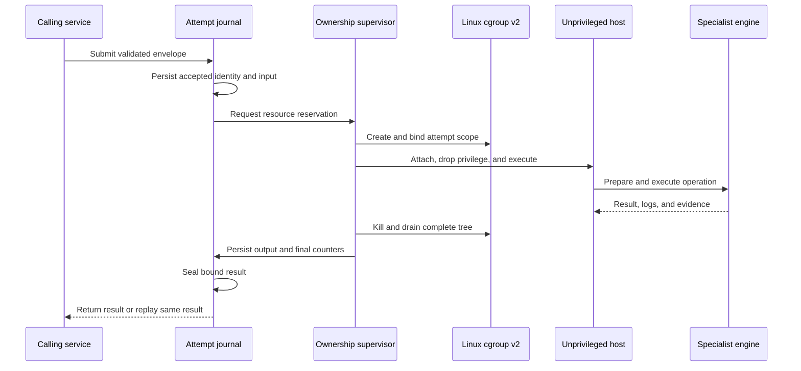
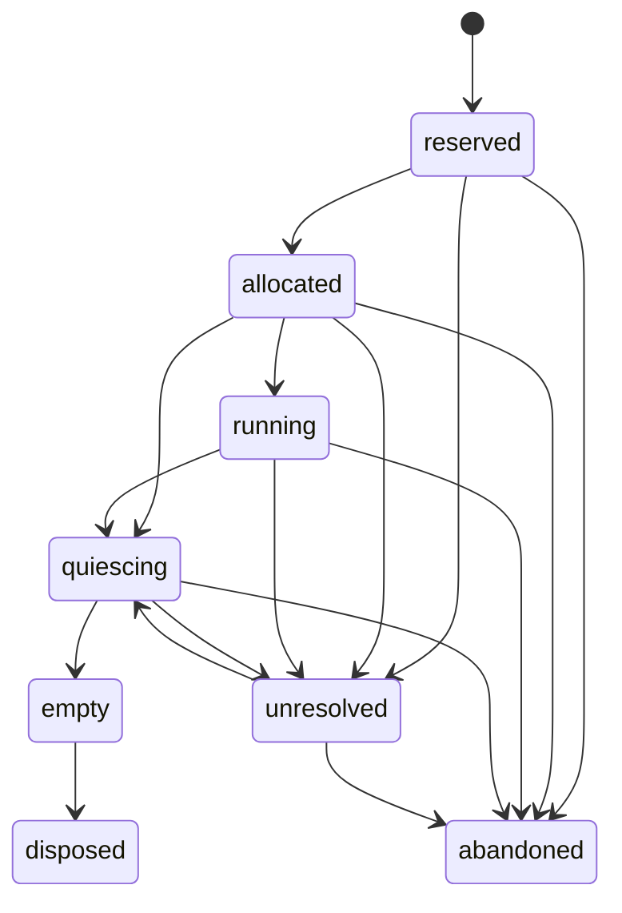

# Worker Core: From Claim To Durable Result

Status: implemented with stated native-host limits
Audience: Worker Core developer, specialist-engine developer, operator, security reviewer
Owner: Worker Core maintainers
Evidence: contracts/pipeline-worker-core/v1; skills/worker/core; skills/prism/server/native-worker-execution.ts; tests/verification/contracts/check-pipeline-worker-attempt-executor.mts; tests/verification/reliability
Evidence revision: `4f089958db97a551f406c157d774bda143a38946`
Applies to: Worker protocol v1, attempt envelopes v1-v3, generic execution, and Linux native execution
Last verified: source, contract, and focused test inspection on 2026-09-19

## Purpose

Worker Core runs one bounded attempt. It gives Buster, Prism, and a future
specialist engine the same rules for identity, limits, cancellation, logs,
evidence, cleanup, and terminal results.

Worker Core does not decide which pipeline node runs next. Nova owns that
decision. Worker Core also does not understand test policy or design policy.
The specialist engine owns that meaning.

This separation is deliberate. A memory limit must have the same meaning for a
test process and a design process. A test result and a design result must not
have the same domain meaning.

> **Core boundary**
>
> [The public package exports attempt mechanics, native process controls, ownership, trust helpers, and contract digests](https://github.com/datrab/kubeclaw/blob/4f089958db97a551f406c157d774bda143a38946/skills/worker/core/src/index.ts#L1-L52).
>
> [The operation interface keeps specialist execution behind prepare, execute, terminate, measure, cleanup, evidence, and finalization hooks](https://github.com/datrab/kubeclaw/blob/4f089958db97a551f406c157d774bda143a38946/skills/worker/core/worker/attempt-executor.ts#L30-L93).

## The Two Execution Layers

Worker Core has two related execution layers.

| Layer | Responsibility | Does not provide |
| --- | --- | --- |
| Neutral executor | Validate an envelope, call a specialist operation, enforce logical limits, control phase deadlines, and build a neutral result. | Host isolation or durable restart recovery by itself. |
| Native supervisor | Reserve a Linux cgroup, launch an unprivileged host, retain original output, prove process-tree termination, journal admission, and recover after restart. | Specialist message meaning, network identity, or pipeline scheduling. |

The neutral executor is portable TypeScript. The native supervisor is a Linux
host boundary. It requires cgroup v2, trusted root-managed files, a privileged
supervisor, and a fixed launcher.

A specialist engine can use the neutral executor without the native supervisor.
Prism uses both. Its privileged worker starts a separate unprivileged process.
That process runs the neutral executor with Prism's operation adapter.

> **Real integration**
>
> [The Prism supervisor constructs the journal, completes recovery, fixes the host command, and then exposes execution](https://github.com/datrab/kubeclaw/blob/4f089958db97a551f406c157d774bda143a38946/skills/prism/server/native-worker-execution.ts#L10-L49).
>
> [The unprivileged Prism host validates the v3 envelope and runs the neutral executor](https://github.com/datrab/kubeclaw/blob/4f089958db97a551f406c157d774bda143a38946/skills/prism/server/native-worker-host.ts#L13-L33).

## Attempt Flow

Text version: The journal accepts the immutable attempt before process launch.
The ownership supervisor reserves capacity and creates one kernel scope. The
launcher joins that scope before it runs specialist code. The host executes the
specialist operation. The supervisor then terminates and drains the full scope.
It stores original output and final counters before it seals and returns the
result.

This order chooses safety over availability. If the worker cannot prove process
ownership, output integrity, or durable state, it stops new admission. It does
not guess that lost work completed.

## Contract And Version Model

`worker-protocol.v1` is the message protocol in all current attempt envelopes.
The envelope and result schema versions can change without silently changing
that protocol identity.

| Version | Resource model | Intended use | Compatibility rule |
| --- | --- | --- | --- |
| Envelope/result v1 | Mandatory CPU, memory, and process numbers in `limits`. | Original local execution. | Existing v1 payloads remain valid. |
| Envelope/result v2 | Explicit requested or unrequested budgets and declared measurement capabilities. | Portable accounting when a metric can be measured, sampled, or unavailable. | Selection is explicit. No automatic conversion changes v1. |
| Envelope/result v3 | CPU time, peak memory, and Linux task budgets with measured native-tree capabilities. | Current native Linux execution. | A v3 result must repeat the accepted profile digest, attempt digest, budgets, capabilities, and identities. |

Linux tasks include processes, main threads, and additional threads. For this
reason, v3 uses `maximumTasks`. It does not rename the v1
`maximumProcesses` field while keeping its old meaning.

> **Version evidence**
>
> [The v2 types add explicit capabilities, budgets, observations, and result binding without changing v1](https://github.com/datrab/kubeclaw/blob/4f089958db97a551f406c157d774bda143a38946/contracts/pipeline-worker-core/v1/src/resource-types-v2.ts#L1-L24).
>
> [The v3 types define measured native-tree metrics and Linux task units](https://github.com/datrab/kubeclaw/blob/4f089958db97a551f406c157d774bda143a38946/contracts/pipeline-worker-core/v1/src/resource-types-v3.ts#L1-L31).
>
> [Separate JSON Schemas define the exact v1, v2, and v3 field constraints](https://github.com/datrab/kubeclaw/tree/4f089958db97a551f406c157d774bda143a38946/contracts/pipeline-worker-core/v1/schemas).

### Upgrade Rules

Do not infer a new version from fields. Read `schemaVersion` first. Validate
with the matching schema and relational validator. Reject an unknown version.

Keep stored envelopes in their accepted version. Do not rewrite a durable v1
attempt as v2 or v3. A producer can move to a new version only after the worker
profile, engine, caller, validator, result importer, and recovery tests support
that version.

The ownership store has one explicit compatibility path. It reads
`worker-ownership-store.v1`, adds a null final observation, and returns the v2
shape. It refuses legacy state when host identity cannot be proved.

> **Compatibility controls**
>
> [Envelope consistency permits only claim-expiry extension and rejects changes to identity, profile, protocol, or accepted specification](https://github.com/datrab/kubeclaw/blob/4f089958db97a551f406c157d774bda143a38946/contracts/pipeline-worker-core/v1/src/validation.ts#L247-L269).
>
> [Ownership decoding contains the only v1-to-v2 store conversion and validates every retained record](https://github.com/datrab/kubeclaw/blob/4f089958db97a551f406c157d774bda143a38946/skills/worker/core/worker/ownership-state.ts#L93-L122).

## Profiles And Engine Identity

A worker profile is an immutable promise about what one worker can execute.
It contains:

| Field | Meaning |
| --- | --- |
| `profileId` | Stable human and configuration identity for the profile. |
| `profileDigest` | Hash of the complete profile except this digest field. |
| `workerType` | Worker family. It must match the registration. |
| `coreContractId` | Worker Core contract expected by the integration. |
| `engine` | Engine ID, contract ID, engine version, and content digest. |
| `capabilities` | Operations that this exact profile supports. |
| `resourceCapabilities` | v2 or v3 measurement scope, unit, and method. |

The engine content digest prevents a mutable package name from standing in for
actual bytes. The profile digest binds the complete combination. A worker
accepts the digest, not a partial match on `profileId`.

The profile does not grant an operation. The envelope has a smaller
`grantedCapabilities` set. Each grant must exist in the profile. This lets a
caller select less authority for one attempt.

> **Identity validation**
>
> [The contract declares frozen package, engine, and profile identities](https://github.com/datrab/kubeclaw/blob/4f089958db97a551f406c157d774bda143a38946/contracts/pipeline-worker-core/v1/src/types.ts#L28-L49).
>
> [The validator recalculates the profile digest and rejects duplicate profile IDs](https://github.com/datrab/kubeclaw/blob/4f089958db97a551f406c157d774bda143a38946/contracts/pipeline-worker-core/v1/src/validation.ts#L66-L95).

### Registration And Readiness

A registration names `workerId`, `workerType`, `coreVersion`, supported protocol
versions, profiles, capacity, lifecycle state, start time, and send time.
Capacity contains `total`, `available`, and `active`. The validator requires
`available + active = total`.

Health repeats the worker ID, lifecycle, capacity, active attempt IDs, send
time, and a monotonic local sequence. The number of active IDs must equal
`capacity.active`.

The local runtime moves from `starting` to `ready`. It can then move to
`draining`, `stopped`, or `unhealthy`. It accepts work only in `ready`. It
rejects a new attempt when active work equals configured capacity.

The native owner has an additional readiness condition. It verifies the cgroup
pool identity, aggregate limits, domain type, counters, kill file, and scope
inventory. A verification failure closes admission.

> **Readiness evidence**
>
> [The local runtime constructs registration and health records from its live active-attempt map](https://github.com/datrab/kubeclaw/blob/4f089958db97a551f406c157d774bda143a38946/skills/worker/core/worker/local-runtime.ts#L89-L151).
>
> [The native pool verifies its filesystem identity and every configured aggregate limit](https://github.com/datrab/kubeclaw/blob/4f089958db97a551f406c157d774bda143a38946/skills/worker/core/worker/native-resource-pool.ts#L18-L58).

## Envelope And Attempt Identity

The attempt envelope is the complete accepted instruction. Its fields have four
groups.

| Group | Fields | Purpose |
| --- | --- | --- |
| Contract | `schemaVersion`, `protocolVersion` | Select exact validators and message rules. |
| Pipeline identity | `pipelineRunId`, `moduleId`, `gateId`, `planId`, `nodeId`, `executionId`, `attemptId`, `attemptNumber` | Connect the attempt to one compiled pipeline location and retry. |
| Immutable execution identity | `attemptSpecDigest`, `claim`, `profile`, `packages`, `grantedCapabilities` | Bind accepted work, owner, engine bytes, package bytes, and allowed operations. |
| Work and time | `limits`, optional `resourceBudgets`, `inputs`, `operation`, `cancellationId`, `issuedAt`, `queueDeadline` | Define bounded data, specialist schema, cancellation, and the admission window. |

Each value input has a name, schema ID, schema digest, and JSON value. Each
artifact input has a name and a reference with artifact ID, type, media type,
digest, byte size, and storage URL. The Core validates the reference. The
transport or artifact adapter must authenticate storage access and verify the
bytes.

The specialist operation has its own contract ID, input-schema ID,
input-schema digest, and values. Worker Core treats these values as typed JSON.
It does not interpret their domain meaning.

The `attemptSpecDigest` covers the envelope except the digest itself and the
claim. This choice permits a controller to renew a claim without changing the
work. Claim renewal can only extend `expiresAt`. It cannot change the claim ID,
generation, worker, or start time.

> **Envelope source**
>
> [The complete v1 envelope and limits are declared in the contract types](https://github.com/datrab/kubeclaw/blob/4f089958db97a551f406c157d774bda143a38946/contracts/pipeline-worker-core/v1/src/types.ts#L105-L154).
>
> [Relational validation binds the claim to the attempt, grants to the profile, and unique package and input identities](https://github.com/datrab/kubeclaw/blob/4f089958db97a551f406c157d774bda143a38946/contracts/pipeline-worker-core/v1/src/validation.ts#L115-L152).

### Wire Message Field Reference

The remaining public messages use the same attempt binding.

| Message | Complete field set | Important rule |
| --- | --- | --- |
| Progress | Schema and protocol versions; attempt, claim, generation, and worker IDs; sequence; state; message; percent; details; send time. | The message identity must match the accepted envelope. Percent can be null. |
| Log part | Schema and protocol versions; attempt, claim, generation, and worker IDs; sequence; stream; text; content digest; final flag; send time. | The text digest must match. The stream is `stdout`, `stderr`, or `system`. |
| Cancellation request | Schema and protocol versions; cancellation ID; attempt ID; request time; reason; and `forceAfterMs`. | Protocol, attempt, and cancellation IDs must match the envelope. The generic executor receives cancellation as an `AbortSignal`; a transport adapter must validate this message first. |
| Evidence reference | Evidence ID, type, and the complete artifact reference. | Evidence ID is unique within the result. Limits apply to count and total declared artifact bytes. |
| Specialist result | Schema ID, schema digest, and domain values. | The engine owns its schema. Core binds and bounds the payload but does not interpret it. |
| Cleanup result | `state` and nullable summary. | State is `not_required`, `completed`, or `failed`. A failed cleanup requires an errored attempt. |
| Error | Code and message. | Code selects machine behavior. Message is bounded diagnostic text. |
| Receipt reference | Receipt ID and receipt digest. | This is a local integrity aid. It is not caller or worker authentication. |

Worker Core also defines a signed trust envelope for a request or artifact. It
contains schema version, kind, issuer, audience, purpose, subject digest,
context digest, issue and expiry times, nonce, key ID, the `ed25519` algorithm,
and signature. Verification checks the expected issuer, audience, purpose,
time window, key type, and signature. The calling integration must still bind
the signed subject and context digests to the actual request or artifact.

> **Wire-contract evidence**
>
> [The contract types declare every progress, log, cancellation, evidence, specialist-result, cleanup, error, receipt, and trust-envelope field](https://github.com/datrab/kubeclaw/blob/4f089958db97a551f406c157d774bda143a38946/contracts/pipeline-worker-core/v1/src/types.ts#L8-L238).
>
> [Message and cancellation binding compare their identities with the accepted envelope](https://github.com/datrab/kubeclaw/blob/4f089958db97a551f406c157d774bda143a38946/contracts/pipeline-worker-core/v1/src/validation.ts#L220-L245).
>
> [Trust-envelope signing and verification use a domain-separated canonical message and Ed25519](https://github.com/datrab/kubeclaw/blob/4f089958db97a551f406c157d774bda143a38946/contracts/pipeline-worker-core/v1/src/trust.ts#L1-L44).

### Claims, Generation, And Duplicate Protection

A claim contains `claimId`, `attemptId`, positive `generation`, `workerId`,
`claimedAt`, and `expiresAt`. It is valid only when expiry is after claim time.
The worker must also verify that the claim belongs to its own worker ID.

`attemptId` identifies logical work. `generation` fences a later owner from an
earlier owner. The durable native identity also includes claim ID, profile
digest, and attempt-spec digest. This prevents a reused attempt ID from hiding
different bytes or authority.

The local runtime keeps accepted attempt IDs until their claim expiry. A repeat
is rejected. This replay cache is memory only. Its default maximum is 65,536
entries. Expired, inactive attempts are removed when another attempt arrives.
A process restart loses this local cache.

The native path gives stronger replay behavior. Its journal key binds worker
ID, attempt ID, and generation. An exact replay returns the sealed result. A
different envelope under the same key is an identity conflict. The ownership
store never reuses a disposed identity. A higher generation can proceed only
after every lower generation is `disposed` or `abandoned`.

> **Duplicate and generation evidence**
>
> [The local runtime checks state, capacity, worker, dates, protocol, profile, duplicate attempts, and replay capacity before execution](https://github.com/datrab/kubeclaw/blob/4f089958db97a551f406c157d774bda143a38946/skills/worker/core/worker/local-runtime.ts#L155-L205).
>
> [The ownership store rejects stale generations and requires previous ownership reconciliation](https://github.com/datrab/kubeclaw/blob/4f089958db97a551f406c157d774bda143a38946/skills/worker/core/worker/ownership-store.ts#L95-L120).

## Admission Before Execution

The neutral executor rejects work before it calls specialist code when:

- the queue deadline passed;
- the claim expired or is not active;
- the remaining claim window cannot cover execution and all enabled completion phases;
- a requested resource has no declared measurement capability;
- the envelope, profile digest, or attempt digest is invalid; or
- configured input or log bounds exceed Core hard limits.

`prepare` must be synchronous and must return `undefined`. It applies limits. It
must not start specialist work. This rule closes a race where asynchronous
preparation could continue after a deadline.

Native admission adds three durable steps. The journal persists the accepted
envelope. The resource pool reserves aggregate memory, task, and scope
capacity. The ownership store reserves a unique scope name and records its
kernel binding before launch.

If capacity is unavailable before ownership reservation, the worker seals an
explicit never-launched result. If persistence or ownership is uncertain, the
worker fences all later admission.

> **Admission evidence**
>
> [The executor performs time-window and measurement checks before prepare or execute](https://github.com/datrab/kubeclaw/blob/4f089958db97a551f406c157d774bda143a38946/skills/worker/core/worker/attempt-executor.ts#L240-L278).
>
> [Native execution persists admission, recovers prior state, matches accepted budgets, and seals capacity rejection](https://github.com/datrab/kubeclaw/blob/4f089958db97a551f406c157d774bda143a38946/skills/worker/core/worker/native-attempt-executor.ts#L20-L78).

## Specialist Execution Contract

An engine implements these hooks:

| Hook | Required | Rule |
| --- | --- | --- |
| `prepare` | Yes | Apply limits synchronously. Start no work. Return nothing. |
| `execute` | Yes | Run the domain operation. Honor the abort signal. Return summary, specialist result, evidence, exit code, and signal. |
| `terminate` | Yes | Stop all work that the adapter owns. It must be safe to call more than once. |
| `measure` | Yes | Return cumulative use for the complete owned scope. Later values cannot regress. |
| `cleanup` | No | Remove temporary specialist state after any execution outcome. |
| `collectEvidence` | No | Collect bounded evidence after execution and cleanup. It can report a collection error. |
| `finalizeResult` | No | Add facts derived from stored evidence before the terminal result becomes durable. |

Core calls the hooks in a fixed order. It measures after execution. It then
runs cleanup, closes logs, collects evidence, stores the full log, and finalizes
the specialist result. It measures again after these phases. Thus, the terminal
accounting includes completion work.

Progress callbacks and live log callbacks are best effort. A callback failure
does not change the terminal result. An engine must use durable evidence or its
own store for facts that must survive a disconnect.

## Progress, Logs, And Evidence

### Progress

Progress messages carry protocol, attempt, claim, generation, worker, sequence,
state, message, optional percent, details, and send time. Current executor
states are `accepted`, `started`, `running`, `cleanup_started`, and
`cleanup_completed`.

Sequence values are local to one executor. Delivery is best effort. The result,
not the last progress event, is the terminal authority.

### Neutral Logs

The neutral log API accepts `stdout`, `stderr`, or `system`. Byte input must be
valid streaming UTF-8. An incomplete final character or invalid encoding fails
the attempt.

Core divides decoded text into parts of at most 65,536 JavaScript characters.
It limits one attempt to 10,000 parts, 16 MiB of configured log allowance, and
the smaller envelope `logBytes` limit. Each retained part contains a digest of
its text. A final empty system part marks the end of live delivery.

If logs are retained and non-empty, `storeFullLog` is required. The returned
artifact digest and size must match the complete rendered log. The full log
also consumes evidence-file and evidence-byte allowance.

### Native Output Spool

The native supervisor treats process stdout and stderr as original binary
output. It creates two exclusive files with mode `0600` in a private directory.
It applies one combined byte limit. It pauses the host pipe while each append is
written and synchronized. It does not truncate or silently rotate output.

After the process tree is empty, the journal rereads both files and compares
their sizes and SHA-256 digests with the stored process record. There is no
automatic retention or deletion API in Worker Core. The deployment owner must
set storage retention outside this class.

Native stdout has another role. It must contain the specialist's JSON result.
Invalid JSON or an invalid result binding becomes a host failure. Stderr is
diagnostic output. Neither channel is a trusted result until the supervisor
validates and reseals it.

> **Output evidence**
>
> [The neutral executor bounds, digests, publishes, and stores logs before terminal result creation](https://github.com/datrab/kubeclaw/blob/4f089958db97a551f406c157d774bda143a38946/skills/worker/core/worker/attempt-executor.ts#L284-L341).
>
> [The private native spool synchronizes every append and refuses overflow](https://github.com/datrab/kubeclaw/blob/4f089958db97a551f406c157d774bda143a38946/skills/worker/core/worker/native-output-spool.ts#L14-L70).
>
> [Journal replay verifies retained output before it rebuilds a process result](https://github.com/datrab/kubeclaw/blob/4f089958db97a551f406c157d774bda143a38946/skills/worker/core/worker/native-attempt-journal.ts#L90-L113).

### Evidence

Each evidence item has an evidence ID, type, and artifact reference. Evidence
IDs must be unique. Artifact size totals must remain within `evidenceBytes`.
The item count must remain within `evidenceFiles`.

Worker Core validates metadata and limits. It does not upload or download the
artifact. The engine adapter owns that transport and must verify actual bytes
against `contentDigest`.

## Resource Policy And Accounting

### Portable Execution

v1 requires CPU milliseconds, memory bytes, and process limits. An adapter must
provide cumulative values for all three.

v2 makes each budget `requested` or `unrequested`. Its profile states whether a
metric is measured, sampled, or unavailable. Core refuses a requested budget
when the profile says that measurement is unavailable. A completed result
cannot claim success when a requested limit is missing or exceeded.

### Native Execution

v3 uses a cgroup v2 subtree for the complete attempt tree. It measures:

- CPU use from `cpu.stat usage_usec`;
- peak memory from `memory.peak`;
- peak tasks from `pids.peak`;
- live population from `cgroup.events populated`;
- OOM kills from `memory.events oom_kill`; and
- task-limit hits from `pids.events max`.

Missing, malformed, negative, or unsafe counters are errors. Core does not turn
a missing counter into zero. Final counters are valid only after the scope is
empty.

The host policy owns aggregate limits. An attempt can request less capacity. It
cannot change the pool path, pool limit, maximum active scopes, node identity,
or ownership location. Synchronous reservations include allocations that have
not yet created a process. This prevents concurrent requests from both seeing
the same free capacity.

CPU is controlled at the aggregate pool and observed per attempt. Memory and
tasks also have per-attempt kernel limits. Swap is set to zero, OOM grouping is
enabled, and `cgroup.kill` is required. The code does not use sampled host
metrics as a substitute for these counters.

> **Accounting evidence**
>
> [The native observer reads and validates the exact cgroup v2 counters](https://github.com/datrab/kubeclaw/blob/4f089958db97a551f406c157d774bda143a38946/skills/worker/core/worker/native-resource-observation.ts#L5-L67).
>
> [Scope creation installs memory, swap, OOM-group, and task limits before any process enters](https://github.com/datrab/kubeclaw/blob/4f089958db97a551f406c157d774bda143a38946/skills/worker/core/worker/native-resource-scope.ts#L57-L99).
>
> [The reservation counter enforces aggregate memory, task, and active-scope capacity](https://github.com/datrab/kubeclaw/blob/4f089958db97a551f406c157d774bda143a38946/skills/worker/core/worker/resource-reservations.ts#L3-L38).

## Native Launch And Trust Boundary

The native supervisor runs as real and effective UID 0. It must hold the Linux
`KILL`, `SETGID`, and `SETUID` capabilities. The launcher must be an absolute,
canonical, root-owned ordinary executable. Group or world write, setuid,
setgid, and a missing owner-execute bit are rejected.

The launcher is not setuid. Only the trusted supervisor can use it with the
required authority. Before it executes specialist code, it:

1. checks its supervisor PID and installs a parent-death signal;
2. validates the canonical cgroup v2 scope;
3. writes itself into the scope;
4. sets `KUBECLAW_NATIVE_SCOPE`;
5. clears supplementary groups;
6. changes real, effective, and saved GID and UID;
7. enables `NO_NEW_PRIVS`;
8. verifies the reduced identities;
9. restores the parent-death signal after the credential change; and
10. executes a supervisor-selected absolute program.

The attempt envelope never supplies the launcher, executable, UID, GID,
working directory, or environment. Trusted service configuration supplies
them.

This is process and resource isolation, not a complete sandbox. Worker Core
does not create a mount, network, PID, or user namespace. It does not install a
seccomp profile, change the root filesystem, or define filesystem allowlists.
The unprivileged host can access paths and networks that deployment policy gives
to its process. Kubernetes security context, mounts, network policy, and the
specialist adapter remain necessary boundaries.

There is also no independent Unix process-group contract. The cgroup is the
complete tree boundary. `SIGTERM` first targets the admitted host process.
Forced cleanup uses `cgroup.kill` to reach all descendants.

> **Launch evidence**
>
> [Startup verifies supervisor capabilities and launcher ownership and mode](https://github.com/datrab/kubeclaw/blob/4f089958db97a551f406c157d774bda143a38946/skills/worker/core/worker/native-supervisor-authority.ts#L1-L22).
>
> [The launcher joins the cgroup before execution, drops credentials, enables no-new-privileges, and closes the parent-death race](https://github.com/datrab/kubeclaw/blob/4f089958db97a551f406c157d774bda143a38946/skills/worker/core/worker/native-worker-launcher.c#L36-L85).

### Host And Runtime Identity

Host preparation writes a root-owned pool policy, node identity, and runtime
identity. The worker opens these files without following symbolic links. It
rejects writable, oversized, malformed, or wrong-role files.

The runtime identity binds the current boot ID and cgroup namespace device and
inode. Worker Core compares it with the actual process namespace. It never
enters a namespace based on the file. The node identity binds durable ownership
to one machine identity.

These checks prevent a moved state directory or substituted cgroup namespace
from looking like the old owner. They do not authenticate a remote caller.
SPIFFE or the service's HMAC boundary authenticates transport before Worker
Core admission.

## Native Control Channel

The optional native control channel is file descriptor 3 of the admitted host.
It is a local duplex pipe. Each message has a four-byte unsigned big-endian
length followed by that number of bytes.

Worker Core enforces a positive per-message limit and a positive total session
limit. A message cannot exceed the session limit. It serializes writes, permits
only one reader, rejects zero-length or oversized frames, and rejects a stream
that ends with an incomplete frame.

The channel does not define a message schema, authentication, ordering beyond
pipe order, acknowledgements, retries, or durable completion. The specialist
role owns those rules. The channel gets its peer identity from the process that
the trusted supervisor launched. It is not a network endpoint and must not be
presented as one.

If the control callback fails, the supervisor reports
`WORKER_NATIVE_CONTROL_FAILED` and stops the host. When the process closes, the
Core aborts the callback and waits only for `closeTimeoutMs`. An unsettled
callback fails cleanup.

> **Channel evidence**
>
> [The channel implements bounded framing, serialized writes, a single reader, and truncated-frame rejection](https://github.com/datrab/kubeclaw/blob/4f089958db97a551f406c157d774bda143a38946/skills/worker/core/worker/native-control-channel.ts#L3-L74).
>
> [Process control binds the channel to descriptor 3 and closes it with the process lifetime](https://github.com/datrab/kubeclaw/blob/4f089958db97a551f406c157d774bda143a38946/skills/worker/core/worker/native-process-control.ts#L5-L31).

## Deadlines, Cancellation, And Termination

Three times have different meanings:

| Time | Meaning | Failure |
| --- | --- | --- |
| `queueDeadline` | Latest time at which execution may start. | Interrupted without specialist work. |
| `limits.timeoutMs` | Maximum operation execution interval. | `timed_out`. |
| Claim `expiresAt` | End of this owner's authority. | `interrupted`; new effects must stop. |

The neutral executor requires enough claim time for execution and every enabled
completion phase. Each maintenance phase gets `cleanupTimeoutMs`. When work or
a phase ignores abort and does not settle, Core marks the result
`WORKER_PHASE_UNRESOLVED`. External effects then require reconciliation.

Cancellation aborts the specialist signal and calls `terminate`. Termination
has its own bounded wait. Cleanup still runs as maintenance work when possible.
A cleanup failure changes the attempt to `errored` even if domain execution
succeeded.

For a native process, cancellation sends `SIGTERM` to the host. The configured
close timeout gives the host a bounded period to close role-owned effects. The
supervisor then sends `SIGKILL` and drains the complete cgroup. A timeout,
resource violation, output failure, control failure, or process exit skips the
graceful cancellation step and begins forced close.

The native result is not sealed until `populated` is false. If the tree cannot
be proved empty, ownership becomes `unresolved`, admission closes, and no clean
result is invented.

> **Termination evidence**
>
> [The generic executor races execution with attempt, claim, and cancellation deadlines and quarantines unsettled work](https://github.com/datrab/kubeclaw/blob/4f089958db97a551f406c157d774bda143a38946/skills/worker/core/worker/attempt-executor.ts#L343-L458).
>
> [The native process applies graceful cancellation, forced closure, resource polling, and final tree drain](https://github.com/datrab/kubeclaw/blob/4f089958db97a551f406c157d774bda143a38946/skills/worker/core/worker/native-worker-process.ts#L60-L145).
>
> [The scope uses `cgroup.kill` and waits for an empty population before disposal](https://github.com/datrab/kubeclaw/blob/4f089958db97a551f406c157d774bda143a38946/skills/worker/core/worker/native-resource-scope.ts#L145-L178).

## Durable Ownership

The ownership store answers one question: which supervisor owns the native
scope for one attempt generation?

Its identity contains worker ID, attempt ID, claim ID, generation, profile
digest, and attempt-spec digest. Its binding contains scope name, boot ID,
filesystem device, and inode. Its revision supports compare-and-swap updates.

`reserved` means that the identity and scope name are durable but no kernel
binding exists. `allocated` adds the durable kernel binding. `running` is the
launch fence. `quiescing` blocks new starts. `empty` includes final kernel
counters. `disposed` means that the empty scope was removed. `unresolved`
means that the supervisor cannot prove a safe terminal state. `abandoned`
means that recovery proved no usable current-host scope, but it cannot produce
a normal completion result.

One process holds the supervisor lock for recovery and admission. Every update
uses a compare-and-swap against the complete prior record. The store accepts a
binding only in `reserved -> allocated`. It accepts final counters only once,
when entering `empty`. Terminal identities remain stored. This prevents
a stale request from starting the same identity again.

The store has fixed record and byte limits. It has no automatic compaction.
Capacity exhaustion is an operational stop. An operator must preserve audit
requirements when it defines external retention.

Worker Core does not implement an ownership heartbeat or a renewable ownership
lease. The local runtime publishes health records with a monotonic sequence,
but it has no method that renews an accepted, in-flight claim. The contract
permits a controller to present a candidate envelope with a later claim expiry;
this consistency rule does not implement delivery or acceptance of that
renewal. The local runtime rejects a repeat attempt while its replay entry is
active. Durable native ownership changes through compare-and-swap phase
transitions and kernel scope observation. An operator must not treat an old
health timestamp as proof that an owner is dead. Recovery proves the boot
identity, binding, and scope state or stops admission.

> **Ownership evidence**
>
> [Claim consistency permits only an expiry extension and rejects an identity or work change](https://github.com/datrab/kubeclaw/blob/4f089958db97a551f406c157d774bda143a38946/contracts/pipeline-worker-core/v1/src/validation.ts#L247-L269).
>
> [Local health reports a monotonic sequence but creates no durable ownership heartbeat](https://github.com/datrab/kubeclaw/blob/4f089958db97a551f406c157d774bda143a38946/skills/worker/core/worker/local-runtime.ts#L116-L151).
>
> [The ownership record and file store define identity, phases, binding, diagnosis, counters, locking, and compare-and-swap updates](https://github.com/datrab/kubeclaw/blob/4f089958db97a551f406c157d774bda143a38946/skills/worker/core/worker/ownership-store.ts#L10-L170).
>
> [The transition graph and strict record validator reject impossible stored states](https://github.com/datrab/kubeclaw/blob/4f089958db97a551f406c157d774bda143a38946/skills/worker/core/worker/ownership-state.ts#L5-L90).

## Attempt Journal And Commit Boundaries

The native attempt journal retains three durable facts:

1. the accepted envelope and acceptance time;
2. the completed native process record plus original output references; and
3. the sealed Worker result.

The first commit is the admission boundary. It stores the canonical envelope
blob before it appends the accepted identity. The journal reserves space for
input, output, result, and state before acceptance. It counts actual retained
files and pending reservations. Crash leftovers still consume capacity.

The second commit records the process only after stdout and stderr are flushed,
the process tree is empty, and final resource counters exist. The record stores
output digests and sizes rather than duplicating output bytes.

The third commit seals a validated result. A repeat can write only the same
result digest. The serving path returns no result before this commit completes.

The journal root must be an absolute private directory owned by the worker UID
with no group or other permissions. Record counts, state size, total bytes,
input bytes, output bytes, and result bytes all have configured positive limits.

> **Journal evidence**
>
> [The journal reserves bounded space, persists canonical input, verifies output, and seals a single result](https://github.com/datrab/kubeclaw/blob/4f089958db97a551f406c157d774bda143a38946/skills/worker/core/worker/native-attempt-journal.ts#L19-L179).
>
> [The journal-state validator defines its exact stored fields and rejects non-quiescent process records](https://github.com/datrab/kubeclaw/blob/4f089958db97a551f406c157d774bda143a38946/skills/worker/core/worker/native-journal-state.ts#L9-L73).

## Restart And Reconciliation

Native startup completes ownership recovery before it opens HTTP admission.
It inventories kernel scopes and durable records under one supervisor lock.

| Observed state | Recovery action |
| --- | --- |
| Terminal record and no scope | Keep the terminal identity. |
| Terminal record and a scope | Stop. A retired scope reappeared. |
| `empty` record and no scope | Move to `disposed`. |
| Unbound reservation and no scope | Mark `abandoned` as never launched. |
| Bound record from another boot and no scope | Mark `abandoned`; the prior result is unavailable. |
| Current bound record and matching scope | Reopen it, block launch, kill and drain it, store counters, and dispose it. |
| Scope without a record | Stop. Ownership is unknown. |
| Current record but missing scope | Stop. Safe termination cannot be proved. |
| Changed device, inode, boot, or scope name | Stop. The binding changed. |

After ownership recovery, the attempt journal is reconciled. A sealed result is
replayed. A stored process result is rebuilt only when the ownership record is
`disposed` and its final counters exactly match the process record. An accepted
attempt without a process result becomes an interrupted result only when
ownership proves that the scope is quiescent or was never launched.

Different-host storage is not accepted as local recovery. A persistent volume
can move while processes continue on the old machine. The store therefore
binds itself to the root-managed node identity. A boot-ID change is useful only
after that host identity is stable.

> **Recovery evidence**
>
> [Ownership recovery fences unknown, missing, changed, and cross-boot scopes before admission](https://github.com/datrab/kubeclaw/blob/4f089958db97a551f406c157d774bda143a38946/skills/worker/core/worker/native-worker-ownership.ts#L149-L283).
>
> [Attempt recovery requires matching durable ownership before it rebuilds or interrupts a result](https://github.com/datrab/kubeclaw/blob/4f089958db97a551f406c157d774bda143a38946/skills/worker/core/worker/native-attempt-recovery.ts#L9-L41).

## Result, Digest, And Receipt

A terminal result contains:

| Group | Fields |
| --- | --- |
| Version and binding | `schemaVersion`, `protocolVersion`, attempt ID, claim ID, claim generation, worker ID; v2/v3 also repeat profile and attempt-spec digests. |
| Outcome | state, start and completion times, duration, summary, specialist result, error, exit code, and signal. |
| Durable facts | evidence references, resource use, resource accounting in v2/v3, and cleanup result. |
| Integrity aids | `resultDigest` and local `receipt`. |

Terminal states are `completed`, `errored`, `cancelled`, `timed_out`, and
`interrupted`. A cleanup failure requires an `errored` result. A completed v3
result must have observed values within every requested budget. Evidence and
output sizes must match the accepted limits.

The result digest uses canonical JSON and SHA-256. It excludes the digest and
receipt fields. The local receipt hashes a namespace, receipt ID, and result
digest. These values detect accidental mutation and duplication.

They are not a cryptographic signature. They do not prove which process made
the result. They do not authenticate a remote worker. Transport identity,
claim-to-peer binding, and any artifact signature are separate controls. The
native supervisor improves local authority by rebuilding and resealing the
unprivileged host result after it proves tree termination. Its receipt is still
not a signature.

> **Result evidence**
>
> [The contract declares all result, resource, cleanup, error, digest, and receipt fields](https://github.com/datrab/kubeclaw/blob/4f089958db97a551f406c157d774bda143a38946/contracts/pipeline-worker-core/v1/src/types.ts#L181-L238).
>
> [The native supervisor parses the provisional host result, binds it to the envelope, applies final counters, and creates its own seal](https://github.com/datrab/kubeclaw/blob/4f089958db97a551f406c157d774bda143a38946/skills/worker/core/worker/native-result.ts#L7-L75).

## Error Reference And Retry Decisions

Error codes describe the boundary that failed. They do not by themselves grant
permission to retry. The caller must first know whether an identity was
accepted and whether owned work can still exist.

| Code family | Included codes | Required response |
| --- | --- | --- |
| Admission and local runtime | `WORKER_QUEUE_DEADLINE_EXPIRED`, `WORKER_CLAIM_NOT_ACTIVE`, `WORKER_CLAIM_EXPIRED`, `WORKER_CLAIM_WINDOW_INSUFFICIENT`, `WORKER_LOCAL_NOT_READY`, `WORKER_LOCAL_CAPACITY_EXHAUSTED`, `WORKER_LOCAL_CLAIM_WORKER_MISMATCH`, `WORKER_LOCAL_PROTOCOL_UNSUPPORTED`, `WORKER_LOCAL_PROFILE_UNSUPPORTED`, `WORKER_LOCAL_ATTEMPT_DUPLICATE`, `WORKER_LOCAL_REPLAY_CAPACITY_EXHAUSTED` | Retry capacity or readiness failures only with controller policy. Use a new claim generation for reassignment. Do not retry an exact expired claim. |
| Attempt execution | `WORKER_ATTEMPT_CANCELLED`, `WORKER_ATTEMPT_TIMEOUT`, `WORKER_ATTEMPT_ERROR`, `WORKER_PREPARATION_INVALID`, `WORKER_PHASE_UNRESOLVED`, `WORKER_TERMINATION_FAILED`, `WORKER_TERMINATION_TIMEOUT`, `WORKER_CLEANUP_FAILED` | Treat unresolved, termination, and cleanup failures as reconciliation conditions. A normal retry can duplicate external effects. |
| Content and limits | `WORKER_LOG_LIMIT`, `WORKER_LOG_UTF8_INVALID`, `WORKER_RESULT_LIMIT`, `WORKER_EVIDENCE_FILE_LIMIT`, `WORKER_EVIDENCE_BYTE_LIMIT`, `WORKER_EVIDENCE_ID_DUPLICATE`, `WORKER_OPERATION_RESULT_INVALID`, `WORKER_TERMINAL_RESULT_INVALID`, `WORKER_FULL_LOG_STORE_REQUIRED`, `WORKER_FULL_LOG_INTEGRITY_MISMATCH`, `WORKER_LOG_STORE_FAILED`, `WORKER_EVIDENCE_COLLECTION_FAILED`, `WORKER_RESULT_FINALIZATION_FAILED` | Fix input, engine behavior, or configured bounds. Blind retry with the same specification is not useful. |
| Resource accounting | `WORKER_CPU_LIMIT`, `WORKER_MEMORY_LIMIT`, `WORKER_PROCESS_LIMIT`, `WORKER_TASK_LIMIT`, `WORKER_RESOURCE_LIMIT`, `WORKER_RESOURCE_MEASUREMENT_INVALID`, `WORKER_RESOURCE_MEASUREMENT_UNAVAILABLE`, `WORKER_ACCOUNTING_POLICY_MISSING`, `WORKER_NATIVE_ACCOUNTING_POLICY_MISSING` | Preserve the failure result. Change a budget only through a new accepted specification. Missing or invalid measurement fails closed. |
| Native admission and process | `WORKER_NATIVE_ACCEPTED_LIMIT_MISMATCH`, `WORKER_NATIVE_CLAIM_NOT_ACTIVE`, `WORKER_NATIVE_CAPACITY_EXCEEDED`, `WORKER_NATIVE_CAPACITY_REJECTION_OWNERSHIP_CONFLICT`, `WORKER_NATIVE_ADMISSION_FENCED`, `WORKER_NATIVE_INPUT_LIMIT`, `WORKER_NATIVE_OUTPUT_LIMIT`, `WORKER_NATIVE_PROCESS_START_FAILED`, `WORKER_NATIVE_PROCESS_INPUT_FAILED`, `WORKER_NATIVE_PROCESS_FAILED`, `WORKER_NATIVE_PROCESS_DRAIN_TIMEOUT` | Capacity rejection is replayable after its sealed never-launched result. Fencing or ownership conflict requires operator diagnosis. |
| Native control and launch | `WORKER_NATIVE_CONTROL_CONFIG_INVALID`, `WORKER_NATIVE_CONTROL_CLOSED`, `WORKER_NATIVE_CONTROL_INPUT_LIMIT`, `WORKER_NATIVE_CONTROL_OUTPUT_LIMIT`, `WORKER_NATIVE_CONTROL_MESSAGE_LIMIT`, `WORKER_NATIVE_CONTROL_TRUNCATED`, `WORKER_NATIVE_CONTROL_READER_ALREADY_USED`, `WORKER_NATIVE_CONTROL_FAILED`, `WORKER_NATIVE_CONTROL_UNSETTLED`, `WORKER_NATIVE_LAUNCH_FENCED`, `WORKER_NATIVE_LAUNCHER_DRAIN_TIMEOUT`, `WORKER_NATIVE_LAUNCH_ARGUMENTS_INVALID`, `WORKER_NATIVE_LAUNCH_SCOPE_INVALID`, `WORKER_NATIVE_LAUNCH_MEMBERSHIP_INVALID`, `WORKER_NATIVE_LAUNCH_ATTACH_FAILED`, `WORKER_NATIVE_LAUNCH_PARENT_REQUIRED`, `WORKER_NATIVE_LAUNCH_PARENT_LOST`, `WORKER_NATIVE_LAUNCH_IDENTITY_INVALID`, `WORKER_NATIVE_LAUNCH_DROP_PRIVILEGE_FAILED`, `WORKER_NATIVE_LAUNCH_PRIVILEGE_RETAINED`, `WORKER_NATIVE_LAUNCH_EXEC_FAILED` | Treat as host-policy, role-protocol, or trusted-launch defects. Do not expose a new attempt until the supervisor remains authoritative. |
| Journal and spool | `WORKER_NATIVE_ATTEMPT_BUSY`, `WORKER_NATIVE_JOURNAL_CONFIG_INVALID`, `WORKER_NATIVE_JOURNAL_INPUT_LIMIT`, `WORKER_NATIVE_JOURNAL_CAPACITY_EXCEEDED`, `WORKER_NATIVE_JOURNAL_IDENTITY_CONFLICT`, `WORKER_NATIVE_JOURNAL_ENVELOPE_SIZE_CHANGED`, `WORKER_NATIVE_JOURNAL_OUTPUT_CHANGED`, `WORKER_NATIVE_JOURNAL_OUTPUT_INCOMPLETE`, `WORKER_NATIVE_JOURNAL_RESULT_SIZE_CHANGED`, `WORKER_NATIVE_JOURNAL_RESULT_BINDING_INVALID`, `WORKER_NATIVE_JOURNAL_RESULT_LIMIT`, `WORKER_NATIVE_JOURNAL_RESULT_ALREADY_SEALED`, `WORKER_OUTPUT_SPOOL_CONFIG_INVALID`, `WORKER_OUTPUT_SPOOL_LIMIT`, `WORKER_OUTPUT_SPOOL_FILE_INVALID`, `WORKER_NATIVE_OUTPUT_PERSISTENCE_FAILED` | `ATTEMPT_BUSY` can be retried with backoff. Capacity needs retention or larger storage. Integrity, identity, or persistence errors fence admission. |
| Ownership and recovery | `WORKER_OWNERSHIP_CONFLICT`, `WORKER_OWNERSHIP_STALE_GENERATION`, `WORKER_OWNERSHIP_RECONCILIATION_REQUIRED`, `WORKER_OWNERSHIP_CAS_CONFLICT`, `WORKER_NATIVE_UNKNOWN_SCOPE`, `WORKER_NATIVE_OWNED_SCOPE_MISSING`, `WORKER_NATIVE_SCOPE_BINDING_CHANGED`, `WORKER_NATIVE_RECOVERY_IDENTITY_CONFLICT`, `WORKER_NATIVE_JOURNAL_OWNERSHIP_UNPROVEN`, `WORKER_NATIVE_RECOVERY_NOT_QUIESCENT`, `WORKER_NATIVE_SUPERVISOR_UNRESOLVED`, `WORKER_NATIVE_INTERRUPTED_RESULT_UNAVAILABLE`, `WORKER_NATIVE_BOOT_CHANGED_RESULT_UNAVAILABLE` | Stop admission. Inspect durable record, node identity, boot identity, and cgroup inventory. Never delete evidence merely to make readiness green. |
| Host policy and cgroup | `WORKER_NATIVE_SUPERVISOR_AUTHORITY_REQUIRED`, `WORKER_NATIVE_LAUNCHER_PATH_INVALID`, `WORKER_NATIVE_LAUNCHER_NOT_TRUSTED`, `WORKER_NATIVE_POOL_POLICY_PATH_REQUIRED`, `WORKER_NATIVE_POOL_POLICY_NOT_TRUSTED`, `WORKER_NATIVE_POOL_POLICY_INVALID`, `WORKER_NATIVE_RUNTIME_IDENTITY_NOT_TRUSTED`, `WORKER_NATIVE_HOST_CGROUP_NAMESPACE_REQUIRED`, `WORKER_NATIVE_NODE_IDENTITY_NOT_TRUSTED`, `WORKER_NATIVE_ROOT_INVALID`, `WORKER_NATIVE_ROOT_POPULATED`, `WORKER_NATIVE_ROOT_NOT_DELEGATED`, `WORKER_NATIVE_POOL_IDENTITY_CHANGED`, `WORKER_NATIVE_POOL_LIMIT_MISMATCH`, `WORKER_NATIVE_POOL_DOMAIN_REQUIRED`, `WORKER_NATIVE_COUNTER_MISSING`, `WORKER_NATIVE_COUNTER_INVALID`, `WORKER_NATIVE_COUNTER_OVERFLOW` | Correct host setup and run preflight again. These failures are not attempt failures. |

Configuration validators also emit `*_CONFIG_INVALID`, `*_LIMIT_INVALID`,
`*_PATH_INVALID`, `*_STATE_INVALID`, `*_RECORD_INVALID`, and
`*_TRANSITION_INVALID` variants for the named subsystem. Treat these as
configuration, stored-state, or programmer defects. The linked implementations
are the exhaustive authority for exact spelling.

The following list completes the Worker Core code inventory. It includes the
more specific validation and recovery codes that the response table groups by
operator action.

| Subsystem | Additional exact codes |
| --- | --- |
| Generic input and phases | `WORKER_ATTEMPT_INPUT_BYTE_LIMIT`, `WORKER_ATTEMPT_INPUT_NODE_LIMIT`, `WORKER_ATTEMPT_INPUT_DEPTH_LIMIT`, `WORKER_ATTEMPT_INPUT_TYPE_INVALID`, `WORKER_ATTEMPT_INPUT_CYCLE`, `WORKER_RESULT_BYTE_LIMIT`, `WORKER_RESULT_NODE_LIMIT`, `WORKER_RESULT_DEPTH_LIMIT`, `WORKER_RESULT_TYPE_INVALID`, `WORKER_RESULT_CYCLE`, `WORKER_LOG_LIMIT_INVALID`, `WORKER_RECEIPT_NAMESPACE_INVALID`, `WORKER_RESOURCE_MEASUREMENT_TIMEOUT`, `WORKER_CLEANUP_TIMEOUT`, `WORKER_EVIDENCE_COLLECTION_TIMEOUT`, `WORKER_LOG_STORE_TIMEOUT`, `WORKER_RESULT_FINALIZATION_TIMEOUT`, `WORKER_FINAL_RESOURCE_MEASUREMENT_TIMEOUT` |
| Local runtime configuration and lifecycle | `WORKER_LOCAL_CAPACITY_INVALID`, `WORKER_LOCAL_DRAIN_TIMEOUT_INVALID`, `WORKER_LOCAL_CANCELLATION_TIMEOUT_INVALID`, `WORKER_LOCAL_REPLAY_LIMIT_INVALID`, `WORKER_LOCAL_TRANSITION_INVALID`, `WORKER_LOCAL_CLAIM_NOT_ACTIVE`, `WORKER_LOCAL_CLAIM_EXPIRED`, `WORKER_LOCAL_QUEUE_DEADLINE_EXPIRED`, `WORKER_LOCAL_ACTIVE_ATTEMPTS`, `WORKER_LOCAL_DRAIN_CANCELLED`, `WORKER_LOCAL_DRAIN_TIMEOUT` |
| Native process and scope | `WORKER_NATIVE_PROCESS_LIMIT_INVALID`, `WORKER_NATIVE_PROCESS_TIMER_INVALID`, `WORKER_NATIVE_OUTPUT_LIMIT_INVALID`, `WORKER_NATIVE_CANCELLATION_DEADLINE_INVALID`, `WORKER_NATIVE_DRAIN_LIMIT_INVALID`, `WORKER_NATIVE_DRAIN_TIMEOUT`, `WORKER_NATIVE_CAPACITY_INVALID`, `WORKER_NATIVE_LIMIT_INVALID`, `WORKER_NATIVE_LIMIT_MISMATCH`, `WORKER_NATIVE_CGROUP_REQUIRED`, `WORKER_NATIVE_OBSERVATION_INVALID`, `WORKER_NATIVE_POPULATED_INVALID`, `WORKER_NATIVE_SCOPE_NAME_INVALID`, `WORKER_NATIVE_SCOPE_NOT_EMPTY`, `WORKER_NATIVE_SCOPE_QUIESCING`, `WORKER_NATIVE_SCOPE_NOT_QUIESCENT`, `WORKER_NATIVE_SCOPE_DISPOSED`, `WORKER_NATIVE_SCOPE_IDENTITY_CHANGED`, `WORKER_NATIVE_UNBOUND_SCOPE_POPULATED`, `WORKER_NATIVE_SETUP_CLEANUP_FAILED`, `WORKER_NATIVE_RESULT_SCOPE_POPULATED` |
| Native result and control completion | `WORKER_NATIVE_RESULT_INVALID_JSON`, `WORKER_NATIVE_RESULT_BINDING_INVALID`, `WORKER_NATIVE_FINAL_RESULT_INVALID`, `WORKER_NATIVE_CONTROL_PROCESS_CLOSED`, `WORKER_NATIVE_CONTROL_UNSETTLED` |
| Native spool and journal structure | `WORKER_OUTPUT_CHANNEL_INVALID`, `WORKER_OUTPUT_SPOOL_CLOSED`, `WORKER_OUTPUT_SPOOL_CREATE_FAILED`, `WORKER_NATIVE_JOURNAL_NOT_PRIVATE`, `WORKER_NATIVE_JOURNAL_BLOB_INVALID`, `WORKER_NATIVE_JOURNAL_STATE_INVALID`, `WORKER_NATIVE_JOURNAL_ENVELOPE_DIGEST_INVALID`, `WORKER_NATIVE_JOURNAL_COMPLETION_TIME_INVALID`, `WORKER_NATIVE_JOURNAL_PROCESS_INVALID`, `WORKER_NATIVE_JOURNAL_PROCESS_NOT_QUIESCENT`, `WORKER_NATIVE_JOURNAL_EXIT_INVALID`, `WORKER_NATIVE_JOURNAL_MISSING_PROCESS_FAILURE`, `WORKER_NATIVE_JOURNAL_FAULT_INVALID`, `WORKER_NATIVE_JOURNAL_PATH_INVALID`, `WORKER_NATIVE_JOURNAL_PROCESS_ALREADY_RECORDED`, `WORKER_NATIVE_JOURNAL_RESERVATION_REQUIRED`, `WORKER_NATIVE_JOURNAL_RECOVERY_REQUIRED` |
| Ownership record and transitions | `WORKER_OWNERSHIP_CONFIG_INVALID`, `WORKER_OWNERSHIP_RECORD_INVALID`, `WORKER_OWNERSHIP_IDENTITY_INVALID`, `WORKER_OWNERSHIP_GENERATION_INVALID`, `WORKER_OWNERSHIP_DIGEST_INVALID`, `WORKER_OWNERSHIP_BINDING_INVALID`, `WORKER_OWNERSHIP_BINDING_REQUIRED`, `WORKER_OWNERSHIP_RESERVED_BINDING`, `WORKER_OWNERSHIP_DIAGNOSIS_INVALID`, `WORKER_OWNERSHIP_DIAGNOSIS_REQUIRED`, `WORKER_OWNERSHIP_FINAL_OBSERVATION_INVALID`, `WORKER_OWNERSHIP_STORE_INVALID`, `WORKER_OWNERSHIP_HOST_IDENTITY_INVALID`, `WORKER_OWNERSHIP_BOOT_IDENTITY_INVALID`, `WORKER_OWNERSHIP_DIFFERENT_HOST_UNRESOLVED`, `WORKER_OWNERSHIP_LEGACY_HOST_UNPROVEN`, `WORKER_OWNERSHIP_DUPLICATE`, `WORKER_OWNERSHIP_CAPACITY_EXCEEDED`, `WORKER_OWNERSHIP_PHASE_INVALID`, `WORKER_OWNERSHIP_TRANSITION_INVALID`, `WORKER_OWNERSHIP_REBIND_FORBIDDEN`, `WORKER_OWNERSHIP_OBSERVATION_REWRITE_FORBIDDEN` |
| Native ownership recovery | `WORKER_NATIVE_IDENTITY_ALREADY_USED`, `WORKER_NATIVE_RECONCILIATION_RECORD_FAILED`, `WORKER_NATIVE_RETIRED_SCOPE_REAPPEARED`, `WORKER_NATIVE_UNBOUND_SCOPE_UNRESOLVED`, `WORKER_NATIVE_TERMINAL_COUNTERS_CHANGED`, `WORKER_NATIVE_ALLOCATION_NOT_LAUNCHED`, `WORKER_NATIVE_RESERVATION_NOT_LAUNCHED`, `WORKER_NATIVE_UNKNOWN_FAILURE` |
| Trusted launcher and policy | `WORKER_NATIVE_SUPERVISOR_IDENTITY_REQUIRED`, `WORKER_NATIVE_LAUNCH_CLOSE_FAILED`, `WORKER_NATIVE_LAUNCH_ENVIRONMENT_FAILED`, `WORKER_NATIVE_NODE_IDENTITY_PATH_REQUIRED`, `WORKER_NATIVE_NODE_IDENTITY_INVALID`, `WORKER_NATIVE_RUNTIME_IDENTITY_PATH_REQUIRED`, `WORKER_NATIVE_POOL_POLICY_PATH_INVALID`, `WORKER_NATIVE_POOL_POLICY_LIMIT_INVALID`, `WORKER_NATIVE_POOL_CPU_INVALID` |
| Remote trust | `WORKER_TRUST_PRIVATE_KEY_INVALID`, `WORKER_TRUST_PEER_MISSING`, `WORKER_TRUST_PEER_INVALID`, `WORKER_TRUST_PEER_FORBIDDEN`, `WORKER_TRUST_POLICY_INVALID`, `WORKER_TRUST_PROXY_REQUIRED` |

Some generic validation codes are constructed from a fixed prefix and suffix.
The suffix set is `BYTE_LIMIT`, `NODE_LIMIT`, `DEPTH_LIMIT`, `TYPE_INVALID`,
and `CYCLE`. Phase timeout codes are also constructed from the fixed phase name
and `TIMEOUT`. They are stable machine codes even though one source statement
constructs them.

> **Error authorities**
>
> [Generic execution defines attempt, content, completion, and result failure precedence](https://github.com/datrab/kubeclaw/blob/4f089958db97a551f406c157d774bda143a38946/skills/worker/core/worker/attempt-executor.ts#L95-L106).
>
> [Native process control defines process, output, control, deadline, and resource fault selection](https://github.com/datrab/kubeclaw/blob/4f089958db97a551f406c157d774bda143a38946/skills/worker/core/worker/native-worker-process.ts#L43-L145).
>
> [Ownership transitions and validation define durable-state failures](https://github.com/datrab/kubeclaw/blob/4f089958db97a551f406c157d774bda143a38946/skills/worker/core/worker/ownership-state.ts#L11-L122).

### Safe Retry Table

| Proven fact | Safe next action |
| --- | --- |
| Request was rejected before durable admission. | Retry according to caller policy. Keep the same attempt specification only if it is still valid. |
| Journal contains a sealed result. | Replay and return that exact result. Do not execute again. |
| Journal accepted the attempt and ownership proves never launched. | Return the sealed interrupted result. The controller can decide on a higher generation. |
| Current scope was found and drained, but no process result exists. | Return an interrupted result with final observations. Reconcile external effects before a higher generation. |
| Ownership or scope is unknown, changed, live, or inconsistent. | Stop. Fence admission and require operator action. |
| Generic execution reports an unresolved phase. | Assume external effects can exist. Reconcile before retry. |

## Extension Contract For A New Engine

A new engine is a source and packaging integration. Worker Core has no dynamic
engine loader or installable engine manifest.

Use this sequence:

1. Define a versioned specialist operation contract and schemas.
2. Create an immutable engine identity with engine ID, contract ID, version,
   and content digest.
3. Create the worker profile. Declare only supported capabilities and real
   resource measurement.
4. Select envelope v1, v2, or v3 explicitly. Use v3 only for the native Linux
   tree model.
5. Implement all required operation hooks. Make `terminate` and `cleanup`
   safe after partial work and repeated calls.
6. Keep launcher commands, UID, GID, paths, credentials, and network endpoints
   in trusted service configuration. Do not read them from the envelope.
7. Bound input, result, logs, evidence, time, memory, tasks, journal storage,
   control messages, and active scopes.
8. Bind every returned result to attempt, claim, generation, worker, profile,
   specification, budgets, and capabilities.
9. Integrate startup recovery before readiness and admission.
10. Add the engine to its exact runtime role. Do not add Worker execution
    authority to Nova.
11. Test valid execution, every admission rejection, duplicate replay, higher
    generation, timeout, cancellation, resource violation, cleanup failure,
    restart at each commit boundary, corrupted state, changed host identity,
    and full storage.
12. Test the deployment boundary on a real cgroup v2 host. In-memory tests do
    not prove kernel accounting or termination.

The main rejected alternative is to put specialist policy in Core. That would
make every Core release depend on every test or design feature. Another
rejected alternative is to let the request choose a command. That would turn a
bounded worker into a remote command service.

> **Extension examples**
>
> [Prism binds its five known operations and exact request and result schemas outside Worker Core](https://github.com/datrab/kubeclaw/blob/4f089958db97a551f406c157d774bda143a38946/skills/prism/engine/worker-binding.ts#L8-L49).
>
> [Runtime-surface tests prove that Worker execution is exported by worker roles and not by Nova](https://github.com/datrab/kubeclaw/blob/4f089958db97a551f406c157d774bda143a38946/tests/verification/contracts/check-pipeline-runtime-role-surfaces.mts#L1-L24).

## Verification Map

Use the smallest relevant check first. Then run the complete Worker suites.

| Concern | Maintained proof |
| --- | --- |
| Contract fields, digests, bindings, and schemas | [Worker contract check](https://github.com/datrab/kubeclaw/blob/4f089958db97a551f406c157d774bda143a38946/tests/verification/contracts/check-pipeline-worker-core-contracts.mts) |
| Neutral hook order, limits, evidence, logs, cancellation, and result sealing | [Attempt executor check](https://github.com/datrab/kubeclaw/blob/4f089958db97a551f406c157d774bda143a38946/tests/verification/contracts/check-pipeline-worker-attempt-executor.mts) |
| Registration, health, capacity, duplicate protection, drain, and claim expiry | [Local runtime check](https://github.com/datrab/kubeclaw/blob/4f089958db97a551f406c157d774bda143a38946/tests/verification/contracts/check-pipeline-worker-local-runtime.mts) |
| Control framing and session bounds | [Control-channel test](https://github.com/datrab/kubeclaw/blob/4f089958db97a551f406c157d774bda143a38946/tests/verification/reliability/worker-control-channel.test.mts) |
| Journal replay, storage bounds, conflict, and corruption | [Native journal test](https://github.com/datrab/kubeclaw/blob/4f089958db97a551f406c157d774bda143a38946/tests/verification/reliability/worker-native-journal.test.mts) |
| Ownership phases, generations, restart recovery, and fencing | [Ownership-store test](https://github.com/datrab/kubeclaw/blob/4f089958db97a551f406c157d774bda143a38946/tests/verification/reliability/worker-ownership-store.test.mts) |
| Native output durability and bounds | [Output-spool test](https://github.com/datrab/kubeclaw/blob/4f089958db97a551f406c157d774bda143a38946/tests/verification/reliability/worker-output-spool.test.mts) |
| Native contracts and terminal resource binding | [Native contract test](https://github.com/datrab/kubeclaw/blob/4f089958db97a551f406c157d774bda143a38946/tests/verification/reliability/worker-native-contract.test.mts) and [terminal-resource test](https://github.com/datrab/kubeclaw/blob/4f089958db97a551f406c157d774bda143a38946/tests/verification/reliability/worker-terminal-resources.test.mts) |
| Real cgroup v2 launch, kill, drain, counters, and replay | [Native scope live test](https://github.com/datrab/kubeclaw/blob/4f089958db97a551f406c157d774bda143a38946/tests/verification/reliability/worker-native-scope-live.mts) |
| Root-owned launcher behavior | [Launcher test](https://github.com/datrab/kubeclaw/blob/4f089958db97a551f406c157d774bda143a38946/tests/verification/reliability/worker-native-launcher.test.mts) |

Most contract tests run without root. Native scope and launcher tests need a
compatible Linux host, delegated cgroup v2 controllers, and the required
supervisor authority. A skipped host test is not live proof.

## Current Limits

- The current implementation supports only `worker-protocol.v1`.
- Local runtime duplicate memory does not survive a process restart. Use the
  native journal when restart-safe replay is required.
- The native control channel supplies framing only. A role must define and test
  message semantics and durable acknowledgements.
- Worker Core does not provide artifact storage, artifact signatures, remote
  transport authentication, or claim assignment.
- Result digests and receipts are integrity aids, not signatures.
- The native boundary does not provide a complete filesystem or network
  sandbox.
- Ownership and attempt journals have fixed capacity and no internal retention
  policy.
- A moved persistent volume cannot prove that work on the old node stopped.
  Recovery therefore fails closed across an unproved host change.
- Live cgroup and launcher behavior needs host-level verification. Source and
  unit tests alone cannot prove it.

## Related Reading

- [Components and Authority](components-and-authority.md) places Worker Core
  below Nova and specialist engines.
- [Worker Trust](worker-trust.md) explains authenticated remote transport.
- [Deployment and Trust](deployment-and-trust.md) explains workload, network,
  and storage boundaries.
- [Extend Hosts, Worker Engines, And Runtime Roles](../extend/host-and-engine.md)
  gives the implementation path for a new specialist engine.
- [Operate](../use/operate.md) gives the operator recovery and diagnosis path.
